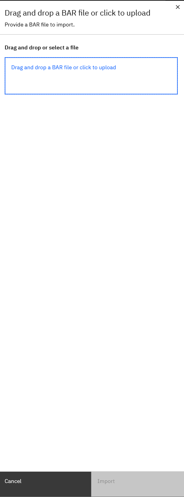

# Installing ACE 13.x on Minikube: Filling in the Blanks

Even though we hardly ever see it, IBM App Connect Enterprise (ACE) is perfectly capable of running on plain Kubernetes. But let’s be honest, it looks much fancier on OpenShift 😉. If you're not using OpenShift or a Cloud Pak install, getting it all up and running becomes a much more hands-on operation.

In this blog, I’ll be deploying ACE 13.x manually on Minikube, including the Operator, Dashboard, and a runtime. Along the way, I’ll share the practical steps, issues I ran into, and the patches or tweaks I made to get it working. If you’re running outside the officially supported clusters or on NOKS (that is Non-OpenShift Kubernetes), this should help you dodge a few potholes.


## Assumptions

This post assumes:

* You already have Kubernetes and Helm installed
* You’re working with a functional cluster (Minikube or alternative)
* You know your way around `kubectl`, YAML, and k8s cluster basics

Getting started with Minikube? Or simply don't have Kubernetes or Helm installed, I’ve dropped a couple of reference links at the bottom.


## Step 0: Optimizing My Local Setup

Before touching the cluster, let’s make our shell faster to work with and create a dedicated namespace.

Set aliases for my most used commands (I'm doing this in powershell):

```powershell
# Alias for kubectl to save keystrokes
> Set-Alias -Name k -Value kubectl

# Alias for minikube for quick commands
> Set-Alias -Name m -Value minikube
```

If you don't want to set them each time you open a new session, make them persistent. Open up the powershell profile file (or create it if it doesn't exist yet):

```powershell
> notepad $PROFILE
```

Paste both alias lines into the file and save.

```
Set-Alias -Name k -Value kubectl
Set-Alias -Name m -Value minikube

```


Create a dedicated namespace, ace-demo, for our setup and make that namespace the default one (saves you from typing -n ace-demo each time):

```bash
> kubectl create namespace ace-demo
> kubectl config set-context --current --namespace=ace-demo
```


## Step 1: Add the IBM Helm Chart Repo

Before we can install the Operator, we need the source. Adding IBM’s Helm repo ensures we’re pulling the official charts and latest versions.

```bash
> helm repo add ibm-helm https://icr.io/helm/ibm-charts
> helm repo update
```


## Step 2: Install the ACE Operator

The operator is a Kubernetes controller that watches ACE custom resources (Dashboard, IntegrationRuntime/IntegrationServer, DesignerAuthoring, SwitchServer, Configuration, Trace) and reconciles the corresponding Deployments, Services, and PVCs.
The ace-operator-values.yaml file contains some basic values, nothing special. The most important one (for our setup), is the version tag.
```bash
helm install ibm-appconnect ibm-helm/ibm-appconnect-operator -f ./ace/ace-operator-values.yaml
```

Example `ace-operator-values.yaml`:

```yaml
# ace-operator-values.yaml
namespace: "ace-demo"               # Namespace to install into
operator:
  replicas: 1                        # Single operator instance
  deployment:
    repository: icr.io/cpopen        # IBM container registry repo
    image: appconnect-operator       # Operator image name
    tag: 12.14.0                      # Version tag of operator
    pullPolicy: Always                # Always pull image of given tag
    resources:
      requests:
        cpu: "100m"                  # Minimum CPU request
        memory: 128Mi                # Minimum memory request
      limits:
        cpu: "250m"                  # Maximum CPU limit
        memory: 1Gi                   # Maximum memory limit
  installMode: OwnNamespace          # Restrict operator to its namespace
  imagePullSecrets:
    - ibm-entitlement-key            # Secret for pulling IBM entitled images
```

### Startup Issue: Operator Fails Without cert-manager

If your Operator pod fails to start with the below error:
```
no matches for kind "Issuer" in version "cert-manager.io/v1"
```

It means that the means cert-manager is missing. Install it with:
```bash
> kubectl apply -f https://github.com/cert-manager/cert-manager/releases/download/v1.17.2/cert-manager.yaml
```

Wait for the pods to run:

```bash
> kubectl -n cert-manager get pods -w
NAME                                      READY   STATUS    RESTARTS   AGE
cert-manager-6468fc8f56-t4l8t             1/1     Running   0          2d4h
cert-manager-cainjector-7fd85dcc7-xfghw   1/1     Running   0          2d4h
cert-manager-webhook-57df45f686-8fchm     1/1     Running   0          2d4h
```

Verify the curstom resource definitions:

```bash
> kubectl get crd issuers.cert-manager.io clusterissuers.cert-manager.io certificates.cert-manager.io
NAME                             CREATED AT
issuers.cert-manager.io          2025-08-11T07:55:17Z
clusterissuers.cert-manager.io   2025-08-11T07:55:16Z
certificates.cert-manager.io     2025-08-11T07:55:16Z
```

## Step 3: Create Persistent Volume Claim for Dashboard

The Dashboard stores configuration and runtime data in persistent storage. Without a PVC, it has nowhere to keep BAR files or settings. 
ACE can automatically create a matching PVC for your dashboard, if you have a RWX (Read Write Many) storage class available.
My local setup did not have one that supports RWX, but if you plan to run a single instance of your dashboard (which I plan to do)
you can get away with manually creating a RWO (Read Write Once) PVC and manually assign it to the dashboard.

Example `ace-dashboard-pvc.yaml`:

```yaml
# ace-dashboard-pvc.yaml
apiVersion: v1
kind: PersistentVolumeClaim
metadata:
  name: ace-dashboard-content        # Name referenced in Dashboard CR
  namespace: ace-demo                # Namespace for PVC
spec:
  storageClassName: your-storage-class # Must match available storage class
  accessModes:
    - ReadWriteOnce                  # Access mode (change to RWX if supported)
  resources:
    requests:
      storage: 5Gi                    # Size of the volume
```

Apply the PVC

```bash
> kubectl apply -f ./ace/ace-dashboard-pvc.yaml
```

### Image pull issue: Entitlement key

From this point onwards, you need an entitlement key in place. The entitlement key is what grants you access to the IBM Container images.  
Ensure your that your entitlement includes container access. If this is not the case, request it.

Creating the k8s secret for the entitlement key (typically called ibm-entitlement-key).
```bash
> kubectl create secret docker-registry ibm-entitlement-key \
  --docker-username=cp \
  --docker-password=<your-entitlement-key> \
  --docker-server=cp.icr.io \
  --namespace=ace-demo
```

This is a manual action, not a versioned yaml. Don't put your secrets in source control ;).


## Step 4: Deploy the ACE Dashboard

The dashboard is the main UI for ACE. It can be used to store bar files you want to use in your Integration Runtimes.
Below you see a yaml file with a minimal setup. Note the version is set to '13.0', important if you want it to work with the operator
version '14.12.0'. The licence and use will determine if you are going to pay any license costs, so choose wisely.

```yaml
# ace-dashboard.yaml
apiVersion: appconnect.ibm.com/v1beta1
kind: Dashboard
metadata:
  name: ace-dashboard                # Dashboard CR name
  namespace: ace-demo                # Namespace for dashboard
spec:
  license:
    accept: true                     # Must accept license terms
    license: L-KPRV-AUG9NC            # License ID
    use: AppConnectEnterpriseNonProductionFREE # License type
  storage:
    type: persistent-claim           # Use existing PVC
    claimName: ace-dashboard-content  # PVC name from Step 3
  replicas: 1                         # Dashboard pod count
  version: '13.0'                     # Dashboard version
```

Create the dashboard:

```bash
> kubectl apply -f ./ace/ace-dashboard.yaml
```

### Configuration issue: using the proper version combination
Because I was looking at v12 documentation of the dashboard (we are curently running ACE v12), I deployed the dashboard
with version 12.0, not really giving it much thought, just following the ibm documentation. This led me to the following error

```bash
> kubectl get events
LAST SEEN   TYPE      REASON               OBJECT                                     MESSAGE
12m         Warning   FailedMount          pod/ace-dashboard-dash-569fc47469-5bp56    MountVolume.SetUp failed for volume "resources" : configmap "appconnect-resources" not found
```

The dashboard was not finding a very specific configmap that it required.

After much searching around, it turned out I needed the proper version of the dashboard to go with the operator
In a more recent version of the dashboard, the original appconnect-resources configmap was replaced with 3 other configmaps:
- appconnect-resources-csv
- appconnect-resources-ir-crd
- appconnect-resources-is-crd

Combining operator version '12.14.0' with dashboard '13.0' did work. The default settings for the operator point you to a sha version of the image, but you can work with a tag as well (less sensitive to typo's).
By adding the tag to the ace-operator-values.yaml file (as we did in the beginning of the blog) should prevent this error all together.


### Init Conatiner issue: content-server-init CrashLoop

IBM states:

> The App Connect Dashboard requires a file-based storage class with ReadWriteMany (RWX) capability. If using IBM Cloud, use the `ibmc-file-gold-gid` storage class. The file system must not be root-owned and must allow read/write access for the user that the Dashboard runs as.

If these requirements aren’t met, the init container may fail with permission denied errors and get stuk in a restart loop.
Diagnosing this problem:
```bash 
> kubectl get pods 
NAME                                     READY   STATUS      RESTARTS         AGE
ace-dashboard-dash-5b58fcc746-dtsqf      0/2     Restarting  5                10m

> kubectl ace-dashboard-dash-5b58fcc746-dtsqf -c content-server-init -f
mkdir: cannot create directory '/mnt/data/content': Permission denied
chmod: cannot access '/mnt/data/content': No such file or directory
```

This issue can be fixed by patching the underlying Deployment with the correct `runAsUser` and `fsGroup` values.

```yaml
# ace-dash-deployment-patch.yaml
spec:
  strategy:
    rollingUpdate:
      maxSurge: 0
      maxUnavailable: 1
  template:
    spec:
      securityContext:
        runAsUser: 1000
        fsGroup: 1001
```

Applying the patch, scale the deployment down first, since we are running on a RWO PVC, we can't have the dashboard spin up a new version first to do a rolling update. Don't forget to scale it back up after applying the patch.

```bash
kubectl scale deployment ace-dashboard-dash --replicas=0
kubectl patch deployment ace-dashboard-dash --type=merge --patch-file ./ace/ace-dash-deployment-patch.yaml
kubectl scale deployment ace-dashboard-dash --replicas=1
```


## Step 5: Expose the Dashboard

Service vs Ingress (quick primer): the Service provides a stable, internal endpoint for pods inside the cluster; 
the Ingress (plus an ingress controller like NGINX) exposes HTTP(S) routes from outside the cluster to that Service and lets you use hostnames and TLS.

Upon the dashboard creation, you also get a dashboard service called ace-dashboard-dash. It exposes ports 3443 (content server), 8300 (ui) and 8400 (api). 
Check dashboard status:

```bash
> kubectl get dashboards
NAME              RESOLVEDVERSION   REPLICAS   CUSTOMIMAGES   STATUS   UI URL   API URL   KEYCLOAK URL   AGE
ace-dashboard     13.0.4.1-r1       1          false          Ready                                      2d3h
```

```bash
> kubectl get svc
NAME                              TYPE        CLUSTER-IP      EXTERNAL-IP   PORT(S)                      AGE
ace-dashboard-dash                ClusterIP   10.109.39.252   <none>        3443/TCP,8300/TCP,8400/TCP   2d3h

> kubectl get svc ace-dashboard-dash
NAME                 TYPE        CLUSTER-IP      EXTERNAL-IP   PORT(S)                      AGE
ace-dashboard-dash   ClusterIP   10.109.39.252   <none>        3443/TCP,8300/TCP,8400/TCP   2d3h
```

We want to expose the dashboard by creating a simple ingress on the hostname ace-dashboard.local
Example Ingress:

```yaml
# ace-dashboard-ingress.yaml
apiVersion: networking.k8s.io/v1
kind: Ingress
metadata:
  name: ace-dashboard-ingress
  namespace: ace-demo
  annotations:
    nginx.ingress.kubernetes.io/backend-protocol: "HTTPS"
    nginx.ingress.kubernetes.io/proxy-ssl-verify: "false"
    nginx.ingress.kubernetes.io/ssl-redirect: "true"
spec:
  ingressClassName: nginx
  rules:
  - host: ace-dashboard.local
    http:
      paths:
      - path: /apiv2
        pathType: Prefix
        backend:
          service:
            name: ace-dashboard-dash
            port:
              number: 8300   # UI port; UI proxies /apiv2 to API
      - path: /
        pathType: Prefix
        backend:
          service:
            name: ace-dashboard-dash
            port:
              number: 8300   # UI port
```

Create the ingress
```bash
> kubectl apply -f ./ace/ace-dashboard-ingress.yaml
```

We want to access the dashboard by using the hostname, so we'll need to add hostname to our Windows hosts file:

```powershell
> Add-Content "$env:SystemRoot\System32\drivers\etc\hosts" "`n127.0.0.1`tace-dashboard.local"
```

Enable port forwarding from your local system to your k8s cluster ingress

```bash
> kubectl -n ingress-nginx port-forward svc/ingress-nginx-controller 12121:443
Forwarding from 127.0.0.1:12121 -> 443
Forwarding from [::1]:12121 -> 443
```

Open:

```
https://ace-dashboard.local:12121/
```


### Securing your Ingress
Right now, the setup just proxies traffic straight through—TLS is handled by the dashboard itself, and NGINX is acting as 
a simple passthrough. For a stronger security model, you can flip that around and let the Ingress terminate TLS. That way, 
certificate management and rotation happen at the Ingress layer instead of inside the dashboard.

Add the spec.tls section to your Dashboard Ingress

```yaml
  tls:
  - hosts:
    - ace-dashboard.local
    secretName: ace-dashboard-tls    # cert-manager creates this Secret
  rules:
```

But start by creating your own certificate

```yaml
#dashboard-pod-cert.yaml
apiVersion: cert-manager.io/v1
kind: Certificate
metadata:
  name: ace-dashboard-tls
  namespace: ace-demo
spec:
  secretName: ace-dashboard-tls
  issuerRef:
    kind: ClusterIssuer
    name: selfsigned-issuer   # or your CA
  dnsNames:
  - ace-dashboard.local
```

```bash
> k apply -f .\dashboard-pod-cert.yaml
certificate.cert-manager.io/ace-dashboard-tls created
```

Check to see if you actually have the selfsigned-issuer in you cluster. If you are running an empty new cluster, you probably
wont' have. If not, create it

```yaml
#clusterissuer.yaml
apiVersion: cert-manager.io/v1
kind: ClusterIssuer
metadata:
  name: selfsigned-issuer
spec:
  selfSigned: {}
```

```bash
> kubectl get clusterissuer selfsigned-issuer
Error from server (NotFound): clusterissuers.cert-manager.io "selfsigned-issuer" not found
> k apply -f .\clusterissuer.yaml
clusterissuer.cert-manager.io/selfsigned-issuer created
```


Your fully updated ingress will ook like this
```yaml
# ace-dashboard-ingress.yaml
apiVersion: networking.k8s.io/v1
kind: Ingress
metadata:
  name: ace-dashboard-ingress
  namespace: ace-demo
  annotations:
    nginx.ingress.kubernetes.io/backend-protocol: "HTTPS"
    nginx.ingress.kubernetes.io/proxy-ssl-verify: "false"
    nginx.ingress.kubernetes.io/ssl-redirect: "true"
spec:
  ingressClassName: nginx
  tls:
  - hosts:
      - ace-dashboard.local
    secretName: ace-dashboard-tls    # cert-manager creates this Secret
  rules:
  - host: ace-dashboard.local
    http:
      paths:
      - path: /apiv2
        pathType: Prefix
        backend:
          service:
            name: ace-dashboard-dash
            port:
              number: 8300   # UI port; UI proxies /apiv2 to API
      - path: /
        pathType: Prefix
        backend:
          service:
            name: ace-dashboard-dash
            port:
              number: 8300   # UI port
```

Apply it 
```bash
> k apply -f .\ace-dashboard-ingress.yaml
ingress.networking.k8s.io/ace-dashboard-ingress configured
```

Add the hostname to your windows hosts file (from elevated prompt)
```powershell
> Add-Content "$env:SystemRoot\System32\drivers\etc\hosts" "`n127.0.0.1`ace-dashboard.local"
```

Let's expose the Minikube ingress (in stead of port-forwarding)
```powershell
PS C:\Users\Bmatt> minikube addons enable ingress
💡  ingress is an addon maintained by Kubernetes. For any concerns contact minikube on GitHub.
You can view the list of minikube maintainers at: https://github.com/kubernetes/minikube/blob/master/OWNERS
❗  Executing "docker container inspect minikube --format={{.State.Status}}" took an unusually long time: 3.3220798s
💡  Restarting the docker service may improve performance.
💡  After the addon is enabled, please run "minikube tunnel" and your ingress resources would be available at "127.0.0.1"
▪ Using image registry.k8s.io/ingress-nginx/controller:v1.12.2
▪ Using image registry.k8s.io/ingress-nginx/kube-webhook-certgen:v1.5.3
▪ Using image registry.k8s.io/ingress-nginx/kube-webhook-certgen:v1.5.3
🔎  Verifying ingress addon...
🌟  The 'ingress' addon is enabled
PS C:\Users\Bmatt> minikube tunnel
✅  Tunnel successfully started

📌  NOTE: Please do not close this terminal as this process must stay alive for the tunnel to be accessible ...

❗  Access to ports below 1024 may fail on Windows with OpenSSH clients older than v8.1. For more information, see: https://minikube.sigs.k8s.io/docs/handbook/accessing/#access-to-ports-1024-on-windows-requires-root-permission
❗  Access to ports below 1024 may fail on Windows with OpenSSH clients older than v8.1. For more information, see: https://minikube.sigs.k8s.io/docs/handbook/accessing/#access-to-ports-1024-on-windows-requires-root-permission
❗  Access to ports below 1024 may fail on Windows with OpenSSH clients older than v8.1. For more information, see: https://minikube.sigs.k8s.io/docs/handbook/accessing/#access-to-ports-1024-on-windows-requires-root-permission
🏃  Starting tunnel for service ace-dashboard-ingress.
❗  Access to ports below 1024 may fail on Windows with OpenSSH clients older than v8.1. For more information, see: https://minikube.sigs.k8s.io/docs/handbook/accessing/#access-to-ports-1024-on-windows-requires-root-permission
🏃  Starting tunnel for service demo.
🏃  Starting tunnel for service ir01-ing.
🏃  Starting tunnel for service ingress-tls.
```

And then go to https://ace-dashboard.local/home


And have a look at the certificate, there you can clearly see the DNS Name provided by the Ingress.


### Ingress issue: No Ingress Controller in Minikube

If Minikube has no ingress controller, simply enable it:

```bash
> minikube addons enable ingress
> minikube addons enable ingress-dns
```


## Step 6: Uploadind a bar file
You could upload a bar file via the build in API, as described in this blog [Introducing the API for IBM App Connect in containers](https://community.ibm.com/community/user/blogs/matthew-bailey/2024/06/03/app-connect-containers-api) 
by [Matt Bailey](https://community.ibm.com/community/user/people/matthew-bailey), but we've been doing so much with the cli, that I'm going to switch it up and use the web UI.

In the dashboard, open up the left hand menu and click on _Bar files_


This brings you to an empty page where you import your very first BAR file 


Click on the big blue button _Import BAR file_. A new window slides open from the right.



Find the bar file you want to import, and click on _Import_ in the bottom left


All upload bar files will be listed on this page


## Step 7: Creating a runtime
Go back to the main dash


Click on deploy integrations


Select the quick start integration


Select the previously uploaded bar file

We don't have any pre-made configurations, so we can skip this


Just use the default values, those should be fine for most situations. Then hit Create


And your integration server is starting. If you check your minikube cluster at this point, you will see the following 
object create
- integrationruntime: ir-01-quickstart
- service: ir-01-quickstart-ir
- pod: ir-01-quickstart-ir-f5d5df68c-kpxcx (the pod name can be different, ofcourse)
- 
```powershell
> k get integrationruntime
NAME               RESOLVEDVERSION   STATUS   REPLICAS   AVAILABLEREPLICAS   URL                                                          AGE     CUSTOMIMAGES
ir-01-quickstart   13.0.4.1-r1       Ready    1          1                   http://ir-01-quickstart-ir.ace-demo.svc.cluster.local:7800   2m35s   false
```

```powershell
> k get svc -l app.kubernetes.io/managed-by=ibm-appconnect
NAME                              TYPE        CLUSTER-IP      EXTERNAL-IP   PORT(S)                      AGE
ace-dashboard-dash                ClusterIP   10.109.67.101   <none>        3443/TCP,8300/TCP,8400/TCP   135m
ibm-appconnect-webhook-ace-demo   ClusterIP   10.100.65.199   <none>        443/TCP                      3d1h
ir-01-quickstart-ir               ClusterIP   10.106.17.219   <none>        7800/TCP,7843/TCP,7600/TCP   4m18s
```

```powershell
> k get pod -l app.kubernetes.io/managed-by=ibm-appconnect
NAME                                  READY   STATUS    RESTARTS   AGE
ace-dashboard-dash-9668bd46f-8tjfp    2/2     Running   0          136m
ir-01-quickstart-ir-f5d5df68c-kpxcx   1/1     Running   0          5m3s
```

### Dashboard issue: runtime not visible
If you have created the runtime, and the kubernetes artifacts are all up and running, but the dashboard is not showing you 
the runtime. But everything else looks fine.


The bar file shows that it's deployed


The runtime works and is accessible


First, it's always a good idea to enable some logging. You can turn up the log level to debug, by patching the dashboard.

```yaml
spec:
  logLevel: debug
```

```powershell
> k patch dashboard ace-dashboard --patch-file .\ace\debug-log.yaml --type merge
dashboard.appconnect.ibm.com/ace-dashboard patched
```

Next, wait for the dashboard patch to complete the rollout
```powershell
> kubectl -n ace-demo rollout status deployment/ace-dashboard-dash
deployment "ace-dashboard-dash" successfully rolled out
```

Next check the log files for the dashboard pod, this will generate a log of logging, so it is handy to redirect the output to 
a log file
```powershell
> kubectl get pods -l release=ace-dashboard
NAME                                 READY   STATUS    RESTARTS   AGE
ace-dashboard-dash-9668bd46f-fprh9   2/2     Running   0          95m

> k logs ace-dashboard-dash-5d99db548d-7sr5c -c control-ui > .\ace\dashboard-debug.log
```

If the log begins like this, then debugging has been enabled and you have a lot more information to go through
```text
2025-08-14 15:43:46.249Z: Created logger at level debug
2025-08-14 15:43:46.294Z: Using application name app
2025-08-14 15:43:46.294Z: METRICS_TRANSPORT is not set, so not sending metrics
...
```

As for the issue, 

...

## Step 8: Accessing the runtime

### Quick port forward
The deployed RESTApi is listening on port 7800 (inside the cluster), without https enabled (just to keep it simple). 
Let's start a new kubectl port forward session to make it accessible from my local host. 
```powershell
> k port-forward svc/ir-01-quickstart-ir 17800:7800
Forwarding from 127.0.0.1:17800 -> 7800
Forwarding from [::1]:17800 -> 7800
```

And let's thest this by calling the API via cli

```powershell
> Invoke-WebRequest "http://127.0.0.1:17800/world/hello" -UseBasicParsing


StatusCode        : 200
StatusDescription : OK
Content           : {"message":"Hello, Foo Bar!"}
RawContent        : HTTP/1.1 200 OK
X-IBM-ACE-Message-Id: (00000097-689DAF54-00000001)
Content-Length: 29
Content-Type: application/json
Date: Thu, 14 Aug 2025 09:41:40 GMT
Server: IBM App Connect Enterprise

{"me...
Forms             :
Headers           : {[X-IBM-ACE-Message-Id, (00000097-689DAF54-00000001)], [Content-Length, 29], [Content-Type, application/json], [Date, Thu, 14 Aug 2025 09:41:40 GMT]...}
Images            : {}
InputFields       : {}
Links             : {}
ParsedHtml        :
RawContentLength  : 29
```

And whaddayaknow, it works!


### API ingress
If you are not happy with calling your localhost, you can also create an extra Ingress to integration runtime

```yaml
apiVersion: networking.k8s.io/v1
kind: Ingress
metadata:
  name: ir01-ing
  namespace: ace-demo
  annotations:
    nginx.ingress.kubernetes.io/backend-protocol: "HTTP"   # use "HTTPS" if you point to 7843 instead
spec:
  ingressClassName: nginx
  rules:
  - host: ir01.local
    http:
      paths:
      - path: /
        pathType: Prefix
        backend:
          service:
            name: ir-01-quickstart-ir
            port:
              number: 7800            # or 7843 if you want HTTPS to the pod
```


Apply it
```powershell
> kubectl apply -f .\ace\ir01-ingress.yaml
```

Add the hostname to your windows hosts file (from elevated prompt)
```powershell
> Add-Content "$env:SystemRoot\System32\drivers\etc\hosts" "`n127.0.0.1`tir01.local"
```

Let's expose port 443 locally on 12122
```powershell
> kubectl -n ingress-nginx port-forward svc/ingress-nginx-controller 12122:443
Forwarding from 127.0.0.1:12122 -> 443
Forwarding from [::1]:12122 -> 443
```

And finally, thest the entire setup by pointing our browser to https://ir01.local:12122/world/hello


Success!

---

For more integration tips and tricks, visit Integration Designers and check out our other blog posts.

---

## References

* [IBM ACE Docs](https://www.ibm.com/docs/en/app-connect/13.0.x)
* [ACE Operator on ArtifactHub](https://artifacthub.io/packages/helm/ibm-helm/ibm-appconnect-operator)
* [Getting started with Minikube](https://minikube.sigs.k8s.io/docs/start/)
* [Configuration properties in the values.yaml file for deploying the IBM App Connect Operator](https://www.ibm.com/docs/en/app-connect/13.0.x?topic=operator-configuration-properties-in-valuesyaml-file)
* [Introducing the API for IBM App Connect in containers](https://community.ibm.com/community/user/blogs/matthew-bailey/2024/06/03/app-connect-containers-api)

---

Written by [Matthias Blomme](https://www.linkedin.com/in/matthiasblomme/)

\#IBMChampion
\#AppConnectEnterprise(ACE)
\#k8s
\#AceOperator
\#AceDashboard
\#AceRuntime
\#ACECC
