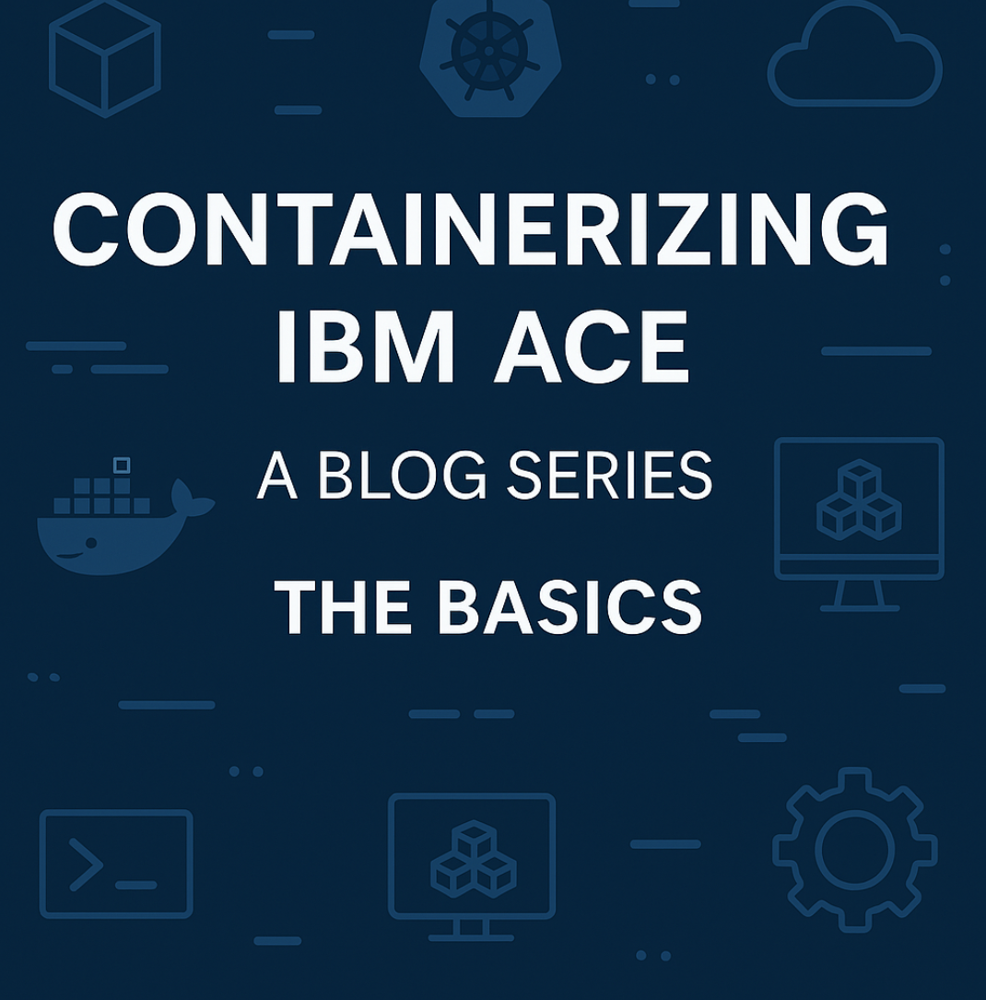

# Containerizing IBM ACE: A Blog Series - Container Startup Optimization

I've been wondering how we can optimize ACE containers at startup. Seeing as the actual startup process of ACE is a lot 
more resource intensive than actually running the integration server, I wanted to create a scenario to use as little 
additional resources as possible.

I've gone for three approaches:
- **Base image: everything is done at container startup**
- **Prebaked image: the deploy/optimize/cold-start is done at container build time and a warm-start is done at the container startup**
- **Init container: the init container performs the deploy/optimize/cold-start and the runtime container performs a warm-start**

cold-start = first start from a new integration server work directory
warm-start = second start from an already previously used integration server work directory.

I only ran the first two in Docker because that was less setup than using minikube. But there is no reason not to also 
try all three on a Minikube cluster.

> Disclaimer
> I've used the ACE 13.0.4.0 image in the entire setup. If you don't have access to that specific image, you can always 
> use the free developer image that you can download from IBM: [IBM App Connect Enterprise Evaluation Edition free product download](https://www.ibm.com/resources/mrs/assets/mrs_landing_page?source=swg-wmbfd&lang=en_US)

## Standalone Integration Server

A really basic setup you can quickly test, just to show you that a warmed runtime does make a difference:
- Create a new Standalone Integration Server (SIS), SERVER-COLD
- Deploy your BAR Files
- Run ibmint optimize server
- Start and stop your SIS
- create a new SIS, SERVER-WARM
- copy your SERVER-COLD directory contents to the SERVER-WARM directory
- start SERVER-WARM

This should give you some big speed increased already. Big is relative, if you just put a very simple hello-world flow 
in there, changes will be marginal. If you put some complex flow, or multiple flows, and big schemas in there, then the 
difference becomes more obvious.

## Base image

For this setup I've created a base image with ACE installed where nothing happens automatically. After spinning up the 
runtime, you need to open a terminal, deploy, optimize and start the Integration Server. To make this easier, I put those 
actions in a script, `start.sh`

**Files referenced**
- `Dockerfile`: your ACE v13 base image.
- `start.sh`: deploy → optimize → start script (meant to be run manually).
- `bars/`: BARs baked into the image (lazy solution, you can mount them if you prefer).

### 1) **Build**
```powershell
docker build -t ace-base:13.0.4.0 -f Dockerfile .
[+] Building 2.1s (20/20) FINISHED                                                                                                              docker:desktop-linux
 => [internal] load build definition from Dockerfile                                                                                                            0.0s
 => => transferring dockerfile: 2.46kB                                                                                                                          0.0s 
 => [internal] load metadata for registry.access.redhat.com/ubi9/ubi-minimal:latest                                                                             0.4s 
...
```

### 2) **Run (idle container)**

I'm using these parameters because I want to have an interactive shell with the container and I only want the container
to exist as long as I am connected to it (makes cleanup and port re-use easier).

```powershell
docker run --name ace-base -e LICENSE=accept -p 7600:7600 -p 7800:7800 --rm -ti ace-base:13.0.4.0

MQSI 13.0.4.0
/opt/ibm/ace-13/server

[aceuser@09b8e93505ae ace-server]$ 
```

### 3) **Start runtime**

Start hte IntegrationServer From inside the still open terminal.

```powershell
[aceuser@09b8e93505ae ace-server]$ /scripts/start.sh 
[2025-09-14 15:21:14] Starting deployments
[2025-09-14 15:21:14] Deploying /bars/HelloWorld.bar
BIP15233I: Generating BAR file '/tmp/ibmint_deploy_generated_1757863275536331.bar' for deploy. 
Generating runtime objects: '/var/mqsi/mqsibar/temp-7486f378-917e-11f0-9c80-ac11000e0000' ...
...
```

### 4) **Logs**

Check the written logs (remember the script writes to /tmp/is.log) and note the time of the first and last entry

```powershell
[aceuser@09b8e93505ae ace-server]$ cat /tmp/is.log
2025-09-14 15:21:17.609262: Components specification is being loaded from the file '/home/aceuser/ace-server/server.components.yaml'. 
2025-09-14 15:21:17.637260: BIP1990I: Integration server 'ace-server' starting initialization; version '13.0.4.0' (64-bit) 
2025-09-14 15:21:17.666582: BIP9905I: Initializing resource managers. 
2025-09-14 15:21:17.666644: BIP9985I: Using Java version 17. The following integration server components are unavailable with this Java version: FlowSecurityProvider
...
```

### 5) **Stop and cleanup**

Because of the way we started the container, the container will be automatically stopped and cleaned up when we exit the 
terminal.

```powershell
[aceuser@09b8e93505ae ace-server]$ exit
exit
>
```
Make sure to do this before continuing with the next step, since I'm using the same ports for all containers. If you want 
to run them side by side, choose different ports.

## Prebaked image

Here I wanted to do an extensive bake. Really put everything in the image, even an already started runtime. In order to 
accomplish this, my docker build process actually deploys the bar files and optimizes and starts the Integration Server. 
This 'warmed-up' runtime is then packaged. All these actions are again put in a single script, `warmup.sh`.

**Files referenced**
- `Dockerfile`: multi-stage build that deploys/optimizes and first-starts during build.
- `bars/`: BARs included at build time.
- `warmup.sh`: deploy, optimize and start.

### 1) **Build**

Run the build of the prebaked ace image

```powershell
docker build -t ace-prebaked:13.0.4.0 -f Dockerfile .

[+] Building 9.6s (18/26)                                                                                                                     docker:desktop-linux
 => [internal] load build context                                                                                                                             0.0s
 => => transferring context: 322B        
...
```

### 2) **Run**

Start the newly build `ace-prebaked:13.0.4.0` image, again with the --rm and -ti parameters for ease of use.

```powershell
docker run --name ace-prebaked -e LICENSE=accept -p 7600:7600 -p 7800:7800 --rm -ti ace-prebaked:13.0.4.0

BIP2112E: IBM App Connect Enterprise internal error: diagnostic information ''No such file or directory'', '2'. 
```

That error line isn't actually an error, you can ignore that one. let's have a look at the full log (that we exported to /tmp/is.log)


### 3) **Logs**

Let's have a look at the full log (that we exported to /tmp/is.log). Open a new terminal (the open one is linked to the 
running IntegrationServer process) and check the log file.

```powershell
docker exec -it ace-prebaked bash   
BIP2112E: IBM App Connect Enterprise internal error: diagnostic information ''No such file or directory'', '2'. 

MQSI 13.0.4.0
/opt/ibm/ace-13/server

[aceuser@297ebca62f93 ace-server]$ cat /tmp/is.log 
2025-09-14 15:31:26.050136: Components specification is being loaded from the file '/home/aceuser/ace-server/server.components.yaml'. 
2025-09-14 15:31:26.098840: BIP1990I: Integration server 'ace-server' starting initialization; version '13.0.4.0' (64-bit) 
2025-09-14 15:31:26.129978: BIP9905I: Initializing resource managers. 
...
2025-09-14 15:31:28.678362: BIP1991I: Integration server has finished initialization. 
```

As you can see, ace started properly.

### 4) **Stop and cleanup**

Because of the way we started the container, if we exit the terminal, the container will be automatically stopped and cleaned up.

```powershell
[aceuser@09b8e93505ae ace-server]$ exit
exit
> 
```

Make sure to do this if you plan on testing the base image as well, since I'm using the same ports for all containers.

## Init container

**Files referenced**
- `Dockerfile`: for image `ace-init:13.0.4.0`
- `warmup.sh`: deploy, optimize, start and stop
- `deployment-init.yaml`: Deployment+Service:

### 1) **Make image available to Minikube**

Build the init container image:

```powershell
docker build -t ace-init:13.0.4.0 -f Dockerfile .     
[+] Building 120.4s (19/19) FINISHED                                                                                                            docker:desktop-linux
 => [internal] load build definition from Dockerfile                                                                                                            0.0s
 => => transferring dockerfile: 2.45kB                                                                                                                          0.0s 
 => [internal] load metadata for registry.access.redhat.com/ubi9/ubi-minimal:latest                                                                             0.4s
...
```

Make it available inside the minikube image repository:

```powershell
minikube image load ace-init:13.0.4.0 --overwrite=true
```

You can also build it directly into minikube, but I prefer building at my machine level and solving any possible issues before
uploading it into the minikube registry.

### 2) **Apply Deployment/Service**

Create the ACE runtime deployment and an ingress server to connect to the runtime later on.

```powershell
kubectl apply -f .\deployment-init.yaml
deployment.apps/ace-init-prep created
service/ace-init-prep created
```

Wait for it to Start, the state shoudl change to Running, showing that 1 out of 1 pods are active.

```powershell
ace-init-prep-7987d6f688-s85tw   0/1     Init:0/1      0          4s
ace-init-prep-7987d6f688-s85tw   0/1     PodInitializing   0          17s
ace-init-prep-7987d6f688-s85tw   1/1     Running           0          22s
```

### 3) **View logs**

We have 2 containers to check now, let's beging with the init container

```powershell
kubectl logs deploy/ace-init-prep -c prep
[2025-09-14 15:49:53] mqsicreateworkdir /home/aceuser/ace-server
mqsicreateworkdir: Copying sample server.config.yaml to work directory
1 file(s) copied.
Successful command completion.
[2025-09-14 15:49:54] Deploy & optimize
[2025-09-14 15:49:54] Deploying /bars/HelloWorld.bar
BIP15233I: Generating BAR file '/tmp/ibmint_deploy_generated_1757864994830479.bar' for deploy.
Generating runtime objects: '/var/mqsi/mqsibar/temp-754e6076-9182-11f0-bbb0-0af400510000' ...

BIP8148I: Unpacking BAR file...
BIP8071I: Successful command completion.
[2025-09-14 15:49:55] Deploying /bars/SchemaLib.bar
BIP15233I: Generating BAR file '/tmp/ibmint_deploy_generated_1757864995703380.bar' for deploy.
Generating runtime objects: '/var/mqsi/mqsibar/temp-75d34d2c-9182-11f0-b932-0af400510000' ...

BIP9342I: genXlXpBir: SchemaLib/$mqsiLibrary.bir

BIP8148I: Unpacking BAR file...
BIP8071I: Successful command completion.
BIP15237I: The components file '/home/aceuser/ace-server/server.components.yaml' was created. It may be further edited if required.
BIP8071I: Successful command completion.
[2025-09-14 15:49:56] Warm-start IntegrationServer
[2025-09-14 15:50:00] Stopping warm-started server (pid=143)
[2025-09-14 15:50:08] Warmup complete; exiting init
```

You can clearly see that the init container stopped after a successful startup. Now let's look at the actual runtime 
container.

```powershell
kubectl logs -f deploy/ace-init-prep -c runtime

```

This output is remaining empty, that is simply because I directed all the output away to the /tmp/is.log file because of 
how I build the container. There is no need to build it that way, I just wanted to write to the /tmp/is.log file, just 
like with the other 2 setups. So let's have a look at that one.

```powershell
kubectl exec -it deploy/ace-init-prep -c runtime -- bash

MQSI 13.0.4.0
/opt/ibm/ace-13/server

[aceuser@ace-init-prep-7987d6f688-s85tw /]$ cat /tmp/is.log
2025-09-14 15:50:10.242919: Components specification is being loaded from the file '/home/aceuser/ace-server/server.components.yaml'.
2025-09-14 15:50:10.278718: BIP1990I: Integration server 'ace-server' starting initialization; version '13.0.4.0' (64-bit)
2025-09-14 15:50:10.327490: BIP9905I: Initializing resource managers.
2025-09-14 15:50:10.327544: BIP9985I: Using Java version 17. The following integration server components are unavailable with this Java version: FlowSecurityProviders/TFIM, GlobalCacheBackends/WXS, JavaNodes/CORBA, JavaNodes/WS-Security, JavaNodes/WSRR.
...
2025-09-14 15:50:12.967679: BIP1991I: Integration server has finished initialization.
```

Integration server started successfully

### 4) **Sanity checks**

Initially I forgot to install the `ps` command into my container, so I couldn't use `ps -ef` to check if my process was 
running. There is another way to do that, though. If you still have a terminal open:

```powershell
[aceuser@ace-init-prep-7987d6f688-s85tw /]$ cat /proc/1/cmdline
bash-c. /opt/ibm/ace-13/server/bin/mqsiprofile && IntegrationServer --name ${ACE_SERVER_NAME} -w /home/aceuser/ace-server > /tmp/is.log 2>&1
```

That is the IntegrationServer running. If you have closed your terminal already, you can simply use a one-liner:

```powershell
kubectl exec -it deploy/ace-init-prep -c runtime -- sh -lc "tr '\0' ' ' </proc/1/cmdline; echo"
bash-c. /opt/ibm/ace-13/server/bin/mqsiprofile && IntegrationServer --name ${ACE_SERVER_NAME} -w /home/aceuser/ace-server > /tmp/is.log 2>&1

# Confirm optimized workdir
kubectl exec -it deploy/ace-init-prep -c runtime -- sh -lc "ls -l /home/aceuser/ace-server; test -f /home/aceuser/ace-server/server.components.yaml && echo optimized"
```

Or, and this is obviously the most telling one, use the webui. Forward port 7600 and 7800 to your k8s instance

```powershell
kubectl port-forward deploy/ace-init-prep 7600:7600 7800:7800
Forwarding from 127.0.0.1:7600 -> 7600
Forwarding from 127.0.0.1:7800 -> 7800
Handling connection for 7600
Handling connection for 7600
```

And point your favourite browser to https://localhost:7600/



## Results
Now, let's compare the results.

| setup            | time | remark                                               |
|------------------|------|------------------------------------------------------|
| ace-base         | 5.5s | from deploy until 'finished initialization'          |
| ace-prebaked     | 3.2s | from starting the IS until 'finished initialization' |
| ace-init-prep    | 6s   | from deploy until stop IS                            |
| ace-init-runtime | 2.9s | from starting the IS until 'finished initialization' |

You see a clear difference between the ace-base and the other two images. I can't pick a clear winner here, but that was
never the point. These are 2 rather extreme ways of optimizing your runtimes and my main goal was just to see how to set
that up and how that was going to play out.

## But why

Apart from this being an interesting test setup (well, for me anyway, [insert nerd joke here]), there are reasons why 
you would prefer either of these setups.

### Prebaked
If you have full control of what you want to deploy (and if you like baking images, I don't), you can perform a lot of 
the startup overhead at pipeline level. This greatly reduces the startup time and overhead of your actual container.
The downside here is you have to bake everything in. You can still insert secrets and config at startup time, but 
everything else needs to be supplied during the build phase. One big caveat is that the build and runtime environments 
need to be identical. If you build/bake with 13.0.3.0 and run at 13.0.4.0, all the startup optimizations will be for 
naught.

### Init containers
This is more a solution for people that like to fry (yah, something for me). By providing the init container with all the 
resources you need, you actually to the build optimizations at runtime. Just like with the prebaked setup, it is important 
to use the same runtime versions for your prep and runtime containers. Which is what I did here. I build one image that 
I used for both with a specific start command for the initContainer. In this setup you could even use ACE Certified 
Container images if you wanted to.

## Remarks

There are a number of ways to optimize your code and build process that also impact the performance of you runtime. I've
talked about these before in another blog, so I encourage you to go look at that one. For now I just wanted to have a look
what I could do at the runtime level itself to minimize the startup resource requirement of the actual runtime container.

I have made some assumptions and taken some shortcuts here and there, just for the sake of making this easier for me 
(since I'm the one testing and writing, it seems only fair that I take a few shortcuts).
- I have baked all bar files inside my images. You don't have to, you can still mount them when spinning up your container 
for the base and init-container setup.
- I'm using a very simple library and application. If you use more or more complex libs/apps, you results should even be 
more drastic.
  ...

---

Resources
