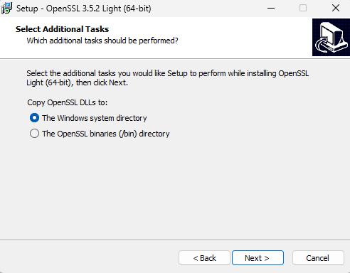

# ACE on Windows — Disable Weak TLS Ciphers and Verify with OpenSSL

## 1. Goal
Disable insecure TLS ciphers in ACE due to security findings, then verify at runtime that they are blocked.


## 2. Prepare a Simple HTTPS Endpoint in ACE
- Create a trivial **HTTPInput** or **REST API** flow that returns `"hello world"`. I have one available already [HelloWorld_https](https://github.com/matthiasblomme/Ace_test_cases/tree/64d32256864391e330d1d1482fd412c80957998e/HelloWorld_https)
- I'm deploying it in a standalone integration server, with the default https port 7843
- Confirm the listener is reachable:
```powershell
> Test-NetConnection localhost -Port 7843

ComputerName     : localhost
RemoteAddress    : ::1
RemotePort       : 7843
InterfaceAlias   : Loopback Pseudo-Interface 1
SourceAddress    : ::1
TcpTestSucceeded : True
```


## 3. Install OpenSSL on Windows
**Note:** This is OpenSSL, **not** OpenSSH.
- Install [Win64 OpenSSL v3.5.2 Light](https://slproweb.com/products/Win32OpenSSL.html) or use a portable ZIP package.
- Choose the "Windows system directory" if you want OpenSSL to be available from any standard command promt.

- Open a new terminal and check if you now have OpenSSL available
```powershell
> openssl version
OpenSSL 3.5.0 8 Apr 2025 (Library: OpenSSL 3.5.0 8 Apr 2025)
```


## 4. Baseline Test — Known Good Cipher
Pick a modern TLS 1.2 AEAD suite that is **not** in your disabled list:
```powershell
> $TARGET="localhost:7843"
> openssl s_client -connect $TARGET -tls1_2 -cipher "ECDHE-RSA-AES256-GCM-SHA384" -servername localhost
Connecting to ::1
CONNECTED(00000200)
depth=0 C=US, CN=IBM App Connect Enterprise v13.0 HTTPSConnector self signed, O=IBM, OU=IBM App Connect

...

SSL handshake has read 2457 bytes and written 250 bytes
Verification error: self-signed certificate
---
New, TLSv1.2, Cipher is ECDHE-RSA-AES256-GCM-SHA384
Protocol: TLSv1.2

...
---
```
Here you can see that the connection succeeded and the agreed cipher is ECDHE-RSA-AES256-GCM-SHA384.


## 5. Baseline Test — Known Weak Cipher
Test an anonymous suite that should be blocked:
```powershell
> openssl s_client -connect $TARGET -tls1_2 -cipher "AECDH-AES128-SHA" -servername localhost
Connecting to ::1
CONNECTED(0000020C)
1CD30C00:error:0A0000B5:SSL routines:ssl_cipher_list_to_bytes:no ciphers available:ssl\statem\statem_clnt.c:4157:No ciphers enabled for max supported SSL/TLS version
---
no peer certificate available
---
No client certificate CA names sent
---
SSL handshake has read 0 bytes and written 7 bytes
Verification: OK
---
New, (NONE), Cipher is (NONE)
Protocol: TLSv1.2
Secure Renegotiation IS NOT supported
Compression: NONE
Expansion: NONE
No ALPN negotiated
SSL-Session:
Protocol  : TLSv1.2
Cipher    : 0000
Session-ID:
Session-ID-ctx:
Master-Key:
PSK identity: None
PSK identity hint: None
SRP username: None
Start Time: 1755152168
Timeout   : 7200 (sec)
Verify return code: 0 (ok)
Extended master secret: no
---
```

This is a completely different output then before, and it tells us two thing
- No matching cipher was AECDH-AES128-SHA, indicated by `no ciphers available` and `New, (NONE), Cipher is (NONE)`
- The SSL handshake did not complete, indicated by `no peer certificate available` and `Cipher    : 0000`


## 6. Harden ACE by Editing `java.security`
Edit the ACE JRE security policy file used by your Integration Server. You can find it here:
```
<ACE_INSTALL_DIR>\common\jdk\jre\lib\security\java.security
```

For example: 
```
C:\Program Files\IBM\ACE\13.0.4.0\common\jdk\jre\lib\security\java.security
```

Search for the property jdk.tls.disabledAlgorithms and update it with the ciphers you don't want to support anymore.

The original property (from ACE 13.0.4.0)
```properties
jdk.tls.disabledAlgorithms=SSLv3, TLSv1, TLSv1.1, RC4, DES, MD5withRSA, DH keySize < 1024, DESede, \
    EC keySize < 224, 3DES_EDE_CBC, anon, NULL, ECDH, \
    include jdk.disabled.namedCurves
```

After adding the disallowed Ciphers
```properties
jdk.tls.disabledAlgorithms=SSLv3, TLSv1, TLSv1.1, RC4, DES, MD5withRSA, DH keySize < 1024, DESede, \
    EC keySize < 224, 3DES_EDE_CBC, anon, NULL, ECDH, \
    include jdk.disabled.namedCurves \
	AECDH, ECDH_ECDSA_WITH_AES_128_CBC_SHA2562, ECDH_RSA_WITH_AES_128_CBC_SHA2562, \
    ECDH_ECDSA_WITH_AES_256_CBC_SHA384, ECDH_RSA_WITH_AES_256_CBC_SHA384, \
    ECDH_ECDSA_WITH_AES_128_GCM_SHA2562, ECDH_RSA_WITH_AES_128_GCM_SHA2562, \
    ECDH_ECDSA_WITH_AES_256_GCM_SHA384, ECDH_RSA_WITH_AES_256_GCM_SHA384
```

**Notes:**
- Keep it in one logical line or use backslashes for continuation.
- Restart the Integration Server or Integration Node after changes.


## 7. Verify Blocked and Allowed Ciphers After Change
**Blocked examples:**
```powershell
# RC4 - blocked by openssl itself
> openssl s_client -connect $TARGET -tls1_2 -cipher "RC4-SHA" -servername localhost
Call to SSL_CONF_cmd(-cipher, RC4-SHA) failed
D0EF0C00:error:0A0000B9:SSL routines:SSL_CTX_set_cipher_list:no cipher match:ssl\ssl_lib.c:3399:

# Anonymous - blocked by the integration server
> openssl s_client -connect $TARGET -tls1_2 -cipher "AECDH-AES128-SHA" -servername localhost
Connecting to ::1
CONNECTED(00000208)
08CA0D00:error:0A0000B5:SSL routines:ssl_cipher_list_to_bytes:no ciphers available:ssl\statem\statem_clnt.c:4157:No ciphers enabled for max supported SSL/TLS version
---
no peer certificate available
---
No client certificate CA names sent
---
SSL handshake has read 0 bytes and written 7 bytes
Verification: OK
---
New, (NONE), Cipher is (NONE)
Protocol: TLSv1.2
Secure Renegotiation IS NOT supported
Compression: NONE
Expansion: NONE
No ALPN negotiated
SSL-Session:
    Protocol  : TLSv1.2
    Cipher    : 0000
    Session-ID:
    Session-ID-ctx:
    Master-Key:
    PSK identity: None
    PSK identity hint: None
    SRP username: None
    Start Time: 1755152775
    Timeout   : 7200 (sec)
    Verify return code: 0 (ok)
    Extended master secret: no
---
```

**Allowed example (control):**
```powershell
> openssl s_client -connect $TARGET -tls1_2 -cipher "ECDHE-RSA-AES256-GCM-SHA384" -servername localhost
Connecting to ::1
CONNECTED(000001F8)
depth=0 C=US, CN=IBM App Connect Enterprise v13.0 HTTPSConnector self signed, O=IBM, OU=IBM App Connect

...

SSL handshake has read 2457 bytes and written 250 bytes
Verification error: self-signed certificate
---
New, TLSv1.2, Cipher is ECDHE-RSA-AES256-GCM-SHA384
Protocol: TLSv1.2

...

---
```

**Optional TLS 1.3 control (if enabled):**
```powershell
>  openssl s_client -connect $TARGET -tls1_3 -ciphersuites "TLS_AES_256_GCM_SHA384" -servername localhost

...

New, TLSv1.3, Cipher is TLS_AES_256_GCM_SHA384
Protocol: TLSv1.3

...

---
```


## 9. Manage `java.security` in Source Control
- Store the `java.security` or at least the changed parameters in a version control system.
- Track changes via pull requests.
- Use **Ansible**, **DSC**, or other config management to enforce and verify the file on each ACE server.
- After changes:
  - Restart the Integration Server
  - Verify one of the disabled ciphers
 


---

For more integration tips and tricks, visit [Integration Designers](https://integrationdesigners.com/blog/) and check out our other blog posts.

---

## References

* [ACE Test Cases Repo](https://github.com/matthiasblomme/Ace_test_cases)
* [Download OpenSSL for Windows](https://slproweb.com/products/Win32OpenSSL.html)

---

Written by [Matthias Blomme](https://www.linkedin.com/in/matthiasblomme/)

\#IBMChampion \
\#AppConnectEnterprise(ACE) \
\#OpenSSL \
\#Certificates \
\#TLS