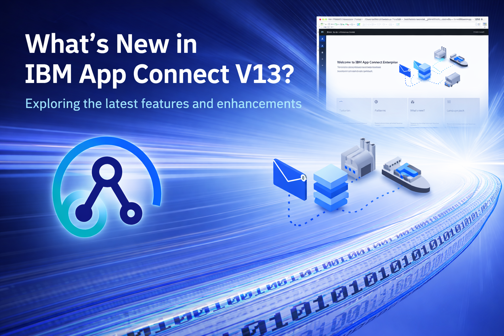
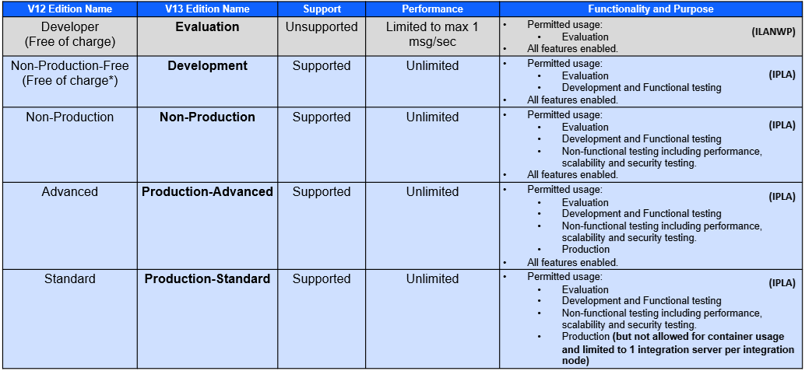
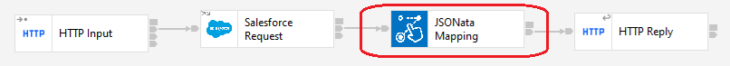
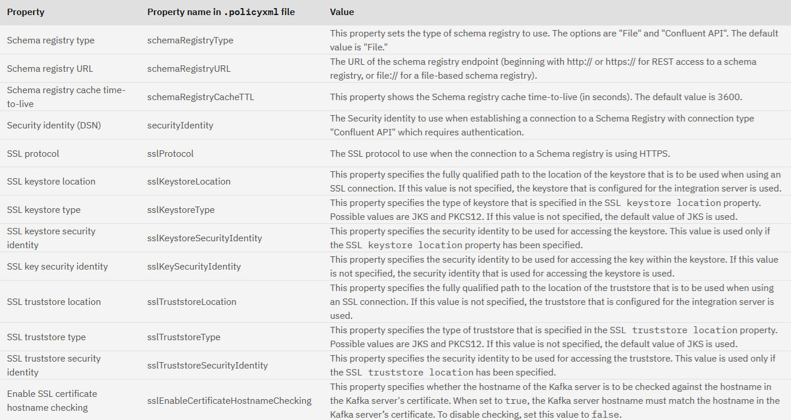

{ .md-banner }

# ACE v13 new features (when coming from v12)

> **DISCLAIMER:**
> All the information below is provided by IBM end digested/interpreted by me. It's meant to help and inform but should 
> in no way be interpreted as ... 

## Why I'm doing this

[Ben Thompson](https://community.ibm.com/community/user/people/ben-thompson1) does a splendid job in clearly and cleanly 
explaining all the new ACE features for each release. However, sometimes it can be handy to have them all in one overview.

That is exactly what I'm going to do here, list all changes (and group similar ones) for anyone looking to migrate from 
v12 and in need of a simple overview. I was looking into everything that changed with regards to ACE v12, so 2 birds one 
stone.

I'll try not to go into to much detail on all the topics, the main focus is to give you a straight overview. So make sure 
to have a look at the referenced material as well. I'll put all of Ben's post in there along with some other ones that I 
found interesting and that are relevant, in one way or another

With each new release, I'll try to keep this page up to date, but no promises on the time line. Feel free to reach out if
it takes to long ;)

## The features

### Release cycle

This is not really a feature, but since I'm bundling information, I might tackle this one as well

General availability: 27 September 2024
Support cycle: 5+1+3 
- 5 years of standard support 
- 1 year of extended support for new defects
- 3 years of extended support for usage and known defects
End of support: 2029
End of extended support: 2033 

### Product editions

There is a slight change in the name of the product verions. The below table gives a clear overview.


If you haven't used ACE before and/or if you have no paied entitlements, you can start with the free [Developer edition](https://www.ibm.com/resources/mrs/assets?source=swg-wmbfd).
(you will need to register for an IBM account).

### App Connect Enterprise Designer

The APP Connect Enterprise Designer is a new, low threshold, alternative tool for flow authoring.  It's not as feature 
rich as the toolkit (still the strategic IDE for ACE), but it alligns more with Cloud Development Platforms. I was already
a part of the iPaaS offering of ACE, but with v13 it has been added to your local installation as well.

The most common use case is to start a Connector development project in the Designer and switch over to the toolkit for
the more detailed work.

#### Templates

The Designer also comes with it's own set of templates


### Discovery Request Nodes

Each new release brings new Discovery Requests Nodes along. There are so many by now, that I'll just limit myself to
list them all out

| 13.0.1.0                       | 13.0.2.0 | 13.0.3.0 | 13.0.4.0 | 13.0.5.0 | 13.0.6.0 |
|--------------------------------|----------|----------|----------|----------|----------|
| Businessmap Request node       |
| ClickSend Request node         |
| Crystal Ball Request node      |
| Factorial HR Request node      |
| Front Request node             |
| Hunter Request node            |
| IBM Targetprocess Request node |
| IBM watsonx.ai Request node    |
| Infobip Request node           |
| Toggl Track Request node       |
| Wrike Request node             |
| Zoho Books Request node        |
| Zoho CRM Request node          |
| Zoho Inventory Request node    |
| Zoho Recruit Request node      |


### Discovery Input Nodes

Each new release brings new Discovery Input Nodes along. There are so many by now, that I'll just limit myself to
list them all out

| 13.0.1.0                       | 13.0.2.0 | 13.0.3.0 | 13.0.4.0 | 13.0.5.0 | 13.0.6.0 |
|--------------------------------|----------|----------|----------|----------|----------|
| Businessmap Input node |
| ClickSend Input node |
| Eventbrite Input node |
| Front Input node |
| Greenhouse Input node |
| IBM Maximo Input node |
| IBM Targetprocess Input node |
| Magento Input node |
| Marketo Input node |
| Slack Input node |
| Toggl Track Input node |
| Wrike Input node |
| Zoho Books Input node |
| Zoho CRM Input node |
| Zoho Recruit Input node |


### Patterns    

Aside from the well known Tutorials Gallery that has been around for many years, ACE v13 comes with a new restyled
Patterns Gallery. Patterns are helpful because they:

- Generate customized solutions to a recurring integration problem in an efficient way
- Encourage adoption of preferred techniques in message flow design
- Help guide developers who are new to the product
- Provide consistency in the generated resources

They offer you a quick start based on a couple of choices, without the fixed set of resources and instructions that a 
tutorial offers.

**TODO**
Currently there are roughly 100 available patterns (and no, I did not count them by hand) categorized in 6 topics:
- Protocol Transformation Patterns
- Format Transformation Patterns
- AI Patterns
- Enterprise Integration Patterns
- Scatter-Gather Patterns
- Messaging Patterns

Some patterns (about 17) are marked "coming soon!", so keep your eyes pealed.

### New Nodes (and updates)

#### JSONata Mapping Node



JSONata is a lightweight query and transformation language specifically designed for interacting with JSON data. You can 
compare it to XSLT for XML.

#### Kafka Nodes

The KafkaProducer, KafkaConsumer and KafkaRead nodes support Avro and Schema Registries. I


t does require you to use a
Schema Registry Policy.



#### TCPIP Nodes


TCPIP nodes now support timeout values expressed as fractions of a second, up to 3 decimal places, expressed as `0.250`.
`0.100` is the shortes supported timeout.

#### Couchbase Request Node


You can use the Couchbase Request node to connect to Couchbase and issue requests to perform actions on objects such as 
buckets, collections, custom SQL, documents, and scopes. It comes with a matching policy as well.

### Toolkit Enhancements

#### External Directory Vault explorer

Managing an external directory vault is now possible from within the toolkit: create, connect and manage credentials.


### CLI Enhancements

#### ibmint

##### ibmint deploy
ibmint deploy supports additional ssl options
 - `--output-uri URI` URI for a remote integration server in the form tcp://[user[:password]@]host:port or in the form ssl://[user[:password]@]host:port.
 - `--https` specifies that HTTPS will be used for the connection to the integration node or server. 
 - `--no-https` specifies that HTTPS will not be used for the connection to the integration node or server. 
 - `--cacert cacertFile` cpecifies the path to the certificate file (in either PEM, P12, or JKS format) 
 - `--cacert-password cacertPassword` the password for password-protected cacert files.
 - `--insecure` Specifies that the certificate that is returned by the integration node or server will not be verified.

#### Auto-complete
ibmint commands on Linux and Unix support auto-complete.

### Runtime Enhancements

#### Open Telemetry 
OTel suppoert a basic auth security identity in the header of the OTel message taht is propagated to an extern OTel 
collector.

#### IPv6

The HTTPConnect supports IPv6, but IPv4 remains the default

```yaml
HTTPConnector:
    #ListenerPort: 0              # Set non-zero to set a specific port, defaults to 7800
    #ListenerAddress: '0.0.0.0'      # Set the IP address for the listener to listen on all IPv4 addresses (Default)
    #ListenerAddress: '::'           # Set the IP address for the listener to listen on all IPv6 and all IPv4 addresses
    #ListenerAddress: 'ipv6:::'      # Set the IP address for the listener to listen on all IPv6 and all IPv4 addresses
    #ListenerAddress: '127.0.0.1'    # Set the IP address for the listener to listen on to the localhost IPv4 address
    #ListenerAddress: '::1'          # Set the IP address for the listener to listen on to the localhost IPv6 address
    #ListenerAddress: '2001:DB8::1'  # Set the IP address for the listener to listen on a specific IPv6 address
    #ListenerAddress: '192.168.0.1'  # Set the IP address for the listener to listen on a specific IPv4 address
```

### Java

You migt think that this should be part of a runtime or the Toolkit chapter, but seeing as the java upgrade is a pretty
big deal, it gets it's own chapter.

IBM Semeru Java 17 is now the default for both the Toolkit and the ACE Runtimes. Java 1.8 is still shipped, and you can 
select it if you need it. Initially some features were not supported under Java 17, but each consecutive release brought
more support.

Currently the follow restrictions are in place
- Nodes only enabled under Java 17: CDC Node
- Nodes not supported under Java 17:
  - CORBARequest
  - WRR
  - WXS
  - WS-Security
  - WS-ReliableMessaging
  - TFIM
- Environment variables
  - TMPDIR is not observered under Java 17, use _JAVA_OPTIONS or jvmSystemProperty in the *.conf.yaml files

```java
_JAVA_OPTIONS="-Djava.io.tmpdir=/apps/mqsi/javacache"
```

```java
ResourceManagers:
  JVM:
    jvmSystemProperty:
```

If you have a JavaCompute node and/or custom Java Input or Compute nodes, make sure to test each of them.

### Credentials

With ace choosing for the vault and credentials over mqsisetdbparms (don't worry, it stil works), there are also some 
additions and improvements in the way ACE interactis with credentials.

One of these is dynamic credentials. These are credentials that can be changed and updated without having to restart the
server.

A list of dynamic credentials (in short, most of them)

| Connector | Connector | Connector | Connector |
|-----------|-----------|-----------|-----------|
| amazoncloudwatch (dynamic) | amazondynamodb (dynamic) | amazonec2 (dynamic) | amazoneventbridge (dynamic) |
| amazonkinesis (dynamic) | amazonlambda (dynamic) | amazonrds (dynamic) | amazonredshift (dynamic) |
| amazons3 (dynamic) | amazonses (dynamic) | amazonsns (dynamic) | amazonsqs (dynamic) |
| anaplan (dynamic) | apachepulsar (dynamic) | apptiotargetprocess (dynamic) | asana (dynamic) |
| astradb (dynamic) | azuread (dynamic) | azureblobstorage (dynamic) | azurecosmosdb (dynamic) |
| azureeventhub (dynamic) | azureservicebus (dynamic) | bamboohr (dynamic) | box (dynamic) |
| businessmap (dynamic) | calendly (dynamic) | cd (static) | cdc (dynamic) |
| cics (static) | clicksend (dynamic) | cloudantdb (dynamic) | cmis (dynamic) |
| confluence (dynamic) | couchbase (dynamic) | coupa (dynamic) | crystalball (dynamic) |
| databricks (dynamic) | db2 (dynamic) | docusign (dynamic) | dropbox (dynamic) |
| eis (dynamic) | elk (static) | email (static) | eventbrite (dynamic) |
| expensify (dynamic) | factorialhr (dynamic) | filenet (dynamic) | front (dynamic) |
| ftp (dynamic) | github (dynamic) | gitlab (dynamic) | gmail (dynamic) |
| googleanalytics (dynamic) | googlebigquery (dynamic) | googlecalendar (dynamic) | googlechat (dynamic) |
| googlecloudstorage (dynamic) | googlecontacts (dynamic) | googledrive (dynamic) | googlegemini (dynamic) |
| googlegroups (dynamic) | googlepubsub (dynamic) | googlesheet (dynamic) | googletasks (dynamic) |
| googletranslate (dynamic) | greenhouse (dynamic) | http (dynamic) | httpproxy (static) |
| hubspotcrm (dynamic) | hubspotmarketing (dynamic) | hunter (dynamic) | ibmaspera (dynamic) |
| ibmcoss3 (dynamic) | ibmewm (dynamic) | ibmopenpages (dynamic) | ibmsterlingiv (dynamic) |
| ibmtwc (dynamic) | ibmwatsonxai (dynamic) | ift (dynamic) | ims (static) |
| infobip (dynamic) | insightly (dynamic) | jdbc (static) | jenkins (dynamic) |
| jira (dynamic) | jms (static) | jndi (static) | kafka (static) |
| kerberos (static) | keystore (static) | keystorekey (static) | kronos (dynamic) |
| ldap (dynamic) | local (dynamic) | loopback (static) | magento (dynamic) |
| mailchimp (dynamic) | marketo (dynamic) | maximo (dynamic) | mcp (dynamic) |
| milvus (dynamic) | mondaydotcom (dynamic) | mq (dynamic) | mqtt (static) |
| msad (dynamic) | msdynamicscrmrest (dynamic) | msdynamicsfando (dynamic) | msexcel (dynamic) |
| msexchange (dynamic) | msonedrive (dynamic) | msonenote (dynamic) | mspowerbi (dynamic) |
| mssharepoint (dynamic) | mssql (dynamic) | msteams (dynamic) | mstodo (dynamic) |
| mysql (dynamic) | odbc (dynamic) | odm (static) | opentelemetry (dynamic) |
| oracle (dynamic) | oracleebs (dynamic) | oraclehcm (dynamic) | pineconedb (dynamic) |
| planninganalytics (dynamic) | postgres (dynamic) | redis (dynamic) | rest (dynamic) |
| salesforce (dynamic) | salesforceae (dynamic) | salesforcemc (dynamic) | sapariba (dynamic) |
| sapodata (dynamic) | sapsuccessfactors (dynamic) | schemaregistry (static) | servicenow (dynamic) |
| sfcommerceclouddata (dynamic) | sftp (dynamic) | shopify (dynamic) | slack (dynamic) |
| smtp (dynamic) | snowflake (dynamic) | soap (dynamic) | splunk (dynamic) |
| square (dynamic) | surveymonkey (dynamic) | toggltrack (dynamic) | trello (dynamic) |
| truststore (static) | truststorekey (static) | twilio (dynamic) | userdefined (dynamic) |
| vespa (dynamic) | watsondiscovery (dynamic) | wordpress (dynamic) | workday (dynamic) |
| wrike (dynamic) | wsrr (static) | wufoo (dynamic) | wxs (static) |
| yammer (dynamic) | yapily (dynamic) | zendeskservice (dynamic) | zohobooks (dynamic) |
| zohocrm (dynamic) | zohoinventory (dynamic) | zohorecruit (dynamic) | zosconnect (dynamic) |


### Business Transaction Monitoring

BTM extends the set of supported databases to include MS SQL Server and PostgreSQL, alongside DB2 and Oracle which were 
previously already supported. ACE makes connections to the database using ODBC.

- On Windows, the ODBC driver for MS SQL Server is provided by the operating system. 
- On the other ACE platforms, ACE provides a DataDirect ODBC driver for connecting to MS SQL Server.
- On Windows and xLinux, ACE provides a DataDirect ODBC driver for connecting to PostgreSQL.

### Database

#### PostgreSQL

Since 13.0.2.0, PostgreSQL is extended to support stored procedures that return dynamic result sets. you may notice a 
slight difference in the syntax we are promoting for PostgreSQL. For PostgreSQL, a dummy cursor value must be supplied 
in the ESQL CALL statement for each intended results set.


## Migration

I will talk about migration, but that is another article all together.

## Closing

Hopefully this has been of some value to some of you. Feel free to make positive suggestions or just let me know if you 
found it usefull.

# References

- [IBM App Connect Enterprise_13.0.x - Product lifecycle](https://www.ibm.com/support/pages/ibm-app-connect-enterprise130x)
- [New function added in IBM App Connect Enterprise 13.0 modification packs](https://www.ibm.com/docs/en/app-connect/13.0.x?topic=wniv1-new-function-added-in-app-connect-enterprise-130-modification-packs)
- [Explore the new features in App Connect Enterprise 13.0.1.0](https://community.ibm.com/community/user/blogs/ben-thompson1/2024/09/27/ace-13-0-1-0)
- [Explore the new features in App Connect Enterprise 13.0.2.0](https://community.ibm.com/community/user/blogs/ben-thompson1/2024/12/06/ace-13-0-2-0)
- [Explore the new features in App Connect Enterprise 13.0.3.0](https://community.ibm.com/community/user/blogs/ben-thompson1/2025/03/30/ace-13-0-3-0)
- [Explore the new features in App Connect Enterprise 13.0.4.0](https://community.ibm.com/community/user/blogs/ben-thompson1/2025/06/18/ace-13-0-4-0)
- [Explore the new features in App Connect Enterprise 13.0.5.0](https://community.ibm.com/community/user/blogs/ben-thompson1/2025/09/25/ace-13-0-5-0)
- [Explore the new features in App Connect Enterprise 13.0.6.0](https://community.ibm.com/community/user/blogs/ben-thompson1/2025/12/11/ace-13-0-6-0)