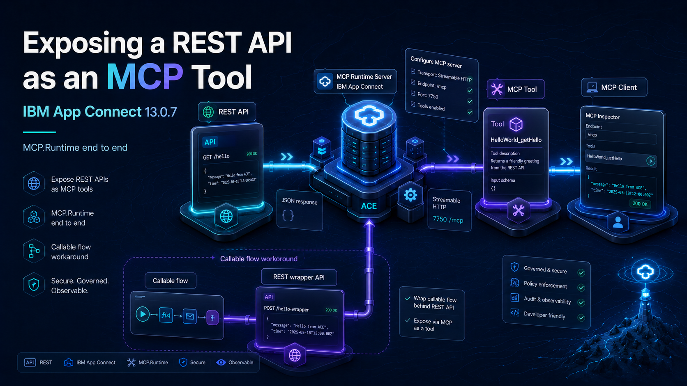{ .md-banner }

<!--MD_POST_META:START-->
<div class="md-post-meta">
  <div class="md-post-meta-left">Matthias Blomme · 2026-06-22 · ⏱ 19 min</div>
  <div class="md-post-meta-right"><span class="post-share-label">Share:</span> <a class="post-share post-share-linkedin" href="https://www.linkedin.com/sharing/share-offsite/?url=https%3A%2F%2Fmatthiasblomme.github.io%2Fblogs%2Fposts%2FAce-MCP%2Face-mcp-runtime-callable-flow%2F" target="_blank" rel="noopener" title="Share on LinkedIn">[<span class="in">in</span>]</a></div>
</div>
<hr class="md-post-divider"/>
<div class="md-post-tags"><span class="md-tag">ace</span> <span class="md-tag">mcp</span> <span class="md-tag">model-context-protocol</span> <span class="md-tag">ai</span> <span class="md-tag">integration</span> <span class="md-tag">callable-flow</span> <span class="md-tag">server.conf.yaml</span></div>
<!--MD_POST_META:END-->


# Exposing a REST API as an MCP tool in App Connect 13.0.7

The [MCP.Admin post](https://matthiasblomme.github.io/blogs/posts/Ace-MCP/mcp_in_ace/) covered one half of ACE 13.0.7's MCP story, the admin server sitting inside the runtime. This is the other half: MCP.Runtime, where you point at a deployed REST API and expose its operations as MCP tools that an MCP client can list and call.

This post does that end to end on a standalone integration server: a REST API, the Configure MCP server wizard, and an MCP client calling the tool and getting JSON back. I also wanted to expose a callable flow this way, which you cannot do directly, so there is a workaround for that at the end.

## Why straight from ACE

There are plenty of ways to put an MCP server in front of a REST API. You can write one, in Node or Python, that calls your APIs. You can run a gateway that fronts them. Either way it is another thing to build, deploy, secure, and keep in step with the API.

Exposing it straight from ACE skips that. The integration server you already run becomes the MCP server. The flow that already serves the REST API now serves the tool too, same deployment, same lifecycle, same place you look when something breaks. And the tool is the REST API, its title and description come from the OpenAPI, so there is no second definition to drift out of sync. One less moving part.

The catch is you inherit ACE's take on MCP, the read-only admin API, the override file, the one-client-per-lifetime bug, the transport split further down. A dedicated gateway still earns its place when you want OAuth, rate limiting, or one front door over many backends. But if the REST API already lives in ACE, exposing it from there is the cheapest path to a working tool.


## The REST API

I have a small REST API deployed (one that I regularly use for testing), `HelloWorld`, with a `GET /hello` and a `POST /hello` operation. 

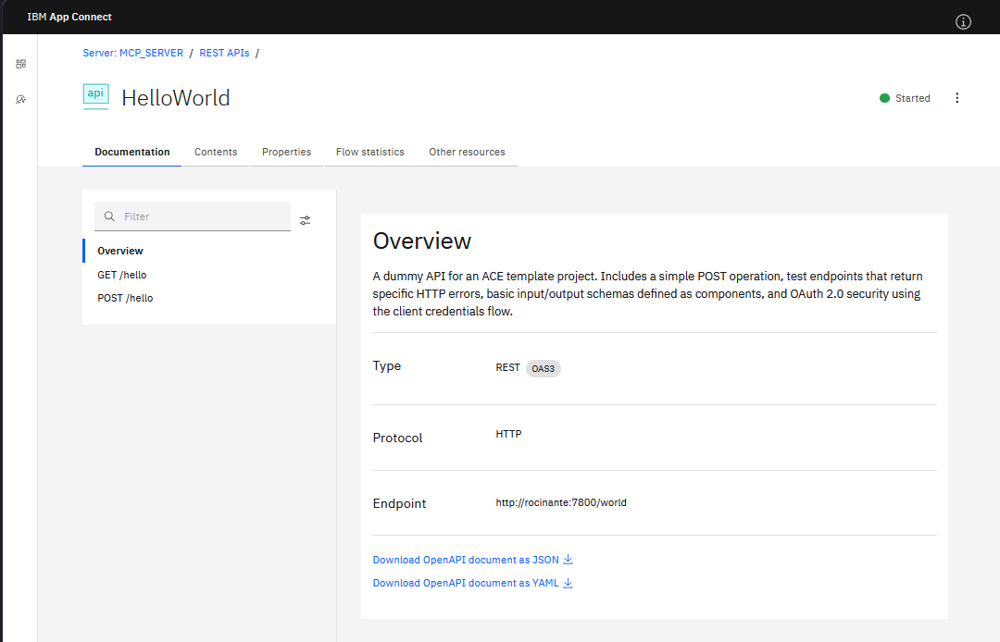

Call it and you get JSON back:

```powershell
curl.exe -i -s http://localhost:7800/world/hello
```

```
HTTP/1.1 200 OK
Content-Type: application/json
Server: IBM App Connect Enterprise

{"message":"Hello, Foo Bar!"}
```

Nothing special from the outside, a GET that returns a small JSON document. That is exactly what MCP.Runtime wants: a deployed REST API with operations it can turn into tools. Keep it simple.


## Exposing it as an MCP tool

This is where I lost a good twenty minutes, so let me save you the same. There is no expose button on the REST API page, and none on the operation either. I looked at both. The MCP configuration lives at the integration server level. RTFM, right?

Open the server in the Web UI, the three-dot menu top right, `Configure MCP server`.

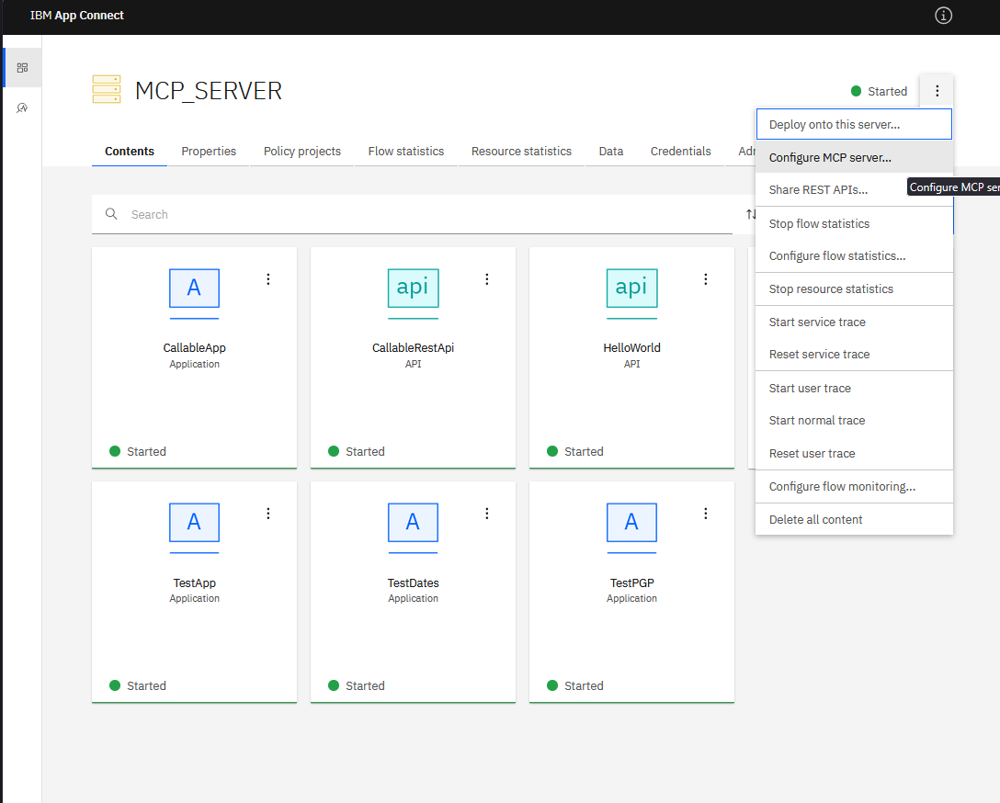

First step is the port, `7750` by default.

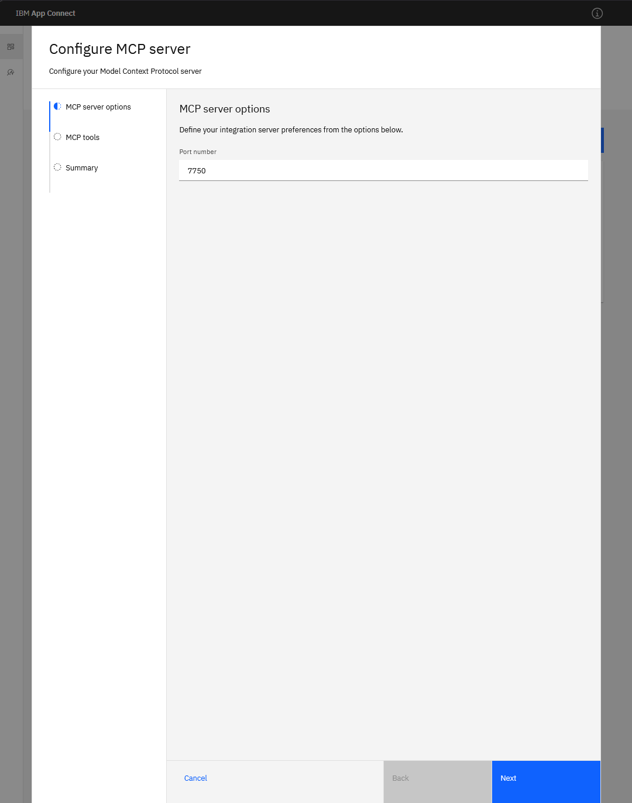

Second step is the actual exposing. It lists your deployed REST APIs, you tick the operations you want as tools, and you edit the description per tool with the pencil. The description is worth a sentence: it is what an agent reads to decide whether to call the tool.

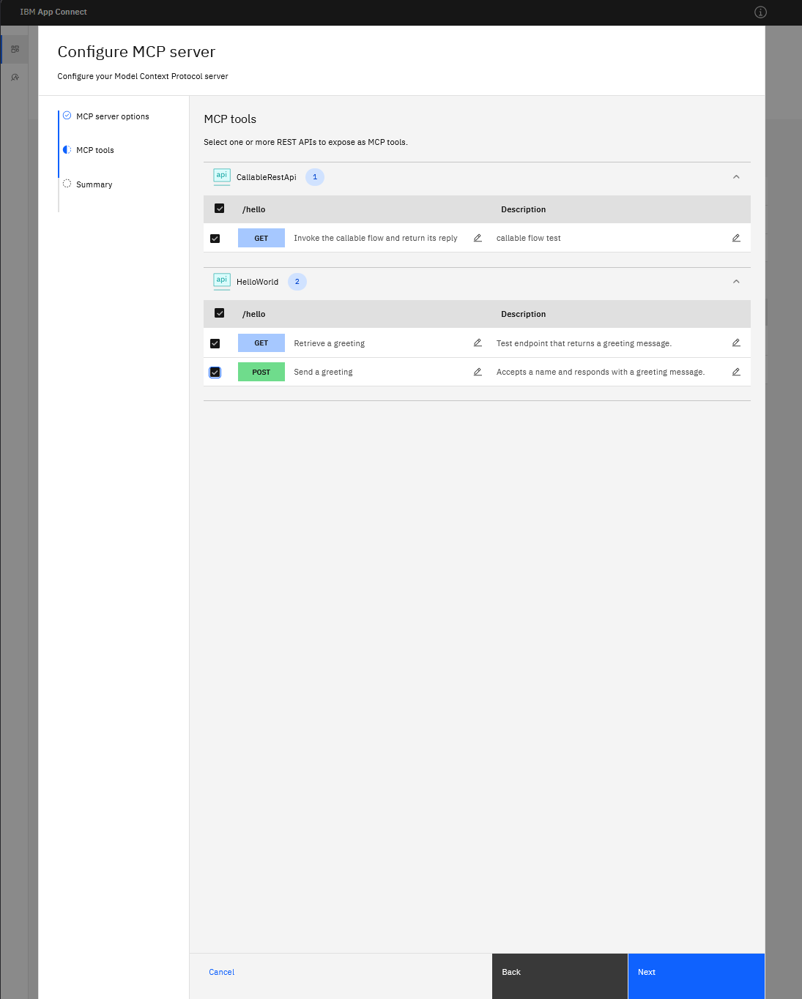

Summary, then `Create` (or 'Apply' if you forgot to take a screenshot and had to go back into the editor).

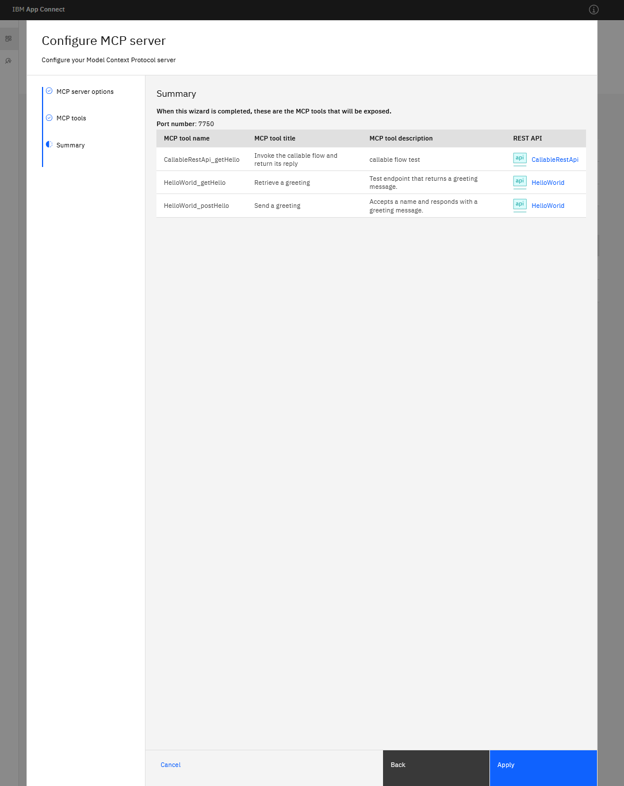

After that the tool shows up under the server's `Resource managers` tab, with the endpoint and the tools listed.

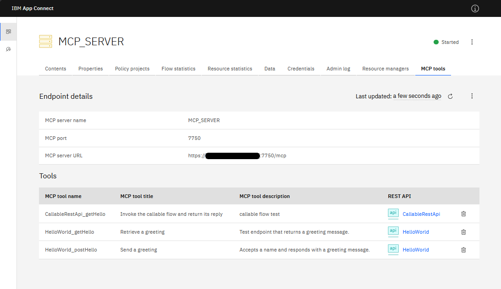

The endpoint is `https://<host>:7750/mcp`, the tool is `HelloWorld_getHello`, and that is the thing an MCP client now sees.


## Calling it over MCP

With the tool exposed, the MCP server is listening on `7750`, speaking MCP Streamable HTTP. Drive it with `curl` or with an agent like Bob to use it in plain language. One transport wrinkle first.

### Transports

MCP has two HTTP transports, the older SSE one and the newer Streamable HTTP, and the two MCP servers in ACE 13.0.7 do not speak the same one.

- **MCP.Admin** (7650) exposes an SSE endpoint at `/mcp/sse`. That is what Bob connected to in the MCP.Admin post.
- **MCP.Runtime** (7750) does not. `/mcp/sse` is a 404. It is Streamable HTTP only, at `/mcp`.

So a client that defaults to SSE, like Bob, reaches the admin server fine but has to be pointed at the Streamable HTTP endpoint, `https://localhost:7750/mcp`, for the runtime one. curl does not care, it just POSTs.

### curl

If you know what you need, curl is quicker, and better for debugging (more output). The handshake is the same one from the [MCP.Admin post](https://matthiasblomme.github.io/blogs/posts/Ace-MCP/mcp_in_ace/): `initialize`, then `tools/list` and `tools/call`, each a POST to the endpoint. One thing is simpler here than against the admin server: MCP.Runtime does not hand back an `Mcp-Session-Id`, so there is no session to capture and echo, you just POST. Bodies go in over stdin with `--data-binary '@-'` to dodge PowerShell's quote handling, the gotchas for that are also in the MCP.Admin post (yes, I want more views).

```powershell
$base = 'https://localhost:7750/mcp'
```

`initialize` confirms what you are talking to:

```powershell
'{"jsonrpc":"2.0","id":1,"method":"initialize","params":{"protocolVersion":"2025-06-18","capabilities":{},"clientInfo":{"name":"blog-tester","version":"1.0"}}}' |
  curl.exe -sk -X POST $base -H 'Content-Type: application/json' -H 'Accept: application/json, text/event-stream' --data-binary '@-'
```

```json
{"result":{"protocolVersion":"2025-06-18","capabilities":{"tools":{"listChanged":true}},"serverInfo":{"name":"MCP_SERVER","version":"2.0.44"}},"jsonrpc":"2.0","id":1}
```

Send the `initialized` notification once (no response), then `tools/list`:

```powershell
'{"jsonrpc":"2.0","method":"notifications/initialized"}' |
  curl.exe -sk -X POST $base -H 'Content-Type: application/json' -H 'Accept: application/json, text/event-stream' --data-binary '@-'

'{"jsonrpc":"2.0","id":2,"method":"tools/list"}' |
  curl.exe -sk -X POST $base -H 'Content-Type: application/json' -H 'Accept: application/json, text/event-stream' --data-binary '@-'
```

It shows the operation as a tool (I trimmed the response to the tool entry, the full one wraps it in `result.tools`). The title comes from the OpenAPI summary, the description from the wizard, and there are no parameters because `GET /hello` takes none:

```json
{"name":"HelloWorld_getHello","title":"Retrieve a greeting","description":"Test endpoint that returns a greeting message.","inputSchema":{"$schema":"http://json-schema.org/draft-07/schema#","type":"object","properties":{}},"execution":{"taskSupport":"forbidden"}}
```

And `tools/call`:

```powershell
'{"jsonrpc":"2.0","id":3,"method":"tools/call","params":{"name":"HelloWorld_getHello","arguments":{}}}' |
  curl.exe -sk -X POST $base -H 'Content-Type: application/json' -H 'Accept: application/json, text/event-stream' --data-binary '@-'
```

```json
{"result":{"content":[{"type":"text","text":"{\n  \"message\": {\n    \"message\": \"Hello, Foo Bar!\"\n  }\n}"}],"structuredContent":{"message":{"message":"Hello, Foo Bar!"}}},"jsonrpc":"2.0","id":3}
```

There it is, the greeting, delivered over MCP. MCP.Runtime wraps the response body under `message`, so a body that already has a `message` field comes back doubled up, but the payload is intact.

### Handing it to Bob

To use the tool in plain language you point an agent at it. Give Bob the Streamable HTTP endpoint, `https://localhost:7750/mcp`, and it connects and lists the tools.

I added the ace-runtime mcp alongside the ace-admin mcp in Bob's global mcp_settings.json:

```json
{
    "mcpServers": {
        "ace-admin": {
            "url": "https://localhost:7650/mcp/sse",
            "type": "sse",
            "alwaysAllow": [
                "info",
                "list_integrations",
                "list_application_needs",
                "list_policies",
                "list_credentials",
                "describe_message_flow"
            ],
            "disabled": false
        },
        "ace-runtime": {
            "url": "https://localhost:7750/mcp",
            "type": "streamable-http",
            "alwaysAllow": [
                "CallableRestApi_getHello",
                "HelloWorld_getHello",
                "HelloWorld_postHello"
            ],
            "disabled": false,
            "timeout": 30
        }
    }
}
```

Resulting in the 2 MCP servers

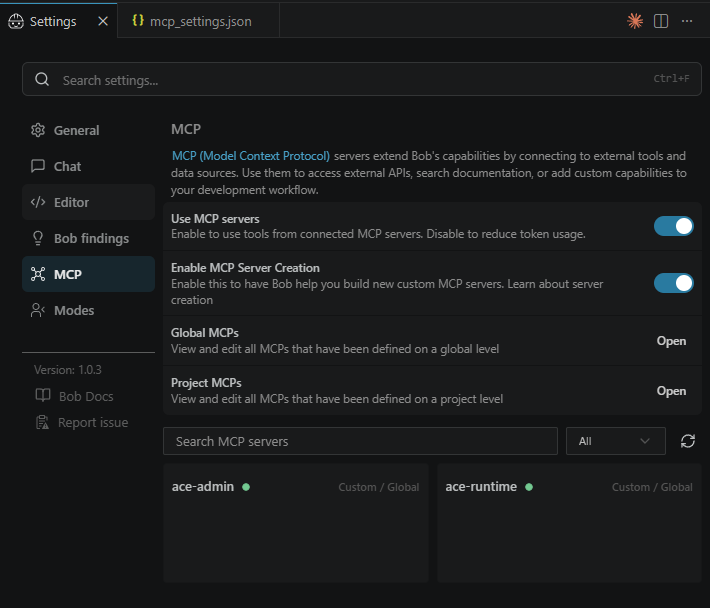

Calling the `HelloWorld_postHello` runtime tool sometimes worked, and sometimes failed. I'm not entirely sure why

A successful call

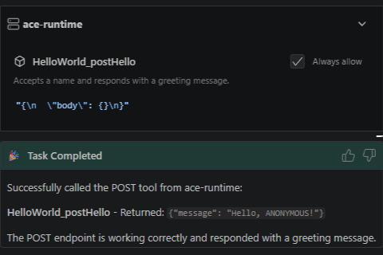

A failed call

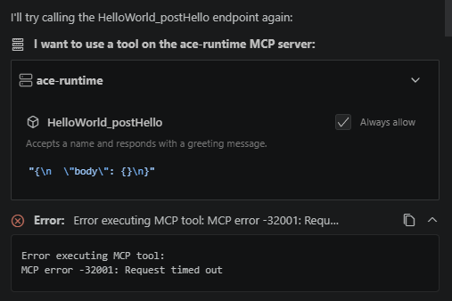

There is a silver lining, since I did enable the admin MCP as well, Bob was trying to figure out what was wrong by querying the integration server state, checking the deployed resources and REST API structure, ...

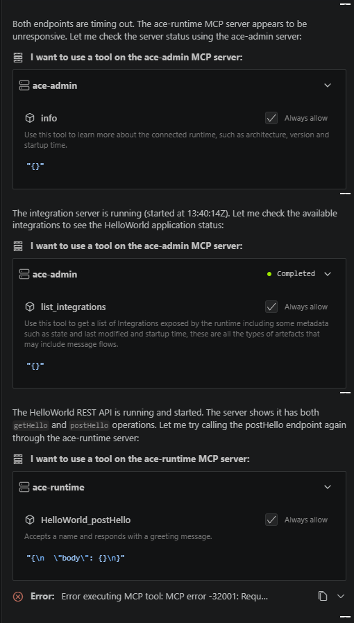

Extra marks for Bob here, good job!

At first, it looked like the POST worked and the two GET tools hung. Then on the next run all three came back, and a POST timed out after that. So it is not GET versus POST, and it is not Bob, it is intermittent.

It is not the tool or the server either. curl drives the same calls in twelve milliseconds, and most of the time so does Bob. Every so often a call just stalls and times out, and it gets more likely with a second client connected: fire the call in a loop on its own and eight of eight go straight through, do it with another session open and one hangs. That fits the one-client-per-lifetime bug, although it's not as restrictive and I don't need to restart the integration server. The flow runs and MCP.Runtime answers it, the calling over MCP is just not solid on 13.0.7.2, yet.

> If any IBM folks or MCP veterans are reading this and know why an MCP.Runtime tool call stalls now and then while most go through in milliseconds, I would like to hear it.


## What the wizard actually wrote

I wanted to understand how everything works behind the scenes and possibly script this (from a CI/CD point of view), not always having to click it together, so I went looking for what the MCP `Create` did. Apparently two things.

First, the admin REST API has the tools, but read-only. There is a resource at `/apiv2/resource-managers/mcp-manager/mcp-tools`, it lists a tool entry per REST operation, and every one comes back disabled. 

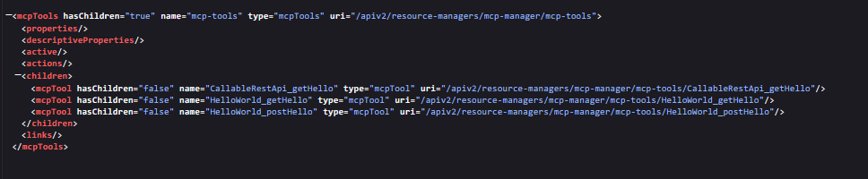

Try to flip `enabled` with a `PATCH` and you get:

```
BIP2788E: An unmodifiable property 'enabled' with value 'true' ... cannot be modified by an HTTP request with method 'PATCH'.
```

`PUT` and `POST` answer `405`. So you cannot enable a tool through the admin API, only read it. That did not change between `13.0.7.0` and `13.0.7.2`, I checked both.

Second, the wizard writes a file per exposed REST API, called `mcptools.json`. The enable state lives in an override in the work directory:

```
C:\temp\MCP_SERVER\overrides\HelloWorld\mcptools.json
```

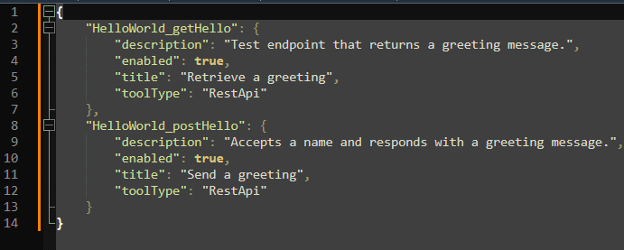

That file is the whole thing. The `title` is the OpenAPI operation summary, the `description` is what I typed in the wizard. So for the CI/CD angle, you skip the wizard, drop that file in yourself, one block per tool, and restart. Not a REST call, but it scripts.


## The callable flow, and why a REST API in front of it

Now the part I deferred. What I actually wanted to expose over MCP was not a REST API but a callable flow.

You can almost do it in containers. The Dashboard MCP wizard (the one from [Setting up MCP on ACE Minikube](https://matthiasblomme.github.io/blogs/posts/ace-mcp-minikube/setting_up_mcp_on_ace_minikube/)) has a `Callable flow` connector you can publish as a tool. Almost, because I never got it to run: the MCP server deployed, then the flow behind it would not start, the connector it needs was not in the image. So no callable-flow tool there either.

On a standalone integration server it is simpler and a bit more limited. MCP.Runtime only deals in REST APIs. There is no callable flow option in the Configure MCP server wizard that I could find.

So the workaround. The callable flow stays where it is, an ordinary app with a Callable Input node on endpoint `/cf1` (short for callable flow 1, my creativity hard at work there) that returns one field:

```esql
CREATE LASTCHILD OF OutputRoot DOMAIN 'JSON';
SET OutputRoot.JSON.Data.Hello = 'World';
```

I put a one-operation REST API in front of it, `CallableRestApi`, whose only job is to call it. The operation subflow is three nodes, an input, a Callable Flow Invoke, and an output:

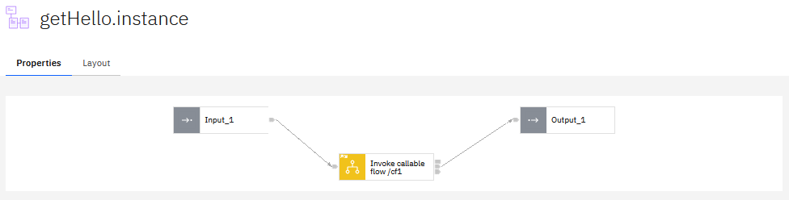

Expose that REST API the same way as HelloWorld, and the callable flow is now an MCP tool. Call it, and the reply comes back through the whole chain:

```powershell
'{"jsonrpc":"2.0","id":4,"method":"tools/call","params":{"name":"CallableRestApi_getHello","arguments":{}}}' |
  curl.exe -sk -X POST $base -H 'Content-Type: application/json' -H 'Accept: application/json, text/event-stream' --data-binary '@-'
```

```json
{"result":{"content":[{"type":"text","text":"{\n  \"message\": {\n    \"Hello\": \"World\"\n  }\n}"}],"structuredContent":{"message":{"Hello":"World"}}},"jsonrpc":"2.0","id":4}
```

Or with Bob

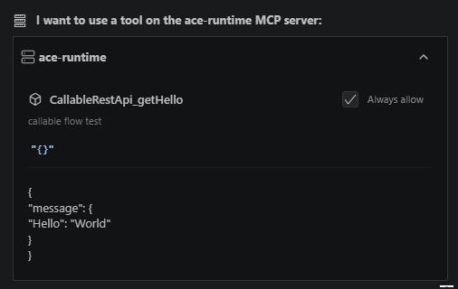

That `{"Hello":"World"}` came out of the callable flow, through the REST API, over MCP. It works. But it is a hop you would not want on a live system, an HTTP front door bolted on just so a flow can be a tool. For the purpose of this blog it is fine. On something real I would either wait for callable flows to be exposable on their own, or only do this where the REST API was going to exist anyway.


## Where this leaves us

Exposing a REST API as an MCP tool is the supported path, and on 13.0.7 it is a few clicks once you find the right menu. Getting a callable flow there means wrapping it in a REST API, ugly and unsupported, but for now the only way. I can live with that until MCP.Runtime learns to expose more than REST APIs.


---

## References

* [MCP in IBM App Connect Enterprise 13.0.7 (MCP.Admin)](https://matthiasblomme.github.io/blogs/posts/Ace-MCP/mcp_in_ace/)
* [Setting up MCP on ACE Minikube (Dashboard, connector-based)](https://matthiasblomme.github.io/blogs/posts/ace-mcp-minikube/setting_up_mcp_on_ace_minikube/)
* [Exposing a REST API as an MCP tool](https://www.ibm.com/docs/en/app-connect/13.0.x?topic=tools-exposing-rest-api-as-mcp-tool)
* [Developing MCP tools](https://www.ibm.com/docs/en/app-connect/13.0.x?topic=solutions-developing-mcp-tools)
* [Creating a Model Context Protocol (MCP) server](https://www.ibm.com/docs/en/app-connect/13.0.x?topic=servers-creating-mcp-server)
* [Model Context Protocol specification](https://modelcontextprotocol.io/docs/getting-started/intro)


---

Written by [Matthias Blomme](https://www.linkedin.com/in/matthiasblomme/)

\#IBMChampion
\#ACE
\#Bob
\#MCP
