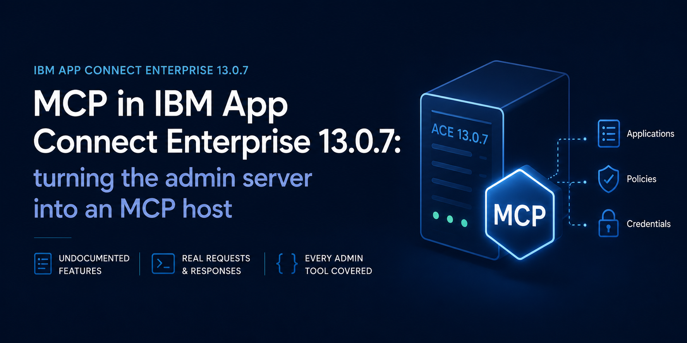{ .md-banner }

<!--MD_POST_META:START-->
<div class="md-post-meta">
  <div class="md-post-meta-left">2026-05-19 · ⏱ 47 min</div>
  <div class="md-post-meta-right"><span class="post-share-label">Share:</span> <a class="post-share post-share-linkedin" href="https://www.linkedin.com/sharing/share-offsite/?url=https%3A%2F%2Fmatthiasblomme.github.io%2Fblogs%2Fposts%2FAce-MCP%2Fmcp_in_ace%2F" target="_blank" rel="noopener" title="Share on LinkedIn">[<span class="in">in</span>]</a></div>
</div>
<hr class="md-post-divider"/>
<div class="md-post-tags"><span class="md-tag">ace</span> <span class="md-tag">mcp</span> <span class="md-tag">model-context-protocol</span> <span class="md-tag">ai</span> <span class="md-tag">integration</span> <span class="md-tag">server.conf.yaml</span></div>
<!--MD_POST_META:END-->


# MCP in IBM App Connect Enterprise 13.0.7

IBM shipped a cheeky little feature in the latest ACE release. Hidden, or at least undocumented.

ACE `13.0.7.0` brings with it an MCP server _inside_ the IntegrationServer runtime. It's configured via a new `MCP:` block in
`server.conf.yaml` and has two sibling stanzas: `Admin` and `Runtime`.

- `MCP.Runtime` exposes deployed Toolkit REST API operations as MCP tools , the headline 13.0.7 feature.
- `MCP.Admin` exposes a set of administration tools (list applications, list policies, etc., all read only) so an MCP-enabled agent
  can introspect the integration server itself. This is the one the IBM docs currently say nothing about.

This post walks through enabling `MCP.Admin` on a vanilla standalone integration server, hitting it from both
[MCP Inspector](https://github.com/modelcontextprotocol/inspector) (the official GUI) and plain `curl`, and triggering every MCP feature available. For each tool you 
get the description the server publishes, the JSON request, an Inspector screenshot, the `curl` equivalent, and the actual 
JSON response from a real integration server populated with applications, policies, and credentials.

> **No auth in this post.** `MCP.Admin` is unauthenticated by default, and we're keeping it that way to keep the
> examples short. Anything reachable beyond your laptop should set authentication and serve over TLS with a proper
> certificate, see [the auth section](#auth-do-this-before-anyone-else-can-reach-the-port) at the end.


## Assumptions

* IBM App Connect Enterprise `13.0.7.0` or later installed locally.
* You can start a standalone integration server with a writable work directory (for this blog I'll be using `c:\temp\MCP_SERVER`).
* Node.js available so `npx @modelcontextprotocol/inspector` works.
* `curl` available (Windows 10+ ships it, on PowerShell call `curl.exe` so you don't get the `Invoke-WebRequest`
  alias).
* You've deployed at least one application / policy / credential into the runtime, otherwise there is nothing to report on.


## Step 1: Enable MCP.Admin in overrides

The `server.conf.yaml` ACE ships is large and rebuilt on every fixpack, so you don't want to edit it in place. The clean 
pattern is to drop a tiny `server.conf.yaml` into the work directory's `overrides/` folder. Having a separate file with
just the deltas to get your server running is also handy if you are thinking about versioning your config.

```yaml
# c:\temp\MCP_SERVER\overrides\server.conf.yaml
MCP:
  Admin:
    enabled: true       # default false
    port: 7650          # default 7650; leave as-is unless 7650 is taken
```

Two properties is all the `MCP.Admin` block has on `13.0.7.0`. Enabling the MCP server and setting the port. TLS-wise it 
inherits from `RestAdminListener`, so if your admin listener is on HTTPS (and on a default install it is), 
`MCP.Admin` is HTTPS too.

Restart the integration server after enabling the MCP. You should see two listener-start log lines, one for the admin 
REST endpoint and one for MCP:

```
2026-05-19 13:48:54.290436: BIP3132I: The HTTP Listener has started listening on port '7777' for 'RestAdmin https' connections.
2026-05-19 13:48:54.308828: BIP3132I: The HTTP Listener has started listening on port '7650' for 'MCP Streamable https' connections.
```

The port `7777` for `RestAdmin https` is what I happen to have configured (since I am running multiple servers). New 
Integration Servers default to `7600`.


## Step 2: Hook up a client

Two ways to drive the MCP server (there are more, but I chose one graphical and one CLI option). Pick one, or use both 
side by side. I'll show both so you can compare.

### MCP Inspector (recommended for browsing)

MCP Inspector is a Node.js developer tool for testing and debugging MCP servers.

The MCP Inspector consists of two main components that work together:
- MCP Inspector Client (MCPI): A React-based web UI that provides an interactive interface for testing and debugging MCP servers
- MCP Proxy (MCPP): A Node.js server that acts as a protocol bridge, connecting the web UI to MCP servers via various transport methods (stdio, SSE, streamable-http)

(Yes, I took this description from their GitHub).

Basically it gives you a graphical interface and shows you what tools an MCP server offers. Just for those situations when
you encounter an undocumented MCP.

For my local setup, I needed to start by telling Node.js that it should ignore the ACE self-signed cert. If you don't, 
you might encounter an error like this, so be warned.

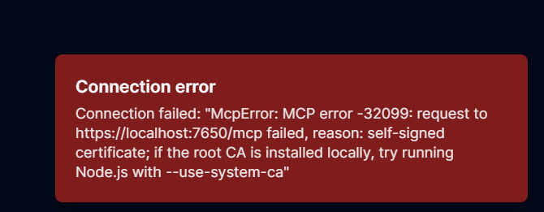

```cmd
set NODE_TLS_REJECT_UNAUTHORIZED=0
npx @modelcontextprotocol/inspector
```

Or if you prefer PowerShell

```powershell
$env:NODE_TLS_REJECT_UNAUTHORIZED = "0"
npx @modelcontextprotocol/inspector
```

After installation, the Inspector spawns a local UI at `http://localhost:6274/`. 

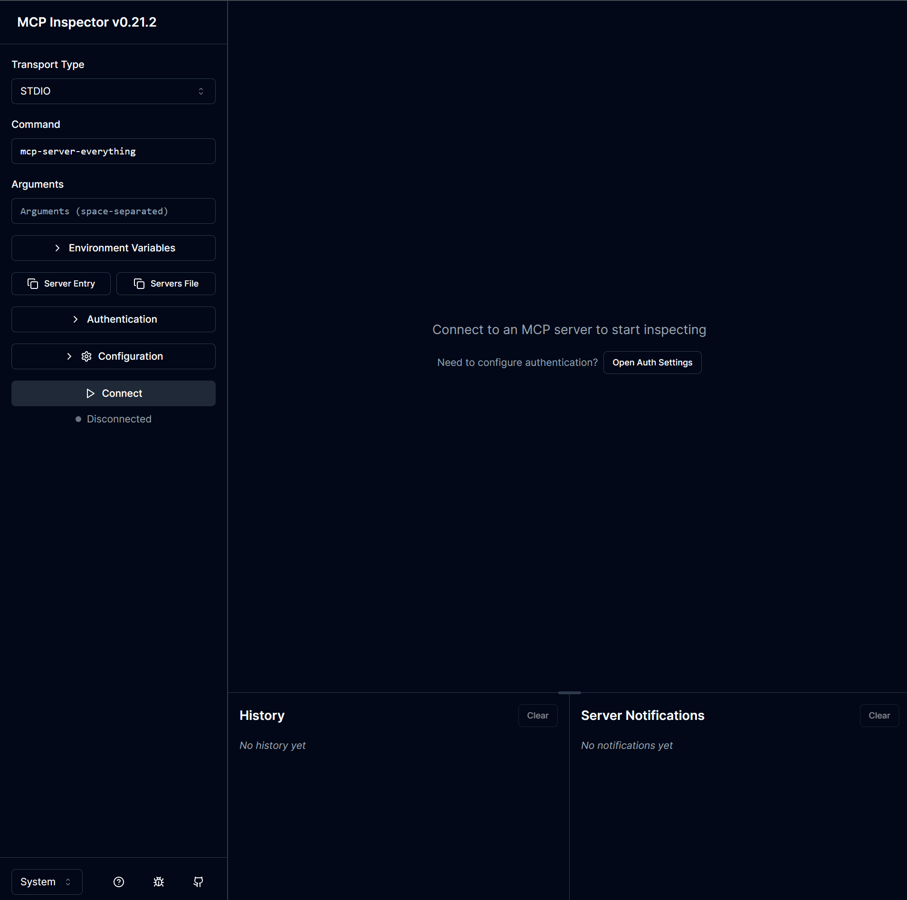

To talk to the ACE MCP, we need some configuration:

| Field           | Value                                             |
|-----------------|---------------------------------------------------|
| Transport Type  | Streamable HTTP (not SSE , ACE doesn't accept SSE) |
| URL             | https://localhost:7650/mcp                        | 
| Connection Type | Leave this set to "Via Proxy"                     |
| Authentication  | leave collapsed                                   |
| Configuration   | defaults are fine                                 |

Click `Connect` and the status changes to `Connected` with `App Connect Enterprise / Version: 13.0.7.0` shown in the
left pane. The `Tools` tab is what we are interested in

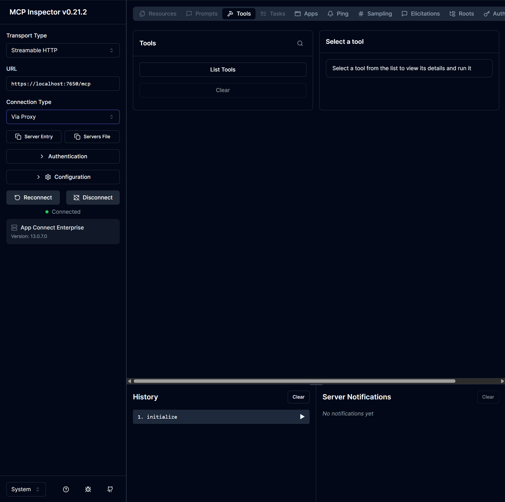


### Curl

MCP Streamable HTTP is simply JSON-RPC over a stateful HTTP session. If you know what you need, then you can very easily
use curl, instead of an additional tool. Three things you need to know:

1. The **first** call must be `initialize`. The server's response includes an `Mcp-Session-Id` header.
2. All subsequent calls must echo that `Mcp-Session-Id` header back.
3. The server sometimes responds as `text/event-stream` (SSE) and sometimes as plain JSON depending on the call ,
   send `Accept: application/json, text/event-stream` for each call.

Below you can see the full handshake in PowerShell, capturing the session ID for later calls:

```powershell
$base = 'https://localhost:7650/mcp'
$initBody = @{
  jsonrpc = '2.0'; id = 1; method = 'initialize'
  params  = @{
    protocolVersion = '2025-06-18'
    capabilities    = @{}
    clientInfo      = @{ name = 'blog-tester'; version = '1.0' }
  }
} | ConvertTo-Json -Depth 5 -Compress

# initialize , grab the Mcp-Session-Id header
$resp = Invoke-WebRequest -Method POST -Uri $base -SkipCertificateCheck `
  -Headers @{ 'Content-Type' = 'application/json'
              'Accept'       = 'application/json, text/event-stream' } `
  -Body $initBody
$session = $resp.Headers['Mcp-Session-Id']
$session

# initialized notification (no response body expected)
$notif = '{"jsonrpc":"2.0","method":"notifications/initialized"}'
Invoke-WebRequest -Method POST -Uri $base -SkipCertificateCheck `
  -Headers @{ 'Content-Type'    = 'application/json'
              'Accept'          = 'application/json, text/event-stream'
              'Mcp-Session-Id'  = $session } `
  -Body $notif | Out-Null
```

Bash equivalent, same pattern with `curl -D -` to capture headers:

```bash
BASE='https://localhost:7650/mcp'
SESSION=$(curl -sk -D - -X POST "$BASE" \
  -H "Content-Type: application/json" \
  -H "Accept: application/json, text/event-stream" \
  -d '{"jsonrpc":"2.0","id":1,"method":"initialize","params":{"protocolVersion":"2025-06-18","capabilities":{},"clientInfo":{"name":"blog-tester","version":"1.0"}}}' \
  | tr -d '\r' | awk 'BEGIN{IGNORECASE=1} /^mcp-session-id:/{print $2}')

curl -sk -X POST "$BASE" \
  -H "Content-Type: application/json" \
  -H "Accept: application/json, text/event-stream" \
  -H "Mcp-Session-Id: $SESSION" \
  -d '{"jsonrpc":"2.0","method":"notifications/initialized"}' > /dev/null
```

From here on, every `tools/list` or `tools/call` is just another POST request with `Mcp-Session-Id: $SESSION`. Each tool
section below shows only the `tools/call` body and the response, you reuse the same initial handshake once per shell.

> **One MCP client at a time.** ACE 13.0.7.0 has a bug where the integration server only accepts one MCP client per
> server lifetime, the first one wins. Every subsequent client trying to `initialize` gets back a generic
> `500 Internal Server Error`. This took me a while to figure out, so hopefully I can save you the trouble. Restart the 
> integration server to switch from Inspector to curl (or vice versa). See the [Only one MCP client at a time](#only-one-mcp-client-at-a-time) 
> section for the technical mumbo jumbo.


## Step 3: Tools registered by `MCP.Admin`

Now we get to the point: what `MCP.Admin` actually gives us. On `13.0.7.0`, `MCP.Admin` exposes six tools. Each one has 
a short `name` (the protocol identifier you send in `tools/call`) and a `title` (the English sentence Inspector shows you):

| #  | `name`                   | `title`                                                                                                       |
|----|--------------------------|---------------------------------------------------------------------------------------------------------------|
| 1  | `info`                   | Provide basic information about the connected server                                                          |
| 2  | `list_integrations`      | List the Applications, Rest APIS, Services and Libraries of an integration runtime, together with their state |
| 3  | `list_application_needs` | List any deployment or runtime resources this application needs                                               |
| 4  | `list_policies`          | List the policies of an integration runtime                                                                   |
| 5  | `list_credentials`       | List the credentials of an integration runtime                                                                |
| 6  | `describe_message_flow`  | Return a structure with information detailing a message flow                                                  |


What you need to know:

- The protocol-level `name` you POST in `tools/call` is the short identifier (`info`, `list_integrations`, …). The English 
  sentence is just the `title` Inspector displays. Inspector handles this for you when you click a tool. In `curl` you 
  have to send the short form.
- None of the six tools is annotated with the standard MCP hints (`readOnlyHint`, `destructiveHint`,
  `idempotentHint`, `openWorldHint`). Inspector renders them all as ✗ , but they're all clearly read-only, so this
  is just missing annotation metadata.

@IBM, there is still some room for improvement here 😉

I'll be going over each tool, showing:

1. The Inspector screenshot of running the tool.
2. The `tools/call`.
3. The actual JSON response from a real integration server with these resources deployed.

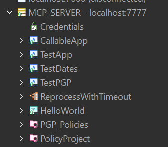

I don't want to get your hopes up (and maybe I should have mentioned this sooner), but ... The MCP only gives you static
information about your Integration Server, there is no interactivity, no CRUD and no logging or debugging tools.

### 3.1 Provide basic information about the connected server

This MCP tool gives you information about the connected runtime, such as architecture, version and startup time.

#### Inspector

Select the `Provide basic information about the connected server` tool in the middle panel → `Run Tool` 
(no arguments required).

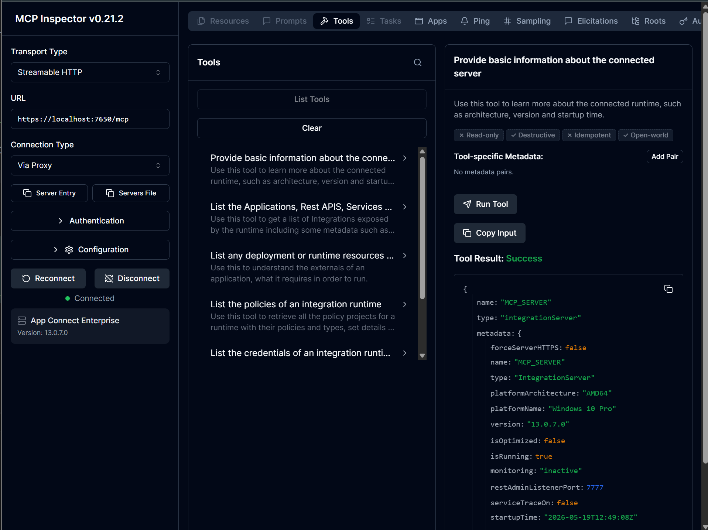

#### Curl
Run the following curl, after performing the handshake, with `$SESSION` set (see _Step 2_)

```bash
curl -sk -X POST "$BASE" \
  -H "Content-Type: application/json" \
  -H "Accept: application/json, text/event-stream" \
  -H "Mcp-Session-Id: $SESSION" \
  -d '{"jsonrpc":"2.0","id":2,"method":"tools/call","params":{"name":"info","arguments":{}}}'
```

**Response** (the wire format wraps the payload in `result.content[0].text` as an escaped string; unwrapped for readability):

```json
{
  "name": "MCP_SERVER",
  "type": "integrationServer",
  "metadata": {
    "forceServerHTTPS": false,
    "name": "MCP_SERVER",
    "type": "IntegrationServer",
    "platformArchitecture": "AMD64",
    "platformName": "Windows 10 Pro",
    "version": "13.0.7.0",
    "isOptimized": false,
    "isRunning": true,
    "monitoring": "inactive",
    "restAdminListenerPort": 7777,
    "serviceTraceOn": false,
    "startupTime": "2026-05-19T14:22:09Z",
    "userTraceOn": false
  }
}
```


### 3.2 List the Applications, Rest APIs, Services and Libraries of an integration runtime, together with their state

This MCP tool gives you information about your deployed resources. Including some metadata such as state and last modified 
and startup times.

#### Inspector

Select the `List the Applications, Rest APIS, Services and Libraries of an integration runtime, together with their state` 
tool in the middle panel → `Run Tool` (no arguments required).

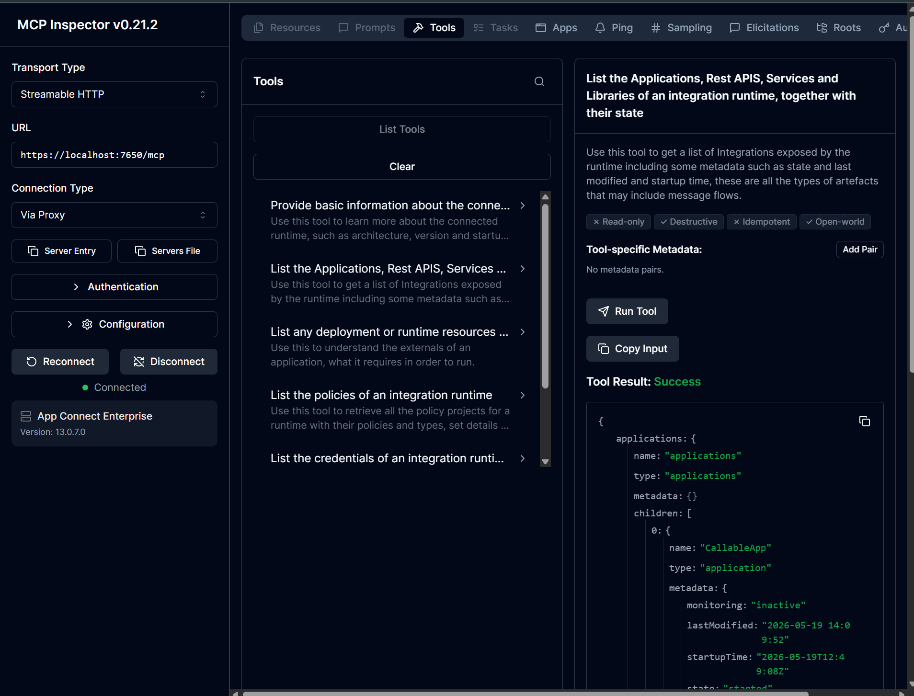

#### Curl

```bash
curl -sk -X POST "$BASE" \
  -H "Content-Type: application/json" \
  -H "Accept: application/json, text/event-stream" \
  -H "Mcp-Session-Id: $SESSION" \
  -d '{"jsonrpc":"2.0","id":3,"method":"tools/call","params":{"name":"list_integrations","arguments":{}}}'
```

**Response** (unwrapped from `result.content[0].text`):

<details>
<summary>Full response (click to expand)</summary>

```json
{
  "applications": {
    "name": "applications",
    "type": "applications",
    "metadata": {},
    "children": [
      {
        "name": "CallableApp",
        "type": "application",
        "metadata": {
          "monitoring": "inactive",
          "lastModified": "2026-05-19 14:09:52",
          "startupTime": "2026-05-19T14:22:09Z",
          "state": "started"
        },
        "children": [
          { "name": "subflows",    "type": "subFlows",    "metadata": {} },
          { "name": "resources",   "type": "resources",   "metadata": {},
            "children": [
              { "name": "com\\mbl\\test\\CallableFlow_HelloWorld.esql", "type": "resource", "metadata": {} }
            ]
          },
          { "name": "libraries",   "type": "libraries",   "metadata": {} },
          { "name": "messageflows","type": "messageFlows","metadata": {},
            "children": [
              { "name": "com.mbl.test.CallableFlow", "type": "messageFlow", "metadata": {} }
            ]
          },
          { "name": "statistics",  "type": "statistics",  "metadata": {},
            "children": [
              { "name": "snapshot", "type": "snapshot", "metadata": {} },
              { "name": "archive",  "type": "archive",  "metadata": {} }
            ]
          }
        ]
      },
      {
        "name": "TestApp",
        "type": "application",
        "metadata": {
          "monitoring": "inactive",
          "lastModified": "2026-05-19 14:17:04",
          "startupTime": "2026-05-19T14:22:09Z",
          "state": "started"
        },
        "children": [
          { "name": "subflows", "type": "subFlows", "metadata": {} },
          { "name": "resources","type": "resources","metadata": {},
            "children": [
              { "name": "JEN_inputMessage.xml", "type": "resource", "metadata": {} },
              { "name": "TestFlow_Compute.esql","type": "resource", "metadata": {} },
              { "name": "TEST_XML.json",        "type": "resource", "metadata": {} }
            ]
          },
          { "name": "libraries", "type": "libraries", "metadata": {} },
          { "name": "messageflows","type":"messageFlows","metadata": {},
            "children": [{ "name": "TestFlow", "type": "messageFlow", "metadata": {} }]
          },
          { "name": "statistics","type":"statistics","metadata": {},
            "children": [
              { "name": "snapshot","type":"snapshot","metadata": {} },
              { "name": "archive", "type":"archive", "metadata": {} }
            ]
          }
        ]
      },
      {
        "name": "TestDates",
        "type": "application",
        "metadata": {
          "monitoring": "inactive",
          "lastModified": "2026-05-19 14:10:08",
          "startupTime": "2026-05-19T14:22:09Z",
          "state": "started"
        },
        "children": [
          { "name": "subflows","type":"subFlows","metadata": {} },
          { "name": "resources","type":"resources","metadata": {},
            "children": [
              { "name": "TestDates_Compute.esql",   "type": "resource", "metadata": {} },
              { "name": "TestDates_inputMessage.xml","type":"resource", "metadata": {} }
            ]
          },
          { "name": "libraries","type":"libraries","metadata": {} },
          { "name": "messageflows","type":"messageFlows","metadata": {},
            "children": [{ "name": "TestDates", "type": "messageFlow", "metadata": {} }]
          },
          { "name": "statistics","type":"statistics","metadata": {},
            "children": [
              { "name": "snapshot","type":"snapshot","metadata": {} },
              { "name": "archive", "type":"archive", "metadata": {} }
            ]
          }
        ]
      },
      {
        "name": "TestPGP",
        "type": "application",
        "metadata": {
          "monitoring": "inactive",
          "lastModified": "2026-04-03 15:32:28",
          "startupTime": "2026-05-19T14:22:09Z",
          "state": "started"
        },
        "children": [
          { "name": "subflows","type":"subFlows","metadata": {} },
          { "name": "resources","type":"resources","metadata": {},
            "children": [
              { "name": "pgp\\decrypt_inputMessage.xml","type":"resource","metadata": {} },
              { "name": "pgp\\encrypt_inputMessage.xml","type":"resource","metadata": {} },
              { "name": "pgp\\testpgp_Compute.esql",    "type":"resource","metadata": {} }
            ]
          },
          { "name": "libraries","type":"libraries","metadata": {} },
          { "name": "messageflows","type":"messageFlows","metadata": {},
            "children": [
              { "name": "pgp.decrypt","type":"messageFlow","metadata": {} },
              { "name": "pgp.encrypt","type":"messageFlow","metadata": {} }
            ]
          },
          { "name": "statistics","type":"statistics","metadata": {},
            "children": [
              { "name": "snapshot","type":"snapshot","metadata": {} },
              { "name": "archive", "type":"archive", "metadata": {} }
            ]
          }
        ]
      }
    ]
  },
  "restapis": {
    "name": "rest-apis",
    "type": "restApis",
    "metadata": {},
    "children": [
      {
        "name": "HelloWorld",
        "type": "restApi",
        "metadata": {
          "monitoring": "inactive",
          "lastModified": "2026-05-19 14:09:50",
          "startupTime": "2026-05-19T14:22:09Z",
          "state": "started"
        },
        "children": [
          { "name": "subflows","type":"subFlows","metadata": {},
            "children": [
              { "name": "getHello",                          "type":"subFlow","metadata": {} },
              { "name": "HelloWorldInputCatchHandler",       "type":"subFlow","metadata": {} },
              { "name": "HelloWorldInputFailureHandler",     "type":"subFlow","metadata": {} },
              { "name": "HelloWorldInputTimeoutHandler",     "type":"subFlow","metadata": {} },
              { "name": "postHello",                         "type":"subFlow","metadata": {} }
            ]
          },
          { "name": "resources","type":"resources","metadata": {},
            "children": [
              { "name": "getHello_Compute.esql",                       "type":"resource","metadata": {} },
              { "name": "hello.yaml",                                  "type":"resource","metadata": {} },
              { "name": "HelloWorldInputCatchHandler_Compute.esql",    "type":"resource","metadata": {} },
              { "name": "HelloWorldInputFailureHandler_Compute.esql",  "type":"resource","metadata": {} },
              { "name": "HelloWorldInputTimeoutHandler_Compute.esql",  "type":"resource","metadata": {} },
              { "name": "postHello_Compute.esql",                      "type":"resource","metadata": {} }
            ]
          },
          { "name": "libraries","type":"libraries","metadata": {} },
          { "name": "messageflows","type":"messageFlows","metadata": {},
            "children": [{ "name": "gen.HelloWorld","type":"messageFlow","metadata": {} }]
          },
          { "name": "document",  "type":"document",  "metadata": {} },
          { "name": "interface", "type":"interface", "metadata": { "lastModified":"2026-05-19 14:09:50" },
            "children": [
              { "name": "getHello", "type":"operation","metadata": {} },
              { "name": "postHello","type":"operation","metadata": {} }
            ]
          },
          { "name": "statistics","type":"statistics","metadata": {},
            "children": [
              { "name": "snapshot","type":"snapshot","metadata": {} },
              { "name": "archive", "type":"archive", "metadata": {} }
            ]
          }
        ]
      }
    ]
  },
  "services": {
    "name": "services",
    "type": "services",
    "metadata": {}
  },
  "libraries": {
    "name": "shared-libraries",
    "type": "sharedLibraries",
    "metadata": {},
    "children": [
      {
        "name": "ReprocessWithTimeout",
        "type": "sharedLibrary",
        "metadata": { "lastModified":"2026-05-19 14:10:00" },
        "children": [
          { "name": "subflows","type":"subFlows","metadata": {},
            "children": [
              { "name": "com.id.reprocess.timeout.ReprocessWithTimeoutSeperateTransaction","type":"subFlow","metadata": {} },
              { "name": "com.id.reprocess.timeout.ReprocessWithTimeoutSingleTransaction",  "type":"subFlow","metadata": {} }
            ]
          },
          { "name": "resources","type":"resources","metadata": {},
            "children": [
              { "name": "com\\id\\reprocess\\timeout\\TimeoutSeperateTransaction_CheckRetry.esql","type":"resource","metadata": {} },
              { "name": "com\\id\\reprocess\\timeout\\WaitForTimeout_Retry.esql",                "type":"resource","metadata": {} }
            ]
          }
        ]
      }
    ]
  }
}
```

</details>

That's a lot of structure for one tool, but it's all there: four applications (`CallableApp`, `TestApp`, `TestDates`, `TestPGP`), one REST API (`HelloWorld` with its two operations `getHello` / `postHello`), no services, and one shared library (`ReprocessWithTimeout`). Each artefact gets a state, last-modified timestamp, and startup time, plus its internal children (subflows, resources, message flows, statistics).


### 3.3 List any deployment or runtime resources this application needs

This MCP tool gives you information about your dependencies. It shows the externals of an application, what it requires 
in order to run. It requires a mandatory application name as a parameter , e.g. `TestApp` or `TestPGP` for our runtime.

#### Inspector

Select the `List any deployment or runtime resources this application needs` tool in the middle panel, specify an application
you want to look at → `Run Tool` 

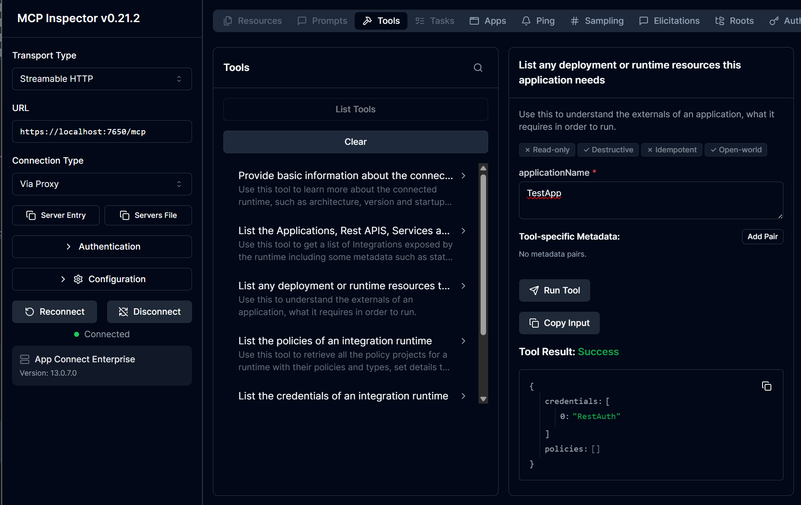

#### Curl

```bash
curl -sk -X POST "$BASE" \
  -H "Content-Type: application/json" \
  -H "Accept: application/json, text/event-stream" \
  -H "Mcp-Session-Id: $SESSION" \
  -d '{"jsonrpc":"2.0","id":4,"method":"tools/call","params":{"name":"list_application_needs","arguments":{"applicationName":"TestApp"}}}'
```

The argument key is `applicationName` (not `application`, caught me out the first time).

**Response** (unwrapped from `result.content[0].text`):

```json
{
  "credentials": ["RestAuth"],
  "policies": []
}
```

So `TestApp` needs the `RestAuth` credential to run and doesn't reference any policy. Useful as a pre-deploy sanity check.


### 3.4 List the policies of an integration runtime

This MCP tool gives you information about the available policies. Either for a specific Policy Project or for the full 
Integration Server. With optional policy details.

#### Inspector

Select the `List the policies of an integration runtime` tool in the middle panel, run it as is, or select a specific 
project you want to look at → `Run Tool`

For the full runtime

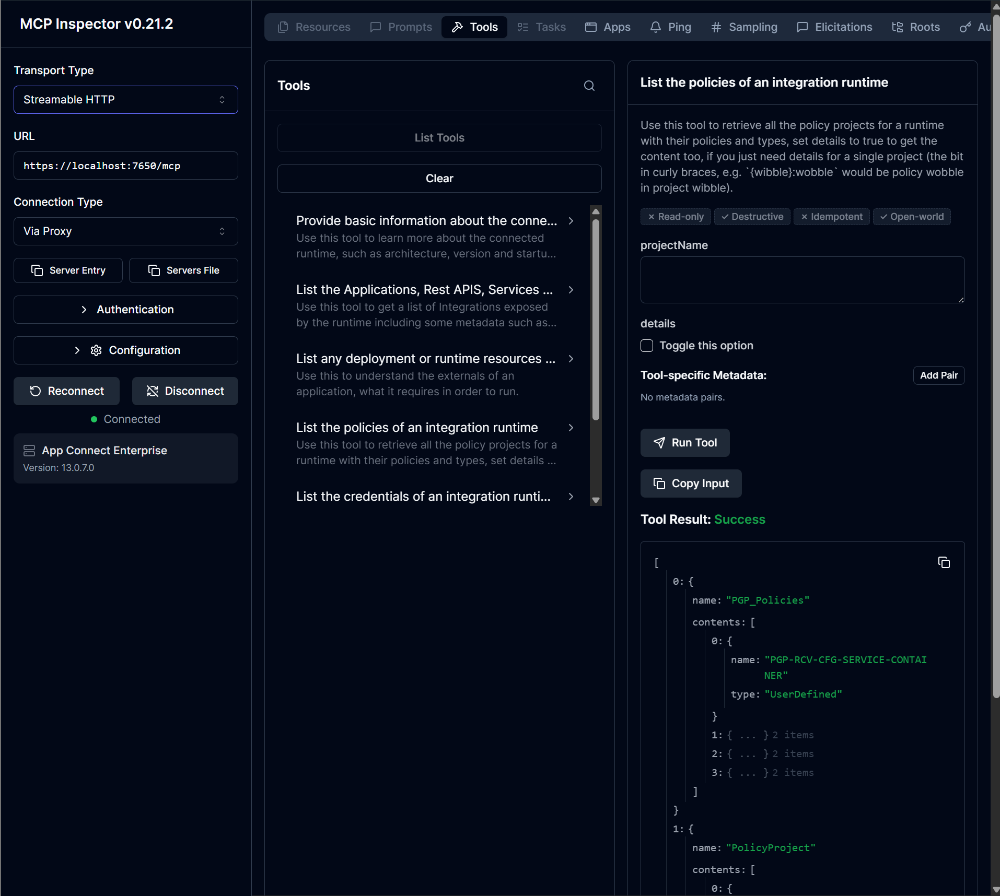

For a specific Policy Project

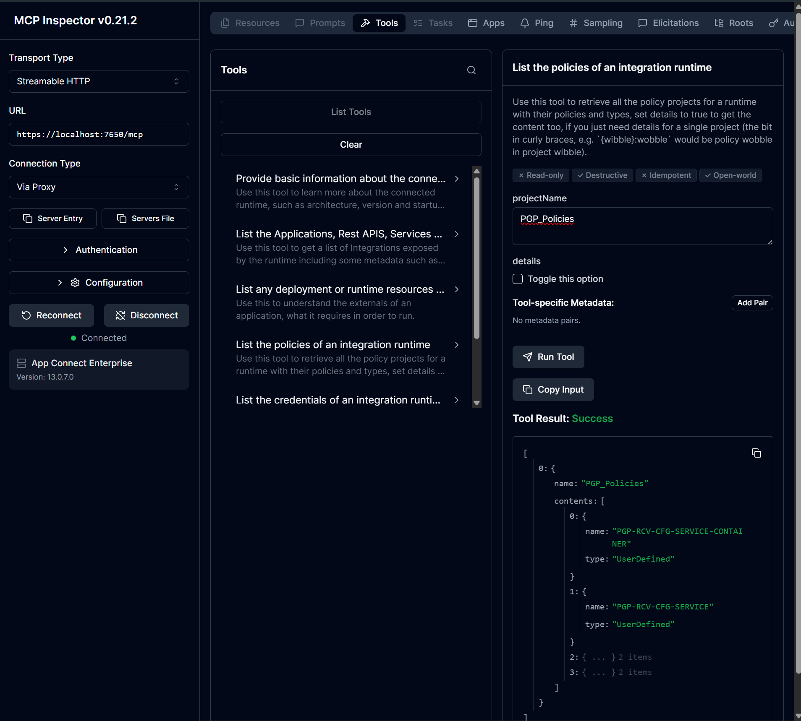

With full details

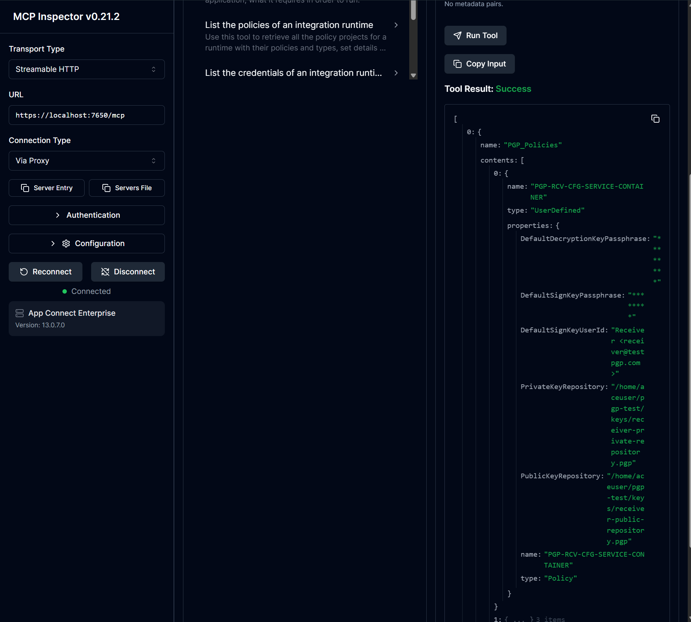

#### Curl

**Summary across all policy projects** (no arguments):

```bash
curl -sk -X POST "$BASE" \
  -H "Content-Type: application/json" \
  -H "Accept: application/json, text/event-stream" \
  -H "Mcp-Session-Id: $SESSION" \
  -d '{"jsonrpc":"2.0","id":5,"method":"tools/call","params":{"name":"list_policies","arguments":{}}}'
```

**Response:**

```json
[
  {
    "name": "PGP_Policies",
    "contents": [
      { "name": "PGP-RCV-CFG-SERVICE-CONTAINER", "type": "UserDefined" },
      { "name": "PGP-RCV-CFG-SERVICE",           "type": "UserDefined" },
      { "name": "PGP-SDR-CFG-SERVICE-CONTAINER", "type": "UserDefined" },
      { "name": "PGP-SDR-CFG-SERVICE",           "type": "UserDefined" }
    ]
  },
  {
    "name": "PolicyProject",
    "contents": [
      { "name": "DefaultMQ",              "type": "MQEndpoint" },
      { "name": "DefaultMQInsecure",      "type": "MQEndpoint" },
      { "name": "DefaultMQInsecureLocal", "type": "MQEndpoint" },
      { "name": "sftp_policy",            "type": "FtpServer"  },
      { "name": "sftp_policy2",           "type": "FtpServer"  }
    ]
  }
]
```

**Single project, with full details** (`projectName` + `details=true`):

```bash
curl -sk -X POST "$BASE" \
  -H "Content-Type: application/json" \
  -H "Accept: application/json, text/event-stream" \
  -H "Mcp-Session-Id: $SESSION" \
  -d '{"jsonrpc":"2.0","id":6,"method":"tools/call","params":{"name":"list_policies","arguments":{"projectName":"PolicyProject","details":true}}}'
```

The schema names the selector `projectName` (and `details` as a separate boolean), not the `{wibble}:wobble` selector string the tool description hints at. The description is misleading here.

**Response:**

<details>
<summary>Full response (click to expand)</summary>

```json
[
  {
    "name": "PolicyProject",
    "contents": [
      {
        "name": "DefaultMQ",
        "type": "MQEndpoint",
        "properties": {
          "CCDTUrl": "",
          "MQApplName": "",
          "SSLCertificateLabel": "",
          "SSLCipherSpec": "",
          "SSLPeerName": "",
          "agentId": "",
          "channelName": "DEV.APP.SVRCONN",
          "connection": "CLIENT",
          "destinationQueueManagerName": "QM1",
          "listenerPortNumber": 1414,
          "name": "DefaultMQ",
          "queueManagerHostname": "localhost",
          "reconnectOption": "default",
          "securityIdentity": "qm1",
          "type": "Policy",
          "useSSL": false
        }
      },
      {
        "name": "DefaultMQInsecure",
        "type": "MQEndpoint",
        "properties": {
          "CCDTUrl": "",
          "MQApplName": "",
          "SSLCertificateLabel": "",
          "SSLCipherSpec": "",
          "SSLPeerName": "",
          "agentId": "",
          "channelName": "INSECURE.APP.SVRCONN",
          "connection": "CLIENT",
          "destinationQueueManagerName": "qmgrpoc",
          "listenerPortNumber": 1414,
          "name": "DefaultMQInsecure",
          "queueManagerHostname": "qmgr-poc-ibm-mq",
          "reconnectOption": "default",
          "securityIdentity": "",
          "type": "Policy",
          "useSSL": false
        }
      },
      {
        "name": "DefaultMQInsecureLocal",
        "type": "MQEndpoint",
        "properties": {
          "CCDTUrl": "",
          "MQApplName": "",
          "SSLCertificateLabel": "",
          "SSLCipherSpec": "",
          "SSLPeerName": "",
          "agentId": "",
          "channelName": "INSECURE.APP.SVRCONN",
          "connection": "CLIENT",
          "destinationQueueManagerName": "QM1",
          "listenerPortNumber": 1414,
          "name": "DefaultMQInsecureLocal",
          "queueManagerHostname": "localhost",
          "reconnectOption": "default",
          "securityIdentity": "",
          "type": "Policy",
          "useSSL": false
        }
      },
      {
        "name": "sftp_policy",
        "type": "FtpServer",
        "properties": {
          "allowedCiphers": "",
          "fileFtpAccountInfo": "",
          "fileFtpCompression": 0,
          "fileFtpConnectionType": "PASSIVE",
          "fileFtpDirectory": "",
          "fileFtpScanDelay": null,
          "fileFtpServer": "itcsubmit.wustl.edu:22",
          "fileFtpTransferMode": "",
          "fileFtpUser": "testId",
          "knownHostsFile": "",
          "mac": "",
          "name": "sftp_policy",
          "preserveRemoteFileDate": false,
          "proxyPolicyName": "",
          "remoteTransferType": "",
          "sslProtocol": "TLSv1.2",
          "strictHostKeyChecking": false,
          "timeoutInterval": 0,
          "type": "Policy"
        }
      },
      {
        "name": "sftp_policy2",
        "type": "FtpServer",
        "properties": {
          "allowedCiphers": "",
          "fileFtpAccountInfo": "",
          "fileFtpCompression": 0,
          "fileFtpConnectionType": "PASSIVE",
          "fileFtpDirectory": "",
          "fileFtpScanDelay": null,
          "fileFtpServer": "itcsubmit.wustl.edu:22",
          "fileFtpTransferMode": "",
          "fileFtpUser": "testId2",
          "knownHostsFile": "",
          "mac": "",
          "name": "sftp_policy2",
          "preserveRemoteFileDate": false,
          "proxyPolicyName": "",
          "remoteTransferType": "",
          "sslProtocol": "TLSv1.2",
          "strictHostKeyChecking": false,
          "timeoutInterval": 0,
          "type": "Policy"
        }
      }
    ]
  }
]
```

</details>

Now you can see exactly which queue manager `DefaultMQ` is pointing at, what channel `DefaultMQInsecure` uses, which SFTP server the `sftp_policy2` is configured for, etc. , without having to crack open the policy XML on disk.


### 3.5 List the credentials of an integration runtime

This MCP tool gives you an overview of all registered credentials for your runtime. It is (like the other tools), read-only,
and it doesn't give you any actual usernames or passwords (which makes sense).

#### Inspector

Select the `List the credentials of an integration runtime` tool in the middle panel → `Run Tool`

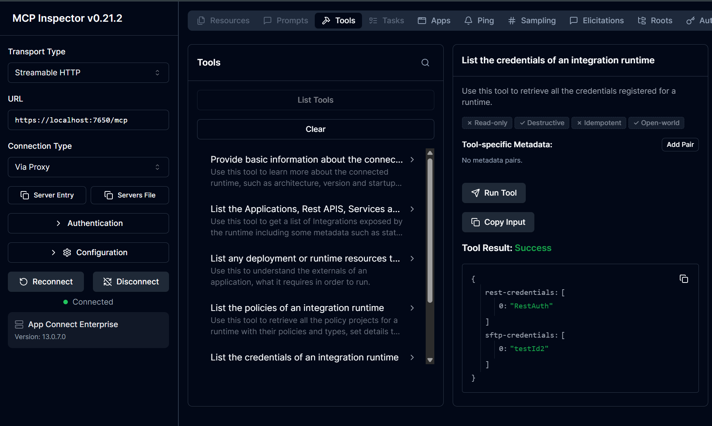

#### Curl

```bash
curl -sk -X POST "$BASE" \
  -H "Content-Type: application/json" \
  -H "Accept: application/json, text/event-stream" \
  -H "Mcp-Session-Id: $SESSION" \
  -d '{"jsonrpc":"2.0","id":7,"method":"tools/call","params":{"name":"list_credentials","arguments":{}}}'
```

**Response** (unwrapped from `result.content[0].text`):

```json
{
  "rest-credentials": ["RestAuth"],
  "sftp-credentials": ["testId2"]
}
```

Just the aliases, grouped by credential type. No usernames, no passwords. So the LLM can ask "which credentials exist?" but can't read what's in them, which is the right design for a read-only tool.


### 3.6 Return a structure with information detailing a message flow

This MCP tool gives you a text-based description of a deployed message flow: its nodes, the links between them, 
runtime state, and any per-node metadata (security identities, that kind of thing). Requires both `applicationName` and
`flowName`.

#### Inspector

Select the `Return a structure with information detailing a message flow` tool in the middle panel, fill in the
application and the flow → `Run Tool`.

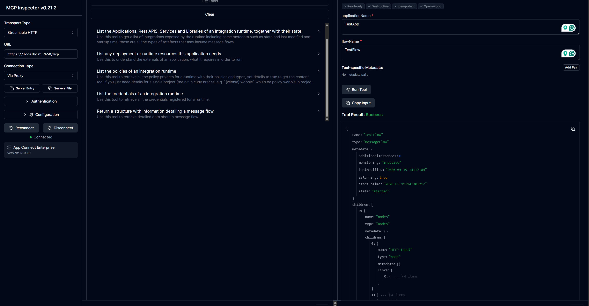

#### Curl

```bash
curl -sk -X POST "$BASE" \
  -H "Content-Type: application/json" \
  -H "Accept: application/json, text/event-stream" \
  -H "Mcp-Session-Id: $SESSION" \
  -d '{"jsonrpc":"2.0","id":8,"method":"tools/call","params":{"name":"describe_message_flow","arguments":{"applicationName":"TestApp","flowName":"TestFlow"}}}'
```

**Response** (unwrapped from `result.content[0].text`):

```json
{
  "name": "TestFlow",
  "type": "messageFlow",
  "metadata": {
    "additionalInstances": 0,
    "monitoring": "inactive",
    "lastModified": "2026-05-19 14:17:04",
    "isRunning": true,
    "startupTime": "2026-05-19T14:22:09Z",
    "state": "started"
  },
  "children": [
    {
      "name": "nodes",
      "type": "nodes",
      "metadata": {},
      "children": [
        {
          "name": "HTTP Input",
          "type": "node",
          "metadata": {},
          "links": [
            { "sourceNode": "HTTP Input", "targetNode": "Compute", "sourceTerminal": "out", "targetTerminal": "in" }
          ]
        },
        {
          "name": "Compute",
          "type": "node",
          "metadata": {},
          "links": [
            { "sourceNode": "HTTP Input", "targetNode": "Compute",      "sourceTerminal": "out",  "targetTerminal": "in" },
            { "sourceNode": "Compute",    "targetNode": "File Read",    "sourceTerminal": "out",  "targetTerminal": "in" },
            { "sourceNode": "Compute",    "targetNode": "postNew-path", "sourceTerminal": "out4", "targetTerminal": "in" }
          ]
        },
        {
          "name": "File Read",
          "type": "node",
          "metadata": {},
          "links": [
            { "sourceNode": "Compute", "targetNode": "File Read", "sourceTerminal": "out", "targetTerminal": "in" }
          ]
        },
        {
          "name": "postNew-path",
          "type": "node",
          "metadata": { "securityIdentity": "RestAuth" },
          "links": [
            { "sourceNode": "Compute", "targetNode": "postNew-path", "sourceTerminal": "out4", "targetTerminal": "in" }
          ]
        }
      ]
    },
    {
      "name": "statistics",
      "type": "statistics",
      "metadata": {},
      "children": [
        { "name": "snapshot", "type": "snapshot", "metadata": {} },
        { "name": "archive",  "type": "archive",  "metadata": {} }
      ]
    }
  ]
}
```

This might be the most interesting tool of the bunch. You get the whole flow graph: an HTTP Input feeds a Compute node,
which fans out to a File Read and a `postNew-path` HTTP-request node (with its `securityIdentity` set to `RestAuth`,
explaining why `list_application_needs` reported a credential dependency back in 3.3). Each link captures the
source/target node and terminal so a tool downstream could, theoretically, rebuild the topology graphically.


## Handing it over to Bob

Inspector and curl are great for poking around, but the whole point of standing up an MCP server is to point an actual
agent at it. Time to hand the keys to one, and who better than Bob? Two actions to take here:

1. Handling the self-signed certificate
2. Configuring the MCP


### Make the cert workaround permanent

Inspector and curl both got `NODE_TLS_REJECT_UNAUTHORIZED=0` from the shell I launched them in. Bob is a long-running
Windows app that you start once and forget about, so the shell trick doesn't carry over. Two options here: either I add 
the signing certificate as a trusted root, or I set the user environment variables to allow for the self-signed certificate.
I went with the latter option. In case you also want to go down this route, here's what you need to do:

1. `Win + R` → `sysdm.cpl` → `Advanced` → `Environment Variables…`
2. Under `User variables`, click `New`, set the name to `NODE_TLS_REJECT_UNAUTHORIZED` and the value to `0`.
3. Relaunch Bob, not the single project, but everything (just in case you have multiple projects open).

Same dev-only caveat as before. If this laptop is ever going to do production work, swap this for a properly trusted
CA in Windows' Trusted Root store.

### Register the MCP server in Bob

Bob has its own MCP settings menu under `Settings → MCP` which writes to `C:\Users\<you>\.bob\settings\mcp_settings.json`.
Open the command palette and type in MCP:

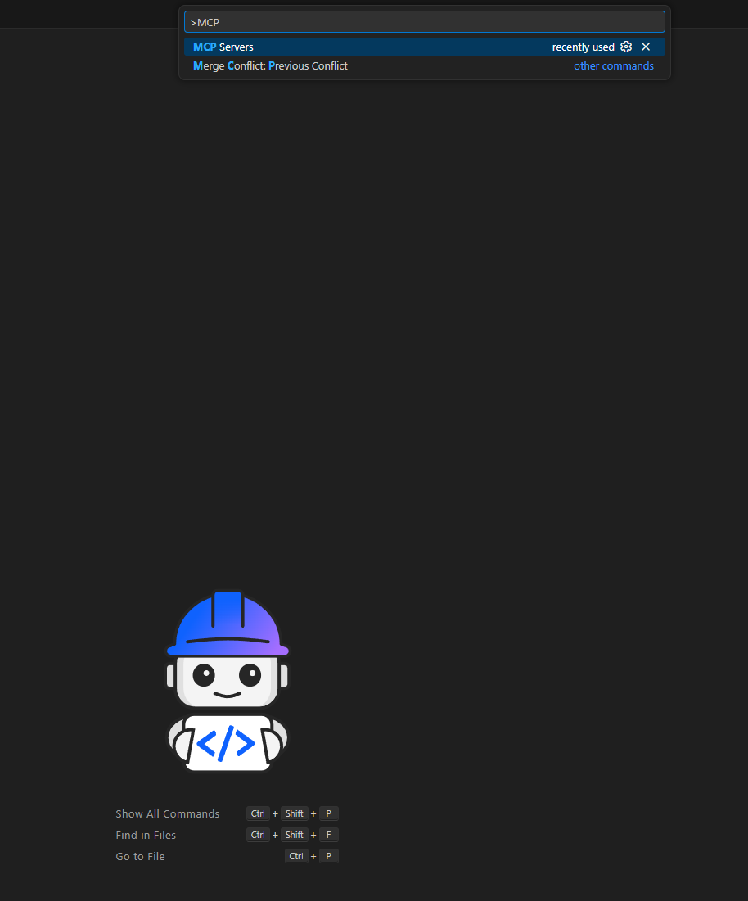

I went for the `Global MCPs` approach:

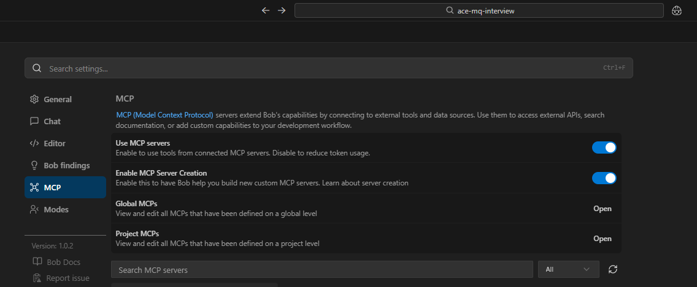

And I entered the following there, which ends up in the `mcp_settings.json` file, previously mentioned

```json
{
  "mcpServers": {
    "ace-admin": {
      "url": "https://localhost:7650/mcp/sse",
      "type": "sse"
    }
  }
}
```

Two things of note here:

1. Have a good look at the `url`, where we use `/mcp` for the curl and Inspector, Bob requires the `/mcp/sse` endpoint. If you
   just specify the MCP endpoint, you will get a bunch of SSE 404 errors. Regardless of how you configured it, Bob expects the 
   SSE handshake. 
2. The `type` also supports the setup of the `sse` type endpoint

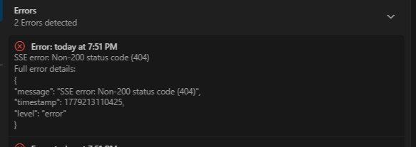


With these settings in place, open the ace-admin server and enable it. You should see the available tools show up here.

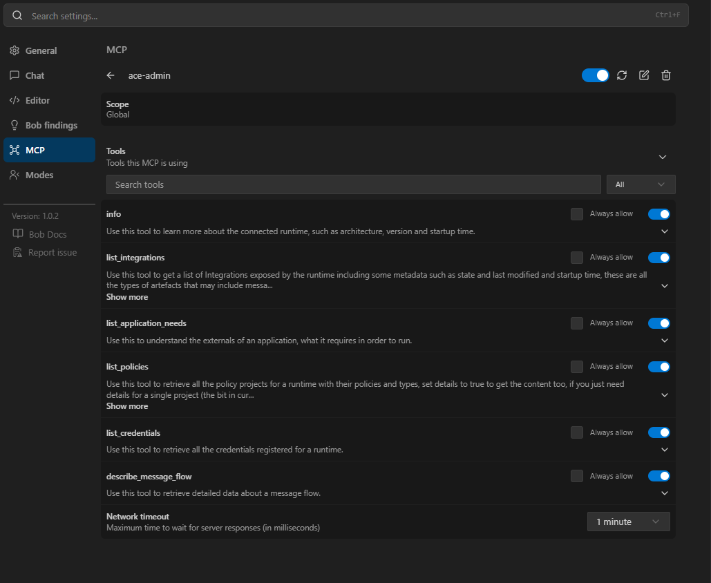

From here you ask Bob things like "what applications are deployed?" or "what credentials does `TestApp` depend on?" and
it picks the right MCP tool, calls it, and turns the JSON into a sentence. I just asked it a simple question:

> "Hey Bob, can you get me some info on what is running in my ace runtime? use the ace-admin mcp"

And this was the reply:

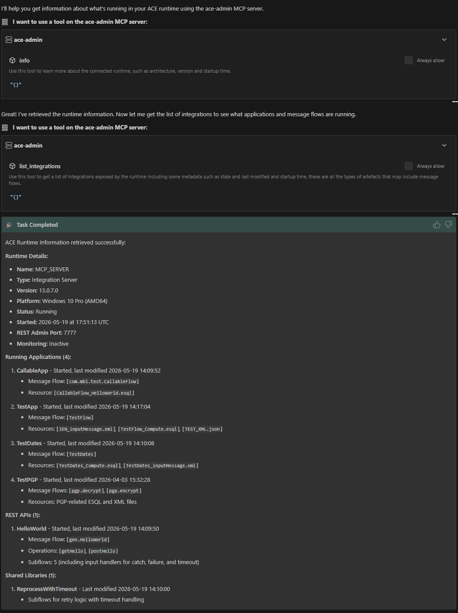

You can also tell Bob to allow these actions by default, if you trust them.

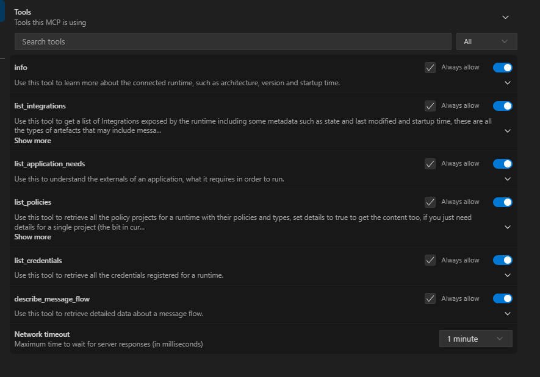

I've played around with it and sometimes the MCP started failing when I changed these settings. I'm not entirely sure if
it was the Bob config or the ACE MCP server that was being difficult, but I ended up changing the `mcp_settings.json` by
hand and restarting the MCP in Bob to get everything running again.

## Problems I encountered

Now, in the end I got this to work, but I did hit a couple of bumps on the way, sharing them so you can either find 
a quick solution to the problem or avoid it altogether.

### Self-signed certificate vs Node.js

The standalone integration server uses its own self-signed cert (the same one it uses for `RestAdminListener`).
Inspector's underlying Node fetch refuses it by default and tells you to "try running Node.js with
`--use-system-ca`", which only helps if the cert is in the OS trust store. You can always import the CA, if you want, but
the quickest workaround is to set `NODE_TLS_REJECT_UNAUTHORIZED=0` in the shell before launching Inspector. Strictly
dev-only, obviously. The same approach works for any Node-based MCP client.

### PowerShell 5.1 doesn't have `-SkipCertificateCheck`

If you want to use PowerShell to call the MCP, you also need a way of ignoring the self-signed 
certificate validation. PowerShell 7 added the `-SkipCertificateCheck` flag to the `Invoke-WebRequest` function, but if
you are still rocking the Windows-bundled PowerShell 5.1, you need to either

1. Upgrade your PowerShell installation.
2. Use `curl.exe` from PowerShell, it has `-k` and side-steps the issue (use `curl.exe` and not just `curl`, without 
   the `.exe` it defaults to `Invoke-WebRequest`).
3. Override the global validation callback once per shell:

```powershell
[System.Net.ServicePointManager]::ServerCertificateValidationCallback = {$true}
[System.Net.ServicePointManager]::SecurityProtocol = [System.Net.SecurityProtocolType]::Tls12
```

I just switched to `curl.exe`, seemed easiest.

### PowerShell quote-passing to native `.exe`s

In PowerShell, `\"` inside single-quoted strings is **literal**, it's not an escape sequence the shell strips. So
the friendly-looking:

```powershell
curl.exe -d '{\"foo\":\"bar\"}' https://example.com
```

sends a body with literal backslashes and breaks JSON parsing on the server. The server returns a generic error
that gives you no clue this is what happened. Three workarounds:

1. `--%` stop-parsing operator: `curl.exe --% -d "{\"foo\":\"bar\"}" https://example.com` switches to `cmd`-style
   quoting from there on.
2. Body in a file and `curl.exe -d '@body.json'`.
3. Body via stdin: `$body | curl.exe --data-binary '@-' …`.

I keep doing this in PowerShell, so I thought I'd write this reminder, at least partly, for myself.

### `500 Internal Server Error` with zero detail

If you POST anything to `/mcp` that ACE doesn't like (wrong shape, wrong session state, anything that throws
inside its Node handler), the response body is the unhelpful:

```json
{"jsonrpc":"2.0","error":{"code":-32000,"message":"Internal Server Error"},"id":null}
```

The real stack trace goes through log4js to ACE's service trace, which is disabled by default on a Standalone Integration 
Server. So you don't get a log file with the actual error either. Either turn on the server trace or try again.


### Only one MCP client at a time

This was an annoying one, and it's worth its own subsection because the behavior was tricky to understand. The integration 
server only accepts one MCP client per server lifetime, the first one wins. Not really helpful when you are testing both
a UI and a CLI at the same time.

The technical explanation:
ACE's `mcpRouter.js` creates **one** `McpServer` instance per router (at startup) and calls `connect()` on it for every
new client session:

```js
const u = new McpServer({...});               // one instance, lives forever
// per initialize request:
const i = new StreamableHTTPServerTransport({...});
await u.connect(i);                           // ← throws on the 2nd+ call
```

The MCP SDK's `Protocol.connect()` refuses to re-attach:

```js
// @modelcontextprotocol/sdk/dist/esm/shared/protocol.js
async connect(transport) {
    if (this._transport) {
        throw new Error('Already connected to a transport. Call close() before connecting to a new transport, or use a separate Protocol instance per connection.');
    }
    this._transport = transport;
    ...
}
```

The exception gets caught by an Express error middleware and becomes the generic 500 above. **First client wins.**
Every subsequent client trying to initialize a fresh session gets 500 until the integration server is restarted.

The practical impact: pick **one** MCP client per ACE process. If you connect via Inspector first and then try
`curl`, expect 500s. If you connect via `curl` first and then try Inspector, expect Inspector to fail. 

### Inspector's "Disconnect" doesn't really disconnect

Adjacent to the previous point. Clicking **Disconnect** in Inspector's UI is misleading. The underlying transport
on ACE's side only fires `onclose` when:

- A `DELETE /mcp` request with the original `Mcp-Session-Id` header is sent, **or**
- The SSE stream closes from the network side

Closing the Inspector browser tab, killing its `npx` process, or hitting the Disconnect button doesn't reliably do
either. Even with no TCP connection on port 7650, ACE's `McpServer._transport` is still set, and new initialize
requests keep 500'ing. The fool-proof way to clear ACE-side state is to restart the integration server.


## Auth: do this before anyone else can reach the port

`MCP.Admin` on `13.0.7.0` has only `enabled` and `port`. No `mcpCredentialName`, no `sslMode` knob. It inherits TLS
from the `RestAdminListener` configuration and is unauthenticated to anyone who can reach the port.

That's fine for a laptop demo. For anything else:

1. Bind `RestAdminListener` to a non-public address (`127.0.0.1` if you're tunnelling, an internal subnet if you're
   not).
2. Put a reverse proxy in front that does Basic Auth, mTLS, or OAuth, and only forward to `7650` after successful
   auth. The MCP Inspector and Claude Desktop both happily speak Basic Auth over the Streamable HTTP transport.
3. If you have IBM's MCP Gateway / ContextForge available, route through that , it adds OAuth, rate limiting, and
   scope enforcement in front of any MCP server.
4. Watch the IBM 13.0.8 release notes for `MCP.Admin.mcpCredentialName` (or similar) , given `MCP.Runtime` already
   has that knob, it would be surprising not to land on `Admin` at some point.


## What this didn't cover

* **MCP.Runtime** , exposing your deployed REST APIs as MCP tools.
* **Containerised deployments.** Setting up MCP inside an `IntegrationRuntime` CR on Kubernetes is a different
  exercise , wiring `server.conf.yaml` overrides through a `serverconf` Configuration, exposing port `7650` /
  `7750` through an ingress, and dealing with the operator's dashboard↔runtime certificate wiring.

## Where this leaves us
We now have an Admin MCP right there in ACE. Sure, it's not CRUD, it's not exposing logging or auditing information. But, 
it's a start, and it got my hopes up for things to come.


---

## References

* [App Connect operand versions and features (where 13.0.7 features are listed)](https://www.ibm.com/docs/en/app-connect/13.0.x?topic=rnlr-app-connect-operand-versions-features)
* [Configuring MCP properties (`server.conf.yaml` reference , Runtime properties)](https://www.ibm.com/docs/en/app-connect/13.0.x?topic=tools-configuring-mcp-properties)
* [Exposing a REST API as an MCP tool](https://www.ibm.com/docs/en/app-connect/13.0.x?topic=tools-exposing-rest-api-as-mcp-tool)
* [Model Context Protocol specification](https://modelcontextprotocol.io/docs/getting-started/intro)
* [MCP Inspector](https://github.com/modelcontextprotocol/inspector)
* [Ben Thompson , ACE 13.0.7.0 release blog](https://community.ibm.com/community/user/blogs/ben-thompson1/2026/03/26/ace-13-0-7-0)

---

Written by [Matthias Blomme](https://www.linkedin.com/in/matthiasblomme/)

\#IBMChampion
\#AppConnectEnterprise(ACE)
\#MCP
\#ModelContextProtocol
\#AI
