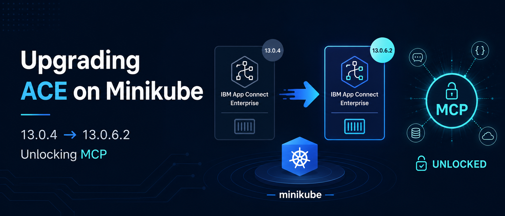
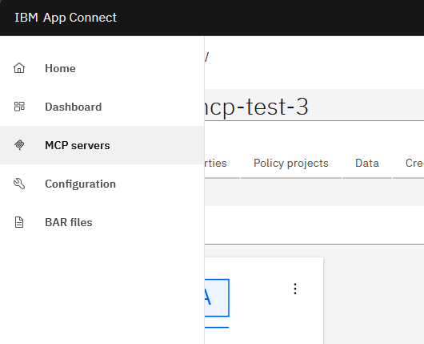
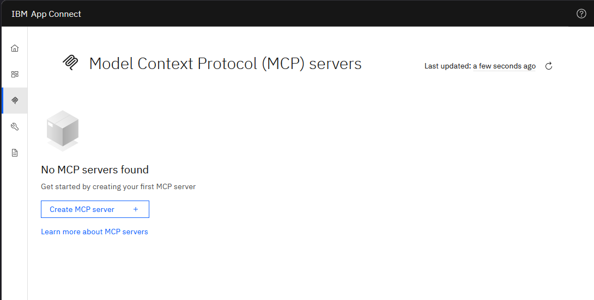

{ .md-banner }

<!--MD_POST_META:START-->

<!--MD_POST_META:END-->


# Upgrading ACE on Minikube: from 13.0.4 to 13.0.6.2 (and unlocking MCP)

In the [previous post](installing_ace_minikube.md), we set up IBM App Connect Enterprise (ACE) on
Minikube end-to-end: Operator, Dashboard, an IntegrationRuntime, ingress, the works. That install pinned the Operator at
`12.14.0` and the Dashboard at `version: '13.0'`, which resolved to operand `13.0.4.x-r1` at the time.

Time moves on. IBM released operand `13.0.6.2-r1` on 2026-02-20, and with the `13.0.6.1-r1` line they shipped
**MCP server support** in the Designer. That's the feature I want to play with, so this post walks through upgrading the
running cluster from `13.0.4.2-r1` to `13.0.6.2-r1`. The interesting bits are the operator-to-operand version matrix and
a license-ID rebadge that the operator silently blocks the upgrade on.

Just like my original blog, I'll add some possible issues (which I may or may not have encountered and got frustrated 
about) here and there, just so you can quickly resolve them should you also encounter them.

## Assumptions

* You already have an ACE setup like the one from the previous blog (Operator via Helm, Dashboard CR, an IntegrationRuntime
  created from the UI quickstart).
* You're on the `ibm-helm/ibm-appconnect-operator` chart, not OLM.
* You're working with `kubectl` and `helm` in PowerShell on Windows.


## Step 0: Where am I, exactly?

Before changing anything, take stock. Things drift, especially when you've been clicking around in the dashboard. Run a
read-only pass and write down the exact versions you see. You'll need them for the rollback path.

```bash
k get nodes
NAME       STATUS   ROLES           AGE    VERSION
minikube   Ready    control-plane   257d   v1.33.1

k get pods
NAME                                  READY   STATUS    RESTARTS         AGE
ace-dashboard-dash-d7b48ffb9-v65mt    2/2     Running   6 (3h29m ago)    213d
ibm-appconnect-5c58d87c49-szv2p       1/1     Running   9 (3h29m ago)    257d
ir-01-quickstart-ir-65bf799dd-gtkls   1/1     Running   24 (3h28m ago)   257d

helm list -A
NAME            NAMESPACE       REVISION  UPDATED                                STATUS    CHART                            APP VERSION
ace-ai-agents   ace-agent-demo  1         2025-11-04 15:32:44.3458376 +0100 CET  deployed  ace-ai-agents-0.1.0              0.1.0
ibm-appconnect  ace-agent-demo  1         2025-10-28 14:26:37.5172124 +0100 CET  deployed  ibm-appconnect-operator-12.16.0  12.16.0
ibm-appconnect  ace-demo        1         2025-09-03 07:00:40.5572517 +0200 CEST deployed  ibm-appconnect-operator-12.15.0  12.15.0
```

For me this returned a Helm release of `ibm-appconnect` on chart `ibm-appconnect-operator-12.15.0` in `ace-demo`, with
three pods running: the operator, the Dashboard, and the runtime.

Check the operand versions on the CRs:

```bash
k get dashboard ace-dashboard -o jsonpath='spec.version={.spec.version} reconciled={.status.versions.reconciled}{"\n"}'
spec.version=13.0 reconciled=13.0.4.2-r1

k get ir ir-01-quickstart -o jsonpath='spec.version={.spec.version} reconciled={.status.versions.reconciled}{"\n"}'
spec.version=13.0 reconciled=13.0.4.2-r1
```

And the actual images on the running pods, because the CR doesn't always reflect what's actually running:

```bash
k get pod -l app.kubernetes.io/managed-by=ibm-appconnect -o jsonpath='{range .items[*]}{.metadata.name}{"\n"}{range .spec.containers[*]}  {.name}: {.image}{"\n"}{end}{end}'
ace-dashboard-dash-d7b48ffb9-v65mt
  control-ui: cp.icr.io/cp/appc/acecc-dashboard-prod:TS019983934-debug-20250901-160233
  content-server: cp.icr.io/cp/appc/acecc-content-server-prod:13.0.4.2-r1
ir-01-quickstart-ir-65bf799dd-gtkls
  runtime: cp.icr.io/cp/appc/ace-server-prod:13.0.4.2-r1
```

Save these somewhere. You'll thank yourself if the upgrade goes sideways. 
_I pity the fool_ that does not save the current state.


## Step 1: Pick a target operator version

ACE has an operator-to-operand compatibility matrix. Operand `13.0.6.2-r1` requires App Connect Operator **`12.21.0` or
higher**. You can verify this in the [operand versions and features](https://www.ibm.com/docs/en/app-connect/13.0.x?topic=rnlr-app-connect-operand-versions-features)
table on IBM Docs.

Why not just go to the latest chart in the repo? Refresh the index and list available Helm chart versions:

```bash
helm repo update ibm-helm
helm search repo ibm-helm/ibm-appconnect-operator --versions
NAME                            	CHART VERSION	APP VERSION	DESCRIPTION
ibm-helm/ibm-appconnect-operator	13.1.0       	13.1.0     	A chart to deploy the IBM App Connect Operator ...
ibm-helm/ibm-appconnect-operator	13.0.0       	13.0.0     	A chart to deploy the IBM App Connect Operator ...
ibm-helm/ibm-appconnect-operator	12.21.0      	12.21.0    	A chart to deploy the IBM App Connect Operator ...
ibm-helm/ibm-appconnect-operator	12.20.1      	12.20.1    	A chart to deploy the IBM App Connect Operator ...
...
```

These Helm charts don't directly tell you the operand version they produce. For that, IBM publishes the 
CASE-to-Application-Version table at [ibm.github.io/cloud-pak/assets/html/ibm-appconnect-table.html](https://ibm.github.io/cloud-pak/assets/html/ibm-appconnect-table.html).
The relevant rows for this upgrade:

| Operator chart | Operand it produces |
|----------------|---------------------|
| `12.21.0`      | `13.0.6.2-r1`       |
| `13.0.0`       | `13.0.7.0-r1`       |
| `13.1.0`       | `13.0.7.1-r1`       |

I'm picking `12.21.0` because it lands on exactly the operand I'm targeting in this post: `13.0.6.2-r1`. Jumping to
`13.0.0` or `13.1.0` would actually give me a newer operand on the same `13.0.x` line (`13.0.7.x`), unlocking even more
MCP knobs in `server.conf.yaml`. But this post is the conservative-upgrade story, one chart-minor at a time, so I'm
stopping at `12.21.0`. 


## Step 2: Back up before you touch anything

If something goes wrong, you want the live CRs somewhere easy to reach. Dump them outside of source control (no need for these to be
versioned), just in case you don't follow this guide to the letter and break everything.

```powershell
$BK = "D:\GIT\ace-minikube\backups\pre-13.0.6.2-r1"
New-Item -ItemType Directory -Force -Path $BK | Out-Null
k get dashboard ace-dashboard -o yaml | Out-File -Encoding utf8 "$BK\dashboard.yaml"
k get ir ir-01-quickstart -o yaml    | Out-File -Encoding utf8 "$BK\ir-01-quickstart.yaml"
k get pvc ace-dashboard-content -o yaml | Out-File -Encoding utf8 "$BK\pvc.yaml"
helm get values ibm-appconnect -n ace-demo | Out-File -Encoding utf8 "$BK\helm-values.yaml"
helm get manifest ibm-appconnect -n ace-demo | Out-File -Encoding utf8 "$BK\helm-manifest.yaml"
```

The `helm get values` snapshot is the most important one. It tells you exactly which user-supplied values you'll need to
preserve across the upgrade.


## Step 3: Helm upgrade the Operator

The cleanest path is a helm upgrade with explicit values via --reset-values. Using --reuse-values is tempting but Helm 
will silently keep image pins from the old chart and your upgrade will quietly become a no-op (see the issue box at the 
end of this step). Here's the clean approach:

Take your existing `ace-operator-values.yaml` and update the `tag` field to `12.21.0`:

```yaml
# ace-operator-values.yaml
namespace: "ace-demo"
operator:
  replicas: 1
  deployment:
    repository: icr.io/cpopen
    image: appconnect-operator
    tag: 12.21.0                       # was 12.14.0
    pullPolicy: Always
    resources:
      requests:
        cpu: "100m"
        memory: 128Mi
      limits:
        cpu: "250m"
        memory: 1Gi
  installMode: OwnNamespace
  imagePullSecrets:
    - ibm-entitlement-key
```

Apply it:

```bash
helm upgrade ibm-appconnect ibm-helm/ibm-appconnect-operator --version 12.21.0 -n ace-demo --reset-values -f ./ace-operator-values.yaml
Release "ibm-appconnect" has been upgraded. Happy Helming!
NAME: ibm-appconnect
LAST DEPLOYED: Mon May 18 20:46:42 2026
NAMESPACE: ace-demo
STATUS: deployed
REVISION: 3
```

The operator deployment will roll. Watch the pod come up:

```bash
k get pods
NAME                              READY   STATUS    RESTARTS   AGE
ace-dashboard-dash-...            2/2     Running   1          213d
ibm-appconnect-5c58d87c49-szv2p   1/1     Running   9          257d    # old
ibm-appconnect-856bb956d8-5gfl6   0/1     ContainerCreating 0   10s    # new
ir-01-quickstart-ir-...           1/1     Running   24         257d
```

Once the new pod is `Ready`, verify it's actually running 12.21.0:

```bash
k logs deploy/ibm-appconnect | grep "Operator Version"
ts=2026-05-18T18:47:31.040184069Z level=info logger=setup msg="Operator Version: 12.21.0"
```

### Operator upgrade issue: `--reuse-values` reuses the old rendered manifest

My first attempt was lazy: `helm upgrade ... --reuse-values --set operator.deployment.tag=12.21.0`. Helm reported `REVISION:
2` and a successful upgrade. But the operator deployment didn't change. The pod kept running.

```bash
k get deploy ibm-appconnect -o jsonpath='{.metadata.annotations.deployment\.kubernetes\.io/revision}'
1
```

Revision `1`. The deployment wasn't touched.

What was happening: chart `12.15.0` (the chart I was upgrading from) pinned the operator image with an *explicit sha*, while
chart `12.21.0` uses a different default sha. With `--reuse-values`, Helm reused the previously-rendered values from chart
`12.15.0`'s defaults (including the old sha), and the new chart kept using the old sha and ignored my new tag. End result:
same image, same pod, no upgrade.

```bash
k get deploy ibm-appconnect -o jsonpath='{.spec.template.spec.containers[0].image}{"\n"}'
icr.io/cpopen/appconnect-operator@sha256:80ef372b7f5e4823084afbc0f80257781906661f1cab7b1877650596e00a2c86   # still the old one
```

Fix: re-run with `--reset-values --values ./ace-operator-values.yaml` so Helm starts from the new chart's defaults and your
file's overrides. No leftover state from the old release. After that, the deployment rolled correctly:

```bash
k get deploy ibm-appconnect -o jsonpath='{.spec.template.spec.containers[0].image}{"\n"}'
icr.io/cpopen/appconnect-operator@sha256:d8636f2f558ced3c085cbe635a8d47e9e587407e2f7bf5aaf453340a500f3600   # new chart 12.21.0
```

If you only ever bump within the same chart minor, `--reuse-values` is fine. If you cross chart majors or even some minors,
prefer `--reset-values` and re-supply your overrides.


## Step 4: Watch the operator notice the new operand

The Dashboard CR has `version: '13.0'`, a floating selector. The operator picks whichever 13.0.x patch it considers
current. With the operator at `12.21.0`, that resolves to `13.0.6.2-r1`. Same goes for the IR.

You don't have to edit the CRs for this. Just watch the operator log right after it starts up:

```bash
k logs deploy/ibm-appconnect --tail=50
...
ts=2026-05-18T18:48:07.197897081Z level=info logger=controller.integrationruntime msg="13.0.6.2-r1 reconcile" Request.Namespace=ace-demo Request.Name=ir-01-quickstart
ts=2026-05-18T18:48:07.197959401Z level=info logger=controller.dashboard msg="13.0.6.2-r1 reconcile" Request.Namespace=ace-demo Request.Name=ace-dashboard
```

That's the operator deciding to roll the Dashboard and IR pods to the new operand. Except… it doesn't. The pods stay on
`13.0.4.2-r1`. What gives?

Look further down:

```bash
ts=2026-05-18T18:48:07.227594535Z level=info logger=controller.integrationruntime msg="Channel 13.0 resolves to the latest compatible version 13.0.6.2-r1 which requires license L-CKFT-S6CHZW. Update your CR to use this license. For more information, see https://ibm.biz/acelicense-v13." Request.Namespace=ace-demo Request.Name=ir-01-quickstart
ts=2026-05-18T18:48:07.325873065Z level=info logger=controller.integrationruntime msg="Successfully created Event: [action]=Warning, [reason]=WrongLicense, [note]=Channel 13.0 resolves to the latest compatible version 13.0.6.2-r1 which requires license L-CKFT-S6CHZW..."
```

The operator is blocking on the license ID. 


## Step 5: The license rebadge that catches everyone

In the original blog, I configured the CRs to use the appropriate license _for that version_:

```yaml
license:
  accept: true
  license: L-KPRV-AUG9NC
  use: AppConnectEnterpriseNonProductionFREE
```

IBM rotates these license IDs when they cut new operand patches. The `L-KPRV-AUG9NC` ID was tied to operand `13.0.4.x` /
`13.0.5.x`. For operand `13.0.6.x` (which is what the operator wants to upgrade you to), the new ID for the same
`AppConnectEnterpriseNonProductionFREE` tier is **`L-CKFT-S6CHZW`**. Same product, same tier, same `accept: true`. Just a
new ID string.

The URL in the operator's warning event (https://ibm.biz/acelicense-v13) is the authoritative source for what each operand
patch expects. Always check it for your specific operand before patching blindly.

Patch both CRs:

```bash
k patch dashboard ace-dashboard --type merge -p '{"spec":{"license":{"license":"L-CKFT-S6CHZW"}}}'
dashboard.appconnect.ibm.com/ace-dashboard patched

k patch ir ir-01-quickstart --type merge -p '{"spec":{"license":{"license":"L-CKFT-S6CHZW"}}}'
integrationruntime.appconnect.ibm.com/ir-01-quickstart patched
```

If you keep your CRs as YAML in git (you should), also update `ace-dashboard.yaml`:

```yaml
spec:
  license:
    accept: true
    license: L-CKFT-S6CHZW                   # was L-KPRV-AUG9NC
    use: AppConnectEnterpriseNonProductionFREE
```

Within a few seconds, the operator picks up the change, the warning event clears, and the rollouts start:

```bash
k get pods
NAME                                   READY   STATUS              RESTARTS    AGE
ace-dashboard-dash-5666c86887-fltqw    0/2     ContainerCreating   0           8s     # new dashboard
ace-dashboard-dash-d7b48ffb9-v65mt     2/2     Running             6           213d   # old, will terminate
ibm-appconnect-856bb956d8-5gfl6        1/1     Running             0           137m
ir-01-quickstart-ir-59759b9674-n9jzz   0/1     ContainerCreating   0           7s     # new IR
ir-01-quickstart-ir-65bf799dd-gtkls    1/1     Running             24          257d   # old, will terminate
```

The dashboard typically rolls in 30–60 seconds. The runtime takes a lot longer the first time because it has to pull the
new `ace-server-prod:13.0.6.2-r1` image, which is about 1+ GB. On a slow connection from Minikube to `cp.icr.io`,
budget 15–20 minutes for that pull alone. There's no progress indicator beyond `ContainerCreating`, which can feel like a
hang. It isn't. `kubectl describe pod` will show the `Pulling image` event.

### Container issue: `mcpruntimecerts` volume mount fails before secret exists

While the new IR pod was waiting on the image pull, I noticed an earlier warning event:

```bash
k describe pod ir-01-quickstart-ir-59759b9674-n9jzz
...
Events:
  Warning  FailedMount  16m  kubelet  MountVolume.SetUp failed for volume "mcpruntimecerts" : secret "ir-01-quickstart-ir-servingssl-cert" not found
```

This is a new volume the `13.0.6.x` operand mounts for **MCP server TLS material**. The secret is created by the operator
shortly after the pod is scheduled, so the mount eventually succeeds. But there's a small window at first reconcile where
the pod gets scheduled before the secret exists. Kubelet retries, and the pod proceeds once the secret lands. No action
needed unless the error persists past the first minute or two.


## Step 6: Verify

Once both pods are running, check that everything actually moved to the new operand.

```bash
k get dashboard,ir
NAME                                         RESOLVEDVERSION   REPLICAS   CUSTOMIMAGES   STATUS   ...   AGE
dashboard.appconnect.ibm.com/ace-dashboard   13.0.6.2-r1       1          true           Ready          257d

NAME                                                     RESOLVEDVERSION   STATUS   REPLICAS   ...
integrationruntime.appconnect.ibm.com/ir-01-quickstart   13.0.6.2-r1       Ready    1
```

The real proof is in the image references on the running pods, not the CR `resolvedVersion`. Check those too:

```bash
k get pod -l app.kubernetes.io/managed-by=ibm-appconnect -o jsonpath='{range .items[*]}{.metadata.name}{"\n"}{range .spec.containers[*]}  {.name}: {.image}{"\n"}{end}{end}'
ace-dashboard-dash-5666c86887-fltqw
  control-ui: cp.icr.io/cp/appc/acecc-dashboard-prod:TS019983934-debug-20250901-160233
  content-server: cp.icr.io/cp/appc/acecc-content-server-prod:13.0.6.2-r1-20260222-011707@sha256:d421f65a...
ir-01-quickstart-ir-59759b9674-n9jzz
  runtime: cp.icr.io/cp/appc/ace-server-prod:13.0.6.2-r1-20260224-175720@sha256:defa024e...
```

A note on the `:r1-20260224-175720` suffix: that's the operand's actual build timestamp, useful if you ever need to
correlate a specific image to a Fix Central download.

### Image issue: stale custom image overrides

If at some point you set a custom image on the Dashboard CR (e.g. `spec.pod.containers.control-ui.image`) to chase a bug,
the operator will respect that override across upgrades. Convenient. But it means that container won't auto-bump to the
new operand. You'll see `CUSTOMIMAGES   true` in `k get dashboard` and the pod will still run the old custom image.

If the original reason for the override is gone, drop the field so the operator picks the bundled image again:

```bash
k patch dashboard ace-dashboard --type=json -p='[{"op":"remove","path":"/spec/pod/containers/control-ui/image"}]'
dashboard.appconnect.ibm.com/ace-dashboard patched
```

The dashboard pod rolls within a minute, and `CUSTOMIMAGES` flips back to `false`. Same trick applies for any per-container
image override on Dashboard or IR: remove the `image:` field, the operator takes over again.

Browse to the dashboard and confirm `ir-01-quickstart` still appears in the IntegrationRuntimes list, and that the hello-world
flow still serves:

```powershell
Invoke-WebRequest "https://ir01.local:12122/world/hello" -UseBasicParsing -SkipCertificateCheck
StatusCode        : 200
Content           : {"message":"Hello, Foo Bar!"}
```

### Ingress issue: 404 when opening the dashboard after the upgrade

This one isn't directly caused by the upgrade, but the upgrade is when you notice it. I set up the same port-forward from
the installation blog:

```bash
k -n ingress-nginx port-forward svc/ingress-nginx-controller 12121:443
```

Opened `https://ace-dash.local:12121/`, clicked through the self-signed cert warning, and got a 404.

Two separate causes, both at once.

**Cause 1: the dashboard ingress wasn't there anymore.** Somewhere between the installation and the upgrade, the
`ace-dashboard-ingress` resource in the `ace-demo` namespace got deleted (probably a cleanup pass that went one step too
far). nginx had no rule for *any* host, so it 404'd everything.

```bash
k -n ace-demo get ingress
No resources found in ace-demo namespace.
```

**Cause 2: another instance had grabbed the hostname.** When I re-applied the original `ace-dashboard-ingress.yaml`
(which uses `host: ace-dash.local`), the nginx admission webhook rejected it:

```bash
k apply -f ace-dashboard-ingress.yaml
Error from server (BadRequest): admission webhook "validate.nginx.ingress.kubernetes.io" denied the request:
host "ace-dash.local" and path "/apiv2" is already defined in ingress ace-agent-demo/ace-dashboard-ingress
```

I'd built another ACE runtime in an `ace-agent-demo` namespace a while back for something unrelated, and _that_ dashboard
ingress had grabbed `ace-dash.local`. Two installs, one hostname, nginx picks the first one, which in my case was the
wrong one.

**Fix:** give the `ace-demo` dashboard a hostname the other instance isn't using. The TLS cert in
`secret/ace-dashboard-tls` already covered `ace-dashboard.local` (the original hostname), and the Windows hosts file 
already had `127.0.0.1 ace-dashboard.local`, so I just pointed the ingress back at that:

```yaml
# ace-dashboard-ingress.yaml
spec:
  tls:
    - hosts:
        - ace-dashboard.local     # was ace-dash.local
      secretName: ace-dashboard-tls
  rules:
    - host: ace-dashboard.local   # was ace-dash.local
      http:
        paths:
          - path: /apiv2
            pathType: Prefix
            backend: { service: { name: ace-dashboard-dash, port: { number: 8300 } } }
          - path: /
            pathType: Prefix
            backend: { service: { name: ace-dashboard-dash, port: { number: 8300 } } }
```

```bash
k apply -f ace-dashboard-ingress.yaml
ingress.networking.k8s.io/ace-dashboard-ingress created
```

Now `https://ace-dashboard.local:12121/` lands on the upgraded `ace-demo` dashboard.

### Verifying MCP support is there

The whole point of the upgrade. From the dashboard, open the left-hand menu and navigate to the `MCP servers` section.





If you see this, you have MCP support. If you don't see it, double-check `resolvedVersion` on the Dashboard CR.


## Step 7: Update the repo to match reality

The upgrade is done in the cluster, but your YAML in source control still says `tag: 12.14.0` and `license: L-KPRV-AUG9NC`.
Sync them so the next person (or future you) doesn't accidentally roll back when they re-apply.

```yaml
# ace-operator-values.yaml
operator:
  deployment:
    tag: 12.21.0          # bumped from 12.14.0
```

Don't forget the license this time!

```yaml
# ace-dashboard.yaml
spec:
  license:
    license: L-CKFT-S6CHZW   # bumped from L-KPRV-AUG9NC
```

If your IntegrationRuntime was created from the dashboard's quickstart wizard (mine was), it lives only in the cluster and
not in git. Now's a good moment to capture it:

```bash
k get ir ir-01-quickstart -o yaml > ./ir-01-quickstart.yaml
```

Trim the export before committing. Remove:

- `metadata.resourceVersion`
- `metadata.uid`
- `metadata.generation`
- `metadata.creationTimestamp`
- `metadata.managedFields`
- `metadata.ownerReferences`
- the entire `status:` block

Keep:

- `metadata.name`
- `metadata.namespace`
- `spec:`

From this point on, the runtime is no longer UI-only. You can apply it declaratively.


## Rollback

If something breaks on the operand side and the operator is fine, re-apply the backed-up CRs:

```bash
k apply -f ./backups/pre-13.0.6.2-r1/dashboard.yaml
k apply -f ./backups/pre-13.0.6.2-r1/ir-01-quickstart.yaml
```

The operator at `12.21.0` should still understand the `13.0.4.x` operand, but the older license ID may complain. You may
need to keep `L-CKFT-S6CHZW` even on the rolled-back operand, depending on what the operator wants.

If the operator itself misbehaves, helm rollback works:

```bash
helm history ibm-appconnect -n ace-demo
helm rollback ibm-appconnect 1 -n ace-demo
```

This brings back the previous chart version. Note that operator rollback across chart majors is brittle. CRDs may have
moved forward in ways the old controller can't read. For development clusters, recreating the namespace from scratch is
often less painful than fighting a half-rolled-back operator.


## Long story short

The upgrade itself took five minutes. Everything around it took the afternoon.


---

## References

* [App Connect operand versions and features](https://www.ibm.com/docs/en/app-connect/13.0.x?topic=rnlr-app-connect-operand-versions-features)
* [Creating and managing MCP servers in Designer](https://www.ibm.com/docs/en/app-connect/13.0.x?topic=ddtiiacd-creating-managing-mcp-servers)
* [ACE Operator on ArtifactHub](https://artifacthub.io/packages/helm/ibm-helm/ibm-appconnect-operator)
* [ACE license identifiers (v13)](https://ibm.biz/acelicense-v13)
* [Previous post: installing ACE on Minikube](installing_ace_minikube.md)
* [All the files used in this blog](https://github.com/matthiasblomme/ace-minikube)

---

Written by [Matthias Blomme](https://www.linkedin.com/in/matthiasblomme/)

\#IBMChampion
\#AppConnectEnterprise(ACE)
\#k8s
\#AceOperator
\#AceDashboard
\#AceRuntime
\#ACECC
\#MCP
