# ACE, AI, and Why You Should’ve Been in Hursley

IBM TechXchange Early eXperience 2025

Because at the core, it’s all about the community.

Last week in Hursley? No downtime. No fluff. Just pure, focused chaos, in the best possible way.

For those not in the loop, I’m referring to the IBM App Connect Early Experience event. THE place to be if you like, use, 
or know about IBM App Connect. The event brought the usual suspects together again: integration nerds, product heavyweights, 
and a suspicious number of caffeine-dependent engineers. If you weren’t there, this post won’t give you FOMO, it’ll give you 
instructions for next year. Pack your bag early.

## ACE in the Spotlight

We got our hands dirty with ACE 13.0.3.0, live in labs, dissected in sessions, challenged in conversations. This wasn’t 
just a “what’s new” tour. It was “here’s the state of the product, now tell us what’s wrong with it.”

Then came 13.0.4.0, hot from the oven. Too new for deep labs, but packed with things that made people perk up. A few teaser 
demos, some quick showcases, and yes, you’ll want to start using it. Soon. Actually, stop reading and download it. Now.

https://www.ibm.com/resources/mrs/assets/packageList?source=swg-wmbfd&lang=en_US

The people below want you to!

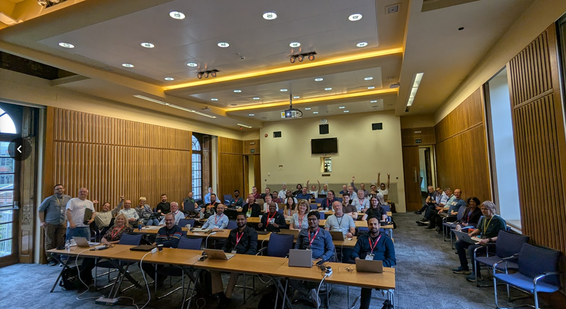

## AI that Actually Helps

Let’s be real, AI has been circling enterprise integration like a marketing drone for a while now. This week, it finally landed.

We saw it working:

- WatsonX Code Assistant in the Toolkit, making you faster, not dumber.  
- Mapping Assist and Data Assist in Designer, context-aware helpers that actually do something.  
- Interacting with AI, as part of your integration solution.  

Not just gimmicks. Actual tooling upgrades you’ll want in your daily grind.

## Coffee, Code, and Chaos

The agenda? Ruthless 😅  
Sessions hit hard. Labs hit harder. And you had just enough time to almost finish before being shoved into the next one. 
At times, it felt like trying to take tidy notes while drinking from a firehose. Classic early eXperience energy.

What kept us going? A not-so-secret supply chain of:

- Legit lunches (yes, actual food groups).  
- Strategic cookie placements.  
- Coffee and tea that just kept flowing, like the integrations we were building.  

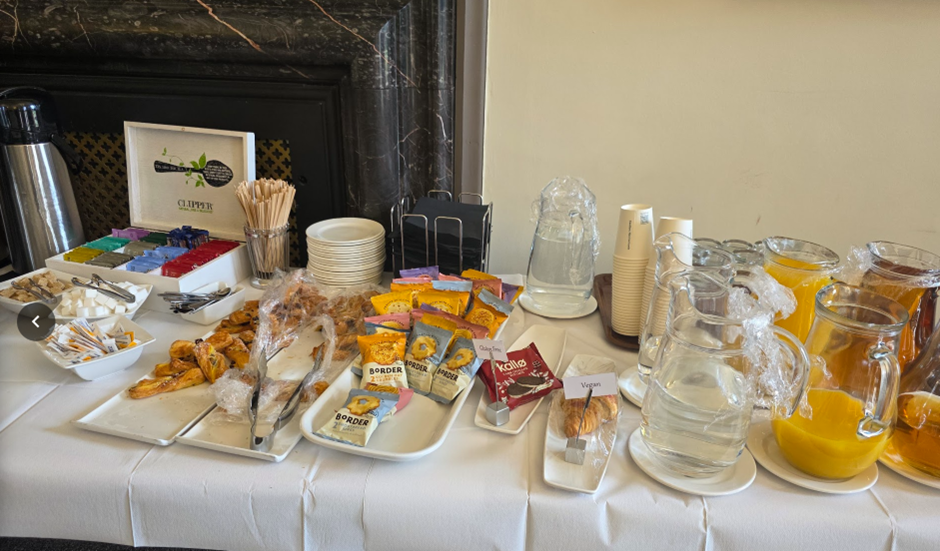

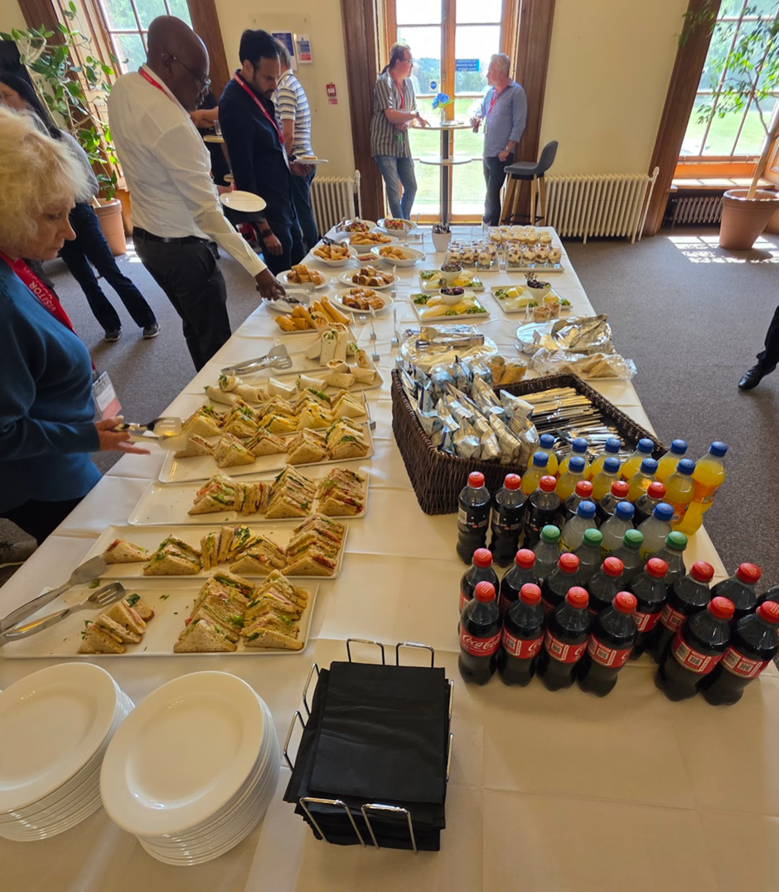

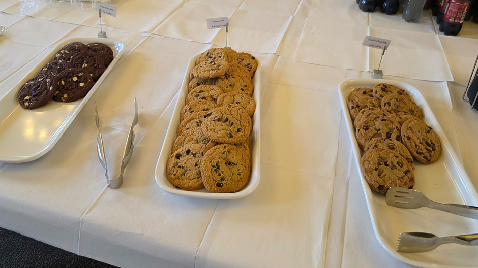

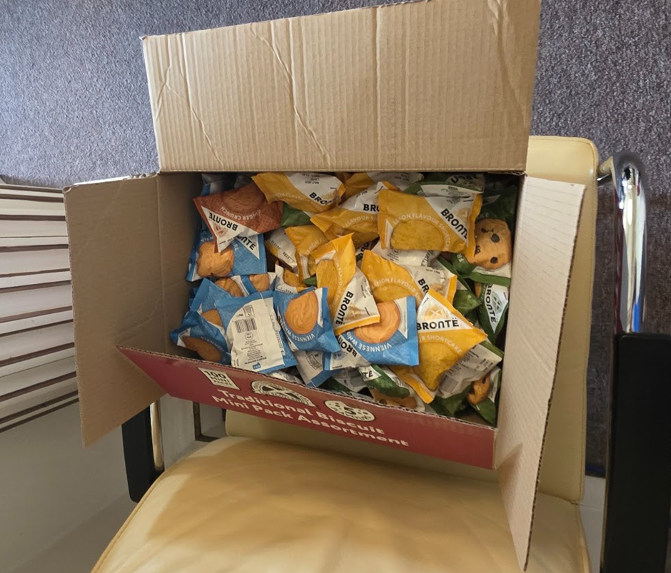

## What Landed

A few long-standing features got the sharpening they deserved:

- Telemetry: cleaner, smarter, more actionable.  
- Kafka, CP4I, callable flows: refined, not flashy, just solid improvements.  
- Context Trees in the Toolkit: finally, UI cleanup that makes sense.  
- New nodes: MQTT, EventBridge, Azure Service Bus, OAuth2 outbound, more tools, fewer excuses.  

But the real value wasn’t just in the release notes, it was in how people reacted. The “wait, you can do that now?” 
moments were real. I know, I had them myself!

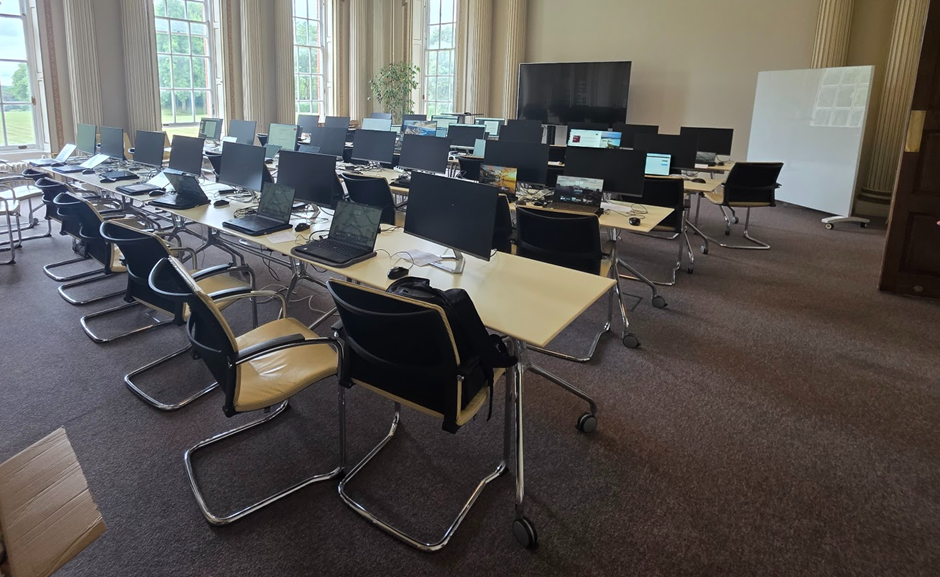

## Everything Between the Slides

This is where the magic happens, what elevates this event above others:

- Breakout huddles over any topic you wanted and/or needed.  
- Ad-hoc architecture debates over a hot coffee.  
- Deep dives that started with “quick question” and ended 45 minutes later.  
- Product managers getting grilled, in the best way possible.  

You don’t get that online. You get it in the room. When a lot of smart people start pulling at the same thread.

The crowd this year was a mix, with new energy coming in, which is great. But also noticeably missing were a few of the 
long-time early eXperience regulars. The ones who’ve been here for over a decade, challenging everything and keeping it sharp. Hopefully, it’s not a sign the old guard’s thinning out. There’s still plenty of fight (and insight) left in them.

And it wasn’t just IBM delivering. There was space for attendees to contribute. One even put up a photo exhibition, 
aviation shots captured throughout the year. It added an unexpected but welcome pause, a reminder that while we’re deep in code and flows, we’re also part of something bigger. Thank you [Herbert](https://www.linkedin.com/in/herbert-thuemer-8328623/)!

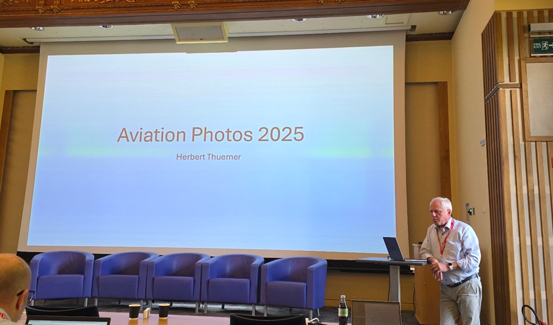

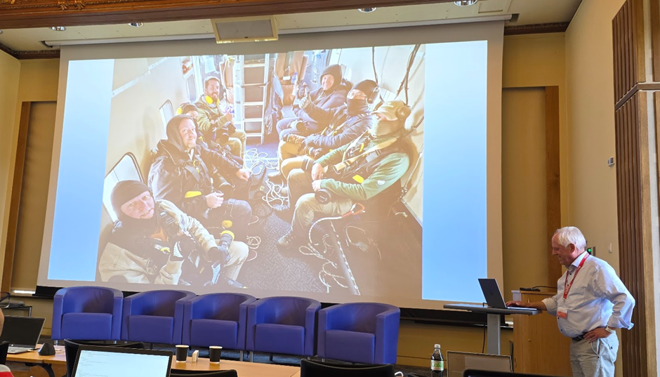

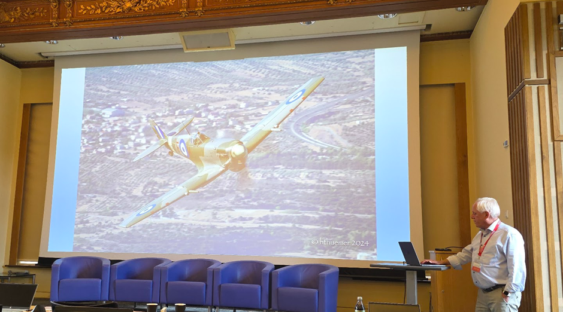

And if all that brainpower needed a reset, Hursley delivered.  
A behind-the-scenes tour of the on-site data center reminded us what kind of muscle powers this ecosystem, rows of humming, 
blinking reality.  

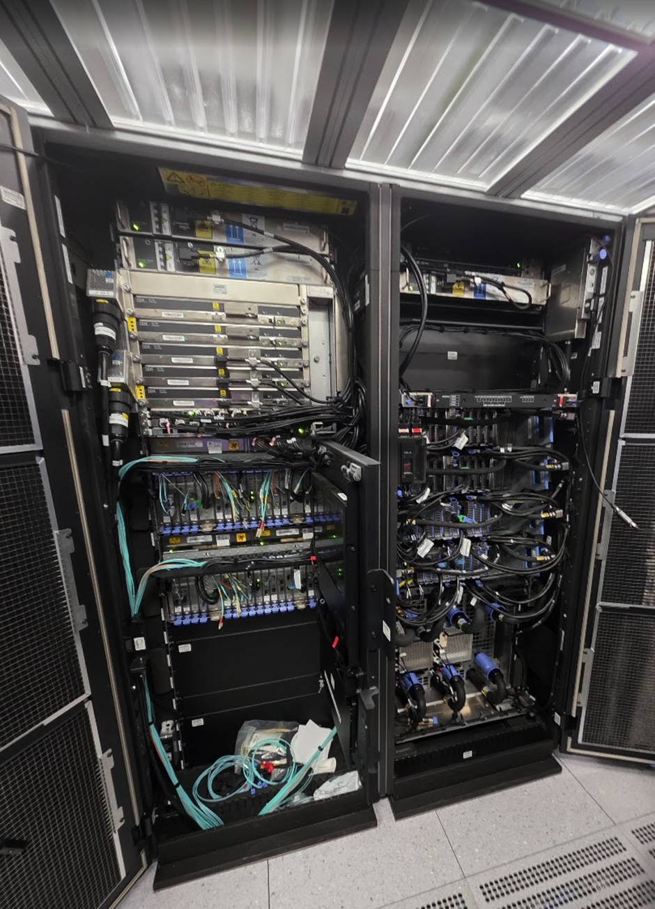

The museum tour was a different kind of throwback: punch cards, hardware beasts, and a very real sense of history. 
It was a full-circle moment, seeing where integration started, while discussing where it’s headed.

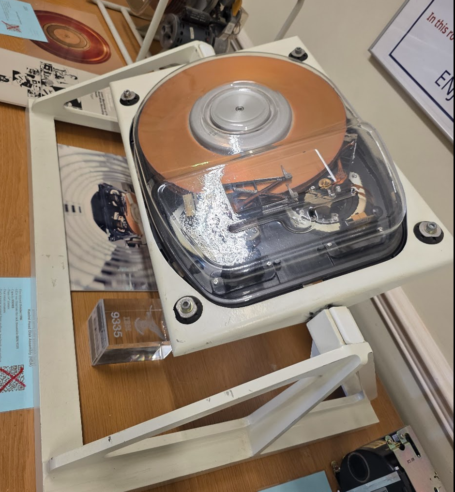

And then, just to keep things balanced, Thursday night’s group pub visit. Good food, relaxed chat, and just the right 
amount of off-the-clock roadmap talk. Exactly what you'd expect from a room full of integration folks who know how to 
switch gears without switching off. 😉

## Why You Should Be There Next Year

If you're in integration, this is where the roadmap gets real. You get to:

- Test what’s coming.  
- Influence what ships.  
- Call out what’s missing.  

And you’ll leave with more than slides, you’ll leave with ideas, insights, and a long list of things to try the minute 
you get back.

And let’s not forget the IBM Badge you got his year, if you did your labs anyway.

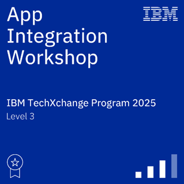

## Final Word

IBM? Crushed it. Again.  
ACE? Continuing to evolve, and yes, it’s getting smarter.  
You? If you’re still reading and weren’t there this year, time to start planning for next year.  

>Hursley 2026. Be in the room.

But don’t take my spot!

---

Written by [Matthias Blomme](https://www.linkedin.com/in/matthiasblomme/)

\#IBMChampion
\#AppConnectEnterprise(ACE)