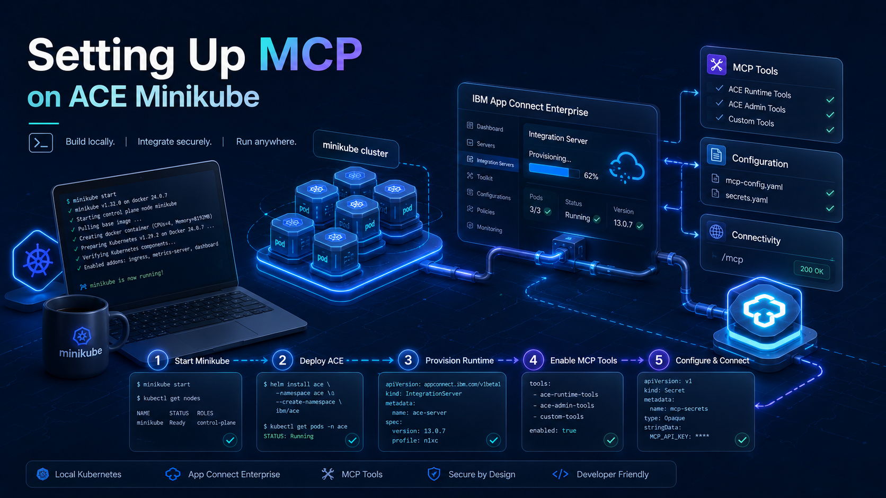{ .md-banner }

<!--MD_POST_META:START-->

<!--MD_POST_META:END-->


# Setting up MCP on ACE Minikube

In the [previous post](https://matthiasblomme.github.io/blogs/posts/Ace-Operator-Minikube/upgrading_ace_minikube/) the Minikube ACE installation moved to operator `12.21.0` and operand `13.0.6.2-r1` so the Dashboard's MCP server feature would be there. This post walks through the wizard, the artifacts it creates in the cluster, and the bits you have to wire up by hand when you're not on OpenShift or IBM Cloud Kubernetes Service.

A few things before we start:

* On `13.0.6.x` the Dashboard's MCP support is connector-based only. You pick a SaaS connector (Salesforce, Slack, Insightly, and so on) and expose its actions as MCP tools. Exposing an existing message-flow REST API as MCP tools (the `MCP.Runtime` feature) ships in ACE `13.0.7.0`, and isn't reachable from the Dashboard UI yet.
* IBM's hosting line is OpenShift or IKS at IR `13.0.6.2-r1+`. On plain Kubernetes (Minikube here) the operator creates the runtime, the BAR, and the configurations, but does not set up external routing. You add the ingress yourself.
* Everything in this post assumes the Dashboard is reachable and the upgrade from the previous post is complete.


## Assumptions

* You finished the upgrade in [Upgrading ACE on Minikube](https://matthiasblomme.github.io/blogs/posts/Ace-Operator-Minikube/upgrading_ace_minikube/) and your Dashboard plus IntegrationRuntime CRs report `RESOLVEDVERSION   13.0.6.2-r1`, `STATUS   Ready`.
* You can open the Dashboard UI (I used `https://ace-dashboard.local:12121/` after re-applying the ingress on a unique hostname, see the troubleshooting box in the upgrade post if you 404 here).
* You have credentials for at least one SaaS connector to wrap with MCP. Whatever you pick, you'll be prompted for an Account in the wizard.


## Quick start

In case you don't remember, that can happen to the best of us. Here are the quick start commands to start from.

> "Even I make mistakes from time to time." - Maurice Moss, The IT Crowd

```powershell
minikube start
```

Aliases, so you don't type `kubectl` and `minikube` in full every time:

```powershell
Set-Alias -Name k -Value kubectl
Set-Alias -Name m -Value minikube
```

Default to the `ace-demo` namespace:

```powershell
k config set-context --current --namespace=ace-demo
```

Port forwards. One terminal each, both run in the foreground.

Dashboard, browse to `https://ace-dashboard.local:12121/` once it's up:

```powershell
k -n ingress-nginx port-forward svc/ingress-nginx-controller 12121:443
```

IR-01 HelloWorld, browse to `https://ir01.local:12122/world/hello`:

```powershell
k -n ingress-nginx port-forward svc/ingress-nginx-controller 12122:443
```


## Step 0: Confirm the upgraded state in the Dashboard

Open the Dashboard at `https://ace-dashboard.local:12121/`. The home page should show the upgraded cluster with the existing `Integrations` and `Runtimes` tiles populated:

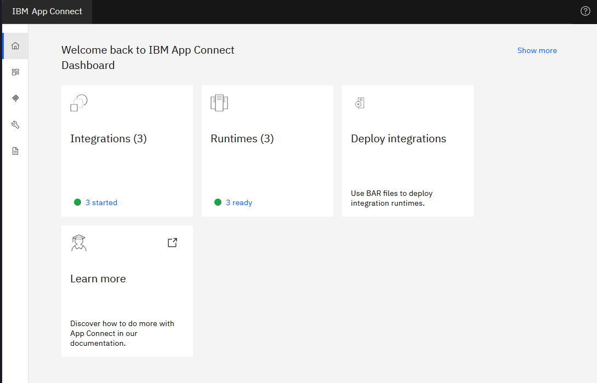

Click into Runtimes. The existing `ir-01-quickstart` runtime should be there, reporting `Version: 13.0.6.2-r1` and `Ready`. Created during the installation blog's quickstart, now running on the upgraded operand.

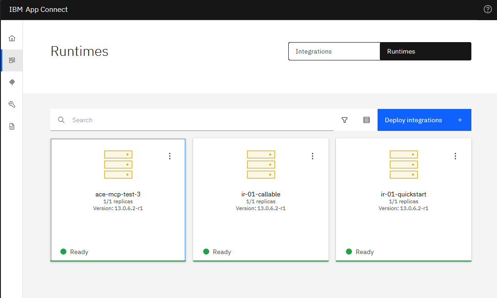

Drilling in confirms the `HelloWorld` REST API is still deployed and `Started`:

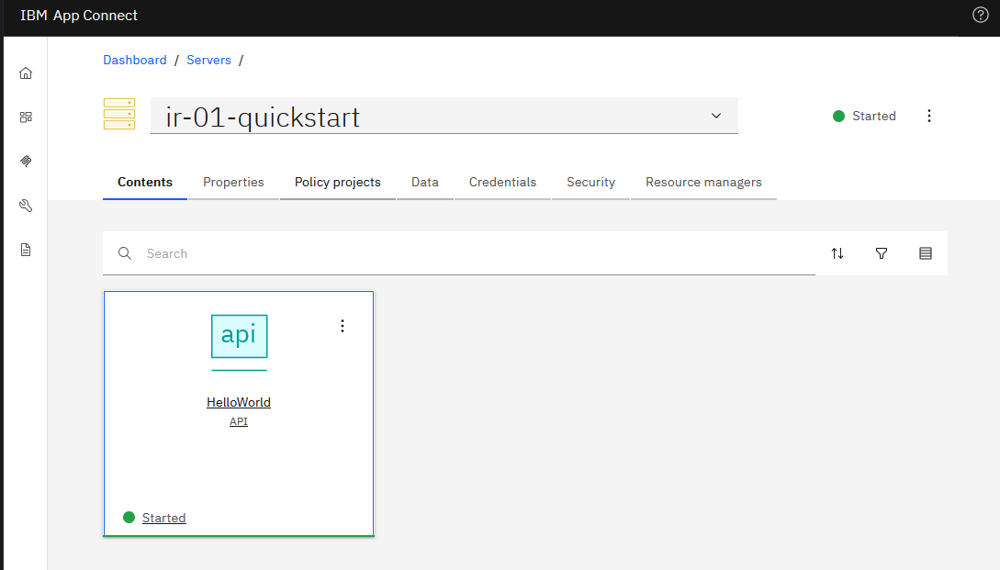

Two things to notice for what's coming next:

1. The existing `HelloWorld` API is a regular App Connect Toolkit-style REST API. It cannot be exposed as MCP tools from this Dashboard UI on `13.0.6.x`. That's reserved for the new connector-based MCP servers.
2. Side note. Being able to point at a deployed REST API and tick "expose as MCP tools" is exactly what the `MCP.Runtime` block in `server.conf.yaml` does on ACE `13.0.7.0`. The Dashboard wizard on `13.0.6.x` doesn't surface that path yet. So for now you can either wait for the operand to bump to `13.0.7.x`, or create a new connector-based MCP server alongside. This post does the second.


## Step 1: Open the MCP servers section

In the left-hand nav of the Dashboard, the MCP icon (paperclip-like) opens Model Context Protocol (MCP) servers. On a fresh `13.0.6.2-r1` install it's empty:

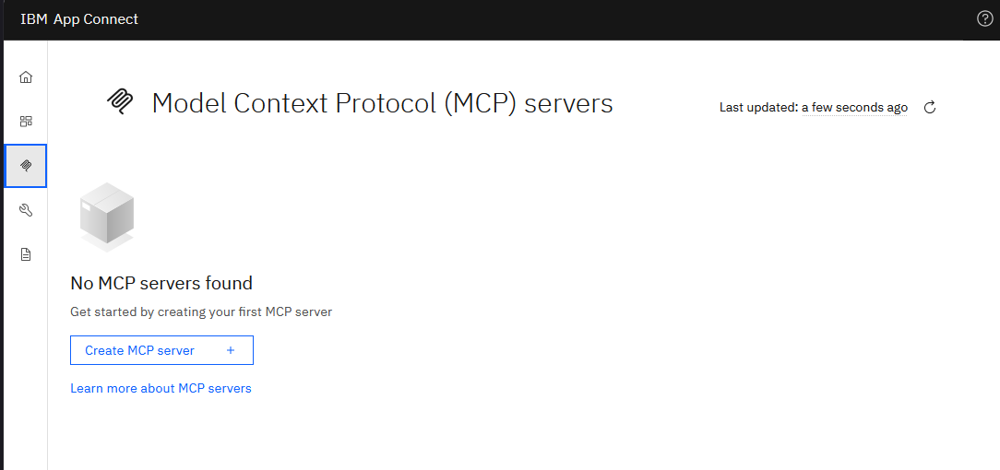

Click Create MCP server.


## Step 2: Integration runtime preferences

The first step of the wizard asks what kind of MCP server you want to create:

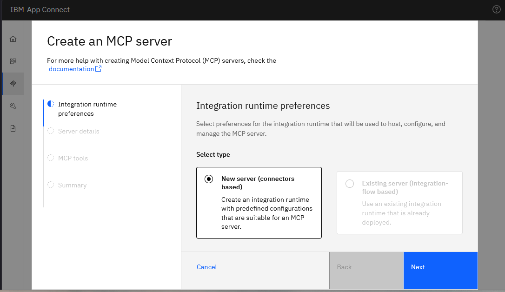

Two options, but only one is selectable on this operand version:

| Option                                       | Status on 13.0.6.x  | What it does                                                                                                                                  |
|----------------------------------------------|---------------------|-----------------------------------------------------------------------------------------------------------------------------------------------|
| New server (connectors based)                | available           | Creates a brand-new integration runtime preconfigured for MCP, with predefined connector configurations                                       |
| Existing server (integration-flow based)     | greyed out          | Would let you mount MCP onto an existing runtime, but disabled on `13.0.6.x`. Almost certainly the UI hook for `MCP.Runtime` from `13.0.7.0`  |

So connectors-based it is. Pick that option and click Next.


## Step 3: Server details

The next step asks for the MCP server name and the integration runtime that will host it. Because I chose "New server" in step 2, the IR will be created automatically with the same name.

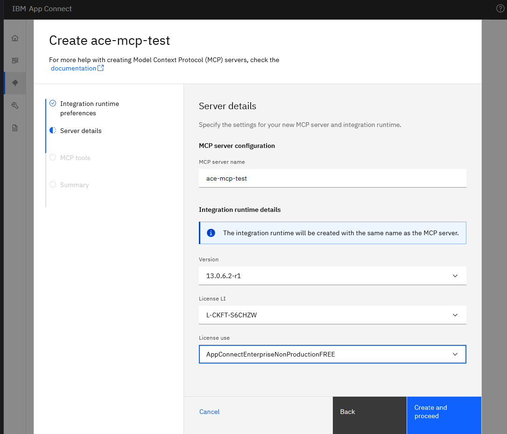

| Field           | Value used                                                  |
|-----------------|-------------------------------------------------------------|
| MCP server name | `ace-mcp-test`                                              |
| Version         | `13.0.6.2-r1`                                               |
| License LI      | `L-CKFT-S6CHZW` (the new 13.0.6.x ID, see the upgrade post) |
| License use     | `AppConnectEnterpriseNonProductionFREE`                     |

Click Create and proceed. And then I hit a wall.

> "Cool. Cool cool cool cool cool. No doubt no doubt no doubt." - Jake Peralta, Brooklyn Nine-Nine

### Wizard issue: missing Prometheus Operator (ServiceMonitor API)

The webhook bounced the IR with:

> Integration runtime server creation failed
> admission webhook "validate.appconnect.ibm.com" denied the request: - Unable to get the Service Monitor API.
> To enable metrics please install Prometheus. If Prometheus is not available please disable metrics by setting
> "spec.metrics.disabled=true"

The wizard creates the IR with metrics on by default, and the ACE validating webhook checks at admission time that the Prometheus Operator's `ServiceMonitor` CRD is available in the cluster. On OpenShift and IKS that CRD ships out of the box. On Minikube it doesn't, and the wizard has no toggle to disable metrics, so you can't work around it from the UI.

The fix is one-shot. Install the Prometheus Operator (the CRDs alone would technically satisfy the discovery check, but installing the operator bundle is the cleaner, well-trodden path):

```bash
k apply -f https://raw.githubusercontent.com/prometheus-operator/prometheus-operator/main/bundle.yaml --server-side
```

After about 30s the operator pod is Running and the API shows up:

```bash
k api-resources --api-group=monitoring.coreos.com
NAME                  SHORTNAMES   APIVERSION                       NAMESPACED   KIND
alertmanagerconfigs   amcfg        monitoring.coreos.com/v1alpha1   true         AlertmanagerConfig
alertmanagers         am           monitoring.coreos.com/v1         true         Alertmanager
podmonitors           pmon         monitoring.coreos.com/v1         true         PodMonitor
probes                prb          monitoring.coreos.com/v1         true         Probe
prometheusagents      promagent    monitoring.coreos.com/v1alpha1   true         PrometheusAgent
prometheuses          prom         monitoring.coreos.com/v1         true         Prometheus
prometheusrules       promrule     monitoring.coreos.com/v1         true         PrometheusRule
scrapeconfigs         scfg         monitoring.coreos.com/v1alpha1   true         ScrapeConfig
servicemonitors       smon         monitoring.coreos.com/v1         true         ServiceMonitor
thanosrulers          ruler        monitoring.coreos.com/v1         true         ThanosRuler
```

Back to the wizard, click Back and then Create and proceed again.

### Wizard issue: leftover Accounts configuration after a failed attempt

Second wall. The next attempt failed with a different error:

> Integration runtime server creation failed
> configurations.appconnect.ibm.com "ace-mcp-test-acc" already exists

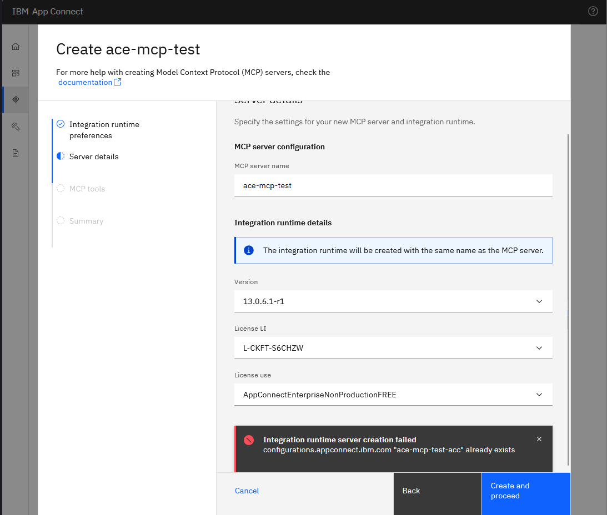

Partial-state cleanup. The previous failed attempt created the `Accounts` configuration named `ace-mcp-test-acc` before the webhook rejected the IR. So when you retry, the wizard's idempotency check trips over the leftover.

Go to Configuration in the Dashboard nav, find `ace-mcp-test-acc`, and delete it. Don't delete `ir-01-quickstart-ir-adminssl` or `ir-01-quickstart-mcp-ba-creds`. Those belong to the existing runtime.

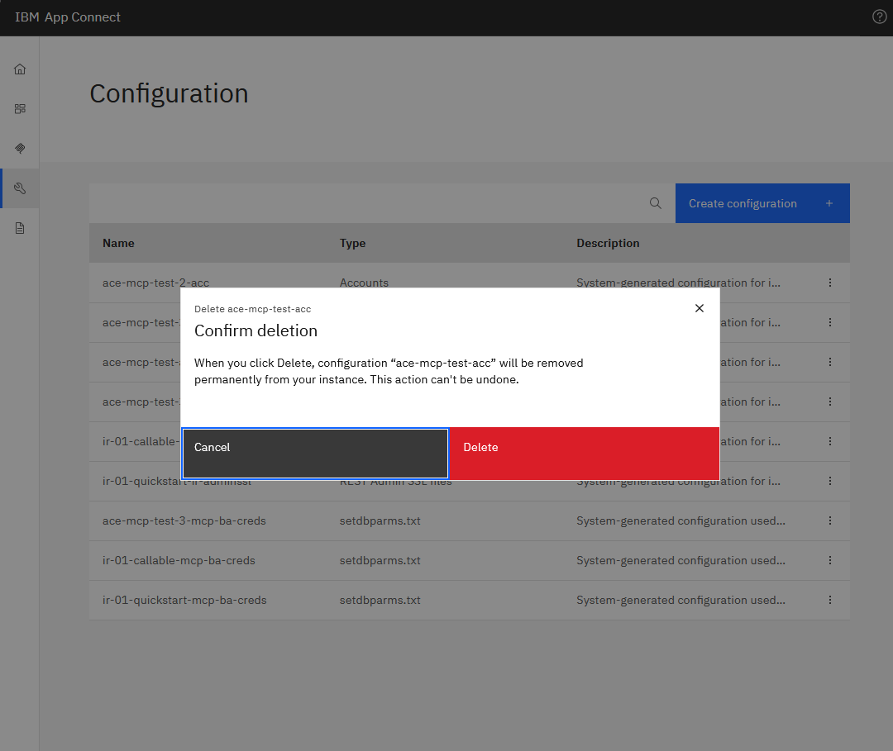

Once it's gone, Back plus Create and proceed in the wizard once more.

### Provisioning

This time it works. The wizard shows a "Creating integration runtime ace-mcp-test (with some associated resources)" spinner while the operator stitches everything together.

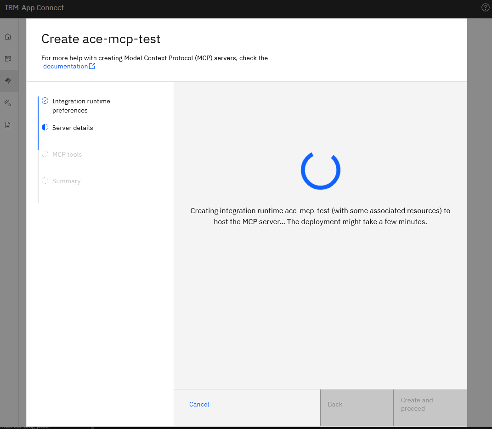

Behind the scenes you can watch the new resources appear:

```bash
k get ir
NAME               RESOLVEDVERSION   STATUS   REPLICAS   AVAILABLEREPLICAS   ...   AGE
ace-mcp-test       13.0.6.2-r1       Ready    1          1                         3m
ir-01-quickstart   13.0.6.2-r1       Ready    1          1                         258d

k get configurations.appconnect.ibm.com
NAME                            AGE
ace-mcp-test-acc                3m20s
ace-mcp-test-ir-adminssl        3m14s
ace-mcp-test-mcp-ba-creds       3m18s
ir-01-quickstart-ir-adminssl    258d
ir-01-quickstart-mcp-ba-creds   12h

k get pods
NAME                                  READY   STATUS    RESTARTS   AGE
ace-mcp-test-ir-f76bb476-t62d5        1/1     Running   0          3m13s
```

The field-guide pattern materialized exactly. One IR plus three Configurations (`Accounts`, `REST Admin SSL files`, `setdbparms.txt`). The BAR file mentioned in the field guide doesn't appear as a separate Kubernetes resource. It's baked into the IR and deployed at startup.


## Step 4: MCP tools, pick a connector

This is where you pick which connector actions become MCP tools. The wizard shows the same connector catalogue as the Designer, Amazon CloudWatch, S3, Salesforce, Slack, ServiceNow, dozens of others, each marked Not connected until you authenticate them.

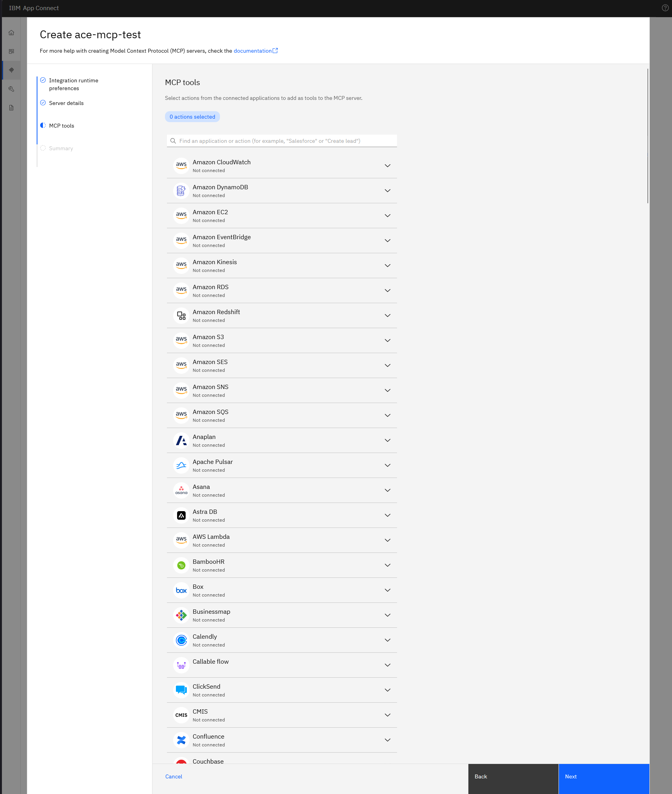

For a smoke test you need a connector you can authenticate quickly. I picked Slack because it's free to spin up a new workspace and app from scratch. Spoiler: it didn't work. This is where this post hits the wall, and where the field guide's "hosting: OpenShift or IKS" line stops being a polite footnote. If you like reading about my failures, keep going. If you'd rather not see your hero exposed, now's the time to leave.

Search Slack in the catalogue and expand it. The wizard splits the panel into the actions it can publish as MCP tools and the form that wants an access token before any of it goes live:

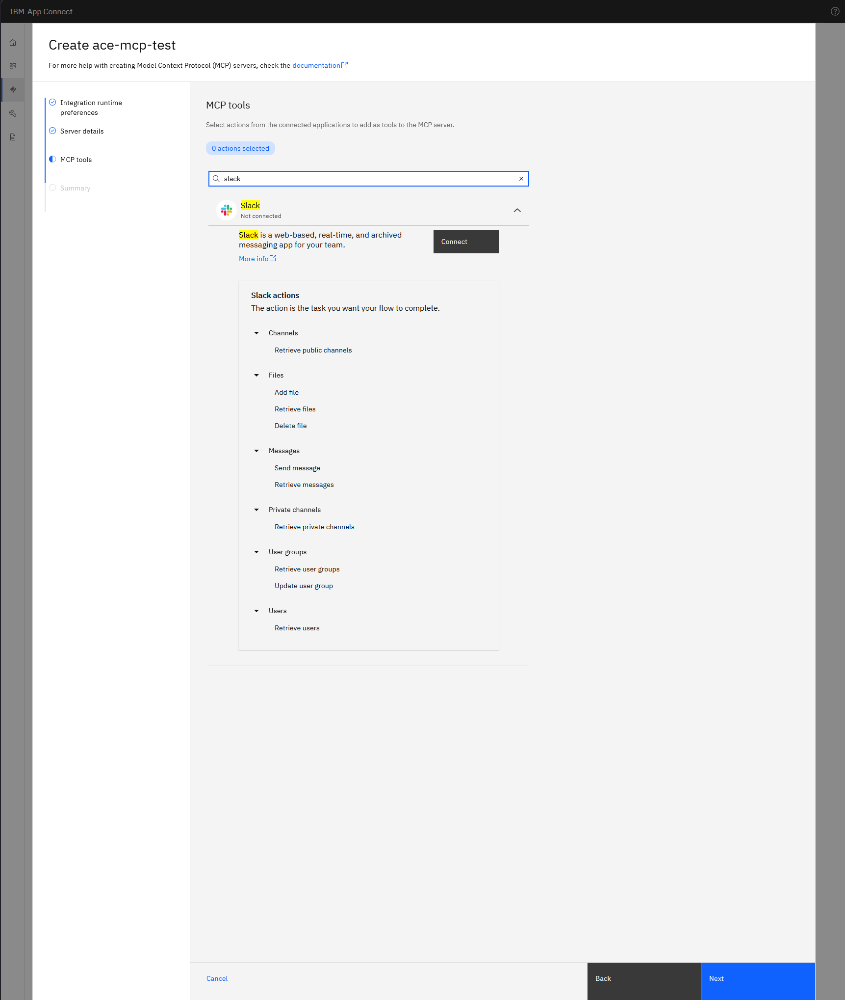

The actions list is what becomes your MCP tool set: Channels (retrieve public channels), Files (add, retrieve, delete), Messages (send, retrieve), Private channels, User groups (retrieve, update), Users (retrieve). Picking subsets here scopes which Slack capabilities your MCP server exposes.

The Connect button stays greyed until you paste a valid Slack access token in the field above. So before you go any further in the wizard, you have to leave it, go to Slack, create an app, grant the right scopes, and get a token back. That's the next step.

## Step 5: Slack app setup

You need a Slack app with three Bot Token Scopes and an access token to paste back into the wizard. Create a new app at https://api.slack.com/apps, new workspace if you don't have a spare one, then under OAuth & Permissions:

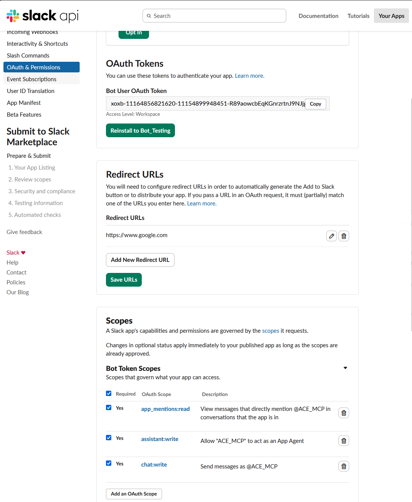

The three scopes the App Connect Slack connector needs at minimum:

- `app_mentions:read`
- `assistant:write`
- `chat:write`

Two ways to land on a token the wizard will accept. The field just wants a "basic access token", and Slack hands you one through either route. I took the short one.

Still in OAuth & Permissions, scroll up and click Install to Workspace. Approve the prompt. Slack drops you back on the page with a Bot User OAuth Token (`xoxb-...`) at the top. Copy it. That's the token you paste into the wizard.

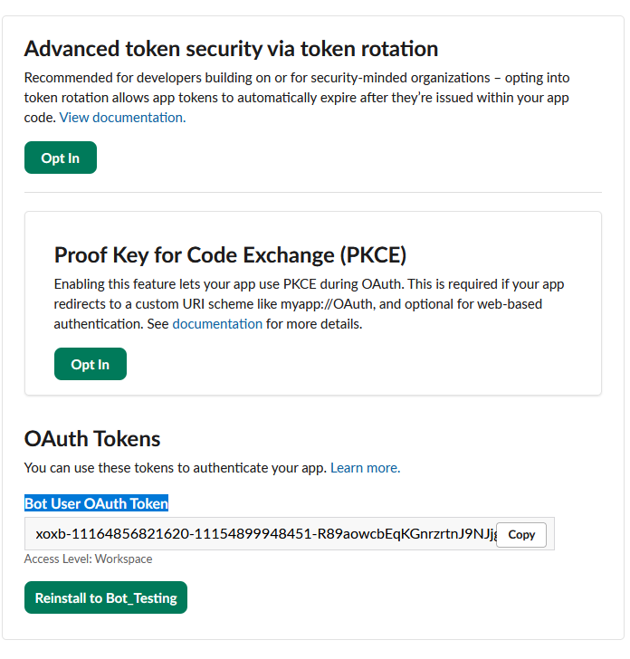

The other route is the IBM doc's manual OAuth-code dance with `curl` at `ibm.biz/acslack`. I ended up running that one later as a wizard workaround, so the full procedure, the gotchas, and why it still didn't save the day live further down in [Trying to work around it with the IBM "containerised environment" procedure](#trying-to-work-around-it-with-the-ibm-containerised-environment-procedure). The App Credentials it needs are on this same Slack screen, two clicks away under Basic Information, App Credentials:

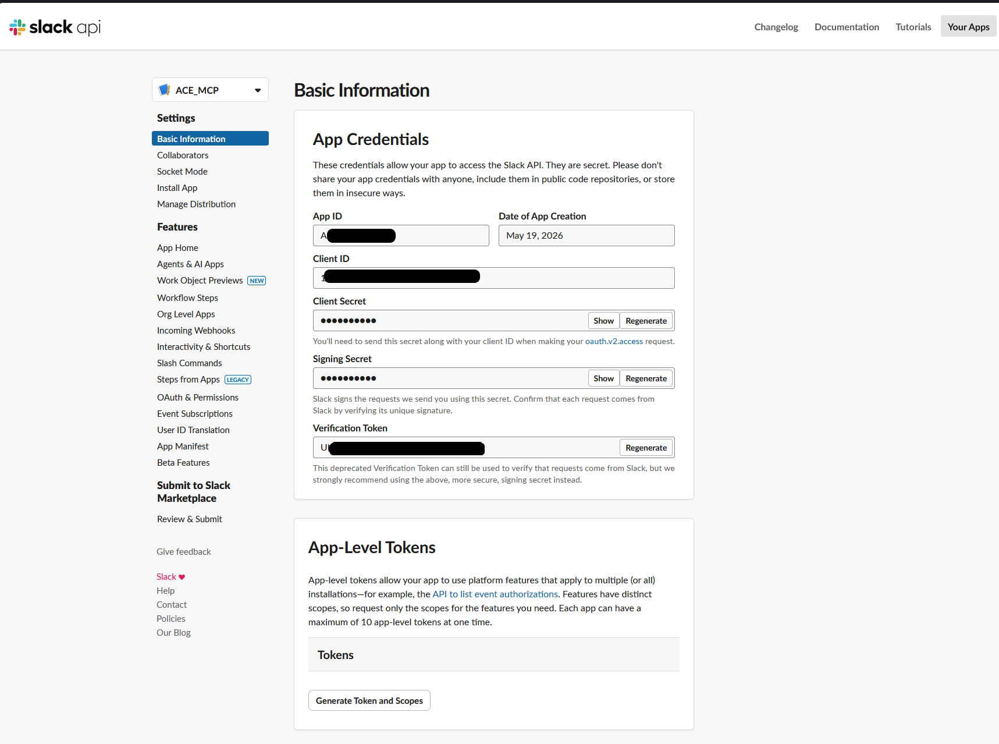

> Warning: all five values on this screen (App ID, Client ID, Client Secret, Signing Secret, Verification Token) are secrets in the loose sense. Rotate them if any leak. If any end up in a screenshot, regenerate from the Regenerate button next to the field.


## Step 6: Attempt to connect, and hit the wall

Back in the wizard, Slack panel still expanded, paste the token you got from Step 5 into the Access token field. Whichever route. The Connect button activates.

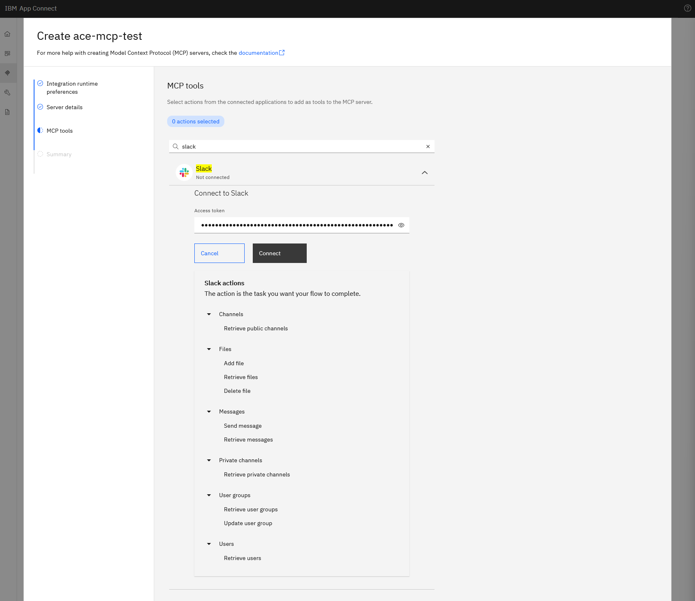

Click Connect, and:

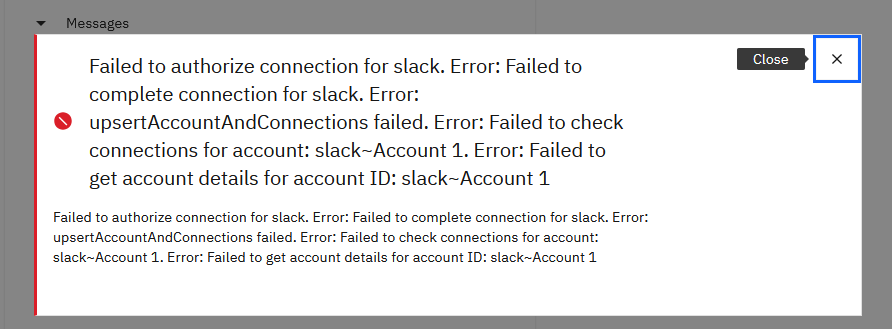

> Failed to authorize connection for Slack. Error: Failed to complete connection for Slack. Error:
> upsertAccountAndConnections failed. Error: Failed to check connections for account: slack~Account 1. Error:
> Failed to get account details for account ID: slack~Account 1


### Extra: if you want to capture ALL logs

For more logging while the cluster runs, Minikube's own node and system logs (kubelet, control plane, addons) in follow mode:

```powershell
minikube logs -f
```

For pod logs across the whole cluster, kubectl alone can't tail them all. Install [stern](https://github.com/stern/stern), which tails every pod in every namespace. Either scoop or choco will install it:

```powershell
scoop install stern
# or
choco install stern
```

Then tail every pod in every namespace:

```powershell
stern --all-namespaces .
```

The `.` is a regex matching every pod name. Scope to a single namespace with `-n ace-demo`, or to ACE-managed pods only with `-l app.kubernetes.io/managed-by=ibm-appconnect`.
Bonus: namespace-coloured output in the tail.

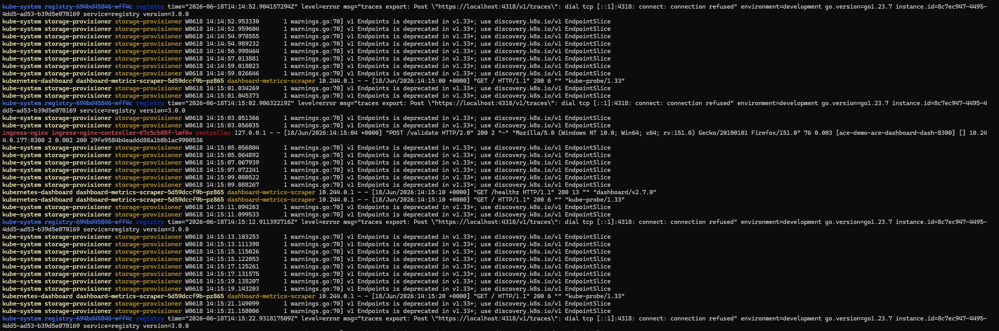

### What's actually broken

The error chain bottoms out at "Failed to get account details." The dashboard logs show a deeper hint:

```text
Failed to log customer data. Invalid instance Id ("") for message: checkAccounts()
  - Error occurred when requesting status:
#authorizeConnection - Failed to complete connection for slack.
  Error: upsertAccountAndConnections failed.
  Error: Failed to check connections for account: slack~Account 1.
  Error: Failed to get account details for account ID: slack~Account 1
```

So after the OAuth handshake succeeds on Slack's side, the dashboard tries to register the new account internally. That step calls into the IR's connector service over mTLS:

```bash
k exec deploy/ace-dashboard-dash -c control-ui -- \
  curl -sk -o /dev/null -w "HTTP %{http_code} errno=%{exitcode}\n" \
  https://ace-mcp-test-ir:3001/

HTTP 000 errno=56                       # 56 = TLS handshake failed
```

The IR's connector service on port 3001 is configured with `SERVER_MTLS_CA_PATH=.../adminssl/ca.crt.pem`, expecting a client certificate. The dashboard isn't presenting one, so the handshake fails before any HTTP response. That mTLS wiring is supposed to be set up automatically by the operator when a new IR is created. On OpenShift or IKS it is. On plain Kubernetes (minikube here) it isn't.

### Trying to work around it with the IBM "containerised environment" procedure

There's an IBM doc page, [Connecting to Slack from a containerized environment](https://www.ibm.com/docs/en/app-connect/13.0.x?topic=slack-connecting-from-containerized-environment), that walks you through doing the OAuth dance manually with `curl`, so you can inject the resulting access token into App Connect without going through the dashboard's Connect button.


The procedure is roughly:

1. Construct an authorize URL with your `client_id`, `scope`, `redirect_uri=https://www.google.com/`, and a `state`, open it in a browser, approve in Slack.
2. Slack redirects to `https://www.google.com/?code=...&state=...`. Copy the `code` value out of the address bar.
3. POST the code, client_id, client_secret, and the same redirect_uri back to Slack's token endpoint:

   ```cmd
   curl -X POST "https://slack.com/api/oauth.v2.access" ^
     -d "grant_type=authorization_code" ^
     -d "client_id=<CLIENT_ID>" ^
     -d "client_secret=<CLIENT_SECRET>" ^
     -d "code=<CODE>" ^
     -d "redirect_uri=https://www.google.com/"
   ```

4. Slack returns JSON with the bearer token (`access_token: xoxb-...`).

Two operational notes that bit me:

> OAuth codes are single-use even when the redirect_uri is wrong. My first POST returned `oauth_authorization_url_mismatch` because I'd dropped the trailing slash on `redirect_uri`, yet the code was consumed anyway. The second POST returned `invalid_code` and I had to re-do the browser authorize step to get a fresh one. Get the `redirect_uri` byte-perfect before you POST.

> Trailing slash matters. `https://www.google.com/` is not the same as `https://www.google.com`. Whatever you registered as the Slack app's Redirect URL is what you must send in both the authorize URL and the POST body.

Even with a freshly minted access token in hand, the wizard's Connect button still fails with the same `Failed to get account details for account ID: slack~Account 1` error. The button doesn't accept a pre-existing token. It always runs its own OAuth flow, then fails at the same internal `upsertAccountAndConnections` step. The manual procedure only helps if there's a separate path to inject the token into the `Accounts` Configuration secret directly (`ace-mcp-test-acc-<suffix>` in our case), and I couldn't find that path documented for `13.0.6.x`. I might not have looked hard enough, but at this point I was content where I was.

### Where this stops working on plain Kubernetes

Re-reading the field guide note now:

> Hosting: Red Hat OpenShift, or IBM Cloud Kubernetes Service at integration runtime 13.0.6.2-r1 or later. Other Kubernetes flavours: no automatic ingress, so you handle routing yourself.

"No automatic ingress" is the polite version. The actual gap is that the operator's dashboard↔IR cert wiring, including mTLS plumbing for the connector framework, relies on OpenShift Routes or IKS infrastructure to be there. On plain Kubernetes the IR comes up, the wizard creates all the artefacts, the OAuth dance works, and then the dashboard can't TLS-handshake with the IR it just created.

If you genuinely need Dashboard-wizard connector-based MCP servers on a non-OpenShift / non-IKS cluster, you're looking at hand-crafting the BAR file and Configuration secrets yourself outside the wizard. At that point you're not really using the wizard anymore. The faster path is to wait for or upgrade to ACE operand `13.0.7.0+` and use the `MCP.Runtime` block in `server.conf.yaml` to expose deployed REST APIs as MCP tools directly from the IR. That path doesn't depend on the dashboard's connector framework at all.

That's a separate post for another day.

---

## References

* [IBM docs, Creating and managing MCP servers (Dashboard)](https://www.ibm.com/docs/en/app-connect/13.0.x?topic=dashboard-creating-managing-mcp-servers)
* [IBM docs, Connecting to Slack from a containerized environment](https://www.ibm.com/docs/en/app-connect/13.0.x?topic=slack-connecting-from-containerized-environment)
* [IBM docs, Integration Runtime CR values (incl. `spec.mcp.runtime.*`)](https://www.ibm.com/docs/en/app-connect/certc_install_integrationruntimeoperandreference.html#crvalues)
* [Prometheus Operator (bundle.yaml)](https://github.com/prometheus-operator/prometheus-operator)
* [Slack API, OAuth v2 access](https://api.slack.com/methods/oauth.v2.access)
* [Previous post: Upgrading ACE on Minikube](https://matthiasblomme.github.io/blogs/posts/Ace-Operator-Minikube/upgrading_ace_minikube/)
* [All the files used in this blog](https://github.com/matthiasblomme/ace-minikube)

---

Written by [Matthias Blomme](https://www.linkedin.com/in/matthiasblomme/)

\#IBMChampion
\#AppConnectEnterprise(ACE)
\#k8s
\#AceOperator
\#AceDashboard
\#AceRuntime
\#ACECC
\#MCP
\#ModelContextProtocol
