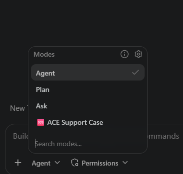
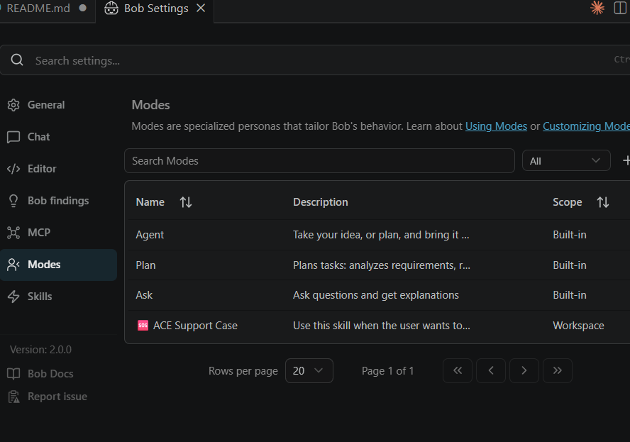

# Opening an IBM ACE support case with a custom Bob mode

Opening an IBM support case for ACE can be a chore you almost always do under pressure, usually when something is already on fire. A good chunk of time goes into remembering what to collect: the exact version, the right logs, the trace, the abend file, ... You always (I say you, but maybe it's just me) forget that one thing support asks for two days later, that you could have grabbed in the first round. I do it rarely enough to forget some of these details, and the steps for it are spread across a dozen documentation pages.

So I put it in a mode.

It lives here: [github.com/matthiasblomme/bobmodes](https://github.com/matthiasblomme/bobmodes), public, so you can grab it too.

## What it actually does

Enough chit-chat, let's dive in. The mode acts as a senior ACE support specialist. You describe the problem, and it walks you through collecting a complete, well organised diagnostic bundle, the kind IBM Support can act on immediately instead of bouncing back with "can you also send...". Saving all of us some valuable time.

It runs in five phases:

1. **Triage**: a few questions, one or two at a time, to pin down the symptom, the timing, which node and integration server are involved, and what changed recently. It uses the answers to classify the problem (crash, performance, functional, deployment, database, SSL, or general).
2. **Runtime access check**: do you have a shell on the ACE server or not. If yes, it runs the commands. If no, it hands you a ready to run script and asks for the output.
3. **Baseline collection**: `mqsiservice -v` for the version, then `aceDataCollector`, which is the single most complete automated diagnostic tool ACE ships and has no runtime impact.
4. **Problem specific diagnostics**: a decision tree per problem type. Event log windows for a crash, user trace and `ACELogAnalyser` for performance, ODBC trace for a database issue, library path ordering for a GSKit problem, and so on.
5. **Analysis and case generation**: it self checks the data, then writes an `ibm_case_submission.txt` with every field the IBM portal wants, title, product, exact fix pack, a severity suggestion, business impact, and a structured description, ready to paste.

One thing sits on top of all five: an optional rules file your organisation can fill in, so the mode follows your redaction and governance rules without you re-explaining them each time. More on that below.

Nothing the skill does is destructive. It gathers, it scopes, it organises, and it writes the case text. The collecting is the part everyone gets wrong under pressure, so that is the part it owns.

It is also grounded in IBM's "Troubleshooting and support" documentation. The mode does not bundle the IBM docs themselves, those are copyrighted, so it links to them by URL instead. What it does ship is a workflow and a diagnostics guide distilled from that material, so its command syntax and file paths are not invented on the spot.


## Two entry points, one workflow

The repo is laid out like this:

```
bobmodes/
├── README.md                        # install + prerequisites
├── scripts/
│   └── Import-BobModes.ps1          # imports modes into a project's .bob/custom_modes.yaml
└── bobmodes/
    ├── README.md                    # per-mode docs
    └── ace-support-case/
        ├── .bobmodes                # the Bob mode definition
        ├── SKILL.md                 # the Claude skill entry point
        ├── ace_support_case.md      # original working notes
        ├── custom-rules/            # optional org-specific rules (empty by default)
        └── references/              # workflow, diagnostics guide, IBM doc links
```

The `.bobmodes` file is the one Bob cares about. It is in YAML: a slug, a name, a description, when it should trigger, which tools it gets, and the instructions that make up the workflow above.

The `.bobmodes` skeleton:

```yaml
customModes:
  - slug: ace-support-case
    name: 🆘 ACE Support Case
    description: >-
      Use this skill when the user wants to open an IBM support case for ACE,
      needs to gather diagnostics, references BIP2111 / BIP2060, ...
    roleDefinition: >-
      You are operating as a senior IBM App Connect Enterprise (ACE) support
      specialist guiding the user through diagnostic collection...
    whenToUse: >-
      Use this mode when the user needs to raise or prepare an IBM ACE support
      case: gathering diagnostics, investigating a crash or abend, ...
    groups:
      - read
      - - edit
        - fileRegex: \.(md|txt|sh|bat|csv|json|log)$
          description: Diagnostic scripts, collected text/logs, and case submission files only
      - command
    customInstructions: >-
      Read references/workflow.md before starting. Also read custom-rules/rules.md
      and apply anything in it. Then the five phases above...
```

The `groups` block is where it gets its hands tied on purpose: it can read anything, run commands, but only edit diagnostic and text files. It is not going to touch your `.msgflow` or your ESQL while collecting a support bundle.

## Getting it into Bob

Custom modes are imported per project. The repo ships a small PowerShell importer that scans a source path for `.bobmodes` files and merges them into a target project's `.bob/custom_modes.yaml`, skipping any bobmode already in there.

```powershell
git clone https://github.com/matthiasblomme/bobmodes.git
cd bobmodes
.\scripts\Import-BobModes.ps1 -SourcePath ".\bobmodes" -TargetProjectPath "D:\Projects\YourProject"
```

It will create `.bob/custom_modes.yaml` if the project does not have one yet, or merge into it if it does. Reload the VS Code window afterwards (`Ctrl + Shift + P`, then `Reload Window`) and the mode shows up as **🆘 ACE Support Case** in the dropdown, with a `/ace-support-case` slash command next to it.





## Using it

You do not fill in a form. You describe what happened, in your own words:

```
My ACE integration node crashed last night with a BIP2111. What do I need to
collect for an IBM support case?
```

```
ACE throughput dropped off a cliff this morning. Help me gather diagnostics for IBM.
```

From there it runs the triage questions, checks whether you can reach the server, and either runs the baseline collection or writes you a script to run. It assembles everything into an `ACE_SupportCase_<NodeName>_<YYYYMMDD>/` folder and finishes with the case submission text. The boring, easy to forget parts, version, timing window, abend file, are the parts it refuses to skip.

## Bending it to your house rules

The default workflow is deliberately generic. It does not know that your infosec team wants certain fields scrubbed before anything leaves the building, or that nothing goes to IBM until there is a Jira task or a ServiceNow ticket raised for it. No shipped mode can guess that.

So there is a `custom-rules/rules.md`. Empty by default, which means the mode runs exactly as described above. Drop your own rules in it and the mode applies them on top of its default steps. When one of your rules contradicts a default step, your rule wins, and the mode tells you it is overriding the default instead of doing it quietly.

The kind of thing that belongs in there:

- **Redaction and data handling.** What gets scrubbed before the bundle goes anywhere, the approved upload channel (portal attachment, ECuRep, encrypted), and a hard no on production data.
- **Where your logs actually live.** A custom work-dir, container volume paths, or a log aggregator like Splunk or ELK instead of the local error log.
- **Internal governance.** The incident or change ticket you have to raise first, your internal severity mapping, and where the bundle has to be stored.
- **Entitlement.** IBM Customer Number, site ID, support tier, named callers, so the case goes out under the right account.
- **Your own collection procedure.** House scripts and flags where they differ from the stock `aceDataCollector` and trace steps.

Leave it empty and nothing changes, which is the default for a reason. Most people just want the case collected.

## Testing it without waiting for an outage

A support-case mode is awkward to dry run, because you need a case. And the cleanest signal it keys off, an abend file, never shows up during normal operation. That is exactly what makes an abend file useful, and exactly what makes it a bad thing to sit and wait for.

So let's make one on purpose.

!!! warning "Lab only"
    Everything below deliberately crashes an integration server. Do it on a development or test server you own, never anywhere near production. Abend files are never produced during normal operation, so the only way to get one is to cause it.

When an integration server process ends abnormally, ACE traps that and writes an abend file to the `errors` directory before it goes down. On Windows that is `<INSTALL_DIR>\errors\`, logged as **BIP2111**. On Linux it is `/var/mqsi/errors/`, logged as **BIP2060**. IBM's own list of what causes one includes "a user-defined extension causes an instruction in the integration server process that is not valid", which is the door we are going to walk through.

### The clean way: crash the JVM from a JavaCompute node

A JavaCompute node runs inside the integration server process, on the embedded JVM. If you make that JVM segfault, the whole server goes down hard and you get an abend file. `sun.misc.Unsafe` lets you do precisely that from plain Java: write to a null address and the JVM takes a SIGSEGV it cannot recover from.

Drop a JavaCompute node behind any input node and give it this `evaluate`:

```java
import com.ibm.broker.javacompute.MbJavaComputeNode;
import com.ibm.broker.plugin.MbException;
import com.ibm.broker.plugin.MbMessageAssembly;
import java.lang.reflect.Field;
import sun.misc.Unsafe;

public class Crash_JavaCompute extends MbJavaComputeNode {

    public void evaluate(MbMessageAssembly assembly) throws MbException {
        try {
            Field f = Unsafe.class.getDeclaredField("theUnsafe");
            f.setAccessible(true);
            Unsafe unsafe = (Unsafe) f.get(null);
            unsafe.putAddress(0L, 0L); // write to address 0 -> SIGSEGV -> JVM down
        } catch (ReflectiveOperationException e) {
            throw new RuntimeException(e);
        }
    }
}
```

This works on ACE 12 (Java 8) and ACE 13 (Java 17), for slightly different reasons. On Java 8 there are no modules, so `sun.misc.Unsafe` is just there for the taking. On Java 17 it lives in the `jdk.unsupported` module, which is exported by default, so you still do not need any extra JVM flags. Either way, deploy the flow, send a single message through it, and the integration server is gone, with a fresh abend file waiting in the `errors` directory.

### The quick way on Linux: send it a signal

No flow, no deploy. Find the integration server process and hand it a signal ACE traps:

```bash
# independent server -> the IntegrationServer process
# node-managed server -> the DataFlowEngine process
ps -ef | grep -i integrationserver | grep <serverName>

kill -SEGV <pid>     # or -ABRT
```

ACE's signal handler catches `SIGSEGV` or `SIGABRT`, writes the abend file, then lets the process die. Do not reach for `kill -9`: `SIGKILL` cannot be trapped, so you get a dead server and no abend file, which is the one thing you were trying to produce.

There is a third option from IBM's list, running the server out of memory, but it is far less controllable and a lot messier to clean up. The two above are enough.

### Point the mode at the mess

Now the actual demo. Open the **ACE Support Case** mode and tell it the server crashed.

It checks the `errors` directory, finds the abend file, and treats the case as a crash from there. It asks for the version, runs `aceDataCollector`, scopes the event log or syslog to a window around the crash instead of dumping the whole thing, pulls the abend and dump files, and flags the abend as high priority. Then it writes the `ibm_case_submission.txt`: the BIP code, the exact fix pack, a severity suggestion, and a structured problem description.

That is the case you would otherwise have spent an afternoon assembling by hand, built from a crash you caused on purpose in under a minute.

## Wrap up

The mode is on [GitHub](https://github.com/matthiasblomme/bobmodes), importable into any Bob project with the included script. The support workflow is the same one I used to run from memory and a handful of bookmarked doc pages, except now it does not let me forget the version or the timing window.

And if you want to watch it work before you need it for real, crash a test server with eight lines of Java and point it at the wreckage.

---

Written by [Matthias Blomme](https://www.linkedin.com/in/matthiasblomme/)

\#IBMChampion \
\#AppConnectEnterprise(ACE)
