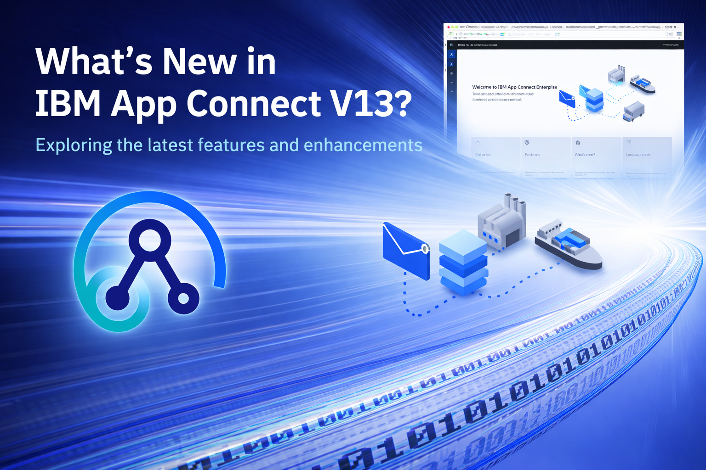{ .md-banner }

<!--MD_POST_META:START-->
<div class="md-post-meta">
  <div class="md-post-meta-left">2026-01-16 · ⏱ 31 min</div>
  <div class="md-post-meta-right"><span class="post-share-label">Share:</span> <a class="post-share post-share-linkedin" href="https://www.linkedin.com/sharing/share-offsite/?url=https%3A%2F%2Fmatthiasblomme.github.io%2Fblogs%2Fposts%2Face-v13-new-features-overview%2Fv13-new-features%2F" target="_blank" rel="noopener" title="Share on LinkedIn">[<span class="in">in</span>]</a></div>
</div>
<hr class="md-post-divider"/>
<div class="md-post-tags"><span class="md-tag">ace</span> <span class="md-tag">ibm</span> <span class="md-tag">v13</span> <span class="md-tag">migration</span></div>
<!--MD_POST_META:END-->


# ACE v13 new features (when coming from v12)

> **DISCLAIMER:**
> Information based on IBM documentation and release notes. Interpret responsibly.

## Why I'm doing this

[Ben Thompson](https://community.ibm.com/community/user/people/ben-thompson1) already breaks down every ACE release in detail.
This isn’t that. 

This is the consolidated view. Everything that changed in ACE 13, grouped by product area, for anyone migrating from v12.
I went through all updates myself anyway, so this became the logical byproduct.

This isn’t a deep dive. It’s a structured overview. Follow the referenced material if you want the full detail. I’ll link 
Ben’s posts and a few additional resources that are worth your time.

I’ll keep updating this as new 13.x releases drop.

Some topics span multiple product areas. I placed them where they made the most sense (to me). Feel free to disagree, 
as long as you keep reading.

## The delta from v12

### Release cycle

Not really a feature, but since this is a consolidated overview, it belongs here.

General availability: 27 September 2024
Support cycle: 5+1+3
- 5 years of standard support
- 1 year of extended support for new defects
- 3 years of extended support for usage and known defects
  
End of support: 2029
End of extended support: 2033

### Product editions

The naming of product editions has slightly changed in v13. The overview below summarizes the updated terminology.

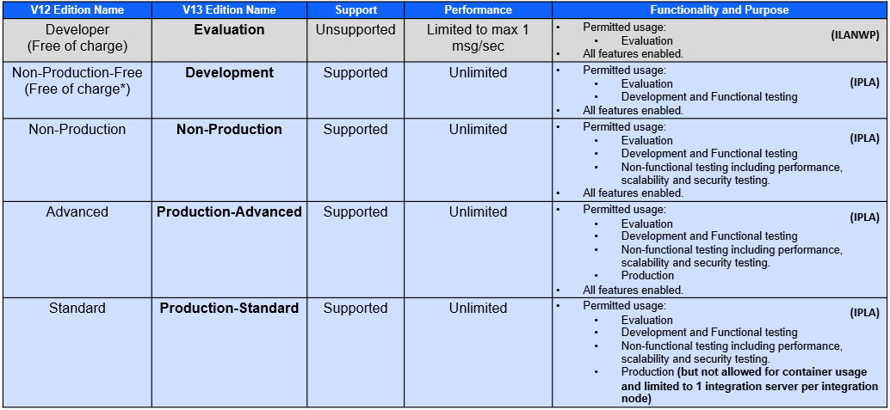

If you do not have paid entitlements, the [Developer edition](https://www.ibm.com/resources/mrs/assets?source=swg-wmbfd)  remains available free of charge after IBM account 
registration.

### Designer

App Connect Enterprise Designer is a lightweight flow authoring environment that complements the Toolkit. It aligns more 
with cloud-native development platforms and is now included in local installations as of v13.
It is not a replacement for the Toolkit. The typical workflow is to start a connector-based flow in Designer and move to 
the Toolkit for advanced configuration.

Impact when coming from v12:
Designer is now part of the standard local installation, making low-code and connector-based development more accessible 
without separate environments.

#### Templates

Designer includes a set of built-in templates to bootstrap common integration scenarios. These provide starting structures 
rather than fully guided tutorials.

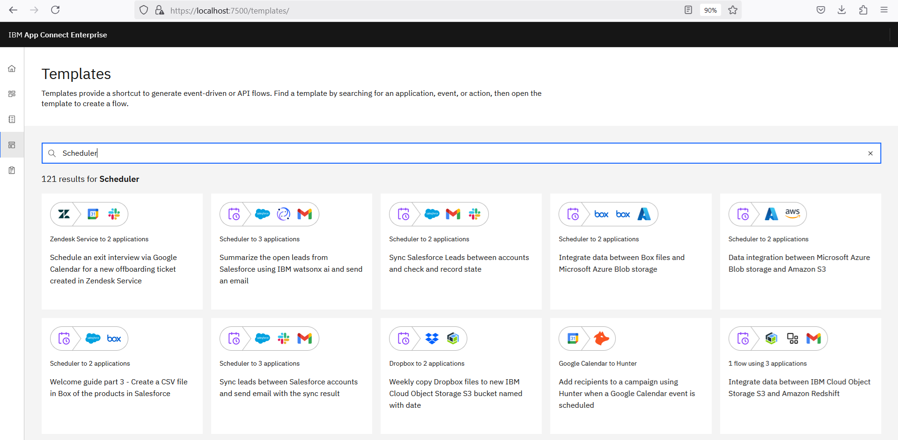

#### Kafka nodes

Kafka input and output nodes can now be used directly from Designer, reducing the need to switch to the Toolkit for basic 
event-driven flows.

#### Rest Request nodes

Outbound RESTRequests support OAuth 2.0 authentication in addition to:
- Basic
- Api key
- Bearer token 
- Basic OAuth

The OAuth 2.0 password configuration:

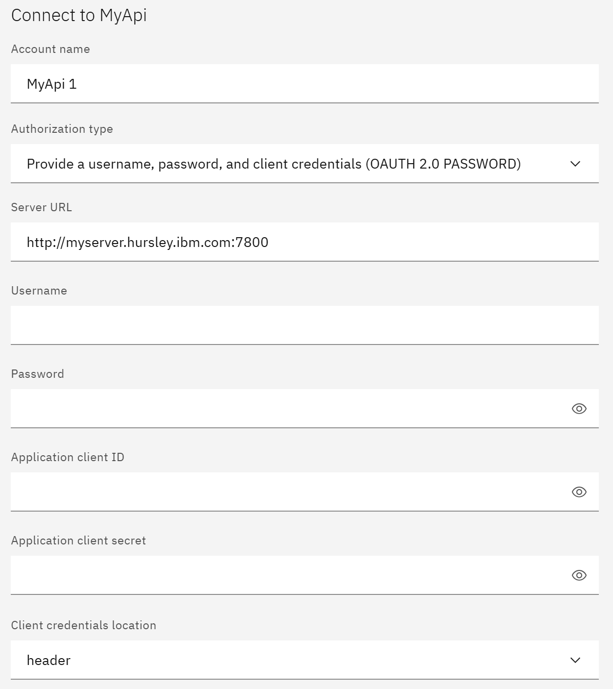

The OAuth 2.0 credentials configuration:

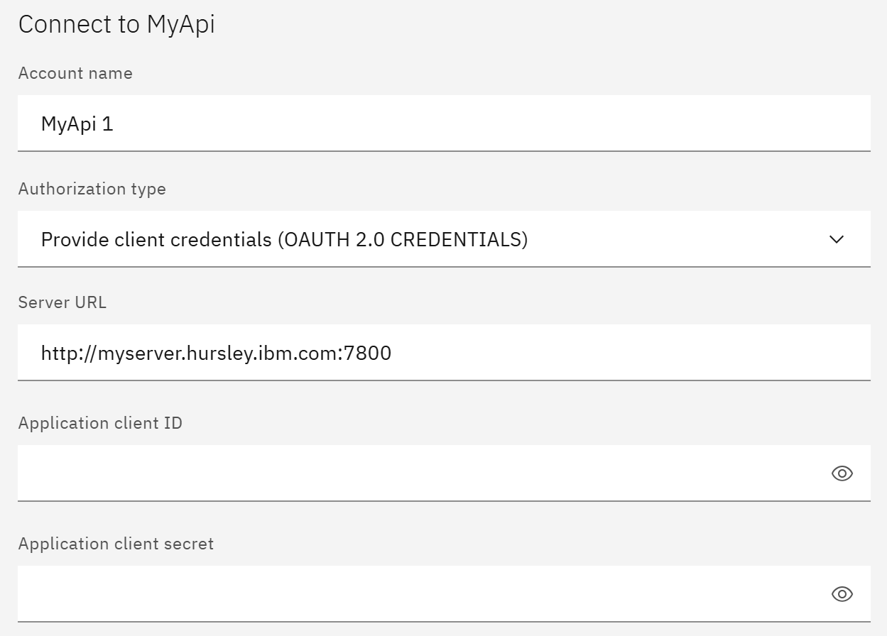

Impact when coming from v12:
OAuth-secured outbound calls can now be configured directly within Designer.

#### Patterns

Patterns provide a faster starting point than manual flow construction but are less prescriptive than tutorials.

A redesigned Patterns Gallery is included in v13. Patterns generate structured solutions for recurring integration 
scenarios and are categorized into:

- Protocol Transformation Patterns
- Format Transformation Patterns
- AI Patterns
- Enterprise Integration Patterns
- Scatter-Gather Patterns
- Messaging Patterns

Some patterns (approximately 17 in 13.0.6.0) are marked as "coming soon".


##### RAG Pattern

The Retrieval-Augmented Generation pattern is the first entry in the AI category. It provides a structured starting point 
for building AI-enhanced flows using contextual retrieval.

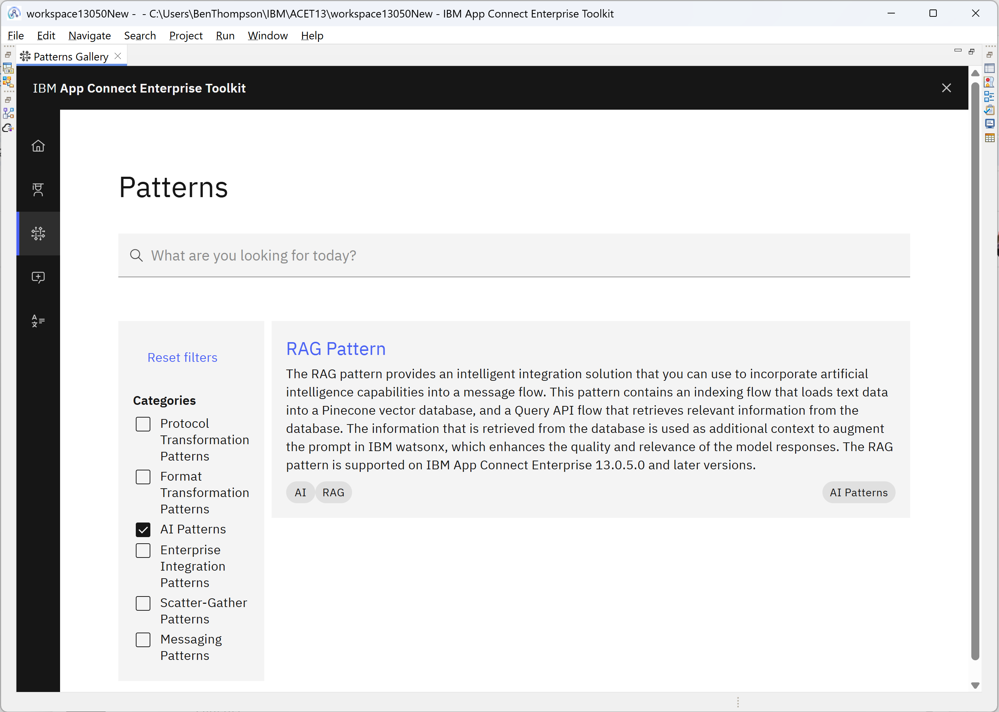


#### AI Mapping

Designer includes Mapping Assist and Data Assist features. Mapping Assist runs locally using an IBM-provided containerized 
LLM and does not require cloud connectivity.

You will need to download and run a single IBM-provided container which hosts the LLM, this can be done with Podman,
Docker, or any other container orchestrator. Just configure the endpoint in the `designer.conf.yaml`

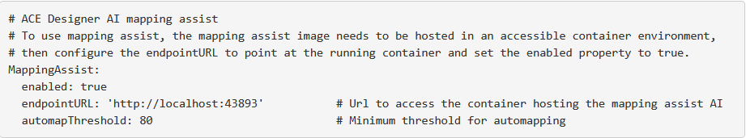

Data Assist uses the same setup to help generate JSONata expressions within graphical mappings.

Impact when coming from v12:
AI-assisted mapping is now integrated locally, without external SaaS dependencies.

#### Designer Account Managing

Since 13.0.5.0, Designer allows custom naming of account information used during discovery.

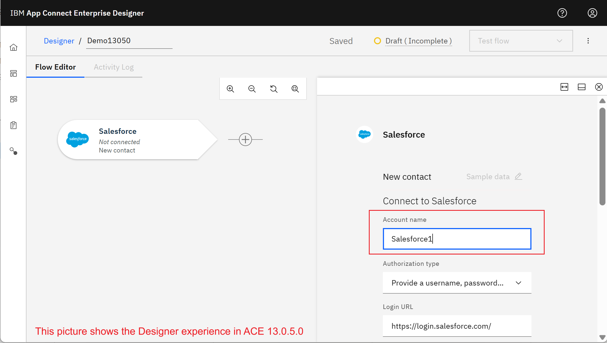

#### Open API Import

Designer supports importing OpenAPI documents describing REST APIs to be invoked from a flow. This enables contract-first 
flow creation.

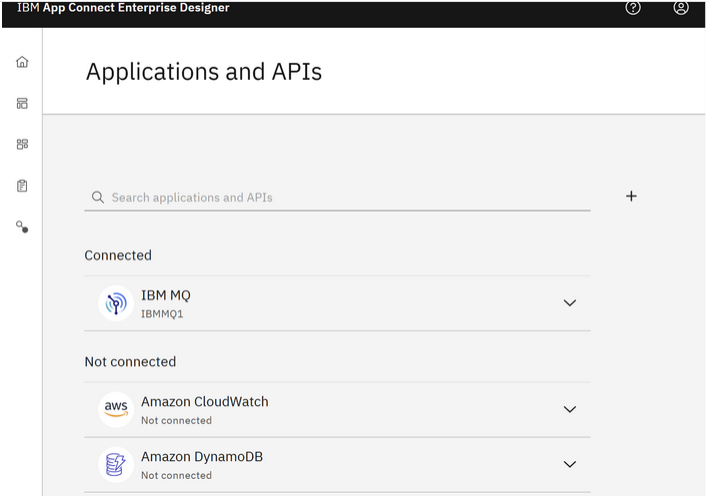

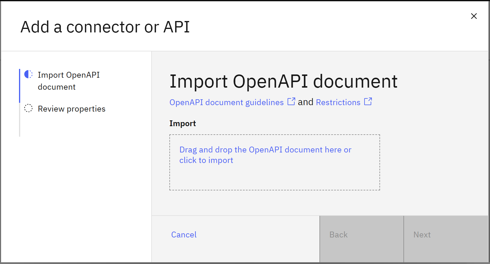

#### HTTP Proxy 

Proxy configuration can be defined within Designer for use during authoring and runtime.

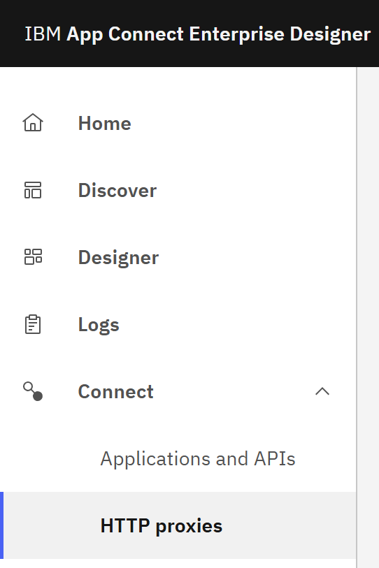

Defined proxies can be referenced by multiple connector nodes across Designer and Toolkit environments.

 - Amazon DynamoDB
 - Amazon EC2
 - Amazon EventBridge
 - Amazon Kinesis
 - Amazon RDS
 - Amazon S3
 - Amazon SNS
 - Amazon SQS
 - Astra DB
 - AWS Lambda
 - Confluence
 - Databricks
 - DGitHub
 - DGoogle Chat
 - DGoogle Drive
 - DGoogle Gemini
 - DGoogle Sheets
 - DIBM DB2
 - DMicrosoft Azure Blob Storage
 - DMicrosoft Azure Event Hubs
 - DMicrosoft Azure Service Bus
 - DMicrosoft Dynamics 365 for Finance and Operations
 - DMicrosoft Dynamics 365 for Sales
 - DMicrosoft Entra ID
 - DMicrosoft Exchange
 - DMicrosoft SharePoint
 - DMicrosoft Teams
 - DSAP Ariba
 - DServiceNow
 - DShopify
 - DSlack
 - DSnowflake
 - DSplunk
 - DWorkday

Impact when coming from v12:
Proxy management is centralized and reusable across supported connectors.

### Toolkit Enhancements

#### New Nodes (and updates)

##### Discovery Request Nodes

The following Discovery Request nodes were introduced across the 13.x releases:

| 13.0.1.0                       | 13.0.3.0                           | 13.0.4.0                             | 13.0.5.0                   | 13.0.6.0      |
|--------------------------------|------------------------------------|--------------------------------------|----------------------------|---------------|
| Businessmap Request node       | Azure Cosmos DB Request node       | Azure Service Bus Request node       | Microsoft Azure Event Hubs | Apache Pulsar |
| ClickSend Request node         | Milvus Request node                | IBM Planning Analytics Request node  | Google Gemini              | AstraDB       |
| Crystal Ball Request node      | Pinecone Vector Database Request   |                                      | IBM Aspera                 | Databricks    |
| Factorial HR Request node      | Workday Request                    |                                      | Redis                      |               |
| Front Request node             |                                    |                                      | Splunk                     |               |
| Hunter Request node            |                                    |                                      | Vespa                      |               |
| IBM Targetprocess Request node |                                    |                                      |                            |               |
| IBM watsonx.ai Request node    |                                    |                                      |                            |               |
| Infobip Request node           |                                    |                                      |                            |               |
| Toggl Track Request node       |                                    |                                      |                            |               |
| Wrike Request node             |                                    |                                      |                            |               |
| Zoho Books Request node        |                                    |                                      |                            |               |
| Zoho CRM Request node          |                                    |                                      |                            |               |
| Zoho Inventory Request node    |                                    |                                      |                            |               |
| Zoho Recruit Request node      |                                    |                                      |                            |               |


##### Discovery Input Nodes

The following Discovery Input nodes were introduced across the 13.x releases:

| 13.0.1.0                     | 13.0.4.0                       | 13.0.5.0                   | 13.0.6.0            |
|------------------------------|--------------------------------|----------------------------|---------------------|
| Businessmap Input node       | Amazon Event Bridge Input node | Microsoft Azure Event Hubs | Apache Pulsar,      |
| ClickSend Input node         | Azure Service Bus Input node   |                            | AstraDB             |
| Eventbrite Input node        |                                |                            | Databricks          |
| Front Input node             |                                |                            | SAP SuccessFactors  |
| Greenhouse Input node        |                                |                            |                     |
| IBM Maximo Input node        |                                |                            |                     |
| IBM Targetprocess Input node |                                |                            |                     |
| Magento Input node           |                                |                            |                     |
| Marketo Input node           |                                |                            |                     |
| Slack Input node             |                                |                            |                     |
| Toggl Track Input node       |                                |                            |                     |
| Wrike Input node             |                                |                            |                     |
| Zoho Books Input node        |                                |                            |                     |
| Zoho CRM Input node          |                                |                            |                     |
| Zoho Recruit Input node      |                                |                            |                     |

##### JSONata Mapping Node

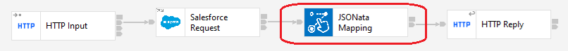

A dedicated JSONata Mapping node is now available. JSONata is a lightweight query and transformation language for JSON 
data, comparable in purpose to XSLT for XML.

Impact when coming from v12:
JSON transformations can now be encapsulated in a dedicated node instead of embedding JSONata expressions in other 
processing logic.

##### Kafka Nodes

The KafkaProducer, KafkaConsumer, and KafkaRead nodes now support Avro serialization with Schema Registry integration.

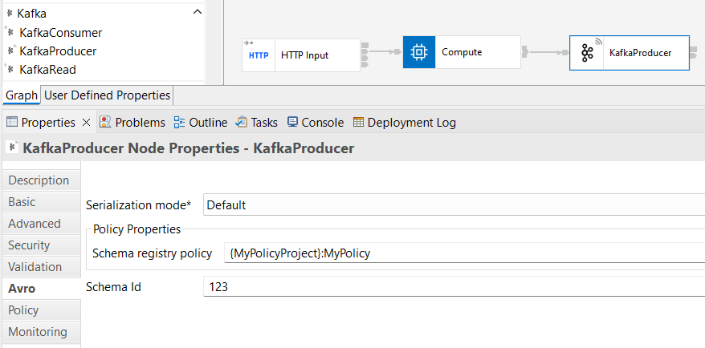

This requires a Schema Registry policy.

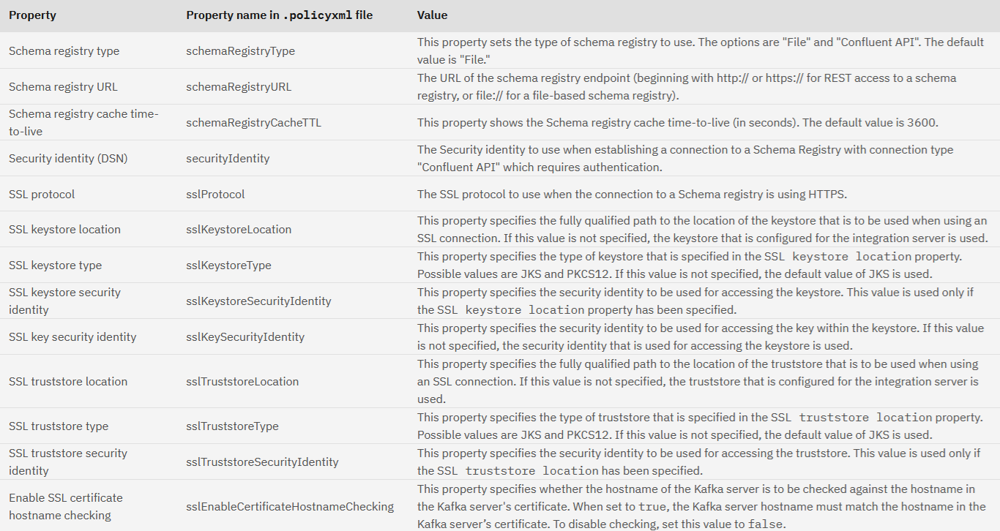

Transactional support has also been added for producers and consumers. A set of new node properties allows you to configure 
transactional message handling.

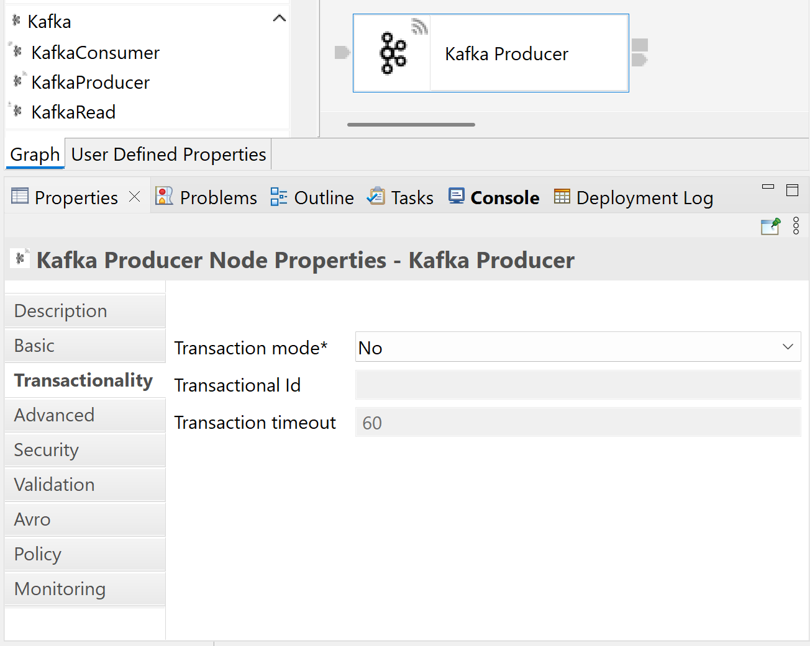

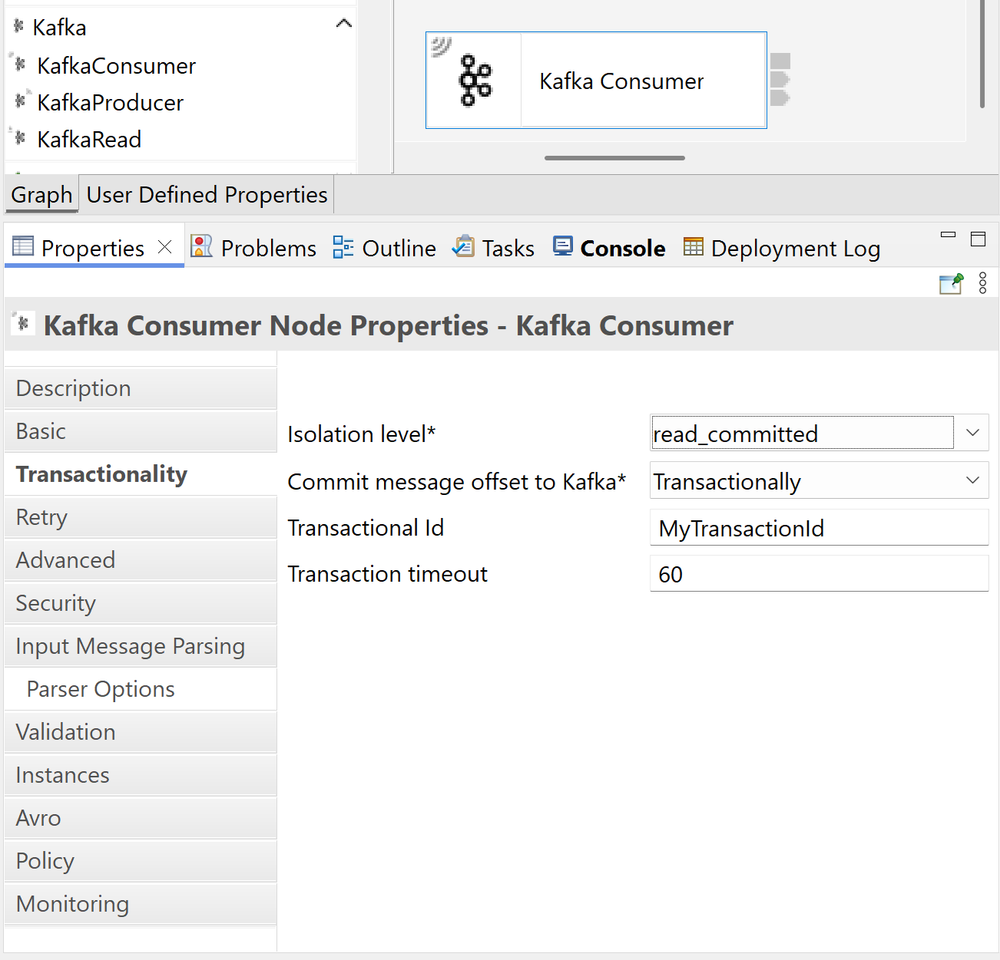

Kafka scaling options have been extended. You can now:
- Increase additional instances to process messages in parallel
- Deploy multiple message flows using the same consumer group ID and topic
- Enable multiple Kafka connections to increase concurrent message pulls

Impact when coming from v12:
If you implemented custom Avro handling or external transaction coordination, parts of that logic can now move into 
native node configuration. Scaling configurations are also more flexible without architectural changes.

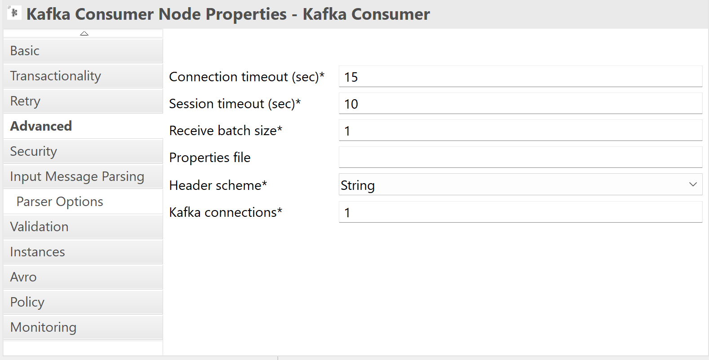

##### TCPIP Nodes

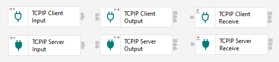

TCPIP nodes now support timeout values expressed as fractions of a second. Timeouts can be configured with up to three 
decimal places, for example 0.250. The shortest supported timeout is 0.100.

Impact when coming from v12:
You can now fine-tune connection timeouts more precisely without relying on whole-second values.

##### Couchbase Request Node

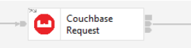

You can use the Couchbase Request node to connect to Couchbase and issue requests to perform actions on objects such as
buckets, collections, custom SQL, documents, and scopes. It comes with a matching policy as well.


##### Salesforce Nodes

Salesforce nodes now can be configured to use an HTTP proxy by setting a policy with the proxy details

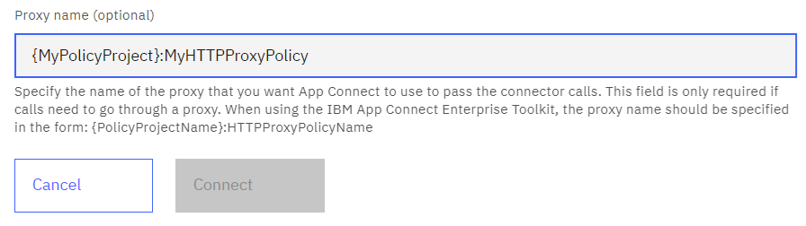

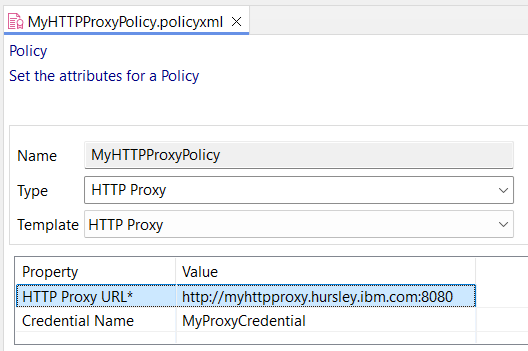


##### HTTPRequest Node

The HTTPRequest node now supports built-in retry configuration. You configure:

- Retry Mechanism: no or short
- Retry Threshold: number of retries
- Short Retry Interval: time interval between retries in seconds
- Retry Condition: the errors on which to retry

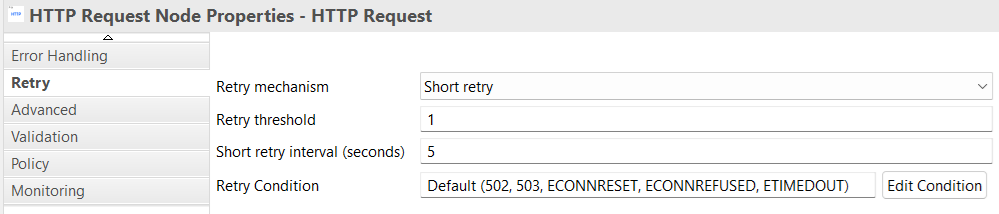

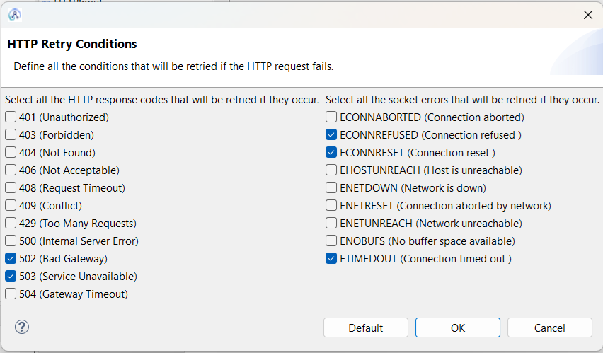

For most integrations, this reduces repetitive error-handling logic. It won’t replace complex recovery strategies, but 
for straightforward resiliency it does the job. OAuth 2.0 support has also been added directly to the node.

The node now supports these authentication types:
- apiKey
- basic
- basicApiKey
- bearerToken
- client
- oauth
- oauthPassword

When communicating with OAuth 2.0 secured endpoints, six additional HTTP policy properties are available to handle 
token acquisition and configuration.

Impact when coming from v12:
If you built retry wrappers or externalized OAuth handling, you can simplify those flows in v13.

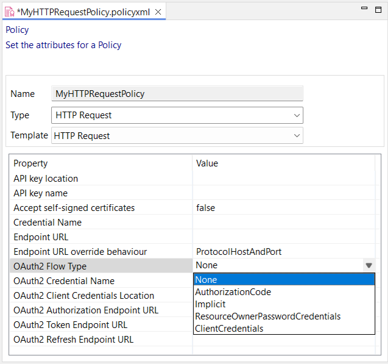

##### RestRequest Node

The RESTRequest node now supports OAuth 2.0 authentication and built-in retry configuration.

Supported Authentication types and options:
- apiKey
- basic
- basicApiKey
- bearerToken
- client
- oauth
- oauthPassword

Security scheme configuration can be derived from the associated OpenAPI document.

Retry behavior can be configured directly in the node:
- Retry Mechanism: no or short
- Retry Threshold: number of retries
- Short Retry Interval: time interval between retries in seconds
- Retry Condition: the errors on which to retry

Retry conditions are limited to a defined set of request failures.

Impact when coming from v12:
OAuth-secured REST calls and basic retry handling can now be configured natively, reducing the need for custom 
error-handling logic in flows.

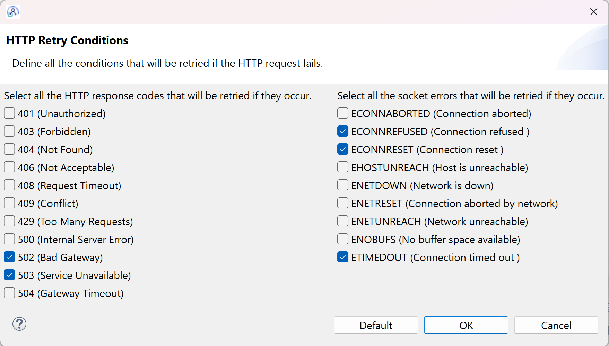

##### Callable Flow Nodes

CallableInput and CallableReply nodes now support configuration of supported message domains and models. These properties 
allow validation of incoming and outgoing messages against defined domains.

Impact when coming from v12:
Callable flows can now enforce domain-level constraints directly at the node level, reducing the need for manual validation logic.

##### Salesforce Input Node

The Salesforce Input node now supports a state persistence policy. This allows event processing to resume reliably after 
downtime. Events generated while the flow is not running can be processed once the integration server is available again.

An external persistence provider is required. Supported options are:
- FILE
- REDIS

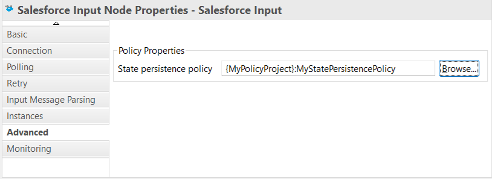

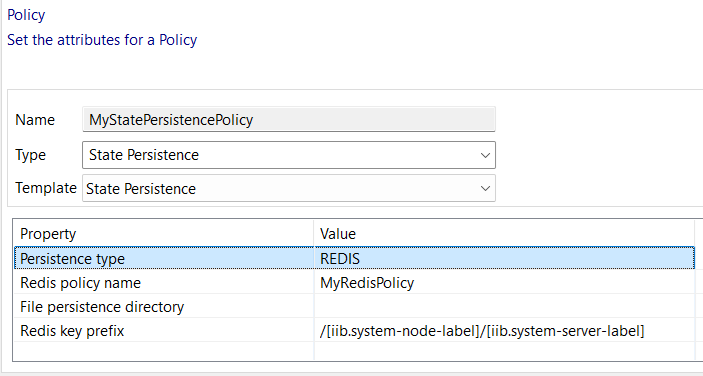

Impact when coming from v12:
Event continuity can now be managed explicitly, reducing the risk of missed Salesforce events during outages.

##### MQTT Nodes

MQTT version 5 is now supported. Configuration changes are reflected in the associated MQTT policies.

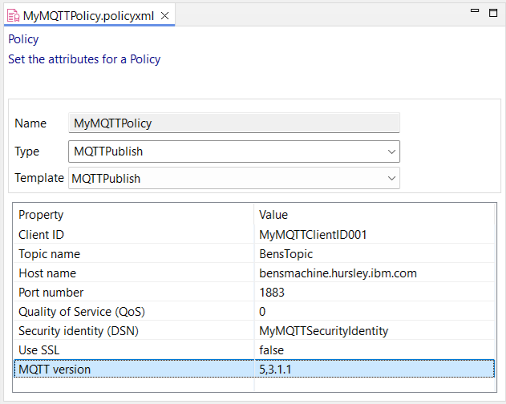

Impact when coming from v12:
MQTT integrations can be aligned with version 5 features and brokers without requiring protocol workarounds.

##### Microsoft Azure Blob Storage Request node

The Microsoft Azure Blob Storage Request node now supports pushing Blob data directly, without requiring prior conversion 
to JSON.

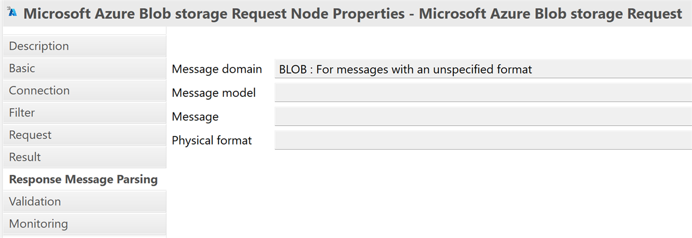

Impact when coming from v12:
Binary or large object uploads can be handled more directly, reducing unnecessary transformation steps in the flow.

##### Scheduler node

Since 13.0.6.0, the Scheduler node supports a Missed Event Mode when a State Persistence policy is configured. This setting 
determines how missed triggers are handled after a restart or outage.

Available behaviors include:
- Do not issue missed events
- Emit a single catch-up event
- Emit a catch-up event and reset the schedule 
- Replay all missed events before resuming the schedule

This provides controlled recovery behavior when an integration server has been stopped or unavailable.

Impact when coming from v12:
You can now define deterministic recovery behavior for scheduled flows instead of relying on default restart timing.

#### Build in console

The Toolkit now allows ACE commands to be executed directly from within the IDE.

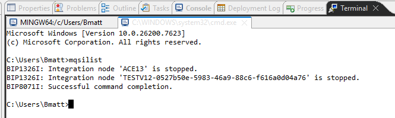

This reduces the need to switch to an external command prompt for common administrative or build operations.

Impact when coming from v12:
Command-line interactions can now be integrated into the development workflow without leaving the Toolkit.

#### External Directory Vault explorer

The Toolkit now supports managing an external directory vault directly from within the IDE. You can create, connect to, 
and manage credentials without relying solely on CLI tooling.

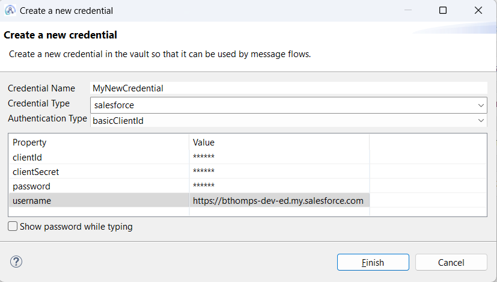

Impact when coming from v12:
Vault-backed credential management can now be handled inside the Toolkit, reducing the need for separate administrative 
workflows.

#### Container Explorer view

The Toolkit now allows you to add and manage ACE containers deployed on a Kubernetes platform directly from within the 
IDE. By providing the dashboard link, you can view and interact with deployed ACE Container Edition instances without 
switching to external tooling.

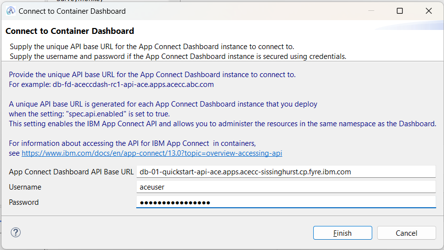

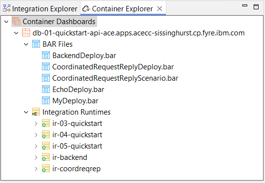

Impact when coming from v12:
Container-based deployments can be monitored and managed from the Toolkit, improving visibility for Kubernetes-based 
environments.

#### Context Trees

I might be biased (it's my blog, so I'm allowed to be), but Context Trees are one of the more meaningful additions in 
ACE 13. 

Originally introduced to support discovery connectors, they also provide a structured way to handle message data in 
classic ACE flows. The Context Tree is a read-only logical structure that grows as a message moves through a flow. At 
the start it contains information from the input node. Each subsequent node adds its payload and metadata. By the end, 
it provides a consolidated view of the full invocation path, including parser context. The original payload remains available throughout.

No additional configuration is required. As soon as you reference the Context Tree in ESQL, ACE populates it at runtime.

Context Trees are visible in the Debugger and Flow Exerciser (since 13.0.5.0). 

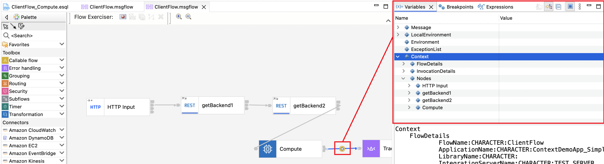

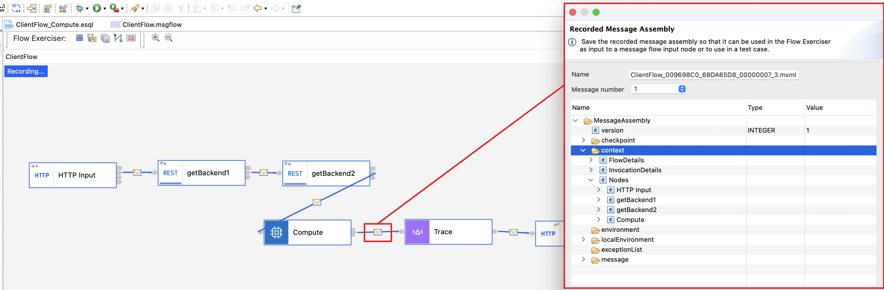

There are also new ESQL and Java APIs available to support interacting with the Context Trees

ESQL:

- CONTEXTINVOCATIONNODE
- CONTEXTREFERENCE

Java:

- MbContextTreeNode
- MbContextTreeNodePayload


#### Policy Editor

The Policy Editor now provides a more structured editing experience for certain policy types, with expandable sections 
grouping related properties.

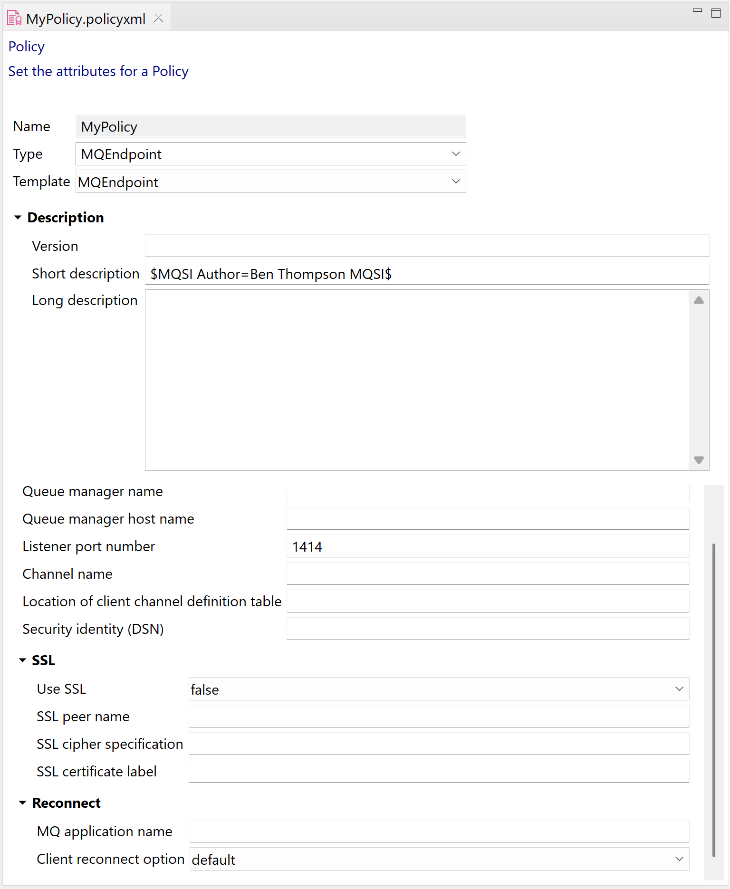

Description fields have also been enhanced. Keywords added in these fields are visible in the Toolkit properties panel 
and via the CLI using `mqsilist`.

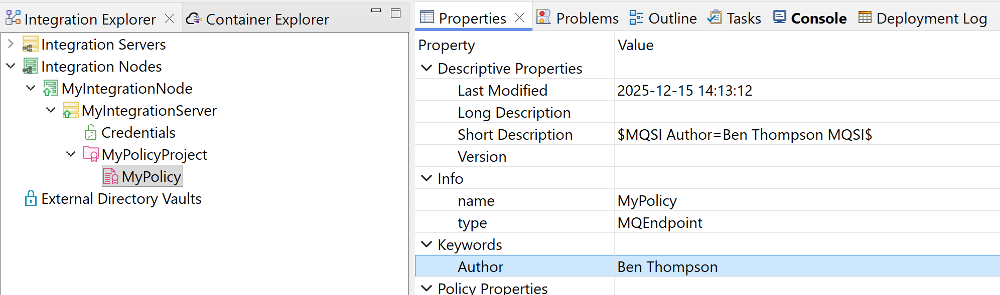

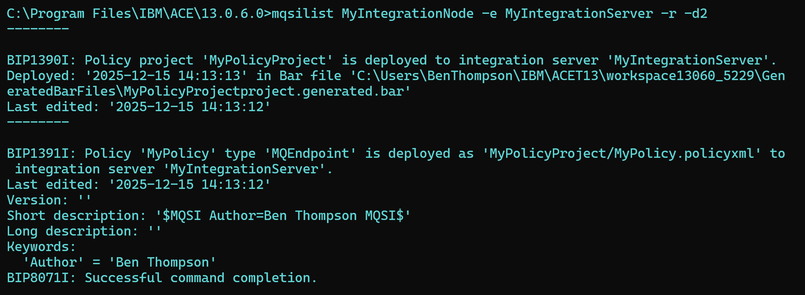

Impact when coming from v12:
Policy configuration is easier to navigate, and policy metadata can now be surfaced consistently in both the Toolkit and 
CLI output.


#### Installation Options

The Toolkit installer now provides more granular installation choices, allowing you to tailor the setup to your environment.

You can selectively install:
- Runtime
- Toolkit
- Designer (Electron app)
- Discovery connector nodes
- Open API editor components

- 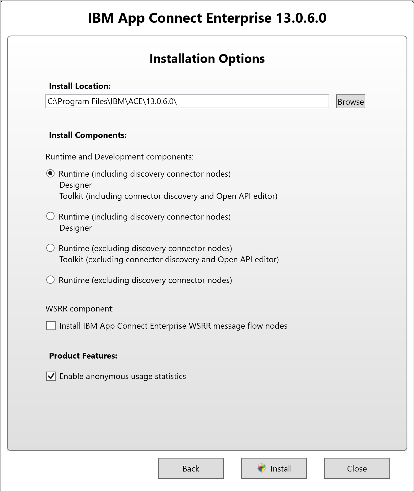

Equivalent command-line options are available for scripted installations:

| Components                                        | Command                                                                                          |
| ------------------------------------------------- | ------------------------------------------------------------------------------------------------ |
| Runtime + Toolkit + Designer + Cloud Connectors   | `ACESetup13.0.n.n.0.exe -installToolkit yes -installElectronApp yes -installCloudConnectors yes` |
| Runtime + Designer                                | `ACESetup13.0.n.n.0.exe -installToolkit no -installElectronApp no -installCloudConnectors yes`   |
| Runtime + Toolkit (no connectors/Open API editor) | `ACESetup13.0.n.n.0.exe -installToolkit yes -installElectronApp no -installCloudConnectors no`   |
| Runtime only                                      | `ACESetup13.0.n.n.0.exe -installToolkit no -installElectronApp no -installCloudConnectors no`    |

Impact when coming from v12:
Installation footprint can now be aligned more precisely with development or runtime-only environments, including fully 
scripted setups.

### CLI Enhancements

#### ibmint

##### ibmint deploy
`ibmint deploy` now supports additional SSL configuration options for remote deployments.

New options include
- `--output-uri URI` URI for a remote integration server in the form tcp://[user[:password]@]host:port or in the form ssl://[user[:password]@]host:port.
- `--https` specifies that HTTPS will be used for the connection to the integration node or server.
- `--no-https` specifies that HTTPS will not be used for the connection to the integration node or server.
- `--cacert cacertFile` specifies the path to the certificate file (in either PEM, P12, or JKS format)
- `--cacert-password cacertPassword` the password for password-protected cacert files.
- `--insecure` Specifies that the certificate that is returned by the integration node or server will not be verified.

These options allow secure deployment to remote integration servers without relying on implicit defaults.

##### ibmint display mode / set mode

ACE 13 introduces `ibmint display mode` and `ibmint set mode` as replacements for the older `mqsimode` command used in 
ACE 12. These commands allow you to view and configure the installation operation mode directly from the `ibmint` CLI.

Display the current mode:

ibmint display mode

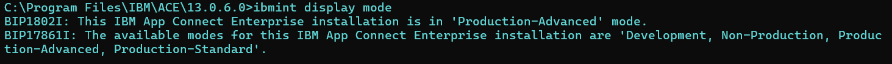

Set the operation mode:

ibmint set mode <mode>

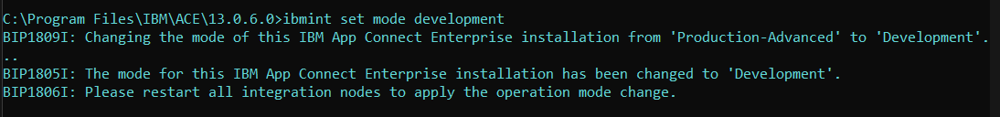

Supported modes include:

- Development
- Non-Production
- Production-Standard
- Production-Advanced
- Evaluation

This change continues the gradual shift away from the legacy `mqsi*` command family toward the consolidated `ibmint` 
tooling introduced in recent ACE releases.

If you're coming from ACE 12, this is the direct replacement for `mqsimode`.

#### Auto-complete

ibmint commands on Linux and Unix support auto-complete.

#### ibmint remote connections

The same SSL configuration model is now supported by additional `ibmint` commands:

- ibmint create server command
- ibmint delete server command
- ibmint start server command
- ibmint stop server command
- ibmint display credentials command
- ibmint set credential command
- ibmint unset credential command

Impact when coming from v12:
Remote server management and deployment over SSL can now be configured consistently across CLI commands, reducing the 
need for environment-level workarounds.

#### Log Analyzer

ACE now includes a Log Analyzer tool for problem determination and troubleshooting.

It supports processing:

- Service trace or User Trace files
- Activity Log files in csv format
- Message Flow Accounting and Statistics files in csv format
- Parser Manager Logs

The tool can be launched from an ACE Command Console:

```powershell
java -Xmx2000m -jar ./server/tools/aceloganalyser.jar
```

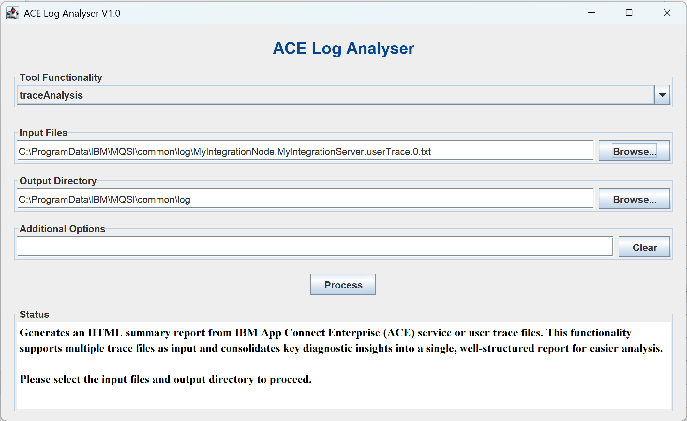

It generates a static HTML report for analysis.

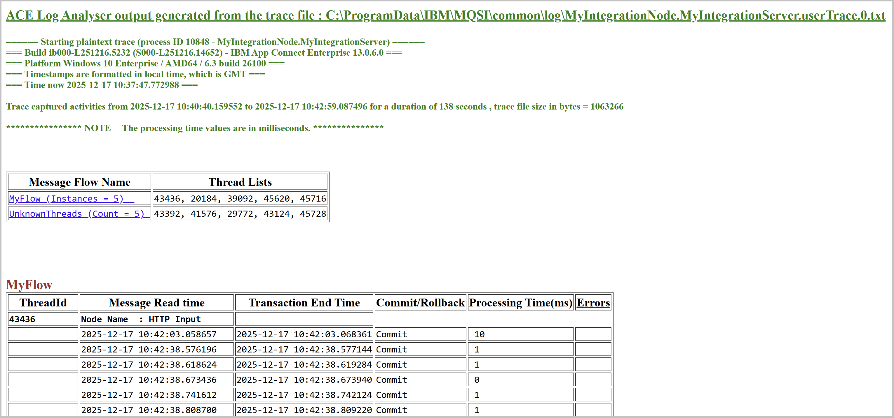

Impact when coming from v12:
Trace and log interpretation can now be consolidated into a single reporting tool instead of manually inspecting 
individual files.

### Runtime Enhancements

#### IPv6

The HTTPConnector supports IPv6, but IPv4 remains the default

```yaml
HTTPConnector:
    #ListenerPort: 0              # Set non-zero to set a specific port, defaults to 7800
    #ListenerAddress: '0.0.0.0'      # Set the IP address for the listener to listen on all IPv4 addresses (Default)
    #ListenerAddress: '::'           # Set the IP address for the listener to listen on all IPv6 and all IPv4 addresses
    #ListenerAddress: 'ipv6:::'      # Set the IP address for the listener to listen on all IPv6 and all IPv4 addresses
    #ListenerAddress: '127.0.0.1'    # Set the IP address for the listener to listen on to the localhost IPv4 address
    #ListenerAddress: '::1'          # Set the IP address for the listener to listen on to the localhost IPv6 address
    #ListenerAddress: '2001:DB8::1'  # Set the IP address for the listener to listen on a specific IPv6 address
    #ListenerAddress: '192.168.0.1'  # Set the IP address for the listener to listen on a specific IPv4 address
```

Impact when coming from v12:
Integration servers can now be configured for IPv6 listeners where required, while retaining IPv4 as default.

#### Embedded Global Cache

The in-memory Embedded Global Cache allows data sharing between separate ACE integration servers. Servers that participate 
in replication must be explicitly nominated in server.conf.yaml.

Upsert operations are supported in JavaCompute nodes.

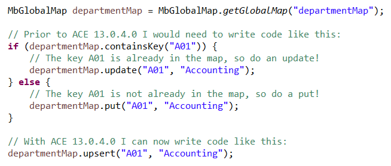

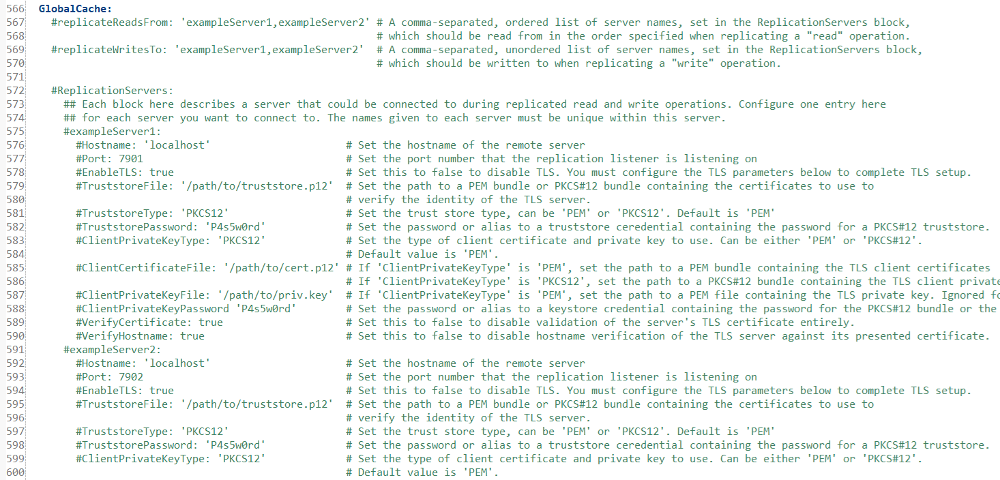

Impact when coming from v12:
Cache replication must be explicitly configured per server. The feature enables controlled in-memory data sharing without 
external infrastructure.

#### External Redis Global Cache

An external Redis-based Global Cache can be configured if cache data needs to be shared beyond ACE or if replacing an 
existing WXS grid solution. A Redis Connection policy and credential type are provided. ACE offers limited support for 
correct Redis API usage within this model.

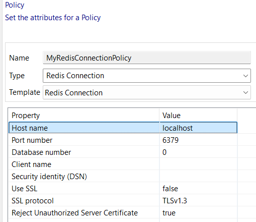

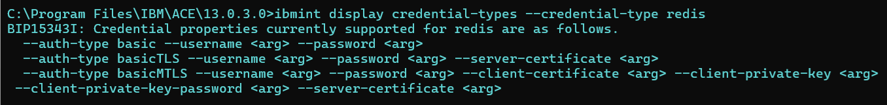

Impact when coming from v12:
You can externalize the cache layer and share it across applications, rather than limiting cache scope to ACE integration 
servers.

#### Open Telemetry

OpenTelemetry support has been extended.

Basic authentication can now be configured for OTel exports. The security identity is propagated in the header of the
OTel message and can be defined in server.conf.yaml.

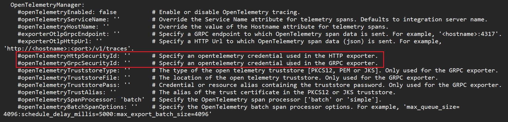

The following nodes can emit OTel traces:
- MQInput, MQOutput, MQReply, MQGet, MQPublication
- HTTPInput, HTTPReply, HTTPRequest, HTTPAsyncRequest, HTTPAsyncResponse
- RESTRequest, RESTAsyncRequest, RESTAsyncResponse
- SOAPInput, SOAPReply, SOAPRequest, SOAPAsyncRequest, SOAPAsyncResponse
- CallableInput, CallableReply, CallableFlowInvoke, CallableFlowAsyncInvoke, CallableFlowAsyncResponse
- KafkaConsumer, KafkaRead, KafkaProducer

Impact when coming from v12:
Tracing integration is more complete and better aligned with external collectors. Activity Log entries now contain span 
metadata, improving correlation during troubleshooting.

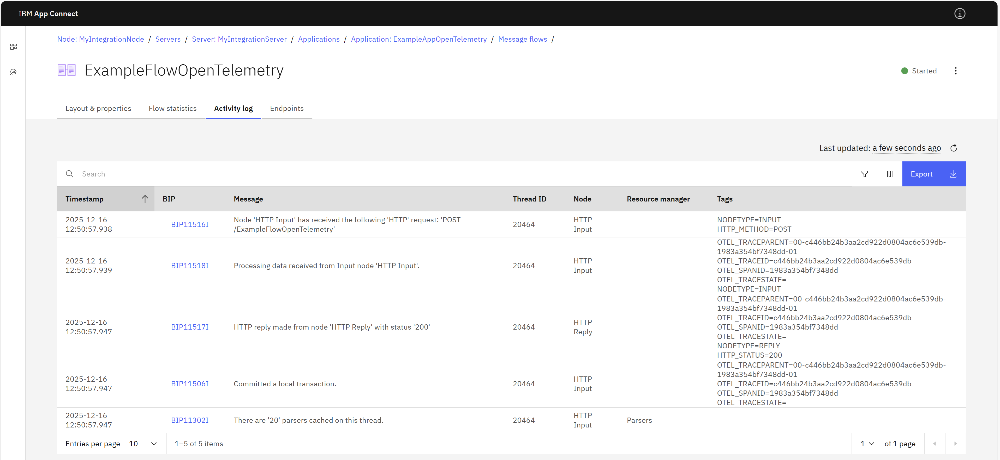

### Java

IBM Semeru Java 17 is now the default for both the Toolkit and the ACE runtime.

Java 1.8 is still shipped and can be selected if required. Earlier 13.x releases had partial support under Java 17, but 
support has expanded with subsequent modification packs.

Current restrictions under Java 17:

- Nodes only enabled under Java 17: 
  - CDC Node
- Nodes not supported under Java 17:
  - CORBARequest
  - WRR
  - WXS
  - WS-Security
  - WS-ReliableMessaging
  - TFIM

Environment variable behavior has changed. TMPDIR is not observed under Java 17. Instead, use _JAVA_OPTIONS or configure 
jvmSystemProperty in the *.conf.yaml files.

Example:

```java
_JAVA_OPTIONS="-Djava.io.tmpdir=/apps/mqsi/javacache"
```

```java
ResourceManagers:
  JVM:
    jvmSystemPropertylkl:
```

Impact when coming from v12:
If you use JavaCompute nodes or custom Java integrations, validate them under Java 17 before switching the runtime. 
Node support and JVM behavior differ from Java 8.

Also definitely check out the more in dept report from Ben: [A Deep-Dive on ACE 13 and its use of Java 17](https://community.ibm.com/community/user/blogs/ben-thompson1/2026/02/12/ace-java17)

### Credentials

ACE continues the shift toward vault-based credential management, while still supporting `mqsisetdbparms`.

One of the more relevant additions is support for dynamic credentials. Dynamic credentials can be updated without 
restarting the integration server. Most connector types now support dynamic behavior.

| Connector                     | Connector                   | Connector                     | Connector                    |
|-------------------------------|-----------------------------|-------------------------------|------------------------------|
| amazoncloudwatch (dynamic)    | amazondynamodb (dynamic)    | amazonec2 (dynamic)           | amazoneventbridge (dynamic)  |
| amazonkinesis (dynamic)       | amazonlambda (dynamic)      | amazonrds (dynamic)           | amazonredshift (dynamic)     |
| amazons3 (dynamic)            | amazonses (dynamic)         | amazonsns (dynamic)           | amazonsqs (dynamic)          |
| anaplan (dynamic)             | apachepulsar (dynamic)      | apptiotargetprocess (dynamic) | asana (dynamic)              |
| astradb (dynamic)             | azuread (dynamic)           | azureblobstorage (dynamic)    | azurecosmosdb (dynamic)      |
| azureeventhub (dynamic)       | azureservicebus (dynamic)   | bamboohr (dynamic)            | box (dynamic)                |
| businessmap (dynamic)         | calendly (dynamic)          | cd (static)                   | cdc (dynamic)                |
| cics (static)                 | clicksend (dynamic)         | cloudantdb (dynamic)          | cmis (dynamic)               |
| confluence (dynamic)          | couchbase (dynamic)         | coupa (dynamic)               | crystalball (dynamic)        |
| databricks (dynamic)          | db2 (dynamic)               | docusign (dynamic)            | dropbox (dynamic)            |
| eis (dynamic)                 | elk (static)                | email (static)                | eventbrite (dynamic)         |
| expensify (dynamic)           | factorialhr (dynamic)       | filenet (dynamic)             | front (dynamic)              |
| ftp (dynamic)                 | github (dynamic)            | gitlab (dynamic)              | gmail (dynamic)              |
| googleanalytics (dynamic)     | googlebigquery (dynamic)    | googlecalendar (dynamic)      | googlechat (dynamic)         |
| googlecloudstorage (dynamic)  | googlecontacts (dynamic)    | googledrive (dynamic)         | googlegemini (dynamic)       |
| googlegroups (dynamic)        | googlepubsub (dynamic)      | googlesheet (dynamic)         | googletasks (dynamic)        |
| googletranslate (dynamic)     | greenhouse (dynamic)        | http (dynamic)                | httpproxy (static)           |
| hubspotcrm (dynamic)          | hubspotmarketing (dynamic)  | hunter (dynamic)              | ibmaspera (dynamic)          |
| ibmcoss3 (dynamic)            | ibmewm (dynamic)            | ibmopenpages (dynamic)        | ibmsterlingiv (dynamic)      |
| ibmtwc (dynamic)              | ibmwatsonxai (dynamic)      | ift (dynamic)                 | ims (static)                 |
| infobip (dynamic)             | insightly (dynamic)         | jdbc (static)                 | jenkins (dynamic)            |
| jira (dynamic)                | jms (static)                | jndi (static)                 | kafka (static)               |
| kerberos (static)             | keystore (static)           | keystorekey (static)          | kronos (dynamic)             |
| ldap (dynamic)                | local (dynamic)             | loopback (static)             | magento (dynamic)            |
| mailchimp (dynamic)           | marketo (dynamic)           | maximo (dynamic)              | mcp (dynamic)                |
| milvus (dynamic)              | mondaydotcom (dynamic)      | mq (dynamic)                  | mqtt (static)                |
| msad (dynamic)                | msdynamicscrmrest (dynamic) | msdynamicsfando (dynamic)     | msexcel (dynamic)            |
| msexchange (dynamic)          | msonedrive (dynamic)        | msonenote (dynamic)           | mspowerbi (dynamic)          |
| mssharepoint (dynamic)        | mssql (dynamic)             | msteams (dynamic)             | mstodo (dynamic)             |
| mysql (dynamic)               | odbc (dynamic)              | odm (static)                  | opentelemetry (dynamic)      |
| oracle (dynamic)              | oracleebs (dynamic)         | oraclehcm (dynamic)           | pineconedb (dynamic)         |
| planninganalytics (dynamic)   | postgres (dynamic)          | redis (dynamic)               | rest (dynamic)               |
| salesforce (dynamic)          | salesforceae (dynamic)      | salesforcemc (dynamic)        | sapariba (dynamic)           |
| sapodata (dynamic)            | sapsuccessfactors (dynamic) | schemaregistry (static)       | servicenow (dynamic)         |
| sfcommerceclouddata (dynamic) | sftp (dynamic)              | shopify (dynamic)             | slack (dynamic)              |
| smtp (dynamic)                | snowflake (dynamic)         | soap (dynamic)                | splunk (dynamic)             |
| square (dynamic)              | surveymonkey (dynamic)      | toggltrack (dynamic)          | trello (dynamic)             |
| truststore (static)           | truststorekey (static)      | twilio (dynamic)              | userdefined (dynamic)        |
| vespa (dynamic)               | watsondiscovery (dynamic)   | wordpress (dynamic)           | workday (dynamic)            |
| wrike (dynamic)               | wsrr (static)               | wufoo (dynamic)               | wxs (static)                 |
| yammer (dynamic)              | yapily (dynamic)            | zendeskservice (dynamic)      | zohobooks (dynamic)          |
| zohocrm (dynamic)             | zohoinventory (dynamic)     | zohorecruit (dynamic)         | zosconnect (dynamic)         |

Impact when coming from v12:
Credential updates for supported connectors no longer require server restarts, reducing operational disruption during 
secret rotation or environment changes.

### Business Transaction Monitoring

Business Transaction Monitoring now supports Microsoft SQL Server and PostgreSQL, in addition to the previously supported 
DB2 and Oracle databases.

ACE connects to these databases using ODBC:

- On Windows, the MS SQL Server ODBC driver is provided by the operating system.
- On other ACE platforms, a DataDirect ODBC driver is provided for MS SQL Server.
- On Windows and Linux, a DataDirect ODBC driver is provided for PostgreSQL.

Impact when coming from v12:
BTM storage is no longer limited to DB2 or Oracle, allowing alignment with existing SQL Server or PostgreSQL environments.

### Database

#### PostgreSQL

Since 13.0.2.0, PostgreSQL support has been extended to include stored procedures that return dynamic result sets. When 
calling such procedures from ESQL, a dummy cursor value must be supplied in the CALL statement for each expected result 
set.

Impact when coming from v12:
PostgreSQL stored procedures returning dynamic result sets are now supported natively, but require adjusted ESQL syntax.

### AI

Watsonx Code Assistant chat is embedded in the ACE Toolkit. An additional subscription is required to use this feature.

It supports:
- Asking general product or development questions
- Explaining existing ESQL or Java code
- Generating instance data for a given schema
- Generating a schema from sample instance data
- Generating Java snippets from natural language
- Generating ESQL snippets from natural language
- Generating unit tests

This feature operates inside the Toolkit and is intended to assist development tasks rather than modify runtime behavior.

Impact when coming from v12:
AI-assisted development is now integrated directly into the IDE, reducing context switching to external tools.

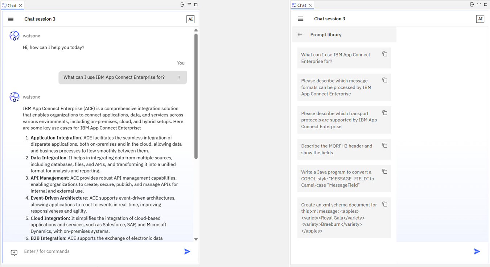


### ACE Agent Preview
Recent ACE releases include an Agent Preview feature in the App Connect Dashboard. This adds a chat-style interface that 
lets you query your App Connect environment using natural language.

#### What it does

The agent can query information about your App Connect environment

Typical examples include:

- Listing integration runtimes and their versions
- Showing deployed integrations and dependencies
- Highlighting resource usage or topology information
- Surfacing documentation or troubleshooting guidance

The responses are generated using large language models hosted through watsonx.ai

#### When you’ll see it

The feature is available when running ACE in **container environments** with the App Connect Dashboard.

When enabled, a chat button appears in the Dashboard UI where you can interact with the agent.

Since this feature is currently a **preview**, it’s primarily intended for exploration rather than operational automation.

## Migration

Migration considerations will be covered separately.

## Closing

ACE 13 introduces structural changes across development, runtime, and operations. If you are coming from v12, review 
the Java compatibility, credential strategy, observability configuration, and connector usage carefully.

# References

- [IBM App Connect Enterprise_13.0.x - Product lifecycle](https://www.ibm.com/support/pages/ibm-app-connect-enterprise130x)
- [New function added in IBM App Connect Enterprise 13.0 modification packs](https://www.ibm.com/docs/en/app-connect/13.0.x?topic=wniv1-new-function-added-in-app-connect-enterprise-130-modification-packs)
- [Explore the new features in App Connect Enterprise 13.0.1.0](https://community.ibm.com/community/user/blogs/ben-thompson1/2024/09/27/ace-13-0-1-0)
- [Explore the new features in App Connect Enterprise 13.0.2.0](https://community.ibm.com/community/user/blogs/ben-thompson1/2024/12/06/ace-13-0-2-0)
- [Explore the new features in App Connect Enterprise 13.0.3.0](https://community.ibm.com/community/user/blogs/ben-thompson1/2025/03/30/ace-13-0-3-0)
- [Explore the new features in App Connect Enterprise 13.0.4.0](https://community.ibm.com/community/user/blogs/ben-thompson1/2025/06/18/ace-13-0-4-0)
- [Explore the new features in App Connect Enterprise 13.0.5.0](https://community.ibm.com/community/user/blogs/ben-thompson1/2025/09/25/ace-13-0-5-0)
- [Explore the new features in App Connect Enterprise 13.0.6.0](https://community.ibm.com/community/user/blogs/ben-thompson1/2025/12/11/ace-13-0-6-0)
- [Improved Observability: Writing OpenTelemetry Metadata to the Activity Log](https://community.ibm.com/community/user/blogs/shalini-r/2025/11/23/writing-otelmetadata-to-activitylog)
- [A Deep-Dive on ACE 13 and its use of Java 17](https://community.ibm.com/community/user/blogs/ben-thompson1/2026/02/12/ace-java17)
- [Configuring Embedded Global Cache for App Connect Enterprise running in containers](https://community.ibm.com/community/user/blogs/amar-shah1/2025/06/08/configuring-embedded-global-cache)
- [IBM App Connect Enterprise Agent Preview](https://www.ibm.com/docs/en/app-connect/13.0.x?topic=app-connect-enterprise-agent-preview)
