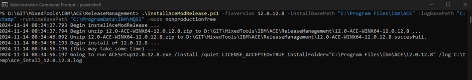
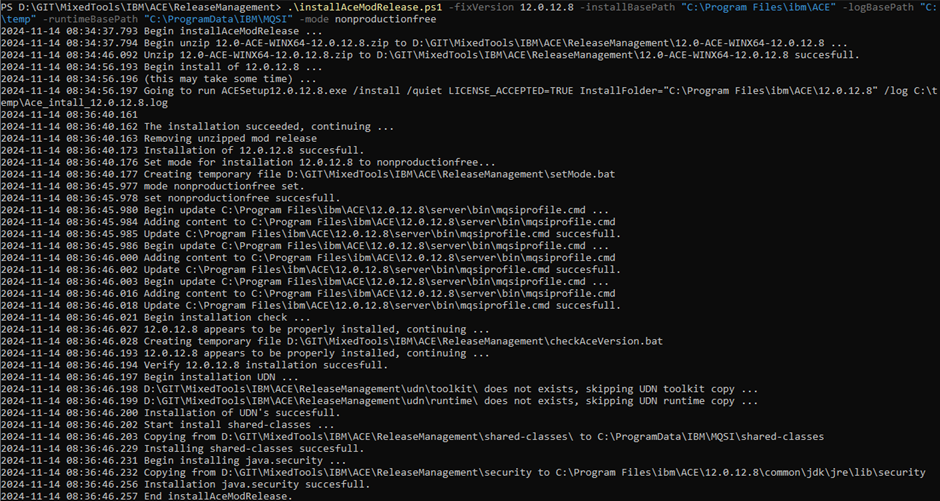
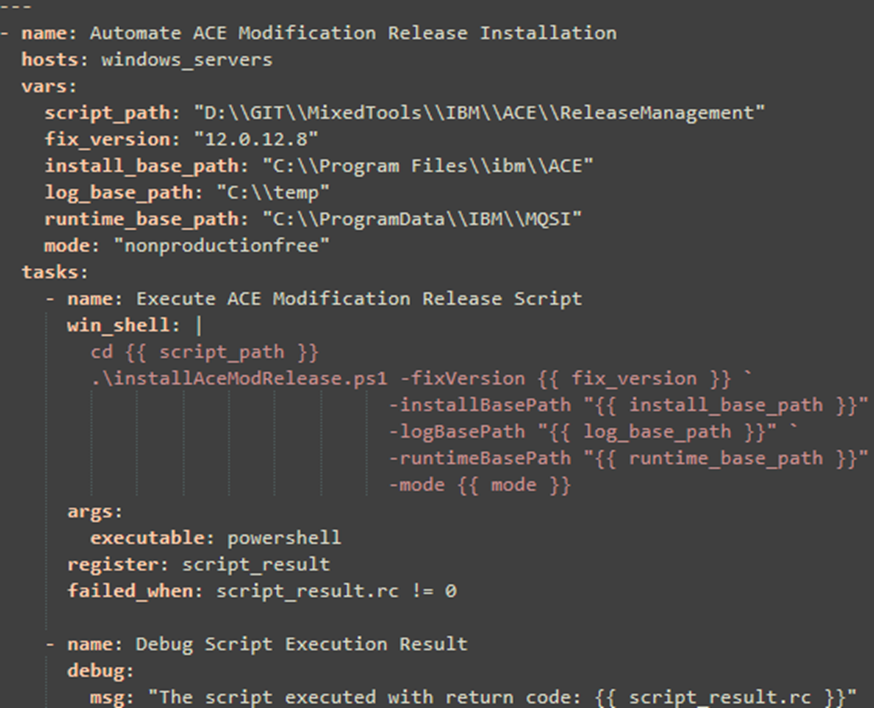
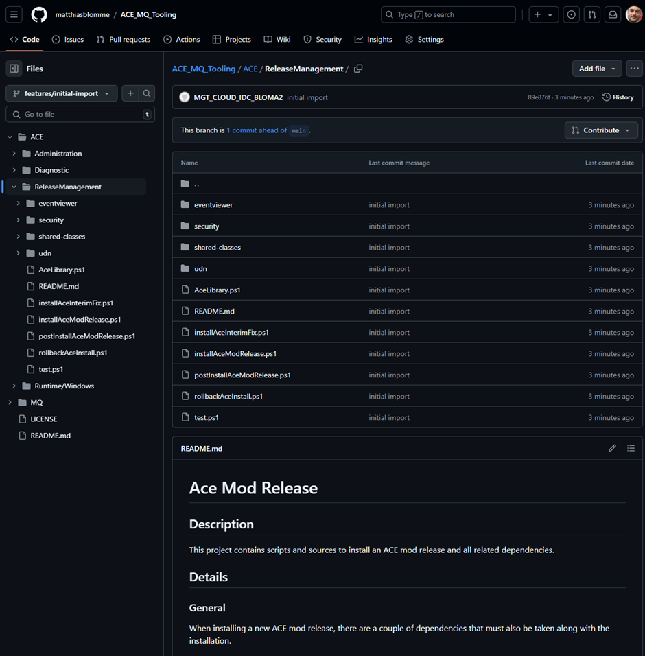

# Automating and Standardizing IBM ACE Installation with PowerShell

## Tackling the Repetition

If you've worked with IBM App Connect Enterprise (ACE) for any length of time, you’re probably familiar with the repetitive nature of installations. Each setup involves the same predictable steps: unpacking the release files, configuring directories, updating scripts, adjusting ODBC entries, setting up the runtime environment, and verifying that everything runs smoothly. While these steps might seem routine, the manual process is inherently prone to human error. A missed step, such as skipping a configuration file or mistyping a path, can cause inconsistencies that lead to operational issues - problems that sometimes take a long time to diagnose and resolve.

The challenges only grow when scaling across multiple servers or environments. Each installation requires precision, and minor variations between setups can result in significant discrepancies down the line. On-premises deployments, where containerization or cloud-based automation might not be feasible, highlight these difficulties even further. Without native automation for ACE installations on Windows, administrators are left with a repetitive, time-intensive process that leaves little room for error.

To address these challenges, I developed a PowerShell library to streamline the installation workflow. The library automates each step, from unpacking files to post-installation verification, ensuring consistency and reducing the risk of manual mistakes. Designed with on-premises environments in mind, it brings reliability and efficiency to ACE installations, whether for a single server or an entire infrastructure.


## The PowerShell Library: Streamlining the Process

The PowerShell library covers the critical steps of an ACE installation, reducing manual intervention and ensuring each setup is consistent. Here’s what the library handles:

- Extracting the Installation Package: Automates unpacking, saving time and effort.
- Installation: Completes the installation in a specified directory with minimal input.
- Verification: Confirms the installation is successful and functional.
- Updates to Scripts and Profiles: Configures runtime scripts, user profiles, and environment variables.
- Updating ODBC Definitions: Ensures drivers are correctly configured for each ACE version.
- Switching Runtimes: Handles starting and stopping ACE services to reflect the new setup.

For example, the script installAceModRelease.ps1 simplifies installing a new mod release by automatically unpacking, installing and configuring the new environment with just a few commands.



This library is especially useful in environments where ACE setups need to be updated or installed across multiple servers. Consider a development team working with several test environments, each requiring the latest modification release. Manually updating each server could take hours and introduce inconsistencies, but with the library, the process is standardized and takes only minutes.

The library is also valuable in production environments, where reliability is paramount. Its built-in verification mechanisms ensure installations are error-free, reducing the risk of runtime issues caused by misconfigurations or missing dependencies. Additionally, the automation ensures uniform setups across environments—whether they’re for testing, staging, or production—minimizing variability and making deployments more predictable.

Each step is designed to minimize errors while speeding up the setup.


## Verifying the Setup

Automation isn’t just about completing the task—it’s about doing it right. The library includes built-in verification to ensure installations are fully operational:

- Version Checks: Verifies the correct ACE version is installed.
- Health Tests: Confirms HTTP/HTTPS listeners are operational by running test endpoints.
- Environment Validation: Uses commands like mqsiservice -v to ensure the runtime is functioning as expected.

These checks add an extra layer of reliability, giving you confidence that your ACE setup is ready to go.


## Rolling Back Made Simple

One of the library’s standout features is its ability to roll back to a previous ACE environment effortlessly. Reverting an ACE environment is as straightforward as stopping the current runtime and starting the old one, making the rollback process both quick and reliable. This ensures that if a modification release causes unexpected issues, you can swiftly return to a stable configuration with minimal downtime.

You might wonder, why not simply perform this manually from the command prompt? The answer lies in consistency: every manual action introduces the potential for error and should be avoided wherever possible. Simple automation scripts like this one shine when integrated with tools like Ansible or Rundeck, making rollbacks not only error-free but also easily repeatable in larger environments.


## Why Automate ACE Installations?

Manually installing ACE might work for a single machine, but as your environment scales, automation becomes essential. Beyond saving time, automation ensures that every server – regardless of its designation (testing, staging, production, …) - follows the same consistent process, eliminating variability and reducing the risk of errors creeping into critical environments.

Automation also brings scalability. When managing dozens or even hundreds of servers, repeating manual steps quickly becomes unmanageable. With a reliable script, you can deploy updates across all environments in parallel, ensuring consistency without overloading your team.

And let’s be honest—manual installations are boring. I don’t enjoy spending hours repeating the same steps over and over, and I doubt anyone else does. By automating repetitive tasks, we free ourselves to focus on more interesting, value-adding work (or, at the very least, less tedious tasks).


## Example Workflow: Using installAceModRelease.ps1

To see the library in action, here’s a walkthrough of the installAceModRelease.ps1 script:

1. Define Your Inputs: Provide the path to the modification release package and the target installation directory.
2. Run the Script: The script handles extraction, installation, and runtime updates.
3. Verify the Setup: Built-in checks ensure the installation is complete and functional.

Example command:

```powershell
# Example usage of installAceModRelease.ps1
.\installAceModRelease.ps1 -fixVersion 12.0.12.8 -installBasePath "C:\Program Files\ibm\ACE" -logBasePath "C:\temp" -runtimeBasePath "C:\ProgramData\IBM\MQSI" -mode nonproductionfree
```



This simple process saves time while ensuring consistency across installations.

## Going Beyond: Integration with Automation Tools

While the library works effectively on its own, it also opens possibilities for integration with broader automation frameworks like Ansible. For example, you could use an Ansible playbook to call these PowerShell scripts, automating ACE installations across multiple servers in parallel. By combining the PowerShell library with tools like Ansible, you can create a robust, scalable solution for managing complex on-premises environments. This hybrid approach leverages the strengths of each tool, enabling seamless deployments while maintaining centralized control.



## Open for Collaboration

This library started as a way to simplify my own workflow, but I see so much potential for it to grow with help from the community. While I’m actively working on improvements, I’d love to hear your ideas and feedback on how we can make it even better.

Here are a few areas I’m particularly excited about exploring together:
- **Expanding Features**: Adding support for advanced setups like clustered ACE environments or automating pre-installation backups.
- **Making It Easier to Use**: Creating better documentation, tutorials, or even helper scripts to make the library more accessible for everyone.

If you’ve got ideas or want to contribute, the code and documentation are up on GitHub. Whether it’s a small tweak or a big feature, your input could help take this library to the next level.



## A Look Ahead

This project started as a way to simplify my workflow, but it’s grown into something that can help others facing the same challenges. With PowerShell, we’ve taken the repetitive and made it reliable, turning a manual process into a streamlined operation.

If you’re managing ACE installations, whether for a single server or a larger environment, this library can save you time and ensure your setups are consistent. I’m excited to see how others will expand and improve it over time.

So why not give it a try? Let’s take the headache out of ACE installations—one script at a time.

---

Resources:

https://github.com/matthiasblomme/ACE_MQ_Tooling

https://www.rundeck.com/

https://www.ansible.com/

https://docs.ansible.com/ansible/latest/os_guide/windows_winrm.html

---

Written by [Matthias Blomme](https://www.linkedin.com/in/matthiasblomme/)