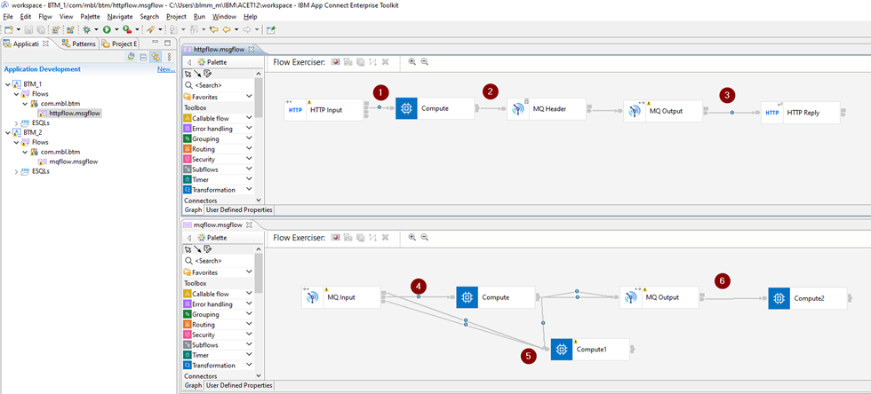
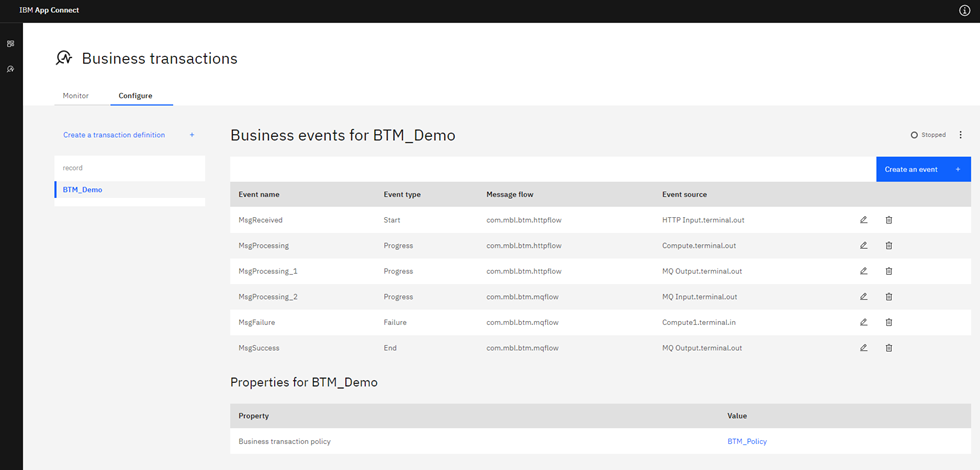

# Business Transaction Monitoring

I wanted to try the new (re-introduced in 12.0.2.0) ACE Business Transaction Monitoring to see what the added value could be for a company/team/environment that didn't have this type of monitoring in place yet.

In my search for the "how does this work" I came across 2 YouTube entries by Sanjay Nagchowdhury that were great to get me going, but they lacked some parts of the setup like the required database and security should you expose the dashboard.

The YouTube videos:

- [App Connect Enterprise 12: Business Transaction Monitoring overview](https://www.youtube.com/watch?v=Zp1SLrnNRRU)
- [App Connect Enterprise 12: Configure ACE to use Business Transaction Monitoring - detailed view](https://www.youtube.com/watch?v=SBd6E4hQfzg)

Since I went to the trouble of setting everything up, I might as well document the entire process.

# What is BTM

BTM (short for Business Transaction Monitoring) is basically using monitoring events from within message flows to track one message (or transaction) throughout your ACE environment over applications and integration servers.

Or as IBM describes it:

> Business transaction monitoring involves monitoring a message across multiple message flows, so you can track and report the lifecycle of a payload message through an end-to-end enterprise transaction.
>
> Business transaction monitoring enables you to track the outcomes of work passing through a message flow, allowing you to see which aspects of your business transaction are working correctly and which aspects are failing.

# What you need

To enable BTM, you basically need 4 things:

* Monitoring events
* Some place to store them
* A definition of what a transaction is
* Traffic

The actual setup is slightly more extensive, but it boils down to those 4 main parts.

# Monitoring events

It all starts with a message flow (or message flows). I have created 2 applications, each containing a single flow. You can find these attached as a project interchange.



`Application BTM\_1` containing message flow httpflow that takes an http json message, puts it on a queue (BTM.TEST.Q01) and sends the message back in an http reply.

`Application BTM\_2` containing message flow mqflow that takes the mq message, routes it out any of 3 terminals of the compute and put it on a second queue (BTM.TEST.Q02). One of the Compute output terminals works as a failure scenario.

There are also 6 monitoring events configured:

* Output terminal of the HTTP Input, the start event
* Output terminal of the Compute node, a progress event
* Output terminal of the MQ Output node, a progress event
* Output terminal of the MQ Input node, a progress event
* Input terminal of the Comput1 node, a failure event
* Output terminal of the MQ Output node, the end event

If you are not familiar with BTM, the event types mentioned above will not ring a bell, but this will become clear.

Each of these 6 monitoring events log the message body and have a "Global transaction correlator" defined. The first events of each messageflow need to have the Global transaction correlator explicitly defined (as shown in the screenshot below) and the rest of the events in the same flow can be configured to automatically select the correct correlator (this will automatically select the same correlator as the most recent event).

This correlator field is important and will be used by ACE to correlate (what else) your messages. For ACE to properly correlate the messages into a transaction, the correlator field must be unique inside the transaction definition. It’s best to make the correlator something meaningful. It’s the only value you can search for in the BTM dashboard so better make it a good one.


And finally let’s configure ace to send out events.

In the `node.conf.yaml`, enable OperationEvents, BusinessEvents and Monitoring publicationOn. Choose the desired eventFormat (I have gone with the new format, MonitoringEventV2).


As part of the preparation, create a new integration server that will hold the Business Transaction Definitions.

```bash
C:\Windows\System32>mqsicreateexecutiongroup V12NODE -e record

BIP1124I: Creating integration server 'record' on integration node 'V12NODE'...

BIP1117I: The integration server was created successfully.

BIP8071I: Successful command completion.
```

If you have any form of security enabled, make sure you have access to this new integration server.

I have defined monitoring events that match my demo transaction. If you are going to do this for a live production flow you need to think about what makes up your transactions.

Each transaction must have a "start" and "end" event. Most likely there will also be one or more failure paths in the flow that generate failure events.

To track a message, you’ll also need progress events that are emitted from certain points in the flows. These progress events show where your current message is inside a transaction.

This setup will be different for each use case and needs to be conclusive. Else you might end up with messages in an "inconsistent" state.


Now that the events are configured, let’s make sure they can be stored somewhere.

# Some place to store them

It is important to know that BTM only supports DB/2 or Oracle databases for storage.

Setting this up might seem like a big task but it's not that difficult.

I have chosen for a DB/2 database because there is an easy-to-use docker DB/2 image available from [Docker Hub](https://hub.docker.com/r/ibmcom/db2).

If you don't have docker just follow the official instruction at [Docker install docs](https://docs.docker.com/get-docker/).

From your command prompt, download the docker image.

```bash
C:\WINDOWS\system32> docker pull ibmcom/db2
```

And start the container.

```bash
C:\WINDOWS\system32> docker run -itd --name mydb2 --privileged=true -p 50000:50000 -e LICENSE=accept -e DB2INST1_PASSWORD=password -e DBNAME=testdb -v C:\Matthias\database ibmcom/db2
```

This gives me a user with the name "db2inst1", a password "password" and an initial database with the name testdb. Feel free to change settings to suit your preference.

ACE comes equipped with scripts that create the databases and tables you need. You can find them here:

* `<install_dir>\server\ddl\db2\DataCaptureSchema_v2.sql`
* `<install_dir>\server\ddl\db2\DataCaptureSchema.sql`
* `<install_dir>\server\ddl\db2\BusinessCaptureSchema.sql`

I haven configured ace to use the MonitoringEventv2 monitoring messages, and not the WMB messages, so I will use thee DataCaptureSchema\_v2.sql. If you prefer using WMB events you need to run DataCaptureSchema.sql instead.

Login to the docker container and run the sql files.

```bash
C:\WINDOWS\system32> docker exec -ti mydb2 bash -c "su - ${DB2INSTANCE}"

[root@7d5a7ec326c4 ~]# su - db2inst1

[db2inst1@7d5a7ec326c4 ~] db2 -tvmf ./DataCaptureSchema_v2.sql

[db2inst1@7d5a7ec326c4 ~] db2 -tvmf ./BusinessCaptureSchema.sql
```

If you want to see the tables, use a tool like [dbeaver](https://dbeaver.io) and configure it as shown in the screenshot below (remember you forwarded port 50000 into the docker container).


You should see the generated tables.


Next create a couple of queues that temporarily store the monitoring messages.

* SYSTEM.BROKER.DC.RECORD
* SYSTEM.BROKER.DC.BACKOUT


Next configure the DSN ODBC interface to your DB/2 database in the windows "ODBC Data Sources" tool.

You can configure your DSN in the User DSN or System DSN tab, but the System DSN makes it available for everyone so that is the most logic choice.

Click on Add… and select the DB2 ODBC Driver.


Click finish and fill in the popup window with a name and a description and click on Add to create the database alias.


If you don’t' see the TCP/IP tab in the following window or you don’t see the ODBC driver at all, you'll need to upgrade your driver first.

>Download and install the driver from IBM [here](https://epwt-www.mybluemix.net/software/support/trial/cst/programwebsite.wss?siteId=853&h=null&tabId=#) (you will have to login)
>
>Extract the `ibm_data_server_driver_for_odbc_cli.zip` from within the downloaded driver zip and run the following commands from `<extract_dir> odbc_cli_driver\ntx64`
>
>```
>C:\Matthias\clidriver\bin\> db2cli install -setup
>```
>
>Only execute the second command after creating the `MBRECORD` dsn.

In the ODBC settings fill in the required info.


Press ok,

Select configure on the create DSN entry.


And click "connect" in the popup window to test your setup.


Next up, creating the ODBC connection for ACE. Open the console and create the ODBC connection for the MBRECORD table and test the connection using `mqsicvp`.

```
C:\Windows\System32>mqsisetdbparms V12NODE -n odbc::MBRECORD -u db2inst1 -p password
BIP8071I: Successful command completion.

C:\Windows\System32>mqsicvp -n MBRECORD -u db2inst1 -p password
BIP8270I: Connected to Datasource 'MBRECORD' as user 'db2inst1'. The datasource platform is 'DB2/LINUXX8664', version '11.05.0700'.
===========================
databaseProviderVersion      = 11.05.0700
driverVersion                = 11.05.0400
…
```

Technically your database is setup and connected now.

The final step is to configure ACE to use MBRECORD as storage. Configure the `dataSource`, `schema` (default setup has the schema equal to the username) `storeMode` and queues as shown below in the `server.conf.yaml` of the record integration server.


Don't forget to restart your node after updating the settings and then we can create some transaction definitions.

## A definition of what a transaction is

Log in to the webui with a user that has sufficient authorizations (use an admin user to be sure) and go to the Business Transaction dashboard.


Here you will see an empty dashboard.


So, let's start putting some stuff here.

Go to the "Configure" tab and "Create a transaction definition".


Fill in the requested fields and hit create.


You will now have an empty transaction definition, so it is time to finally define the events. Click on "Create an event".


Fill in the event details.


At this point it is important to know what each event means. Earlier I have defined 6 messages and specified what type of event each message was.

* Output terminal of the HTTP Input, the start event
* Output terminal of the Compute node, a progress event
* Output terminal of the MQ Output node, a progress event
* Output terminal of the MQ Input node, a progress event
* Input terminal of the Comput1 node, a failure event
* Output terminal of the MQ Output node, the end event

Now we are going to create the actual events for each of these messages.

Repeat the "Create a business event" step for each of the 6 messages until you end up with a fully defined Business transaction.



If you are happy about the setup, don't forget to enable the transaction.


Go back to the Monitor dashboard and wait for some messages to show up.


## Traffic

To test the setup, let's create some data.

My IS1 server has an http listener enabled on port 7801 and the application listens on `/btm/input`.


The application is configured to handle a json request and it expects to find 2 string field: correlation and path. You can add additional fields if you want.

A success message expects data like this:

```json
{
  "correlation": "001",
  "path": "normal"
}
```

A failure message expects data like this (any value for path except for normal or abnormal):

```json
{
  "correlation": "002",
  "path": "blablabla"
}
```

Using postman, we can post the json body to the listener.


And an error message.


This gives me 2 transactions.


And it works!

You can request transaction details by clicking on the Transaction ID you want to investigate.


You can also request details about each of the messages that are processed as part of the transaction.


You can even download the data for analysis.


## Bonus: Add some quick data using postman

When using the postman runner, it's rather easy to load multiple messages.

Create a new request with a variable for the correlation field.


Create a csv file.


Open the postman runner.

If your requests are saved in a collection, you can drag from the left to add the requests from that collection but uncheck wat you don't need.

Select your csv file on the right.


Hit Run BTM and check your transactions.


---

## References

* **DB2 docker image**
  [https://hub.docker.com/r/ibmcom/db2](https://hub.docker.com/r/ibmcom/db2)

* **YouTube videos for BTM**
  App Connect Enterprise 12: Business Transaction Monitoring overview
  App Connect Enterprise 12: Configure ACE to use Business Transaction Monitoring - detailed view

* **DBEaver**
  [https://dbeaver.io/](https://dbeaver.io/)

* **Postman**
  [https://postman.com/downloads/](https://postman.com/downloads/)

* **IBM Documentation**
  [https://www.ibm.com/docs/en/app-connect/12.0?topic=management-monitoring-business-transactions](https://www.ibm.com/docs/en/app-connect/12.0?topic=management-monitoring-business-transactions)

--- 

Written by [Matthias Blomme](https://www.linkedin.com/in/matthiasblomme/)