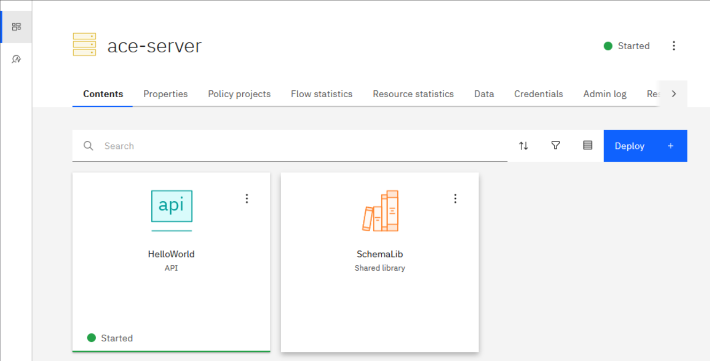

# Containerizing IBM ACE: A Blog Series - Container Startup Optimization

> Resources
> All resources used in this blog are available in my GitHub repo, linked in the resources section. Except for
> The IBM binaries, those you need to supply yourselves.

Why do ACE containers take so long to boot?

Not talking about your basic hello-world flows, but real-life integration servers. You’d expect most of the load to 
happen after boot, when traffic starts flowing. But in practice, container startup is often the most resource-intensive 
part of the whole lifecycle.

So I wanted to see how far I could push it. Not in the build pipeline, not in CI. Just at runtime. What can I offload, 
pre-bake, or reuse to make that startup hit as light as possible?

I tested three container setups:
- **Base image**: Everything happens at container start, let's call this a cold-start.
- **Prebaked image**: BAR files are deployed and optimized during the build. Startup is a warm-start.
- **Init container**: A prep container handles deploy and optimize before the runtime container performs a warm-start.

Quick defs:
- **Cold-start**: first start of a new Integration Server work directory.
- **Warm-start**: starting a server that’s been started before.

To keep it simple, I ran the first two setups in Docker. The third one needed Minikube. You could run all three on 
Kubernetes, this was just the quickest way to test.

> Disclaimer
> All tests used the ACE 13.0.4.0 image. Don’t have access? IBM provides a free developer edition as well:
> [IBM App Connect Enterprise Evaluation Edition free product download](https://www.ibm.com/resources/mrs/assets/mrs_landing_page?source=swg-wmbfd&lang=en_US)

## Standalone Integration Server

Here’s a quick sanity check you can do without containers. Just to prove warm-starts are real:
- Create a new Standalone Integration Server (SERVER-COLD)
- Deploy your BAR files
- Run ibmint optimize server
- Start and stop the server
- Copy the full SERVER-COLD directory to a new folder, say SERVER-WARM
- Start SERVER-WARM

You should see a noticeable speedup on the second start.

Now, if you're only deploying a toy flow with no real logic (what I am doing), don’t expect miracles. But once you throw 
in some complex flows and heavy schemas, the difference becomes obvious.

## Base image

This is the unoptimized baseline. You get a container with ACE installed and nothing else. Every time you run it, the 
container starts cold. Deploy, optimize, and startup all happen at runtime. It's simple, slower, and exactly what you'd 
expect when nothing is prepped in advance.

To keep this setup under control, I built a base image where the Integration Server doesn’t auto-start. That gives me a 
clean slate every time. Instead of typing out the same commands over and over, I wrapped the deploy, optimize, and start 
steps into a `start.sh` script. Full control, less repetition.

**Files included in this setup:**
- `Dockerfile`: ACE 13 base image, modified so the Integration Server doesn't auto-start
- `start.sh`: script to deploy, optimize, and start manually
- `bars/`: BAR files baked into the image (can be mounted instead if you prefer)

**Build the image**<br />

Build the container using your modified Dockerfile. This creates a clean ACE 13 base image without any startup behavior 
baked in.

<details>

  <summary>Dockerfile - Click to expand</summary>

```dockerfile
FROM registry.access.redhat.com/ubi9/ubi-minimal AS builder

# Update base image and install required tools
RUN microdnf update -y && microdnf install -y util-linux tar && microdnf clean all

# Prepare target directory for ACE
RUN mkdir -p /opt/ibm/ace-13

# Copy ACE installer archive (you must provide this under /sources/)
COPY /sources/13.0-ACE-LINUXX64-13.0.4.0.tar.gz /opt/ibm/ace13.tar.gz

# Extract ACE, excluding unused tools and components to keep the image slim
RUN tar -xvf /opt/ibm/ace13.tar.gz \
    --exclude ace-13.0.*.0/tools \
    --exclude ace-13.0.*.0/server/tools/ibm-dfdl-java.zip \
    --exclude ace-13.0.*.0/server/tools/proxyservlet.war \
    --exclude ace-13.0.*.0/server/bin/TADataCollector.sh \
    --exclude ace-13.0.*.0/server/transformationAdvisor/ta-plugin-ace.jar \
    --strip-components=1 \
    -C /opt/ibm/ace-13/ > /dev/null 2>&1

# Second stage: final runtime image
FROM registry.access.redhat.com/ubi9/ubi-minimal

# Install required packages and force tzdata reinstall for time zone support
RUN microdnf update -y \
    && microdnf install -y procps-ng findutils util-linux which tar \
    && microdnf reinstall -y tzdata \
    && microdnf clean all

# Copy ACE runtime from builder stage
COPY --from=builder /opt/ibm/ace-13 /opt/ibm/ace-13

# Accept ACE license, create aceuser, and initialize a work directory
RUN /opt/ibm/ace-13/ace make registry global accept license deferred \
    && useradd --uid 1001 --create-home --home-dir /home/aceuser --shell /bin/bash -G mqbrkrs aceuser \
    && su - aceuser -c "export LICENSE=accept && . /opt/ibm/ace-13/server/bin/mqsiprofile && mqsicreateworkdir /home/aceuser/ace-server" \
    && echo ". /opt/ibm/ace-13/server/bin/mqsiprofile" >> /home/aceuser/.bashrc

# Copy license texts, BAR files, and helper scripts into the image
COPY /licenses/ /licenses/
COPY /bars/*.bar /bars/
COPY /scripts/* /scripts/

# Set permissions for aceuser
RUN chown 1001:1001 /scripts/* \
    && chown 1001:1001 /bars/* \
    && chmod +x /scripts/*

# Switch to non-root user
USER 1001

# Expose standard ACE ports
EXPOSE 7600 7800 7843

# Default Integration Server name
ENV ACE_SERVER_NAME=ace-server

# Set working directory and entrypoint
WORKDIR "/home/aceuser/ace-server"
ENTRYPOINT ["bash"]
```

</details>

```powershell
docker build -t ace-base:13.0.4.0 -f Dockerfile .
[+] Building 2.1s (20/20) FINISHED                                                                                                              docker:desktop-linux
 => [internal] load build definition from Dockerfile                                                                                                            0.0s
 => => transferring dockerfile: 2.46kB                                                                                                                          0.0s 
 => [internal] load metadata for registry.access.redhat.com/ubi9/ubi-minimal:latest                                                                             0.4s 
...
```

**Run the container**<br />

Start the container with an interactive terminal (`-it`) and a temporary lifecycle (`--rm`). This gives you direct control, 
and the container cleans itself up when you’re done.

```powershell
docker run --name ace-base -e LICENSE=accept -p 7600:7600 -p 7800:7800 --rm -ti ace-base:13.0.4.0

MQSI 13.0.4.0
/opt/ibm/ace-13/server

[aceuser@09b8e93505ae ace-server]$ 
```

**Start the runtime**<br />

From inside the container, run the script to deploy the BAR files, optimize the setup, and launch the Integration Server.

```powershell
[aceuser@09b8e93505ae ace-server]$ /scripts/start.sh 
[2025-09-14 15:21:14] Starting deployments
[2025-09-14 15:21:14] Deploying /bars/HelloWorld.bar
BIP15233I: Generating BAR file '/tmp/ibmint_deploy_generated_1757863275536331.bar' for deploy. 
Generating runtime objects: '/var/mqsi/mqsibar/temp-7486f378-917e-11f0-9c80-ac11000e0000' ...
...
```

**Check the logs**<br />

The script prints a few progress messages, but the full IntegrationServer output is redirected to /tmp/is.log. Open the 
file and compare the first and last entries to see how long startup took.

```powershell
[aceuser@09b8e93505ae ace-server]$ cat /tmp/is.log
2025-09-14 15:21:17.609262: Components specification is being loaded from the file '/home/aceuser/ace-server/server.components.yaml'. 
2025-09-14 15:21:17.637260: BIP1990I: Integration server 'ace-server' starting initialization; version '13.0.4.0' (64-bit) 
2025-09-14 15:21:17.666582: BIP9905I: Initializing resource managers. 
2025-09-14 15:21:17.666644: BIP9985I: Using Java version 17. The following integration server components are unavailable with this Java version: FlowSecurityProvider
...
```

**Stop and clean up**<br />

Exit the container shell when you are done. Because you started it with `--rm`, Docker removes the container automatically. 
This also frees up the ports for the next test.

```powershell
[aceuser@09b8e93505ae ace-server]$ exit
exit
>
```

The point of this setup isn’t speed. It’s about having a baseline. By running everything cold, you can measure the real 
cost of startup and use it as the reference when testing more optimized approaches.

## Prebaked image

With this setup I went further. Not just deploying BAR files at build time, but fully optimizing and starting the 
Integration Server once so that state is baked directly into the image. The goal was simple: create a container that 
comes up warm every time. No partial prep and no halfway measures. _Everything_ is prebaked.

To make this work, I used a multi-stage Docker build that calls a warmup.sh script during build. That script deploys the
BAR files, runs `ibmint optimize server`, and starts the Integration Server once so the warmed state is captured in the 
image.

**Files included in this setup:**
- `Dockerfile`: multi-stage build that deploys, optimizes, and starts during build
- `warmup.sh`: script that handles the deploy, optimize, and start steps
- `bars/*`: BAR files baked into the image at build time


**Build the image**<br />

Run the multi-stage build to create the prebaked container. This step deploys the BAR files, runs ibmint optimize server, 
and starts the Integration Server once during the build process.

<details>

  <summary>Dockerfile - Click to expand</summary>

```dockerfile
FROM registry.access.redhat.com/ubi9/ubi-minimal AS builder

# Accept license in build context
ENV LICENSE=accept

# Work as root
USER root

# Update base image and install required tools for extraction and warmup
RUN microdnf update -y && microdnf install -y util-linux tar unzip findutils binutils xz

# Create target directory for ACE installation
RUN mkdir -p /opt/ibm/ace-13

# Copy ACE installer archive (supplied in /sources/)
COPY /sources/13.0-ACE-LINUXX64-13.0.4.0.tar.gz /opt/ibm/ace13.tar.gz

# Extract ACE, excluding unused tools to reduce image size
RUN tar -xvf /opt/ibm/ace13.tar.gz \
    --exclude ace-13.0.*.0/tools \
    --exclude ace-13.0.*.0/server/tools/ibm-dfdl-java.zip \
    --exclude ace-13.0.*.0/server/tools/proxyservlet.war \
    --exclude ace-13.0.*.0/server/bin/TADataCollector.sh \
    --exclude ace-13.0.*.0/server/transformationAdvisor/ta-plugin-ace.jar \
    --strip-components=1 \
    -C /opt/ibm/ace-13/ > /dev/null 2>&1

# Accept license, create aceuser, initialize work directory
RUN /opt/ibm/ace-13/ace make registry global accept license deferred \
    && useradd --uid 1001 --create-home --home-dir /home/aceuser --shell /bin/bash -G mqbrkrs aceuser \
    && su - aceuser -c "export LICENSE=accept && . /opt/ibm/ace-13/server/bin/mqsiprofile && mqsicreateworkdir /home/aceuser/ace-server" \
    && echo ". /opt/ibm/ace-13/server/bin/mqsiprofile" >> /home/aceuser/.bashrc

# Copy BAR files and helper scripts (warmup.sh will be run during build)
COPY bars/*.bar /bars/
COPY scripts/* /scripts/
# COPY config/overrides.properties /config/overrides.properties  # optional overrides

# Use bash login shell
SHELL ["/bin/bash","-lc"]

# Debug: show ACE installation contents
RUN ls -la /opt/ibm/ace-13/

# Set ownership and make warmup.sh executable
RUN chown 1001:1001 /scripts/* \
 && chmod +x /scripts/warmup.sh \
 && sed -i 's/\r$//' /scripts/warmup.sh   # guard against Windows CRLF

# Switch to aceuser
USER 1001
SHELL ["/bin/bash","-lc"]

# Run warmup script during build to generate pre-warmed work directory
RUN /scripts/warmup.sh


# --- Final stage: minimal runtime image with pre-warmed work dir
FROM registry.access.redhat.com/ubi9/ubi-minimal

# Install required runtime tools and Java 11
RUN microdnf update -y \
    && microdnf install -y procps-ng findutils util-linux git tar java-11-openjdk-devel nano procps jq zip unzip \
    && microdnf clean -y all

# Reinstall tzdata to ensure time zone files are present
RUN microdnf reinstall tzdata -y

# Copy ACE runtime and pre-warmed aceuser home from builder
COPY --from=builder /opt/ibm/ace-13 /opt/ibm/ace-13
COPY --from=builder /home/aceuser/ /home/aceuser/
COPY /licenses/ /licenses/

# Clean up old log files from pre-warm step
RUN rm -rf /home/aceuser/ace-server/log/*.*

# Ensure aceuser and group exist
RUN groupadd -g 1001 mqbrkrs || true \
 && useradd --uid 1001 --create-home --home-dir /home/aceuser --shell /bin/bash -g 1001 -G mqbrkrs aceuser \
 && chown -R 1001:1001 /home/aceuser

# Expose ACE ports
EXPOSE 7600 7800 7843

# Run as non-root aceuser
USER 1001

# Default server name and license acceptance
ENV ACE_SERVER_NAME=ace-server
ENV LICENSE=accept

# Work directory
WORKDIR "/home/aceuser/ace-server"

# Entrypoint: start IntegrationServer with warmed state
# - Sources mqsiprofile
# - Starts IntegrationServer with the prepared work dir
# - Redirects output to /tmp/is.log
ENTRYPOINT ["bash", "-c", ". /opt/ibm/ace-13/server/bin/mqsiprofile && IntegrationServer --name ${ACE_SERVER_NAME} -w /home/aceuser/ace-server > /tmp/is.log 2>&1"]
```

</details>

```powershell
docker build -t ace-prebaked:13.0.4.0 -f Dockerfile .

[+] Building 9.6s (18/26)                                                                                                                     docker:desktop-linux
 => [internal] load build context                                                                                                                             0.0s
 => => transferring context: 322B        
...
```

**Run the container**<br />

Start the prebaked image with an interactive terminal (`-it`) and a temporary lifecycle (`--rm`).

```powershell
docker run --name ace-prebaked -e LICENSE=accept -p 7600:7600 -p 7800:7800 --rm -ti ace-prebaked:13.0.4.0

BIP2112E: IBM App Connect Enterprise internal error: diagnostic information ''No such file or directory'', '2'. 
```

You might see a BIP2112E message right after startup. That line looks like an error, but it can be ignored, the server 
still runs fine.

**Check the logs**<br />

The Integration Server runs directly as the main process. Its output is redirected to `/tmp/is.log`, so you cannot see it 
in the opened terminal. Do not try to stop the process, because that will also terminate the session and the container. 
Instead, use a second terminal to inspect the log file.

```powershell
docker exec -it ace-prebaked bash   
BIP2112E: IBM App Connect Enterprise internal error: diagnostic information ''No such file or directory'', '2'. 

MQSI 13.0.4.0
/opt/ibm/ace-13/server

[aceuser@297ebca62f93 ace-server]$ cat /tmp/is.log 
2025-09-14 15:31:26.050136: Components specification is being loaded from the file '/home/aceuser/ace-server/server.components.yaml'. 
2025-09-14 15:31:26.098840: BIP1990I: Integration server 'ace-server' starting initialization; version '13.0.4.0' (64-bit) 
2025-09-14 15:31:26.129978: BIP9905I: Initializing resource managers. 
...
2025-09-14 15:31:28.678362: BIP1991I: Integration server has finished initialization. 
```

As you can see, ace started properly.

**Stop and clean up**<br />

When you are done, exit the terminal. Because the container was started with `--rm`, Docker removes it automatically. This
also frees up the ports for the next test.

```powershell
[aceuser@09b8e93505ae ace-server]$ exit
exit
> 
```

The point of this setup is speed. By baking in deployment, optimization, and an initial start, the runtime container skips 
most of the heavy lifting. It is less flexible than the base image, but it shows how much startup time you can cut when 
everything is prebaked.

## Init container

Could you optimize your container start without touching your build process? Turns out, it’s possible. By using an init 
container, a short-lived container that exits once it finishes. You can push the heavy tasks like deploy, optimize, and 
start into that environment. The main container then launches from the warmed runtime.

I wanted to see if this would give me the best of both worlds: faster startup without baking everything into the image, 
and with more flexibility left in the pipeline.

To set this up, I built an image with a warmup.sh script and used a Kubernetes deployment that runs both the init 
container and the runtime container.

**Files included in this setup:**
- `Dockerfile`: builds the image ace-init:13.0.4.0
- `warmup.sh`: script that deploys, optimizes, starts, and then _stops_ the Integration Server
- `deployment-init.yaml`: Kubernetes Deployment and Service definition for running the init and runtime containers together

**Build the image**<br />

Start with the Dockerfile that creates the ace-init:13.0.4.0 image. This image includes the warmup.sh script, which runs 
the deploy, optimize, start, and stop sequence when used as an init container.

```powershell
docker build -t ace-init:13.0.4.0 -f Dockerfile .     
[+] Building 120.4s (19/19) FINISHED                                                                                                            docker:desktop-linux
 => [internal] load build definition from Dockerfile                                                                                                            0.0s
 => => transferring dockerfile: 2.45kB                                                                                                                          0.0s 
 => [internal] load metadata for registry.access.redhat.com/ubi9/ubi-minimal:latest                                                                             0.4s
...
```

**Load the image into Minikube**<br />

Make the image available inside the Minikube registry so the cluster can pull it.

<details>

  <summary>Dockerfile - Click to expand</summary>

```dockerfile
# First stage: build ACE runtime
FROM registry.access.redhat.com/ubi9/ubi-minimal AS builder

# Update base image and install required tools for extraction
RUN microdnf update -y && microdnf install -y procps-ng util-linux tar && microdnf clean all

# Prepare target directory for ACE
RUN mkdir -p /opt/ibm/ace-13

# Copy ACE installer archive (you must provide this under /sources/)
COPY /sources/13.0-ACE-LINUXX64-13.0.4.0.tar.gz /opt/ibm/ace13.tar.gz

# Extract ACE, excluding unused tools and components to keep the image slim
RUN tar -xvf /opt/ibm/ace13.tar.gz \
    --exclude ace-13.0.*.0/tools \
    --exclude ace-13.0.*.0/server/tools/ibm-dfdl-java.zip \
    --exclude ace-13.0.*.0/server/tools/proxyservlet.war \
    --exclude ace-13.0.*.0/server/bin/TADataCollector.sh \
    --exclude ace-13.0.*.0/server/transformationAdvisor/ta-plugin-ace.jar \
    --strip-components=1 \
    -C /opt/ibm/ace-13/ > /dev/null 2>&1

# Second stage: final runtime image
FROM registry.access.redhat.com/ubi9/ubi-minimal

# Install required packages and force tzdata reinstall for timezone data
RUN microdnf update -y \
    && microdnf install -y procps-ng findutils util-linux which tar \
    && microdnf reinstall -y tzdata \
    && microdnf clean all

# Copy ACE runtime from builder stage
COPY --from=builder /opt/ibm/ace-13 /opt/ibm/ace-13

# Accept ACE license, create aceuser, and initialize a work directory
RUN /opt/ibm/ace-13/ace make registry global accept license deferred \
    && useradd --uid 1001 --create-home --home-dir /home/aceuser --shell /bin/bash -G mqbrkrs aceuser \
    && su - aceuser -c "export LICENSE=accept && . /opt/ibm/ace-13/server/bin/mqsiprofile && mqsicreateworkdir /home/aceuser/ace-server" \
    && echo ". /opt/ibm/ace-13/server/bin/mqsiprofile" >> /home/aceuser/.bashrc

# Copy license texts, BAR files, and helper scripts into the image
COPY /licenses/ /licenses/
COPY /bars/*.bar /bars/
COPY /scripts/* /scripts/

# Set ownership and permissions for aceuser
RUN chown 1001:1001 /scripts/* \
    && chown 1001:1001 /bars/* \
    && chmod +x /scripts/*

# Run as non-root user
USER 1001

# Expose standard ACE ports
EXPOSE 7600 7800 7843

# Default Integration Server name
ENV ACE_SERVER_NAME=ace-server

# Entrypoint: run IntegrationServer directly
# - Sources mqsiprofile for environment setup
# - Starts IntegrationServer with the given name and work directory
# - Redirects server output to /tmp/is.log
ENTRYPOINT ["bash", "-c", ". /opt/ibm/ace-13/server/bin/mqsiprofile && IntegrationServer --name ${ACE_SERVER_NAME} -w /home/aceuser/ace-server > /tmp/is.log 2>&1"]
```

</details>

```powershell
minikube image load ace-init:13.0.4.0 --overwrite=true
```

You can also build directly inside Minikube, but loading from your local build keeps the loop short and predictable.

**Apply the deployment**<br />

Use the Kubernetes manifest to create both the init and runtime containers. This deployment also includes a service so 
you can connect later.

```powershell
kubectl apply -f .\deployment-init.yaml
deployment.apps/ace-init-prep created
service/ace-init-prep created
```

Check the pod status until it shows as running with an active instance.

```powershell
ace-init-prep-7987d6f688-s85tw   0/1     Init:0/1      0          4s
ace-init-prep-7987d6f688-s85tw   0/1     PodInitializing   0          17s
ace-init-prep-7987d6f688-s85tw   1/1     Running           0          22s
```

**Check the logs** <br />

Start with the init container (don't forget we have 2 container now). It should show the deploy and optimize sequence, 
then a clean exit.

```powershell
kubectl logs deploy/ace-init-prep -c prep
[2025-09-14 15:49:53] mqsicreateworkdir /home/aceuser/ace-server
mqsicreateworkdir: Copying sample server.config.yaml to work directory
1 file(s) copied.
Successful command completion.
[2025-09-14 15:49:54] Deploy & optimize
[2025-09-14 15:49:54] Deploying /bars/HelloWorld.bar
BIP15233I: Generating BAR file '/tmp/ibmint_deploy_generated_1757864994830479.bar' for deploy.
Generating runtime objects: '/var/mqsi/mqsibar/temp-754e6076-9182-11f0-bbb0-0af400510000' ...

BIP8148I: Unpacking BAR file...
BIP8071I: Successful command completion.
[2025-09-14 15:49:55] Deploying /bars/SchemaLib.bar
BIP15233I: Generating BAR file '/tmp/ibmint_deploy_generated_1757864995703380.bar' for deploy.
Generating runtime objects: '/var/mqsi/mqsibar/temp-75d34d2c-9182-11f0-b932-0af400510000' ...

BIP9342I: genXlXpBir: SchemaLib/$mqsiLibrary.bir

BIP8148I: Unpacking BAR file...
BIP8071I: Successful command completion.
BIP15237I: The components file '/home/aceuser/ace-server/server.components.yaml' was created. It may be further edited if required.
BIP8071I: Successful command completion.
[2025-09-14 15:49:56] Warm-start IntegrationServer
[2025-09-14 15:50:00] Stopping warm-started server (pid=143)
[2025-09-14 15:50:08] Warmup complete; exiting init
```

Now check the runtime container. Its stdout stays quiet because the Integration Server output is redirected to `/tmp/is.log`.

```powershell
kubectl logs -f deploy/ace-init-prep -c runtime

```

Open a shell in the runtime container and read the log file.

```powershell
kubectl exec -it deploy/ace-init-prep -c runtime -- bash

MQSI 13.0.4.0
/opt/ibm/ace-13/server

[aceuser@ace-init-prep-7987d6f688-s85tw /]$ cat /tmp/is.log
2025-09-14 15:50:10.242919: Components specification is being loaded from the file '/home/aceuser/ace-server/server.components.yaml'.
2025-09-14 15:50:10.278718: BIP1990I: Integration server 'ace-server' starting initialization; version '13.0.4.0' (64-bit)
2025-09-14 15:50:10.327490: BIP9905I: Initializing resource managers.
2025-09-14 15:50:10.327544: BIP9985I: Using Java version 17. The following integration server components are unavailable with this Java version: FlowSecurityProviders/TFIM, GlobalCacheBackends/WXS, JavaNodes/CORBA, JavaNodes/WS-Security, JavaNodes/WSRR.
...
2025-09-14 15:50:12.967679: BIP1991I: Integration server has finished initialization.
```

Integration server started successfully. Well done us.

**Run sanity checks**<br />

To confirm the runtime container is active, you can inspect the process directly by checking the cmdline (if you don't 
have `ps` installed). If you still have a shell open:

```powershell
[aceuser@ace-init-prep-7987d6f688-s85tw /]$ cat /proc/1/cmdline
bash-c. /opt/ibm/ace-13/server/bin/mqsiprofile && IntegrationServer --name ${ACE_SERVER_NAME} -w /home/aceuser/ace-server > /tmp/is.log 2>&1
```

If the terminal is closed, you can run it in one line:

```powershell
kubectl exec -it deploy/ace-init-prep -c runtime -- sh -lc "tr '\0' ' ' </proc/1/cmdline; echo"
bash-c. /opt/ibm/ace-13/server/bin/mqsiprofile && IntegrationServer --name ${ACE_SERVER_NAME} -w /home/aceuser/ace-server > /tmp/is.log 2>&1
```

You can also check that the work directory is optimized:

```powershell
kubectl exec -it deploy/ace-init-prep -c runtime -- sh -lc "ls -l /home/aceuser/ace-server; test -f /home/aceuser/ace-server/server.components.yaml && echo optimized"

```

And if you prefer a more visual confirmation, forward the ports and open the web UI:

```powershell
kubectl port-forward deploy/ace-init-prep 7600:7600 7800:7800
Forwarding from 127.0.0.1:7600 -> 7600
Forwarding from 127.0.0.1:7800 -> 7800
Handling connection for 7600
Handling connection for 7600
```

Then point your browser at: https://localhost:7600/



This setup proves you can push optimization into runtime without touching the build. The init container takes care of the 
heavy work and exits, leaving the main container warmed and ready. It’s a bit more complex, sure. But you get faster startup, 
more pipeline flexibility, and maybe even a lighter hit on your licenses.

>License disclaimer
These are just my observations. Always confirm with your account manager to understand the impact in your environment.

## Results
Now, let's compare the results.

| setup             | time | remark                                               |
|-------------------|------|------------------------------------------------------|
| Base image        | 5.5s | From deploy until 'finished initialization'          |
| Prebaked image    | 3.2s | From starting the IS until 'finished initialization' |
| Init container    | 6s   | From deploy until stop IS                            |
| Runtime container | 2.9s | From starting the IS until 'finished initialization' |

Note: the runtime container is the warm-start measurement from the init setup

The numbers make the contrast clear. The base image lags behind, while both prebaked and init container setups shave off 
noticeable time. There is no single winner here, but that was never the goal. These are two very different approaches to 
runtime optimization, and the real takeaway is that you have options.

## But why

Apart from being a fun exercise (well, for me at least), there are real reasons why you might choose one setup over 
another.


**Prebaked**<br />
If you have full control over what gets deployed, prebaking trims most of the overhead from container startup. You can 
ship images that spin up in seconds. The catch is obvious: everything has to be baked in. Configs and secrets can still 
be added at runtime, but BAR files and optimizations are fixed during build. And if your build and runtime environments 
don’t match exactly, all those optimizations go to waste.

**Init containers**<br />
This approach works if you want flexibility without giving up startup speed. The build stays lean, and the init container 
takes care of deploy and optimize at runtime. Once it finishes, the runtime container starts warm from that prepared state. 
The benefit is that you keep dynamic pipelines while still getting fast startup. The cost is a bit more complexity in your 
Kubernetes setup.

The base image is just the baseline, nothing more. The prebaked image is all about speed, but you lock yourself into what 
you built. The init container sits in the middle: faster startup without baking everything into the build, at the cost of 
a bit more complexity. Pick your poison.

## Remarks

There are plenty of other ways to squeeze more performance out of ACE. Smarter code, cleaner builds, better packaging. 
All of that matters. I’ve written about those before (and might do so again), so I won’t repeat myself here. This time 
I only wanted to see what I could change at runtime to make containers start lighter.

And yes, I cut some corners:
- I baked the BAR files straight into the images. You can just as well mount them when the container starts.
- I used tiny sample flows and libraries. Real flows with heavy schemas will show an even bigger gap between cold and 
warm starts.

I wasn’t aiming for a winner here. Just wanted to see what happens when you tweak startup at runtime. Turns out you’ve got 
options, each with their own quirks. And with dynamic startup resources on the horizon, this story isn’t finished yet.

---

## Resources
* https://github.com/ot4i/ace-docker/blob/main/Dockerfile
* https://github.com/matthiasblomme/ace-minikube/tree/master/runtime-optimize

---

## Other blogs from the Containerizing IBM ACE series

* [Containerizing IBM ACE: A Blog Series – The Basics](https://community.ibm.com/community/user/blogs/matthias-blomme/2025/09/02/containerizing-ibm-ace-a-blog-series-the-basics)
* [Containerizing IBM ACE: A Blog Series - Images vs Artifacts](https://community.ibm.com/community/user/blogs/matthias-blomme/2025/09/11/containerizing-ibm-ace-a-blog-series-images-vs-art)
* [Containerizing IBM ACE: A Blog Series - Things to Consider in Containers](https://community.ibm.com/community/user/blogs/matthias-blomme/2025/09/11/things-to-consider-in-containers)
* [Containerizing IBM ACE: A Blog Series - Scoping your runtimes](https://community.ibm.com/community/user/blogs/matthias-blomme/2025/09/20/scoping-your-runtimes)
* [Containerizing IBM ACE: A Blog Series - Container Startup Optimization](https://community.ibm.com/community/user/blogs/matthias-blomme/2025/09/26/container-startup-optimization)

---

Written by [Matthias Blomme](https://www.linkedin.com/in/matthiasblomme/) 

\#IBMChampion \
\#AppConnectEnterprise(ACE)