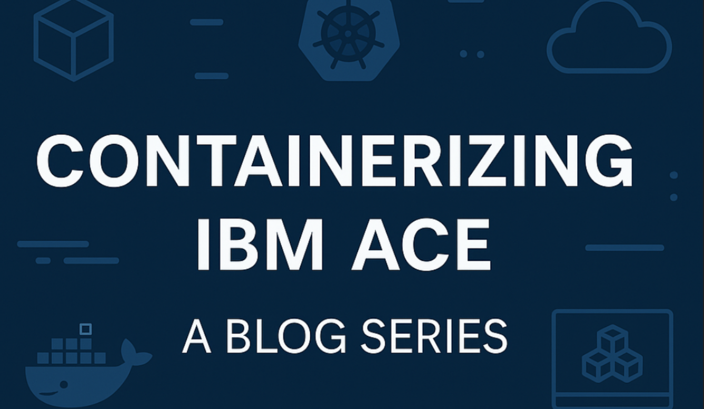

{ .md-banner }

<!--MD_POST_META:START-->

  
2026-02-20 · ⏱ 8 min

  
Share: <a class="post-share post-share-linkedin" href="https://www.linkedin.com/sharing/share-offsite/?url=https%3A%2F%2Fmatthiasblomme.github.io%2Fblogs%2Fposts%2Fcontainerization-series%2F06.upgrading-in-containers%2F" target="_blank" rel="noopener" title="Share on LinkedIn">[in]</a>

<!--MD_POST_META:END-->

# Containerizing IBM ACE: A Blog Series – Upgrading in Containers

If you've ever sat through an ACE or MQ upgrade on a traditional Integration Node, you already know where this is going. 
First you plan a maintenance window, then you spend the next two weeks coordinating with every team that has flows 
on that node and every business party that's impacted. When the day finally comes, you drain your system, hold your 
breath, and run the installer. Then come the manual actions. Copying files, moving MQ messages, all the things you 
swore you'd automate last time. You hope nothing breaks. And then you get to do it all again for the next system 
and environment. And that's just the middleware. Don't even get me started on an OS upgrade.

It's not fun. It's not fast. And it's definitely not something you volunteer for twice, let alone bi-monthly.

Containers change that story. Not by making upgrades disappear, but by making them boring. And boring upgrades are the best kind.

## The traditional upgrade problem

Let’s be honest about what upgrades look like without containers.

You have a shared Integration Node. Maybe one team manages it. Maybe several do. Doesn’t matter. Multiple flows run on it. Multiple business domains depend on it. It works fine, until upgrade time.

When you upgrade ACE, or MQ, or the underlying OS, you are not touching one runtime. You are touching everything on that node. Every flow. Every dependency. Every consumer downstream.

And everyone has to agree on timing.

So the calendar fills up. Change requests. Impact assessments. Test cycles. Rollback plans. Meetings about meetings. You’re not upgrading software. You’re coordinating risk across half the organization. And yes, that’s only a slight exaggeration.

One mistake affects everyone.

So what happens? Upgrades get postponed. “Next quarter” becomes “after the next release.” One version behind becomes two. Then three.

At some point it stops being an upgrade. It becomes a migration.

And migrations are never small.

## What changes with containers

Containers don’t make upgrades disappear. They change the mechanics.

In a traditional setup, you upgrade what’s already running. You install over it. You patch it. You adjust it in place. The runtime carries history, small tweaks, decisions nobody fully remembers. It works, until it doesn’t.

With containers, you don’t upgrade the running thing. You start a new one.

Maybe you baked everything into the image. Maybe the ACE agent resolves part of it at startup. The model can differ. The principle does not. You introduce a new runtime with the new version. The old one keeps running.

If the new version doesn’t come up cleanly, nothing changes. The original instance keeps serving traffic. If it does start cleanly, traffic shifts and the old one drains away. No interruption. No alarm bells. Your 99.99% stays exactly where it was.

No half-installed state. No weird in-between phase. Just replacement. You’re no longer planning a synchronized upgrade across a shared node.

Upgrades become boring. Exactly as they should be.

## ACE upgrades

With ACE, the upgrade story depends on how you build your image.

If you maintain a custom build, you decide when to move. A new fix pack comes out, you update the image, rebuild, push, and deploy a new runtime version.

If you use an agent-controlled model, the platform handles that lifecycle for you. A new ACE version becomes available, a fresh runtime is started with that version, and the old one is retired.

Different operational models. Same principle: you don’t patch a running Integration Node. You replace a runtime with a new version. And because each deployment is isolated, upgrading one ACE workload doesn’t ripple across everything else.

The difference is simply who initiates the change. You, or the platform.

## MQ upgrades

MQ follows the same pattern as ACE.

With a custom image, you decide when to rebuild and deploy a new version. With an operator-managed setup, the platform handles that lifecycle and rolls out the update. The difference with MQ is that it is stateful.

A standalone queue manager upgrade is simple in container terms. A new version starts, the old one stops. Connections will drop during that switch, so clients need to be configured for auto reconnect.

In multi-instance setups or operator-managed HA configurations such as native HA or uniform clusters, the rollout happens more gradually. Instances are replaced one at a time. Leadership can shift. Traffic continues.

The mechanics vary depending on topology. The principle does not.

You still replace queue manager instances instead of patching them in place. The upgrade is scoped to that queue manager, not to everything else running on that host.

## OS and platform upgrades

In a containerized setup, you don’t upgrade the OS underneath ACE or MQ anymore. Or at least not directly.

The OS layer that your runtime depends on is part of the image. When you move to a new ACE or MQ version, you typically move to a new base image as well. The operating system used by the runtime comes with it. That means OS upgrades are no longer a separate middleware event.

What remains are platform upgrades.

Kubernetes or OpenShift nodes still need patching. Worker nodes still get updated. But that process looks very different from upgrading a shared server in place. The process is infrastructure-driven, not application-driven.

A node is marked unschedulable. Running workloads are drained from it and rescheduled onto other healthy nodes. Once the node is empty, it is patched or replaced. When it comes back, it rejoins the cluster and can take on workloads again.

From the perspective of ACE or MQ, nothing special happened. Pods restart as part of normal scheduling behavior. As long as your deployments are configured correctly, traffic continues.

No coordinated middleware shutdown. No reinstalling software across environments. No careful sequencing to keep unrelated services alive.

The infrastructure is replaced underneath you. Your workloads simply reschedule.

## Version pinning and parallel testing

What if you want the flexibility of containers and still keep control?

If you build and manage your own images, version pinning is how you do that.

Use explicit tags. Not `latest`. Not floating references that quietly change underneath you. An image tag should represent a specific ACE version, a specific MQ version, a specific base image. That way you know exactly what is running in each environment.

Want to test a new fix pack? Build a new image with a new tag. Deploy it alongside the current one. Let it run in dev. Move it to test. Then acceptance. Then production. You don’t upgrade in the dark. You run the new version next to the old one.

If you run an agent-controlled model, pinning works differently. The platform decides when new versions become available and when they roll out. You trade manual control for automation.

Some agents still allow a degree of version pinning. But that support is usually bounded. Only a limited number of versions are maintained at any given time. If your pinned version falls outside that supported window, the platform will eventually move you forward. That trade-off is intentional.

Either way, version changes are explicit. You control them directly, or you deliberately delegate that control.

## Rollbacks

Eventually, something won’t go as expected.

On a traditional server, rolling back is rarely straightforward. You upgraded in place. Files changed. Configuration changed. Libraries may have shifted. Returning to the previous version means retracing those steps. Or restoring a snapshot, whichever is fastest.

With containers, rollback is simpler. The previous image is still available. You redeploy it. The platform starts that version again. No manual cleanup. No reinstalling. No rebuilding a machine.

It’s the same as doing an upgrade, but backwards.

## The mindset shift

This ties back to the pets versus cattle discussion from the first post. When your runtime is a pet, upgrades are surgery. When your runtime is cattle, upgrades are rotation. You don’t upgrade the cow. You replace it with a younger one. Kim, if you are reading this, yes, I went there again.

Upgrades stop being special events. They become part of your normal workflow. Build. Test. Ship. The same pipeline that deploys your BAR files can roll out a new base image.

Stop thinking of upgrades as a necessary evil. Start thinking of them as an advantage.

## Closing note

Containers don’t eliminate upgrade risk. You can still break things. You can still skip testing. You can still push a bad build. What they do is shrink the blast radius. And when the blast radius shrinks, upgrades stop feeling like events. They become routine. Boring even, exactly as they should be.

If upgrades still feel like projects, you’re still running pets.

---

## Other blogs from the Containerizing IBM ACE series

* [Containerizing IBM ACE: A Blog Series – The Basics](https://community.ibm.com/community/user/blogs/matthias-blomme/2025/09/02/containerizing-ibm-ace-a-blog-series-the-basics)
* [Containerizing IBM ACE: A Blog Series - Images vs Artifacts](https://community.ibm.com/community/user/blogs/matthias-blomme/2025/09/11/containerizing-ibm-ace-a-blog-series-images-vs-art)
* [Containerizing IBM ACE: A Blog Series - Things to Consider in Containers](https://community.ibm.com/community/user/blogs/matthias-blomme/2025/09/11/things-to-consider-in-containers)
* [Containerizing IBM ACE: A Blog Series - Scoping your runtimes](https://community.ibm.com/community/user/blogs/matthias-blomme/2025/09/20/scoping-your-runtimes)
* [Containerizing IBM ACE: A Blog Series - Container Startup Optimization](https://community.ibm.com/community/user/blogs/matthias-blomme/2025/09/26/container-startup-optimization)
  

---

Written by [Matthias Blomme](https://www.linkedin.com/in/matthiasblomme/)

\#IBMChampion \
\#AppConnectEnterprise(ACE)
