# Bar Build Commands: Unraveling the Differences

## Introduction

Today automated builds and deployments are a must to support business demands. IBM App Connect Enterprise (ace) offers 
strong capabilities to automate build and deployments. In this blog we highlight the different options available out of 
the box and share our view on the pros and cons.

Let’s look at
- mqsipackagebar
- mqsicreatebar
- ibmint (the new kid on the block)

To establish a baseline of what a bar file should contain, I'm using the toolkit to generate them.

## Test setup

Let me take you through the test setup.


My test setup consists of

- An application containing
    - A message flow (generic)
    - An MRM message set (I'm reusing the MRM message set supplied by Trevor Dolby as part of an `ibmint` demo, see the references for the link)
- A library containing
    - Message definitions
    - A generic subflow
    - Some java code.

Both the MRM message set in the application and the java code in the library need to be compiled before use. Spoiler 
alert: this is where the commands differ.

Using the toolkit as the baseline we are expecting the application bar file to contain the following:

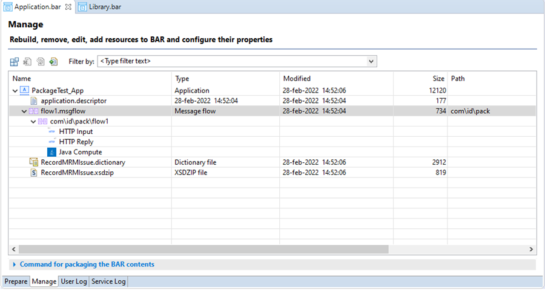

And the library bar file:

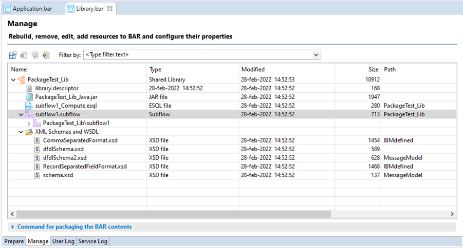

Now that the baseline is set, let's look at our options.

## mqsipackagebar

Straight off the bat, let me say there is a BIG requirement here. The `mqsipackagebar` command can only place deployable
objects inside a bar file. Message flows should be fine, but message sets that need to be compiled and java code will 
present an issue.

I know that seems like a big hurdle but bear with me for a moment.

The advantage of `mqsipackagebar` is that you don't need an installed instance of the toolkit to create a bar file. This
also means that you don't have a need for the toolkit to be installed on your build environment. This in turn places less 
stress on your build environment (spinning up a toolkit is resource intensive) and results in a smaller installation 
footprint. Furthermore, the toolkit needs a display to startup. You can work around this by using some mock displays but 
it is difficult to set up.

There are some advantages here, but you are still left with that "deployable objects" issue. Well, not completely. A lot
also depends on how you setup your build environment but discussing this would bring me way off-topic, so I'll stick to 
explaining a couple of ways to solve this issue.

The `mqsipackagebar` command

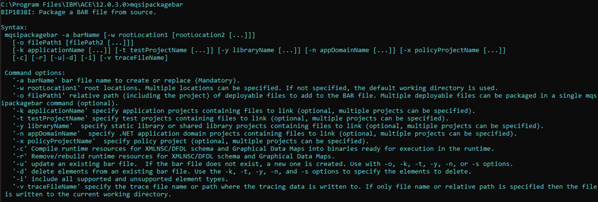

### Running mqsipackagebar without any additional actions

If you just run `mqsipackagebar` on my demo setup, you get the following issues

For the library


As you can see from both the command output and the bar contents, the java code is not there.

For the application


There is an issue with the message set, and we only have the flow packaged. Also note that the expand arrow next to the 
flow is missing, this is because the flow is not compiled and thus you don't get access to the properties of that flow.

You can also try to use the options -c and -i with `mqsipackagebar`:
- '-c' Compile runtime resources for XMLNSC/DFDL schema and Graphical Data Maps into binaries ready for execution in the runtime.
- '-i' include all supported and unsupported element types.


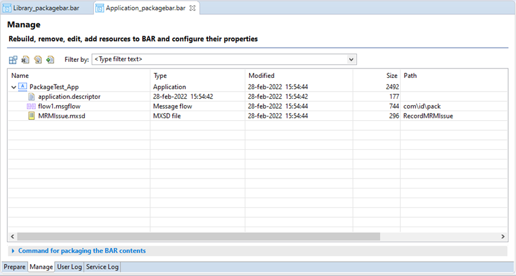

### Preparing for mqsipackagebar

If you want to use `mqsipackagebar` in some sort of built automation/pipeline, you can. There is just a little bit of 
preparation required.


#### Build for mqsipackagebar

You could ask the developer to prepare the projects by running Build for `mqsipackagebar` from the toolkit and make it 
a part of the development process

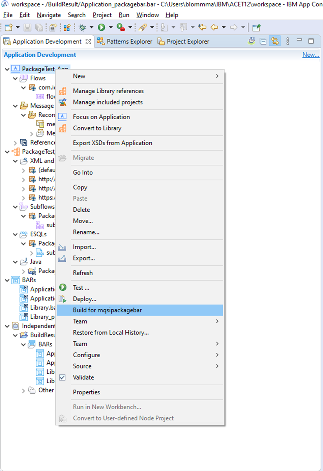

You get the following output for the application and the library respectively

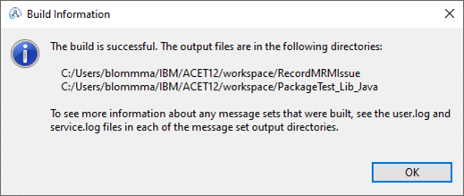
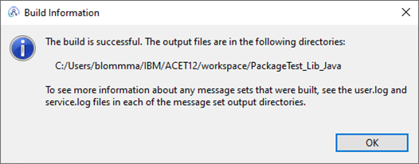

Running `mqsipackagebar` again gives you the following for the application:


And for the library:


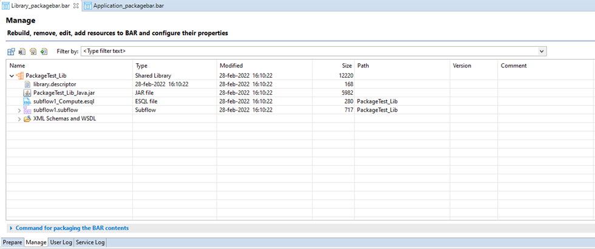


So, using `Build for mqsipackagebar` solves the original issues and lets you use `mqsipackagebar`. However, this comes 
with another big downside.

If you make this part of your build process, you’d have to commit these generated binary files to git (or any other 
source control) which is not ideal.  If the developer forgets to run re-run Build for `mqsipackagebar` after changing the 
message set or the java code, the `mqsipackagebar` command will keep packaging old versions of these deployable object 
and not the newly updated sources.

#### CompileOnly

The idea behind the previous step is a good one, if you could run it more downstream in your pipeline (shift right), more 
away from the developer and more towards the packaging step.

If you want to go down this route, you can make use of the `CompileOnly` option of `mqsicreatebar`.

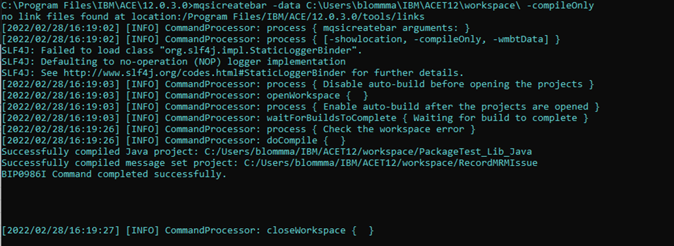

This is basically the same as running Build for `mqsipackagebar` from the toolkit, but it can be run immediately before 
creating a bar file downstream of the actual development.

You don't have to commit the deployable objects, but you will need to install the toolkit to get access to `mqsicreatebar`.

And to be honest, if you are using `mqsicreatebar` to compile and `mqsipackagebar` to build, then why not just use `mqsicreatebar` 
to do both?


## Mqsicreatebar

`Mqsicreatebar` is distributed with the toolkit installation, so remember to install it on your build environment.


When calling the `mqsicreatebar` command, a headless toolkit (Eclipse) is started and a runtime initialized to validate, 
compile, and create the actual bar file. As stated before, this is a more resource intensive task then running 
`mqsipackagebar`, but it does build/compile and package deployable objects in a single run.

Running headless on linux/ubuntu can be done easily by xvfb or xvfb-run. For pods and tests using xvfb-run is the quickest 
way of enabling xfvb (it will be started and stopped for you)

```bash
#xfvb-run mqsicreatebar -data …
```

The mqsicreatebar command

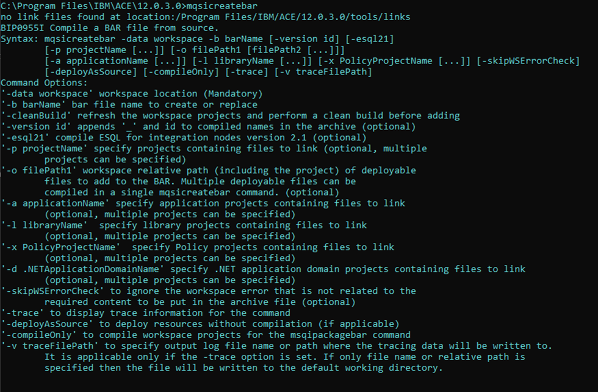

Packaging an application with the `mqsicreatebar` command:

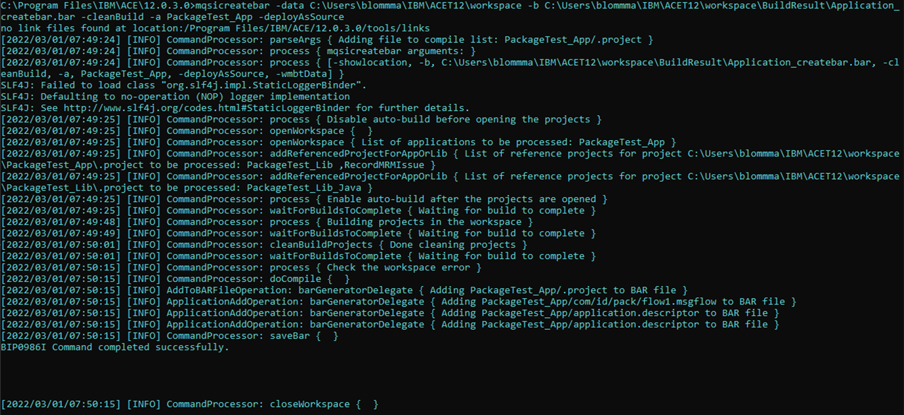

Note the workspace that gets opened to build the resources.


The contents of the bar file are identical our baseline versions created with the toolkit (toolkit on the left, `mqsicreatebar` 
on the right)

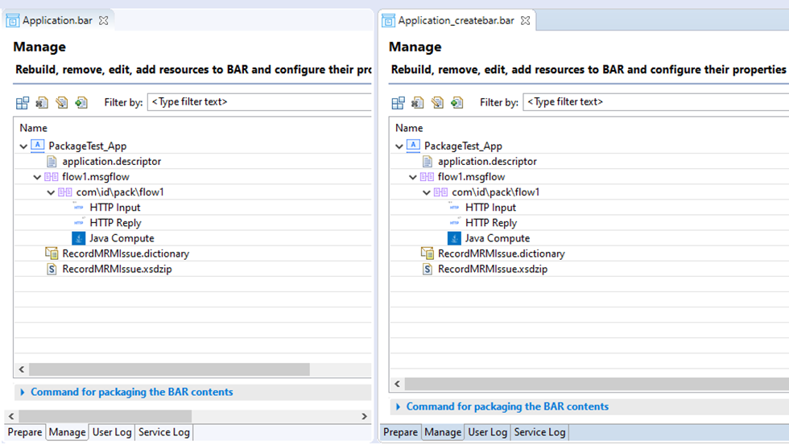

And for the library

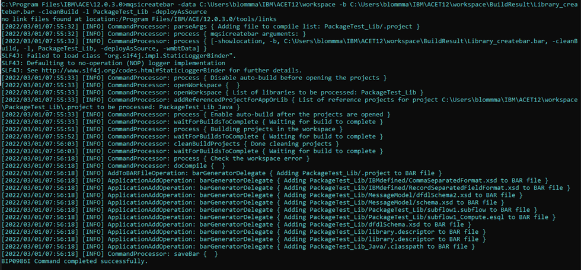
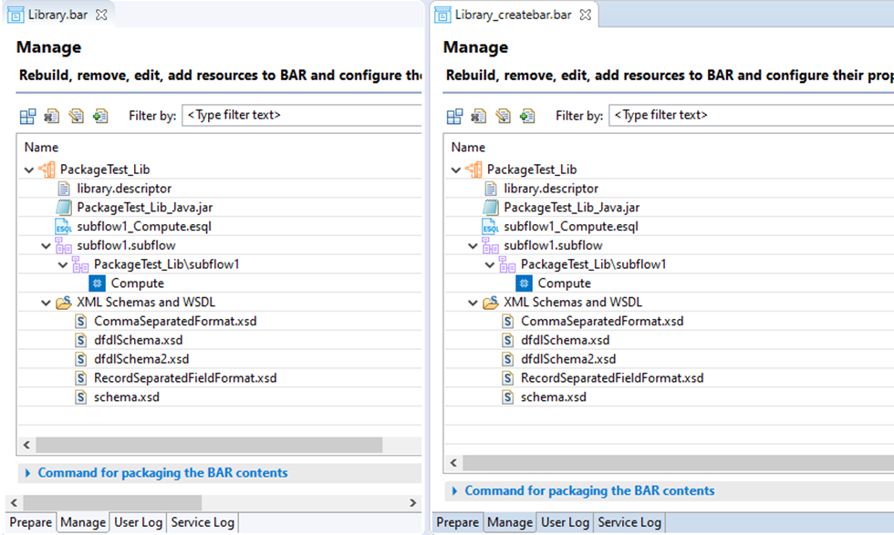

As I have mentioned a couple of times, using `mqsicreatebar` is more resource intensive and it takes longer then `mqsipackagebar` 
(because of the additional checks). If you plan on using `mqsicreatebar` in some sort of build automation, it would be 
prudent to start from small and clean (new) workspaces. The more projects in your workspace, the more code to build and 
the slower the process will be. Issues with any projects in the workspace (even projects not related to what you are trying 
to package) can prevent a successful bar build.

In practice this means that it’s best to configure the build pipeline to start from a new workspace each and every time 
and make sure to only clone just what needs to be build.

If you look at a containerized build pipeline, this is wat actually happens: each build starts a new worker pod and that 
pod clones all the required sources. After the build the artefact is upload to a storage environment (e.g. nexus) and the 
pod is discarded. Next build a new pod is started, and so on and so forth.

## Ibmint

With ACE 12.0.1.0 there is a new command interface that bundles a lot of older commands: `ibmint`. This command is shipped
with the standard server install, so you do not need the toolkit for it to run. Which is a big plus for any build automation 
platform.


The `ibmint` command


IBM supplied the new `ibmint` command to tie together all the mqsi* commands and to help make your build automation life a 
little easier. If I may quote IBM:

"The `ibmint` commands enable you to create simple pipelines of artifacts from source into the IBM App Connect Enterprise 
runtime."

### ibmint compile msgset

The compile msgset options does just that, it compiles message sets into dictionaries.


But it can only handle one message set at a time. If you want to compile multiple message sets, you’ll have to loop over 
them one by one.

### ibmint package

The package option can create or overwrite bar files. For the sake of this article, I'll limit it to just creating a bar 
file and ignore any overwrite options (though they are extremely useful for build automation).

The ``ibmint`` package command


Using `ibmint` package to create a bar file for the library


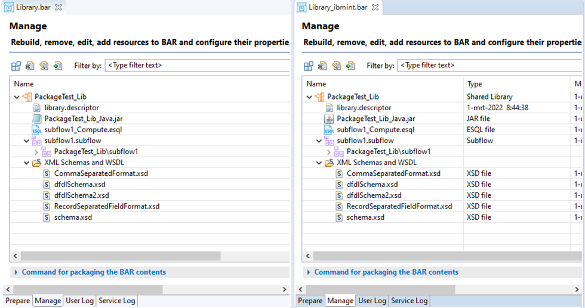

Using `ibmint` package to create a bar file for the application


As you can seem, the contents of the bar files match for both the application and the library. The jar file is automatically 
included because java code gets compiled (unlike with `mqsipackagebar`)

You do need to run `ibmint` compile msgset to get the dictionary in the bar file, otherwise you will get an error like this:


Even if you specify the --compile-maps-and-schemas flag, the MRM message set is not compiled.


One huge difference here is the time it takes to package a bar file compared to using `mqsicreatebar` and `mqsipackagebar`. 
Starting a headless Eclipse workspace takes up a huge chunk of time and resources, making `ibmint` the faster and better 
choice to incorporate into any build automation process.

### ibmint deploy

The deploy option combines both `ibmint` compile msgset and `ibmint` package in one single run

The `ibmint` deploy command


Compiling and deploying your projects with `ibmint` deploy


As you can see from the output, all resources are compiled (java and msgset) and a temporary bar file is created (sadly 
also deleted at the end of the process) that contains all the deployable artefacts. This bar file then is unpacked in the 
output work directory and what you are left with is a run directory that contains the deployed resources.

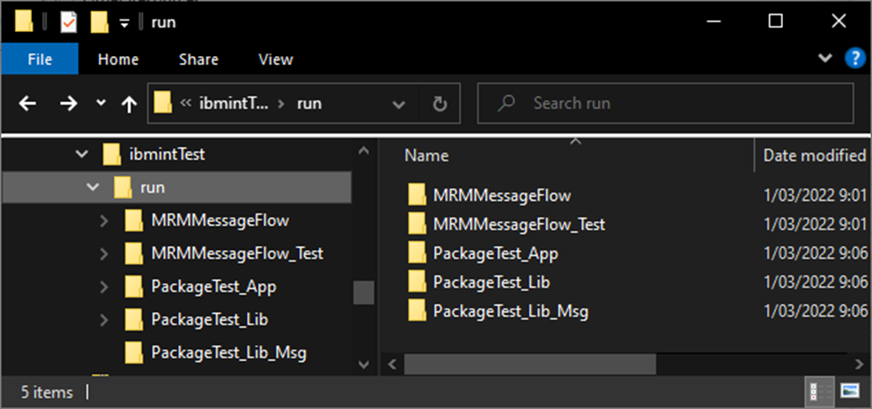

With ACE Unzip&Go there really is no difference between this and the bar file, but it would have been nice to be able to 
keep the bar file at the end of the deploy process.

This way of building/compiling/packaging resources is rather similar to `mqsicreatebar` (except for the deploy part) but it 
doesn't require a toolkit and, again, it is much faster. The same attention point we had with `mqsicreatebar` pops up here
as well. The entire workspace is used to build, compile, package and deploy. To properly use `ibmint` deploy you will need 
to use small and clean workspaces. It's not a big thing, just something to incorporate in the build process.

## Conclusion

There is no one size fits all solution here. All commands have their strengths and their weaknesses.

It really depends on how you plan on using these commands and how you plan on managing your workspaces.

There are a couple of big drawbacks though
- `mqsipackagebar`: doesn’t compile java or msgset
- `mqsicreatebar`: requires a toolkit installation
- Build for `mqsipackagebar`: compiles java and msgset at development time
- `ibmint` compile msgset: needs to be repeated for each message set

My suggestion would be to go for `ibmint`.

If you want to push sources directly towards the server (by zipping them yourself or copying them as-is) you can work 
from the output generated by `ibmint` deploy.

Should you need a bar file for any reason (legacy, personal preference, …) you’ll have to combine `ibmint` compile msgset 
and `ibmint` package.

If you don't have an issue with supplying your build environment with a toolkit installation and if you don't mind the 
additional build overhead, `mqsicreatebar` is also a viable option, for the simple reason that it combines everything you 
need in one single command
- Check workspace for error
- Compile java
- Compile msgset
- Create bar file

The one constant however is that you need to scope the workspaces you build from, only load those projects that you need 
inside a workspace, everything else is just clutter.

---

## References

IBM ACE documentation
- https://www.ibm.com/docs/en/app-connect/11.0.0?topic=commands-mqsipackagebar-command
- https://www.ibm.com/docs/en/app-connect/11.0.0?topic=arbf-packaging-resources-that-include-java-code-message-sets
- https://www.ibm.com/docs/en/app-connect/11.0.0?topic=commands-mqsicreatebar-command
- https://www.ibm.com/docs/en/app-connect/11.0.0?topic=solutions-creating-bar-file
- https://www.ibm.com/docs/en/integration-bus/10.0?topic=solutions-creating-bar-file (yes, IIB v10 documentation)
- https://www.ibm.com/docs/en/app-connect/12.0?topic=commands-ibmint
- https://www.ibm.com/docs/en/SSTTDS_12.0/com.ibm.etools.mft.doc/ACE_12_ibmint_command_cheat_sheet.pdf

Trevor Dobly ibmint demo
- https://github.com/tdolby-at-uk-ibm-com/ace-mrm-compile-example

--- 

Written by [Matthias Blomme](https://www.linkedin.com/in/matthiasblomme/)