<!--MD_POST_META:START-->
<div class="md-post-meta">
  <div class="md-post-meta-left">2025-08-18 · ⏱ 16 min</div>
  <div class="md-post-meta-right"><span class="post-share-label">Share:</span><a class="post-share post-share-linkedin" href="https://www.linkedin.com/sharing/share-offsite/?url=https%3A%2F%2Fmatthiasblomme.github.io%2Fblogs%2Fposts%2Fcreating-json-arrays%2Fcreating-json-arrays%2F" target="_blank" rel="noopener" title="Share on LinkedIn">in</a></div>
</div>
<hr class="md-post-divider"/>

<!--MD_POST_META:END-->

# Create JSON Arrays in ESQL and Java (Without Losing Your Sanity)

A quick (well, maybe not quick-quick) overview of why creating JSON arrays in ESQL and Java isn’t always as intuitive as it should be, especially with the mysterious "Item" field. For the veterans among you, this might all be common knowledge, but I’ve known even seasoned developers getting sucker punched by JSON arrays in ESQL.

There is an important difference between the internal message tree structure and the actual output JSON format that is key here. We’ll delve into the special Item field, a couple of array-building patterns in ESQL, how Java maps these concepts, and a quick bonus on index hacks.

Note: all the code and examples can be found in my GitHub repo Ace_test_cases.

Disclaimer: The snippets below are intentionally minimal to show how JSON arrays work. They’re not production-ready. In a real application, you’ll add validation, proper error handling, logging, and transaction handling. On the Java side in particular: expect try/catch, null checks, and sensible failure handling. We’re skipping all of that here to keep the examples short and readable.

## Creating JSON Arrays in ESQL

### What’s the deal with the "Item" field?

Before we start to create any array, let’s talk about the Item field. JSON array items are anonymous; the JSON serializer ignores the names of any array item elements. However, since the ACE Message Tree is more parser-agnostic, array elements require a name. For consistency reasons, there is a special field name, Item, that should be used when defining array item elements.

### Building an array of JSON values

In general, there are 2 proper ways of generating JSON arrays in ESQL, either by creating array items with CREATE LASTCHILD statement, or by directly creating array items by referencing the index:

```esql
-- array 1
CREATE FIELD OutputRoot.JSON.Data.lastChild IDENTITY (JSON.Array)lastChild;

CREATE LASTCHILD OF OutputRoot.JSON.Data.lastChild TYPE NameValue NAME 'Item' VALUE 'valueA';
CREATE LASTCHILD OF OutputRoot.JSON.Data.lastChild TYPE NameValue NAME 'Item' VALUE 'valueB';
CREATE LASTCHILD OF OutputRoot.JSON.Data.lastChild TYPE NameValue NAME 'Item' VALUE 42;
```

Result:

```json
{"lastChild": [
        "valueA",
        "valueB",
        42
    ]
}
```

Direct item reference:

```esql
-- array 2
CREATE FIELD OutputRoot.JSON.Data.directAssign IDENTITY (JSON.Array)directAssign;

SET OutputRoot.JSON.Data.directAssign.Item[1] = 'valueD';
SET OutputRoot.JSON.Data.directAssign.Item[2] = 'valueE';
SET OutputRoot.JSON.Data.directAssign.Item[3] = 'valueF';
SET OutputRoot.JSON.Data.directAssign.Item[4] = 'valueZ';
```

Result:

```json
{
    "directAssign": [
        "valueD",
        "valueE",
        "valueF",
        "valueZ"
    ]
}
```

Note: When using direct assign, you need consecutive numbering. If you jump numbers, you will get an _Array subscript error_:

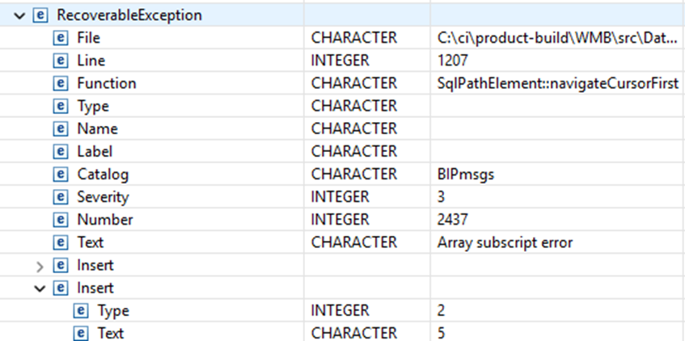[IMAGE PLACEHOLDER]

### Building an array of JSON objects

Whether you are building an array of values or an array of objects, the approach remains the same. You can either use LASTCHILD or direct index referencing

```esql
-- array 4
CREATE FIELD OutputRoot.JSON.Data.objectArray IDENTITY (JSON.Array)objectArray;

CREATE LASTCHILD OF OutputRoot.JSON.Data.objectArray NAME 'Item';
CREATE LASTCHILD OF OutputRoot.JSON.Data.objectArray.Item[<] NAME 'key' VALUE 'value';

CREATE LASTCHILD OF OutputRoot.JSON.Data.objectArray NAME 'Item';
CREATE LASTCHILD OF OutputRoot.JSON.Data.objectArray.Item[<] NAME 'key' VALUE 'value';

CREATE LASTCHILD OF OutputRoot.JSON.Data.objectArray NAME 'Item';
CREATE LASTCHILD OF OutputRoot.JSON.Data.objectArray.Item[<] NAME 'key' VALUE 'value';
```

Result:

```json
{
    "objectArray": [
        {
            "key": "value"
        },
        {
            "key": "value"
        },
        {
            "key": "value"
        }
    ]
}
```

Direct item reference:

```esql
-- array 5
CREATE FIELD OutputRoot.JSON.Data.objectArrayDirect IDENTITY (JSON.Array)objectArrayDirect;

SET OutputRoot.JSON.Data.objectArrayDirect.Item[1]."Code" = 'valueG';
SET OutputRoot.JSON.Data.objectArrayDirect.Item[2]."Description" = 'valueH';
SET OutputRoot.JSON.Data.objectArrayDirect.Item[3]."Extra" = 'valueI';
```

Result:

```json
{
    "objectArrayDirect": [
        {
            "Code": "valueG"
        },
        {
            "Description": "valueH"
        },
        {
            "Extra": "valueI"
        }
    ]
}
```

### Other ways of building JSON arrays – with pitfalls

In the above examples, we’ve looked at 2 ways of building both value and object arrays. However, we only looked at the (most) proper ways of building arrays; there are many other options available. And I’ve got a few more I’d like to share (some that work, some that don’t).

#### What works: Direct assign via for loop

```esql
-- array 7
CREATE FIELD OutputRoot.JSON.Data.forloop2 IDENTITY (JSON.Array)forloop2;
DECLARE j INTEGER 1;

FOR source as Environment.Variables.directAssign.Item[] DO
    SET OutputRoot.JSON.Data.forloop2.Item[j].{'entry' || CAST(j AS CHARACTER)} = 'value' || CAST(j AS CHARACTER);
    set j = j + 1;
END FOR;
```

Result:

```json
{
    "forloop2": [
        {
            "entry1": "value1"
        },
        {
            "entry2": "value2"
        },
        {
            "entry3": "value3"
        },
        {
            "entry4": "value4"
        }
    ]
}
```

This is a valid example of how to loop over one array and create an object array in the OutputRoot. The result is a valid JSON message.

#### What to avoid: Direct reference without Item field

```esql
-- array 3
CREATE FIELD OutputRoot.JSON.Data.directAssignNoItem IDENTITY (JSON.Array)directAssignNoItem;

SET OutputRoot.JSON.Data.directAssignNoItem[1] = 'valueD';
SET OutputRoot.JSON.Data.directAssignNoItem[2] = 'valueE';
SET OutputRoot.JSON.Data.directAssignNoItem[3] = 'valueF';
```

Result:

```json
{
    "directAssignNoItem": [],
    "directAssignNoItem": "valueE",
    "directAssignNoItem": "valueF"
}
```

As you can see, this creates an invalid JSON with 3 identically named fields, instead of an array.

#### Direct assign via for loop

```esql
-- array 6
CREATE FIELD OutputRoot.JSON.Data.forLoop IDENTITY (JSON.Array)forLoop;
DECLARE i INTEGER 1;

FOR source as Environment.Variables.directAssign.Item[] DO
    SET OutputRoot.JSON.Data.forLoop.Item[1].{'entry' || CAST(i AS CHARACTER)} = 'value' || CAST(i AS CHARACTER);
    set i = i + 1;
END FOR;
```

Result:

```json
{
    "forLoop": [
        {
            "entry1": "value1",
            "entry2": "value2",
            "entry3": "value3",
            "entry4": "value4"
        }
    ]
}
```

Some of these examples are explicitly coded wrong, just to show you what would happen and to explain how ESQL handles these. In the above example, for instance, we’re creating multiple entries in a single array item (fixed on index 1). This JSON output is valid, because the entries all have different names. Otherwise it would have been an invalid JSON, similar to array 3.

#### Custom Item field name

```esql
-- array 8
CREATE FIELD OutputRoot.JSON.Data.noItemList IDENTITY (JSON.Array)noItemList;
DECLARE k INTEGER 1;

FOR source as Environment.Variables.directAssign.Item[] DO
    SET OutputRoot.JSON.Data.noItemList.someField[k].{'entry' || CAST(k AS CHARACTER)} = 'value' || CAST(k AS CHARACTER);
    set k = k + 1;
END FOR;
```

Result:

```json
{
    "noItemList": [
        {
            "entry1": "value1"
        },
        {
            "entry2": "value2"
        },
        {
            "entry3": "value3"
        },
        {
            "entry4": "value4"
        }
    ]
}
```

The above code is an example to show you that the JSON serialize anonymizes the JSON arrays. The example uses someField instead of Item, but the output looks, and is, valid. However, if everyone uses another field name, readability suffers. So stick with the best practice of using Item as the name of the array entries.

#### For loop for object array without Item field name

```esql
-- array 9
CREATE FIELD OutputRoot.JSON.Data.noItemList2 IDENTITY (JSON.Array)noItemList2;
DECLARE l INTEGER 1;

FOR source as Environment.Variables.directAssign.Item[] DO
    SET OutputRoot.JSON.Data.noItemList2[l].{'entry' || CAST(l AS CHARACTER)} = 'value' || CAST(l AS CHARACTER);
    set l = l + 1;
END FOR;
```

Result:

```json
{
    "noItemList2": [
        "value1"
    ],
    "noItemList2": {
        "entry2": "value2"
    },
    "noItemList2": {
        "entry3": "value3"
    },
    "noItemList2": {
        "entry4": "value4"
    }
}
```

This is another example of skipping the Item field name, but this time for an object array (whereas example array 3 uses a value array). This results in another invalid JSON message.

## Creating JSON Arrays in Java

If you prefer to use Java Compute nodes instead of ESQL, you can build JSON arrays using ACE’s built-in MbElement methods.

The principles are the same: arrays are anonymous in JSON, but the ACE Message Tree requires a name for each entry, so you should still use the Item field indicator, MbJSON.ARRAY_ITEM_NAME ("Item"), when building arrays.

### Building an array of JSON values (like CREATE LASTCHILD in ESQL)

```java
MbElement outRoot = outMessage.getRootElement();
MbElement outJsonRoot = outRoot.createElementAsLastChild(MbJSON.PARSER_NAME);
MbElement outJsonData = outJsonRoot.createElementAsLastChild(MbElement.TYPE_NAME, MbJSON.DATA_ELEMENT_NAME, null);

// Create a JSON array node under " lastChild "
MbElement valueArray = outJsonData.createElementAsLastChild(MbJSON.ARRAY, "lastChild", null);

// Add array values
valueArray.createElementAsLastChild(MbElement.TYPE_NAME_VALUE, MbJSON.ARRAY_ITEM_NAME, "valueA");
valueArray.createElementAsLastChild(MbElement.TYPE_NAME_VALUE, MbJSON.ARRAY_ITEM_NAME, "valueB");
valueArray.createElementAsLastChild(MbElement.TYPE_NAME_VALUE, MbJSON.ARRAY_ITEM_NAME, 42);
```

Result:

```json
{
    "lastChild": [
        "valueA",
        "valueB",
        42
    ]
}
```

### Building an array of JSON objects

```java
MbElement outRoot = outMessage.getRootElement();
MbElement outJsonRoot = outRoot.createElementAsLastChild(MbJSON.PARSER_NAME);
MbElement outJsonData = outJsonRoot.createElementAsLastChild(MbElement.TYPE_NAME, MbJSON.DATA_ELEMENT_NAME, null);

// Create a JSON array node under "objectArray"
MbElement objectArray = outJsonData.createElementAsLastChild(MbJSON.ARRAY, "objectArray", null);

// First object
MbElement firstItem = objectArray.createElementAsLastChild(MbElement.TYPE_NAME, MbJSON.ARRAY_ITEM_NAME, null);
firstItem.createElementAsLastChild(MbElement.TYPE_NAME_VALUE, "key1", "valueA");

// Second object
MbElement secondItem = objectArray.createElementAsLastChild(MbElement.TYPE_NAME, MbJSON.ARRAY_ITEM_NAME, null);
secondItem.createElementAsLastChild(MbElement.TYPE_NAME_VALUE, "key2", "valueB");

// Third object
MbElement thirdItem = objectArray.createElementAsLastChild(MbElement.TYPE_NAME, MbJSON.ARRAY_ITEM_NAME, null);
thirdItem.createElementAsLastChild(MbElement.TYPE_NAME_VALUE, "key3", "valueC");
```

Result:

```json
{
    "objectArray": [
        {
            "key1": "valueA"
        },
        {
            "key2": "valueB"
        },
        {
            "key3": "valueC"
        }
    ]
}
```

>Note: In Java, there’s no direct “Item[3] = ...” equivalent. You always append children in order. If you try to “skip an index” by omitting intermediate items, you’ll create them in sequence, and in some cases, overwriting can occur if you reuse names without Item.

You can, of course, read the 3rd item with a bit of extra code:

```java
int n = 3; // 1-based like your ESQL examples
MbElement e = forloop2.getFirstChild();
for (int i = 1; e != null && i < n; i++) e = e.getNextSibling();
// e now points to the 3rd array item (or null if out of range)
```

### Loop-based creation (like ESQL FOR loop)

```java
MbElement outRoot = outMessage.getRootElement();
MbElement outJsonRoot = outRoot.createElementAsLastChild(MbJSON.PARSER_NAME);
MbElement outJsonData = outJsonRoot.createElementAsLastChild(MbElement.TYPE_NAME, MbJSON.DATA_ELEMENT_NAME, null);

// Create a JSON array node under "objectArray"
MbElement objectArray = outJsonData.createElementAsLastChild(MbJSON.ARRAY, "objectArray", null);

// First object
MbElement firstItem = objectArray.createElementAsLastChild(MbElement.TYPE_NAME, MbJSON.ARRAY_ITEM_NAME, null);
firstItem.createElementAsLastChild(MbElement.TYPE_NAME_VALUE, "key1", "valueA");

// Second object
MbElement secondItem = objectArray.createElementAsLastChild(MbElement.TYPE_NAME, MbJSON.ARRAY_ITEM_NAME, null);
secondItem.createElementAsLastChild(MbElement.TYPE_NAME_VALUE, "key2", "valueB");

// Third object
MbElement thirdItem = objectArray.createElementAsLastChild(MbElement.TYPE_NAME, MbJSON.ARRAY_ITEM_NAME, null);
thirdItem.createElementAsLastChild(MbElement.TYPE_NAME_VALUE, "key3", "valueC");
```

Result:

```json
{
  "forloop2": [
    { "entry1": "value1" },
    { "entry2": "value2" },
    { "entry3": "value3" },
    { "entry4": "value4" }
  ]
}
```

### What to avoid

In Java, the risk isn’t from naming array entries incorrectly, but from accidentally creating an object instead of an array; multiple fields with the same name in an object will overwrite each other.

In ESQL, skipping the "Item" field name causes the serializer to treat each field as a separate named element (which can result in invalid JSON), but in Java, if you create a JSON array element using

```java
outJsonData.createElementAsLastChild(MbJSON.ARRAY, ...)
```

then all children of that array node are automatically treated as array items, no matter what element name you give them.

So, the “What to avoid” example from ESQL doesn’t translate 1:1 here. The equivalent problem in Java would only happen if you didn’t create the parent as a JSON array and instead created multiple sibling elements with the same name under an object. This is a common mistake that a lot of developers make.

```java
MbElement outRoot = outMessage.getRootElement();
MbElement outJsonRoot = outRoot.createElementAsLastChild(MbJSON.PARSER_NAME);
MbElement outJsonData = outJsonRoot.createElementAsLastChild(MbElement.TYPE_NAME, MbJSON.DATA_ELEMENT_NAME, null);

MbElement notAnArray = outJsonData.createElementAsLastChild(MbElement.TYPE_NAME, "noArrayType", null);

notAnArray.createElementAsLastChild(MbElement.TYPE_NAME_VALUE, "wrongType", "valueD");
notAnArray.createElementAsLastChild(MbElement.TYPE_NAME_VALUE, "wrongType", "valueE");
notAnArray.createElementAsLastChild(MbElement.TYPE_NAME_VALUE, "wrongType", "valueF");
```

Result:

```json
{
    "noArrayType": {
        "wrongType": "valueD",
        "wrongType": "valueE",
        "wrongType": "valueF"
    }
}
```

Objects can’t have duplicate keys; the last one wins.

### Best practices

- Use MbJSON.ARRAY_ITEM_NAME for array entries inside the message tree.
- Mark arrays with MbJSON.ARRAY so ACE serializes them correctly.
- Keep array creation sequential, Java doesn’t allow sparse index assignment like ESQL’s Item[4].
- If your array structure is complex, consider building it in plain Java objects (e.g., with Jackson) and then parsing it into the message tree.

## Bonus 1: Copying the message tree

When you copy a JSON message away from the Message Tree and into the Environment, the data loses its parser information. 
This can result in some very weird behaviour that you might not expect, or sometimes you won’t notice the difference. 
It can be tricky to diagnose, especially the first time you encounter this behaviour.

In the demo flow, we copy all the created arrays into the _Environment.Variables_ folder, with a subfolder for each array.

Code extract:

```esql
…

-- array 1
…
CREATE FIELD Environment.Variables.lastChild IDENTITY (JSON.Array)lastChild;
SET Environment.Variables.lastChild = OutputRoot.JSON.Data.lastChild;
…

-- array 2
…
SET Environment.Variables.directAssign = OutputRoot.JSON.Data.directAssign;
…

CALL CopyMessageHeaders();
Set OutputRoot.JSON.Data = Environment.Variables;
RETURN TRUE;
```

If you look at the output that the HTTP Input node sends back, you can see this doesn’t match the output in the JSON 
files. Since the siblings are all named Item, each new value replaces the previous, leaving only the final entry in the 
tree.

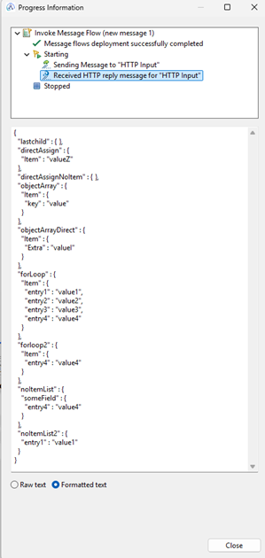

### What it looks like in the output file

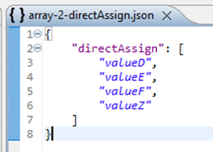

This is a good and valid JSON, like we wanted.

### What it looks like in the environment

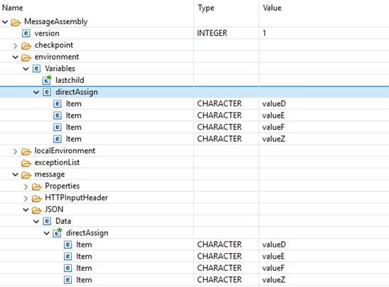

What you can immediately see in the Message Tree is that the directAssign field in the message is an array 
(indicated with the green asterisk) and the directAssign field in the environment is not.


### What it looks like in the http reply

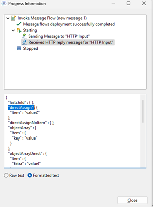

Since the environment entry is not an array, the identical field names overwrite each other upon serialization, leaving you with only the last value.

### Using a Flow Order Node

If you have a flow where you do need to put the message body aside, for instance, if you want to request a token before doing a REST call, it’s best to either first request the token and then build your message, or make use of the Flow Order node.
A typical (simplified flow) that I have seen on multiple occasions:

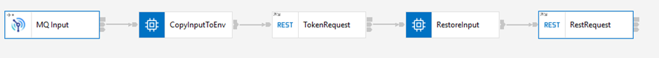

The flow works roughly like this
1.	MQ Input: A JSON message is received
2.	CopyInputToEnv: The JSON message is copied to the environment and the Token request is setup
3.	TokenRequest: A token is requested via REST
4.	RestoreInput: The original JSON is restored and the received token is added to the Authorization header
5.	RestRequest: The final REST call is made

This setup works in a lot of situations, unless you are using JSON arrays.
 
A better flow setup would be this

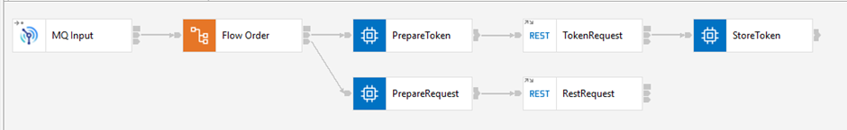
 
The flow works roughly like this
1.	MQ Input: A JSON message is received
2.	Flow Order: Send message to the top lane
3.	PrepareToken: Build the request message for the token endpoint
4.	TokenRequest: Request the token
5.	StoreToken: Extract the token and store it in the environment
6.	Flow Order: Send the message to the bottom lane
7.	PrepareRequest: Retreive the token from the environment and add it to the request message (the input message is unchanged!)
8.	RestRequest: Call the API

I know that by reading the Input message as a BLOB, copying the BLOB to the Environment, and restoring and reparsing that BLOB message, you can come to a similar result, but that is more code to achieve what the Flow Order offers you out of the box.


## Bonus 2: Accessing elements inside arrays

Sometimes you don’t need the whole array—just the first, the last, or a specific slice. Here’s how to grab what you need without looping through every element:

For instance, you’ve got a list of order IDs and you need the very first and last order report to your head of sales.

```esql
-- Traditional index lookup
SET firstOrder = InputRoot.JSON.Data.List.Item[1];

DECLARE lastIndex INTEGER CARDINALITY(InputRoot.JSON.Data.List.Item[]);
SET lastOrder = InputRoot.JSON.Data.List.Item[lastIndex];

-- Relative index lookup
SET oldestOrder= InputRoot.JSON.Data.List.Item[>];
SET newestOrder = InputRoot.JSON.Data.List.Item[<];

-- Expanded lookups
SET OutputRoot.JSON.Data.SecondLastRelative = InputRoot.JSON.Data.List.Item[<2];
```

What it means:

- `Item[1]`, `Item[2]` – access with array index
- `Item[>]` – get the first occurrence
- `Item[<]` – get the last occurrence

Let’s say that you only want the last element.

Some sample code ( available on [GitHub](https://github.com/matthiasblomme/Ace_test_cases/tree/15555cca152afe4347873dbefec41b434e14a44a/JsonArrayApp) ):

```esql
-- Get First
SET OutputRoot.JSON.Data.FirstEntry = InputRoot.JSON.Data.List.Item[1];

-- Get Second
SET OutputRoot.JSON.Data.SecondEntry = InputRoot.JSON.Data.List.Item[2];

-- Get Last with index
DECLARE lastIndex INTEGER CARDINALITY(InputRoot.JSON.Data.List.Item[]);
SET OutputRoot.JSON.Data.LastIndex = InputRoot.JSON.Data.List.Item[lastIndex];

-- Get First relative
SET OutputRoot.JSON.Data.FirstRelative = InputRoot.JSON.Data.List.Item[>];

-- Get Second relative
SET OutputRoot.JSON.Data.SecondRelative = InputRoot.JSON.Data.List.Item[>2];

-- Get Last relative
SET OutputRoot.JSON.Data.LastRelative = InputRoot.JSON.Data.List.Item[<];

-- Get second last relative
SET OutputRoot.JSON.Data.SecondLastRelative = InputRoot.JSON.Data.List.Item[<2];
```

With the following input data in the flow exerciser:

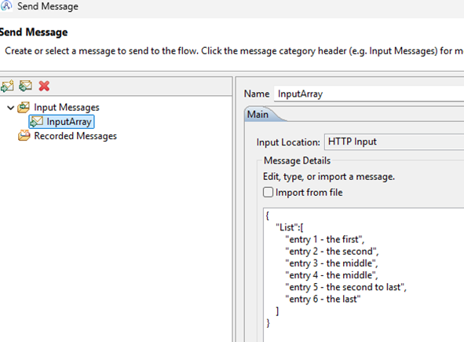

We get the following reply:

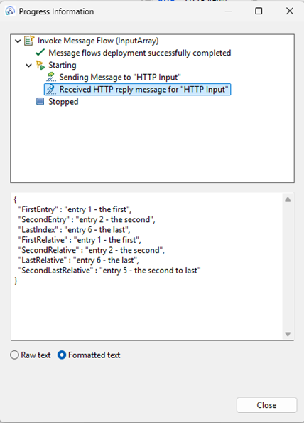


## Bonus 3: Behind the Scenes – Your Test Flow Explained

All the examples that are being used throughout this blog can be found in the `JsonArrayApp` project in the [Ace_test_cases](https://github.com/matthiasblomme/Ace_test_cases) repository on GitHub.

It’s a very simple flow setup:

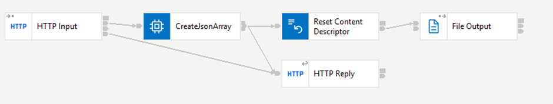

The flow listens to any call on `/jsonarray` (but does expect a JSON input message). The Compute node creates all the different arrays, forwards them one by one to the FileOutput node and stores the results in the Environment as well.

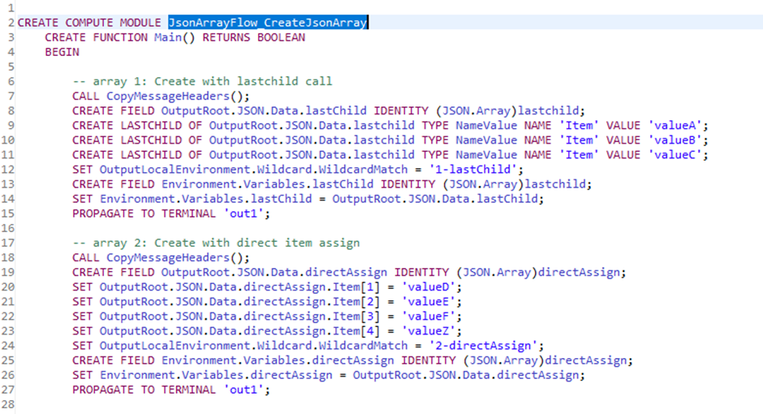

After the last array is created, it restores the Environment entries to the OutputRoot JSON message and forwards it to the HTTP Reply node.

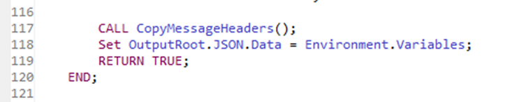

Because we use the WildCardMatch parameters, each array is written to its own JSON file in the output directory.

I recommend you give it a try and play around with some of these array assignment code blocks. Have fun!


## Call to action

Drop a note on GitHub if you run into another weird array quirk—I’ve probably tripped on it, too.

---

## Resources

- https://www.ibm.com/docs/en/app-connect/13.0.x?topic=esql-manipulating-messages-in-json-domain
- https://www.ibm.com/docs/en/app-connect/13.0.x?topic=domain-creating-json-message
- https://www.ibm.com/docs/en/app-connect/13.0.x?topic=content-accessing-known-multiple-occurrences-element
- https://github.com/matthiasblomme/Ace_test_cases

---

Written by [Matthias Blomme](https://www.linkedin.com/in/matthiasblomme/) and [Francis Cocx](https://www.linkedin.com/in/cocxfrancis/)
