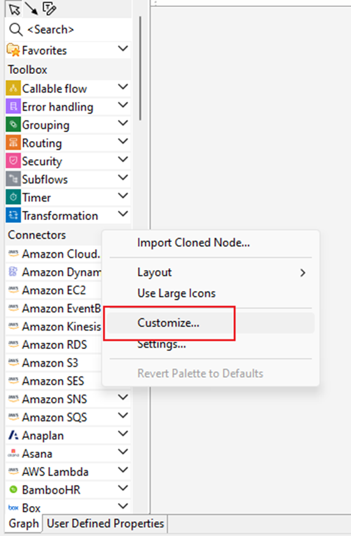
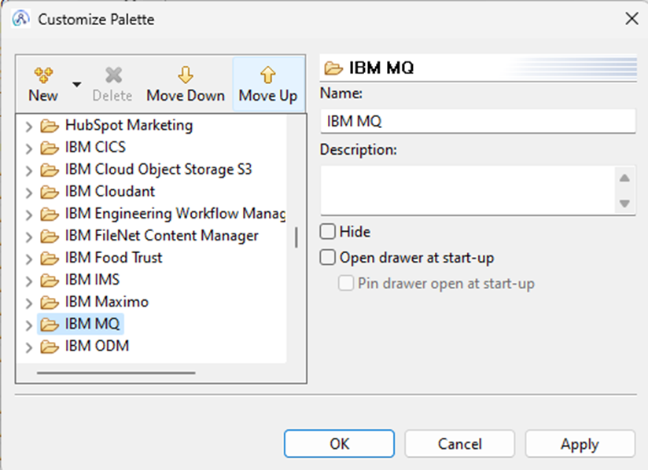
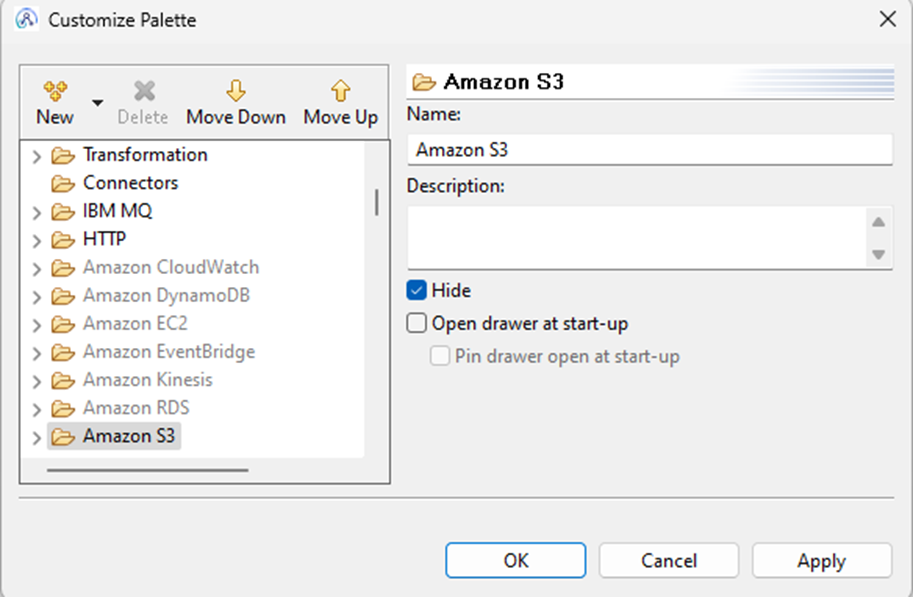
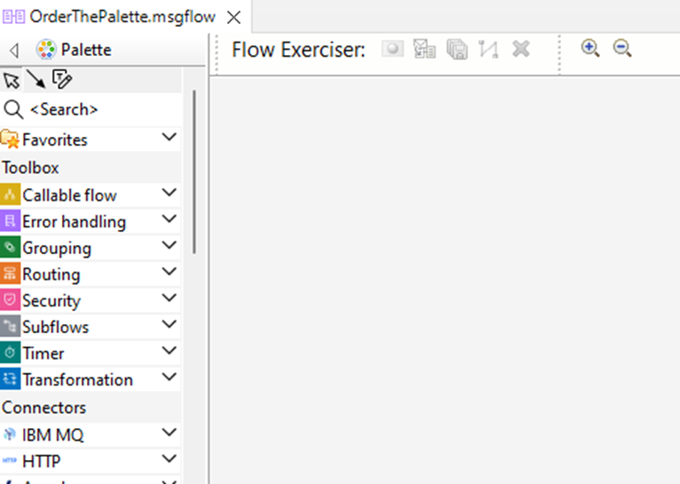

<!--MD_POST_META:START-->

  
2024-08-06 · ⏱ 3 min

  
Share: <a class="post-share post-share-linkedin" href="https://www.linkedin.com/sharing/share-offsite/?url=https%3A%2F%2Fmatthiasblomme.github.io%2Fblogs%2Fposts%2Fcustomize-ace-palette%2Fcustomize-ace-palette%2F" target="_blank" rel="noopener" title="Share on LinkedIn">[in]</a>

<!--MD_POST_META:END-->

# How to Customize the IBM App Connect Enterprise Palette: A Quick Guide

With all the new discovery connectors in the toolkit, it can be tricky to maintain an clear view on the nodes you actually use. Luckily the palette is customizable and allows you to order and hide the node groups that are available.

This guide will help you personalize your palette in a few simple steps.

## Step 1: Access the Palette Customization

1. Open the Palette View: Start by opening the Palette view in your IBM App Connect Enterprise Toolkit.
2. Right-click on the Palette: Right-click anywhere within the Palette to bring up the context menu.
3. Select "Customize": From the context menu, select the "Customize" option. This will open the Customize Palette dialog.

## Step 2: Reordering Node Groups

You can see a list of all the node groups available in your palette in the Customize Palette dialog.

1. Select a Node Group: Click on the node group you want to move.
2. Use Move Up/Move Down: Reorder the groups by using the "Move Up" and "Move Down" buttons. This allows you to place the most frequently used nodes at the top of the list.

Reordering nodes can save you time and make your workflow smoother. Here's how you can do it.

## Step 3: Hiding Unused Nodes and Node Groups

If there are nodes and/or node groups you don't use, you can hide them to declutter your palette.

1. Select a Node (Group): Click on the node (group) you want to hide.
2. Check the "Hide" Box: On the right side of the Customize Palette dialog, check the "Hide" box. The node will no longer appear in your palette.

Hiding unused nodes keeps your workspace clean and organized, helping you focus on what's important.

## Additional Options

1. Open Drawer at Start-up: You can choose to have certain drawers open automatically when you start the toolkit. To do this, select the node and check the "Open drawer at start-up" option.
2. Pin Drawer Open at Start-up: If you want the drawer to stay pinned open, check the "Pin drawer open at start-up" box.

## Applying the Changes

After making your desired changes, click "Apply" and then "OK" to save the changes and close the dialog. Your palette will now reflect the new order and visibility settings.

Putting IBM MQ and HTTP node groups first and hiding all Amazon nodes, gives you the following result

You will have to do this for each new workspace, the settings are persistent but only scoped for a specific workspace.

If you see hidden groups popping up again, just close and open the flow again, this should take care of it.

## Conclusion

Customizing the Palette in IBM App Connect Enterprise can significantly enhance your productivity by keeping your most used nodes accessible and hiding those you rarely use. Follow these simple steps to tailor your toolkit to your needs.

Feel free to reach out if you have any questions or need further assistance with your IBM App Connect Enterprise setup!

---

*Written by [Matthias Blomme](https://www.linkedin.com/in/matthiasblomme/)*
