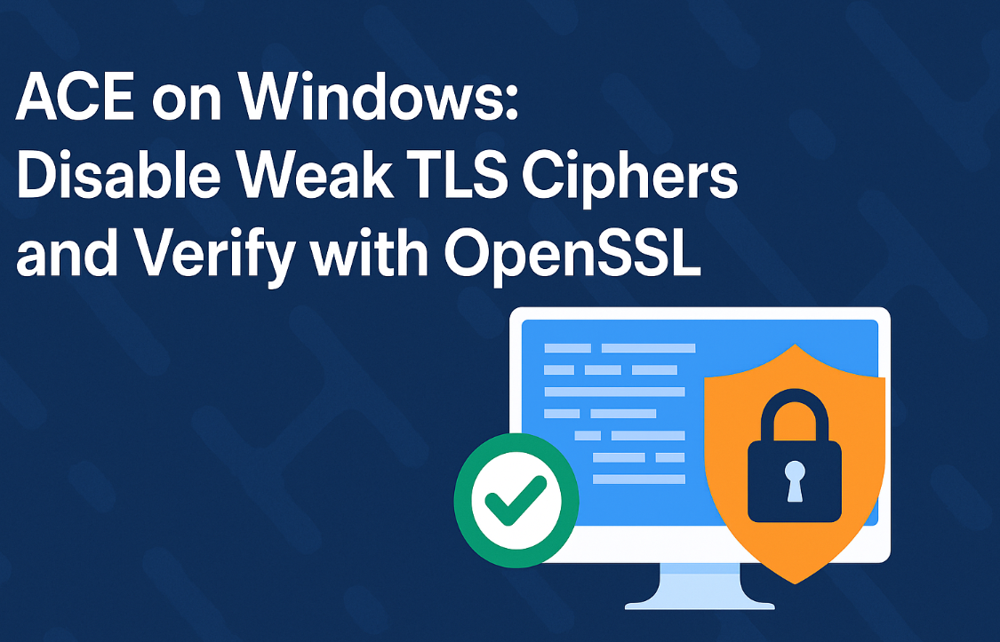
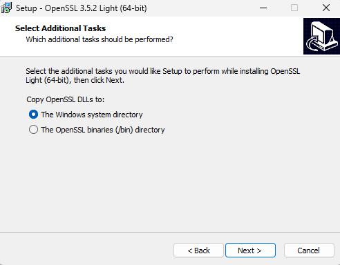

{ .md-banner }

# ACE on Windows:  Disable Weak TLS Ciphers and Verify with OpenSSL

Let’s be real: if your App Connect Enterprise (ACE) instance still accepts weak TLS ciphers, you're inviting problems. 
Here’s how to disable them, verify they’re gone, and avoid getting roasted in your next security audit.

## The Goal
Kill insecure TLS ciphers in ACE. Then prove they’re dead.

This walkthrough configures ACE in both the server and client role, handling inbound and outbound TLS traffic. The `java.security` 
config applies when ACE acts as a client making outbound HTTPS calls, where the server.conf.yaml settings manage the incoming
traffic. So if ACE is calling, or being called by, external APIs, brokers, or cloud endpoints, weak ciphers get blocked. 
That’s exactly what you want.

## Set Up a Test HTTPS Endpoint in ACE
Just need something dumb and HTTPS-enabled to test our changes:
- Use a simple HTTPInput or REST API flow that returns a static response.
- Example: [HelloWorld_https](https://github.com/matthiasblomme/Ace_test_cases/tree/64d32256864391e330d1d1482fd412c80957998e/HelloWorld_https)
- Create a standalone Integration Server (default HTTPS port is 7843).
- Deploy the simple flow to that Integration Server (this starts the https listener)

Verify the endpoint is reachable.
```powershell
> Test-NetConnection localhost -Port 7843

ComputerName     : localhost
RemoteAddress    : ::1
RemotePort       : 7843
InterfaceAlias   : Loopback Pseudo-Interface 1
SourceAddress    : ::1
TcpTestSucceeded : True
```

If that doesn’t work, your setup’s broken. Fix that first.


## Install OpenSSL on Windows
No, not OpenSSH. OpenSSL.
- Download [Win64 OpenSSL v3.5.2 Light](https://slproweb.com/products/Win32OpenSSL.html)
- Or grab the portable ZIP if you're not into installers
- Choose the "Windows system directory" so you can call it from anywhere

- Open a new terminal and check that you have OpenSSL available

```powershell
> openssl version
OpenSSL 3.5.0 8 Apr 2025 (Library: OpenSSL 3.5.0 8 Apr 2025)
```

## Baseline Test 1 — Known Good Cipher
Before locking stuff down, let's prove that a strong cipher still works

```powershell
> $TARGET="localhost:7843"
> openssl s_client -connect $TARGET -tls1_2 -cipher "ECDHE-RSA-AES256-GCM-SHA384" -servername localhost
Connecting to ::1
CONNECTED(00000200)
depth=0 C=US, CN=IBM App Connect Enterprise v13.0 HTTPSConnector self signed, O=IBM, OU=IBM App Connect

...

SSL handshake has read 2457 bytes and written 250 bytes
Verification error: self-signed certificate
---
New, TLSv1.2, Cipher is ECDHE-RSA-AES256-GCM-SHA384
Protocol: TLSv1.2

...
---
```

(press `ctrl + c` to close the sessiong, the openssl command opens a client session when negotiation succeeds)

Wath you can see from the output, the command gives us `New, TLSv1.2, Cipher is ECDHE-RSA-AES256-GCM-SHA384`, showing we 
had a successful TLS handshake. This is our "known good".


## Baseline Test 2 — Known Weak Cipher
Now let's try something weaker, anonymous (no-authentication) cipher suites, that really should not be supported

```powershell
> openssl s_client -connect $TARGET -tls1_2 -cipher "aNULL:@SECLEVEL=0" -servername localhost
Connecting to ::1
CONNECTED(00000200)
---
no peer certificate available
---
No client certificate CA names sent
Peer Temp Key: X25519, 253 bits
---
SSL handshake has read 398 bytes and written 308 bytes
Verification: OK
---
New, TLSv1.0, Cipher is AECDH-AES256-SHA
Protocol: TLSv1.2
Secure Renegotiation IS supported
Compression: NONE
Expansion: NONE
No ALPN negotiated
SSL-Session:
Protocol  : TLSv1.2
Cipher    : AECDH-AES256-SHA
Session-ID: 57BB1C3B2C52C829D5B4D3FEF45944F0EB3A89D71D23A15E4015E6BD15ED454B
Session-ID-ctx:
Master-Key: B2BFD60FD6B55415B644934B00F1CA432BA70C822287545EDD606BEEB21DDD75F0FABBCA5B5C73A13802E66D481AA004
PSK identity: None
PSK identity hint: None
SRP username: None
TLS session ticket lifetime hint: 300 (seconds)
TLS session ticket:
0000 - fd dd 43 12 14 9b b9 66-a2 bc dc d7 bc 8b 9d ca   ..C....f........
0010 - dd 2a e1 48 6f 63 b4 82-2b 50 d7 86 cf fa 0c 42   .*.Hoc..+P.....B
0020 - 59 3c 38 54 49 6d 6c a9-3b 7c de 3c 72 cc 11 58   Y<8TIml.;|.<r..X
0030 - 6f 99 1c be 35 22 7e dc-50 8e 2f 45 b7 4a a4 58   o...5"~.P./E.J.X
    0040 - a7 a4 a7 4a 12 4e fd 41-68 66 57 ff f2 35 fe 65   ...J.N.AhfW..5.e
    0050 - 9e 76 61 00 75 04 2b a6-6d ab c4 13 e2 14 7d 31   .va.u.+.m.....}1
    0060 - d0 a3 09 c7 58 16 ea 4c-06 6b f9 bf 1d ac 60 45   ....X..L.k....`E
    0070 - 51 ab 34 9e eb b9 53 23-f4 df 20 7a df 22 9f e4   Q.4...S#.. z."..
0080 - 27 2c f6 c0 a6 ee 18 cb-43 c7 50 73 10 46 0a 53   ',......C.Ps.F.S
0090 - d7 fb e5 7e 22 00 91 2a-6f 8f a2 52 4d d2 1b 7b   ...~"..*o..RM..{
    00a0 - 1d ca 33 df 2d 35 b6 88-f0 bb f8 79 8a 30 45 3c   ..3.-5.....y.0E<

    Start Time: 1762157276
    Timeout   : 7200 (sec)
    Verify return code: 0 (ok)
    Extended master secret: yes
```

Hm, it succeeds. That is not what you want on a production system (or maybe even any system). Let's fix that


## Why This Still Matters Behind a Firewall

Before you skip the next step, I get it. ACE might be behind SSL-terminating firewalls or proxies, that’s not only normal, 
but should be the standard. However, relying on a single upstream component is a risk. If something manages to bypass 
those layers, ACE still needs to shut these weaknesses. Not all threats come from outside. They can originate from inside 
your network too. Think compromised internal servers, misconfigured apps, or legacy systems...
Your security is only as strong as it's weakest link. Don't let that be ACE!


## Harden ACE by Editing `java.security` (outgoing traffic)
Now that we've got all that foreplay out of the way, let's be serious

Locate your ACE JRE java.security file. The default location is
```
<ACE_INSTALL_DIR>\common\jdk\jre\lib\security\java.security
```

If you used the default ACE install options (like I did), that translates to
```
C:\Program Files\IBM\ACE\13.0.4.0\common\jdk\jre\lib\security\java.security
```

Find the line starting with jdk.tls.disabledAlgorithms, and add your disallowed ciphers there.

The original property (from ACE 13.0.4.0)
```properties
jdk.tls.disabledAlgorithms=SSLv3, TLSv1, TLSv1.1, RC4, DES, MD5withRSA, DH keySize < 1024, DESede, \
    EC keySize < 224, 3DES_EDE_CBC, anon, NULL, ECDH, \
    include jdk.disabled.namedCurves
```

Modified
```properties
jdk.tls.disabledAlgorithms=SSLv3, TLSv1, TLSv1.1, RC4, DES, MD5withRSA, DH keySize < 1024, DESede, \
    EC keySize < 224, 3DES_EDE_CBC, anon, NULL, ECDH, include jdk.disabled.namedCurves, \
    AECDH, TLS_ECDH_anon_*, TLS_DH_anon_*
```

Tips:
- Keep it one logical line or use backslashes for continuation.
- Restart the Integration Server (or Integration Node, if you are using a Node based setup) after changes.


## Harden ACE by Editing the Integration Server (incoming traffic)
I'm addressing the integration server only. If you are running a Node based setup, you have 2 options
- When using the Node-wide listener: make these changes in the `overrides\node.conf.yaml`
- When using embedded listeners: make these changes in the `overrides\server.conf.yaml` (for all those Integration servers that
have incoming traffic, obviously)

Your default `overrides\server.conf.yaml` file has no specifications that relate to allowed ciphers. But the generic
`server.conf.yaml` does, it contains this block:

```yaml
ResourceManagers:
  ...
  HTTPSConnector:
    ...
    #CipherSpec: ''                  # Comma-separated list of allowable ciphers. IANA cipher names are accepted.
                                     # Example: 'TLS_ECDHE_ECDSA_WITH_AES_128_CBC_SHA,TLS_ECDHE_ECDSA_WITH_AES_256_GCM_SHA384'.
```

Let's add this parameter to the  `overrides\server.conf.yaml` and configure it to block those anonymous ciphers

```yaml
ResourceManagers:
  HTTPSConnector:
    ListenerPort: 7843
    CipherSpec: 'TLS_AES_256_GCM_SHA384,TLS_AES_128_GCM_SHA256,TLS_CHACHA20_POLY1305_SHA256,
                  TLS_ECDHE_RSA_WITH_AES_256_GCM_SHA384,TLS_ECDHE_RSA_WITH_AES_128_GCM_SHA256,\
                  TLS_ECDHE_ECDSA_WITH_AES_256_GCM_SHA384,TLS_ECDHE_ECDSA_WITH_AES_128_GCM_SHA256'
```

Unlike the `java.security` where you can block certain ciphers, the `server.conf.yaml` ask you to specify which you do 
want to allow. I prefer the java way, less likely to forget a specific cipher you might need.

## Verify Ciphers Post-Hardening
Time to check if our changes are working. Let's start with the anonymous 

**Blocked examples:**
```powershell
> openssl s_client -connect $TARGET -tls1_2 -cipher "aNULL:@SECLEVEL=0" -servername localhost
Connecting to ::1
CONNECTED(000001F8)
B48C0600:error:0A000410:SSL routines:ssl3_read_bytes:ssl/tls alert handshake failure:ssl\record\rec_layer_s3.c:911:SSL alert number 40
---
no peer certificate available
---
No client certificate CA names sent
---
SSL handshake has read 7 bytes and written 187 bytes
Verification: OK
---
New, (NONE), Cipher is (NONE)
Protocol: TLSv1.2
Secure Renegotiation IS NOT supported
Compression: NONE
Expansion: NONE
No ALPN negotiated
SSL-Session:
Protocol  : TLSv1.2
Cipher    : 0000
Session-ID:
Session-ID-ctx:
Master-Key:
PSK identity: None
PSK identity hint: None
SRP username: None
Start Time: 1762158201
Timeout   : 7200 (sec)
Verify return code: 0 (ok)
Extended master secret: no
---
```

Success! Where we previously allowed the anonymous ciphers, they now result in a clear `tls alert handshake failure`. 

**Allowed example (for control):**
```powershell
> openssl s_client -connect $TARGET -tls1_2 -cipher "ECDHE-RSA-AES256-GCM-SHA384" -servername localhost
Connecting to ::1
CONNECTED(000001F8)
depth=0 C=US, CN=IBM App Connect Enterprise v13.0 HTTPSConnector self signed, O=IBM, OU=IBM App Connect

...

SSL handshake has read 2457 bytes and written 250 bytes
Verification error: self-signed certificate
---
New, TLSv1.2, Cipher is ECDHE-RSA-AES256-GCM-SHA384
Protocol: TLSv1.2

...

---
```

Secure ciphers still work, woulnd't have expected anything else ;) .

**Optional TLS 1.3 control (if enabled):**
```powershell
>  openssl s_client -connect $TARGET -tls1_3 -ciphersuites "TLS_AES_256_GCM_SHA384" -servername localhost

...

New, TLSv1.3, Cipher is TLS_AES_256_GCM_SHA384
Protocol: TLSv1.3

...

---
```


## Keep Your Configuration Under Control
Don't harden one server and forget about the rest. Think disaster recovery. Think rebuilds. Think repeatability. Or simply 
automate your server installs.
What do these have in common? They all need to have a single source of truth for your `java.security` and 
`overrides\server.conf.yaml` files.

So, simply put:
- Store the `java.security` and `overrides\server.conf.yaml` files, or at least the diffs, in version control
- Use pull requests for changes, think Infrastructure as Code (IaaC) and treat this like code.
- Enforce config with Ansible, DSC, ..., or whatever keeps your setup sane

And don't forget, after each update
- Restart the Integration Server
- Verify one of the disabled ciphers

Harden it, test it, version it, automate it. Then sleep better, knowing your runtime environment isn’t the weakest link.

---

## References

* [ACE Test Cases Repo](https://github.com/matthiasblomme/Ace_test_cases)
* [Download OpenSSL for Windows](https://slproweb.com/products/Win32OpenSSL.html)
* [ACE default cipher list](https://www.ibm.com/docs/en/sdk-java-technology/8?topic=suites-cipher)

---

Written by [Matthias Blomme](https://www.linkedin.com/in/matthiasblomme/)

\#IBMChampion \
\#AppConnectEnterprise(ACE) \
\#OpenSSL \
\#Certificates \
\#TLS \
\#HowTo
