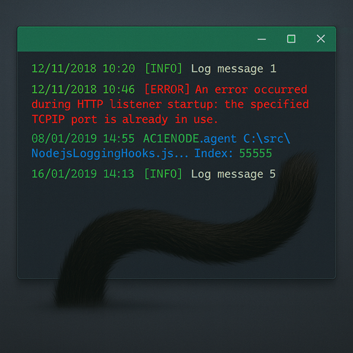
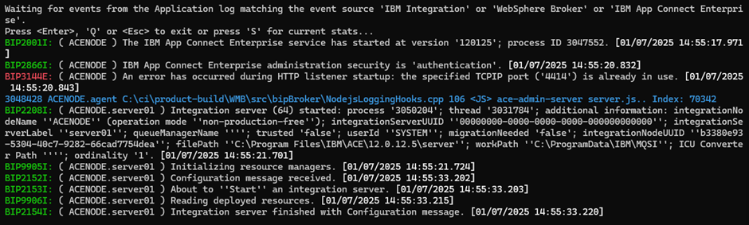
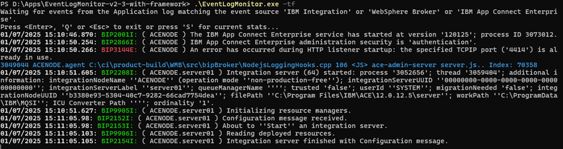
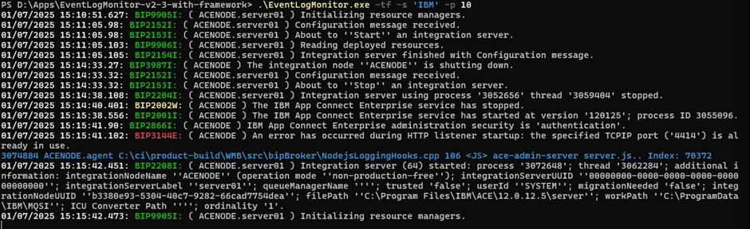
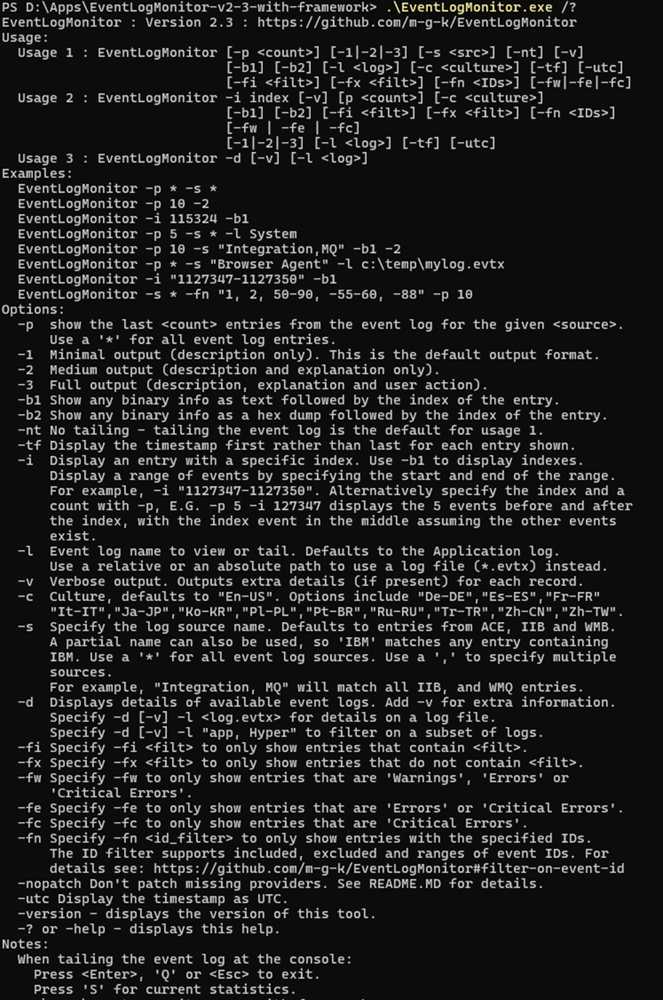

# The EventLogMonitor

Ever stared at the Windows Event Viewer, waiting for errors to show up?  
It shouldn’t feel like searching for a needle in a haystack. It should be smooth, effortless and simple to use.

I can hear all the Linux boys rolling their eyes (I get it, I’d run ACE on Linux, too). But Windows servers are everywhere, 
and for many of us, EventLogMonitor is a game-changer.

Never met EventLogMonitor? You’re not alone, this post is tailor-made for you.


## What it is

EventLogMonitor is `tail -f` for Windows Event Logs — no clicking, no waiting, just live entries. It’s that simple, 
and yes, it really tails.



EventLogMonitor isn’t a one-trick pony. It also gives you:

- **Source selection:** Monitor defaults (IBM Integration, WebSphere Broker, ACE) or any custom log.
- **Event filtering:** Drill down by source name, event ID, or keyword so you only see what matters.
- **Look-back window:** Load the last N entries at startup (`-p N`) to get instant context.
- **Output formatting:** Format timestamps up front (`-tf`), set output level, …


## Getting Started

Launch `EventLogMonitor.exe` with no flags (either from CLI or via double click) and you’ll get:

- **Look-back window:** none
- **Output:** minimal
- **Sources:** IBM Integration, WebSphere Broker, and IBM App Connect Enterprise



Usually that’s enough to catch the basics. Here are the tweaks you’ll use most:

**Putting the timestamp first:**

```bash
EventLogMonitor.exe -tf
```



**Expand monitoring sources and use the history**  
(`-s IBM` picks up any source with “IBM” in its name, `-p 10` preloads the last 10 entries.)

```bash
EventLogMonitor.exe -s IBM -p 10
```



For more details, have a look at the Usage documentation  
or the README in the GitHub repository. *m-g-k* has done a really extensive job describing all the options.



## Download & Install

Grab what you need by downloading the desired binary (with or without .NET Framework) from  
[m-g-k’s EventLogMonitor releases](https://github.com/m-g-k/EventLogMonitor/releases) page,  
or build it directly from the source code, if you so desire.

---

## Resources

- [GitHub: EventLogMonitor](https://github.com/m-g-k/EventLogMonitor)

---

Written by [Matthias Blomme](https://www.linkedin.com/in/matthiasblomme/)

#IBMChampion #AppConnectEnterprise (ACE)
