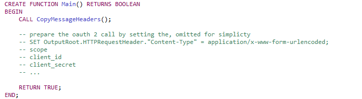

<!--MD_POST_META:START-->

  
2025-08-29 · ⏱ 7 min

  
Share: <a class="post-share post-share-linkedin" href="https://www.linkedin.com/sharing/share-offsite/?url=https%3A%2F%2Fmatthiasblomme.github.io%2Fblogs%2Fposts%2Fflow-order-context-tree%2FStop-Copying-Messages-into-Environment-Use-Context-Tree%2F" target="_blank" rel="noopener" title="Share on LinkedIn">[in]</a>

<!--MD_POST_META:END-->

# Stop Copying Messages into the Environment: Use Context Tree in ACE 13.0.4.0+

## Putting the Message Aside

Imagine this: it's Friday afternoon, and you need to build a flow that forwards JSON messages to an OAuth-protected REST API. 
You think, "I'll need to build the OAuth request message, so let's just set the input aside into the `Environment` and 
pick it up later." You wire up the flow, test with some dummy data, and everything looks fine. Time for the weekend.

But you missed something.

## Flow Setup 1: Using the Environment

Copying an incoming message into the `Environment` feels like the easiest trick in the book. One line of ESQL, job done.
But here's the catch: it's not parser-aware. In certain cases, you get away with it, but when JSON arrays are involved,
things tend to get messy, fast. Arrays collapse into objects, metadata disappears, and suddenly your "quick fix" becomes
a late-night debugging session.

Point in case our demo flow

The input message is stored into the `Environment`, more specifically `Environment.Variables.InputMessage`. And then the 
actual message is restored at the end. 

If we then compare the input vs the output message: 

The token has been added (to the message, for visibility inside the flow exerciser), but you can see that the items array 
has collapsed into a single field containing the last array element.

Want to know more about those troubling JSON Arrays? Have a look at another blog of mine
[Create JSON Arrays in ESQL and Java](https://community.ibm.com/community/user/blogs/matthias-blomme/2025/08/18/create-json-arrays-in-esql-and-java-without-losing)

Copying message data into the `Environment` is fragile. A solution that works most of the time isn't really a solution.

## Flow Setup 1b: Using a BLOB

Sure, you could play it safe by serializing the whole message to a BLOB, stash it in `Environment`, and then reparse it 
when you need it. I mean, that works. But it uses up a lot of resources. Receiving and parsing an input message to JSON, 
reparsing it to BLOB, and writing it to the Environment, reading and reparsing it to BLOB to send it out again. 
There are less resource-intensive ways of achieving the exact same result.

## Flow Setup 2: Using the FlowOrder Node

Up until recently, using the FlowOrder node was the only way I knew that gave consistent results. The setup is rather 
simple, actually, if you think about it. Instead of trying to do everything serially, the FlowOrder allows you to define 
different logical processing branches. Take the flow below as an example.

This flow has two branches: the top handles token requests, the bottom calls the API. You can think of them as two 
separate functions working in sequence, which means they need a way to pass information between them. The cleanest way to 
do that is to put the token into the Environment, since it’s just plain values without parser context attached. I have no 
issue using the Environment, it’s a solid place to keep state, just not for anything that depends on the parser.

The top branch prepares the OAuth request (or it would, if this was not a dummy setup) and stores the received Token into
the `Environment`.

The bottom branch starts from the original input message, adds the token to the Authorization header 
(and body for debugging purposes), and sends out the message to the API endpoint.

If we then compare the input vs the output message:

You can clearly see the intact input message with the added token.

This setup may look a bit more complex, but that’s only on the canvas. In reality, FlowOrder keeps the logic clean: token 
handling in one branch, the original message untouched in the other, with a simple Environment hand-off in between.

## Flow Setup 3: Using Context Trees

FlowOrder works, but ACE 13.0.4.0 introduced something cleaner: the Context tree. It was originally designed to support 
discovery connectors, but it also gives you a sharp way to handle message data in classic ACE flows.

Let's give you some context (pun intended) first. The Context tree is a read-only logical structure that grows as your message passes through the flow. At the start it
only knows about the input node, but each node adds its own payload and metadata. By the end you have a complete picture,
parser context included. The important bit for us: the original payload is always available.

In practice, you don’t need to configure or enable anything special. As soon as you reference the Context tree in ESQL, 
ACE populates it at runtime. That means you can simply grab the payload from the input node and copy it back into OutputRoot, 
then add your token. The flow looks very much like the one we started with:

The difference is in the Compute Nodes. The `PrepareRequest Node` generates the token request, nothing more.  

The `RestoreMsg Node` is the one that calls upon the `Context Tree`. 

Finally, let's compare the input and the output message:

Proper JSON with the added token.

To show how the Context tree builds up, I added a trace node. I wired it to the Input and last Compute Nodes to capture 
the tree at different stages.

The Trace Node configuration:

Immediately after the HTTP Input node, the Context tree only contains information about the Input Node

Further down the flow, you can see the tree filling up with each node:

The green blocks show the nodes you passed with their metadata. The blue Payload blocks show the messages the RestRequest 
node received. The Context tree keeps on building until processing in your flow stops, giving you context about all the nodes 
that came before.

That’s it. No detours, no reparsing, no lost metadata. It gives you the original payload exactly as it came in, parser 
context included. Instead of juggling copies and fighting the toolkit, you just point at the Context tree and move on. 
That is, if you are using ACE 13.0.4.0 or later.

## Choosing the Right Approach

Here’s the deal: each option solves the problem, but not all of them age well.
- Environment copy: quick hack, but parser context gets lost. JSON arrays don’t survive.
- BLOB copy: technically safe, but you pay for it in extra parsing and CPU cycles.
- FlowOrder: keeps the input message intact and gives you transactional control. Slightly busier on the canvas.
- Context tree: the cleanest option if you’re on 13.0.4.0 or later. Parser-aware, lightweight, no juggling, no surprises.

## Closing

Copying messages into the `Environment` is a habit that causes more trouble than it solves. Between arrays breaking and 
extra reparsing, you end up with fragile flows that are harder to scale. Better options exist, so why not use them?

The FlowOrder approach gives you transactional control without mangling the payload. And if you're on ACE 13.0.4.0 or 
newer, the Context tree is the clear winner: parser-aware, lightweight, and even useful outside the shiny discovery 
connectors it was designed for.

So next time you need to hold onto the original message, don't dump it into `Environment`. Use the tools that actually 
keep your data intact.

---

## References

- [ACE Test Cases Repo](https://github.com/matthiasblomme/Ace_test_cases)
- [Context tree](https://www.ibm.com/docs/en/app-connect/13.0.x?topic=assembly-context-tree)
- [Explore the new features in App Connect Enterprise 13.0.4.0](https://community.ibm.com/community/user/blogs/ben-thompson1/2025/06/18/ace-13-0-4-0)

---

Written by [Matthias Blomme](https://www.linkedin.com/in/matthiasblomme/)

\#IBMChampion \
\#AppConnectEnterprise(ACE) \
\#HowTo
