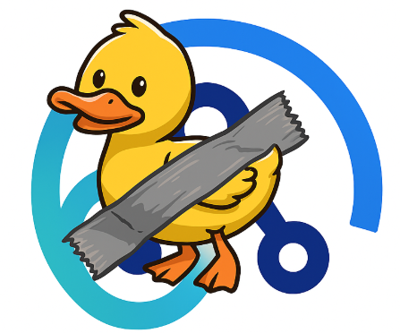
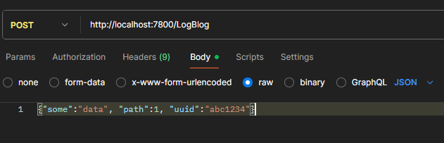
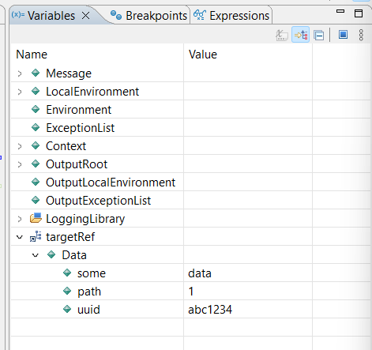
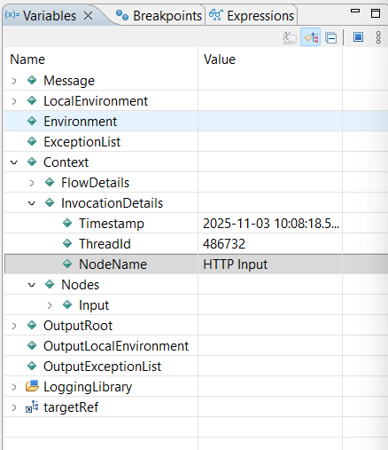
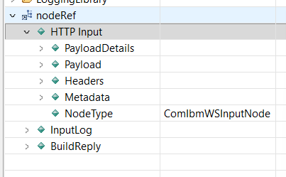
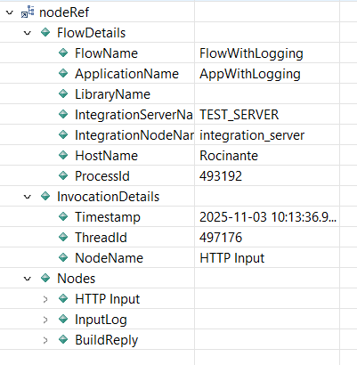
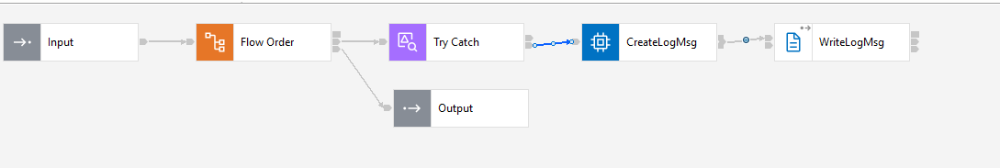
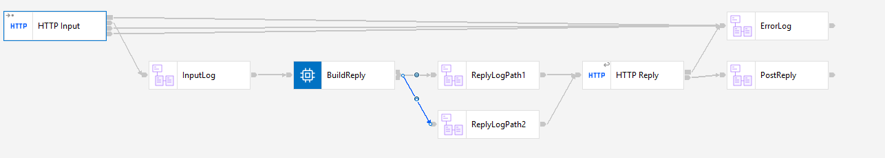
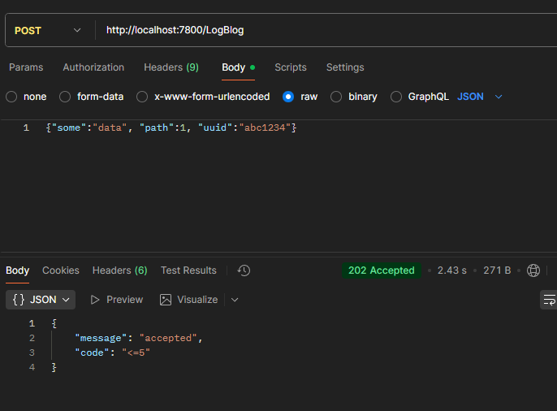
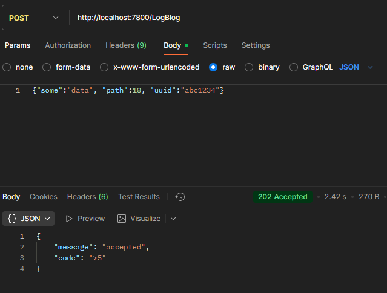

# Creating a generic log node using context trees
[Craig Briscoe](https://community.ibm.com/community/user/profile?UserKey=5d96b50d-de84-4367-828a-16b172c483fe) 
dropped a comment on my last [blog](https://community.ibm.com/community/user/blogs/matthias-blomme/2025/08/29/stop-copying-messages-into-the-environment-use-con)
about using the context tree. Got me thinking.

The ESQL context functions aren’t just useful for payload handling. They also work well for logging. Clean, dynamic, 
and no need to manually wire every bit of metadata into your message.

I know, most of you already have your logging duct-taped together (no offense, duct-tape is criminally underrated). But for 
those who don’t, or if you just want to try something a bit _smarter_, here’s what my twisted brain came up with.

At worst, it’s a cool trick. At best, it’s a logging subflow that gives you full traceability with near-zero effort.

The flow and code used in this demo are all available from my GitHub repo ... . But you will need ACE 13.0.5.0+ for this one.



## The Idea
A generic log node is always useful. Just pass in a status code, message, and UUID. The log fills in the rest: application 
name, flow name, node name, all of it.

The context tree holds that info already. It knows how the flow was triggered and tracks every upstream node that touched 
the message.

Combine the two and you’ve got something pretty damn useful.

## The PoC
For the context tree to be useful in a generic log node, the info I wanted had to actually be accessible. The ESQL 
`Context` correlation name is just a reference to the context tree of the flow or subflow. Inside a subflow, the default 
`Context` has no reference to the real input if that input came from outside the subflow.

That’s where `CONTEXTREFERENCE` comes in. As the name suggests, it gives you access by reference to the broader context 
tree, not just the local one. You can do something like this:

```esql
DECLARE targetRef REFERENCE TO CONTEXTREFERENCE('HTTP Input').Payload;
```

Try that in a subflow, send in a JSON payload, and the debugger shows you the input from the main flow.





Handy, right? Small catch—you need to know the node name. Luckily (and I’m guessing this is by design), the input node 
is part of the context reference even from within a subflow.

Which means this works:



This makes it possible to call the `CONTEXTREFERENCE` with a variable.

```esql
-- get the context tree for the input node, you always have that name
DECLARE nodeRef REFERENCE TO CONTEXTREFERENCE(Context.InvocationDetails.NodeName);
```

Now you’ve got a dynamic reference to whatever input node the main flow used.

Next question: how do you get from that one node to all the others? Since `CONTEXTREFERENCE` returns a reference, you can 
just navigate it like any other. Move up, look around, grab what you need.

```esql
-- move the context tree to the node group
MOVE nodeRef PARENT;
```

This gets you everything from the group of upstream nodes.



One more level up, and you’ve got the full context tree. But I didn’t need that for logging, so I stuck with the node 
group. It had everything I wanted.



## The Log Subflow
Using `CONTEXTREFERENCE`, I built a generic logging subflow. For testing, it just writes to a local file. In a real setup, 
you’d send this to an HTTP endpoint or a log collector—but this demo is local, quick, and dirty.

And yes, it’s a basic flow. You could expand it with transaction handling or proper file output error logic. Go wild if 
you want. This is just the skeleton to get my point across.

Here’s what’s in the subflow:
- Flow Order node: keeps the input message untouched with minimal code
- Try Catch node: makes sure logging failures don’t interfere with flow execution
- CreateLogMsg compute node: grabs context info and builds the log payload
- WriteLogMsg file output node: writes the log entry to disk
 


Let’s break down the code.

First, get a reference to the main flow’s context tree from inside the subflow:
```esql
CALL CopyMessageHeaders();
		
-- get the context tree for the input node, you always have that name
DECLARE nodeRef REFERENCE TO CONTEXTREFERENCE(Context.InvocationDetails.NodeName);

-- move the context tree to the node group
MOVE nodeRef PARENT;
```

Then pull info on the previous node and build a flow path string:
```esql
-- get the previous node info
DECLARE previousNodeName CHARACTER FIELDNAME(nodeRef.*[<]);
DECLARE previousNodeType CHARACTER nodeRef.*[<].NodeType;
DECLARE previousNodeCount INTEGER CARDINALITY(nodeRef.*[]);

-- build the flow path info
DECLARE flowPath CHARACTER '';
MOVE nodeRef FIRSTCHILD;
WHILE LASTMOVE(nodeRef) DO
    SET flowPath = flowPath || ' - ' || FIELDNAME(nodeRef);
    MOVE nodeRef NEXTSIBLING;
END WHILE;
SET flowPath = TRIM(LEADING ' - ' FROM flowPath);

-- log flow path structure
CREATE LASTCHILD OF OutputRoot DOMAIN 'JSON';
SET OutputRoot.JSON.Data.path.PREVIOUS_NODE_NAME = previousNodeName;
SET OutputRoot.JSON.Data.path.PREVIOUS_NODE_TYPE = previousNodeType;
SET OutputRoot.JSON.Data.path.PREVIOUS_NODE_COUNT = previousNodeCount;
SET OutputRoot.JSON.Data.path.MSG_PATH = flowPath;
```

Next, log the user-defined properties (status, message, UUID):
```esql
-- log generics
SET OutputRoot.JSON.Data.STATUS = Status;
SET OutputRoot.JSON.Data.MESSAGE = Message;
IF STARTSWITH(Uuid, '$') THEN
    DECLARE uuidTrimmed CHARACTER TRIM(LEADING '$' FROM Uuid);
    SET OutputRoot.JSON.Data.UUID = EVAL(uuidTrimmed);
ELSE
    SET OutputRoot.JSON.Data.UUID = Uuid;
END IF;
```

Then log some meta info from the context: 
(you could also get this from the `CONTEXTREFERENCE`)
```esql
-- log meta flow info
SET OutputRoot.JSON.Data.meta.TIME = Context.InvocationDetails.Timestamp;
SET OutputRoot.JSON.Data.meta.NODE = Context.FlowDetails.IntegrationNodeName;
SET OutputRoot.JSON.Data.meta.SERVER = Context.FlowDetails.IntegrationServerName;
SET OutputRoot.JSON.Data.meta.APP = Context.FlowDetails.ApplicationName;
SET OutputRoot.JSON.Data.meta.FLOW = Context.FlowDetails.FlowName;
SET OutputRoot.JSON.Data.meta.TYPE = CONTEXTINVOCATIONNODE().NodeType;
```

And finally, log the payload and any error details:
```esql
-- log request body
IF Context.Nodes.Input.PayloadDetails.Domain = 'JSON' THEN	
    SET OutputRoot.JSON.Data.PAYLOAD = Context.Nodes.Input.Payload.Data;
ELSE
    SET OutputRoot.JSON.Data.PAYLOAD = CAST(Context.Nodes.Input.Payload.BLOB AS CHARACTER);
END IF;

-- log error
IF CARDINALITY(InputExceptionList.*[]) > 0 THEN
    DECLARE errorNumber INTEGER 0;
    DECLARE errorText CHARACTER '';
    CALL getLastExceptionDetail(InputExceptionList, errorNumber, errorText);
    SET OutputRoot.JSON.Data.ERROR_CODE = errorNumber;
    SET OutputRoot.JSON.Data.ERROR_MSG = errorText;		
END IF;
```

It’s simple. It’s reusable. And it gives you proper logs with clean structure, no hacks, no hardcoding.

> Sidenote:
> Although you can get the information of the main flow this way, if you also want to log the previous nodes from the
> subflow, you would need parse the subflow Context tree as well.
> Putting the log node in a subflow still worked for me, but in my solution you only get the main flow nodes in the MSG_PATH. 

## The Demo
Let's put it all together. I've created a demo flow that takes an HTTP Input message, routes the message over 2 different
flow paths based on the message content, and send a 202 reply back.



Putting a basic message through Path1



Gives me the following 3 log entries

```json lines
{"path":{"PREVIOUS_NODE_NAME":"HTTP Input","PREVIOUS_NODE_TYPE":"ComIbmWSInputNode","PREVIOUS_NODE_COUNT":1,"MSG_PATH":"HTTP Input"},"STATUS":"INFO","MESSAGE":"Message Received","UUID":"abc1234","meta":{"TIME":"2025-11-03 10:51:23.538","NODE":"integration_server","SERVER":"TEST_SERVER","APP":"AppWithLogging","FLOW":"FlowWithLogging","TYPE":"ComIbmWSInputNode"},"PAYLOAD":{"some":"data","path":1,"uuid":"abc1234"}}
{"path":{"PREVIOUS_NODE_NAME":"BuildReply","PREVIOUS_NODE_TYPE":"ComIbmComputeNode","PREVIOUS_NODE_COUNT":3,"MSG_PATH":"HTTP Input - InputLog - BuildReply"},"STATUS":"INFO","MESSAGE":"Reply build","UUID":"abc1234","meta":{"TIME":"2025-11-03 10:51:23.538","NODE":"integration_server","SERVER":"TEST_SERVER","APP":"AppWithLogging","FLOW":"FlowWithLogging","TYPE":"ComIbmWSInputNode"},"PAYLOAD":{"message":"accepted","code":"<=5"}}
{"path":{"PREVIOUS_NODE_NAME":"HTTP Reply","PREVIOUS_NODE_TYPE":"ComIbmWSReplyNode","PREVIOUS_NODE_COUNT":5,"MSG_PATH":"HTTP Input - InputLog - BuildReply - ReplyLogPath1 - HTTP Reply"},"STATUS":"INFO","MESSAGE":"Reply send","UUID":"abc1234","meta":{"TIME":"2025-11-03 10:51:23.538","NODE":"integration_server","SERVER":"TEST_SERVER","APP":"AppWithLogging","FLOW":"FlowWithLogging","TYPE":"ComIbmWSInputNode"},"PAYLOAD":{"message":"accepted","code":"<=5"}}
```

As you can see, each log line has a more extended MSG_PATH
- HTTP Input
- HTTP Input - InputLog - BuildReply
- HTTP Input - InputLog - BuildReply - ReplyLogPath1 - HTTP Reply

If I send data to use the second flow path, you will see _ReplyLogPath2_ in the third log line.



```json lines
{"path":{"PREVIOUS_NODE_NAME":"HTTP Input","PREVIOUS_NODE_TYPE":"ComIbmWSInputNode","PREVIOUS_NODE_COUNT":1,"MSG_PATH":"HTTP Input"},"STATUS":"INFO","MESSAGE":"Message Received","UUID":"abc1234","meta":{"TIME":"2025-11-03 10:53:41.316002","NODE":"integration_server","SERVER":"TEST_SERVER","APP":"AppWithLogging","FLOW":"FlowWithLogging","TYPE":"ComIbmWSInputNode"},"PAYLOAD":{"some":"data","path":10,"uuid":"abc1234"}}
{"path":{"PREVIOUS_NODE_NAME":"BuildReply","PREVIOUS_NODE_TYPE":"ComIbmComputeNode","PREVIOUS_NODE_COUNT":3,"MSG_PATH":"HTTP Input - InputLog - BuildReply"},"STATUS":"INFO","MESSAGE":"Reply build","UUID":"abc1234","meta":{"TIME":"2025-11-03 10:53:41.316002","NODE":"integration_server","SERVER":"TEST_SERVER","APP":"AppWithLogging","FLOW":"FlowWithLogging","TYPE":"ComIbmWSInputNode"},"PAYLOAD":{"message":"accepted","code":">5"}}
{"path":{"PREVIOUS_NODE_NAME":"HTTP Reply","PREVIOUS_NODE_TYPE":"ComIbmWSReplyNode","PREVIOUS_NODE_COUNT":5,"MSG_PATH":"HTTP Input - InputLog - BuildReply - ReplyLogPath2 - HTTP Reply"},"STATUS":"INFO","MESSAGE":"Reply send","UUID":"abc1234","meta":{"TIME":"2025-11-03 10:53:41.316002","NODE":"integration_server","SERVER":"TEST_SERVER","APP":"AppWithLogging","FLOW":"FlowWithLogging","TYPE":"ComIbmWSInputNode"},"PAYLOAD":{"message":"accepted","code":">5"}}
```

## The Conclusion
The Context tree is a very usefull addition to the set of logical trees. Not only for handling payloads (as I've addressed
in one of my previous blogs), but also for capturing/tracking information about your flow execution.

It might be worth revisiting some integration solutions you have running for ages and see if they can't benefit from
using the Context tree, in one way or another.

Have a look, run my demo and feel free to update my logging subflow. Maybe we can make it a community supported log
solution ;)

---

## References

* [Stop Copying Messages into the Environment: Use Context Tree in ACE 13.0.4.0+](https://community.ibm.com/community/user/blogs/matthias-blomme/2025/08/29/stop-copying-messages-into-the-environment-use-con)
* [Introducing Context Trees in IBM App Connect Enterprise 13.0.5.0](https://community.ibm.com/community/user/blogs/sanjay-nagchowdhury/2025/10/22/introducing-context-trees-in-ibm-app-connect-enter)
* [Explore the new features in App Connect Enterprise 13.0.5.0](https://community.ibm.com/community/user/blogs/ben-thompson1/2025/09/25/ace-13-0-5-0)
* [CONTEXTREFERENCE](https://www.ibm.com/docs/en/app-connect/13.0.x?topic=functions-contextreference-function)
* [Context tree](https://www.ibm.com/docs/en/app-connect/13.0.x?topic=assembly-context-tree)

---

For more integration tips and tricks, visit [Integration Designers](https://integrationdesigners.com/blog/) and check out our other blog posts.

---

Written by [Matthias Blomme](https://www.linkedin.com/in/matthiasblomme/)

\#IBMChampion \
\#AppConnectEnterprise(ACE) \
\#HowTo \
\#ContexTree
