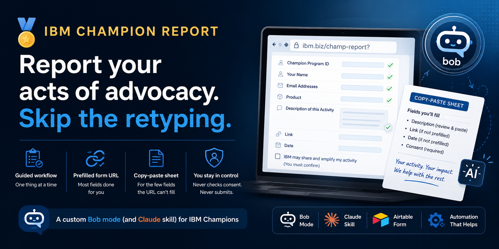
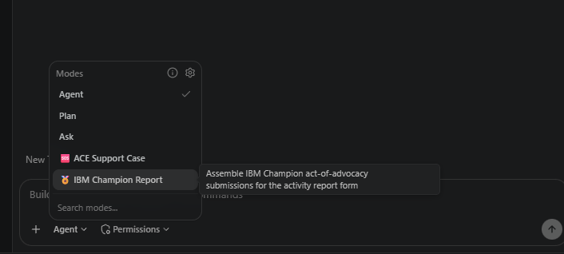
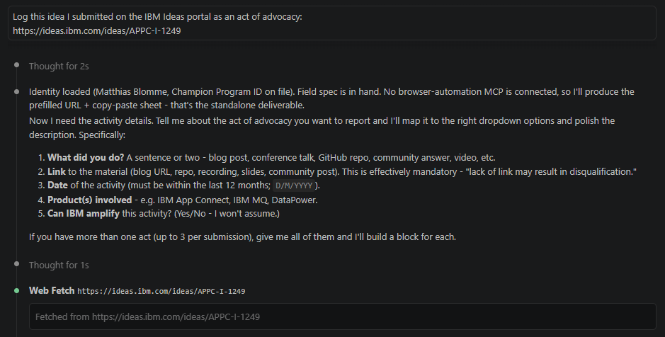
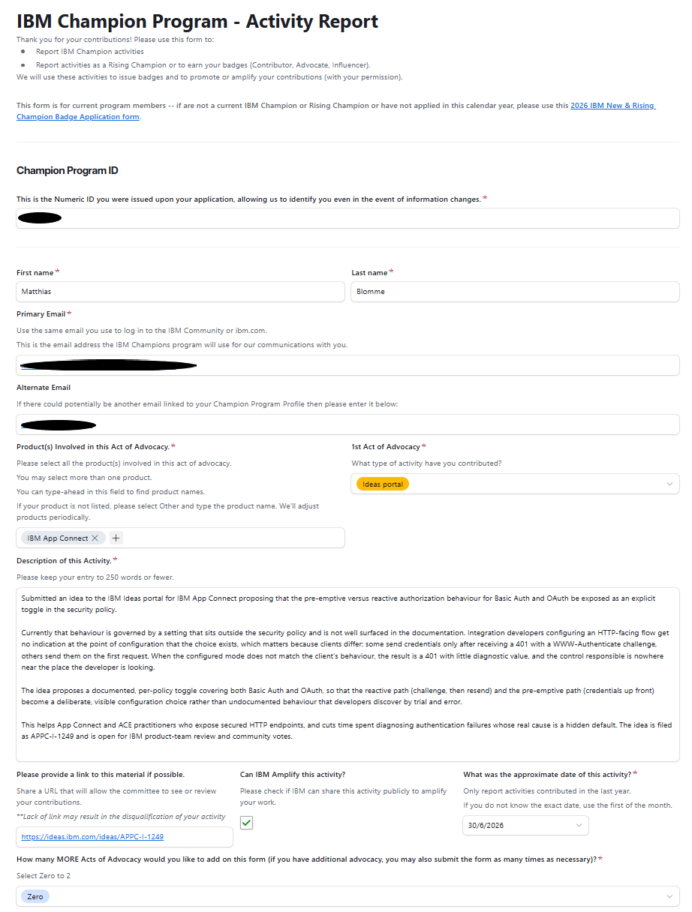
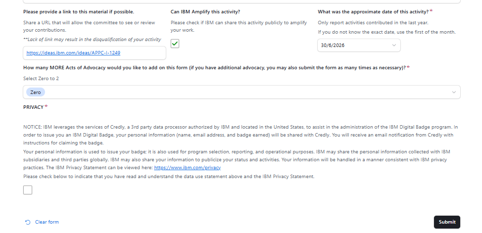

{ .md-banner }

<!--MD_POST_META:START-->
<div class="md-post-meta">
  <div class="md-post-meta-left">2026-06-30 · ⏱ 11 min</div>
  <div class="md-post-meta-right"><span class="post-share-label">Share:</span> <a class="post-share post-share-linkedin" href="https://www.linkedin.com/sharing/share-offsite/?url=https%3A%2F%2Fmatthiasblomme.github.io%2Fblogs%2Fposts%2Fibm-champion-report%2Fibm-champion-report%2F" target="_blank" rel="noopener" title="Share on LinkedIn">[<span class="in">in</span>]</a></div>
</div>
<hr class="md-post-divider"/>
<div class="md-post-tags"><span class="md-tag">bob</span> <span class="md-tag">ibm-champion</span> <span class="md-tag">airtable</span> <span class="md-tag">claude</span> <span class="md-tag">automation</span></div>
<!--MD_POST_META:END-->

# Reporting IBM Champion activity with a custom Bob mode and Claude skill

You don't _have_ to report your acts of advocacy to the IBM Champion program. Blog posts, talks, videos, ideas, code, the lot. But report nothing, and you're not guaranteed to stay a Champion, so it's for your own good.

The reporting happens on an Airtable form behind ibm.biz/champ-report. It asks for your Champion Program ID, your name, two email addresses, a product from a dropdown with a few hundred entries, a description with a word limit, a link, a date, and a consent box. None of it is difficult. It's just a lot to fill in from scratch a few times a year, and the details are easy to forget in between.

So I put it in a skill/mode.

> "Challenge accepted."

If you want to give it a go, it's in the same repo as my ACE Support Skill: [github.com/matthiasblomme/bobmodes](https://github.com/matthiasblomme/bobmodes). Public, so you can grab it too.

## What it actually does

Simple, you gather some of your personal details in a private `.env` file, that file is gitignored, best to keep it that way.

```
CHAMPION_PROGRAM_ID=...
FIRST_NAME=...
LAST_NAME=...
PRIMARY_EMAIL=...
ALTERNATE_EMAIL=...
```

And simply tell it what you did. It assembles the whole submission and hands you two things: a prefilled form URL, and a copy-paste sheet for the few fields the URL can't fill.

It is explicitly prohibited from doing 2 things:

- filling in the consent box
- submitting the form

That feels like the bit a human should be in the loop for. But if you really wanted to, changes are only a git fork away.

For the activity itself it walks through the following sections, one thing at a time, and if some of these are not clear from your input, you will be prompted on what to choose:

- what you did, enough to write a description and pick the type
- the act-of-advocacy type, mapped to the exact dropdown entry
- the product(s) involved
- a link, which is effectively mandatory ("Lack of link may result in the disqualification of your activity", says the form)
- the date
- whether IBM may amplify it

Then it drafts the "Description of this Activity" for someone who wasn't there, keeps it under the 250-word limit, and tells you the word count. At the end you get the URL and the sheet.

## How it's wired

The mode folder is small:

```
ibm-champion-report/
├── .bobmodes                # the Bob mode definition
├── SKILL.md                 # the same workflow, for Bob 2.0 and Claude Code
├── .env.sample              # copy to .env, fill once, stays private
└── references/
    └── form_fields.md       # the verified field spec: every field, every prefill param, the full option lists
```

The `.bobmodes` (or `SKILL.md` in Bob 2.0) file is the part Bob reads: a slug, a name, when to trigger, which tools it gets, and the workflow.

```yaml
customModes:
  - slug: ibm-champion-report
    name: 🏅 IBM Champion Report
    description: >-
      Use this when reporting an IBM Champion act of advocacy: a blog, talk,
      video, idea, or code contribution on the activity report form...
    roleDefinition: >-
      You help report an IBM Champion act of advocacy. Identity comes from
      .env, never from chat. You build a prefilled URL plus a copy-paste sheet...
    whenToUse: >-
      Use this mode when the user wants to report or register an IBM Champion
      activity, or mentions ibm.biz/champ-report...
    groups:
      - read
      - - edit
        - fileRegex: (\.env(\.sample)?|references/.*\.md|\.md)$
          description: Read identity, read the field reference, write the field sheet
      - command
    customInstructions: >-
      Read references/form_fields.md first. Pull identity from .env. Gather the
      activity, draft the description under 250 words, build the prefilled URL
      and the sheet. Never tick consent, never submit.
```

The `groups` block keeps it on a short leash: it can read, run commands, and only write `.env`, the field reference, and the field sheet. It is not going to wander off and edit anything else while you report a blog post.

The real reference is `references/form_fields.md`. That is where the boring, exact knowledge lives: which field prefills by name, which only prefills by an internal ID, which can't be prefilled at all, the date format, and the full dropdown lists. Working out which is which took some trial and error.

## Getting the prefill to actually work

Airtable prefills a form from query params on a plain GET, `prefill_<Field Name>=value`. I built the URL, opened it, and half the fields were empty. No error, no warning, just blank boxes.

`<Field Name>` turns out to be the column name in the underlying table, not the label on the form. This form relabels things, so the obvious params point at columns that aren't there.

So I went through it field by field to see what actually lands. The identity fields were fine. First name, Last name, Primary Email and Alternate Email all prefill by their label, because for those the label happens to match the column underneath.

The Champion Program ID does not, and that's the one number you most want filled in so you stop copy-pasting it. Neither does the date. For both, the real column name isn't exposed anywhere on the public form, and the only thing that works is the internal field ID:

```
prefill_fldt6UIOXVxQBNSgl=20240000
```

That one is the Champion ID, catchy name, right? The date takes an ID of its own and wants `D/M/YYYY`, leading zeros optional.

The truth is out there, apparently.

The link is the one that beat me. No label works, no field ID is exposed, nothing prefills it, so the mode leaves it as a manual paste. Worth knowing, since a missing link is the one thing the form warns may disqualify your activity.

The rest comes down to matching what the dropdowns expect. Single-select values have to be exact: "Write a Blog or Article", which is what I would have typed, isn't an option, while "Blog or Article" is, and "Blog on IBM property" if your blog sits on community.ibm.com. The product list runs to 516 entries with no "App Connect Enterprise" among them, the closest being "IBM App Connect". You would never know without opening the dropdown and reading all of it, so the mode did that once and wrote the whole list down.

One last thing, easy to miss: the form asks how many more activities you want to add after the first, and defaults that to 1, not Zero. Report a single blog post and stop, and it keeps a second, empty activity open behind you.

All of that lives in `form_fields.md` now, so the mode builds a URL out of params that actually land instead of ones that just look right.

## Getting it into Bob - bobmodes

Custom modes are imported per project. The repo ships a small PowerShell importer that scans a source path for `.bobmodes` files and merges them into a target project's `.bob/custom_modes.yaml`, skipping any mode already in there.

```powershell
git clone https://github.com/matthiasblomme/bobmodes.git
cd bobmodes
.\scripts\Import-BobModes.ps1 -SourcePath ".\bobmodes" -TargetProjectPath "D:\Projects\YourProject"
```

Reload the VS Code window (`Ctrl + Shift + P`, then `Reload Window`) and **🏅 IBM Champion Report** shows up in the dropdown with a `/ibm-champion-report` command.




## Getting it into Bob - SKILL.md

In Bob 2.0 the entry point is `SKILL.md`, and getting it in is simpler. No importer, no merging into a YAML file. You drop the folder where Bob looks and it finds it.

There are two places it looks:

```
<project>/.bob/skills/ibm-champion-report/    # this project only
~/.bob/skills/ibm-champion-report/            # everywhere
```

If the same skill name sits in both, the project one wins.

What makes it a skill is the frontmatter at the top of `SKILL.md`:

```yaml
---
name: ibm-champion-report
description: Use this skill when the user wants to report or register an IBM
  Champion activity, an "act of advocacy", on the activity report form...
---
```

The `description` is the part doing the work. Bob reads it to decide whether your request belongs to this skill, so it spells out the phrasings you would actually type: report my IBM Champion activity, log an act of advocacy, fill in the champ-report form. Everything under the frontmatter is what it follows once it fires.

The `references/` folder comes along with it. None of that sits in the conversation until the skill actually fires, which is how a 516-entry product list can live in there without getting in the way.

Same file works as a Claude Code skill. That one goes in `~/.claude/skills/`.

## Using it

You describe the activity. I use it for my own reports, so it gets tested the honest way, on me before anyone else. Most recently an idea I submitted on the IBM Ideas portal:

```
Log this idea I submitted on the IBM Ideas portal as an act of advocacy:
https://ideas.ibm.com/ideas/APPC-I-1249
```

It pulled my identity from `.env`, set the type to Ideas portal, the product to IBM App Connect, drafted a description under the word limit, and handed back a URL that fills eight fields the moment you open it: the ID, name, both emails, the activity type, the product, and the date. Then a short sheet for the five it can't prefill: the description to paste, the link, the amplify box, how many more acts you're adding, and the consent.




You open the URL, paste the description and link, tick what you mean to tick, and submit. The retyping is gone. What's left is the part that actually needs a human: deciding the thing is worth reporting, and agreeing to the privacy terms.



And the PRIVACY checkbox remains unchecked.



## Letting it fill the form

The URL and the sheet are the reliable path, and for a while that was the whole thing. Then I gave it a browser to drive.

If a browser MCP is hooked up, the mode goes further. It opens the prefilled URL, then types in the fields the URL can't reach: the description, the link, and the amplify box if you said yes. Same hard line as before. It stops at the consent checkbox and it does not submit. That click stays yours.

Two things made this less obvious than "just type the fields in".

It matches fields by their label, not their position on screen. The moment the description box fills, the whole block below it slides down about 50 pixels, so anything aimed at a coordinate from a second ago lands in empty space. The link goes nowhere, the checkbox stays unticked, and nothing errors to tell you. So it finds each field by name and works from that.

And it wants your actual logged-in Chrome, not a clean one. The form sits behind ibm.biz, and a fresh profile walks straight into a login wall. An extension driving the Chrome you're already signed into skips that.

When it's done it reads every field back, tells you what took and what didn't, and leaves the form open. You look it over, tick consent, submit.

## Wrap up

It's in the same repo as my ACE Support Skill. The form is still the form, I just stopped filling it in by hand. And I now know more about Airtable's prefill internals than I ever wanted to, which is apparently what it takes to not retype a Champion ID four times a year.

Let it drive the browser, or take the sheet and fill the form in yourself. Your choice. Either way it stops one click short of done, which is exactly where it should stop.

---

Written by [Matthias Blomme](https://www.linkedin.com/in/matthiasblomme/)

\#IBMChampion \
\#Bob
