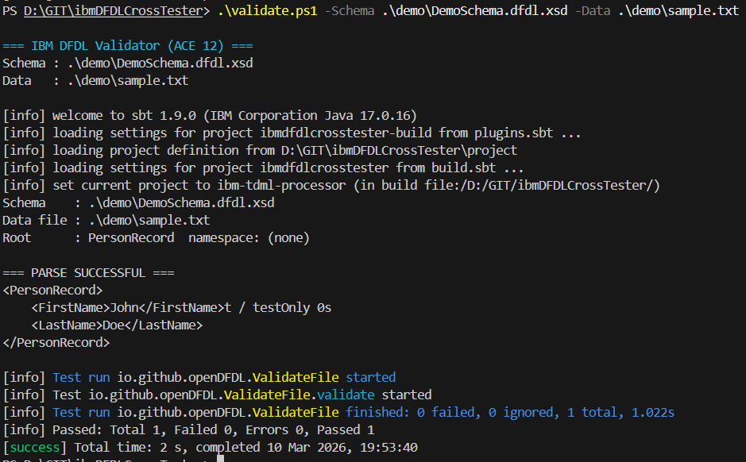
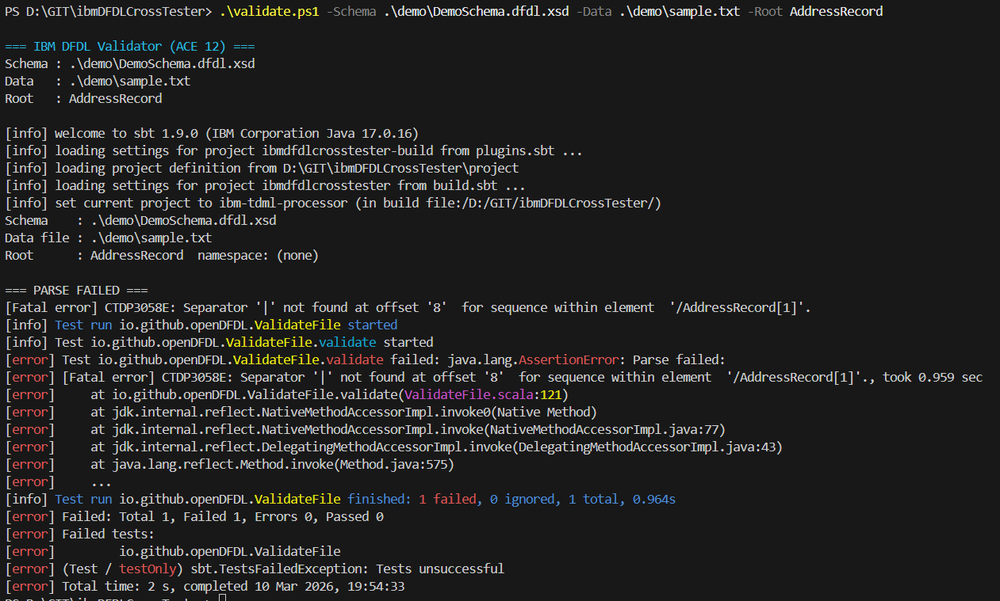
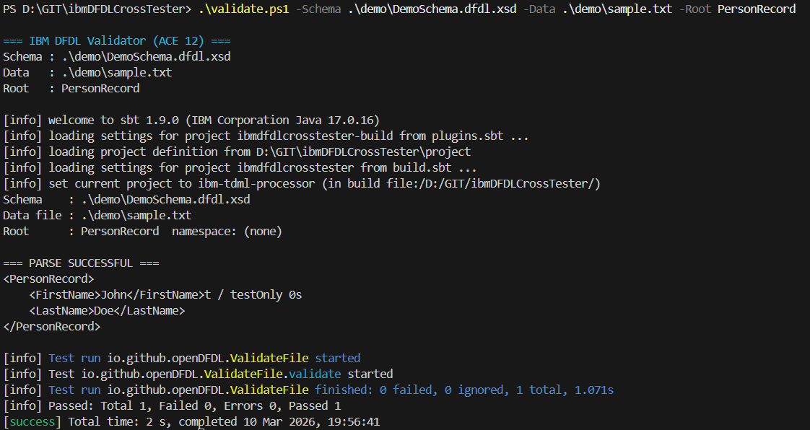
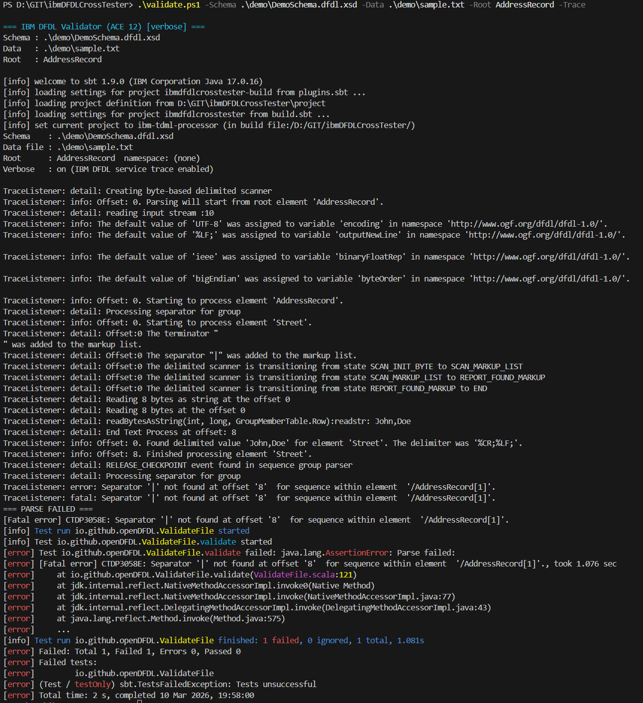
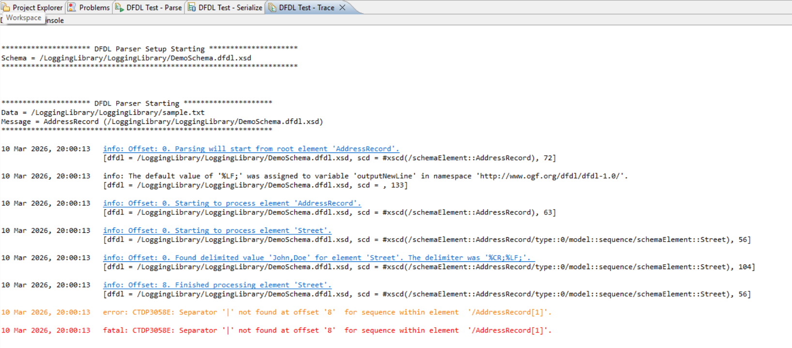

{ .md-banner }

<!--MD_POST_META:START-->

  
2026-03-10 · ⏱ 7 min

  
Share: <a class="post-share post-share-linkedin" href="https://www.linkedin.com/sharing/share-offsite/?url=https%3A%2F%2Fmatthiasblomme.github.io%2Fblogs%2Fposts%2Fibm-dfdl-tester%2Fibm-dfdl-tester%2F" target="_blank" rel="noopener" title="Share on LinkedIn">[in]</a>

<!--MD_POST_META:END-->

# Validate a DFDL schema outside the toolkit

This started with a fairly practical requirement: validate a DFDL schema with IBM DFDL, but outside the Toolkit. That makes local testing easier, and it also makes the same flow easier to reuse in a pipeline later.

The setup I ended up using is `ibmDFDLCrossTester`. It supports more than I needed, but the part I was interested in was the direct IBM DFDL validation flow: give it a schema, give it input data, and check the parse result.

The project already provided the base for that. I built on that by adding simpler setup and validation scripts, and by updating the project to support ACE 12 and 13, so getting from schema to parse result takes a lot less manual work.

## One-time setup: populate the IBM jars

One part of the setup needs to happen once up front, unless you switch environments or ACE versions.

Because IBM DFDL is bundled with ACE, the required jars are not available as regular project dependencies. To make them usable from the test project, I added a setup script that copies the required runtime jars into `lib/` and the IBM sample resources into `src/test/resources/`.

For `sbt`, a normal install works, but a portable install is fine as well. The only real requirement is that the scripts can find `sbt.bat`, either on `PATH` or via an explicit path.

You can run the setup script like this:

`.\setup-ace-jars.ps1`

`.\setup-ace-jars.ps1 -AceVersion 13`

`.\setup-ace-jars.ps1 -AcePath "C:\Program Files\IBM\ACE\12.0.12.17"`

That gives the project the IBM bits it needs locally, without having to keep reaching back into the ACE installation every time you run a test. In practice, it is just a small bit of bootstrapping to make the actual validation flow easier to use.

## Validate a schema and data file

Once the IBM jars are in place, the actual validation flow is straightforward.

Point `validate.ps1` at your schema and data file, and it runs the parse through IBM DFDL.

`.\validate.ps1 -Schema "C:\path\to\MySchema.xsd" -Data "C:\path\to\mydata.txt"`

Under the hood, the script takes care of a few details for you. It resolves the Java 17 installation from ACE, checks the schema for a doc-root annotation to auto-detect the root element, and if the schema imports `IBMdefined/RecordSeparatedFieldFormat.xsd` through a relative path, it copies that folder next to the schema so the import resolves cleanly. After that, it compiles the schema with IBM DFDL and parses the data file.

When the parse succeeds, it prints the XML infoset. When it fails, it returns a clear error message and a non-zero exit code, which also makes it usable in a pipeline without extra wrapping around it.

If the schema has multiple possible root elements and the auto-detection picks the wrong one, you can pass `-Root` explicitly.

`.\validate.ps1 -Schema "..." -Data "..." -Root "MyRootElement"`

## When the parse error is not enough

A failed parse will usually give you the final error, but not always enough detail to see where things first started to go wrong.

If you want the same kind of detailed parse information you would normally inspect in the Toolkit, use `-Trace`.

`.\validate.ps1 -Schema "..." -Data "..." -Trace`

With `-Trace`, IBM DFDL writes its full service trace to stderr before the summary output. That includes the event level, any error code, the byte offset, and the schema location involved. In practice, it gives you the useful parser diagnostics without forcing you back into the Toolkit just to see what went wrong.

The `error:` lines are usually the ones worth looking at first. They tell you which schema element failed to match and why, which is usually the fastest route to understanding whether the problem is in the schema or the input data.

One minor detail: the switch is called `-Trace` rather than `-Verbose`, because `-Verbose` is already a reserved PowerShell common parameter.

## CLI parameters at a glance

Since `validate.ps1` is the main feature here, it is worth listing the available parameters in one place.

- `-Schema <path>`: path to the DFDL schema file to compile
- `-Data <path>`: path to the input data file to parse
- `-Root <name>`: force a specific root element instead of relying on auto-detection
- `-AceVersion 12|13`: select the ACE version by number
- `-AcePath <path>`: full path to the ACE installation root, overrides `-AceVersion`
- `-SbtPath <path>`: full path to `sbt.bat`
- `-Trace`: enable IBM DFDL full service trace output to stderr

Most of the time, only `-Schema` and `-Data` are required. The others are there for the cases where auto-detection or default paths are not enough.

A few examples:

`.\validate.ps1 -Schema ".\MySchema.xsd" -Data ".\sample.dat"`

`.\validate.ps1 -Schema ".\MySchema.xsd" -Data ".\sample.dat" -Root "MyRootElement"`

`.\validate.ps1 -Schema ".\MySchema.xsd" -Data ".\sample.dat" -AceVersion 13`

`.\validate.ps1 -Schema ".\MySchema.xsd" -Data ".\sample.dat" -SbtPath "D:\tools\sbt\bin\sbt.bat"`

`.\validate.ps1 -Schema ".\MySchema.xsd" -Data ".\sample.dat" -Trace`

## A few schema gotchas

There are a few details worth calling out because they can cause failures that are not immediately obvious when you first run a schema through IBM DFDL.

**Root element annotation**

If you want the root element to be picked up automatically, mark it explicitly with `ibmSchExtn:docRoot="true"`. Without that, you may need to pass `-Root` every time.

**`padChar` is not enough**

IBM DFDL does not accept the generic `dfdl:padChar` property on `dfdl:format`. It expects the explicit property name `dfdl:textStringPadCharacter` instead. If schema compilation fails around padding, that is a good place to look first.

**`IBMdefined/` imports**

If the schema imports `IBMdefined/RecordSeparatedFieldFormat.xsd`, that file needs to be available next to the schema. The validator handles this automatically, as long as you already ran `setup-ace-jars.ps1` so the required resources were copied into the project first.

## Closing

This setup is really about one thing: making IBM DFDL schema validation easier to run outside the Toolkit.

That gives you a simpler local test flow, and it gives you something that can be used in a pipeline without having to rethink the whole process.

That was the part I was interested in, and the part I ended up improving with the setup and validation scripts.

Happy testing.
