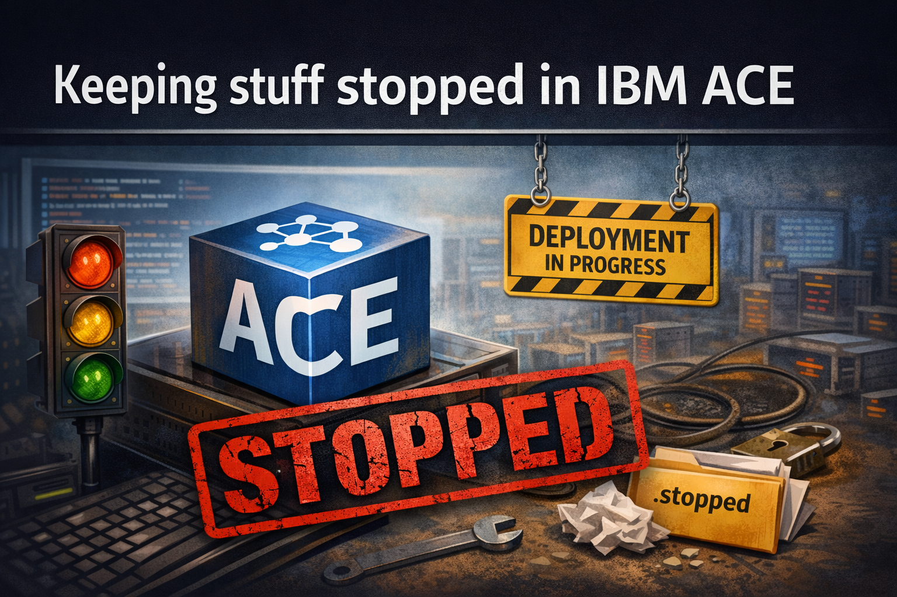
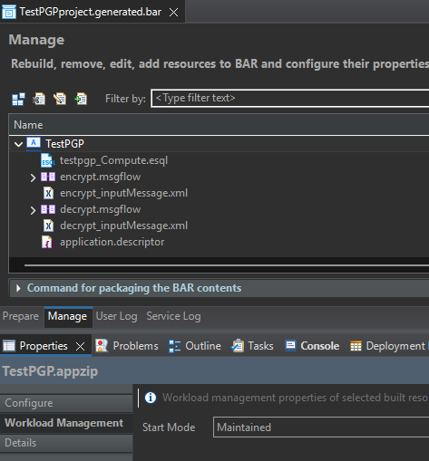
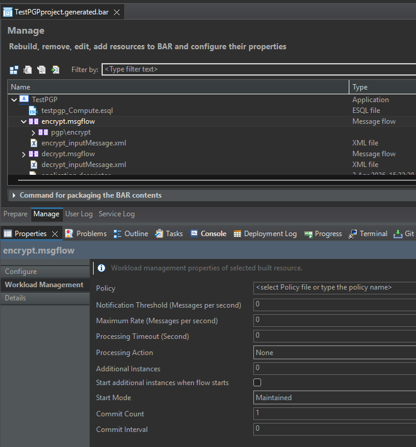

{ .md-banner }

<!--MD_POST_META:START-->
<div class="md-post-meta">
  <div class="md-post-meta-left">2026-06-17 · ⏱ 8 min</div>
  <div class="md-post-meta-right"><span class="post-share-label">Share:</span> <a class="post-share post-share-linkedin" href="https://www.linkedin.com/sharing/share-offsite/?url=https%3A%2F%2Fmatthiasblomme.github.io%2Fblogs%2Fposts%2Fkeeping-stuff-stopped%2Fkeeping-stuff-stopped%2F" target="_blank" rel="noopener" title="Share on LinkedIn">[<span class="in">in</span>]</a></div>
</div>
<hr class="md-post-divider"/>
<div class="md-post-tags"><span class="md-tag">ace</span> <span class="md-tag">operations</span> <span class="md-tag">.stopped</span> <span class="md-tag">mqsistopmsgflow</span> <span class="md-tag">IntegrationServer</span></div>
<!--MD_POST_META:END-->


# Keeping stuff stopped in IBM ACE

Sometimes you need to start an integration server, but you don't want everything inside it to come up with it. Maybe
you're doing maintenance on a specific flow, deploying a new version that shouldn't go live yet, or just need the
server up for inspection without processing traffic.

ACE gives you a few tools for that. They don't all behave the same way, and mixing them up can lead to surprises.

## Stopping during deployment

The cleanest place to set this is in the BAR file itself. Every application and message flow has a `Start mode` property
under the `Workload Management` properties group.





Three values:

- **Maintained**: Keeps the current state across redeploys and restarts. Only changes when you explicitly start or stop it.
- **Manual**: Never starts after deployment, redeployment, or restart. Has to be started manually every time.
- **Automatic**: Always starts after deployment, redeployment, or restart. No exceptions.

`Maintained` is the default. Nothing changes unless you change it.

You can also set this via an override properties file instead of in the BAR editor. The property is set at application or flow level
using `#` as a separator:

```properties
startMode = manual
pgp.decrypt#startMode = manual
```

Pass the override file when deploying:

```bash
ibmint deploy --input-bar-file MyApplication.bar \
              --output-integration-node <nodeName> \
              --output-integration-server <serverName> \
              --overrides-file overrides.properties
```

And deploy as normal.

## Stopping at runtime

If the server is already running, and you want to stop something inside it, `mqsistopmsgflow` is the tool. No restart required.

Stop a specific integration server:

```bash
mqsistopmsgflow [NodeName] --integration-server [IsName]
```

Stop an application inside a specific integration server:

```bash
mqsistopmsgflow [NodeName] --integration-server [IsName] --application [AppName]
```

Stop all applications in an integration server:

```bash
mqsistopmsgflow [NodeName] --integration-server [IsName] --all-applications
```

Stop all applications across all integration servers on a node:

```bash
mqsistopmsgflow [NodeName] --all-integration-servers --all-applications
```

There is no `ibmint` equivalent for stopping applications or flows inside a running integration server. `ibmint stop server`
exists, but it stops the integration server itself, not what runs inside it.

```
D:\IBM\ACE\13.0.7.0>ibmint stop server
BIP8007E: Mandatory argument missing.
BIP15193I: Stop a managed integration server.
Syntax:
     ibmint stop server <serverName> (integrationNodeSpec) [--timeout-seconds <seconds>] [--trace <filePath>]
```

### The deploy problem

One thing catches people off guard. If you stop a flow with `mqsistopmsgflow` and then deploy a new BAR, what happens
next depends on the flow's `startMode`. With `automatic`, the deployment brings it back up regardless of what you did before.
With `maintained`, it stays stopped because the server keeps the current state. With `manual`, it never starts, no matter what.

Basically, `mqsistopmsgflow` on its own is only good for temporary stops. And only reliable if the `startMode` is set to back it up.

## Stopping during startup

There's also a switch on the `IntegrationServer` command itself. When you start an independent integration server from the command line, `--start-msgflows false` brings it up with every message flow in stopped state. The flows are initialized but won't accept anything through their input nodes.

```bash
IntegrationServer --work-dir [workpath] --start-msgflows false
```

Default is `true`, so flows start as usual unless you say otherwise.

This is a different _kind_ of stopped, if I can call it that. No state is stored anywhere. Start the server without the flag and the flows come up like normal. With the flag on, you can bring them up one at a time afterwards if you want.

It's also what lets you run integration tests against flows that aren't live. Pair it with `--test-project` and the tests run while the flows stay stopped.

## .stopped files

The last option is just a file on disk. You can prevent an integration server,
application, or flow from starting in the first place by placing an empty `.stopped` file in the right location. ACE picks it up when the component
above it restarts. For a flow, restart the application. For an application, restart the integration server. For the
integration server, restart the node.

You don't need anything in the file. Its presence is enough.

Node-managed integration server:

```
%MQSI_WORKPATH%/[NodeName]/servers/[IsName]/.stopped
%MQSI_WORKPATH%/[NodeName]/servers/[IsName]/overrides/[AppName]/.stopped
%MQSI_WORKPATH%/[NodeName]/servers/[IsName]/overrides/[AppName]/[FlowName]/.stopped
```

Standalone integration server (same structure, different root):

```
[Standalone IS workpath]/run/.stopped
[Standalone IS workpath]/run/overrides/[AppName]/.stopped
[Standalone IS workpath]/run/overrides/[AppName]/[FlowName]/.stopped
```

A `.stopped` file always wins, even if `startMode` is set to `automatic`.

You can also set this up before anything is deployed. Create the folder and drop a `.stopped` file in it, and that
component won't start when deployed. Stopping an application prevents its flows from starting too. If you only want
a specific flow stopped, drop the `.stopped` file in that flow's own overrides directory. Same if you want the application to
start but one flow inside it to stay down.

Delete the flow and its folder goes too. A redeployment keeps it.

It's also the only approach that needs neither a running server nor a prior deploy.

## Summary

| Approach                            | When it works           | Survives deploy?            | Survives restart?           |
|-------------------------------------|-------------------------|-----------------------------|-----------------------------|
| `startMode=manual`                  | At deploy time          | Yes                         | Yes                         |
| `startMode=maintained`              | At deploy time          | Yes, keeps current state    | Yes, keeps current state    |
| `mqsistopmsgflow` (no BAR update)   | While server is running | No                          | No                          |
| `mqsistopmsgflow` (with BAR update) | While server is running | Yes, only with `maintained` | Yes, only with `maintained` |
| `--start-msgflows false`            | At server startup       | No                          | No, set again on relaunch   |
| `.stopped` file                     | Any time                | Yes                         | Yes                         |

Pick the row that matches when you need the control to kick in.

---

Written by [Matthias Blomme](https://www.linkedin.com/in/matthiasblomme/)

\#IBMChampion \
\#AppConnectEnterprise(ACE)
