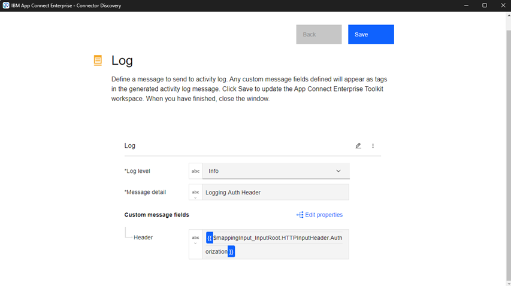
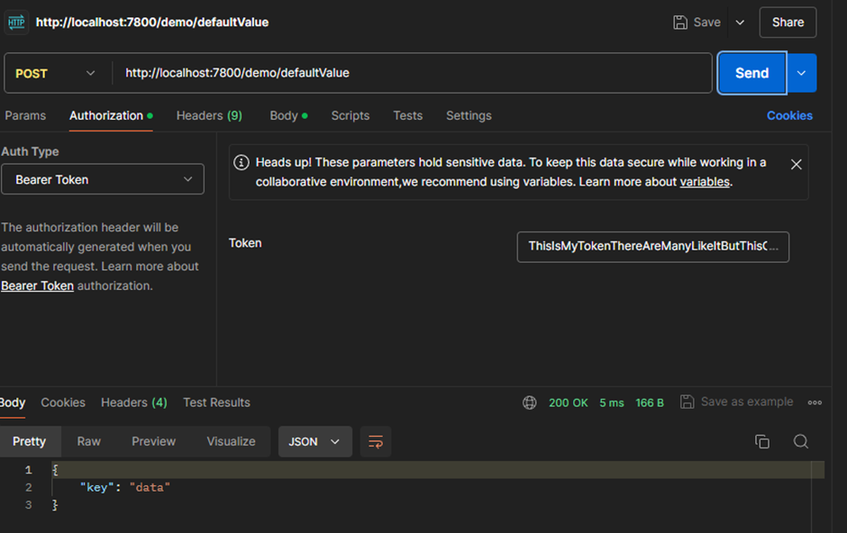
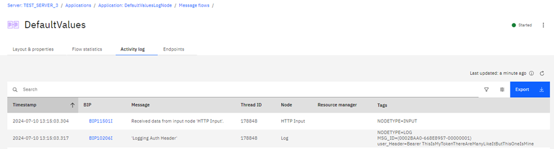
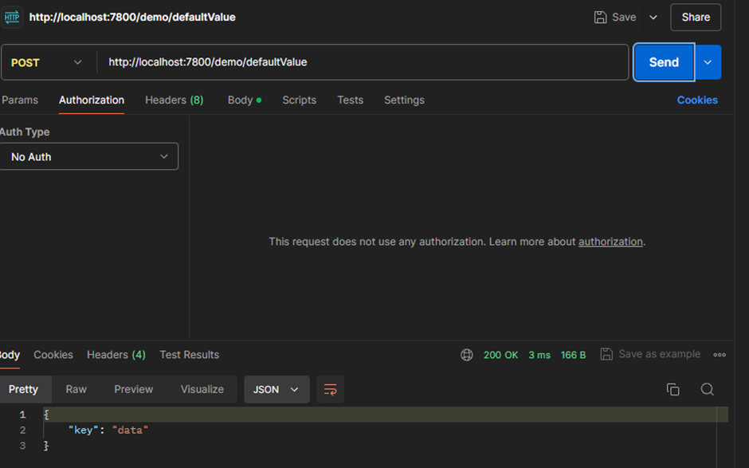
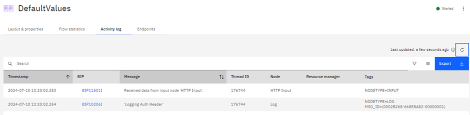
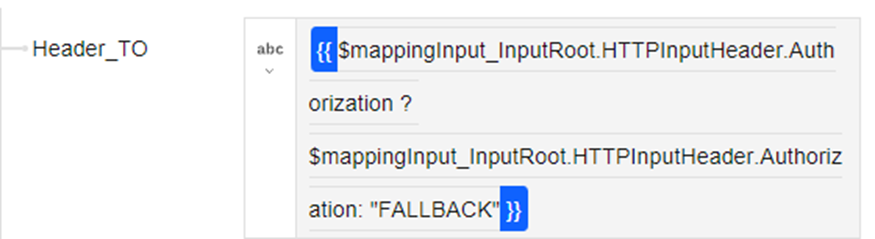
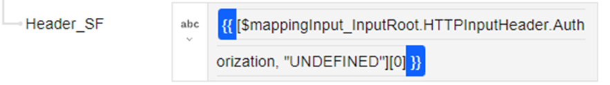
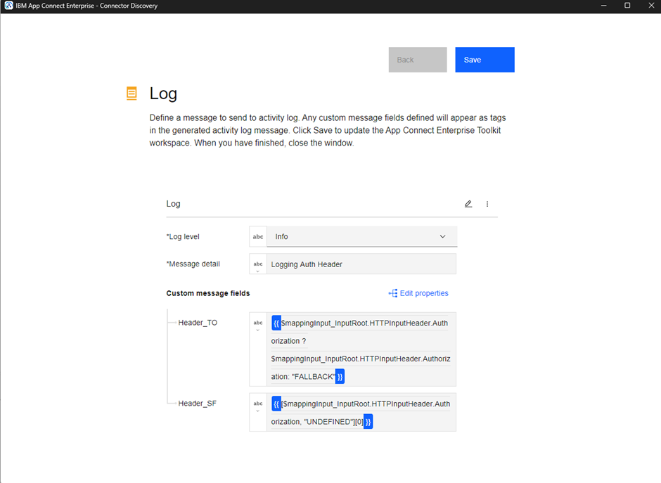
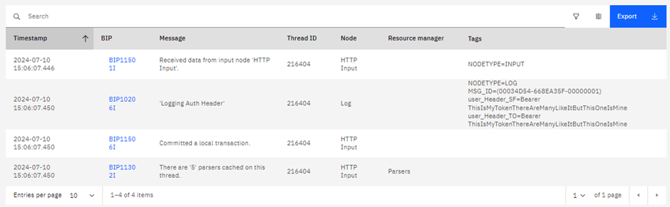
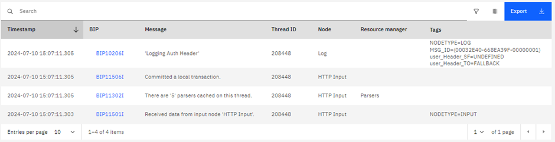

# ACE Log Node tips and tricks – default values

Effective logging is crucial for creating and managing integrations, ensuring that troubleshooting is as efficient as possible. The Log Node can be especially valuable, often replacing the Trace Node in various scenarios.

This is my second blog post on using the Log Node, with the first detailing how to handle and parse the ExceptionList. Who knows? I might even start a series!

## Fallback or default values

Imagine you want to log a specific field from an incoming message that may or may not be present. Let's use the HTTP Authorization header as an example.

If you configure the Log Node to use this header as an input parameter, it will either display it or omit it entirely. The syntax to retrieve the Authorization header from your input message is:

```jsonata
{{$mappingInput_InputRoot.HTTPInputHeader.Authorization}}
```

Applying this to your Log Node



When your message contains the header, it appears in the Activity Log Tags





If the field is missing, the tag disappears.





This behaviour isn’t always ideal and can complicate troubleshooting. Adding default values can help clarify the situation. When you go through the functions, there is no default or coalesce function available in JSONata, then how can you do it? If you would write this in JavaScript, you would simply type

```javascript
Authorization = $mappingInput_InputRoot.HTTPInputHeader.Authorization || UNDEFINED
```

But that doesn’t work in JSONata. What you can do is either one of these

- Use a Ternary Operator expression
- Use Sequence Flattening

## Ternary Operator

A ternary operator is essentially an IF statement in expression form:

```javascript
condition ? ifTrue : ifFalse
```

Applying this to our JSONata example:



```jsonata
{{$mappingInput_InputRoot.HTTPInputHeader.Authorization ? $mappingInput_InputRoot.HTTPInputHeader.Authorization: "FALLBACK"}}
```

What happens is that the first parameter, the actual field, is cast to a Boolean and that result is used to choose between the field value or the fallback value. If the field is an empty sequence, empty array, empty object, empty string, zero or null the expression will default to FALLBACK.

## Sequence Flattening

Sequence Flattening in JSONata is a useful feature for handling non-existent fields (i.e., an empty sequence). Consider this example:

```jsonata
[$field1, $field2, "FALLBACK"][0]
```

The code returns the first value of a flattened sequence. If $field1 has a value, it is returned; otherwise, if $field2 has a value, $field2 is returned. If neither has a value, “FALLBACK” is returned. This functions similarly to a chained COALESCE in ESQL.

Here’s how it applies to our example:



```jsonata
{{[$mappingInput_InputRoot.HTTPInputHeader.Authorization, "UNDEFINED"][0]}}
```

## Example

Here’s how both options look in a test setup with HEADER_TO and Header_SF:



You can see the fields directly from the header as expected:



When the fields are unavailable, the output is:



These examples might not be the most realistic, but you could use them to determine the type of authentication used (e.g., basic, OAuth) or if a specific message field is filled in. Now that you know how to do it, it's up to you to find the right use case to apply it to.

---

## Resources:

[https://www.ibm.com/docs/en/app-connect/12.0?topic=nodes-log-node](https://www.ibm.com/docs/en/app-connect/12.0?topic=nodes-log-node)

[https://www.ibm.com/docs/en/app-connect/12.0?topic=management-activity-logs](https://www.ibm.com/docs/en/app-connect/12.0?topic=management-activity-logs)

[https://docs.jsonata.org/processing#sequences](https://docs.jsonata.org/processing#sequences)

[https://medium.com/swlh/the-one-liner-if-statement-kinda-87318a85eef1](https://medium.com/swlh/the-one-liner-if-statement-kinda-87318a85eef1)

---

Written by [Matthias Blomme](https://www.linkedin.com/in/matthiasblomme/)
