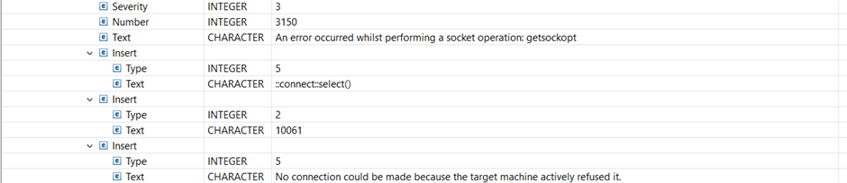

<!--MD_POST_META:START-->
<div class="md-post-meta">
  <div class="md-post-meta-left">2024-07-22 · ⏱ 5 min</div>
  <div class="md-post-meta-right"><span class="post-share-label">Share:</span><a class="post-share post-share-linkedin" href="https://www.linkedin.com/sharing/share-offsite/?url=https%3A%2F%2Fmatthiasblomme.github.io%2Fblogs%2Fposts%2Flogging-ace-exceptionlist%2Flogging-ace-exceptionlist%2F" target="_blank" rel="noopener" title="Share on LinkedIn">in</a></div>
</div>
<hr class="md-post-divider"/>

<!--MD_POST_META:END-->

# Logging ACE's ExceptionList Inserts (in the Activity log with the Log node)

In the world of IBM App Connect Enterprise (ACE), effective logging is crucial for monitoring and troubleshooting. With the introduction of the Log node, it's now easier than ever to log ExceptionList inserts directly into the activity log, which can be viewed from the WebUI. This blog will guide you through the process of using the Log node to log these inserts, helping you streamline your debugging and monitoring processes.

## Introducing the Log Node

The Log node is a recent addition to ACE (v12.0.11.0), originating from the Designer, that simplifies logging activities. By using the Log node, you can log custom messages directly into the activity log for easy monitoring and follow-up.


## Understanding the ExceptionList in ACE

Since this blog mentions and works with the ExceptionList, I’ll recap very quickly what the ExceptionList is. The ExceptionList in ACE is a structured (built-in) way of displaying captured exceptions within your message flows. It provides detailed information about errors, including the file, line, function, type, and additional context that can be invaluable during troubleshooting. As most of you know, the insert fields contain the most usable information so we will be focussing on those.




## Setting Up the Demo Flow

To demonstrate how to log ExceptionList inserts using the Log node, we'll set up a simple flow:


1. **Create the Flow:**

    * Add an HTTP Input node.
    * Add an HTTP Request node.
    * Add a Log node.
    * Add an HTTP Reply node.

2. **Connect the Nodes:** Connect the nodes as shown in the diagram to form a complete flow.

## Configuring the Log Node

Next, we need to configure the Log node to capture and log the ExceptionList inserts:

1. **Properties:**

    * Go to the Map Inputs part of the properties
    * Configure the Log node to include the ExceptionList as a Map input.


2. **Configure:**

    * Open the Configure wizard for the Log Node
 
 

  * Set the basic values for the log message: “Log Level” and “Message detail”


  * Next add a new property, give it a name, and set the type to “Array of strings”


  * Click on “Edit mappings” and click on the left button that looks like a menu with 3 items


  * Click on “ExceptionList”, scroll down and select “Insert”


This gives you all the inserts of the ExceptionList. If that is what you want, great, we are done here. But if you only require the insert fields of the last 2 ExceptionList items, which tend to be the most interesting ones, you can select only those as well. It’s rather important to know that the ExceptionList ordering here is reversed compared to the message tree. So the last 2 ExceptionList items in the flow are the first 2 in this Json representation.

### Filter

* Click on the Insert and go to “Edit expression”


* Change the expression to:


```jsonata
$mappingInput_ExceptionList[0..1].Insert
```

* Do not forget to hit “Save”!

## Sending a Message through the Flow

To test our configuration, we'll send a message through the flow using the Flow Exerciser:

1. **Send Message:** Open the Flow Exerciser, create a new message, and send it through the HTTP Input node.
2. **Monitor the Progress:** Observe the message flow and ensure the Log node captures and logs the ExceptionList details.

To make sure the log message has been written, wait until you get a reply back.


## Viewing the ExceptionList in the Activity Log

Once the message has been processed, you can view the logged ExceptionList inserts in the activity log through the WebUI:

1. **Access the Activity Log:** Navigate to the activity log section in the WebUI to see the logged ExceptionList inserts.
   *Integration Server > Application > Message flows > flow*

2. **Review Logged Details:** The activity log should display detailed information about the exceptions captured during the flow execution.


The log entry in detail:


This is enough to tell me what the issue is.

## Conclusion

By using the Log node to capture and log ExceptionList inserts, you can significantly enhance your ability to monitor and troubleshoot message flows in IBM App Connect Enterprise. This approach ensures that all relevant error details are readily available in the activity log, making it easier to diagnose and resolve issues.

Feel free to reach out if you have any questions or need further assistance with your IBM App Connect Enterprise setup!

---

**Resources:**

* [IBM Docs – Adding entries to the activity log by using the Log node](https://www.ibm.com/docs/en/app-connect/12.0?topic=al-adding-entries-activity-log-by-using-log-node)

---

Special kudos to [Dan Robinson](https://community.ibm.com/community/user/people/daniel-robinson) and [David Coles](https://community.ibm.com/community/user/profile?UserKey=b534ca9e-58cc-4a46-950d-f0c4b70c38af) for the idea and help.

---

Written by [Matthias Blomme](https://www.linkedin.com/in/matthiasblomme/)
