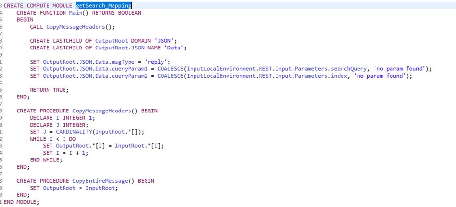

<!--MD_POST_META:START-->
<div class="md-post-meta">
  <div class="md-post-meta-left">2025-07-31 · ⏱ 7 min</div>
  <div class="md-post-meta-right"><span class="post-share-label">Share:</span> <a class="post-share post-share-linkedin" href="https://www.linkedin.com/sharing/share-offsite/?url=https%3A%2F%2Fmatthiasblomme.github.io%2Fblogs%2Fposts%2Fmissing-query-param%2Fmissing-query-param%2F" target="_blank" rel="noopener" title="Share on LinkedIn">[<span class="in">in</span>]</a></div>
</div>
<hr class="md-post-divider"/>

<!--MD_POST_META:END-->

# The Case of the Missing Query Parameters

Aka “The Blog That Reads like an Agatha Christie Story” or “The Overly Dramatic Description of a Simple Problem“.

## The Setup: A Flow, a Request, and a Vanishing Act

It started with a perfectly normal request, as these things often do.

A simple REST API flow. Nothing fancy, just a simple endpoint that should take in a few query parameters and trigger some downstream logic.


The request was clean. The endpoint responded. No errors. No warnings.

But there was one problem: the query parameters never entered the flow. The data was gone. It wasn’t dropped or malformed, it was just... not there. And that’s where our story begins.




However, everything looked right. The nodes were in place, the method was correct, and the parameters were being sent. But the flow acted like the second one never existed in the first place.

And so, the investigation began.

## The First Suspects: Nodes and Misconfigurations

We start with the usual culprits, the butlers of the story:

- Parse query string setting: are we actually parsing the query parameters?
- Compute mode: are we passing them on down-stream?

### Parse query string

The most obvious of suspects, can be verified simply by looking at HTTP Input node. Open the message flow with the message flow editor


And look at the Parse Query String option in the Advanced options group. This one was checked.


### Compute mode

Second suspect: the Compute mode of the Compute Node. If an upstream Compute Node is set to a Compute mode that includes the LocalEnvironment, make sure the InputLocalEnvironment is actually being copied over to the OutputLocalEnvironment.


No issue here, the settings are ok.

### Conclusion

All checked. All innocent.

> Side note: the Parse Query String option is enabled by default for REST API integrations. If you would use a normal ACE message flow with an HTTP Input node, this isn’t the case and needs to be explicitly enabled.


## Further investigation: using the little grey cells

Looking further at the flow, the LocalEnvironment gives us a clue. You can check the LocalEnvironment via a number of ways.

You can debug the flow


You can use the flow exercises


You can use the Log Node


Or any other way that prints the LocalEnvironment.

Now, looking at that last screenshot, you can notice that the REST LocalEnvironment (REST.Input.Parameters) only contains 1 parameter:

```json
{
  "REST": {
    "Input": {
      "Method": "GET",
      "Operation": "getSearch",
      "Path": "/mystery/v1/search",
      "URI": "http://localhost:7800/mystery/v1/search",
      "Parameters": {
        "searchQuery": "Random"
      }
    }
  }
}
```

But if you have another look, you can also see an HTTP LocalEnvironment (`HTTP.Input.QueryString`) that does contain both query parameters.

```json
{
  "HTTP": {
    "RequestIdentifier": "4556485400000000000000007954e6169c14180000000000"
  },
  "RouterList": {},
  "HTTP": {
    "Input": {
      "Path": {
        "Segment": [
          "mystery",
          "v1",
          "search"
        ]
      },
      "QueryString": {
        "searchQuery": "Random",
        "index": "1"
      }
    }
  }
}
```

## Interlude: HTTP Input vs REST API, Know Your Players

Before we get to the real twist in this story, let’s step back and talk about the two leads in our little drama: the HTTP Input node and the REST API flow.

They both accept HTTP requests. They both kick off message flows. But beyond that, they’re playing two very different games.

### REST API: The Rule-Follower

The REST API flow is the obsessive one. It reads the OpenAPI YAML like it’s gospel, and then enforces it with the discipline of a Swiss watchmaker.

- If a method isn’t allowed in the spec, it’s rejected.
- If a query parameter isn’t defined, it’s ignored.
- Everything that is defined shows up neatly in the LocalEnvironment REST.Input.Parameters part.

In other words, you get structure, validation, and strict behavior. It does a lot for you, as long as you define everything correctly.

### HTTP Input: The Wild Card

The HTTP Input node doesn’t care what your YAML says, because it doesn’t even know it exists.

- It accepts whatever hits the endpoint.
- You want method checking? Do it yourself.
- Query string parsing? Better enable it.
- Parameter validation? That’s on you.

You’re in full control, but also responsible for every piece of logic you want. It’s a blank slate, and that’s both its power and its pain.

### Why This Matters

If you’re debugging a flow and forget which type you’re using, things get weird fast.

You expect certain params to show up, but they don’t. You assume behavior that only the REST API flow gives you, but you’re using a raw HTTP input instead.

And suddenly, you’re deep in the weeds chasing ghosts.

## Exhibit A: REST vs HTTP in Action

Let’s not speculate, let’s test.

To really understand how ACE handles HTTP traffic under the hood, I set up two flows:

- One using a REST API defined via OpenAPI YAML.
- One using a plain old HTTP Input node.

The goal? To see exactly how each flow handles:

- Query parameters (defined vs undefined)
- HTTP methods (allowed vs blocked)
- LocalEnvironment structure
- Error handling

This isn’t theory, it’s fieldwork. And as we’re about to see, the differences aren’t so subtle.

### REST API


As you can see from the screenshots above:

- Undefined methods are blocked, based on the yaml specification.
- Undefined query parameters are not passed on to the REST LocalEnvironment.

### The Verdict

Based on the examples, we can draw the following conclusions:

- REST enforces the contract. If the method or param isn’t in the spec, it’s blocked or ignored.
- HTTP Input is open-ended—it gives you everything, but it’s up to you to make sense of it.
- Debugging behaviour can differ depending on which one you use, you have to make sure to search in the correct place.

The lesson? Know your tool. REST gives you structure, HTTP gives you freedom, but both demand attention when something goes missing.

### HTTPInput


As you can see from the screenshots above:

- Unless you explicitly block them, undefined methods go through without a hitch.
- All query parameters are passed on to the HTTP LocalEnvironment.

## The Overlooked Clue: The OpenAPI Spec

The real issue? One of the query params was never defined in the OpenAPI YAML.  
If they’re not in the spec, they don’t exist, at least not to REST API flow.

Here's the actual difference in LocalEnvironment output between REST and HTTP:

```json
// REST.Input.Parameters
{
  "searchQuery": "Random"
}
```

```json
// HTTP.Input.QueryString
{
  "searchQuery": "Random",
  "index": "1"
}
```

Matches the API definition


## The Smoking Gun: One Line That Fixes It All

A simple addition to the OpenAPI file that would’ve made it all work, adding the second parameter.

```yaml
# The missing line in OpenAPI
- name: index
  in: query
  required: false
  schema:
    type: string
```

Giving the final OpenAPI definition


Running the call again, this time with the updated REST API.


And success.

## The Takeaway: Specs Matter, Even for “Obvious” Stuff

No errors. No warnings. Just a silent ignore.  
If your REST flow depends on a parameter, define it—or be ready to chase shadows. Not only when hosting a REST API, but also when consuming one.

For fewer mysteries and cleaner runs, keep your spec tight. Or just keep reading my blogs 😉

---

## Resources

- https://www.ibm.com/docs/en/app-connect/13.0.x?topic=nodes-httpinput-node
- https://www.ibm.com/docs/en/app-connect/13.0.x?topic=apis-rest
- https://www.ibm.com/docs/en/app-connect/13.0.x?topic=assembly-local-environment-tree
- https://www.ibm.com/docs/en/app-connect/13.0.x?topic=messages-working-http-flows
- https://github.com/matthiasblomme/Ace_test_cases/tree/main/MissingQueryParam

---

Written by [Matthias Blomme  ](https://www.linkedin.com/in/matthiasblomme/)

#IBMChampion  
#AppConnectEnterprise(ACE)
