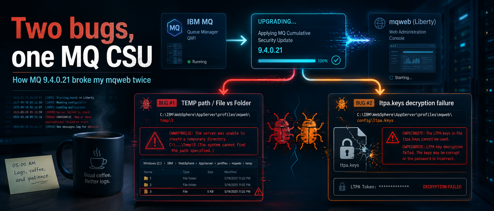
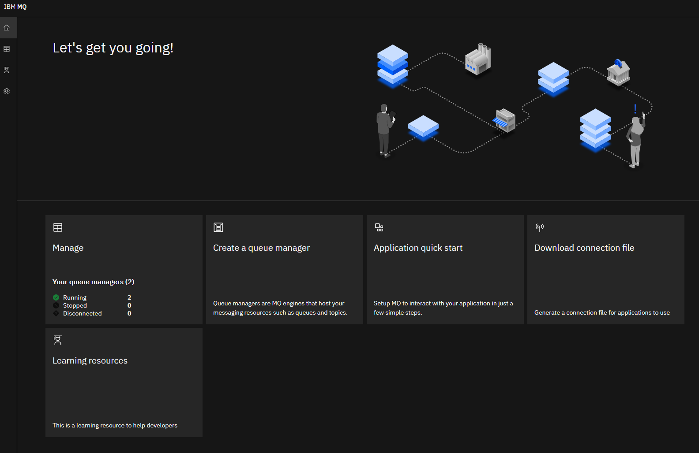

{ .md-banner }

<!--MD_POST_META:START-->

<!--MD_POST_META:END-->


# Two bugs, one MQ CSU: how 9.4.0.21 broke my mqweb (twice)

> The story of an ordinary weekday.

I've had the occasional mqweb hiccup after MQ upgrades before. Up until now, stopping mqweb before patching and keeping 
it stopped through any server reboot the maintenance triggered, was the entire fix. Two extra lines in the playbook, 
problem solved. Apparently, this time, there was more.

Routine CSU month. The IBM MQ 9.4.0.21 cumulative security update had landed in Fix Central, so doing what you do, you 
install and verify it on your test environment. Not my first rodeo. Pre-upgrade snapshot, shut down dependencies, endmqm, 
install the maintenance, strmqm, watch the AMQERR logs for anything out of the ordinary. 
Channels recovered, applications reconnected, queue depths stable, all seemed fine, in retrospect, a bit too fine. 
Standard upgrade, in and out in twenty minutes.

I went to open the MQ Console for the usual post-upgrade sanity click-through.

Nothing.

```
> dspmqweb status
MQWB1124I: Server 'mqweb' is running.
MQWB1123E: The status of the mqweb server applications cannot be determined.

> strmqweb
Server mqweb is already running.

> endmqweb
Stopping server mqweb.
[ ...nothing... ]
```

Schrödinger's mqweb: simultaneously running, not running, and refusing to die. Excellent. Hold my coffee (too early for 
beer) and let's dig.

## Bug #1: a broken TEMP path

`messages.log` had exactly one thing to say that mattered:

```
java.lang.IllegalArgumentException: Resource root already exists as a file
  (fn=C:/Users/MQADMIN~1/AppData/Local/Temp/3/)
  com.ibm.ws.kernel.service.location.internal.Activator 100
CWWKE0205W: The framework is shutting down because of a previous initialization error.
```

Translation: Liberty's location service tried to claim a directory under my admin user's TEMP, found a file (or something
resembling a file) where it expected a directory, and aborted. The `\3\` is Windows' per-session TEMP subdir. RDS sessions,
FSLogix, or UAC virtualization each have their own way of putting weird stuff there. Whatever the trigger, the path was 
broken.

Why now? The CSU bumped Liberty to `wlp-1.0.111` (March 2026) and the JRE to `8.0 SR8 FP60`. The combo is noticeably 
pickier about how it resolves `java.io.tmpdir`. On 9.4.0.20 it simply couldn't care less. On 9.4.0.21 it blatantly 
refused.

Two things went wrong at the same time:

1. **Liberty inherited my interactive user's TEMP** because I ran `strmqweb` from my admin RDP session. Not what you want
   for live systems.
2. **That TEMP path was broken**, file where a directory should be.

So the framework half-started, wrote enough state to look "running" to `dspmqweb`, then died before exposing a command channel. Which is exactly why `endmqweb` hung. There was no live Liberty to hear it.

### The fix

Find and kill the zombie JVM, clean the path, regenerate Liberty's workarea, and, most importantly, stop inheriting a 
user TEMP:

```cmd
:: 1. Kill the orphan
wmic process where "name='java.exe'" get ProcessId,CommandLine | findstr mqweb
taskkill /F /PID <pid>

:: 2. Inspect the broken path; delete or rename
dir "C:\Users\<user>\AppData\Local\Temp"
:: if a stray file '3' is there → delete
:: if it's a folder with bad ACLs → ren 3 3.bak

:: 3. Clear stale Liberty state
rmdir /S /Q "<DataPath>\web\installations\<inst>\servers\mqweb\workarea"
rmdir /S /Q "<DataPath>\web\installations\<inst>\servers\mqweb\logs\state"
```

If the clean of the `workarea` or `state` folders fails, you didn't kill all the zombies.

Then I pinned Liberty's temp dir in `jvm.options` so it never inherits a user profile again:

```
-Djava.io.tmpdir=C:\ProgramData\IBM\MQ\web\tmp
```

```
strmqweb
Starting server mqweb.
Server mqweb started.
```
Jackpot. Console reachable.

Time to log in. Surely there wasn't going to be another error. You see where I'm going with this, right?

## Bug #2: ltpa.keys wouldn't decrypt

And the actual login fails. My credentials aren't being accepted.

Checking the status:

```
dspmqweb
MQWB1124I: Server 'mqweb' is running.
MQWB1123E: The status of the mqweb server applications cannot be determined.
A request was made to read the status of the deployed mqweb server applications, however the data appears corrupt. This may indicate that there is already an mqweb server started on this system, probably related to another IBM MQ instance.
Check the startup logs for the mqweb server, looking in particular for conflicting usage of network ports. Ensure that if you have multiple mqweb servers on a system, they are configured to use distinct network ports. Restart the mqweb server and ensure it started correctly. If the problem persists, seek assistance from IBM support.
```

Not good. Let's check the logs:

```
[CWWKS4000E] A configuration exception has occurred.
The requested TokenService instance of type Ltpa2 could not be found.
```

`ltpa.keys` is encrypted with a key derived from a configured password, using the JRE's crypto. The CSU's JRE bump 
(SR8 FP60) apparently was strict enough to refuse the key file the previous JRE had written. 
No keys → no `Ltpa2` token service → no login.

### The fix

Let Liberty regenerate the file from scratch:

```cmd
endmqweb
cd /d "<DataPath>\web\installations\<inst>\servers\mqweb\resources\security"
ren ltpa.keys ltpa.keys.bak-pre-9.4.0.21
strmqweb
Starting server mqweb.
Server mqweb started.
```

On startup Liberty creates a fresh `ltpa.keys`. If you've got an encoded LTPA password in `mqwebuser.xml` from an older 
JRE, you may also need to re-encode it with `securityUtility encode` from the new install, but mine regenerated cleanly.

Let's check the status first, before using the webui:

```
dspmqweb
MQWB1124I: Server 'mqweb' is running.
URLS:
https://somerandomhostname.com:9443/ibmmq/rest/
https://somerandomhostname.com:9443/ibmmq/console/
```




Problem fixed.

## What went into the playbook

A CSU is "just a security update" right up until it isn't. Two things went straight into my upgrade playbook:

1. **Pin `java.io.tmpdir` for mqweb permanently.** Don't let it inherit whatever the launching user's profile happens to 
   have. Set it in `jvm.options` once, never think about it again.
2. **Treat `ltpa.keys` as upgrade-volatile.** When the bundled JRE bumps, expect to regenerate. Have the rename-and-restart 
   steps in your runbook so you're not Googling at 11pm, or whenever you plan your upgrades.


## A boring but useful conclusion

**Read the bundled component levels in the release notes**, or at least feed them to your AI agent of choice (Bob can 
really help you here). The wlp/JRE bump is what changed the rules under me, not anything in MQ proper. If you see the 
Liberty version or the SR/FP move, assume the Liberty-facing edges of your config (TEMP paths, keystores, LTPA, custom
`mqwebuser.xml`) need a once-over before you trust the next upgrade.

---

## References

* [IBM MQ 9.4.0.21 fix list](https://www.ibm.com/support/pages/fix-list-ibm-mq-version-94-lts)
* [Open Liberty `wlp-1.0.111` release notes](https://openliberty.io/docs/latest/reference/release-notes.html)
* [Configuring the mqweb server (IBM Docs)](https://www.ibm.com/docs/en/ibm-mq/9.4?topic=interface-configuring-mqweb-server)
* [`securityUtility encode` reference](https://openliberty.io/docs/latest/reference/command/securityUtility-encode.html)
* [IBM MQ FAQ for Long Term Support and Continuous Delivery releases](https://www.ibm.com/support/pages/ibm-mq-faq-long-term-support-and-continuous-delivery-releases)

---


Written by [Matthias Blomme](https://www.linkedin.com/in/matthiasblomme/)

\#IBMChampion
\#MQ
