# PGP SupportPac on ACE 13.0.6.0: a full end-to-end setup

Ever spent two hours wiring PGP in ACE only to hit a `NoClassDefFoundError` and question your life choices?  
I know I have. And I maintain the damn thing.

This is a practical walkthrough for getting the PGP SupportPac running on ACE 13.0.6.0.

Keys. Key stores. Policies. Flows. Deployment. Encryption. Decryption.  
In other words, the lot.

No theory. Just a setup that works.


## What we’re setting up

We’ll create:

- A sender
- A receiver
- A key pair for each
- The required PGP key stores
- Two flows:
    - `/pgp/encrypt`
    - `/pgp/decrypt`

Then we run a round-trip through the flows.

Trigger the encrypt flow. It reads a plain file and returns the encrypted result.  
Take that encrypted output and use it for the decrypt flow.  
Trigger that one. You should get your original content back.

If the final output matches the original file, the setup is correct.  
If it doesn’t, something in your configuration is wrong.

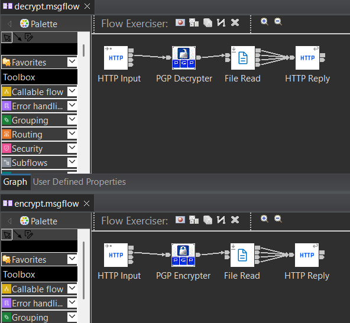

Yes, those are the new icons.

# Part 1: key generation and key stores

Even though I’m supplying these files for you to test, it’s better to know how to set it up from scratch.

PGP in ACE is mostly configuration. If the keys and key stores are correct (and the jars, obviously, but I’m jumping the gun), the rest behaves. If they’re not, you’ll spend time debugging flows that are perfectly fine.

We’ll generate both key pairs ourselves and build the key stores ACE expects.


## Open the ACE command console

Use the ACE command console. Not a generic CMD window.
If you already are in a generic CMD window, just set the ACE environment.
```cmd
cd "C:\Program Files\IBM\ACE\13.0.6.0"
ace.cmd
```

Set the CLASSPATH for `pgpkeytool`:

```cmd
SET CLASSPATH=%MQSI_BASE_FILEPATH%\server\jplugin\PGPSupportPacImpl.jar;%CLASSPATH%
SET CLASSPATH=%MQSI_REGISTRY%\shared-classes\bcpg-jdk18on-1.78.1.jar;%CLASSPATH%
SET CLASSPATH=%MQSI_REGISTRY%\shared-classes\bcprov-jdk18on-1.78.1.jar;%CLASSPATH%
```

Create the working directories:

```cmd
mkdir C:\temp\pgp\keys
mkdir C:\temp\pgp\input
mkdir C:\temp\pgp\output
```

If they already exist, fine. You clearly have done this before.


## Generate the key pairs

We’ll create two identities:

- `Sender <sender@testpgp.com>`
- `Receiver <receiver@testpgp.com>`

### Generate the sender key pair

```cmd
java pgpkeytool generatePGPKeyPair ^
  -i "Sender <sender@testpgp.com>" ^
  -s C:\temp\pgp\keys\sender-private.asc ^
  -o C:\temp\pgp\keys\sender-public.asc
```

You’ll be prompted for a passphrase.

For this test, I’m using `passw0rd`.  
No, that’s not a recommendation. But, you know, I can't stop you.

By default this generates RSA keys, 1024-bit, ASCII armored. For a functional test setup, that’s fine.

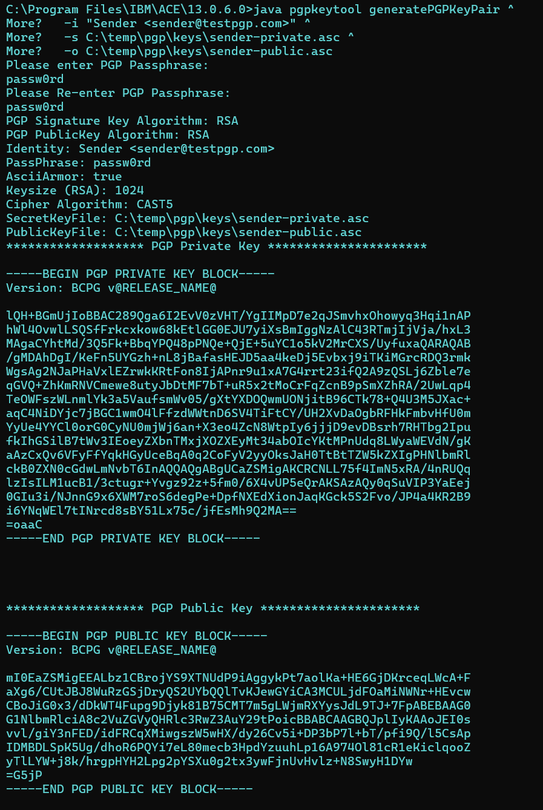

### Generate the receiver key pair

```cmd
java pgpkeytool generatePGPKeyPair ^
  -i "Receiver <receiver@testpgp.com>" ^
  -s C:\temp\pgp\keys\receiver-private.asc ^
  -o C:\temp\pgp\keys\receiver-public.asc
```

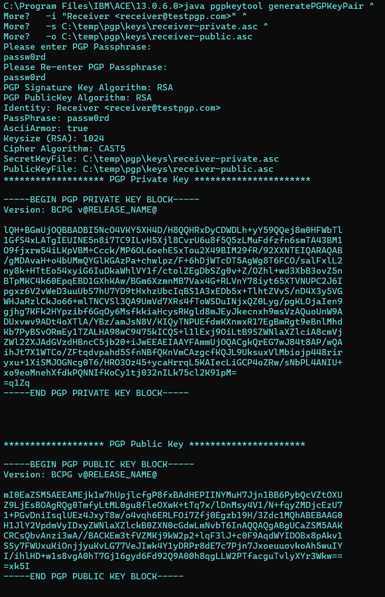

At this point you should have:

- `sender-private.asc`
- `sender-public.asc`
- `receiver-private.asc`
- `receiver-public.asc`

Next step is building what ACE can actually use, the key stores.


## Create the key stores

You now have four `.asc` files.

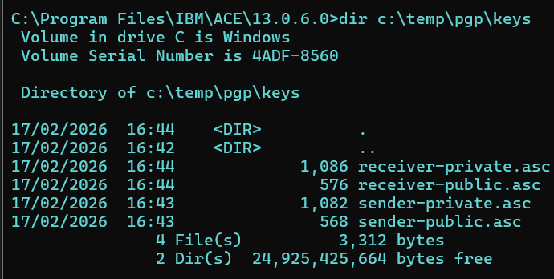

The PGP nodes don’t reference them directly. They reference key store files (.pgp), so we create those next.

### Sender side

Import the sender’s private key into a private key store:

```cmd
java pgpkeytool importPrivateKey ^
  -sr C:\temp\pgp\keys\sender-private-store.pgp ^
  -i true ^
  -sf C:\temp\pgp\keys\sender-private.asc
```

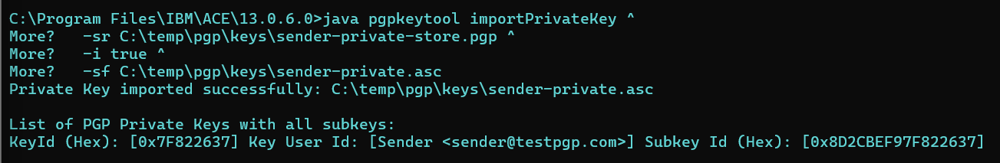

Then import the receiver’s public key into the sender’s public key store:

```cmd
java pgpkeytool importPublicKey ^
  -pr C:\temp\pgp\keys\sender-public-store.pgp ^
  -i true ^
  -pf C:\temp\pgp\keys\receiver-public.asc
```

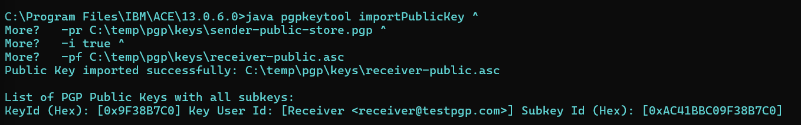

The sender encrypts using the receiver’s public key.  
So that key must exist in the sender’s public store.


### Receiver side

Import the receiver’s private key:

```cmd
java pgpkeytool importPrivateKey ^
  -sr C:\temp\pgp\keys\receiver-private-store.pgp ^
  -i true ^
  -sf C:\temp\pgp\keys\receiver-private.asc
```

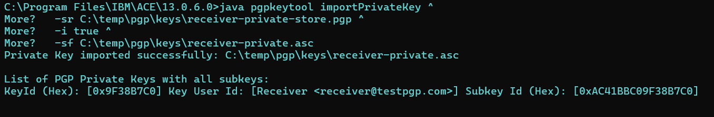

Then import the sender’s public key into the receiver’s public key store:

```cmd
java pgpkeytool importPublicKey ^
  -pr C:\temp\pgp\keys\receiver-public-store.pgp ^
  -i true ^
  -pf C:\temp\pgp\keys\sender-public.asc
```

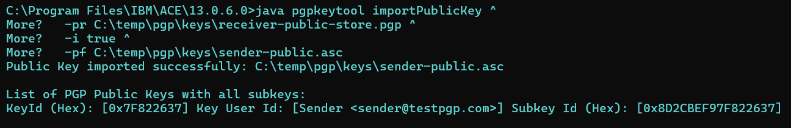

If you’re not that familiar with the difference:

A private key store contains your own private keys.  
A public key store contains other parties’ public keys, the ones you encrypt to or verify against.

Think “what I own” versus “what I trust.”

If a key isn’t in the expected store, encryption or signature validation won’t work. So make sure you get this right.


## Verify the key stores

Before moving on, check what you just created.

```cmd
java pgpkeytool listPrivateKeys -sr C:\temp\pgp\keys\sender-private-store.pgp
java pgpkeytool listPublicKeys -pr C:\temp\pgp\keys\sender-public-store.pgp
java pgpkeytool listPrivateKeys -sr C:\temp\pgp\keys\receiver-private-store.pgp
java pgpkeytool listPublicKeys -pr C:\temp\pgp\keys\receiver-public-store.pgp
```

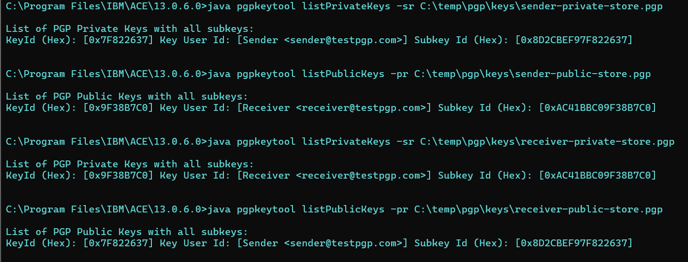

If one of those is missing, fix it now. Don’t move into Toolkit and hope it resolves itself.


# Part 2: flows and policy configuration

At this point the key stores are in place and we can finally move into Toolkit.

Import:

- `TestPGP` application
- `PGP_Policies` policy project

Both need to deploy cleanly. If either fails, fix that first. Don’t troubleshoot encryption while the application isn’t even running.
I’m assuming you’re familiar with importing projects into the Toolkit if you’re trying to get this node to work.

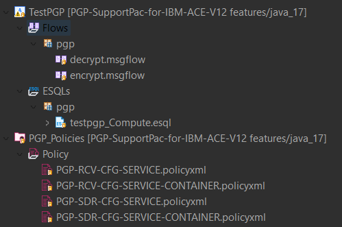


# Part 3: deployment and runtime setup

## Create or use an integration server

```cmd
IntegrationServer --work-dir C:\temp\pgp\TEST_SERVER_PGP
```

Deploy:

- `PGP_Policies`
- `TestPGP`

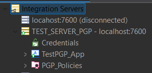

## The Bouncy Castle jars

Copy the Bouncy Castle jars into the integration server’s `shared-classes` directory:

```cmd
copy "%MQSI_REGISTRY%\shared-classes\bcpg-jdk18on-1.78.1.jar" "C:\temp\pgp\TEST_SERVER_PGP\shared-classes\"
copy "%MQSI_REGISTRY%\shared-classes\bcprov-jdk18on-1.78.1.jar" "C:\temp\pgp\TEST_SERVER_PGP\shared-classes\"
```

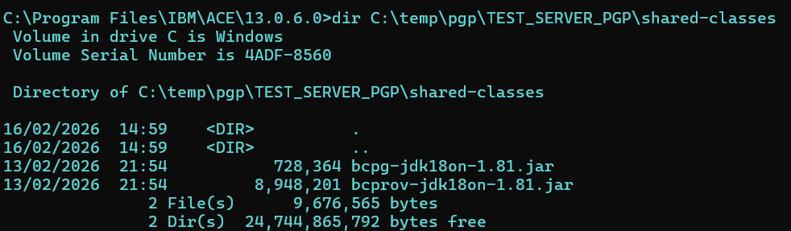

Restart the integration server afterwards.


# Part 4: end-to-end test

## Prepare a test file

```cmd
echo This is a test file for PGP encryption > C:\temp\pgp\input\plain.txt
```

## Trigger the encrypt flow

```cmd
curl -X POST http://localhost:7800/pgp/encrypt
```

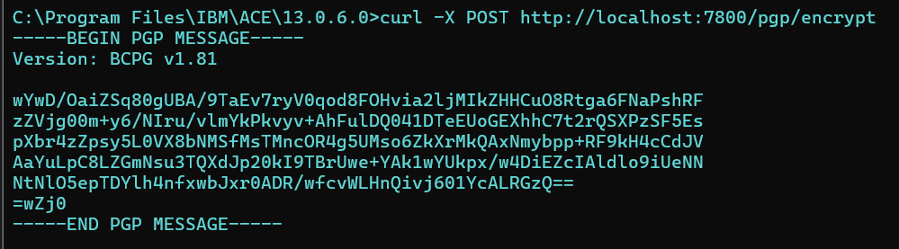

Save the encrypted output. The decrypt flow reads it from disk.

## Trigger the decrypt flow

Save the encrypted payload as:

C:\temp\pgp\output\encrypted.txt

Then:

```cmd
curl -X POST http://localhost:7800/pgp/decrypt
```

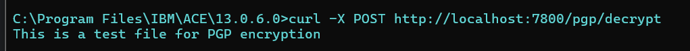

# Final notes

PGP SupportPac runs fine on ACE 13.0.6.0 with this setup.

If your flow fails, assume configuration before you assume cryptography.

Nine times out of ten it’s a path, a user ID, a passphrase, or missing jars.

Start there.


Now that you’ve made it to the bottom of this post, you’ve earned the right to know that the [repo](https://github.com/matthiasblomme/PGP-SupportPac-for-IBM-ACE-V12) doesn’t just contain the plugin jars.

It also includes:

- The test project used in this walkthrough
- The full PGP key and key store setup
- Deployment and test scripts to validate everything automatically across standalone integration servers, node-managed setups, and Docker

So if you don’t feel like typing everything by hand, you don’t have to.
