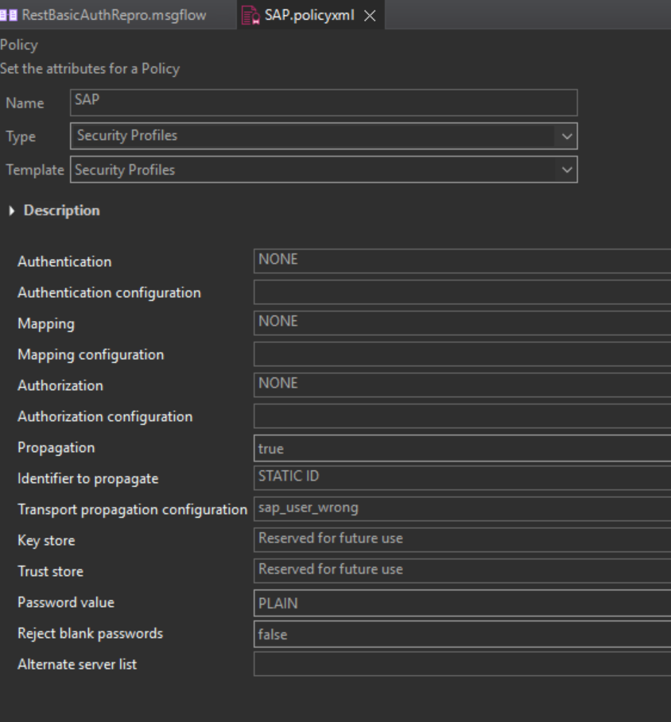
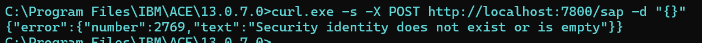
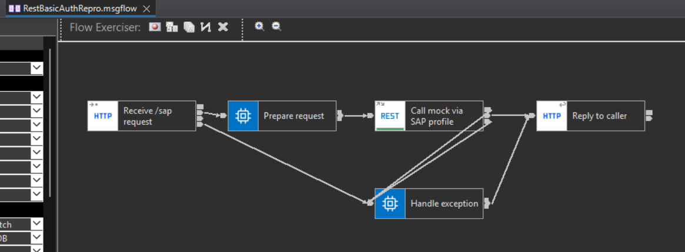
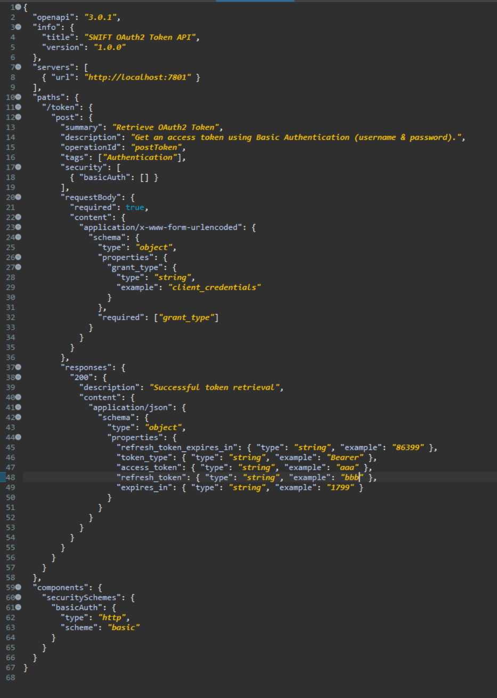
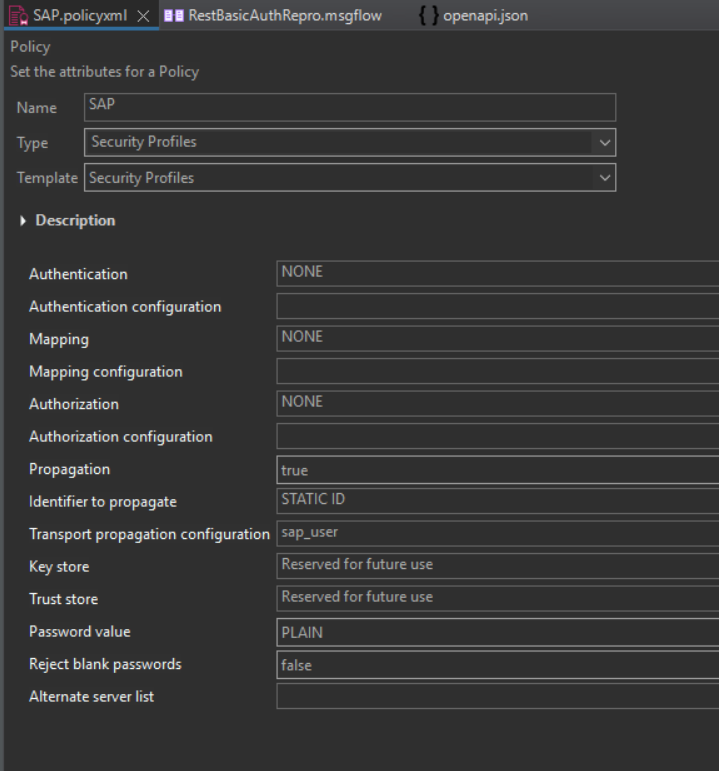

<!--MD_POST_META:START-->
<div class="md-post-meta">
  <div class="md-post-meta-left">2026-06-20 · ⏱ 13 min</div>
  <div class="md-post-meta-right"><span class="post-share-label">Share:</span> <a class="post-share post-share-linkedin" href="https://www.linkedin.com/sharing/share-offsite/?url=https%3A%2F%2Fmatthiasblomme.github.io%2Fblogs%2Fposts%2Frest-request-basic-auth%2Frest-request-basic-auth%2F" target="_blank" rel="noopener" title="Share on LinkedIn">[<span class="in">in</span>]</a></div>
</div>
<hr class="md-post-divider"/>
<div class="md-post-tags"><span class="md-tag">ace</span> <span class="md-tag">http</span> <span class="md-tag">security</span> <span class="md-tag">debugging</span></div>
<!--MD_POST_META:END-->

# Why Your ACE REST Request Node Isn't Sending Basic Auth

> The truth is out there.

## How it started

It started, as these things do, with a colleague's question. Neither of us could
crack it. Shame and determination ran deep.

A REST Request node calling a Basic-auth endpoint. We tried the obvious thing
first: the node's Security identity property with a `rest::` credential. That
worked. `Authorization: Basic` header went out, the call succeeded. So the flow and the mock endpoint were working. Check.

Then we switched to a Security Profile (the propagation approach), and nothing. 
No header. No exception, no `BIP` code, nothing in the event log. The request just 
went out unauthenticated.

So we did our homework: IBM documentation, videos, every forum thread
we could find. As far as any of us could tell, the configuration was *correct*.
And if you point the security identity at an entry that doesn't exist, you do get
an error, so the profile setup was working. 





Which is when the actually-useful question finally surfaced:

> What if the setup is right, and it's my *endpoint* that's the problem?

Turned out it was. But only partially.


## What's actually happening

A REST Request node has two different credential mechanisms, and they send Basic
auth at different moments.

The node Security identity is pre-emptive. It sends credentials on the first
request. It's IBM's documented way to do Basic auth on a REST Request node.

The Security Profile (identity propagation) is reactive. It's a general-purpose
identity-propagation mechanism, and over HTTP it relies on the standard
challenge/response handshake: it only sends credentials after the server replies
`401`. If your endpoint returns `200` on the first hit (or anything that isn't a
`401` Basic challenge), the profile sends nothing, and raises no error. That's the
silent failure. A simple mock endpoint usually won't challenge, which is exactly
why we hit it.

So "it worked before, now it doesn't" usually means the downstream's challenge
behavior changed (or you moved from a server that challenges to one that doesn't),
not that your policy is wrong.

## The three working configurations

There are three configurations that actually work:

| # | Configuration                                                                                                                                                     | When `Authorization: Basic` is sent                 | Requirements                                                                                       |
|---|-------------------------------------------------------------------------------------------------------------------------------------------------------------------|-----------------------------------------------------|----------------------------------------------------------------------------------------------------|
| 1 | **Node Security identity**: `securityIdentity="<id>"`; credential `mqsisetdbparms <node> -n rest::<id> -u <user> -p <pass>`                                       | **Pre-emptively**, on the first request             | OpenAPI declares an `http`/`basic` (or `bearer`, or `apiKey`) requirement. `oauth2` not supported. |
| 2 | **Security Profile**: `securityProfileName="{SecurityRegistry}:SAP"`; credential `mqsisetdbparms <node> -n <id>` (plain name, no prefix)                          | **Reactively**, only after the server replies `401` | A downstream that actually issues the `401` challenge                                              |
| 3 | **Security Profile + pre-emptive auth**: config #2 plus `mqsichangeproperties <node> -e <server> -o ComIbmSocketConnectionManager -n preemptiveAuthType -v Basic` | **Pre-emptively**, on the first request             | Server restart; note it's server-wide                                                              |

## Two gotchas

1. **`mqsisetdbparms` credentials only activate after the integration *server* is
   restarted** (`mqsireload` or [`mqsirestart`](https://matthiasblomme.github.io/blogs/posts/keeping-stuff-stopped/keeping-stuff-stopped/), if you follow my blogs). Redeploying the app is not
   enough. You'll see no credential until the server process reloads, which looks
   exactly like "auth doesn't work."
2. **The mechanisms are independent.** A REST Request node has *both* a "Security
   identity" property *and* a Policy → "Security profile" field. They're different
   features. Setting the Security identity makes Basic work pre-emptively even if
   your Security profile is doing nothing.

## Decision guide

- Calling a normal Basic-auth REST API and your OpenAPI declares the `basic`
  scheme? → Use the node Security identity (`rest::`). Simplest, pre-emptive,
  done.
- Must use a Security Profile (org standard, identity propagation)? → Fine, but
  make sure the endpoint challenges with `401`, or turn on
  `preemptiveAuthType=Basic` (remembering it's server-wide).
- Endpoint never challenges, and you can't change the server? → pre-emptive is
  mandatory (config #1 or #3).

## How to reproduce it

> The flow, OpenAPI, and Security Profile policy used here live in [Ace_test_cases](https://github.com/matthiasblomme/Ace_test_cases), across the projects `RestBasicAuthRepro`, `RestBasicAuthRepro_test`, and `SecurityRegistry`.

A tiny, self-contained setup:

- **Flow:** `HTTP Input /sap → Compute → REST Request → HTTP Reply`.

    

- **OpenAPI** (`openapi.json`): one `POST /token` operation that declares a `basic`
  security scheme. `securitySchemes: { basicAuth: { type: http, scheme: basic } }`
  plus `security: [ { basicAuth: [] } ]`.

    

- **Security Profile policy** (`SecurityProfiles`): `propagation=true`,
  `idToPropagateToTransport=Static ID`, `transportPropagationConfig=<securityId>`.

    

- **A header-capturing mock**, written in Python, that logs every request's headers and can run two ways:
    - **challenge mode:** a request with no credentials gets `401` +
      `WWW-Authenticate: Basic`;
    - **`--no-challenge` mode:** always `200`.

## How the mock server works

> Full source: [`mock_server.py`](https://github.com/matthiasblomme/Ace_test_cases/blob/main/RestBasicAuthRepro_test/mock_server.py) in the same repo as the test flow.

The mock is a small, dependency-free Python script (just your standard-library
`http.server`). Its whole job is to sit where the real endpoint would be, record
exactly what the REST Request node sends, and optionally behave like a server that
demands credentials.

Two things that make it useful here.

**It logs every request.** For each call it grabs the full header set, pulls out
`Authorization`, and if it is Basic, base64-decodes it so the log is readable. Each
request becomes one JSON line in `mock_requests.log`:

```python
auth = self.headers.get("Authorization")
decoded = None
if auth and auth.lower().startswith("basic "):
    decoded = base64.b64decode(auth.split(" ", 1)[1]).decode("utf-8", "replace")

record = {
    "method": self.command,
    "path": self.path,
    "authorization_present": auth is not None,
    "authorization_decoded": decoded,        # e.g. "myuser:mypass"
    "headers": {k: v for k, v in self.headers.items()},
}
```

That `authorization_present` flag is the whole experiment: did the node put
credentials on the wire, or not.

**It can challenge, or stay quiet.** A single flag decides whether a credential-less
request gets a `401` (so a reactive client knows to retry with Basic) or is just
waved through with `200`:

```python
CHALLENGE = "--no-challenge" not in sys.argv

def _respond(self, record):
    # No credentials and challenge mode on -> 401, so a reactive client retries.
    if CHALLENGE and not record["authorization_present"]:
        self.send_response(401)
        self.send_header("WWW-Authenticate", 'Basic realm="mock"')
        self.end_headers()
        return
    # Otherwise 200, echoing back what we received so it's visible from curl too.
    body = json.dumps({
        "authorization_present": record["authorization_present"],
        "received_headers": record["headers"],
    }).encode()
    self.send_response(200)
    self.send_header("Content-Type", "application/json")
    self.send_header("Content-Length", str(len(body)))
    self.end_headers()
    self.wfile.write(body)
```

Every HTTP verb the node might use maps to the same handler, so a `GET`, `POST`, or
`HEAD` are all captured and answered the same way:

```python
do_GET = do_POST = do_PUT = do_DELETE = do_HEAD = _handle
```

Run it one of two ways:

```bash
python mock_server.py                  # challenge mode: 401 until credentials arrive
python mock_server.py --no-challenge   # always 200, never asks for credentials
```

Flipping between those two modes against the exact same flow is what turns "it
doesn't work" into "oh, it only sends after a 401." And because the `200` response
echoes the headers it saw, you can read the result straight from the `curl` reply
without even opening the log.

## What the mock log shows

Config #2 against the challenge mock, two hits, the reactive handshake:

```
1. POST /token  auth_present=False              -> mock 401 (WWW-Authenticate: Basic)
2. POST /token  auth_present=True   <user:pass> -> mock 200
```

Config #2 against the `--no-challenge` mock, one hit, nothing sent:

```
1. POST /token  auth_present=False   -> mock 200   (no challenge => never sends, no error)
```

That second trace is the one that bites. Flip on `preemptiveAuthType=Basic`
(config #3) and re-run against the same no-challenge mock:

```
1. POST /token  auth_present=True   <user:pass>  -> mock 200
```

Config #1 (node Security identity) behaves like #3 out of the box, pre-emptive and
no challenge needed, because the node maps the OpenAPI `basic` requirement
straight to the `rest::` credential.

## Why this is so hard to find

If you go looking for any of this in the documentation, you mostly won't find it,
and not for lack of trying. The
behavior isn't called out on the pages you'd naturally land on:

- [Configuring a message flow for identity propagation](https://www.ibm.com/docs/en/app-connect/13.0.x?topic=security-configuring-identity-propagation)
  walks you through `propagation` / `Static ID` / `transportPropagationConfig`, but
  never mentions that the resulting credential is sent reactively, only after a
  `401` challenge.
- [Configuring security credentials for connecting to a REST API](https://www.ibm.com/docs/en/app-connect/13.0.x?topic=apis-configuring-security-credentials-connecting-rest-api)
  covers the node Security identity and the OpenAPI security requirement, with
  nothing about challenge timing.
- The knob that makes the profile pre-emptive, `preemptiveAuthType` on
  `ComIbmSocketConnectionManager`, lives only as a bare property in the
  [`mqsichangeproperties` reference](https://www.ibm.com/docs/en/app-connect/13.0.x?topic=commands-mqsichangeproperties-command).
  Nothing links it from the Basic-auth task pages, and nothing tells you *when* you'd
  need it.

There are even APARs (old ones, I'll grant you that) that show how sharp the edges are here:

- [IT36261](https://www.ibm.com/support/pages/apar/IT36261): `preemptiveAuthType` is
  *ignored* when an outbound socket connection is reused from an earlier request.
- [PH05715](https://www.ibm.com/support/pages/apar/PH05715): HTTPRequest returns
  `401 Unauthorized` even with authentication set.

So a correct-looking Security Profile against a server that doesn't challenge is a
silent no-op, while every page you read implies it should just work. One sentence on
those task pages would have saved us an afternoon: *"identity propagation sends
credentials reactively; set `preemptiveAuthType=Basic` to send them pre-emptively"*.
If you hit this, it's worth a documentation RFE.

## Version note

The `SecurityProfiles` policy XML is byte-identical between ACE 12.0.12 and
13.0.7, and all three configurations behave the same on both. So this is not a
v12→v13 regression. It's pre-emptive-vs-reactive, and which one you happened to
have wired up.

---

## References

* [Configuring a message flow for identity propagation](https://www.ibm.com/docs/en/app-connect/13.0.x?topic=security-configuring-identity-propagation)
* [Configuring security credentials for connecting to a REST API](https://www.ibm.com/docs/en/app-connect/13.0.x?topic=apis-configuring-security-credentials-connecting-rest-api)
* [`mqsichangeproperties` command reference](https://www.ibm.com/docs/en/app-connect/13.0.x?topic=commands-mqsichangeproperties-command)
* [APAR IT36261: `preemptiveAuthType` ignored on reused socket](https://www.ibm.com/support/pages/apar/IT36261)
* [APAR PH05715: HTTPRequest returns 401 even with auth set](https://www.ibm.com/support/pages/apar/PH05715)
* [mqsirestart on this blog](../mqsirestart/mqsirestart.md)
* [All the files used in this blog](https://github.com/matthiasblomme/Ace_test_cases): the `RestBasicAuthRepro`, `RestBasicAuthRepro_test`, and `SecurityRegistry` projects

---

Written by [Matthias Blomme](https://www.linkedin.com/in/matthiasblomme/)

\#IBMChampion
\#AppConnectEnterprise(ACE)
\#REST
\#BasicAuth
\#SecurityProfile
