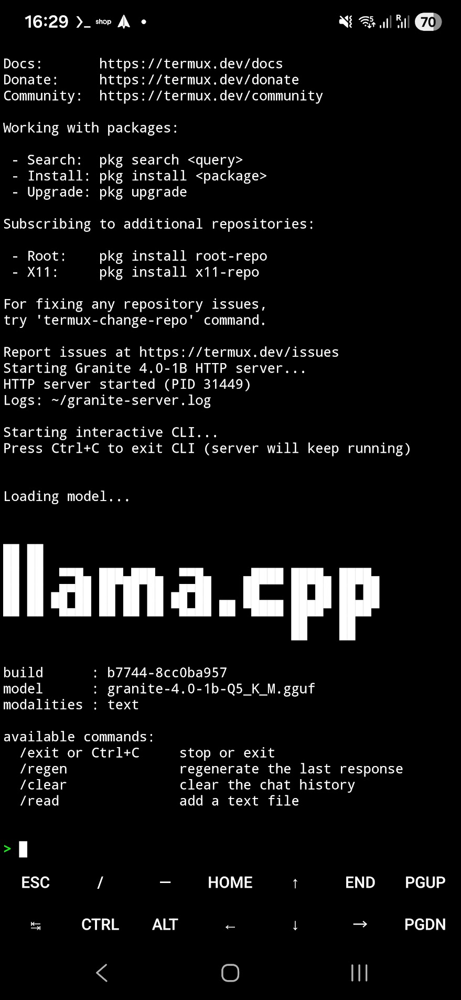
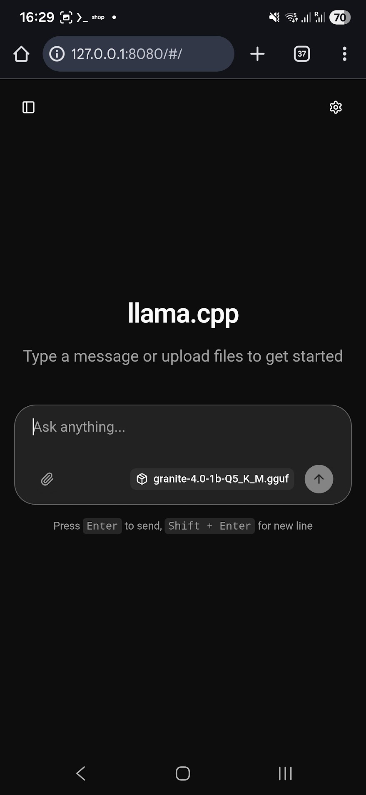
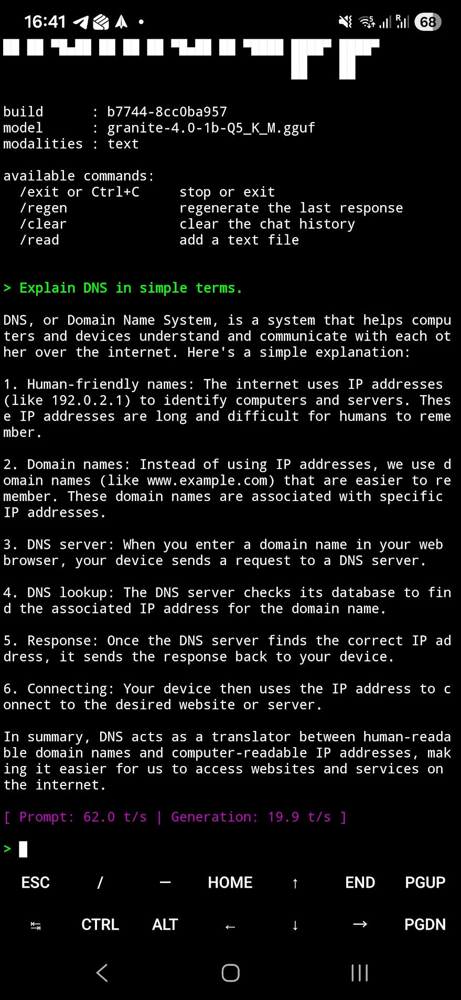
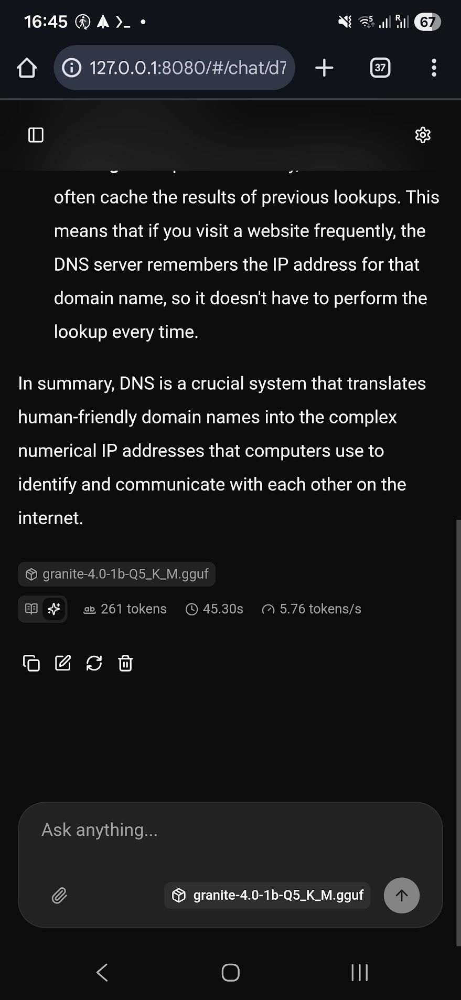

# Running Granite 4.0-1B locally on Android

This started the way these things usually do. Watching a podcast instead of doing something productive (I ended up writing this blog, so maybe it was productive after all).

I was listening to a Neuron AI episode about IBM’s new Granite 4 model family, with IBM Research’s [David Cox](linkedin.com/in/daviddanielcox) as the guest. During the discussion on model sizes and deployment targets, they talked about Granite 4 Nano, models designed specifically for edge and on-device use cases. At a certain moment the discussion turned to running these models on your phone.

Not as a hypothetical. Not as a demo. Just as a thing you could do.

That was enough.

Because once someone says “you can run this on your phone” in that context, the only reasonable response is to stop listening and try it yourself.

Granite 4 Nano isn’t pitched as a toy model. What makes it interesting is that it’s been designed to be small on purpose. That constraint shows up in how it behaves: more direct answers, less wandering, and a general sense that it’s meant to be used as a tool rather than a conversational novelty.

So that’s what this is. Granite 4.0-1B. Fully offline. Running locally on an Android phone. No cloud. No GPU. No vendor magic. Just a slightly unhealthy level of curiosity.

The result was surprisingly boring. Which is exactly what you want.

I’ve kept this intentionally step based so it’s easy to reproduce without guessing or filling in gaps.


## What this setup gives you

You get two primary ways to interact with Granite locally:

- An interactive CLI for quick prompts and experimentation
- A local web interface backed by an HTTP server

Both run fully offline. No accounts, no telemetry, no background calls to anything you didn’t ask for.

The CLI is exactly what you’d expect. It’s fast, direct, and good for testing prompts or sanity-checking behavior. Type a question, get an answer, move on.



The web interface is where things start to get more interesting. By exposing the model through a local HTTP server, you’re no longer tied to a terminal. You get streaming responses, a browser-based chat UI, and the ability to interact with the model over simple HTTP requests.



Once it’s reachable this way, Granite stops being “a chatbot on your phone” and starts behaving like a local service. Anything that can speak REST and send JSON can interact with it, including scripts, other apps, and automation tools like Tasker.

This is where the “tool, not a conversational novelty” idea actually shows up. You’re not limited to typing prompts into a UI. You can wire the model into workflows, triggers, and background tasks, all without leaving the device or relying on a network connection.

The setup stays intentionally minimal. No UI frameworks, no wrappers, no attempt to make this look like a consumer app. Just a local model, a simple server, and interfaces that stay out of the way. A tool.

By the end of the guide, Granite isn’t running as a demo. It’s running as a local service.


## Architecture (the short version)

At its core, this setup is very simple:

- A transformer-based Granite 4.0-1B model
- Executed locally using llama.cpp
- Running on an ARM64 Android device via Termux

There’s no acceleration layer hiding in the background. No GPU, no Vulkan, no NNAPI. Everything runs on the CPU.

The model itself is the standard transformer variant of Granite 4.0-1B. IBM also ships Granite 4.0-H models that use a hybrid architecture with state space layers. Those are designed for different runtimes and aren’t compatible with llama.cpp.

On top of the runtime, there are two execution paths:

- `llama-cli` for direct, interactive use
- `llama-server` for exposing the model over HTTP

Both binaries talk to the same model file and use the same execution backend. One model, two interfaces.

Quantization is where most of the practical trade-offs live. In short, quantization reduces model size by storing weights at lower precision. This setup uses a Q5_K_M quantized model, which strikes a balance between memory usage, speed, and reasoning quality.


## Prerequisites

There are a few things you need in place before this works. None of them are unusual, but missing any of them will show up later in less obvious ways.

### Android

You’ll need:

- An ARM64 Android device (I’m using a Galaxy S25 Ultra)
- At least 8 GB of RAM recommended
- Termux installed from F-Droid

The Play Store version of Termux is outdated and missing features required to build native code reliably. Download and install F-Droid, search for Termux, and install it from there. This is required if you want to follow along on your own.

### PC (model download only)

A separate machine is used only to download the model file:

- Python 3.10 or newer
- A Hugging Face account with a read token

If you don’t want to use Python or don’t want to switch devices, you can also download the model directly from the Hugging Face website and skip the token setup entirely:
https://huggingface.co/ibm-granite/granite-4.0-1b-GGUF

Once the model is downloaded and copied over, the PC is out of the picture entirely.

---

## Step 1: Install Termux

With the prerequisites out of the way, it’s time to set up the environment on the phone.

Once Termux is installed from F-Droid, open it and run:

```bash
pkg update
pkg upgrade -y
termux-setup-storage
```

This updates the base packages and sets up access to shared storage, which you’ll need later to place the model file somewhere outside Termux’s private directory.

You’ll be prompted to grant storage permissions. Accept them. There’s no workaround here that’s worth the effort.

After this completes, you should have a clean, up-to-date Termux environment ready to build native code.

---

## Step 2: Install build tools

With Termux set up, the next step is installing the tools needed to build llama.cpp locally.

```bash
pkg install -y git cmake clang make ninja
```

Once installation finishes, it’s worth checking that the basics are actually available:

```bash
git --version
cmake --version
clang --version
```

If any of these commands fail, stop here and fix that first. The build step won’t succeed otherwise.

---

## Step 3: Build llama.cpp

With the build tools installed, it’s time to compile llama.cpp on the device.

Start by cloning the repository and moving into it:

```bash
cd ~
git clone https://github.com/ggml-org/llama.cpp
cd llama.cpp
```

Then configure the build using CMake and Ninja:

```bash
cmake -S . -B build -G Ninja
cmake --build build -j $(nproc)
```

This builds llama.cpp using all available CPU cores. On a modern phone, this takes a few minutes at most.

Once the build completes, verify that the binaries were produced:

```bash
ls build/bin | grep llama
```

You should see `llama-cli` and `llama-server` in the output. If you don’t see them, check the build output and see if you can fix whatever is missing.

This build uses the CPU backend only. No GPU, no Vulkan, no NNAPI. Nothing else is required for this setup.

---

## Step 4: Select and download the Granite model

IBM provides multiple pre-quantized versions of Granite 4.0-1B on Hugging Face. They all share the same base model, but differ in how the weights are stored, which directly affects size, speed, and behavior.

The models live in this repository:

```text
ibm-granite/granite-4.0-1b-GGUF
```

### Why GGUF

llama.cpp does not run models in their original training format. It expects weights in **GGUF**, a runtime-friendly format designed specifically for efficient local inference.

GGUF bundles the model weights together with the metadata llama.cpp needs at runtime: tensor layouts, tokenizer information, and model parameters. That’s why these files can be loaded directly without extra configuration.

IBM provides Granite 4 Nano models already converted to GGUF, which removes an entire preparation step. There’s no need to export, quantize, or otherwise preprocess the model just to get it running.

If you want to, you still can.

The original Granite models can be converted to GGUF manually using llama.cpp’s conversion tools, and you can choose your own quantization settings in the process. That’s useful if you’re experimenting or targeting very specific constraints.

For this setup, there’s no real upside. The provided GGUF files are already tested and ready to run. Using them keeps the focus on running the model, not preparing it.

### Quantization choice

You’ll see a long list of files with names like Q2, Q4, Q5, Q8, and F16. These refer to different quantization levels.

At a high level:

- Lower quantization means smaller files and faster inference, but weaker reasoning
- Higher quantization means better output quality, but more memory usage and slower performance

On mobile, this is a balancing act. Very small models respond quickly but fall apart on anything beyond simple prompts. Very large ones work, but offer diminishing returns and unnecessary memory pressure.

For this setup, Q5_K_M is a good middle ground. It’s small enough to run comfortably on a modern phone, but consistent enough to handle longer prompts and multi-step instructions without drifting.

That’s the version used throughout the rest of this guide.

### Authentication and download

Granite models require authentication to download.

In this setup, authentication is handled using a Hugging Face read token provided via an environment variable. This avoids interactive logins and keeps the process scriptable and reproducible.

Create a read token via the Hugging Face web UI, then export it on your PC:

```powershell
$env:HUGGINGFACE_HUB_TOKEN="hf_..."
```

With the token set, download the model using Python:

```bash
python -c "from huggingface_hub import hf_hub_download; hf_hub_download(repo_id='ibm-granite/granite-4.0-1b-GGUF', filename='granite-4.0-1b-Q5_K_M.gguf', local_dir='granite-4.0-1b-gguf')"
```

If you don’t want to use Python or don’t want to switch devices, you can also download the model directly from the Hugging Face website and skip the token setup entirely:
https://huggingface.co/ibm-granite/granite-4.0-1b-GGUF

Once the file is downloaded, you’re done with the PC. The next step is moving the model onto the phone.

---

## Step 5: Copy the model to Android

Once the model file is downloaded, it needs to be copied onto the phone.

Place the file at the following location:

```text
/storage/emulated/0/models/granite-4.0-1b-Q5_K_M.gguf
```

On Android, `/storage/emulated/0` is the base directory you see when opening your file manager. It’s typically labeled as internal storage or phone storage. Creating a `models` folder there keeps things simple and easy to find.

The exact directory name doesn’t matter much, but keeping models outside Termux’s home directory makes them easier to manage and reuse later.

After copying the file, verify it from within Termux:

```bash
ls -lh /storage/emulated/0/models/granite-4.0-1b-Q5_K_M.gguf
```

You should see the file listed with a size of roughly 1.2 GB. If it’s there, Termux can access it and you’re ready to move on.

---

## Step 6: Manual validation run

Before wiring anything up or automating it, it’s worth making sure the model actually runs.

From inside the `llama.cpp` directory, run the following command:

```bash
cd ~/llama.cpp
./build/bin/llama-cli \
  -m /storage/emulated/0/models/granite-4.0-1b-Q5_K_M.gguf \
  -t 8 \
  -c 2048 \
  --temp 0.7 \
  --top-p 0.9 \
  -p "Explain DNS in simple terms."
```

On a Galaxy S25 Ultra, you should see something in the ballpark of:

- prompt processing around ~45–50 tokens/sec
- generation speed around ~20–22 tokens/sec



At around 20 tokens per second, generation is already faster than most people can read:)

The context size is set to 2048 tokens as a stable default for mobile. Larger values increase memory usage and don’t buy you much for this kind of setup.

If you run into out-of-memory errors, sudden process termination, or aggressive thermal throttling, reduce the thread count.

Reasonable fallbacks are:

```text
-t 6
```

or, if needed:

```text
-t 4
```

If this works, the hard part is over (not that hard really).

---

## Step 7: Startup script (server + CLI)

Now that the model runs manually, it’s time to make it slightly more useful. A web browser tends to be more user friendly than a terminal session anyway.

The goal here is simple:
- start the HTTP server in the background
- drop straight into an interactive CLI session (for the real techies amongst you)

Create a startup script in your home directory:

```bash
nano ~/granite-4.0-1b-start.sh
```

Add the following:

```bash
#!/data/data/com.termux/files/usr/bin/bash

MODEL="/storage/emulated/0/models/granite-4.0-1b-Q5_K_M.gguf"
BIN="$HOME/llama.cpp/build/bin"

$BIN/llama-server \
  -m "$MODEL" \
  -t 8 \
  -c 2048 \
  --host 127.0.0.1 \
  --port 8080 \
  > ~/granite-server.log 2>&1 &

sleep 3

$BIN/llama-cli \
  -m "$MODEL" \
  -t 8 \
  -c 2048 \
  --temp 0.7 \
  --top-p 0.9
```

Make the script executable:

```bash
chmod +x ~/granite-4.0-1b-start.sh
```

Run it:

```bash
./granite-4.0-1b-start.sh
```

When you exit the CLI, the HTTP server keeps running.

---

## Step 8: Web UI

With the server running, open a browser on the phone and navigate to:

```text
http://127.0.0.1:8080
```

That’s it.

You’ll get a web-based chat interface backed by the local HTTP server. Prompts are sent to the model, responses stream back in real time, and everything stays on-device. It is a bit slower than the CLI, but still very usefull.



The interface keeps things simple, but it’s not bare-bones. You get proper chat behavior: conversation history is preserved, responses can be edited and regenerated, and you can work with multiple chats in parallel. In practice, it behaves much like the web interfaces people are already used to, just backed by a model running locally on the device.

Because the server binds to `127.0.0.1`, it’s only accessible locally.

At this point, you can close the terminal if you like. As long as the server process is still running, the web UI will keep working.

---

## Step 9: Auto-start on Termux launch

At this point, everything works. The last step is making it stick.

The goal here is simple: when you open Termux, Granite starts automatically. No manual commands, no remembering which script to run. Ready to use, every time.

Edit your shell startup file:

```bash
nano ~/.bashrc
```

Append the following:

```bash
if [ -z "$GRANITE_STARTED" ]; then
  export GRANITE_STARTED=1
  ~/granite-4.0-1b-start.sh
fi
```

This ensures the startup script runs once per Termux session. The guard variable prevents accidental double starts, and closing Termux cleanly shuts everything down.

If Termux crashes or is force-stopped, the guard resets and Granite will start again the next time you open it.

### Stopping the server

If you want to stop the HTTP server without closing Termux:

```bash
pkill llama-server
```

That’s it. From here on out, opening Termux is enough to bring Granite back online.

---

## Notes

A few practical things worth keeping in mind after setting this up:

- Granite 4.0-H models use a hybrid architecture with state space layers and are not compatible with llama.cpp. This setup only applies to the transformer-based Granite 4 Nano models.
- Q5_K_M works well on modern phones. If you run into stability issues, lowering the thread count is usually the first thing to try.
- The CLI and HTTP server can run at the same time. Exiting the CLI does not affect the server as long as the Termux session stays open.
- Once the model is downloaded, everything runs fully offline. No network access is required for inference.
- The HTTP server is bound to localhost by default. Exposing it to the network is possible, but intentionally not covered here.
- Performance, thermals, and battery impact vary by device. Newer phones handle this comfortably, older ones may need more conservative settings.
- This setup is not optimized for background execution or long-running battery use. It’s meant to be practical, not invisible.

---

## References

- Neuron / The Neuron Daily article and video featuring IBM Research’s David Cox  
  https://www.theneurondaily.com/p/watch-ibm-asks-why-we-even-need-agi-they-have-a-solution
- IBM Granite 4 Nano announcement and model overview  
  https://huggingface.co/blog/ibm-granite/granite-4-nano
- IBM Granite model documentation  
  https://www.ibm.com/granite/docs/models/granite
- IBM announcement on Granite 4.0 hybrid and Nano models  
  https://www.ibm.com/new/announcements/ibm-granite-4-0-hyper-efficient-high-performance-hybrid-models
- Granite 4.0-1B GGUF repository on Hugging Face  
  https://huggingface.co/ibm-granite/granite-4.0-1b-GGUF

---

### Closing

At this point, Granite is running locally on the device, starts automatically with Termux, and is accessible both interactively and over HTTP.

I’ve said this already, but that’s what a closing is for, right?

There’s no cloud dependency, no account setup, and no special runtime beyond what’s shown above. Once the model is in place, everything else is just process management.

It’s not particularly impressive to look at.
It’s just useful.

Which is exactly what you want from a local model.

Have fun!