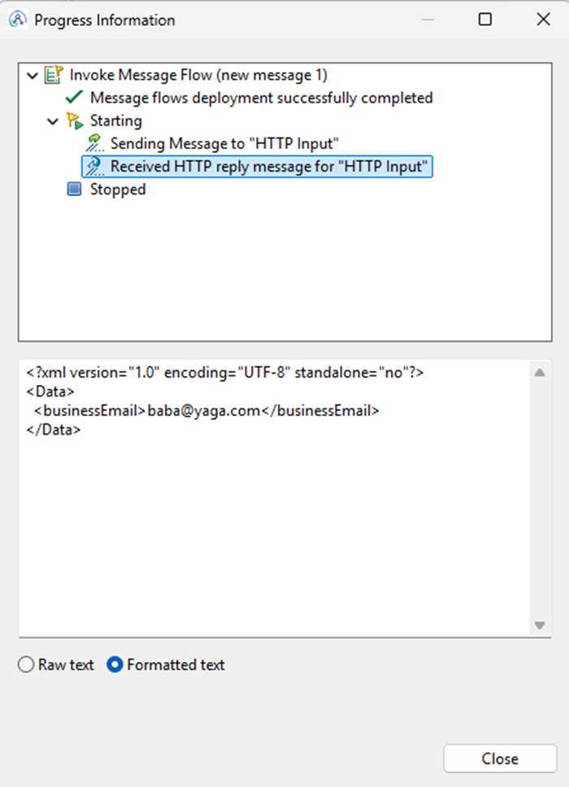

# Select The Row

## Exploring the IBM ACE SELECT, ROW and THE functions in ESQL

Let’s talk about SELECT in ESQL — and I don’t mean database queries (although they are rather similar). I mean using SELECT to slice and dice message data inside IBM App Connect Enterprise (ACE). Think of it like SQL, but for navigating the message tree instead of a table.

This post is all about the different ways you can use SELECT in ACE: returning arrays, rows, or just that one perfect value. To clarify, I’ve built out a quick demo flow with a very simple message structure, grabbed the outputs, and broken it all down for you.

We’ll look at:

* Using plain SELECT to return a list of array items
* Wrapping SELECT with ROW to structure the reply as a single array
* Using THE to pull just one value (hence the title 😉)

Here’s the input JSON I’m working with:

```json
{
  "contact": {
    "info": {
      "name": "John",
      "lastName": "Wick",
      "title": "baba yaga"
    },
    "details": {
      "phone": [{ "type": "business", "number": "911" }],
      "email": [
        { "type": "personal", "address": "john@wick.com" },
        { "type": "business", "address": "baba@yaga.com" },
        { "type": "personal", "address": "shootemup@aol.com" }
      ]
    }
  }
}
```

Catchy, right?

All the source code and resources used in this blog can be downloaded from my [GitHub repository.](https://github.com/matthiasblomme/Ace_test_cases/tree/main/SelectTheRow)

---

## Plain SELECT – returning a message tree

Let’s start simple. We want to grab all the personal email addresses and return them as a JSON array.

I’ll be using a very simple flow (the same setup for all 3 examples):


Parsing the input data is done by the following ESQL code from the RetrieveEmailList Compute Node:


```esql
-- create proper json structure
CREATE FIELD OutputRoot.JSON.Data.emailList IDENTITY(JSON.Array);

-- select required data
SET OutputRoot.JSON.Data.emailList.Item[] = (
  SELECT U.address
  FROM InputRoot.JSON.Data.contact.details.email.Item[] AS U
  WHERE U.type = 'personal'
);
```

And here's what we get back:

```json
{
  "emailList": [
    { "address": "john@wick.com" },
    { "address": "shootemup@aol.com" }
  ]
}
```

Note:

That CREATE FIELD with IDENTITY(JSON.Array) is key — without it, you might run into JSON formatting weirdness or errors. Always prep your output structure when working with arrays in JSON.

If you remove the JSON Array creation block, your output would look like this:

```json
{
  "emailList" : {
    "Item" : {
      "address" : "shootemup@aol.com"
    }
  }
}
```

Since the fields are not known to be an array, they overwrite each other on output, and you only get to see the last value.

## SELECT + ROW – returning a tree structure

Now let’s return the same data, but as a ROW. This can be useful when you want to work with a single structured block of data, not loose array elements.

The test flow:


The ESQL code from the RetrieveEmailRow Compute Node:


The code block:

```esql
-- create proper json structure
CREATE FIELD OutputRoot.JSON.Data.emailRow IDENTITY(JSON.Array);

-- select required data into a row
SET OutputRoot.JSON.Data.emailRow = ROW (
  SELECT U.address
  FROM InputRoot.JSON.Data.contact.details.email.Item[] AS U
  WHERE U.type = 'personal'
);
```

Output:

```json
{
  "emailRow": [
    { "address": "john@wick.com" },
    { "address": "shootemup@aol.com" }
  ]
}
```

Functionally this is still returning multiple items, but we’ve wrapped them in a ROW constructor. It’s subtly different in how ACE handles the result internally, especially if you plan to reuse or reference the result as a single variable downstream. Even though the resulting JSON looks the same, with or without the ROW cast, there is a difference in the internal structure.

Internally, using ROW(...) changes how the data is handled in memory - it's treated as a single row structure rather than a collection of elements. This can be important when you’re manipulating the result later or passing it between compute nodes.

Below you can see the structure without the ROW cast on the left, with the ROW cast on the right. For the data on the left, you have to create an array, emailList, and select the data directly into the Item subfields, as you can see from the previous chapter. For the data on the right, the ROW function fills up the _emailRow_ array.


## SELECT + THE – grab one specific value

This is where it gets fun. Let’s say we only want one business email - just the first match. This is where THE comes in handy. It returns a single scalar value from the result set — no array, no row, just the value.

The flow I’ll be using:


The RetrieveEmail ESQL code:


The code block: 

```esql
-- select the first match
SET Environment.Variables.businessEmail = THE (
  SELECT U.address
  FROM InputRoot.JSON.Data.contact.details.email.Item[] AS U
  WHERE U.type = 'business'
);

-- return the value of the selected data
SET OutputRoot.JSON.Data.businessEmail = Environment.Variables.businessEmail.address;
```

Result:

```json
{
  "businessEmail": "baba@yaga.com"
}
```

Note that I assign Environment.Variables.businessEmail.address to the OutputRoot and not Environment.Variables.businessEmail. THE gives you the first matching row, but when assigned to a variable, the structure is nested. That’s why we explicitly extract address to flatten the response.

If I did the same but changed the SELECT to retrieve personal emails, not the business emails, I get the following result:


Which is the first personal email in the returned list. I didn’t update the variable name - got a bit lazy 😊 - but you get the idea.

THE is your go-to when you're expecting only one value. If there are multiple matches, it'll return the first. If there are none - well, we all know what ESQL does with NULL values.

## SELECT THE ROW – recap

| Technique    | Use Case                                 | Output Structure                       |
| ------------ | ---------------------------------------- | -------------------------------------- |
| SELECT       | Retrieve a list of values                | JSON array elements                    |
| ROW(SELECT…) | Wrap the multiple values as a single row | JSON array (internally treated as row) |
| THE(SELECT…) | Return a single value (first match)      | Single value                           |


## Beyond This Demo: SELECT Can Do More

While this post focused on using SELECT to extract and shape data within a message, it’s worth noting that SELECT in ESQL is far more powerful. You can use it to:

* Transform message content into different structures
* Join elements across multiple parts of a message tree
* Translate values based on conditions or lookups
* And even combine it with other ESQL features for more complex flows

It’s one of the most flexible and expressive tools in the ESQL toolbox — and this post is just a slice of what it can do.

If you want to explore further, check out the links below.


## What about Java

Not a fan of ESQL? No worries - you can do the same thing using a Java Compute Node. The syntax is different, but the logic is the same: extract values, structure your output, and go. Below are two ways to approach it: manual traversal and XPath (for XML only).

Let’s say we want to do the following:

* Get all personal email addresses (similar to our SELECT ... WHERE U.type = 'personal')
* Get the first business email (like THE(SELECT ...))

To do this in Java, you can use XPath or manually walk the MbElement tree. There are multiple ways of walking the MbElement tree in Java, we will just stick with one for now (more are coming in a following blog).


### Working with JSON (manual tree traversal)

Extracting all personal emails while walking the MbElement tree:


If you prefer to copy paste the user code block

```java
// Add user code below

// Create OutputRoot JSON structure
MbElement outRoot = outMessage.getRootElement();
MbElement jsonRoot = outRoot.createElementAsLastChild(MbJSON.PARSER_NAME);
MbElement data = jsonRoot.createElementAsLastChild(MbElement.TYPE_NAME, MbJSON.DATA_ELEMENT_NAME, null);

// Get the input email array
MbElement emailArrayInput = inMessage.getRootElement()
	.getFirstElementByPath("/JSON/Data/contact/details/email");

// Create output emailArray array
MbElement emailArray = data.createElementAsLastChild(MbJSON.ARRAY, "emailArray", null);

// Init tracking for first business email
MbElement inputRootElm = inMessage.getRootElement();

String businessEmail = null;

// Loop through email elements once
MbElement current = emailArrayInput.getFirstChild();
while (current != null) {
	MbElement typeElem = current.getFirstElementByPath("type");
	MbElement addressElem = current.getFirstElementByPath("address");

	if (typeElem != null && addressElem != null) {
		String type = typeElem.getValueAsString();
		String address = addressElem.getValueAsString();

		if ("personal".equals(type)) {
			MbElement item = emailArray.createElementAsLastChild(MbElement.TYPE_NAME, "Item", null);
			item.createElementAsLastChild(MbElement.TYPE_NAME_VALUE, "address", address);
		}

		if ("business".equals(type) && businessEmail == null) {
			businessEmail = address;
		}
	}
	current = current.getNextSibling();
}

// Add businessEmail to output if found
if (businessEmail != null) {
	data.createElementAsLastChild(MbElement.TYPE_NAME_VALUE, "businessEmail", businessEmail);
}

// End of user code
```

> Note: you don’t need to define type and address as separate string variables, it just makes debugging easier 😉

Extracting the first business email (single value) with XPath is unfortunately only possible with XML messages and doesn’t work for JSON. That is why in the above example I’ve added the business email code inside the loop.

The above code results in the following message:


### Working with XML (XPath)

In case you are handling XML messages, you can extract the first business email with the following XPath expression:

```java
MbXPath xp = new MbXPath("/contact/details/email[type='business'][1]/address");
List<MbElement> nodeset = (List<MbElement>)inMessage.evaluateXPath(xp);
```

Working that into a JavaCompute node gives you the following code:


We’ll be using the following XML input message:

```xml
<?xml version="1.0" encoding="UTF-8"?>
<contact>
  <info>
    <name>John</name>
    <lastName>Wick</lastName>
    <title>baba yaga</title>
  </info>
  <details>
    <phone>
      <type>business</type>
      <number>911</number>
    </phone>
    <email>
      <type>personal</type>
      <address>john@wick.com</address>
    </email>
    <email>
      <type>business</type>
      <address>baba@yaga.com</address>
    </email>
    <email>
      <type>personal</type>
      <address>shootemup@aol.com</address>
    </email>
  </details>
</contact>
```

Which results in the following output message:




## Wrapping Up

Whether you prefer ESQL or Java, the key takeaway is that ACE gives you flexible tools to extract and shape your data — you just need to know which approach fits your use case.

We've looked at three special ESQL functions, using SELECT, ROW(...), and THE(...), and saw how the same logic can be implemented in Java using tree traversal (for JSON) or XPath (for XML).

Hopefully, this helped demystify the different ways to “select the row”, and helps you optimize your ACE integrations!

Until next time!

---

## Resources:

* [https://www.ibm.com/docs/en/app-connect/12.0?topic=esql-using-select-function](https://www.ibm.com/docs/en/app-connect/12.0?topic=esql-using-select-function)
* [https://www.ibm.com/docs/en/app-connect/12.0?topic=function-returning-scalar-value-in-message](https://www.ibm.com/docs/en/app-connect/12.0?topic=function-returning-scalar-value-in-message)
* [https://www.ibm.com/docs/en/app-connect/12.0?topic=function-transforming-simple-message](https://www.ibm.com/docs/en/app-connect/12.0?topic=function-transforming-simple-message)
* [https://www.ibm.com/docs/en/app-connect/12.0?topic=function-transforming-complex-message](https://www.ibm.com/docs/en/app-connect/12.0?topic=function-transforming-complex-message)
* [https://www.ibm.com/docs/en/app-connect/12.0?topic=function-joining-data-in-message](https://www.ibm.com/docs/en/app-connect/12.0?topic=function-joining-data-in-message)
* [https://www.ibm.com/docs/en/app-connect/12.0?topic=functions-select-function](https://www.ibm.com/docs/en/app-connect/12.0?topic=functions-select-function)
* [https://www.ibm.com/docs/en/app-connect/12.0?topic=functions-row-constructor-function](https://www.ibm.com/docs/en/app-connect/12.0?topic=functions-row-constructor-function)
* [https://www.ibm.com/docs/en/app-connect/12.0?topic=elf-function](https://www.ibm.com/docs/en/app-connect/12.0?topic=elf-function)
* [https://github.com/matthiasblomme/Ace\_test\_cases/tree/main/SelectTheRow](https://github.com/matthiasblomme/Ace_test_cases/tree/main/SelectTheRow)

---

Written by [Matthias Blomme](https://www.linkedin.com/in/matthiasblomme/) and [Francis Cocx](https://www.linkedin.com/in/cocxfrancis/)
