<!--MD_POST_META:START-->
<div class="md-post-meta">
  <div class="md-post-meta-left">2026-04-17 · ⏱ 22 min</div>
  <div class="md-post-meta-right"><span class="post-share-label">Share:</span> <a class="post-share post-share-linkedin" href="https://www.linkedin.com/sharing/share-offsite/?url=https%3A%2F%2Fmatthiasblomme.github.io%2Fblogs%2Fposts%2Fsetup-ace-vault%2Fsetup-ace-vault%2F" target="_blank" rel="noopener" title="Share on LinkedIn">[<span class="in">in</span>]</a></div>
</div>
<hr class="md-post-divider"/>
<div class="md-post-tags"><span class="md-tag">ace</span> <span class="md-tag">security</span> <span class="md-tag">vault</span> <span class="md-tag">ext-vault</span> <span class="md-tag">mqsisetdbparms</span></div>
<!--MD_POST_META:END-->

# How to set up the IBM ACE vault from scratch

The IBM ACE vault replaces the older (and less secure) `mqsisetdbparms` setup. Credentials are encrypted with AES-256, stored locally, and only accessible with the vault key. Two new commands do the work:

- `mqsivault` to create a vault store
- `mqsicredentials` to encrypt and store credentials inside it

There are three vault types:

- **Integration node vaults**: shared across all node-owned processes (server, HTTP listener, etc.)
- **Integration server vaults**: used by a single integration server and stored inside the work directory
- **External vaults**: stored outside the node or server. Not natively managed by the ACE cloud operator, but fully usable in Kubernetes if you build your own images or manage the vault directory yourself.

This post covers the server vault and the external vault. If you're not sure which one fits your setup, you will be by the end.

## Server vault

The server vault lives inside the integration server's work directory. Everything is local to that one server.

### Create the integration server

From the toolkit, create a standalone integration server. Make sure the "use external vault" option is unchecked.

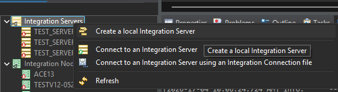

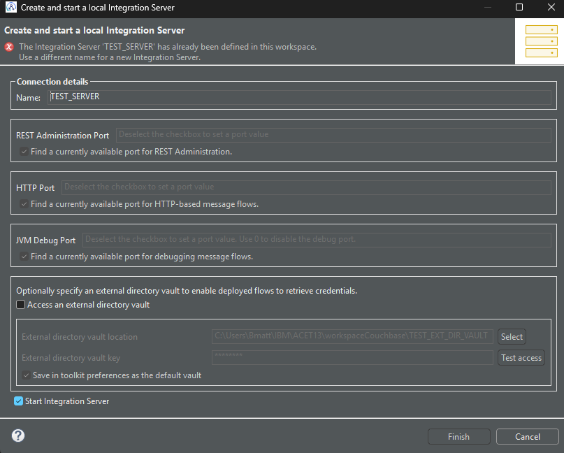

Or from the command line:

```powershell
IntegrationServer --work-dir C:\Users\Bmatt\IBM\ACET13\workspace\TEST_SERVER_VAULT
```

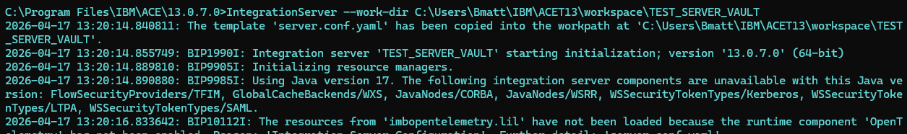

The Integration Server keeps running until you close the session or terminate the command.

### Stop the integration server

The vault can only be created against a stopped integration server, so stop it first.

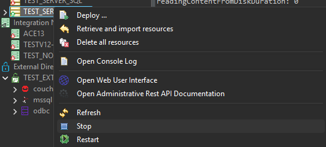

If you created the Integration Server via the CLI, just hit `ctrl` + `c` or close the terminal.

### Create the vault

Use `mqsivault` to create the vault:

```
C:\Program Files\IBM\ACE\13.0.7.0>mqsivault --work-dir c:\Users\Bmatt\IBM\ACET13\workspace\TEST_SERVER_VAULT --create --vault-key passw0rd
BIP8071I: Successful command completion.
```

### Start the integration server

From the toolkit, start the integration server and enter the vault key when prompted.

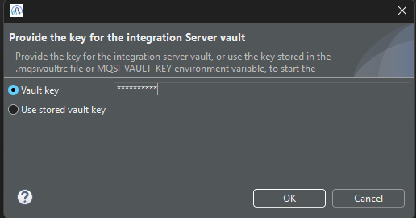

From here you can add credentials directly.

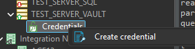

Or from the command line:

```powershell
C:\Program Files\IBM\ACE\13.0.7.0>IntegrationServer --work-dir C:\Users\Bmatt\IBM\ACET13\workspace\TEST_SERVER_VAULT --vault-key passw0rd
2026-04-17 13:27:32.466808: BIP1990I: Integration server 'TEST_SERVER_VAULT' starting initialization; version '13.0.7.0' (64-bit)
2026-04-17 13:27:32.516902: BIP10103I: Using integration server vault.
2026-04-17 13:27:32.524074: BIP9905I: Initializing resource managers.
```

### Insert credentials

Now that the vault exists, insert some credentials. You can do this both from the CLI or from the toolkit.

**Via the CLI**

The pattern for `mqsicredentials` is:

```
mqsicredentials --work-dir <location of your IS> --create --vault-key <key of the previously made vault> --credential-type <type of the credential> --credential-name <name of the credential> --…
```

Depending on the credential type, you'll add other parameters, like:

- `--username`
- `--password`
- `--apikey`
- `--access-token`
- ...

A basic example is creating a user defined credential:

```powershell
C:\Program Files\IBM\ACE\13.0.7.0>mqsicredentials --create --work-dir c:\Users\Bmatt\IBM\ACET13\workspace\TEST_SERVER_VAULT --vault-key passw0rd --credential-type userdefined --credential-name UD1 --user username1 --password passw0rd
BIP15137I: The Integration Server/Integration Node is running. The value provided for the 'vault-key' parameter will not be used.
BIP15119I: The 'create' action was successful for credential name 'UD1' of type 'userdefined'.

BIP8071I: Successful command completion.
```

Or setting the broker truststore password:

```powershell
C:\Program Files\IBM\ACE\13.0.7.0>mqsicredentials --work-dir c:\Users\Bmatt\IBM\ACET13\workspace\TEST_SERVER_VAULT --create --vault-key passw0rd --credential-type truststore --credential-name password --password somePassword
BIP15137I: The Integration Server/Integration Node is running. The value provided for the 'vault-key' parameter will not be used.
BIP15119I: The 'create' action was successful for credential name 'password' of type 'truststore'.

BIP8071I: Successful command completion.
```

You can also report stored credentials by type, either all at once or a specific one:

```powershell
C:\Program Files\IBM\ACE\13.0.7.0>mqsicredentials --report --work-dir c:\Users\Bmatt\IBM\ACET13\workspace\TEST_SERVER_VAULT --vault-key passw0rd --credential-type userdefined
BIP15137I: The Integration Server/Integration Node is running. The value provided for the 'vault-key' parameter will not be used.
BIP15110I: The credential name 'UD1' of type 'userdefined' contains user name 'username1' from provider 'servervault' and has the following properties defined: 'password, webspherePassword, clientPrivateKeyPassword', authentication type 'allOptional'.
BIP15110I: The credential name 'UD2' of type 'userdefined' contains user name 'username1' from provider 'servervault' and has the following properties defined: 'password, webspherePassword, clientPrivateKeyPassword', authentication type 'allOptional'.

BIP8071I: Successful command completion.
```

```powershell
C:\Program Files\IBM\ACE\13.0.7.0>mqsicredentials --report --work-dir c:\Users\Bmatt\IBM\ACET13\workspace\TEST_SERVER_VAULT --vault-key passw0rd --credential-type userdefined --credential-name UD1
BIP15137I: The Integration Server/Integration Node is running. The value provided for the 'vault-key' parameter will not be used.
BIP15110I: The credential name 'UD1' of type 'userdefined' contains user name 'username1' from provider 'servervault' and has the following properties defined: 'password, webspherePassword, clientPrivateKeyPassword', authentication type 'allOptional'.

BIP8071I: Successful command completion.

```

**Via the toolkit**

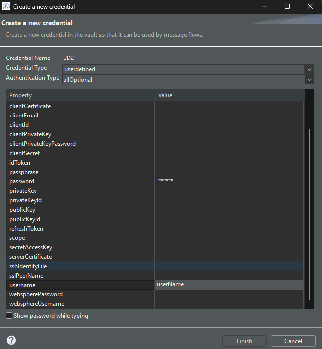

You can also check what has been created by simply clicking the credentials and selecting `Update credential`.

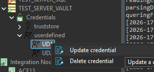

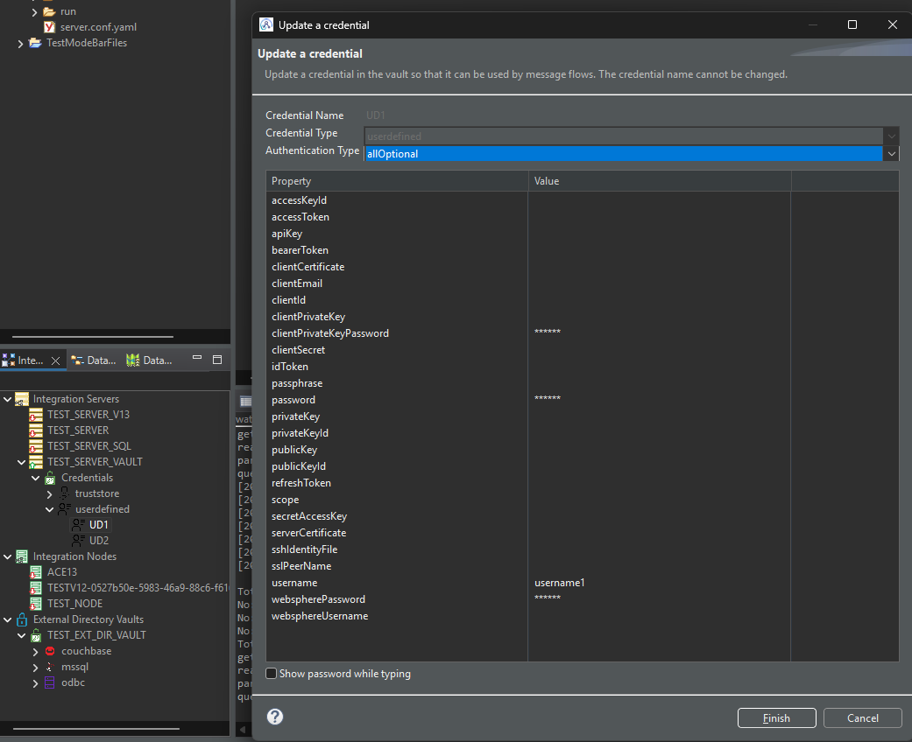


### Validate a stored credential

With the old `mqsisetdbparms` you could check a password by passing it to `mqsireportdbparms`:

```powershell
C:\Program Files\IBM\ACE\13.0.7.0>mqsisetdbparms --work-dir C:\Users\Bmatt\IBM\ACET12\workspace\TEST_SERVER --resource sftp::test --user matthias --password passw0rd
BIP8071I: Successful command completion.
```

And then verifying it:

```powershell
C:\Program Files\IBM\ACE\13.0.7.0>mqsireportdbparms --work-dir C:\Users\Bmatt\IBM\ACET12\workspace\TEST_SERVER --resource sftp::test --user matthias --password passw0rd
BIP8180I: The resource name 'sftp::test' has userID 'matthias'.
BIP8201I: The password you entered, 'passw0rd' for resource 'sftp::test' and userId 'matthias' is correct.
BIP8206I: The Integration node is not running and may not have been restarted since the last change made by the mqsisetdbparms command.

BIP8071I: Successful command completion.
```

`mqsicredentials` doesn't have that validation feature, but you can extract a single credential using the vault decode. You have to build the path yourself, shaped like `credentials/<credentials_type>/<credentials_name>`:

The Integration Server has to be down for the command to work, and the credentials name is also case sensitive, just something to remember.

```powershell
C:\Program Files\IBM\ACE\13.0.7.0>mqsivault --work-dir c:\Users\Bmatt\IBM\ACET13\workspace\TEST_SERVER_VAULT --vault-key passw0rd --decode "credentials/userdefined/UD1"
Namespace: credentials
Record: userdefined/UD1
{"name":"UD1","type":"userdefined","properties":{"authType":"allOptional","password":"passw0rd","username":"username1"}}
BIP8071I: Successful command completion.
```

That gives you the stored values back as plain JSON, which is the closest you'll get to the old `mqsireportdbparms` sanity check.

## External vault

The external vault lives outside the integration server. You create it independently and then point one or more servers at it.

Why bother with an external vault when the server vault works fine? A few reasons:

- **Portable**: the vault is just a directory. You can move it, copy it, back it up, whatever you need.
- **Not tied to a single integration server**: multiple servers can point at the same vault, so you manage credentials once instead of per server.
- **Easy to include in pipelines and Kubernetes**: you can include the vault directory in your CI/CD pipeline or mount it into containers and reference it from your custom resources. No need to inject credentials at startup.
- **No downtime for vault operations**: with a server vault, certain commands (like decode) require the integration server to be stopped. The external vault lives separately, so you can manage it without touching a running server.

If you're running a single standalone integration server, the server vault is probably enough. But the moment you're managing multiple servers or deploying to Kubernetes, the external vault is the cleaner option.

It also makes sharing between developers straightforward. Hand someone the vault directory and the key, and they skip the full credential setup. Useful for new projects and onboarding alike.

### Create the external vault

The external vault is also created with `mqsivault`, but with different flags. Instead of `--vault-key` and `--work-dir`, you pass `--ext-vault-key` and `--ext-vault-dir` to specify where the vault should live:

```powershell
C:\Program Files\IBM\ACE\13.0.7.0>mqsivault --ext-vault-dir c:\Users\Bmatt\IBM\ACET13\workspace\EXT_VAULT --create --ext-vault-key passw0rd
BIP8071I: Successful command completion.
```

The vault directory doesn't need to be inside any integration server's work directory. That's the whole point. And unlike the server vault, you don't need a running (or even existing) integration server to create one.

### Insert credentials

Inserting credentials into an external vault follows the same `mqsicredentials` pattern, but again with `--ext-vault-dir` and `--ext-vault-key` instead of `--work-dir` and `--vault-key`:

```powershell
C:\Program Files\IBM\ACE\13.0.7.0>mqsicredentials --create --ext-vault-dir c:\Users\Bmatt\IBM\ACET13\workspace\EXT_VAULT --ext-vault-key passw0rd --credential-type userdefined --credential-name UD1 --user username1 --password passw0rd
BIP15119I: The 'create' action was successful for credential name 'UD1' of type 'userdefined'.

BIP8071I: Successful command completion.
```

The credential types and parameters are identical to the server vault. The only difference is where the vault sits.

### Report credentials

Reporting works the same way. Use `--report` with the external vault flags:

```powershell
C:\Program Files\IBM\ACE\13.0.7.0>mqsicredentials --report --ext-vault-dir c:\Users\Bmatt\IBM\ACET13\workspace\EXT_VAULT --ext-vault-key passw0rd --credential-type userdefined --credential-name UD1
BIP15110I: The credential name 'UD1' of type 'userdefined' contains user name 'username1' from provider 'extdirvault' and has the following properties defined: 'password', authentication type 'allOptional'.

BIP8071I: Successful command completion.
```

### Validate a stored credential

The vault decode also works against external vaults. Same pattern, just with `--ext-vault-dir` and `--ext-vault-key`:

```powershell
C:\Program Files\IBM\ACE\13.0.7.0>mqsivault --ext-vault-dir c:\Users\Bmatt\IBM\ACET13\workspace\EXT_VAULT --ext-vault-key passw0rd --decode "credentials/userdefined/UD1"
Namespace: credentials
Record: userdefined/UD1
{"name":"UD1","type":"userdefined","properties":{"authType":"allOptional","password":"passw0rd","username":"username1"}}
BIP8071I: Successful command completion.
```

### Connect the external vault to the toolkit

Once the vault exists and has credentials in it, you can connect it to the toolkit so you can manage everything from the UI instead of the command line.

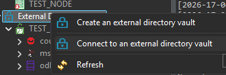

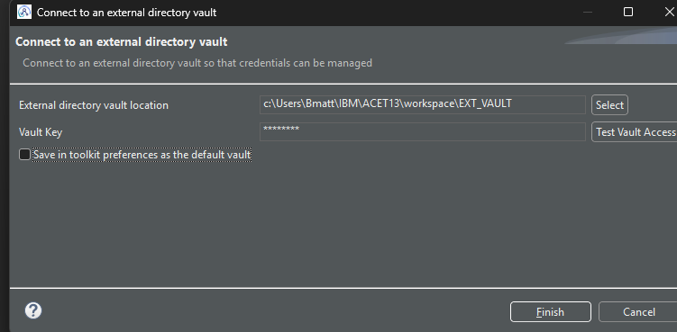

If you click on `Test Vault Access`, you can verify you have the proper setup 

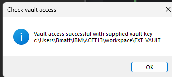

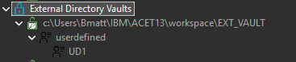

### Insert credentials via the toolkit

With the external vault connected, the toolkit gives you a UI to insert and manage credentials directly. Same result as the CLI, just without typing out the full `mqsicredentials` command every time.

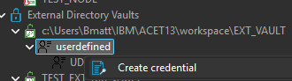

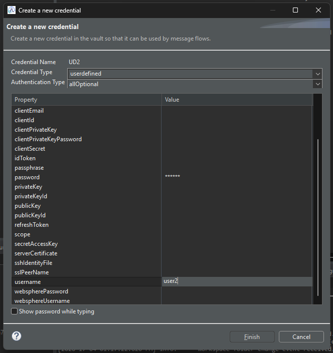

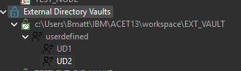

### Couple the external vault to an existing integration server

If you already have an integration server running and want to switch it to an external vault, the server needs to be stopped first.

Edit `overrides/server.conf.yaml` directly and set the external vault path:

```yaml
Credentials:
  ExternalDirectoryVault:
    directory: 'C:\Users\Bmatt\IBM\ACET13\workspace\EXT_VAULT'
```

Restart the integration server with `--ext-vault-key` for the change to take effect.

```powershell
C:\Program Files\IBM\ACE\13.0.7.0>IntegrationServer --work-dir C:\Users\Bmatt\IBM\ACET13\workspace\TEST_SERVER_VAULT --ext-vault-key passw0rd
2026-04-17 13:57:50.260428: BIP1990I: Integration server 'TEST_SERVER_VAULT' starting initialization; version '13.0.7.0' (64-bit)
2026-04-17 13:57:50.316068: BIP10104I: Using external directory vault 'C:\Users\Bmatt\IBM\ACET13\workspace\EXT_VAULT'.
2026-04-17 13:57:50.379688: BIP9905I: Initializing resource managers.
```

You can't combine a server vault with an external vault in the same Integration Server, just pick one.

### Create an integration server with the external vault

If you're starting fresh, you can point the server at the external vault from the start. From the toolkit, create a new integration server and fill in the external vault location and key.

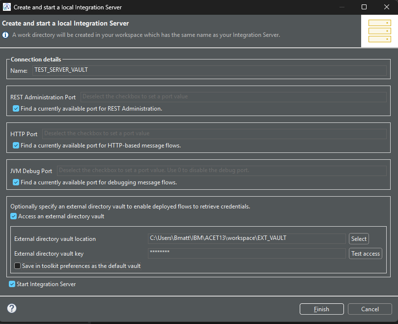


## ibmint

If you're working with `ibmint` instead of the older `mqsi*` commands, the same functionality is available. The flag names are slightly different though, so here's what the equivalent commands look like.

Creating an external vault:

```powershell
C:\Program Files\IBM\ACE\13.0.7.0>ibmint create vault c:\Users\Bmatt\IBM\ACET13\workspace\EXT_VAULT_2 --external-directory-vault-key passw0rd
BIP8071I: Successful command completion.
```

And inserting a credential:

```powershell
C:\Program Files\IBM\ACE\13.0.7.0>ibmint set credential --external-directory-vault c:\Users\Bmatt\IBM\ACET13\workspace\EXT_VAULT_2 --external-directory-vault-key passw0rd --credential-type userdefined --credential-name UD1 --user username1 --password passw0rd
BIP15119I: The 'CREATE' action was successful for credential name 'UD1' of type 'userdefined'.
BIP8071I: Successful command completion.
```

Notice the vault path is a positional argument for `ibmint create vault` but a named flag (`--external-directory-vault`) for `ibmint set credential`. And `--ext-vault-key` becomes `--external-directory-vault-key`. Not a huge deal, but easy to get wrong if you're copying from the `mqsi*` examples above.

## Beyond the basics

This post covers the core setup, but there are a few more vault operations worth knowing about:

- **Deleting credentials**: `mqsicredentials` supports `--delete` to remove a stored credential from the vault.
- **Changing the vault key**: `mqsivault` supports `--change-vault-key` if you need to rotate the key.
- **Destroying a vault**: `mqsivault` supports `--destroy` to wipe the vault entirely.

Keep the vault key somewhere safe. You'll need the same setup again when you wire this into your pipeline build.

---

# References

[Configuring an IBM App Connect Enterprise vault](https://www.ibm.com/docs/en/app-connect/13.0.x?topic=enterprise-configuring-app-connect-vault)

[Configuring encrypted security credentials](https://www.ibm.com/docs/en/app-connect/13.0.x?topic=vault-configuring-encrypted-security-credentials)

[mqsivault command](https://www.ibm.com/docs/en/app-connect/13.0.x?topic=commands-mqsivault-command)

[mqsicredentials command](https://www.ibm.com/docs/en/app-connect/13.0.x?topic=commands-mqsicredentials-command)

---

Written by [Matthias Blomme](https://www.linkedin.com/in/matthiasblomme/)

\#IBMChampion \
\#AppConnectEnterprise
