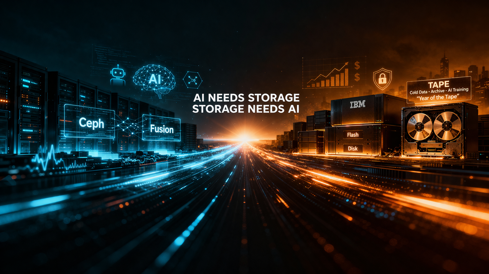
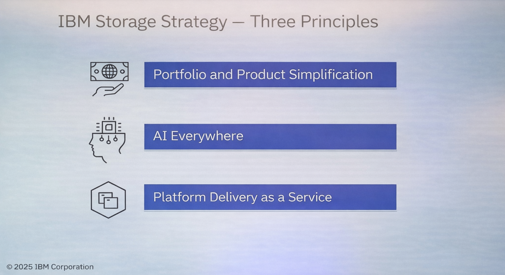
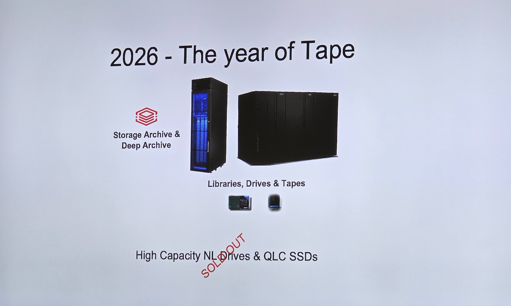
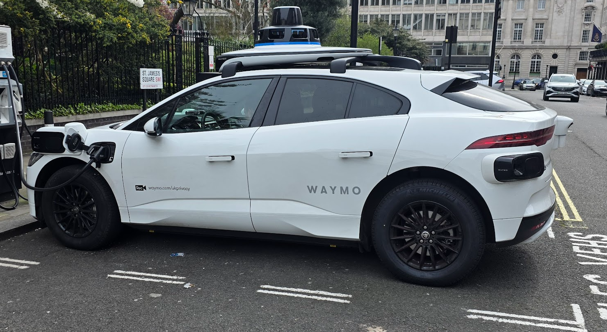

{ .md-banner }

<!--MD_POST_META:START-->

  
Matthias Blomme · 2026-03-27 · ⏱ 9 min

  
Share: <a class="post-share post-share-linkedin" href="https://www.linkedin.com/sharing/share-offsite/?url=https%3A%2F%2Fmatthiasblomme.github.io%2Fblogs%2Fposts%2Fstorage-days-2026%2Fstorage-days-2026%2F" target="_blank" rel="noopener" title="Share on LinkedIn">[in]</a>

IBM AI Storage Flash Ceph Fusion London Waymo

<!--MD_POST_META:END-->

# IBM Storage Strategy Days 2026: two days at the IBM Storage Strategy Event

No middleware this time, sorry. I wanted to know more about storage for a change.

That probably says enough already. Usually I end up orbiting around integration, middleware, agents, automation, and whatever else is happening closer to the application side. This time I deliberately looked lower in the stack. Personal growth, apparently.

After two days at the IBM Storage Strategy Event, I did not come away with some sudden urge to become a storage specialist, but I did leave with a new appreciation for the people who are. There is a lot going on with storage. 

What stuck with me most, though, was how much storage is being pulled into the AI story itself. Storage is clearly being pushed much closer to the center of the AI conversation, and not just as the place where data happens to sit until something smarter comes along. That something smarter is already here.

That much was hard to miss over those two days. I did not walk away thinking storage had suddenly become glamorous. I did walk away thinking it is becoming a lot harder to treat it as background infrastructure, and rightly so.

## Why this actually caught my attention

Now, let’s wind back to the beginning of the event. As I already mentioned, I’m no storage expert, but I did want to know a bit more about what was going on in storage-land. Needless to say, it caught me off guard a bit, in a good way.

If anything, I expected a couple of useful updates, a few product slides, and the usual amount of strategic wording wrapped around infrastructure.

What became clear instead was how directly storage is now being tied to AI. Not in the vague “AI-ready” way that gets pasted onto everything these days, but in a more practical sense. The underlying point was pretty clear.

That was probably the part that stayed with me most over those two days. The real bottleneck is not just the model, or the GPU, or your benchmark numbers, or all of the above. It is the data. Where it sits, how fast you can get to it, how well it moves, how much it costs, and how painful it is to manage once it has to work in a real environment.

That shift in emphasis is what made the event interesting to me. Not storage on its own, but storage being pulled much closer to where AI either becomes useful, or falls apart.

## How I started reading the event

It took me a little while to notice it, later than I would care to admit, but these three principles were actually a pretty useful way to make sense of the event.

Portfolio and Product Simplification mostly showed up as hardware updates and improvements. That gave that part of the event a more familiar structure: what is new, what has improved, and where IBM is trying to simplify the story.

The AI Everywhere bucket was broader, and also the one that kept showing up most. That covered how storage supports AI workloads, how AI is being used in provisioning and management, and the more concrete AI use cases and customer stories. That part felt like the busiest lane across the event.

Platform Delivery as a Service was where things like Fusion, Ceph, Red Hat AI, and Ansible for storage provisioning started to fit together a bit better for me. That was less about one specific storage box or update, and more about how the whole thing gets packaged, delivered, and operated.

Once I started looking at the sessions through those three buckets, the event became easier to follow. Some sessions sat very clearly in one of them, others overlapped a bit, but at least there was a structure underneath it all.

## A few things I kept noticing

Ceph showed up a lot. Fusion too. CAS as well, especially later in the day. KV cache had a pretty strong presence as well. Those were clearly some of the terms and ideas IBM wanted people to leave with.

CAS in particular stood out to me. In simple terms, it is about making stored content easier for AI to understand, find, and use properly. It looked like a genuinely promising direction for AI optimization, especially as an enhancement to more standard RAG-style setups, and maybe more than that over time. For document-heavy data, research papers, and other content-rich sources, it is not hard to see why this is getting attention.

KV cache felt promising too. Basically, KV cache is all about keeping model context available in a smart way so AI can respond faster without doing the same work over and over again.

That is also what a lot of this seemed to come down to: AI only really gets interesting once it can work with the data that actually matters. That is also where the storage angle started to make more sense, because it stopped feeling like separate infrastructure and started feeling like part of what makes AI useful in practice.

Bob showed up too, which I did not expect at a storage event, but it actually fit the broader AI story better than I thought. And yes, somehow even tape managed to work its way back into the story as well. With a bold statement.

## Also spotted in London

Not everything worth noticing was inside the event itself. I spotted my first Waymo in the wild. Unfortunately, still in a test phase, so I did not manage to hitch a ride.

Entirely unrelated to Ceph, Fusion, CAS, or tape, which is probably for the best. Still, it felt very on-brand for the trip. Spend two days listening to people talk about where infrastructure and AI are going, then walk outside and see a self-driving car rolling through London, like that is all perfectly normal now.

## Wrapping this up

After two days at the IBM Storage Strategy Event, this is probably the clearest takeaway for me: AI needs storage, and storage needs AI.

This may sound like hype, or a sales pitch, but it matches what kept showing up across the event. Storage is being presented much more as part of how AI workloads get fed, managed, and turned into something useful with real enterprise data.

I did not leave as a storage expert, and that was never the plan. I did leave with a better understanding of, and appreciation for, what storage specialists have been doing all along, and why the rest of us should probably pay a bit more attention too.

---

Written by [Matthias Blomme](https://www.linkedin.com/in/matthiasblomme/)