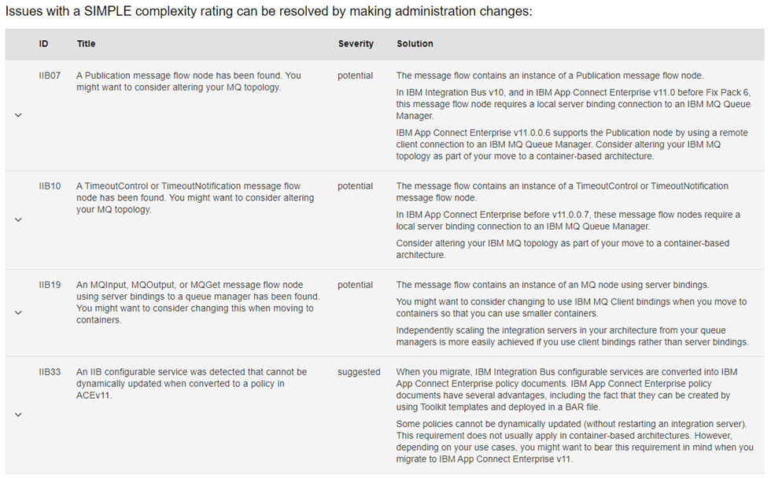
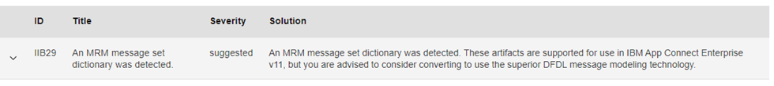

<!--MD_POST_META:START-->

  
2023-09-01 · ⏱ 4 min

  
Share:<a class="post-share post-share-linkedin" href="https://www.linkedin.com/sharing/share-offsite/?url=https%3A%2F%2Fmatthiasblomme.github.io%2Fblogs%2Fposts%2Ftad%2Ftad%2F" target="_blank" rel="noopener" title="Share on LinkedIn">in</a>

<!--MD_POST_META:END-->

# Transformation Advisor: helpful sidekick or noisy backseat driver?

Let’s be real, migrating from IIB v10 to ACE isn’t exactly a weekend hobby. You’ve got config files, message flows, policies, and legacy quirks buried deep in places you’d rather not look. So IBM gives us the **Transformation Advisor tool (TA)**, bundled with ACE v11 and v12, to help sort through the mess.

Sounds useful. But does it deliver?

I ran it against a v10 setup to find out.

## What TA actually does

You give it your old v10 sources (either a full backup or just a BAR file), and it spins up a container, deploys the flows, runs its checks, and spits out a neat HTML report. That report flags potential issues using two metrics:

**Complexity** (how hard the fix is)  
**Severity** (how critical the issue is)

### Quick breakdown:

**Complexity**
- **Simple**: Admin tweak
- **Moderate**: Dev work
- **Complex**: Major dev or architectural change

**Severity**
- **Green**: Just FYI
- **Yellow**: Handle this before going further
- **Red**: Stop. Fix it. You’re not moving forward.

Together, these give you a rough idea of the work ahead. Supposedly you also get a time estimate for complex issues—though that didn’t show up in my demo (probably because I didn’t trigger any red flags).

One catch: TA assumes you’re moving to **containers**. If you’re staying node-managed, many of the suggestions are irrelevant—but still worth seeing.

## How I tested it

I fed TA a backup of a demo setup with 3 Integration Servers:

- MQ pub node
- MQ bindings
- Local FileInput
- Standalone resources
- Non-dynamic policies
- MRM
- Timeout node
- JavaCompute with a configurable service

Basically, a decent mix of common and annoying.

## What came out the other end

No surprises—TA flagged a few things. Let’s break it down.

### General feedback

TA gives you the target it checked against (this is always the same)

### IS1

No actions needed, but I got the usual non-dynamic policy suggestion. This shows up anytime configurable services are defined at node level (which is always in v10).

Since ACE v12.0.3.0, you can deploy non-dynamic policies with an app restart triggered directly from the deploy command. In ACE v11, you can just overwrite the policies and restart the IS. No drama.

### IS2

A few suggestions and “potential” issues. Mostly:

- QMGR in bindings mode
- Local file read
- Non-dynamic policies (again)

If you’re migrating to a node-managed setup with a local QMGR, you’re fine.

### IS3

Here’s where it got interesting.

IS3 had the messier stuff: standalone flows and an MRM message set.

**Moderate issues**:
- Standalone flows need to go inside an application (or the default one).

**Complex issue**:
- MRM flagged. Not because it’s unsupported—it still works in ACE—but because it can’t live in shared libraries anymore. DFDL is the preferred path.

One weird miss: my JavaCompute node calling a configurable service didn’t get flagged. In ACE, the syntax for calling a UDP changed, and TA should’ve caught that. Shame it didn’t.

## What RED actually looks like

My demo didn’t trigger any RED severities, so here’s one from IBM’s docs:  
A .NET node throws a RED because it’s not supported in containers.

Simple. Brutal. Clear.

## So—is this tool worth your time?

**Yes—but with context.**

TA isn’t gospel. If you’re sticking with node-managed, half the output might be noise. But if you're considering containers or cloud, it’s genuinely useful.

Even for a local setup, it’s a decent way to surface lurking config issues—plus it formats the findings cleanly enough for non-tech folks to follow. Not bad.

Would I rely on it as my single source of truth? No. But it’s a good early warning system.

---

## Links for the curious

- [Running the Transformation Advisor tool](https://www.ibm.com/docs/en/app-connect/11.0.0?topic=tasks-running-transformation-advisor-tool)
- [Rules for the Transformation Advisor tool](https://www.ibm.com/docs/en/app-connect/11.0.0?topic=tasks-rules-transformation-advisor-tool)

---

Written by [Matthias Blomme](https://www.linkedin.com/in/matthiasblomme/)
