# IBM TechXchange 2025, Orlando. Overwhelming in all the right ways.

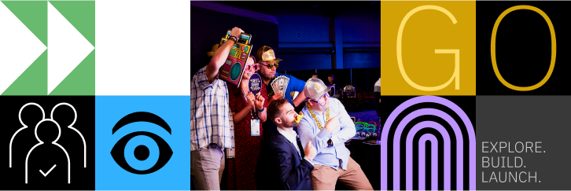

What can we say other than: amazing. There, that’s all you needed to know. Moving on.

Just kidding. There's way more to say, probably too much. To keep things focused, I’ll stick to the highlights, and we’ll 
kick off with the tech side of things

My colleague [Jef](https://www.linkedin.com/in/jef-jansen/) and I were this year’s delegates for [Integration Designers](https://www.linkedin.com/company/integrationdesigners/). 
We came, we saw, we got absolutely steamrolled by the scale of it all.

Think ten+ interesting sessions at the same time, plus fun distractions, a scavenger hunt, four hundred plus champions 
running around, marathon walks in the sandbox, and just enough time left to grab another caffeine hit before sprinting 
to the next thing. And boy, did we need the caffeine.

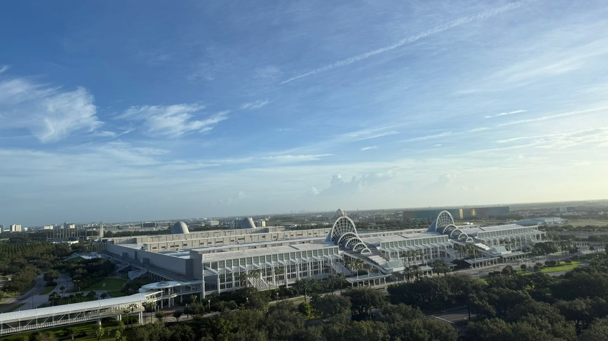
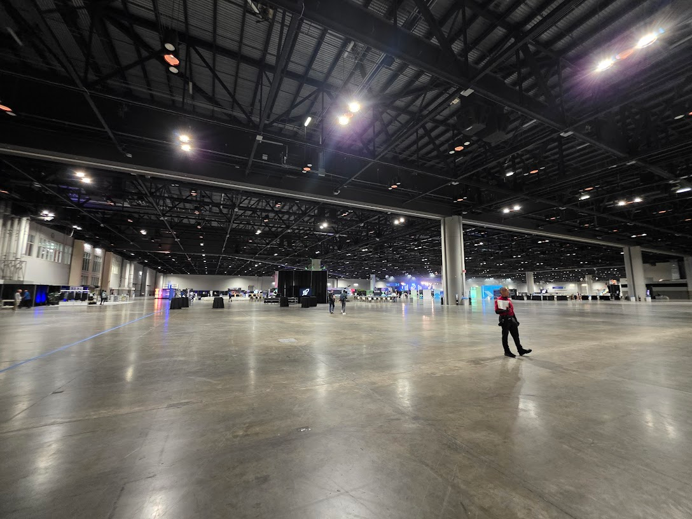
> Look at the size of it!

Not into the tech stuff? Feel free to skip ahead to the fun bits. Your loss, obviously.

## Tech

There was no escaping it: AI was everywhere. Panels, demos, slides, code, whiteboards. Even the hallway conversations. 
A lot of talk about agentic patterns, multi-modal interfaces, orchestration, MCP, and the usual “let's throw AI at it 
and hope it works.” Some of it was solid. Some of it still felt like a concept in search of a reason.

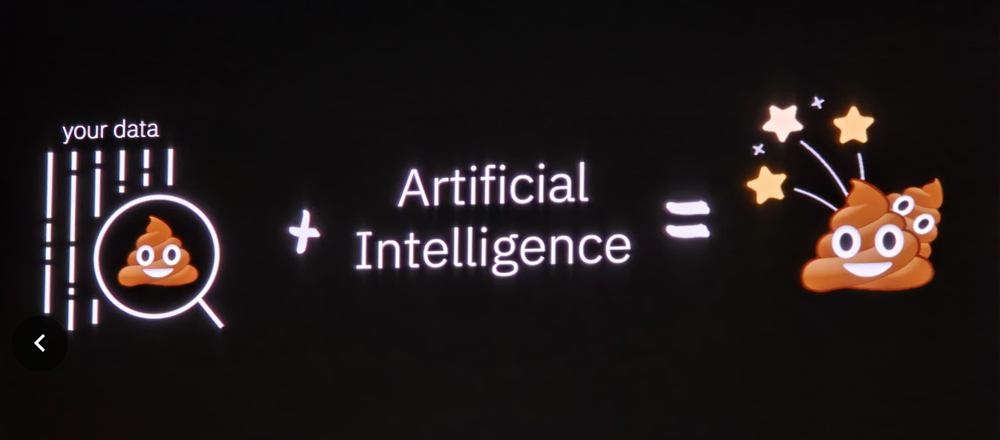
> Some nuances

If you haven’t heard of Project Bob yet, you will. It’s IBM’s new AI-first IDE, designed to modernize your codebase and 
then help you refactor, test, document, and deploy it. Not a toy. Not just another Copilot. The sessions around Bob were 
packed, and rightly so. It doesn’t feel like vaporware or vibe-coding. Looking forward to giving it a try.

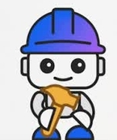
> Meet Bob

Cloud wasn’t in the spotlight, not directly at least. Everything runs on the cloud now, so in a way, it was everywhere. But 
attention has clearly shifted toward AI. That being said, there were still plenty of focused sessions: CP4I updates, 
serverless, IaC, hybrid cloud patterns, you name it.

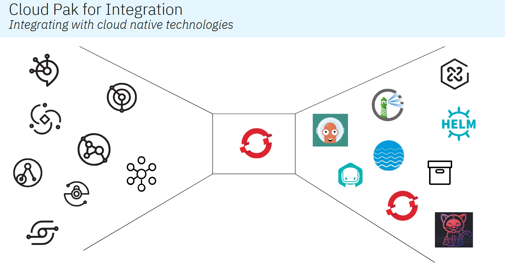
> Cloud integrations

App integration had a strong presence too, especially with how AI and MCP are being woven into products like ACE and MQ. 
The sessions weren’t just theory or roadmaps. There were live demos, real examples, and honest discussions about what 
actually works. Not flawless, but useful and interesting.

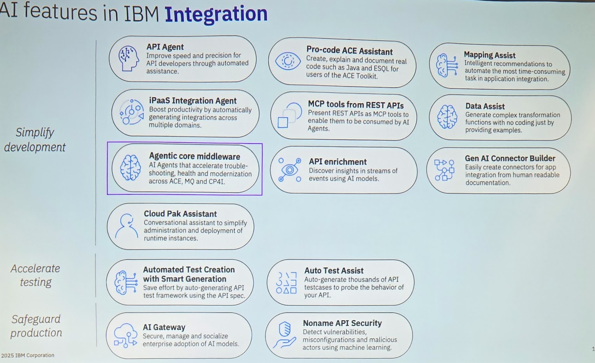
> AI in Integration

Of course, this is just a slice. There were tracks for everything from Z to Red Hat to Storage to FinOps. Whether you 
were deep in APIs, creaking older tech, or catching up on the latest, there was a place to belong rather than just 
spectate. You could stay in your niche, jump across tracks, or just sit somewhere quiet and let it all absorb.

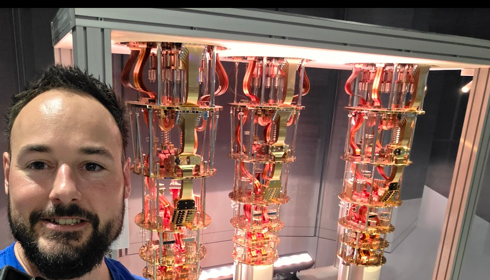
> Selfie with a quantum computer 

## Community 

Monday was officially “Community Day,” but all week long the community presence was real. Not just a few panels. Over 90 
community‑related sessions. MQ Global. Instanauts Global. IWHI (IBM webMethods Hybrid Integration), pronounced “Eye-Wye” 
to avoid it sounding like “wee” in English. And the Assistants & Agents User Group Event. Just to name a few that spring 
to mind.

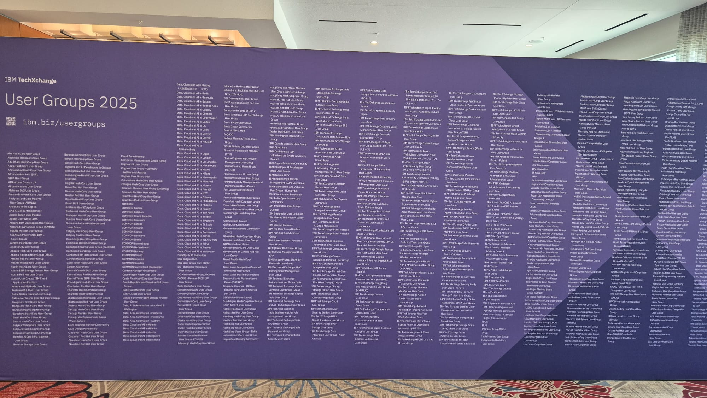

Most rooms were busy. Some had more people than seats. People weren’t there to kill time between keynotes. They were 
engaged, asking good questions, and showing actual interest. You could feel the buzzword version of it, engagement, 
but without the cringe.

I joined an integration breakout that led to some solid conversations. Met a few new people. Talked shop. Covered a bunch 
of ground on the integration stack, from pain points to patterns that actually work. Direct, useful, no time-wasting.

I’m not going to list all 90 of those sessions (we’d still be here tomorrow), but the sheer volume meant there was 
something for every flavor. Whether you were deep in APIs, creaking older tech, or trying to catch up on the latest, 
there was a place to belong rather than just spectate. And a lot of love for Z, showcased by the huge crowd for the live 
unboxing of the Z17.

## Champions

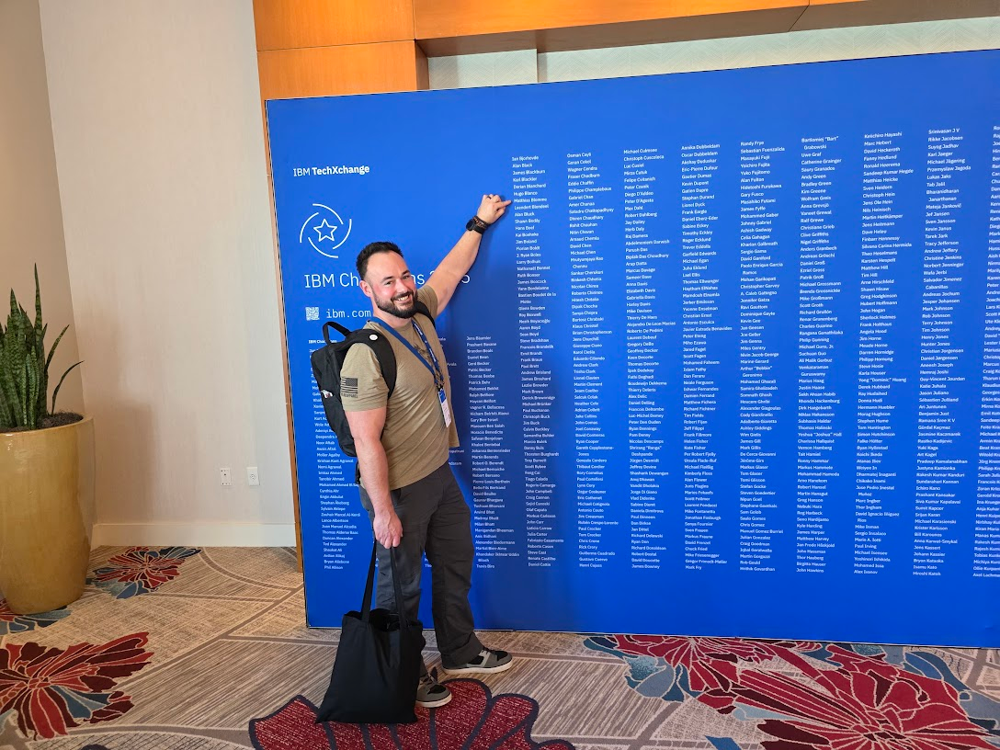
> I found my name among all the other champions.

Sunday afternoon was Champions' welcome day. And yes, I finally got my coveted blue jacket. That alone made the trip worth 
it. But more than that, it was a moment where Champions were genuinely put center stage. Not in a “here’s a badge” kind 
of way, but in the sense that IBM made time and space to thank people for the work they put in throughout the year.

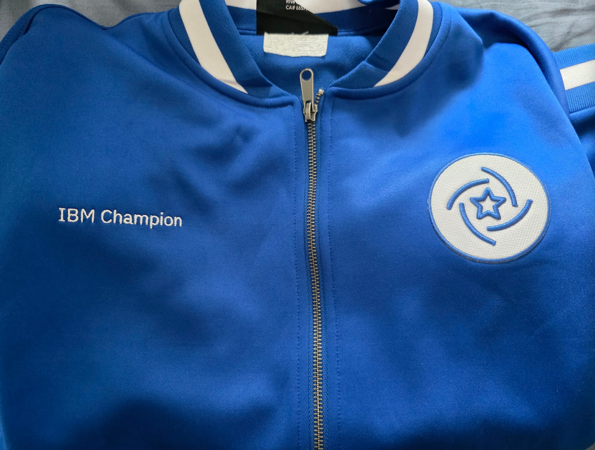
> THE jacket

That included the Champion Challenges. Mini missions across the year that earned you an extra patch for your jacket. So 
if you see someone walking around with one of those, now you know. It wasn’t just for showing up.

> Mission badge

The Champion program ran all week. We had our own sessions, lounge access, roundtables, early entries, private 
networking events, and even a group photo session. There were panels, tech tours, feedback sessions, and a hands-on 
lightboard training for those who signed up. Basically, if you were a Champion and still managed to get bored, that’s 
on you.

Universal was a standout. Champions got fast pass wristbands, which turned networking into ride, scream, repeat. The 
main event at The Pointe on Wednesday evening at 7 PM wrapped it all up. Food, drinks, karaoke, and a mechanical bull. 
Because why not?

It wasn’t just perks, though. A good chunk of us were also speaking, running sessions, or helping out with community 
activities. Being a Champion isn’t a spectator role. You earn the jacket, and then you keep earning it.

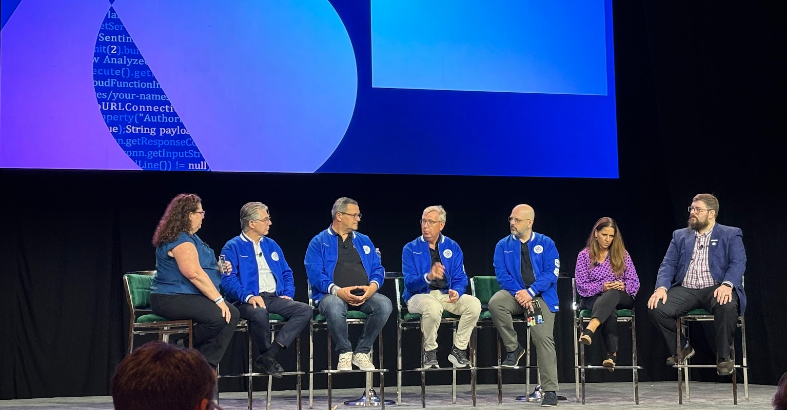
> Champion panel

And if you’re wondering, nobody actually yelled “Being a Champion is hard work” while flying off the mechanical bull, 
as far as I know.

## Fun

Now, on to the fun bit, because you can't survive on work alone. And yes, community matters. You could feel it everywhere:
in the sandbox, at the block party, in the scavenger hunt chaos. Unless you’ve got fast-track passes for a theme park,
then priorities tend to shift.

Let’s start with the sandbox. Easily one of the best parts of the event. Hands-on, slightly chaotic, and full of things
you didn’t plan to do but somehow ended up doing anyway. Playing around with tech, poking at AI-driven demos, classic
pinball, Mario Kart on a giant screen, labs everywhere, certifications happening in the background, and food and drinks
always nearby. There was even a version of Space Invaders where your spaceship was generated by AI based on your prompt.
That one went off the rails fast, with some surprisingly clever results. Not as simple as it looked.

> Speaks for itself

The opening night block party? DJ, food, lights, and a lot of people who had already lost track of what day it was. Day
one for most. Day two, if you were a Champion. I partially blame the jet lag. Solid way to kick things off.

Then the sticker scavenger hunt. Sounds harmless until you see grown adults power-walking across the venue in search of
that one missing sticker. Some took it very seriously. I may or may not have been one of them. There was a prize
involved. Enough said.

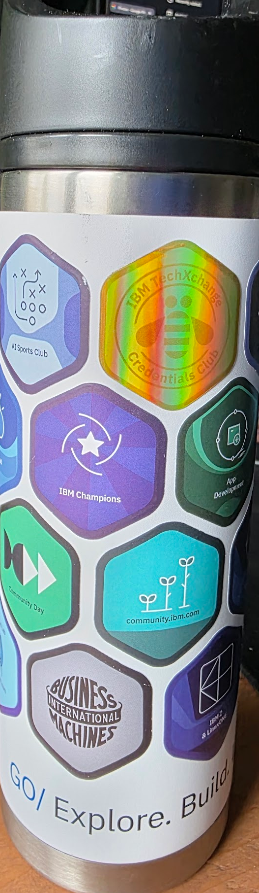
> Who doesn't like a sticker?

And finally, Universal Islands of Adventure. IBM booked the whole park just for attendees. Rides, food, and drinks were all
included. Champions got fast-track passes. Yes, skip the line fast track passes. No queues. Just walk on, ride, repeat.
The mood went from “whoo, Champions” to “boo, Champions” real quick once the skipping started. All in good fun, allegedly.

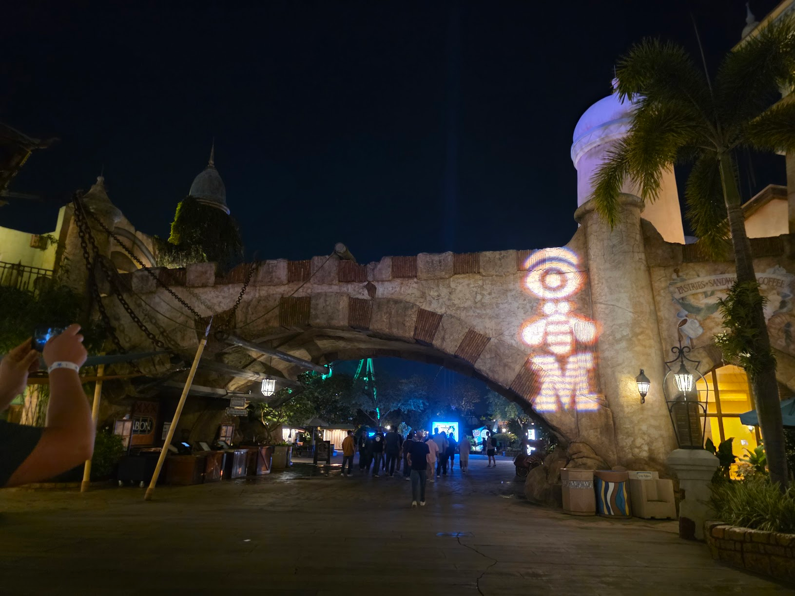
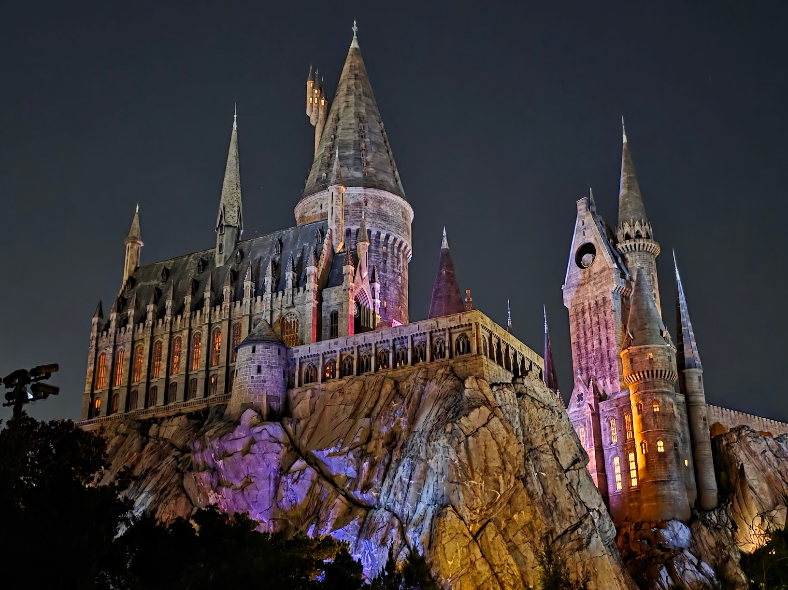
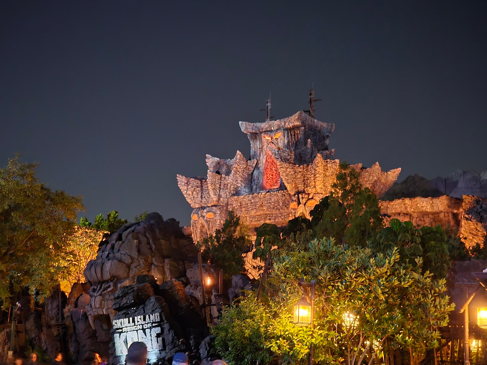
> Islands of Adventure

## The people who made it work``

Let’s not forget all the people behind the event. All the IBM experts were probably asked the same questions a 
hundred times. Still answered them. Patiently. While giving presentations, getting interrupted by people walking in or 
out, and somehow staying focused the whole time.

With the amount of sessions going on, it was already hard enough for us to keep up. But every presenter also had to make 
time between talks to answer a boatload of questions, walk people through setups, or just have actual conversations.

They didn’t just present, they put in the hours.

Also, a big shoutout to the planning and logistics crew behind the scenes. They’ve been working on this for the better part 
of a year, and it showed. From the planning of the sessions, to the layout of the sandbox, the credentials club, the 
champions lounge, herding thousands of attendees across two venues without total chaos, ...
Respect.

Now if you’ll excuse me, I need a week to recover.

---

And thank you [Integration Designers](https://integrationdesigners.com/blog/) for sending us there. Can't wait what next year will bring.

---

Written by [Matthias Blomme](https://www.linkedin.com/in/matthiasblomme/)
