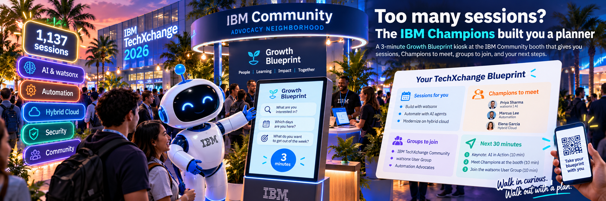
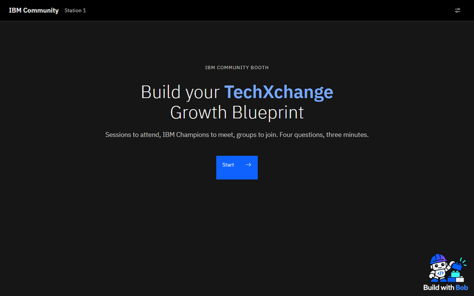
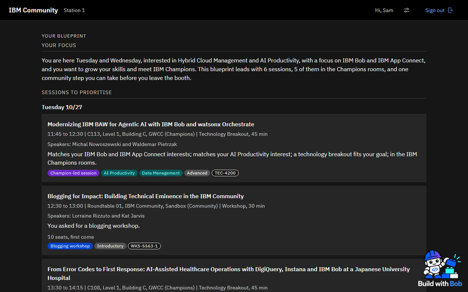
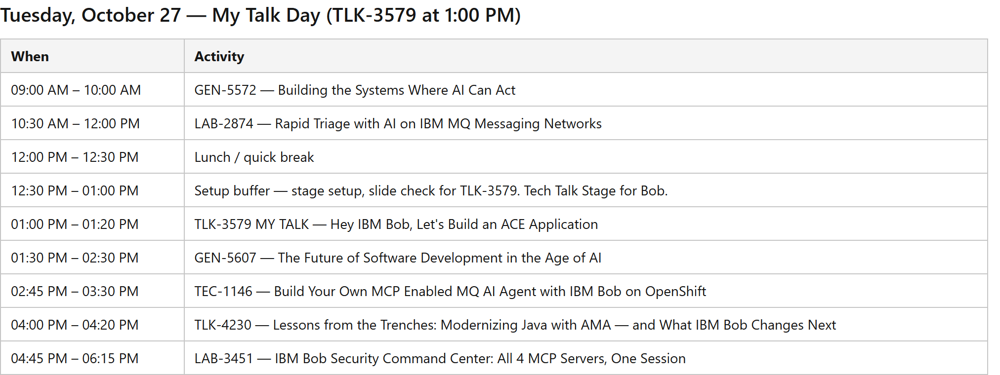

{ .md-banner }

<!--MD_POST_META:START-->
<div class="md-post-meta">
  <div class="md-post-meta-left">2026-10-01 · ⏱ 8 min</div>
  <div class="md-post-meta-right"><span class="post-share-label">Share:</span> <a class="post-share post-share-linkedin" href="https://www.linkedin.com/sharing/share-offsite/?url=https%3A%2F%2Fmatthiasblomme.github.io%2Fblogs%2Fposts%2Ftechxchange-blueprint%2Ftechxchange-blueprint%2F" target="_blank" rel="noopener" title="Share on LinkedIn">[<span class="in">in</span>]</a></div>
</div>
<hr class="md-post-divider"/>
<div class="md-post-tags"><span class="md-tag">techxchange</span> <span class="md-tag">ibm-champion</span> <span class="md-tag">ibm-community</span> <span class="md-tag">bob</span> <span class="md-tag">event</span></div>
<!--MD_POST_META:END-->


# Too many sessions? The IBM Champions built you a planner

For everybody going to TechXchange: congratulations. For those of you who aren't going: well, you're missing out. (To paraphrase Samson, an old Flemish children's TV show. Google it.)

There's so much happening at the event that it's hard to build a proper agenda around what you like, what you want to see, and how much time you have at the venue. And nobody wants to spend their first morning scrolling through 1137 sessions. So the IBM Champions community built a blueprint helper, just for you. You'll find it at the IBM Community booth.

Tell it what you're interested in, when you're there and what you want to get out of the week, and it builds your own TechXchange blueprint. A couple of questions, three minutes, done. Your name goes up on the wall, and if you do the rest of the booth journey too, you might just walk away with a professional headshot.

## Where to find it

The booth is in the Advocacy neighborhood of the Sandbox, diagonally across from the Champions Lounge (look for a bunch of people in blue jackets). At the booth, there's a table with six laptops and a monitor explaining what to do. That monitor is also used for a couple of blogging workshops, so definitely check the session catalog for those. Or just say yes when the app asks.

It opens together with the Sandbox, Monday October 26 at 6 p.m. This is what you'll see:



## What you get

Sign in with your IBMid and answer the questions. You get a plan, no guessing who to meet:

- Sessions worth your time, Champion-led sessions and AMAs first. Only on days you're there, nothing that's already over, and no two at the same time.
- IBM Champions to go talk to. Only the ones who opted in, so they're happy to meet you for a 1:1 in the Champions Lounge or the booth lounge. Send them a message in the TechXchange mobile app to set it up.
- IBM Community groups to join.
- What to do in the next 30 minutes.

Every pick comes with the reason it's on your list.



> The screenshots are from the prototype, so the version at the booth might look a bit different.

Before you leave, join a group or post a question, right there from the laptop. Then you get a QR code to take with you. It opens your blueprint on your phone, and it's what you show at the headshot station. The rest you'll see at the booth. Not going to give everything away just yet.

## What happens after your blueprint

The blueprint is one step of the IBM Community booth's Learn to Earn journey:

1. Sign up for the IBM Community at the welcome desk, if you're not a member yet. You need to be one to sign in.
2. Build your blueprint.
3. Add your ideas to the IBM Community wall, what you'd like to see in the community. There's a giant Jenga game in the same area, if you need a break.
4. Earn your professional headshot.

There's nothing to win, but you can earn. You walk away with a decent headshot for your LinkedIn profile, which, judging by some profiles, a lot of people could use.

## Who built it

This is an IBM Champions project. The IBM Community team asked the Champions to build something for the booth, and a working group of Champions picked it up. Champions building something for the rest of the community. Isn't that what being a Champion is about?

Two of us did the building, with IBM Bob: Jan-Willem Steur ([LinkedIn](https://www.linkedin.com/in/janwillemsteur/), [IBM Community](https://community.ibm.com/community/user/champion-directory/expert?UserKey=95a8c58f-a884-4d11-9220-02653c7816ad)) and myself ([LinkedIn](https://www.linkedin.com/in/matthiasblomme/), [IBM Community](https://community.ibm.com/community/user/people/matthias-blomme)).

But we didn't do it alone. Kristin Rangel ([LinkedIn](https://www.linkedin.com/in/kristin-rangel-a958b779/), [IBM Community](https://community.ibm.com/community/user/profile/contributions/contributions-list?UserKey=d1276cd1-0b56-47ec-8b14-bc967bd97a44)) led the working group and ran the testing. Kat Jarvis ([LinkedIn](https://www.linkedin.com/in/catherine-kat-jarvis/), [IBM Community](https://community.ibm.com/community/user/people/kat-jarvis)) from the IBM Community team and Libby Ingrassia ([LinkedIn](https://www.linkedin.com/in/libbyingrassia/), [IBM Community](https://community.ibm.com/community/user/people/libby-ingrassia)) from the IBM Champions program got the whole thing started, and kept it moving on the IBM side. And then there's a growing group of testers, who clicked through it more times than they'd like to admit. Thanks, all of you.

Do you fancy helping out on the next one? Then have a look at the IBM Champions program. The [IBM Champions program overview](https://www.ibm.com/community/champions-program/) explains what it is and how you get nominated. Writing blogs like this one is one way to get there.

Already a Champion? Then you can help too. Opt in for one-on-ones at TechXchange, and the blueprint can send people with the same interests your way. It doesn't have to be about Bob. Help them find their way around the community, and maybe you even inspire the next Champion. Opting in means checking the mobile app a few times a day, and meeting people in the Champions Lounge or the booth lounge when your schedule allows. It helps the community, and it might even count as a Champion activity you can report. [Opt in here](https://forms.cloud.microsoft/pages/responsepage.aspx?id=axi3JSvxyUiuYjsoaiNEMhaYOzzTVlhLvdUXyb2WqUBURFlUVFMzTU9VSVRNR0xKV1pEUDZLMkREUy4u&route=shorturl).

## Can't wait?

If you want to start planning now, I have something for that too. It's a Bob skill that scrapes the TechXchange session catalog, works out what you care about, and builds a day-by-day plan with alternates. Re-run it when the schedule changes and it tells you which picks clash. It's in my public skills repo, folder [techxchange-planner](https://github.com/matthiasblomme/bobmodes/tree/main/bobmodes/techxchange-planner), and the whole story is in [Let Bob plan your TechXchange week](https://community.ibm.com/community/user/blogs/matthias-blomme/2026/09/29/let-bob-plan-your-techxchange-week).

I used it for my own week. Two talks to give, the Champion program on top, and more ACE and MQ sessions than I could ever attend. This is my Tuesday, as Bob planned it:



Drop the folder in `~/.bob/skills/`, open Bob, and ask:

```
Which sessions should I attend at TechXchange?
```

It's a stripped-down version of what's waiting at the booth. Consider it the amuse-bouche. The main course is in Atlanta.

So: Monday October 26, 6 p.m., the Advocacy neighborhood. Come build your blueprint, and come say hi.

And for those of you who aren't going:

> "When I get sad, I stop being sad and be awesome instead." - Barney, How I Met Your Mother

But you'll have to wait until next year.

---

Written by [Matthias Blomme](https://www.linkedin.com/in/matthiasblomme/)

\#IBMChampion \
\#TechXchange \
\#Bob
