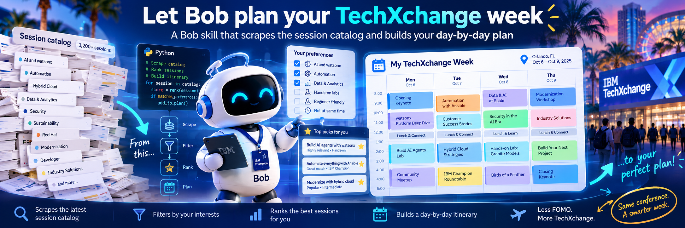

{ .md-banner }

<!--MD_POST_META:START-->
<div class="md-post-meta">
  <div class="md-post-meta-left">2026-09-29 · ⏱ 19 min</div>
  <div class="md-post-meta-right"><span class="post-share-label">Share:</span> <a class="post-share post-share-linkedin" href="https://www.linkedin.com/sharing/share-offsite/?url=https%3A%2F%2Fmatthiasblomme.github.io%2Fblogs%2Fposts%2Ftechxchange-planner-skill%2Ftechxchange-planner-skill%2F" target="_blank" rel="noopener" title="Share on LinkedIn">[<span class="in">in</span>]</a></div>
</div>
<hr class="md-post-divider"/>
<div class="md-post-tags"><span class="md-tag">techxchange</span> <span class="md-tag">ibm-champion</span> <span class="md-tag">bob</span> <span class="md-tag">automation</span> <span class="md-tag">python</span></div>
<!--MD_POST_META:END-->


# Let Bob plan your TechXchange week

I know we're all excited about TechXchange coming up, but there is so much you can do, and want to do, that you get FOMO just looking at the agenda. Some hard numbers: TechXchange 2026 has 1137 sessions in the catalog, 496 breakouts and 190 labs among them, and the catalog page is a filter panel you re-click on every visit. And that's without taking into account certifications, local events, time to get from one room to the next, catching up with old friends, ...

Have you ever tried clicking together your own calendar? Last year I ended up going over my schedule every single day, so this year I wanted a better way. I wanted my schedule in a file. One I could re-check the day the times got published, without starting from scratch, and open offline, just in case. Seemed like a good idea. Spoiler alert, it was.

And what do you do in this modern world when you want something repeatable? Exactly, you create a skill for it.

So I wrote one. It scrapes the catalog, works out what you care about, and builds a day-by-day plan with alternates. Re-run it when the schedule changes and it tells you which picks clash. Now, the more you use an AI, the more it knows about you. Creepy at times, but handy for stuff like this.

It's in my public skills repo, [github.com/matthiasblomme/bobmodes](https://github.com/matthiasblomme/bobmodes), folder `techxchange-planner`. It's a `SKILL.md` skill, so it runs in Bob 2.0. Install it, ask "which sessions should I attend", tell it if you want to do a certification or learn something new, and you get a plan.

The rest of this post shows what that plan looks like and how to get one. Before you read on, clone my repo and give it a test run.

## What it does

It works in three steps, and each one leaves its results behind as files. The next run picks up from those instead of starting over. Not starting from scratch was a design choice.

**1: Scrape.** The skill pulls the full catalog through the JSON API behind the catalog page, no login needed, plus the FAQ and the agenda page. At the time of writing (new sessions can still get added), that's 1137 sessions, 51 FAQ answers, and one summary line telling you whether the session times are published yet. The API details are in the appendix, for the curious.

**2: Profile.** It needs to know what you care about, and it tries the cheap source first: your own chat history. It goes through it locally and counts how often each product comes up. The list of products it looks for comes from the catalog's own filters, so nobody has to keep a keyword list up to date. On my machine that was 3247 files in about 45 seconds. It might be more or less for you, both are fine:

```
Term                     Files   Hits
App Connect Enterprise   1,200   16,055
IBM MQ                   1,106   4,352
IBM Bob                    860   9,877
Db2                        719   11,183
...
```

Any idea what my main focus area is? (If you hadn't guessed that from my blogs already.)

If you don't use AI that much, or you don't want the skill going through your history, that's fine too. No worries, I've got you covered. If there isn't much history to go on, the skill just asks you what you're interested in, which products you use and what you want to get out of the event. Mostly multiple choice questions, to keep it easy.

The one thing you have to tell it explicitly is to not search your history. The search itself runs on your machine, and only the counts go into the conversation. And if you accidentally fork my repo and try to push your newly built schedule back to me (that's a lot of accidental steps), I will reject it.

**3: Plan.** Every session has its length in the data: 45 minutes for a breakout, 20 for a tech talk, 90 for a lab, 60 to 120 for a meetup. The skill plans with those, not with a guess. Take out the general sessions and lunch and a conference day has about four and a half hours of sessions left. A lab takes the place of two breakouts. And it keeps one or two slots a day free on purpose, for the expo and for talking to people. Before it hands you the plan, it checks every row against the catalog, so the times in your plan match the times in the schedule.

## What you get

One markdown note: a table per day with the session code, the title and why it made the cut, a count per interest area so you can see where there's more on offer than you have time for, a ranked list of alternates with the reason you'd swap each one in, and a to-do list that starts with when to run it again.

To show you what that looks like, this is my Tuesday, as Bob planned it, one session per slot:


You also get the reasoning behind every choice. For my Tuesday that was:
- my own talk is fixed, with the half hour before it kept free to set up,
- the ACE lab I wanted runs right through my talk, so it went on the alternates list, and I do the MQ triage lab in the morning instead,
- the 11:45 sessions overlap the end of that MQ lab and run until my setup time, so that became lunch,
- TEC-1146 was picked over three other breakouts, and over a tech talk that overlaps it by five minutes.

After the day tables you get fifteen alternates, each with the reason and the moment you would swap it in. The count per area: 5 Bob, 6 ACE, 7 MQ, with some sessions counting for more than one area. In total that's 18 sessions over four days, my own two included.

When I first ran this in August, the catalog had 810 sessions and none of them had a day or time yet. The note said so, right at the top. In mid September the times came out and the catalog had grown to 1054 sessions. The re-run compared the two scrapes, put every pick and alternate in its real time slot, and solved the clashes with the alternates list. That's what the alternates are for: a clash just means swapping one in. Which is a long way of saying: run it again closer to the event, to make sure your schedule is still right.

## Running it in Bob

Open Bob, in the IDE or with `bob` in a terminal, and ask:

```
Which sessions should I attend at TechXchange?
```

No need for `$techxchange-planner`, no mode to switch to. Bob picks the skill up from its description.

Then it asks you a few things, one at a time:

- where your chat history is, or, if there isn't much to go on, who you are and what you work with
- if you're an IBM Champion, and what your champion commitments are if you don't have the champion file
- if you want to do a certification
- which session you want when two of them overlap, with its own pick and why

Everything else it decides on its own, and it writes down why. If you're speaking, tell it up front and give it your session codes. It plans the rest of your week around them.

The scrape is the slow part. The first time, getting all 1137 sessions took a bit over six minutes. Just let Bob do its thing. The scrape is a script, so it doesn't eat your coins. The next time you ask, it first checks whether you want to scrape again or reuse the data you already have, and tells you how old that data is. If you reuse it, the whole plan takes five to ten minutes. While it works, it tells you what it's doing:

```
Sweet-talking the RainFocus API... hammering events.tools.ibm.com with the baked-in TechXchange 2026 tokens, 50 per page
1,137 sessions fetched, 0 test/dummy rows filtered, and the big news: times_published: true, 1,049 sessions already timed
Rifling through Bob session transcripts for IBM fingerprints
1,137 sessions, one of you. Allocating time slots, resolving clashes, picking your personalized schedule from 161 Bob sessions
```

The notes go where you tell it to put them, or into a `techxchange/` folder in your workspace. Keep that folder, the next run needs the previous scrape to tell you what changed.

## For champions, and for speakers

If you're an IBM Champion, there's a `champion-schedule.md` in the skill's `assets` folder. The public copy is just a placeholder. The real one, with all the champion events, is shared through the champions-only channels, and you copy it over the placeholder. The planner then treats those events as fixed, gives them priority over any regular session, and stops asking you about them. Nothing from that file is in the repo, and nothing from it is in this post.

I planned the same week twice. Once as a regular attendee, and once as what I am: a Champion with two sessions to present, TLK-3579 on Tuesday and a partner slot in the Integration User Group on Monday afternoon, MUP-4811. Same interests, same catalog, same skill. Different plan.

```
                           Regular attendee   Champion and speaker
Sessions in the day tables  17                 16, my own two included
Monday                      MQ user group      champion program + my user group session
Fixed events                0                  6 champion events + 2 speaking slots
Tuesday                     4 sessions         7, with half an hour free before my talk
...
```

Ten sessions from the attendee plan didn't make the cut in mine. Monday is basically taken over by champion stuff and my first speaker session. One champion feedback slot even got dropped, because it runs at the same time as the user group session I'm speaking at. Your speaker sessions get absolute priority.

As a Champion and a speaker I simply have fewer open slots to fill. The skill starts from that, instead of me finding out while standing in the wrong room.

If you're not a Champion and the extras make you curious, the program and what it takes to get nominated are on the [IBM Champions program overview](https://www.ibm.com/community/champions-program/). Blogs like this one are one example of how you can get there.

## Installing it

For Bob, IDE or shell, drop the folder where Bob looks for skills:

```
<project>/.bob/skills/techxchange-planner/    # this project only
~/.bob/skills/techxchange-planner/            # everywhere
```

That works in Bob IDE and in Bob Shell. There's more in the repo README, and always read the README!

Can't wait to get started? Run these two commands:

```bash
git clone https://github.com/matthiasblomme/bobmodes.git
cp -r ./bobmodes/bobmodes/techxchange-planner ~/.bob/skills/techxchange-planner
```

Then ask it "which sessions should I attend", or tell it to "scrape the TechXchange agenda". When the schedule changes, "update my plan, the session times are out" does the refresh. Keep the `data/` folder between runs, it needs the previous scrape to compare against.

## Appendix: where the data comes from

This is the technical bit, for those who want the details.

The catalog on reg.tools.ibm.com is a RainFocus widget. Behind it sits a JSON API on `events.tools.ibm.com/api` that needs no login, just two tokens sent as headers:

```
POST https://events.tools.ibm.com/api/sessions
Content-Type: application/x-www-form-urlencoded
rfApiProfileId: <apiProfileToken>
rfWidgetId: <widgetToken>

search=&type=session&size=200&from=0
```

The tokens are in the page itself. Open the catalog, wait for it to load, and read `window.store.getState().dynamicPages.widgetConf` in the browser console. The 2026 tokens are already in the script as defaults, so for this year you don't even need to do that.

The API gives you 50 sessions per page, whatever page size you ask for. The first page wraps the results in `sectionList[0]`, every page after that comes back as a flat `{total, items}`, so code written for the first page breaks on the second. The catalog also contains test data: sessions titled `TEST Session for EventBase ...` and sessions tagged `Dummy session = Yes`. The script filters those out.

`search=` is a free-text search that also matches speaker names. Search for "bob" and you get the IBM Bob sessions, plus every session by someone called Bob. Filter on the `IBM TechXchange Conference Products` attribute instead. The schedule itself is in a `times[]` array on each session, with the start and end time and the room.

`scripts/fetch_catalog.py` handles all of that and prints a summary. This is what it printed on 2026-09-28, trimmed:

```json
{
 "total_fetched": 1137,
 "test_or_dummy": 0,
 "real_sessions": 1137,
 "types": {
  "Technology Breakout": 496,
  "Tech Talk": 226,
  "Hands-on Lab": 190,
  "Meetup": 74,
  "Certification": 59,
  "Meet the Expert": 53
 },
 "times_published": true,
 "sessions_with_times": 1049,
 "top_products": [
  ["IBM Bob", 161],
  ["watsonx Orchestrate", 124],
  ["IBM i", 107]
 ]
}
```

IBM Bob is the biggest product at the conference, with 161 sessions. App Connect Enterprise has 18, MQ has 21. That already tells you where you'll have more sessions than time.

There are two more scripts in the same folder. `parse_faq.py` turns an IBM page with collapsible sections, like the FAQ, into a markdown note. The collapsed text is already in the page's HTML, so no browser is needed. `build_catalog_notes.py` writes a catalog note you can browse, plus one note per product you name, with abstracts and speakers.

> 1137 sessions, one week, one plan. Let Bob do the clicking.

---

Written by [Matthias Blomme](https://www.linkedin.com/in/matthiasblomme/)

\#IBMChampion \
\#TechXchange \
\#Bob
