# Running Unit Tests in IBM App Connect Toolkit Using a Custom Integration Server Setup

When working with IBM App Connect Toolkit, running unit tests on integration flows with custom configurations can be quite challenging. This is especially true when your flows depend on additional runtime artifacts like policies, shared libraries, or user-defined nodes. A standard test environment starts with a clean slate, which often leads to test failures due to missing configurations.

In this blog post, I'll walk you through the setup required to ensure your unit tests can run successfully using a custom integration server setup. We'll cover:

- Setting up the runtime environment
- Modifying test configurations to include runtime artifacts
- Running the test and analyzing the results

## Problem Overview

In a typical App Connect Toolkit test scenario, a new default integration server is started to run unit tests. This is fine for basic flows, but things start to break when your application relies on additional resources like (a project well known to me) the PGP nodes.

Take a look at the error below :

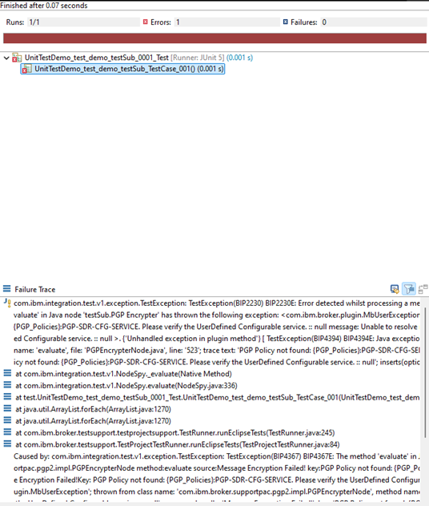

This error appears because the runtime environment for the test does not have the necessary policies configured. As a result, the flow that expects these policies fails during execution. Let’s fix that, shall we.

## Setup Requirements

Before we can run these kinds of unit tests successfully, we need to ensure that we have a runtime environment that can run our integration. This includes the following (and can be any combination of):

- Custom Policies: These are usually configured in the Integration Server, and without them, the flow cannot execute its logic correctly.
- Shared Classes and Libraries: Additional JAR files that contain the necessary logic or classes for your flow.
- User-Defined Nodes and Plug-ins: These may be required if your flow uses custom nodes or plug-ins.

For my use case, that means providing the following setup:

1. Setting Up the Custom Runtime Environment - Policies

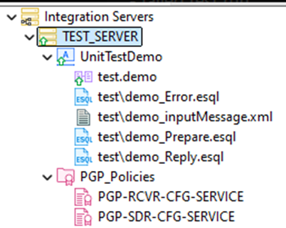

We have our Integration Server called TEST_SERVER. Under this server, we have the following components:

- A UnitTestDemo application.
- PGP_Policies, which are essential for running the test scenario.

2. Setting Up the Custom Runtime Environment – Shared Classes

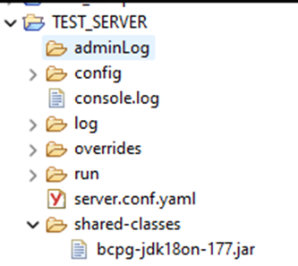

The PGP nodes do require an additional jar shared-classes jar file. This JAR file is not included by default in the runtime, so we need to specify it explicitly in our test setup. For standalone integration servers (or for containers) you can do this by creating a shared-classes directory directly under your working directory.

## Creating the test case

Next, let's look at how we can create a test case. If you have found this blog, you are probably already familiar with creating and running unit tests in ACE, but a quick recap has never hurt anybody.

My flow looks like this

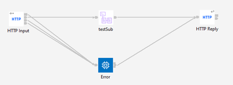

And I want to unit test my testSub subflow (look at that, a matching name). What I tend to do is run a message through the flow while in Flow Exercises mode, and create the unit test with the recorded message. Using the TEST_SERVER setup for this also validates that the standalone integration server is properly configured.

Putting a message through the flow:

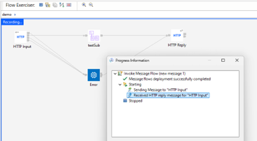

Creating the unit test

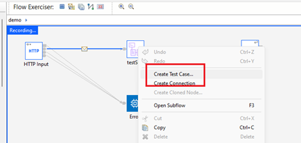
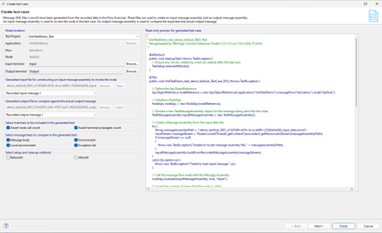

And the resulting test project:

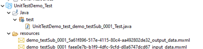

## Using the custom setup with your test case

This is the part you have all been waiting for, how do I use a working custom setup in my test scenario? It’s rather simple actually. Just tell your test to run in the TEST_SERVER integration server.

1. Navigate to the Run Configurations menu.

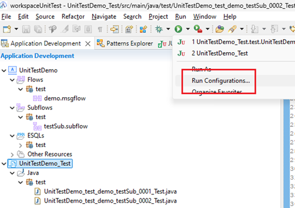

2. Under the Integration Server Settings tab, select Use an existing work directory

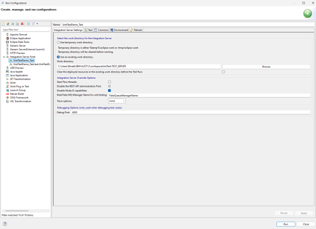

3. Browse to the path where the server configuration and shared classes are located (e.g., C:\Users\YourUser\IBM\ACET12\workspace\UnitTest\TEST_SERVER).

4. Apply the changes and re-run your test case.

> Note: If you want to use an existing Integration Server, make sure it is stopped before running the test. If the server is still running, you may encounter an error like the one shown below:

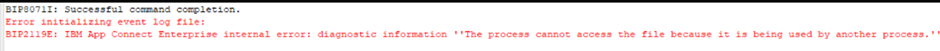

Rerunning the test still shows an issue, but this time it fails on a message tree comparison (TestMessageAssemblies should have matching message trees) instead of missing policies or classes. This happened because I included the PGP-encrypted data in the body of my message, without considering that the encrypted result varies with each run. It appears that I did not think this setup through - or did I?

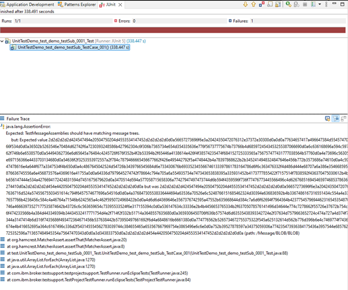

## Modifying the test setup

If you, like me, store your encrypted message in your message tree, your tests will fail. The encrypted content changes with each run, making it difficult to assert the exact values in the output. Let’s create a new test and ignore the contents of the /Message/Blob/Blob part of the message tree.

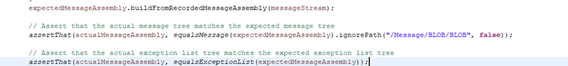

More info on ignoring bits of the message tree is explained in my previous blog post [Ignoring Fields in ACE Integration Testing: A Guide.](https://community.ibm.com/community/user/integration/blogs/matthias-blomme/2024/08/02/ignoring-fields-in-ace-integration-testing-a-guide)

After creating and running the new unit test, I get the initial error again. This is only logical since we have to change the run configuration for each test. Looks like the demo was well thought out after all 😉.

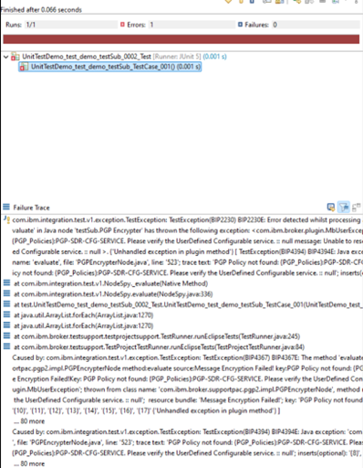

After changing the run configuration and rerunning I finally have a successful test!

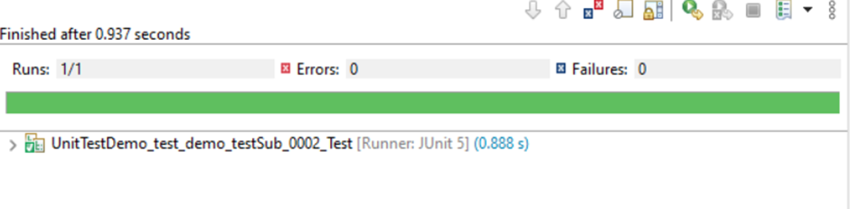

## Conclusion

Running unit tests for complex integration flows in IBM App Connect Toolkit can be tricky due to the dependency on runtime artifacts. By configuring a custom integration server setup, as shown in this post, you can overcome these issues and ensure that your tests run successfully.

By adjusting the Run Configurations to use an existing work directory, we were able to include necessary policies, shared classes, and other runtime configurations. This resolved most of the initial errors, allowing us to focus on fine-tuning the test cases themselves.

With the proper runtime setup, you'll be able to run more robust and reliable tests, even for complex integration scenarios.

Have you encountered any specific issues while setting up your test environment? Let me know in the comments, and I'll be happy to help!

---

Written by [Matthias Blomme](https://www.linkedin.com/in/matthiasblomme/)
