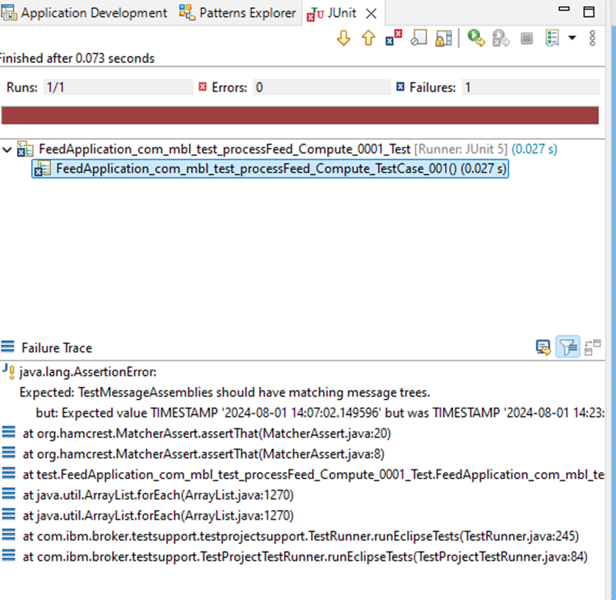
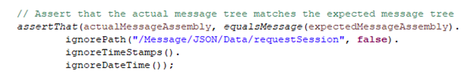

# Ignoring fields in ACE integration testing: a guide

Many users are well-acquainted with the basic integration testing capabilities of the ACE framework, but its features for ignoring specific fields during testing often go unnoticed. In this post, we'll delve into how to use these capabilities to simplify your testing process and avoid failures caused by dynamic data such as UUIDs and timestamps.

> If you don’t feel like reading the entire test setup and just want to get to the sweet part—I got you.


## Setting up the test environment

Let’s start with a simple setup. Our test flow receives an HTTP call, processes the data, and outputs results. It maps, transforms, and adds fields. Nothing fancy, but enough to demonstrate how this works in practice.


## Creating and running the test

Let’s create the test case:

1. Start the Flow Exerciser.


2. Send a test message through the flow.  


3. Check the response—make sure there’s no error, and that it looks correct.


4. Right-click on the node you want to test and select **Create Test Case**.


For this blog, we’ll only focus on the message body. Accept the defaults when creating the test case.

5. Click **Finish**, and you’ll see the newly created test case—for example, `FeedApplication_Test`.


6. Right-click the test application and select **Run Test Project**.


And we have a failure. Who would have expected that 😉

## Handling test failures

In our case, the test fails because of a **UUID field** that changes on every run. If you check the failure details, you'll see this:


Sure enough, the field `/Message/JSON/Data/requestSession` is a UUID.


## Ignoring dynamic fields

To fix this, we need to tell the test to ignore that specific field.

In your Java test code, go to the assert line (mine’s on line 88). We’ll use the `ignorePath()` method like this:


```java
assertThat(actualMessageAssembly.equalsMessage(expectedMessageAssembly)
  .ignorePath("/Message/JSON/Data/requestSession", false));
```


### `ignorePath()` takes:
- The path you want to ignore
- A boolean: `true` if you want to ignore all subpaths too

Save and rerun the test.



## Additional challenges: timestamps

Now that the UUID issue is handled, we hit a **TIMESTAMP** mismatch.

Again, you can either ignore this specific field or go broader.

To ignore **all** timestamps, just chain another method:

```java
assertThat(actualMessageAssembly.equalsMessage(expectedMessageAssembly)
  .ignorePath("/Message/JSON/Data/requestSession", false)
  .ignoreTimeStamps());
```


Almost like I planned it.

You can also ignore DateTime fields using `.ignoreDateTime()` the same way.



## Conclusion

The ACE Integration Test framework supports three useful ignore methods:

- `ignoreDateTime()`: Ignores DATE and TIME fields
- `ignoreTimeStamps()`: Ignores TIMESTAMP fields
- `ignorePath()`: Ignores specific paths (with or without subpaths)

Use them to clean up noisy test failures caused by UUIDs, timestamps, or any other runtime-generated fields.

---

## Resources

- [GitHub: ACE test cases with ignore logic](https://github.com/matthiasblomme/Ace_test_cases/tree/features/add-unit-test-test-case/UnitTestIgnoreFields)
- [IBM Docs: Developing integration tests](https://www.ibm.com/docs/en/app-connect/12.0?topic=solutions-developing-integration-tests)
- [IBM Docs: Using ACE Toolkit for tests](https://www.ibm.com/docs/en/app-connect/12.0?topic=dit-developing-integration-tests-by-using-app-connect-enterprise-toolkit)
- [IBM Docs: Creating test cases from recorded messages](https://www.ibm.com/docs/en/app-connect/12.0?topic=ditbuacet-creating-test-case-message-flow-node-using-recorded-messages)

---

Written by [Matthias Blomme](https://www.linkedin.com/in/matthiasblomme/)
