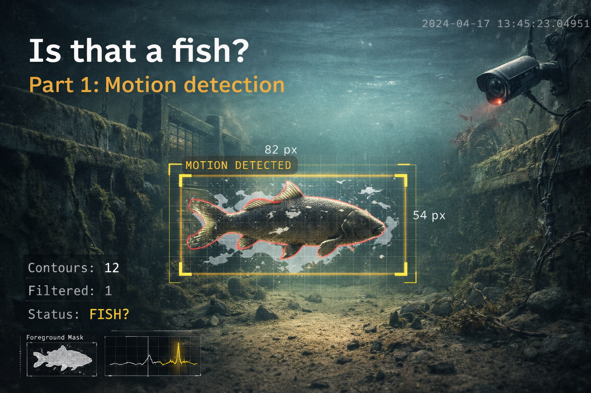

{ .md-banner }

<!--MD_POST_META:START-->
<div class="md-post-meta">
  <div class="md-post-meta-left">Matthias Blomme · 2026-03-13 · ⏱ 22 min</div>
  <div class="md-post-meta-right"><span class="post-share-label">Share:</span> <a class="post-share post-share-linkedin" href="https://www.linkedin.com/sharing/share-offsite/?url=https%3A%2F%2Fmatthiasblomme.github.io%2Fblogs%2Fposts%2Fvisdeurbel-automated-detection%2F01.visdeurbel-fish-detector%2F" target="_blank" rel="noopener" title="Share on LinkedIn">[<span class="in">in</span>]</a></div>
</div>
<hr class="md-post-divider"/>
<div class="md-post-tags"><span class="md-tag">python</span> <span class="md-tag">opencv</span> <span class="md-tag">computer vision</span> <span class="md-tag">docker</span> <span class="md-tag">automation</span> <span class="md-tag">fish</span></div>
<!--MD_POST_META:END-->


# Is that a fish? Part 1: Motion detection

Someone sent me [visdeurbel.nl](https://visdeurbel.nl), and within thirty seconds I thought: *I can automate that*. It took me a couple of months to actually sit down and do it, but hey, here we are. Finally.

The concept is ridiculously simple in the best possible way. There's an underwater camera watching a fish passage near a canal lock in the Netherlands. You watch the livestream, wait for a fish to show up, then press a button to ring the fish doorbell so that the lock keeper can let the fish pass.

Yes, this is real. People do spend their time setting this up, watching the feed and, apparently, automating the whole thing.

The only problem is that you have to sit there and watch. Fish show up whenever they want, and I'm not interested in spending my time staring at murky water hoping something with fins drifts by, especially when a script can do the watching for me, and it's fun to try and automate stuff anyway.

## Why this needed automating

Watching the stream for a minute is fun. Watching it long enough to actually catch something is a different story.

Fish don't announce themselves. They just show up when they feel like it. Which means you either spend your time checking the feed over and over again, or you accept that you're mostly relying on coincidence.

That didn't feel like a great system.

I didn't automate the whole thing. I only automated the watching part. I wanted something to monitor the stream for me and notify me when a fish passed by.

Basically: a doorbell for the fish doorbell. Inception much.

## This should have been easy

At least, that was the idea.

Static camera. Fish swims by. Detect movement. Send me a message. Done.

That was the whole plan. No fancy models, no complicated pipeline, no overengineered nonsense. Just compare frames, detect something moving through the image, and assume there's a decent chance it might be a fish.

Which, on paper, sounds perfectly reasonable.

In practice, fish turned out to be only a small part of what was moving through the frame. Dirt, debris, branches, reflections, random particles: there was plenty of motion, just not always the kind I cared about.

That quickly became a problem.

## Getting the stream into Python

Before I could detect anything, I first had to get the actual video stream into Python. The website itself points you at a player, and from there you end up in all the usual dead ends like YouTube embeds and browser playback, which is fine for watching but not for automating.

The useful bit was underneath that. The visdeurbel site uses an HLS stream, and after a quick look through the page source I found the manifest URL for the actual feed: a plain `.m3u8` stream that [OpenCV](https://opencv.org/), a computer vision library for reading and processing video frames in Python, could read directly.

HLS stands for HTTP Live Streaming, and OpenCV can handle that just fine through its FFmpeg backend. That meant I could use the normal Python [`cv2`](https://opencv.org/) library and open the livestream directly with `cv2.VideoCapture(...)`, without having to build some cursed custom ingestion layer first.

Once that worked, the whole thing stopped being a web problem and became a normal Python problem: read frames, process them, and see if anything fish-like moved through the image.

## The first detector

Once I had the stream running in Python, the next step was the actual detection logic.

At the top level, the script stayed pretty simple: open the stream, read frames, only process one every couple of seconds, and send a notification when the detector says something interesting showed up.

The interesting part happens inside that processing step.

The core idea is background subtraction. The camera is fixed. The riverbed does not move. Fish do. So instead of trying to "recognize" a fish straight away, I started with a much simpler question: what in this frame does not belong to the background?

For that I used OpenCV's MOG2 background subtractor. MOG2, short for Mixture of Gaussians v2, keeps a rolling model of what the background normally looks like and marks anything that does not fit that model as foreground. And yes, I did a lot of googling to figure this out ;)

For this kind of setup, that is actually a pretty decent fit. The camera does not move, the scene changes slowly, and anything large enough moving through the frame is worth looking at.

The pipeline per frame looked like this:

1. Read a frame from the HLS stream
2. Resize it to 640x360 to keep processing fast
3. Apply Gaussian blur to suppress high-frequency noise
4. Feed the blurred frame into MOG2 to get a foreground mask
5. Clean up that mask with morphological opening
6. Find contours in the remaining foreground
7. Filter those contours by size, shape and position
8. If anything survives that filtering step: fish detected

The config for that first version was pretty straightforward, which was nice while it lasted:

```python
HLS_URL = "https://visdeurbel.videostreams.nl/hls/visdeurbel/index.m3u8"
FRAME_INTERVAL_SEC = 2
COOLDOWN_SEC = 300
MOG2_HISTORY = 200
MOG2_THRESHOLD = 60
```

Processing one frame every 2 seconds was more than enough here. A fish does not exactly teleport through the frame, and checking less often keeps the CPU usage low while also avoiding a flood of near-identical detections.

The MOG2 settings controlled how quickly the background model adapted and how sensitive it was to movement. Not exactly magical, but important enough that changing them had a noticeable impact.

On paper, this still looked nicely under control.

## False positives everywhere

It worked. Just not in the way I hoped.

The detector was doing exactly what I told it to do: look for anything that moved differently from the background. The problem is that, underwater, that includes a lot more than fish.

Dirt drifting through the frame. Floating debris. Branches. Random particles. Reflections on the water. Changes in light. All of that showed up as foreground too, and the detector treated it like something worth flagging.

Which is the downside of building a motion detector instead of an actual fish detector. It is very good at answering the question "did something move?" It is much worse at answering the question "was that a fish?"

So I got flooded (yes, I'm making water puns) with Telegram alerts faster than I could read them. Still, I wasn't ready to give up just yet.

## Making it less stupid

### Cleaning up the image

The first detector worked. It just reacted to way too much stuff that was not a fish.

That is the downside of using background subtraction on an underwater stream. The detector does not know what a fish is. It only knows that something changed. And underwater, a lot changes: shimmer, sediment, drifting junk, bits of plants, random blobs that look meaningful for about half a second and then turn back into mud.

The first fix was to make the image a bit less chaotic before MOG2 ever saw it:

```python
blurred = cv2.GaussianBlur(frame, (21, 21), 0)
mask = subtractor.apply(blurred)
```

A Gaussian blur basically smears nearby pixels together. Sharp little changes get softened, while bigger shapes stay visible. That matters here because the stream is full of tiny flickers and particles that create motion all over the place. By blurring the frame first, I made the detector care less about tiny noisy details and more about larger moving shapes.

That `21x21` blur is fairly aggressive, and that was the point. Fish are still fish-shaped after a blur like that. Tiny specks of underwater nonsense, not so much.

That helped, but it was not enough. The detector still had no idea what size or shape it was actually looking for.

### The timestamp problem

After the first round of filtering, detections dropped a lot. But some alerts kept showing up in the same place: the top-right corner of the frame.

And wouldn't you know, the video stream has the timestamp baked in in the top right corner. I never thought about that impacting the detection. In my mind, that was metadata, not part of the image.

OpenCV, of course, does not care about that distinction. It just sees pixels. And since that timestamp changes every second, MOG2 sees it as movement.

The fix was brutally simple: black out that part of the frame before the detector sees it.

```python
MASK_REGIONS = [(380, 0, 640, 35)]

for (x1, y1, x2, y2) in config.MASK_REGIONS:
    frame[y1:y2, x1:x2] = 0
```

That happens before the blur and before background subtraction. As far as MOG2 is concerned, that corner is always black and always static. Problem solved.

The annoying part is that I did not get the mask right on the first try. The original one was too narrow, so the timestamp still leaked into the detection area. After checking a few annotated snapshots, I widened it until the false hits stopped. Very scientific. Measured by eye.

### Figuring out what size a fish should be

Even after masking the timestamp, some blobs still behaved strangely.

The biggest lesson here was that "movement" is not enough. I also needed a rough idea of what kind of size and shape I was actually looking for.

This is where the contour filters came in:

```python
MIN_CONTOUR_AREA = 500
MIN_FISH_LENGTH = 80
MIN_ELONGATION = 2.0
MAX_FRAME_COVERAGE = 0.15
```

A contour is just the outline OpenCV finds around a detected blob. From there, I could start rejecting the obvious junk.

First, anything too small:

```python
if cv2.contourArea(contour) < config.MIN_CONTOUR_AREA:
    continue
```

That gets rid of a lot of tiny particles and garbage detections before they become interesting.

Then I looked at the bounding box. A bounding box is just the smallest rectangle that fits around a detected contour. In OpenCV, that gives you the `x` and `y` position together with the width and height of the blob:

```python
x, y, w, h = cv2.boundingRect(contour)
```

From there, I could apply a couple of more useful checks.

If the blob was too short, it was probably too small to care about:

```python
if max(w, h) < config.MIN_FISH_LENGTH:
    continue
```

If it was not stretched out enough, it probably was not fish-like:

```python
elongation = max(w, h) / max(min(w, h), 1)

if elongation < config.MIN_ELONGATION:
    continue
```

And if it was way too big, it was probably shimmer, a broad scene change, or some other ugly mess drifting through the frame:

```python
if (w * h) > (frame_width * frame_height * config.MAX_FRAME_COVERAGE):
    continue
```

That combination turned out to be much more useful than relying on motion alone. The detector still was not smart, but it was getting a bit more realistic about what could reasonably be a fish.

### A welcome cooldown

Even a decent detector can still be annoying.

A fish does not appear in one frame and vanish in the next. It moves through the scene over a few seconds, which means the detector can fire more than once for the same event. That is fine from a computer vision perspective, but it gets old very quickly when those detections turn into Telegram messages.

So I added a cooldown in the main loop:

```python
if detected:
    cooldown_remaining = config.COOLDOWN_SEC - (now - last_notification)
    if cooldown_remaining <= 0:
        path = save_snapshot(annotated)
        caption = f"Fish spotted at visdeurbel! ({ts})"
        ok = notifier.send(path, caption)
        if ok:
            last_notification = now
```

And the config for that stayed simple enough:

```python
FRAME_INTERVAL_SEC = 2
COOLDOWN_SEC = 300
```

Processing one frame every 2 seconds is more than enough here. Fish do not teleport through the frame. And the 5-minute cooldown means I get one useful alert instead of a small panic attack in Telegram.

### The full filter chain

After a few rounds of tuning, the detector ended up looking like this:

```text
Frame → Mask timestamp region → Gaussian blur
      → MOG2 background subtraction
      → Morphological open + dilate
      → Find contours
      → For each contour:
          ├── contourArea < 500? → skip
          ├── max(w,h) < 80px? → skip
          ├── elongation < 2.0? → skip
          └── w*h > 15% of frame? → skip
      → Remaining contours → fish detected
```

None of these checks are particularly fancy on their own. That is kind of the point. The detector got better by stacking a bunch of practical filters, each one aimed at a specific kind of nonsense.

And after all that, it finally became useful. Not smart. Useful.

## Running it properly

With the detection now working as it should, sort of, I packaged it as a Docker container so it could run unattended on a home server without needing a persistent terminal session.

That solved a couple of practical problems at once. The environment became reproducible, dependencies stopped being my problem, and the detector could just sit there doing its thing without relying on a laptop, an open shell, or blind optimism. It also makes it easy to ship out for anyone else who wants to give it a try.

The Dockerfile is pretty straightforward:

```dockerfile
FROM python:3.11-slim

RUN apt-get update && apt-get install -y --no-install-recommends \
    ffmpeg libglib2.0-0 libgomp1 \
    && rm -rf /var/lib/apt/lists/*

WORKDIR /app
COPY requirements.txt .
RUN pip install --no-cache-dir -r requirements.txt
COPY config.py detector.py notifier.py main.py ./
RUN mkdir -p snapshots
CMD ["python", "-u", "main.py"]
```

Nothing too exotic there. Python base image, system packages for OpenCV and video decoding, copy the code in, install dependencies, and run the detector. FFmpeg is the important bit here, because that is what lets OpenCV read the HLS stream cleanly inside the container.

And the `docker-compose.yml` is even simpler:

```yaml
services:
  visdeurbel:
    build: .
    restart: unless-stopped
    environment:
      - TELEGRAM_BOT_TOKEN=${TELEGRAM_BOT_TOKEN}
      - TELEGRAM_CHAT_ID=${TELEGRAM_CHAT_ID}
    volumes:
      - ./snapshots:/app/snapshots
```

That gives me a small self-contained service with persistent snapshots and injected Telegram credentials, without hardcoding secrets into the image or the compose file. If a `.env` file is present, Docker Compose reads those values automatically. That means I can keep things like Telegram tokens out of the image and out of the compose file itself, which makes the setup easier to move around and a lot less likely to leak secrets by accident.

At that point, it stopped feeling like a script and started feeling like a tiny service. Slightly ridiculous, yes. But useful.

## Motion is not fish

At this point, the detector was doing its job pretty well. It could watch the stream, ignore most of the obvious nonsense, and send me a Telegram message when something fishy (pun intended) moved through the frame.

That was already useful.

But there is still one obvious limitation: motion detection only tells me that something moved. It does not tell me what moved.

And that matters, because even after all the filtering, a moving blob is still just a moving blob. Sometimes that is a fish. Sometimes it is debris. Sometimes it is some weird underwater nonsense that happens to be roughly the right size and shape for a few frames.

So while the motion detector got me much closer, it still could not answer the only question I actually cared about, and the question that got us here:

Is that a fish?

That is where the next step gets a lot more interesting. Instead of just detecting movement, I want to take those captured frames and run a small vision language model over them locally, inside the same Docker setup, to decide whether the thing in the image is actually a fish. Which sounds simple, right up until you try to make a model judge blurry underwater snapshots reliably.

That is what the next post is about: local AI validation, prompt tuning, and seeing how far a small model can be pushed on a very specific classification task in very unhelpful footage.
