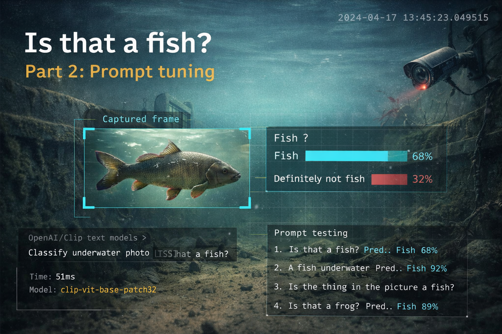

{ .md-banner }

<!--MD_POST_META:START-->
<div class="md-post-meta">
  <div class="md-post-meta-left">Matthias Blomme · 2026-03-14 · ⏱ 32 min</div>
  <div class="md-post-meta-right"><span class="post-share-label">Share:</span> <a class="post-share post-share-linkedin" href="https://www.linkedin.com/sharing/share-offsite/?url=https%3A%2F%2Fmatthiasblomme.github.io%2Fblogs%2Fposts%2Fvisdeurbel-automated-detection%2F02.visdeurbel-prompt-tuning%2F" target="_blank" rel="noopener" title="Share on LinkedIn">[<span class="in">in</span>]</a></div>
</div>
<hr class="md-post-divider"/>
<div class="md-post-tags"><span class="md-tag">python</span> <span class="md-tag">vision-language-models</span> <span class="md-tag">granite</span> <span class="md-tag">docker</span> <span class="md-tag">prompt-engineering</span> <span class="md-tag">fish</span></div>
<!--MD_POST_META:END-->


# Is that a fish? Part 2: Prompt tuning

In [part 1](./visdeurbel-fish-detector.md), I got the detector to the point where it could spot movement, filter out most of the obvious nonsense, and ping me on Telegram when something fishy (pun still intended) moved through the frame.

That was already useful.

It still got things wrong often enough to be annoying.

Because motion detection has a very obvious blind spot: it can tell you that *something* moved, but it has absolutely no clue what that thing actually was. A fish, a branch, a cloud of sediment, some weird blurry underwater blob that briefly looked important: to the detector, it is all just foreground.

And what do you do if you are unsure — get a second opinion.

Not another OpenCV heuristic. Not a slightly more complicated contour filter. Not something that we've done already. Something that could look at the actual snapshot and answer the question the motion detector never could:

*Is that a fish?*

That sounded simple enough. Run a small vision model locally, feed it the snapshot, ask for a yes or no, done.

Of course, that was not actually the hard part.

The hard part was figuring out how to ask.

## Motion is easy. Recognition is not

At some point, I sat down and manually went through a bunch of saved snapshots to split them into two groups: actual fish, and things that were very much not fish.

The detector was doing what it was supposed to do. It was catching moments where something interesting moved through the frame. But once you look at those frames one by one, it becomes painfully obvious where the limit is. Some are clearly fish. Some are clearly not. And then there is the annoying middle ground: blurry shapes, sediment clouds, reflections, partial bodies, dark blobs with suspicious timing, and all the other underwater nonsense that made it through the first layer.

That is the gap I cared about. A human can usually look at one of those snapshots and make a call almost instantly. The detector cannot. It only knows that something moved.

So instead of trying to keep stretching the OpenCV logic further, I changed the architecture.

The motion detector would stay exactly where it was: first layer, always on, cheap, fast, and good at spotting candidate frames.

Behind that, I wanted a second layer that only looked at those captured snapshots and answered the one question the detector never could:

*Is that a fish?*

Instead of trying to encode every possible non-fish shape into yet another filter rule set, I wanted to ask a model that has already seen millions of images to look at the snapshot and give me a yes or no.

That is where the vision model comes in.

## Why I wanted this local

The obvious way to do this would have been to throw the snapshots at a cloud vision API and call it a day.

That probably would have worked. It also would have been the least interesting version of this project.

I wanted this second layer to run locally for a couple of reasons.

First: cost. The detector runs all day, every day. Even if the motion filter already cuts the stream down to occasional candidate frames, this is still exactly the kind of thing that turns into a slow, steady API bill if you let it. Especially when a decent chunk of those frames are still false positives.

Second: reliability. Once this sits inside the same Docker setup as the detector, the whole thing becomes self-contained. No network dependency, no rate limits, no external service deciding today is a bad day.

Third: control. The snapshots come from a public livestream, so this is not some huge privacy drama, but still, sending a constant stream of weird underwater images to a third-party API felt unnecessary when the whole thing could just stay on my own hardware.

And finally, let's be real: it is just more fun this way.

I had been reading about small vision models running on modest hardware for a while, and this felt like a very good excuse to stop reading and actually try one.

## Why Granite Vision 3.2-2b

IBM's Granite family has been on my radar since I wrote about [running Granite 4.0-1B on Android](../running-granite-llm-on-android/run-granite-on-android.md). When I looked at what to use for vision, Granite Vision 3.2-2b was an obvious candidate.

Part of it was just practical. This thing was small enough, light enough, and you know, created by IBM (champion bias).

It also fit the use case. Granite Vision is built for image understanding and visual question answering, which is a lot closer to what I needed than some generic "describe this image" model. I was not asking it to write poetry about fish. I wanted a boring answer to a boring question: yes or no. Fish or not fish.

And unlike a hosted API, this is just a model I can run inside the same Docker setup as everything else. No external dependency, no extra moving parts, no weird product boundaries.

One more thing I liked from earlier Granite experiments: it tends to be a bit more conservative. For this project, that is not a bad trait. The whole point of this second layer is to cut down on false positives, not to enthusiastically confirm every blurry underwater blob with confidence.

It was not perfect. Far from it.

But it looked like a good place to start.

## Testing before committing

Before I shoved any of this into Docker, I wanted a way to test prompts without guessing.

So I went through a pile of saved snapshots by hand and split them into two folders: `fish/` and `false/`. Not automatically. Not elegantly. Just me opening images and deciding whether there was actually a fish in there or not. The result was a small test set: **23 fish images** and **20 false positives**. Small, yes. Still enough to expose bad prompts almost immediately. I'm not training a new model here, just testing some prompt ideas.

I also did not want to tune this blind inside the live pipeline. That would be a great way to convince myself a prompt was better because it sounded smarter, while it was actually worse.

So I wrote a small test script that runs the same folders through the model, keeps track of true positives, false positives, true negatives, false negatives, and spits out accuracy, precision, and recall at the end. Nothing fancy. Just enough structure to stop me fooling myself.

That made the workflow simple: change the prompt, run the script, look at what broke, repeat.

And that is where the fun started.

## The test script

The script itself is pretty straightforward. Point it at the two folders, pick a model endpoint, and define the prompts to compare.

It supports both a local Ollama endpoint and a llama-server setup, depending on what I am running that day.

```python
API_URL = "http://localhost:11434/v1/chat/completions"
MODEL = "granite3.2-vision:2b"

FISH_DIR = "snapshots/fish"
FALSE_DIR = "snapshots/false"
```

From there, each image gets base64-encoded and sent to the vision model together with one of the candidate prompts. I kept `temperature=0` because I wanted stable answers, not a model changing its mind on the same fish every other run.

```python
def ask(prompt: str, b64: str) -> str:
    resp = requests.post(API_URL, json={
        "model": MODEL,
        "messages": [{
            "role": "user",
            "content": prompt,
            "images": [b64]
        }],
        "temperature": 0
    }, timeout=60)

    return resp.json()["choices"][0]["message"]["content"].strip().lower()
```

It runs through both folders, compares the model's answers against the expected label, and keeps track of true positives, false positives, true negatives, and false negatives.

```python
tp = fp = tn = fn = 0

for path in fish_images:
    answer = ask(prompt, encode_image(path))
    if "yes" in answer:
        tp += 1
    else:
        fn += 1

for path in false_images:
    answer = ask(prompt, encode_image(path))
    if "no" in answer and "yes" not in answer:
        tn += 1
    else:
        fp += 1
```

Once you have those four numbers, the rest is just arithmetic:

```python
total = tp + fp + tn + fn
accuracy = (tp + tn) / total * 100 if total else 0
precision = tp / (tp + fp) * 100 if (tp + fp) else 0
recall = tp / (tp + fn) * 100 if (tp + fn) else 0
```

Nothing fancy, which was exactly the point. I obviously had to look half of this up, like I know how to write a clean little evaluation harness by heart ;)

The script also supports switching models, testing one prompt at a time, or limiting the number of images for quick runs, which made it a lot easier to iterate without rerunning everything every single time.

That gave me a decent little workflow: edit a prompt, run the script, look at the misses, repeat.

## The prompts

I did not start with the final prompt. I started with the obvious one.

Just ask the question directly and see what happens:

```text
This is a frame from an underwater riverbed camera.
Is there a fish visible in this image?
Answer only 'yes' or 'no'.
```

That last line matters more than it looks. If you want to run this automatically, you need the model to give you something you can parse reliably. Not a paragraph. Not a thoughtful little explanation. Just yes or no.

Useful as a baseline. Not much more than that. It tells you what the model does when you give it almost no help at all. From looking at the images, I knew this wasn't going to be a one hit wonder.

So the next step was obvious: add more context.

The footage is murky, noisy, low-contrast, and full of things that are very much not fish. So I started steering the model away from the obvious garbage:

```text
You are reviewing frames from an underwater camera aimed at a riverbed.
The camera sometimes detects false positives such as floating particles,
sediment clouds, water shimmer, or shadows.
Is there clearly a fish (with a distinct body shape) visible in this image?
Answer only 'yes' or 'no'.
```

Reasonable idea. Bad direction.

Once you ask for a "clear" fish with a "distinct body shape", you are already halfway to teaching the model that blurry underwater fish do not count as fish anymore.

So I had to back off.

In the next round I stopped asking for a perfect fish and started allowing the kind of images I was actually dealing with: blur, partial bodies, awkward angles, fish close to the lens, fish half lost in murk.

That led to prompts like this:

```text
You are verifying possible fish sightings from a low-visibility underwater monitoring camera.

Context:
- The camera operates underwater in turbid, murky water with low contrast and noise.
- Fish may appear at any angle: from the side, head-on, tail-on, or partially outside the frame.
- Fish close to the lens may fill much of the frame and look blurry or distorted.
- False positives include: floating sediment, haze blobs, shadows, reflections.
- Ignore any green detection boxes, text overlays, or timestamps in the image.

Answer YES if you see: a fish body or part of one, a recognizable fish silhouette,
or an organic-looking creature shape consistent with a fish.

Answer NO if the image shows only: uniform murk, sediment clouds, shadow patches,
light artifacts, or shapes that are geometric, square, or obviously not animal.

If there is a reasonable chance the shape is a fish, answer YES.
Reply with exactly one word: YES or NO
```

That version loosened things up a lot. Maybe a bit too much.

Then I tried one more trick. The detector already draws a green box around the motion region in the saved image, so maybe I could use that to guide the model:

```text
You are verifying possible fish sightings from a low-visibility underwater monitoring camera.

IMPORTANT: The image contains a green rectangle drawn by a motion detection algorithm.
This green box marks the exact region where movement was detected.
Focus your analysis on the object or shape inside or near this green rectangle.

Context:
- The camera operates underwater with low visibility, turbid water, and noise.
- Fish may appear at any angle and may only be partially inside the frame.
- Fish close to the lens can appear large, blurry, and fill most of the frame.
- Common false positives: sediment clouds, shadow blobs, water shimmer.

Look at the shape inside the green box and decide:
- Does it have an organic, curved, or elongated body shape?
- Could it be a fish, or part of one, even if blurry or at an odd angle?

Reply with exactly one word: YES or NO
```

Sounded smart. Wasn't enough.

The first prompt that really felt like it understood the assignment was `v8_plausible_form`.

Instead of asking for a "clear fish" or a "distinct fish body", it framed the problem in a way that actually matched the footage:

```text
You are reviewing a frame from a low-visibility underwater monitoring camera to decide whether a fish is visible.

Context:
- The water is murky, noisy, low-contrast, and may contain haze, sediment, blur, shadows, and reflections.
- Fish may appear from the side, head-on, tail-on, partially cropped, very blurry, or very close to the lens.
- Ignore any green boxes, timestamps, labels, or overlays.

Answer YES only if there is a plausible fish form present.
A plausible fish form means one or more of these:
- an elongated or tapered body
- a coherent curved body mass
- a head/body/tail relationship
- a fin, tail, or fish-like silhouette
- a partial but still believable fish-shaped body

Answer NO if the image shows only:
- uniform murk or haze
- sediment clouds or floating particles
- vague shadow patches
- reflections or light artifacts
- shapeless dark blobs without a coherent fish form

Important rule:
Do NOT require a perfect, sharp fish.
Do NOT answer YES for a vague blob alone.
Answer YES when there is a believable fish-like structure, even if partial or blurry.
Answer NO when the shape is only ambiguous murk or debris.

Reply with exactly one word: YES or NO
```

That change mattered. It stopped requiring a perfect fish, which is unrealistic in this footage, and it also stopped treating every vague dark blob as good enough.

At that point, this stopped feeling like prompt tweaking and started feeling more like classifier design.

## What actually worked

Once I had run enough prompt variants, the pattern got a bit clearer.

The strict prompts were dead ends. With Granite, prompt `v5` said **NO to every single image**. With Llama, prompt `v2` did basically the same thing. A fish checker that never confirms fish is not being careful, it is just broken.

At the other end of the spectrum, Granite with prompt `v6` did the exact opposite. It caught **all 23 fish images**, which gave it **100% recall**, but it also confirmed **all 20 false positives**. So yes, it never missed a fish. It also never learned to say no.

The green-box experiment was useful mostly because it showed what did not work. Useful, if your goal was to prove the box was not the fix. Directing the model to the motion box sounded smart, but with Granite, prompt `v7` still confirmed all **20** false-positive images, while recall dropped to **91%**. So the box did not magically teach the model what a fish looks like.

The first prompt that felt like actual progress was `v8_plausible_form`. With Granite, that one reached **58% accuracy**, **58% precision**, and **78% recall**. More importantly, it was the first prompt that rejected a meaningful number of false positives: **7 true negatives**, compared to **0** for `v6`.

That still is not a great classifier. Getting close to **60%** is a lot better than where I started, but it is not the kind of number that makes you sit back and declare victory. What it did prove is that prompt wording can push the model from "yes to everything" into something at least somewhat selective.

It also made the limitation pretty obvious. Prompt tuning can help, but only up to a point. The dataset is tiny, the footage is ugly, and the task is much more specific than the model was ever trained for.

## Wiring it into Docker

Once the prompt testing started to yield some results, wiring it into the existing Docker setup was actually pretty straightforward.

The architecture stayed simple: OpenCV still does the cheap first pass, saves a snapshot, and only then hands that image to a second service for verification.

```text
motion detection
→ save snapshot
→ send snapshot to local vision model
→ YES? send Telegram alert
→ NO? drop it
```

That meant adding one extra service to the existing Compose setup:

```yaml
services:
  llm:
    build:
      context: .
      dockerfile: Dockerfile.llm
    restart: unless-stopped

  visdeurbel:
    build: .
    restart: unless-stopped
    depends_on:
      - llm
    environment:
      - TELEGRAM_BOT_TOKEN=${TELEGRAM_BOT_TOKEN}
      - TELEGRAM_CHAT_ID=${TELEGRAM_CHAT_ID}
      - LLM_URL=http://llm:8080
    volumes:
      - ./snapshots:/app/snapshots
```

The `llm` service runs `llama-server` from the official `llama.cpp` image, with Granite Vision baked in:

```dockerfile
FROM ghcr.io/ggerganov/llama.cpp:server

RUN apt-get update && apt-get install -y --no-install-recommends wget ca-certificates \
    && rm -rf /var/lib/apt/lists/*

RUN mkdir -p /models && \
    wget -q -O /models/granite-vision.gguf \
        https://huggingface.co/bartowski/ibm-granite_granite-vision-3.2-2b-GGUF/resolve/main/ibm-granite_granite-vision-3.2-2b-Q4_K_M.gguf && \
    wget -q -O /models/mmproj.gguf \
        https://huggingface.co/ibm-research/granite-vision-3.2-2b-GGUF/resolve/main/mmproj-model-f16.gguf

EXPOSE 8080
CMD ["-m", "/models/granite-vision.gguf", "--mmproj", "/models/mmproj.gguf",
     "--host", "0.0.0.0", "--port", "8080", "-c", "2048"]
```

On the Python side, the extra bit is just a verifier class that sends the saved snapshot to the local model and expects a strict yes-or-no answer back:

```python
class FishVerifier:
    def __init__(self):
        # reads LLM_URL from env (set by docker-compose), falls back to config
        self._url = os.getenv("LLM_URL", config.LLM_URL)

    def verify(self, snapshot_path: str) -> bool:
        """Returns True if fish confirmed, or True if LLM unavailable (fail-open)."""
        try:
            with open(snapshot_path, "rb") as f:
                b64 = base64.b64encode(f.read()).decode()
            resp = requests.post(f"{self._url}/v1/chat/completions", json={
                "model": "granite-vision",
                "messages": [{"role": "user", "content": [
                    {"type": "image_url",
                     "image_url": {"url": f"data:image/jpeg;base64,{b64}"}},
                    {"type": "text", "text": PROMPT},
                ]}],
                "max_tokens": 10,
                "temperature": 0.0,
            }, timeout=config.LLM_TIMEOUT)
            if resp.ok:
                answer = resp.json()["choices"][0]["message"]["content"].strip().lower()
                confirmed = "yes" in answer
                print(f"[LLM] '{answer}' -> {'fish' if confirmed else 'rejected'}")
                return confirmed
        except Exception as e:
            print(f"[LLM] Error: {e} — allowing notification (fail-open).")
        return True
```

That is really the whole integration story: the detector still does what it did before, but now it gets a second opinion before waking me up on Telegram.

One practical detail I kept in there: fail open. If the verifier times out, the model is still loading, or the service is temporarily unavailable, the notification still goes through. Missing a fish because the LLM container had a bad moment would be more annoying than the occasional false positive.

This setup kept the whole thing local, self-contained, and easy to move around: one Compose stack, one home server, one mildly ridiculous fish pipeline.

## Prompting got me this far

Adding the vision model helped. It made the system more selective and cut down some of the obvious junk.

It also showed the limit of that approach.

With Granite, the best result I got was prompt `v8`, landing at **58% accuracy**. Better than where I started, sure. But still not good enough to trust blindly.

At that point, it became pretty clear that I was not going to solve this by endlessly rewriting the same question.

Prompting helped because it gave the model a better way to interpret the image. But this was never something the model had been trained on explicitly: one fixed underwater camera, murky water, bad visibility, and one very specific yes-or-no task.

That was the point where it clicked.

If I wanted better results, I probably needed to stop arguing with the prompt and start training the model.

## And that is where part 3 starts

The next step is a proper dataset. Same snapshots, cleaned up and labeled carefully, so I can stop nudging a generic vision model with prompts and start training on the actual problem in front of me.

Same camera. Same water. Same kind of ugly footage.

[Part 3: Model training](../is-that-a-fish-part-3-model-training/your-part-3-file.md)

---

*The complete code for this project is available on my [GitHub Visdeurbel Repository](https://github.com/matthiasblomme/Visdeurbel).*

---

Written by [Matthias Blomme](https://www.linkedin.com/in/matthiasblomme/)

\#IBMChampion \
\#AppConnectEnterprise(ACE)