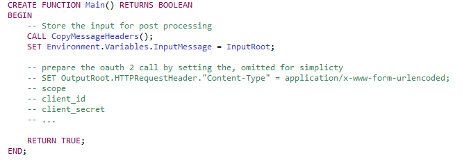
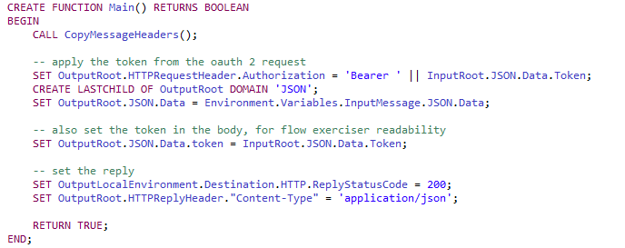
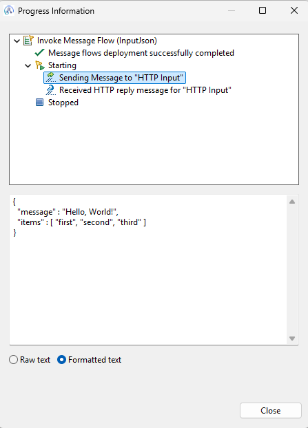
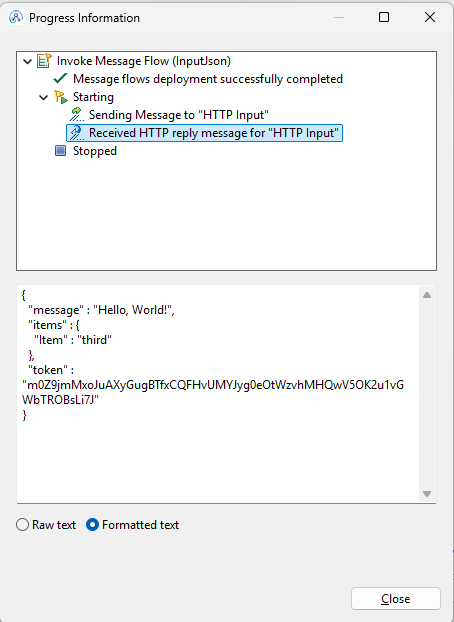
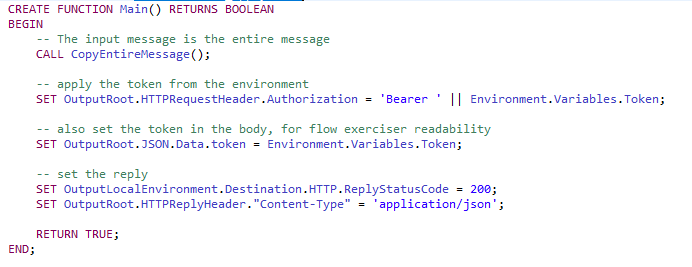
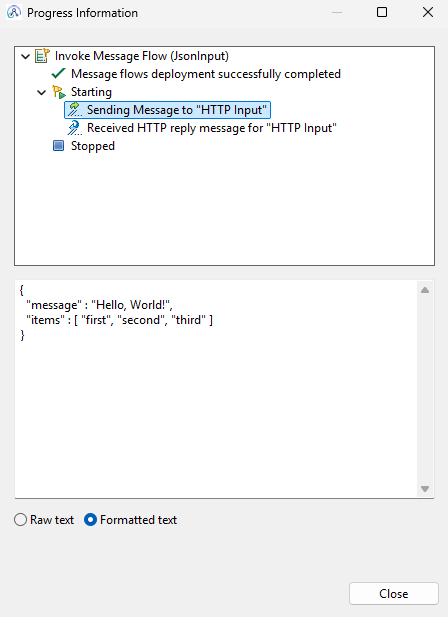
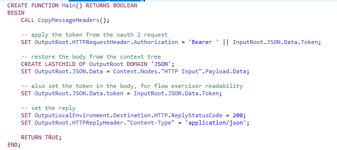
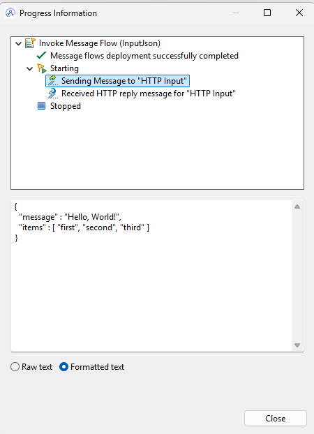
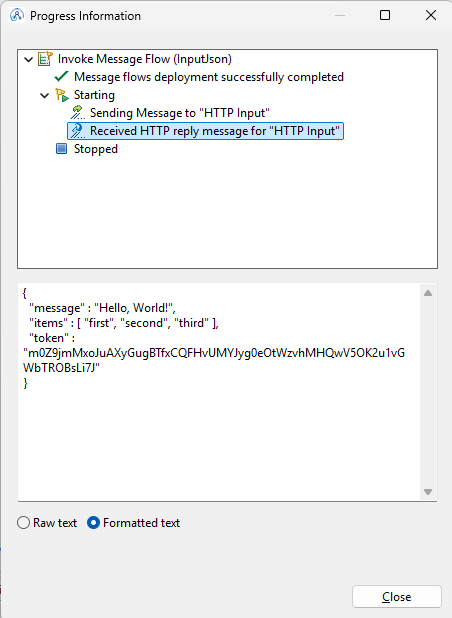

# Stop Copying Messages into the Environment: Use Context Tree in ACE 13.0.4.0+

## Putting the Message Aside

Imagine this: it's Friday afternoon, and you need to build a flow that forwards JSON messages to an OAuth-protected REST API. 
You think, "I'll need to build the OAuth request message, so let's just set the input aside into the `Environment` and 
pick it up later." You wire up the flow, test with some dummy data, and everything looks fine. Time for the weekend.

But you missed something.

## Flow Setup 1: Using the Environment

Copying an incoming message into the `Environment` feels like the easiest trick in the book. One line of ESQL, job done.
But here's the catch: it's not parser-aware. In certain cases, you get away with it, but when JSON arrays are involved,
things tend to get messy, fast. Arrays collapse into objects, metadata disappears, and suddenly your "quick fix" becomes
a late-night debugging session.

Point in case our demo flow

The input message is stored into the `Environment`, more specifically `Environment.Variables.InputMessage`. And then the 
actual message is restored at the end. 

If we then compare the input vs the output message: 

The token has been added (to the message, for visibility inside the flow exerciser), but you can see that the items array 
has collapsed into an single field containing the last array element.

Want to know more about those troubling JSON Arrays? Have a look at another blog of mine
[Create JSON Arrays in ESQL and Java](https://community.ibm.com/community/user/blogs/matthias-blomme/2025/08/18/create-json-arrays-in-esql-and-java-without-losing)

Copying message data into the `Environment` is fragile. A solution that works most of the time isn't really a solution.

## Flow Setup 1b: Using a BLOB

Sure, you could play it safe by serializing the whole message to a BLOB, stash it in `Environment`, and then reparse it 
when you need it. I mean, that works. But it uses up a lot of resources. Receiving and parsing an input message to JSON, 
reparsing it to BLOB, and writing it to the Environment, reading and reparsing it to BLOB to send it out again. 
There are less resource-intensive ways of achieving the exact same result.

## Flow Setup 2: Using the FlowOrder Node

Up until recently, using the FlowOrder node was the only way I knew that gave consistent results. The setup is rather 
simple, actually, if you think about it. Instead of trying to do everything serially, the FlowOrder allows you to define 
different logical processing branches. Take the flow below as an example.

This flow has two branches: the top handles token requests, the bottom calls the API. You can think of them as two 
separate functions working in sequence, which means they need a way to pass information between them. The cleanest way to 
do that is to put the token into the Environment, since it’s just plain values without parser context attached. I have no 
issue using the Environment, it’s a solid place to keep state, just not for anything that depends on the parser.

The top branch prepares the OAuth request (or it would, if this was not a dummy setup) and stores the received Token into
the `Environment`.

The bottom branch starts from the original input message, adds the token to the Authorization header 
(and body for debugging purposes), and sends out the message to the API endpoint.

If we then compare the input vs the output message:

You can clearly see the intact input message with the added token.

This setup may look a bit more complex, but that’s only on the canvas. In reality, FlowOrder keeps the logic clean: token 
handling in one branch, the original message untouched in the other, with a simple Environment hand-off in between.

## Flow Setup 3: Using Context Trees

Let's give you some context (pun intended) first. The Context tree is a read-only logical tree structure (similar to the 
LocalEnvironment) that keeps a copy of information about the message flow and its nodes. There is a lot of information 
available in the context tree, but the one that is relevant to this blog has to do with the incoming message. Part of the 
information stored in the Context Tree is the Message Payload that enters an Input Node.

In our situation, instead of using the FlowOrder Node or copying the data to the environment, we could simply copy the 
correct payload from the Context tree to the OutputRoot. The flow looks very much like the one we started with:

The difference is in the Compute Nodes. The `PrepareRequest Node` generates the token request, nothing more.  

The `RestoreMsg Node` is the one that calls upon the `Context Tree`. 

The Context tree is there for the taking. There is no need to include it in somewhere, or enable the feature somehow. Just
by calling it in your ESQL code, you activate it at runtime. The key point for our use case is that the context tree keeps 
the parser information, so there is no need to do anything but copy the payload back to the OutputRoot.

Finally, let's compare the input and the output message:

Proper JSON with the added token.

That’s it. No detours, no reparsing, no lost metadata. It gives you the original payload exactly as it came in, parser 
context included. Instead of juggling copies and fighting the toolkit, you just point at the Context tree and move on. 
That is, if you are using ACE 13.0.4.0 or later.

## Choosing the Right Approach

Here’s the deal: each option solves the problem, but not all of them age well.
- Environment copy: quick hack, but parser context gets lost. JSON arrays don’t survive.
- BLOB copy: technically safe, but you pay for it in extra parsing and CPU cycles.
- FlowOrder: keeps the input message intact and gives you transactional control. Slightly busier on the canvas.
- Context tree: the cleanest option if you’re on 13.0.4.0 or later. Parser-aware, lightweight, no juggling, no surprises.

## Closing

Copying messages into the `Environment` is a habit that causes more trouble than it solves. Between arrays breaking and 
extra reparsing, you end up with fragile flows that are harder to scale. Better options exist, so why not use them?

The FlowOrder approach gives you transactional control without mangling the payload. And if you're on ACE 13.0.4.0 or 
newer, the Context tree is the clear winner: parser-aware, lightweight, and even useful outside the shiny discovery 
connectors it was designed for.

So next time you need to hold onto the original message, don't dump it into `Environment`. Use the tools that actually 
keep your data intact.

---

For more integration tips and tricks, visit [Integration Designers](https://integrationdesigners.com/blog/) and check out our other blog posts.

---

## References

- [ACE Test Cases Repo](https://github.com/matthiasblomme/Ace_test_cases)
- [Context tree](https://www.ibm.com/docs/en/app-connect/13.0.x?topic=assembly-context-tree)
- [Explore the new features in App Connect Enterprise 13.0.4.0](https://community.ibm.com/community/user/blogs/ben-thompson1/2025/06/18/ace-13-0-4-0)

---

Written by [Matthias Blomme](https://www.linkedin.com/in/matthiasblomme/)

\#IBMChampion \
\#AppConnectEnterprise(ACE) \
\#HowTo
