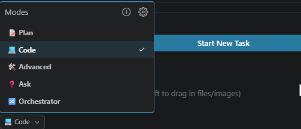

# Bob is not one assistant

Most people might not be using Bob at its full potential. You ask, it answers, it edits, and that already helps. But that is a fraction of what it can do.

The part worth understanding first: Bob is not one assistant. It is a set of personas, each represented by a specific mode that allows it to take on different tasks. Same Bob, different rules about what it can touch.

I use Bob a lot, for all different tasks. Obviously a lot have to do with ACE, but not all of them. I occasionally do some non-ACE related stuff as well. Don't tell anyone. One of those non-ACE tasks involved mq-rfhutil.

## The modes

Bob ships with five modes. Each differs in what it can do, and how much it is allowed to do.

`Ask` is read only. It reads, browses, explains, and changes nothing. It is where you go to understand something before you let anything near it.

`Plan` reads everything but writes only markdown. No code, no config. It plans from what it can read, not live state, so it won't inspect running processes or query external resources. It is for designing: working out what should happen and writing it down, without jumping straight to an edit.

`Code` is the day to day one. Read, edit, run commands. It does the actual work, and it is the one people leave on for everything, including the jobs the quieter modes do better.

`Orchestrator` holds no tools of its own. It drives the other modes through a job too long to keep in your head, the kind with many steps and checks in between.

`Advanced` is everything unlocked, all tools, no limits on which files it can reach. The power mode. Useful when you know exactly what you are doing, a poor default the rest of the time.

You switch between them in one of four ways:

1. The dropdown in the chat box.
2. A slash command like `/plan` or `/code`.
3. The keyboard cycle (`Ctrl + .` on Windows).
4. Taking Bob up on its own suggestion when it reckons you are in the wrong one.



## Dark mode, in code this old

mq-rfhutil is a fork I maintain of the old IBM rfhutil, the MQ message tester from SupportPac IH03. Windows, C++, MFC, fifteen property page tabs. To give you a sense of what is under the hood: the core class, DataArea, is one file of roughly twenty-six thousand lines with over two hundred methods, handling MQ connections, queue operations, message parsing, file I/O and headers all at once. char arrays, sprintf and strcpy throughout, no std::string, no smart pointers anywhere. The kind of codebase you open carefully.

One of the things I tend to enable in most of the tools I use is dark mode. So one day I was just fed up with that one light window staring back at me and thought "I've been using Bob for a while, could he help me out turning off the light?" So I had a go.

It quickly turned out that MFC has no real dark mode of its own. You theme it yourself, dialog by dialog and control by control, across all fifteen tabs, and you have to decide what light, dark and follow-the-system even means before you change a single colour. So a feature that sounds like a coat of paint reaches into a lot of an old UI. Definitely a daunting task if you were to do it manually.

---
---

I started with Bob in Ask mode. Before changing how anything looked, I needed to know how these dialogs were drawn in the first place, and which controls were standard MFC versus custom. Ask read through the UI code and explained it without touching a line, which is what you want before you start editing dialogs this old.

Then Plan. The decisions worth settling before any code: keep the theme logic in one place instead of smearing colour handling through every dialog, support three modes (light, dark and follow the system), pick colours that are not pure black so they do not burn your eyes, and store the choice in the registry so it survives a restart. Plan put that down first, in markdown, and could not jump ahead and start editing. What I did not think hard enough about at that point was how much of the window Windows draws itself and will not hand over.

Then Code, to apply it. This is where dark mode stops being cosmetic: a background handler in every dialog, colour handlers for every kind of control, the same edit repeated across a dozen property pages. Repetitive enough that part of the fix was a few throwaway scripts to make the same change everywhere at once. Roughly eight hundred lines across fourteen files for what users see as a toggle.

Then the part the plan missed. The dialogs themed cleanly, but the menu bar, the tab strip and the scrollbars are drawn by Windows, not the app, and MFC does not just hand them over. The title bar I could darken with a Windows call. The tab strip needed custom painting. The scrollbars I left light, the way plenty of Windows apps do. Most of the window themed, and the few bits that fought back were not worth the hours.

The snag I liked least: every time the tool reconnected after a dropped connection, the dialogs snapped back to light, because the reconnect was quietly rebuilding them without the theme. That one took a while to even understand, never mind fix.

The bigger build-system work, Visual Studio 2022, the 64 bit build, MQ 9.4.5, was the one place I reached for Orchestrator. That is a chain of edits with checks between them, not a single change, and it is the kind of job it exists for.

What stood out was not that Bob wrote C++. It was that it could hold a twenty-six-thousand-line class steady enough for me to change one thing without quietly breaking three others.

*[screenshot placeholder: rfhutil in light and dark mode, side by side]*

## When the built-ins run out

Those five cover most of a day. What they do not cover is anything specific to me.

They will review my code or write a test, but generically. None of them know what a good ACE flow looks like, or the checks I run every single time, because that lives in my head, not in Bob. And I had run those same checks by hand often enough to want them out of my head.

So I built my own modes.

Bob lets you add them. A custom mode is a real mode, same dropdown, same slash command, it just carries instructions you wrote. You define it in YAML: a slug, a name, a one line description, when it should kick in, which tools it gets, and the instructions themselves.

```yaml
- slug: ace-flow-test
  name: ACE Flow Test
  description: Generate an integration test plan for an ACE message flow
  whenToUse: >-
    Post-implementation integration testing, QA handoff,
    curl/MQ/file test scenarios for an existing flow.
  groups:
    - read
    - - edit
      - fileRegex: \.(md|txt)$
        description: test plans only
    - command
  customInstructions: >-
    # the part that took a while to get right, kept in my own copy
```

The `customInstructions` are the part I am not pasting. That is the accumulated "this is how I test an ACE flow," and it is the whole reason the mode earns its place. The shape is what matters here: reads everything, writes only the test plan, runs a command when it needs to, and already knows my idea of happy path, error case and edge case across HTTP, MQ and file.

*[screenshot placeholder: ace-flow-test in the dropdown, next to the built-ins]*

## My own mode, on the PGP node

The PGP node from my SupportPac is exactly the kind of thing this was built for. It encrypts, decrypts and signs, which means a lot of cases that all have to be checked: right key, wrong key, missing passphrase, each cipher, each hash, the compression flag on and off.

Testing that by hand is the same boring sweep every release. With ace-flow-test it is one prompt. The plan comes back with the curl for the message cases, the file inputs and expected outputs, and a checklist that checks the things that actually break PGP, not a generic list someone pasted from a template.

*[screenshot placeholder: ace-flow-test running against the PGP flow]*

*[screenshot placeholder: the generated PGP test plan, scenarios + validation checklist]*

It is not magic. It writes the plan, it does not run it. And it will invent a test for a path that does not exist if I describe the flow lazily. But a plan I trim beats a page I fill.

## 

The built-in modes got me through the work. The custom mode is so I never run those checks by hand again.
