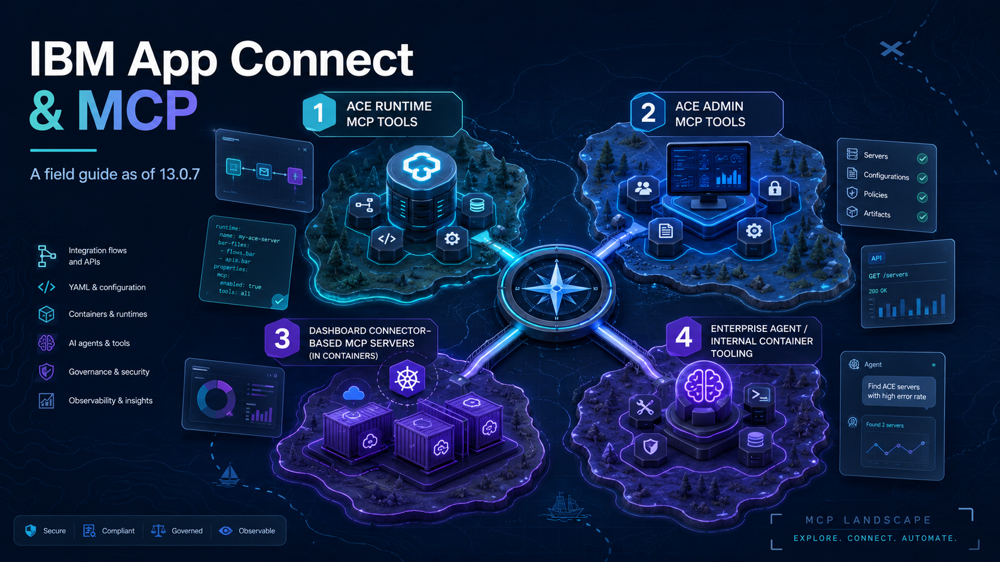

{ .md-banner }

<!--MD_POST_META:START-->

<!--MD_POST_META:END-->


# IBM App Connect and MCP: a field guide as of 13.0.7

By 13.0.7, at least four different things in the App Connect family answer to the name MCP, and the documentation for them is scattered across `docs.ibm.com`, the ACE community blog, the operator image manifest, and a handful of comments inside `server.conf.yaml`. Three of the four now have a deep-dive of their own, linked below. This post is the map over them: what each one exposes and what it costs your runtime.

Versions referenced throughout:

- ACE software **13.0.7.0** and **13.0.7.2** (where the on-prem MCP features ship)
- Container side: App Connect Operator **12.21.0**, operand **13.0.6.2-r1**
- App Connect Dashboard **13.0.6.1-r1** (Dashboard MCP server arrives) and **13.0.7.0-r1** (Enterprise Agent arrives)

Status used in the table below:

- `verified`: confirmed in IBM docs or in the shipped product
- `partial`: found but partial or undocumented

---

## The four MCP-flavoured things in App Connect today

| # | Component                         | Where it lives                      | What it exposes                                                  | First shipped         | Status             | Deep-dive                                                                                                                       |
|---|-----------------------------------|-------------------------------------|------------------------------------------------------------------|-----------------------|--------------------|---------------------------------------------------------------------------------------------------------------------------------|
| 1 | `MCP.Runtime`                     | `server.conf.yaml`, `mcptools.json` | Deployed REST API operations as MCP tools                        | ACE 13.0.7.0          | verified, hands-on | [Exposing a REST API as an MCP tool](https://matthiasblomme.github.io/blogs/posts/Ace-MCP/ace-mcp-runtime-callable-flow/)       |
| 2 | `MCP.Admin`                       | `server.conf.yaml`                  | ACE administration tools, read-only                              | ACE 13.0.7.0          | verified           | [Turning the admin server into an MCP host](https://matthiasblomme.github.io/blogs/posts/Ace-MCP/mcp_in_ace/)                   |
| 3 | `spec.mcp.runtime`                | Integration Runtime CR              | Connector-based MCP server, hosted in a container                | Dashboard 13.0.6.1-r1 | verified           | [Setting up MCP on ACE Minikube](https://matthiasblomme.github.io/blogs/posts/ace-mcp-minikube/setting_up_mcp_on_ace_minikube/) |
| 4 | `acemcp` / `langgraph` containers | App Connect Enterprise Agent pod    | Container, runtime, and flow introspection for the embedded chat | Operator 13.0 line    | partial            | -                                                                                                                               |

Items 1, 2, and 3 expose tools to *external* MCP clients (Claude, IBM Bob, Cursor, ChatGPT, your own agent). Item 4 is internal plumbing for IBM's embedded chat, not a public endpoint.

---

## What you can actually turn into an MCP tool

It's all the same protocol, but what you can put behind it depends on where you run and what you are starting from.

**A REST API.** The supported path, and the only one that is properly documented. Take a deployed Toolkit REST API, expose its operations with MCP.Runtime, and each one becomes a tool, named and described from the OpenAPI. That is the whole of [Exposing a REST API as an MCP tool](https://matthiasblomme.github.io/blogs/posts/Ace-MCP/ace-mcp-runtime-callable-flow/). In containers the same idea sits behind the "Existing server (integration-flow based)" option in the Dashboard wizard, greyed out on the operand I tested (see the container section).

**A callable flow.** Not directly, on either side. On-prem, MCP.Runtime only deals in REST APIs, there is no callable-flow option in the wizard. You get there by wrapping the flow in a one-operation REST API and exposing that, which works end to end ([the same post](https://matthiasblomme.github.io/blogs/posts/Ace-MCP/ace-mcp-runtime-callable-flow/) covers it). In containers the Dashboard wizard does offer a `Callable flow` connector tile, but on plain Kubernetes at 13.0.6.2-r1 it deploys and then will not start, the connector it needs is not in the image ([Setting up MCP on ACE Minikube](https://matthiasblomme.github.io/blogs/posts/ace-mcp-minikube/setting_up_mcp_on_ace_minikube/)). So a callable flow is reachable only through a REST front door.

**A connector action.** Container only, and a different mechanism. The Dashboard MCP wizard does not touch your flows, it builds tools on App Connect connectors: authenticate to Salesforce, Slack, Insightly, and so on, pick the actions, and those become tools. Each server it spins up is a new integration runtime in its own pod. None of this exists on-prem. Full walkthrough in [the Minikube post](https://matthiasblomme.github.io/blogs/posts/ace-mcp-minikube/setting_up_mcp_on_ace_minikube/).

**Anything else, an MQ, file, or timer flow.** Not exposable as it stands. MCP.Runtime speaks REST and reads the OpenAPI, so a flow with no REST front door gives it nothing to describe. If you want one as a tool, put a REST API in front of it, the same trick as the callable flow.

`MCP.Admin` is the odd one out here. It does not expose your integrations, it exposes the integration server's own admin operations as tools, so an agent can query the runtime about itself instead of acting on it. Different job, and it gets its own section below.

---

## On-prem ACE: MCP in `server.conf.yaml`

ACE 13.0.7 adds a top-level `MCP:` block with two stanzas, `Runtime:` and `Admin:`. Both ship commented out, both are separate HTTP listeners inside the integration server process, on separate ports. Turning either on is a `server.conf.yaml` edit (or an override) and a restart.

### MCP.Runtime (port 7750)

The headline feature, deployed REST API operations exposed as MCP tools. Two files hold it: the `MCP.Runtime` block in `server.conf.yaml` for the listener, and a `mcptools.json` per REST API for which operations are exposed and enabled (the admin API only reads those, you cannot flip a tool on over REST). Confirmed defaults on 13.0.7: `mcpStartMode: automatic`, port `7750`, `uriSuffix /mcp`, Streamable HTTP only, no auth until you set `mcpCredentialName`. On 13.0.7.2 the tool calls are intermittent, most return in milliseconds, the odd one stalls.

The full hands-on, the wizard, the curl handshake, the JSON, and the callable-flow workaround, is in [Exposing a REST API as an MCP tool](https://matthiasblomme.github.io/blogs/posts/Ace-MCP/ace-mcp-runtime-callable-flow/).

### MCP.Admin (port 7650)

A much smaller surface. Set `enabled: true`, restart, and the server registers six read-only tools: `info`, `list_integrations`, `list_application_needs`, `list_policies`, `list_credentials`, and `describe_message_flow`. An agent can ask the runtime about itself, what is deployed, which policies and credentials exist, what a flow looks like, but it cannot change anything. It inherits TLS from the `RestAdminListener`, runs unauthenticated by default, and unlike MCP.Runtime it speaks SSE, at `/mcp/sse`. It also has a one-client-per-lifetime quirk: one MCP client per server start, a reconnect needs a restart.

> "Have you tried turning it off and on again?" - Roy, The IT Crowd

Every tool with its real request and response is in [Turning the admin server into an MCP host](https://matthiasblomme.github.io/blogs/posts/Ace-MCP/mcp_in_ace/).

---

## In containers: Dashboard MCP servers

The same name, a different feature. The Dashboard wizard builds MCP servers on App Connect connectors, not on Toolkit REST APIs, this is the connector-action path from above. It needs App Connect Operator 12.20.0 or later and a Dashboard at 13.0.6.1-r1 or later, with automatic ingress only on OpenShift or IKS (I ran it on operator 12.21.0, operand 13.0.6.2-r1). Anywhere else, you route it yourself.

The thing to know going in: each server the wizard creates is a whole new integration runtime. A pod named after the server, three configurations (accounts, REST Admin SSL, and the endpoint's basic-auth creds), and a BAR deployed to it. So every Dashboard MCP server is another runtime to license, not just another listener on one you already run.

The knobs live on the Integration Runtime CR:

```yaml
spec:
  mcp:
    runtime:
      disabled: false
      basicAuth:
        disabled: false        # on by default, secret auto-generated if omitted
      tls:
        disabled: false        # on by default, self-signed cert generated
```

The TLS secret is a standard Kubernetes `tls` secret. The basic-auth secret I never fully pinned down (a `configuration` field whose decoded value looks like `mcp::basicAuthOverride username password`), so decode a real one before scripting against it.

[Setting up MCP on ACE Minikube](https://matthiasblomme.github.io/blogs/posts/ace-mcp-minikube/setting_up_mcp_on_ace_minikube/) has the wizard screens, the runtime it spins up, and the connector tile that deploys but will not start.

---

## What it costs your runtime

The two paths cost very differently.

On-prem, turning on MCP.Runtime or MCP.Admin adds an HTTP listener inside the integration server you already run, on 7750 or 7650. Same process, no new runtime. The flow behind a tool runs exactly as it did before, MCP is a new front door onto it, not a new copy. The one limit worth flagging is the one-client-per-lifetime quirk, strict on the admin side where a reconnect needs a restart, looser on the runtime side where calls just get flaky with a second client connected.

In containers it is the opposite. A Dashboard MCP server is not a listener bolted onto a runtime you have, it is a whole new runtime in its own pod, licensed like any other. A handful of MCP servers is a handful of extra pods, worth counting before you spread them around.

---

## The App Connect Enterprise Agent (different beast)

The fourth thing, and the one that is not for you to expose. The Enterprise Agent is the embedded AI chat in the Dashboard, the one you ask "which runtimes are running?" or "what does this flow expose?" and get an answer from. It uses MCP internally, as plumbing between its own containers, not as an endpoint you point your own agent at.

Two containers do the work, both in the operator image manifest: `acemcp`, an internal MCP server exposing container topology, runtime status, and flow metadata as tools, and `langgraph`, the orchestration loop driving the chat. You turn it on through the Dashboard CR (`spec.agents.enabled`, plus the Dashboard API and a watsonx.ai credentials secret), not through any MCP config. The IBM docs have the full setup: [Using the IBM App Connect Enterprise Agent](https://www.ibm.com/docs/en/app-connect/13.0.x?topic=dashboard-using-app-connect-enterprise-agent).

I did test this one, I just never gave it its own post. A deep dive may still follow.

> "I want to believe." - Fox Mulder, The X-Files

---

## Security notes

Two ACE-specific things to watch. MCP.Admin is unauthenticated by default and hands an agent a full read of your runtime, so do not switch it on anywhere you would not want that read. And a tool can do whatever its backend can: on-prem the admin tools are read-only, but a connector action in a container can write, so think about what an agent calling the wrong one could change. The rest is the usual MCP hygiene, Basic Auth (`mcpCredentialName` on-prem, the generated `setdbparms` secret in containers), TLS, and least-privilege backend credentials.

---

## References

### The deep-dives in this series

- [Exposing a REST API as an MCP tool (MCP.Runtime)](https://matthiasblomme.github.io/blogs/posts/Ace-MCP/ace-mcp-runtime-callable-flow/)
- [MCP in App Connect Enterprise 13.0.7 (MCP.Admin)](https://matthiasblomme.github.io/blogs/posts/Ace-MCP/mcp_in_ace/)
- [Setting up MCP on ACE Minikube (Dashboard, connector-based)](https://matthiasblomme.github.io/blogs/posts/ace-mcp-minikube/setting_up_mcp_on_ace_minikube/)

### Official IBM documentation

- [Creating and managing MCP servers (Dashboard)](https://www.ibm.com/docs/en/app-connect/13.0.x?topic=dashboard-creating-managing-mcp-servers)
- [Creating a Model Context Protocol (MCP) server](https://www.ibm.com/docs/en/app-connect/13.0.x?topic=cmms-creating-mcp-server)
- [Exposing a REST API as an MCP tool](https://www.ibm.com/docs/en/app-connect/13.0.x?topic=tools-exposing-rest-api-as-mcp-tool)
- [Configuring MCP properties (server.conf.yaml reference)](https://www.ibm.com/docs/en/app-connect/13.0.x?topic=tools-configuring-mcp-properties)
- [Using the IBM App Connect Enterprise Agent](https://www.ibm.com/docs/en/app-connect/13.0.x?topic=dashboard-using-app-connect-enterprise-agent)
- [Integration Runtime reference, `spec.mcp.runtime.*` values](https://www.ibm.com/docs/en/app-connect/certc_install_integrationruntimeoperandreference.html#crvalues)

### Release notes and blog posts

- [Ben Thompson, ACE 13.0.7.0 features](https://community.ibm.com/community/user/blogs/ben-thompson1/2026/03/26/ace-13-0-7-0)
- [Ben Thompson, ACE 13.0.6.0 features](https://community.ibm.com/community/user/blogs/ben-thompson1/2025/12/11/ace-13-0-6-0)
- [ACE 13.0 release notes and fix list](https://www.ibm.com/support/pages/ibm-app-connect-enterprise-130-release-notes)

### Community and ecosystem

- [IBM MCP repository](https://github.com/IBM/mcp)
- [ContextForge MCP Gateway](https://github.com/IBM/mcp-context-forge)
- [MCP Inspector](https://github.com/modelcontextprotocol/inspector)
- [Model Context Protocol specification](https://modelcontextprotocol.io/docs/getting-started/intro)
- [IBM Cloud Pak image manifest](https://github.com/IBM/cloud-pak/blob/master/reference/image-manifests/ibm-cp-integration.yaml)
