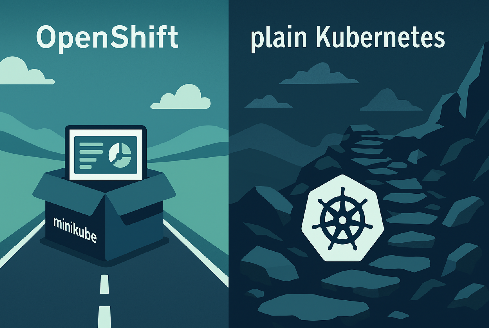

{ .md-banner }

<!--MD_POST_META:START-->
<div class="md-post-meta">
  <div class="md-post-meta-left">2026-05-19 · ⏱ 20 min</div>
  <div class="md-post-meta-right"><span class="post-share-label">Share:</span> <a class="post-share post-share-linkedin" href="https://www.linkedin.com/sharing/share-offsite/?url=https%3A%2F%2Fmatthiasblomme.github.io%2Fblogs%2Fposts%2FAce-Operator-Minikube%2Fsetting_up_mcp_on_ace_minikube%2F" target="_blank" rel="noopener" title="Share on LinkedIn">[<span class="in">in</span>]</a></div>
</div>
<hr class="md-post-divider"/>
<div class="md-post-tags"><span class="md-tag">ace</span> <span class="md-tag">kubernetes</span> <span class="md-tag">minikube</span> <span class="md-tag">mcp</span> <span class="md-tag">model-context-protocol</span> <span class="md-tag">ai</span> <span class="md-tag">integration</span></div>
<!--MD_POST_META:END-->


# Setting up MCP on ACE Minikube

In the [previous post](upgrading_ace_minikube.md) we upgraded the Minikube ACE install to
operator `12.21.0` / operand `13.0.6.2-r1` specifically so the Dashboard's **MCP server** feature would be there. This
post walks through the wizard, the artefacts it creates in the cluster, and the bits you have to wire up by hand when
you're not on OpenShift or IBM Cloud Kubernetes Service.

A few framing notes before we start:

* On `13.0.6.x` the Dashboard's MCP support is **connector-based only**. You pick a SaaS connector (Salesforce, Slack,
  Insightly, …) and expose its actions as MCP tools. Exposing an existing message-flow REST API as MCP tools — the
  `MCP.Runtime` feature — ships in **ACE 13.0.7.0**, and isn't reachable from the Dashboard UI yet.
* Hosting recommendations from IBM are OpenShift or IKS at IR `13.0.6.2-r1+`. On plain Kubernetes (Minikube here) the
  operator creates the runtime, the BAR, and the configurations, but **no automatic external routing** — you add the
  ingress yourself.
* Everything in this post assumes the Dashboard is reachable and the upgrade from the previous post is complete.


## Assumptions

* You finished the upgrade in [Upgrading ACE on Minikube](upgrading_ace_minikube.md) and your
  Dashboard plus IntegrationRuntime CRs report `RESOLVEDVERSION   13.0.6.2-r1`, `STATUS   Ready`.
* You can open the Dashboard UI (we used `https://ace-dashboard.local:12121/` after re-applying the ingress on a unique
  hostname — see the troubleshooting box in the upgrade post if you 404 here).
* You have credentials for at least one SaaS connector to wrap with MCP. Whatever you pick, you'll be prompted for an
  Account in the wizard.


## Step 0: Confirm the upgraded state in the Dashboard

Open the Dashboard at `https://ace-dashboard.local:12121/`. The home page should show the upgraded cluster with the
existing `Integrations` and `Runtimes` tiles populated:


Click into **Runtimes** — the existing `ir-01-quickstart` runtime should be there, reporting `Version: 13.0.6.2-r1` and
`Ready`. This is the runtime created during the install blog's quickstart, now running on the upgraded operand.


Drilling in confirms the `HelloWorld` REST API is still deployed and `Started`:


Two things to notice for what's coming next:

1. The existing `HelloWorld` API is a regular App Connect Toolkit-style REST API. **It cannot be exposed as MCP tools
   from this Dashboard UI on `13.0.6.x`.** That's reserved for the new connector-based MCP servers.
2. *(Aside, shame moment)* — being able to point at a deployed REST API and tick "expose as MCP tools" is exactly what
   the `MCP.Runtime` block in `server.conf.yaml` does on ACE `13.0.7.0`. The Dashboard wizard on `13.0.6.x` doesn't surface
   that path yet, so for now you can either: (a) wait for the operand to bump to `13.0.7.x`; or (b) create a new
   connector-based MCP server alongside, which is what this post does.


## Step 1: Open the MCP servers section

In the left-hand nav of the Dashboard, the MCP icon (paperclip-like) opens **Model Context Protocol (MCP) servers**.
On a fresh `13.0.6.2-r1` install it's empty:


Click **Create MCP server**.


## Step 2: Integration runtime preferences

The first step of the wizard asks what *kind* of MCP server you want to create:


Two options, but only one is selectable on this operand version:

| Option | Status on 13.0.6.x | What it does |
|---|---|---|
| **New server (connectors based)** | ✅ available | Creates a brand-new integration runtime preconfigured for MCP, with predefined connector configurations |
| **Existing server (integration-flow based)** | ⚠️ greyed out | Would let you mount MCP onto an existing runtime — but disabled on `13.0.6.x`. Almost certainly the UI hook for `MCP.Runtime` from `13.0.7.0` |

So **connectors-based it is**. Pick that option and click **Next**.

> **Why the second option is greyed out (educated guess).** The "existing server" path matches the shape of the
> `MCP.Runtime` block in `server.conf.yaml` that ACE `13.0.7.0` introduces — point at an existing integration server,
> pick which deployed REST API operations to expose, done. On the `13.0.6.x` operand the listener primitives are wired
> up in the runtime (the IR pod already has `MQSI_MCP_OVERRIDE_HTTP_PORT=443` set, an `mcp-basic-auth` secret, and a
> `setdbparms` configuration), but the UI to bind tools to those primitives isn't there yet. To do this today you have
> to upgrade the operand to `13.0.7.x` and configure MCP from `server.conf.yaml` directly. Worth its own post.


## Step 3: Server details

The next step asks for the MCP server name and the integration runtime that will host it. Because we chose
"New server" in step 2, the IR will be created automatically with the same name.


| Field | Value used |
|---|---|
| MCP server name | `ace-mcp-test` |
| Version | `13.0.6.2-r1` (the only option — matches our upgraded operand) |
| License LI | `L-CKFT-S6CHZW` (the new 13.0.6.x ID — see the upgrade post) |
| License use | `AppConnectEnterpriseNonProductionFREE` |

Click **Create and proceed**. And then I hit a wall.

### Wizard issue: missing Prometheus Operator (ServiceMonitor API)

The webhook bounced the IR with:

> Integration runtime server creation failed
> admission webhook "validate.appconnect.ibm.com" denied the request: - Unable to get the Service Monitor API.
> To enable metrics please install Prometheus. If Prometheus is not available please disable metrics by setting
> "spec.metrics.disabled=true"


The wizard creates the IR with metrics on by default, and the ACE validating webhook checks at admission time that
the Prometheus Operator's `ServiceMonitor` CRD is available in the cluster. On OpenShift and IKS that CRD ships out
of the box. On Minikube it doesn't — and the wizard has no toggle to disable metrics, so you can't work around it from
the UI.

The fix is one-shot: install the Prometheus Operator (the CRDs alone would technically satisfy the discovery check,
but installing the operator bundle is the cleaner, well-trodden path):

```bash
k apply -f https://raw.githubusercontent.com/prometheus-operator/prometheus-operator/main/bundle.yaml --server-side
```

After ~30s the operator pod is Running and the API shows up:

```bash
k api-resources --api-group=monitoring.coreos.com
NAME                  SHORTNAMES   APIVERSION                       NAMESPACED   KIND
alertmanagerconfigs   amcfg        monitoring.coreos.com/v1alpha1   true         AlertmanagerConfig
alertmanagers         am           monitoring.coreos.com/v1         true         Alertmanager
podmonitors           pmon         monitoring.coreos.com/v1         true         PodMonitor
probes                prb          monitoring.coreos.com/v1         true         Probe
prometheusagents      promagent    monitoring.coreos.com/v1alpha1   true         PrometheusAgent
prometheuses          prom         monitoring.coreos.com/v1         true         Prometheus
prometheusrules       promrule     monitoring.coreos.com/v1         true         PrometheusRule
scrapeconfigs         scfg         monitoring.coreos.com/v1alpha1   true         ScrapeConfig
servicemonitors       smon         monitoring.coreos.com/v1         true         ServiceMonitor
thanosrulers          ruler        monitoring.coreos.com/v1         true         ThanosRuler
```

Back to the wizard, click **Back** and then **Create and proceed** again.

### Wizard issue: leftover Accounts configuration after a failed attempt

Second wall — the next attempt failed with a different error:

> Integration runtime server creation failed
> configurations.appconnect.ibm.com "ace-mcp-test-acc" already exists


This is partial-state cleanup. The previous failed attempt created the `Accounts` configuration named
`ace-mcp-test-acc` *before* the webhook rejected the IR — so when you retry, the wizard's idempotency check trips
over the leftover.

Go to **Configuration** in the Dashboard nav, find `ace-mcp-test-acc`, and delete it. (Don't delete
`ir-01-quickstart-ir-adminssl` or `ir-01-quickstart-mcp-ba-creds` — those belong to the existing runtime.)


Once it's gone, **Back** + **Create and proceed** in the wizard once more.

### Provisioning

This time it works. The wizard shows a "Creating integration runtime ace-mcp-test (with some associated resources)"
spinner while the operator stitches everything together.


Behind the scenes you can watch the new resources appear:

```bash
k get ir
NAME               RESOLVEDVERSION   STATUS   REPLICAS   AVAILABLEREPLICAS   ...   AGE
ace-mcp-test       13.0.6.2-r1       Ready    1          1                         3m
ir-01-quickstart   13.0.6.2-r1       Ready    1          1                         258d

k get configurations.appconnect.ibm.com
NAME                            AGE
ace-mcp-test-acc                3m20s
ace-mcp-test-ir-adminssl        3m14s
ace-mcp-test-mcp-ba-creds       3m18s
ir-01-quickstart-ir-adminssl    258d
ir-01-quickstart-mcp-ba-creds   12h

k get pods
NAME                                  READY   STATUS    RESTARTS   AGE
ace-mcp-test-ir-f76bb476-t62d5        1/1     Running   0          3m13s
```

That's the field-guide pattern materialised exactly: one IR plus three Configurations (`Accounts`,
`REST Admin SSL files`, `setdbparms.txt`). The BAR file mentioned in the field guide doesn't appear as a separate
Kubernetes resource — it's baked into the IR and deployed at startup.


## Step 4: MCP tools — pick a connector

This is where you pick which connector actions become MCP tools. The wizard shows the same connector catalogue as
the Designer — Amazon CloudWatch, S3, Salesforce, Slack, ServiceNow, dozens of others — each marked **Not connected**
until you authenticate them.


For a smoke test you need a connector you can authenticate quickly. I picked **Slack** because it's free to spin up
a new workspace + app from scratch. (Spoiler: this is where the post hits the wall, and where the field guide's
"hosting: OpenShift or IKS" line stops being a polite footnote.)


## Step 5: Slack app setup

You need a Slack app with three Bot Token Scopes and OAuth credentials. Create a new app (https://api.slack.com/apps),
new workspace if you don't have a spare one, then under **OAuth & Permissions**:


The three scopes the App Connect Slack connector needs at minimum:

- `app_mentions:read`
- `assistant:write`
- `chat:write`

Then under **Basic Information → App Credentials** you'll find what you need for the manual OAuth dance later:


> ⚠ All four values on this screen (App ID, Client ID, **Client Secret**, **Signing Secret**, Verification Token) are
> secrets in the loose sense. Rotate them if any leak. The Client Secret is what the OAuth code exchange uses; if it
> ends up in a screenshot, regenerate it from the **Regenerate** button next to the field.

Back in OAuth & Permissions, install the app to your workspace once — that gives you a **Bot User OAuth Token**
(`xoxb-…`). You don't strictly need it for the connector (the dashboard does its own OAuth), but it's a useful
sanity check that the app is wired correctly.

Add `https://www.google.com/` as a **Redirect URL** under OAuth & Permissions. That URL is what IBM's containerised
environment doc uses for the OAuth-code dance below.


## Step 6: Attempt to connect — and hit the wall

Back in the wizard, search **Slack** in the connector list, expand it, and click **Connect**. The wizard pops up a
Slack OAuth window, you approve, control returns to the dashboard… and:


> Failed to authorize connection for slack. Error: Failed to complete connection for slack. Error:
> upsertAccountAndConnections failed. Error: Failed to check connections for account: slack~Account 1. Error:
> Failed to get account details for account ID: slack~Account 1

### What's actually broken

The error chain bottoms out at "Failed to get account details." The dashboard logs show a deeper hint:

```text
Failed to log customer data. Invalid instance Id ("") for message: checkAccounts()
  - Error occurred when requesting status:
#authorizeConnection - Failed to complete connection for slack.
  Error: upsertAccountAndConnections failed.
  Error: Failed to check connections for account: slack~Account 1.
  Error: Failed to get account details for account ID: slack~Account 1
```

So after the OAuth handshake succeeds on Slack's side, the dashboard tries to register the new account internally.
That step calls into the IR's connector service over mTLS:

```bash
k exec deploy/ace-dashboard-dash -c control-ui -- \
  curl -sk -o /dev/null -w "HTTP %{http_code} errno=%{exitcode}\n" \
  https://ace-mcp-test-ir:3001/

HTTP 000 errno=56                       # 56 = TLS handshake failed
```

The IR's connector service on port 3001 is configured with `SERVER_MTLS_CA_PATH=…/adminssl/ca.crt.pem`, expecting
a client certificate. The dashboard isn't presenting one, so the handshake fails before any HTTP response. That
mTLS wiring is *supposed* to be set up automatically by the operator when a new IR is created — and on OpenShift
or IKS it is. On plain Kubernetes (minikube here) it isn't.

### Trying to work around it with the IBM "containerised environment" procedure

There's an IBM doc page —
[Connecting to Slack from a containerized environment](https://www.ibm.com/docs/en/app-connect/13.0.x?topic=slack-connecting-from-containerized-environment) —
that walks you through doing the OAuth dance manually with `curl`, so you can inject the resulting access token
into App Connect without going through the dashboard's "Connect" button.


The procedure is roughly:

1. Construct an authorize URL with your `client_id`, `scope`, `redirect_uri=https://www.google.com/`, and a `state`,
   open it in a browser, approve in Slack.
2. Slack redirects to `https://www.google.com/?code=…&state=…`. Copy the `code` value out of the address bar.
3. POST the code, client_id, client_secret, and the *same* redirect_uri back to Slack's token endpoint:

   ```cmd
   curl -X POST "https://slack.com/api/oauth.v2.access" ^
     -d "grant_type=authorization_code" ^
     -d "client_id=<CLIENT_ID>" ^
     -d "client_secret=<CLIENT_SECRET>" ^
     -d "code=<CODE>" ^
     -d "redirect_uri=https://www.google.com/"
   ```

4. Slack returns JSON with the bearer token (`access_token: xoxb-…`).

Two operational notes that bit me:

> **OAuth codes are single-use even when the redirect_uri is wrong.** My first POST returned
> `oauth_authorization_url_mismatch` because I'd dropped the trailing slash on `redirect_uri` — yet the code was
> consumed anyway. The second POST returned `invalid_code` and I had to re-do the browser authorize step to get a
> fresh one. Get the `redirect_uri` byte-perfect before you POST.

> **Trailing slash matters.** `https://www.google.com/` ≠ `https://www.google.com`. Whatever you registered as the
> Slack app's Redirect URL is what you must send in *both* the authorize URL and the POST body.

But — here's the kicker — even with a freshly minted access token in hand, the wizard's **Connect** button still
fails with the same `Failed to get account details for account ID: slack~Account 1` error. The button doesn't accept
a pre-existing token; it always runs its own OAuth flow, then fails at the same internal `upsertAccountAndConnections`
step. The manual procedure only helps if there's a separate path to inject the token into the `Accounts` Configuration
secret directly (`ace-mcp-test-acc-<suffix>` in our case) — and we couldn't find that path documented for `13.0.6.x`.

### Conclusion: this is the limit on plain Kubernetes

Re-reading the field guide note now:

> *Hosting: Red Hat OpenShift, or IBM Cloud Kubernetes Service at integration runtime 13.0.6.2-r1 or later. Other
> Kubernetes flavours: no automatic ingress, so you handle routing yourself.*

"No automatic ingress" is the polite version. The actual gap is that the operator's dashboard↔IR cert wiring —
including mTLS plumbing for the connector framework — relies on OpenShift Routes / IKS infrastructure to be there.
On plain Kubernetes the IR comes up, the wizard creates all the artefacts, the OAuth dance works, and then the
dashboard can't TLS-handshake with the IR it just created.

If you genuinely need Dashboard-wizard connector-based MCP servers on a non-OpenShift/non-IKS cluster, you're
looking at hand-crafting the BAR file and Configuration secrets yourself outside the wizard — i.e. you're not
really using the wizard anymore. **The faster, cleaner path** is to wait for / upgrade to ACE operand `13.0.7.0+`
and use the `MCP.Runtime` block in `server.conf.yaml` to expose deployed REST APIs as MCP tools directly from the
IR. That path doesn't depend on the dashboard's connector framework at all.

That's a separate post.


## What worked, what didn't

What worked:

- ✅ Dashboard upgrade to `13.0.6.2-r1` exposes the **MCP servers** section in the nav
- ✅ The wizard creates a working IR + Configurations + secrets pattern matching the field guide (`Accounts`,
  `REST Admin SSL files`, `setdbparms.txt`)
- ✅ MCP scaffolding env vars / ports / secrets land on the IR pod (`port 3001` Connector Service HTTPS, `port 7750`
  reserved for `MCP.Runtime`, `MQSI_MCP_OVERRIDE_HTTP_PORT=443`)
- ✅ Manual OAuth code → token exchange works fine via `curl` (per IBM's containerised-environment doc)

What didn't:

- ❌ The wizard's **Connect** button fails with `Failed to get account details` because the dashboard can't mTLS-handshake
  with the IR's connector service on port 3001
- ❌ Restarting the dashboard pod doesn't fix it (the wiring isn't a transient sync issue, it's a missing operator
  step on non-OpenShift Kubernetes)
- ❌ A manually-obtained Slack access token can't be injected via the wizard

## Field-guide items closed by this post

| Field-guide flag | Status after this exercise |
|---|---|
| `13.0.6.1-r1+` Dashboard exposes MCP wizard | ✅ confirmed (`13.0.6.2-r1`) |
| Wizard generates IR + `Accounts`/`adminssl`/`setdbparms` configs + BAR | ✅ confirmed naming pattern matches |
| Connectors-based MCP servers need OpenShift / IKS for ingress | ⚠ understated — they also need OpenShift / IKS
  operator-managed cert wiring; *not* viable on plain Kubernetes via the wizard |
| `mcp::basicAuthOverride …` secret payload format | ⚠ unverified — classifier blocked secret decode in the
  agent, can re-check by hand later |


---

## References

* [IBM docs — Creating and managing MCP servers (Dashboard)](https://www.ibm.com/docs/en/app-connect/13.0.x?topic=dashboard-creating-managing-mcp-servers)
* [IBM docs — Connecting to Slack from a containerized environment](https://www.ibm.com/docs/en/app-connect/13.0.x?topic=slack-connecting-from-containerized-environment)
* [IBM docs — Integration Runtime CR values (incl. `spec.mcp.runtime.*`)](https://www.ibm.com/docs/en/app-connect/certc_install_integrationruntimeoperandreference.html#crvalues)
* [Prometheus Operator (bundle.yaml)](https://github.com/prometheus-operator/prometheus-operator)
* [Slack API — OAuth v2 access](https://api.slack.com/methods/oauth.v2.access)
* [Previous post: Upgrading ACE on Minikube](upgrading_ace_minikube.md)
* [All the files used in this blog](https://github.com/matthiasblomme/ace-minikube)

---

Written by [Matthias Blomme](https://www.linkedin.com/in/matthiasblomme/)

\#IBMChampion
\#AppConnectEnterprise(ACE)
\#k8s
\#AceOperator
\#AceDashboard
\#AceRuntime
\#ACECC
\#MCP
\#ModelContextProtocol
