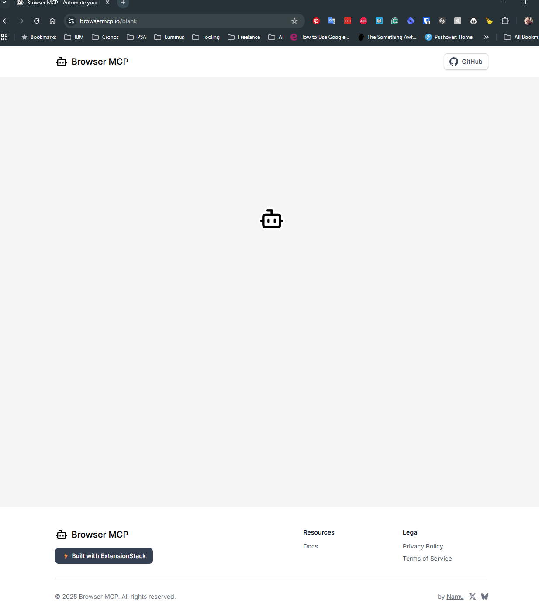

# Enhance home assistant with claude

## get claude
Download claude code
winget install Anthropic.ClaudeCode

download claude desktop
https://claude.com/download

## interact with ha

### chrome mcp
#### chrome
https://chromewebstore.google.com/detail/browser-mcp-automate-your/bjfgambnhccakkhmkepdoekmckoijdlc?utm_source=ext_app_menu

open plugin and connect, starts a session




#### node.js

Install node.js
https://nodejs.org/

Let the extensive install finish

#### claude

In claude, add the mcp

claude_desktop_config.json
```json
{
  "browsermcp": {
    "command": "npx",
    "args": ["-y", "@modelcontextprotocol/server-puppeteer"]
  }
}
```

Restart

You should see it showing up as an avaliable connector


### ha mcp
install ha 2025.2+