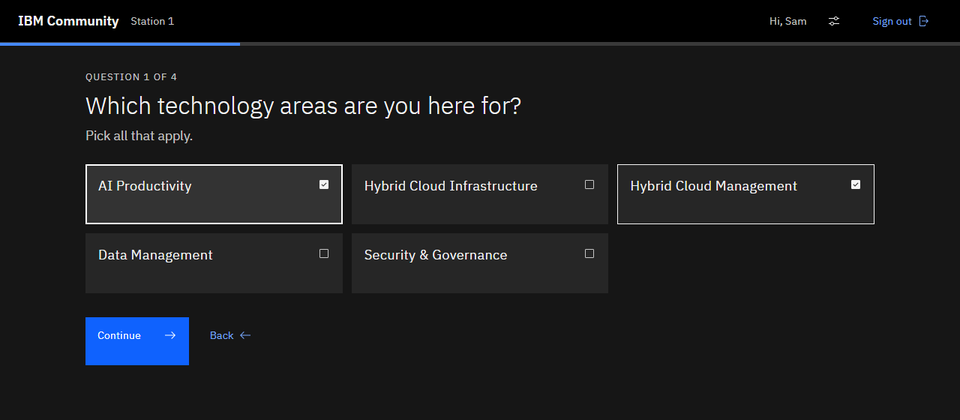
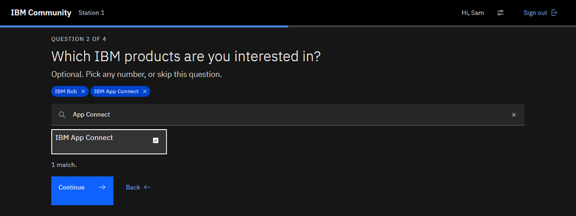
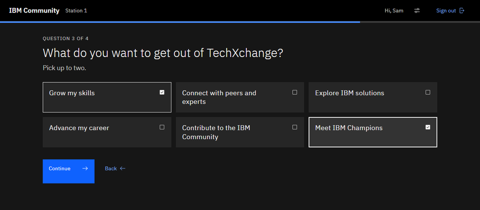
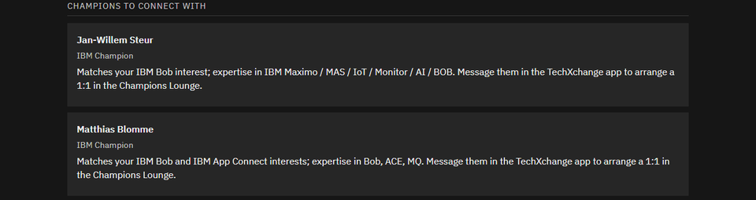

<!--
First draft. Intro is yours (with the blog-buddy fixes); the sections below it are
written from verified notes, so check tone and cut what you don't want.

Sources for the booth facts:
- notes/meetings/2026-09-21-ibm-champions-working-group-kickoff-onenote.md
  (Learn to Earn journey, location, laptops, go-live time)
- D:/Projects/Bob/txc26-growth-blueprint (the prototype; screenshots taken from a local
  run on 2026-09-28, branch fix/main-repairs-and-pass-on-sign-in, mocked sign-in and
  mocked LLM text)
- Planner skill: D:/GIT/bobmodes/bobmodes/techxchange-planner, public repo
  https://github.com/matthiasblomme/bobmodes

Publishing: everywhere (own blog + IBM Community), but Jan Willem reviews it first.

Check before publishing:
- Screenshots are the prototype with mocked sign-in ("Hi, Sam") and mocked text. The
  booth build may look different by the event. Retake closer to the date if it changed.
- img_5.png is the Champions section cropped to Jan Willem and you (Juan Martin cut off).
- The privacy line (no name or email stored, records deleted 30 days after the event)
  is the prototype's consent text. Confirm it still reads like that in the booth build.
- The name wall is from you, not from the kickoff note.
-->

# Too many sessions? The IBM Champions built you a planner

For everybody going to TechXchange: congratulations. For those of you who aren't going: well, you're missing out. (To paraphrase Samson, an old Flemish children's TV show. Google it.)

> "When I get sad, I stop being sad and be awesome instead." - Barney, How I Met Your Mother

There's so much happening at the event that it's hard to build a proper agenda around what you like, what you want to see, and how much time you have at the venue. So you don't spend your first morning scrolling through a thousand sessions, the IBM Champions community is building a blueprint helper for you.

It's an app you'll find at the IBM Community booth, where you can build your own TechXchange blueprint based on your interests, when you're there, and what you want to do. Four questions, three minutes, and you have your personalized event plan. Finish it and your name goes up on the wall, and there's a headshot and a giveaway in it for you.

## Where to find it

The IBM Community booth is in the Advocacy neighborhood of the Sandbox, diagonally across from the Champions Lounge. Look for a lab-style table with six laptops and a monitor next to it explaining what to do.

It goes live when the Sandbox opens, Monday October 26 at 6 p.m.

The app is built with IBM Bob, by Jan Willem Steur, myself, and a group of testers who clicked through it more times than they'd like to admit. Champions building something for the rest of the community, which is more or less the point of being a Champion.

## Four questions, three minutes

You sign in with your IBMid through the IBM Community, and you sign out again at the end. The booth staff will make sure you did, so the next person doesn't end up with your blueprint.

Then it's four questions:

1. Which technology areas are you here for? These match the conference tracks.
2. Which IBM products are you interested in? Optional, and searchable, so you don't have to scroll to find MQ or App Connect.
3. What do you want to get out of TechXchange? Pick up to two: grow your skills, meet IBM Champions, advance your career, and so on.
4. Which days are you there?

Don't rush that last one. It only recommends sessions on days you're around, and never one that has already ended. No point in planning your Tuesday around a session that finished on Monday.

It doesn't store your name or email. Your answers and your blueprint are kept for reporting, and the individual records are deleted 30 days after the event.

The screenshots are from the prototype, so the version at the booth might look a bit different.

## What you walk away with

Your blueprint starts with a short summary of what you told it, and then gets to the useful part:

- **Sessions to prioritise**, per day, each with the reason it was picked. So you know why it's on your list, not just that it is.
- **IBM Champions to connect with**, matched on your interests, so you can set up a 1:1 in the Champions Lounge.
- **IBM Community groups to join**, topic groups and user groups, to keep the conversation going after the event.
- **Your next 30 minutes**: your first session, and where the lounge and the wall are.
- **One thing to do now**, if you want: a first post in one of those groups.

At the end you get a QR code and a pass code to take with you. Scan it with your phone and you have your blueprint in your pocket. Show the code at the headshot and giveaway station.

*[screenshot placeholder: the pass / QR "Take it with you" block from the booth build (the local one shows a localhost URL)]*

## What happens after your blueprint

The blueprint is one step of the IBM Community booth's Learn to Earn journey:

1. Sign up for the IBM Community at the welcome desk.
2. Build your blueprint.
3. Add your ideas to the IBM Community wall, what you'd like to see in the community. There's a giant Jenga game in the same area, if you need a break.
4. Get your professional headshot and a giveaway.

Complete it and your name goes up on the wall. And you have a decent headshot for your LinkedIn profile, which, judging by some profiles, a lot of people could use.

*[photo placeholder: the booth itself, once it's set up - optional, for a post-event update]*

## Can't wait?

If you want to start planning now, I have something for that too. Back in August I built a TechXchange planner as a Claude Code skill. You'll find it, with its README, in my public repo: [techxchange-planner](https://github.com/matthiasblomme/bobmodes/tree/main/bobmodes/techxchange-planner). Copy the folder into `~/.claude/skills/` and ask Claude to plan your TechXchange.

It pulls the full session catalog through the RainFocus API behind the catalog page, together with the agenda and FAQ pages. The last time I ran it, that was 1054 activities. It builds a profile of what you're interested in, from your AI chat history, from a short description of yourself, or by asking you a few questions. Then it makes a personal agenda that fits the time slots, with ranked alternates. Run it again when times change and it checks your picks for clashes.

But it's a stripped-down version of what's waiting at the booth. The planner gives you sessions, and that's it. No Champions to meet, no groups to join, no headshot, no giveaway, and no name on the wall. You also need Claude Code, and a bit of patience with a scraper.

*[screenshot placeholder: planner skill output - a slice of the generated agenda note, your own picks blurred or a demo profile]*

So use it to get a head start, and then come to the booth for the rest. Three minutes, and the kiosk does the scrolling for you.

---

Written by [Matthias Blomme](https://www.linkedin.com/in/matthiasblomme/)

\#IBMChampion \
\#TechXchange
