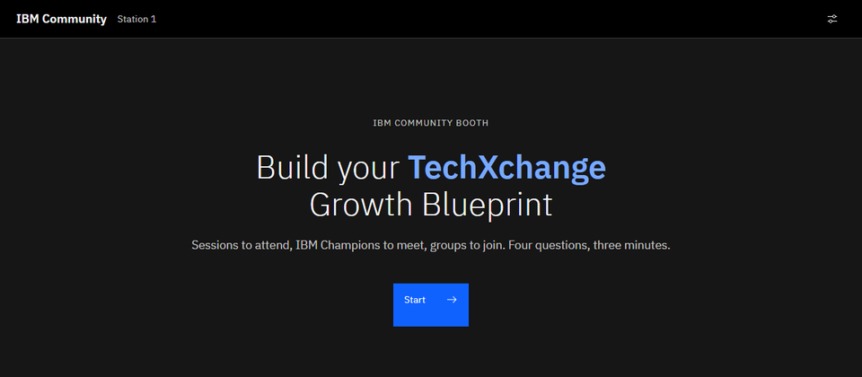
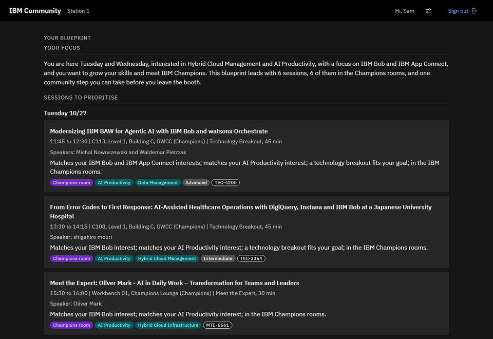
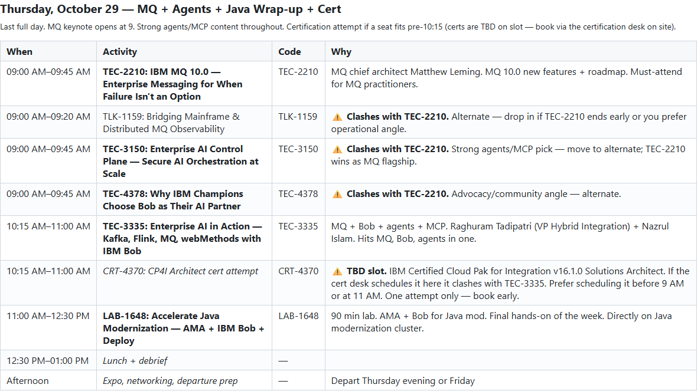

# Too many sessions? The IBM Champions built you a planner

For everybody going to TechXchange: congratulations. For those of you who aren't going: well, you're missing out. (To paraphrase an old Flemish children's TV show.)

There's so much happening at the event that it's hard to build a proper agenda around what you like, what you want to see, and how much time you have at the venue. So you don't spend your first morning scrolling through 1137 sessions, the IBM Champions community built a blueprint helper just for you. You'll find it at the IBM Community booth.

Tell it what you're interested in, when you're there and what you want to get out of the week, and it builds your own TechXchange blueprint. Four questions, three minutes, done. Your name goes up on the wall, and if you do the rest of the booth journey too, you might just walk away with a professional headshot. And who knows, maybe there even is a giveaway.

## Where to find it

The booth is in the Advocacy neighborhood of the Sandbox, diagonally across from the Champions Lounge (a bunch of people in blue jackets). Look for the table with six laptops, and a monitor explaining what to do. That monitor is also used for a couple of blogging workshops, so definetly check the session catalog for those.

It opens together with the Sandbox, Monday October 26 at 6 p.m.

Build your blueprint: 



## What you get

Sign in with your IBMid, tell it what you're into, what you want out of the week and which days you're there. So instead of browsing the catalog, decoding topic groups and guessing who to meet, you get a plan:

- sessions worth your time, Champion-led sessions and AMAs first. Only on days you're there, nothing that's already over, and no two at the same time.
- IBM Champions to go talk to. Only the ones who opted in, so they're happy to meet you for a 1:1 in the Champions Lounge or the booth lounge. Send them a message in the TechXchange mobile app to set it up.
- IBM Community groups to join.
- what to do in the next 30 minutes.

Every pick comes with the reason it's on your list.

Before you leave the laptop, you do one thing in the community right there: join a group or post a question. Then you get a QR code. It opens your blueprint on your phone, and it's your proof at the headshot station. The rest you'll see at the booth. Not going to give away (hint) everything just yet.



>  The screenshots are from the prototype, so the version at the booth might look a bit different.

## What happens after your blueprint

The blueprint is one step of the IBM Community booth's __Learn to Earn journey__, built around this year's __Build with Purpose__ theme:

1. Sign up for the IBM Community at the welcome desk, if you are not a member yet (this is a requirement).
2. Build your blueprint.
3. Add your ideas to the IBM Community wall, what you'd like to see in the community. There's a giant Jenga game in the same area, if you need a break.
4. Earn your professional headshot..

There's nothing to win, but you can earn. You walk away with a decent headshot for your LinkedIn profile, which, judging by some profiles, a lot of people could use.

## Who built it

This is an IBM Champions project. The IBM Community team asked the Champions to build the booth activation, and a working group of Champions picked it up. Champions building something for the rest of the community. Isn't that what being a Champion is about?

Two of us did the building, with IBM Bob: Jan-Willem Steur ([LinkedIn](https://www.linkedin.com/in/janwillemsteur/), [IBM Community](https://community.ibm.com/community/user/champion-directory/expert?UserKey=95a8c58f-a884-4d11-9220-02653c7816ad)) and myself ([LinkedIn](https://www.linkedin.com/in/matthiasblomme/), [IBM Community](https://community.ibm.com/community/user/people/matthias-blomme)).

But we didn't do it alone. Kristin Rangel ([LinkedIn](https://www.linkedin.com/in/kristin-rangel-a958b779/), [IBM Community](https://community.ibm.com/community/user/profile/contributions/contributions-list?UserKey=d1276cd1-0b56-47ec-8b14-bc967bd97a44)) led the working group and ran the testing. Kat Jarvis ([LinkedIn](https://www.linkedin.com/in/catherine-kat-jarvis/), [IBM Community](TODO-kat-community-profile)) from the IBM Community team got the whole thing started and kept it moving on the IBM side. And then there are the testers, FJ, Steve, Armin, Philip, Michael and Nezi, who clicked through it more times than they'd like to admit. Thanks, all of you.

Do you fancy helping out on the next one? Then have a look at the IBM Champions program. The [IBM Champions program overview](https://www.ibm.com/community/champions-program/) explains what it is and how you get nominated. Writing blogs like this one is one way to get there.

## Can't wait?

If you want to start planning now, I have something for that too. It's a Bob skill that scrapes the TechXchange session catalog, works out what you care about, and builds a day-by-day plan with alternates. Re-run it when the schedule changes and it tells you which picks clash. It's in my public skills repo, folder [techxchange-planner](https://github.com/matthiasblomme/bobmodes/tree/main/bobmodes/techxchange-planner), and the whole story is in [Let Bob plan your TechXchange week](../techxchange-planner-skill/techxchange-planner-skill.md).

I used it for my own week. Two talks to give, the champion program on top, and more ACE and MQ sessions than I could ever attend. This is my Tuesday, as Bob planned it:



Drop the folder in `~/.bob/skills/`, open Bob, and ask:

```
Which sessions should I attend at TechXchange?
```

But it's a stripped-down version of what's waiting at the booth. The planner gives you sessions, and that's it. No Champions to meet, no groups to join, no headshot, no giveaway, and no name on the wall. 

So use it to get a head start, and then come to the booth for the rest. Three minutes, and the kiosk does the scrolling for you.

And for those of you who aren't going:

> "When I get sad, I stop being sad and be awesome instead." - Barney

---

Written by [Matthias Blomme](https://www.linkedin.com/in/matthiasblomme/)

\#IBMChampion \
\#TechXchange \
\#Bob
